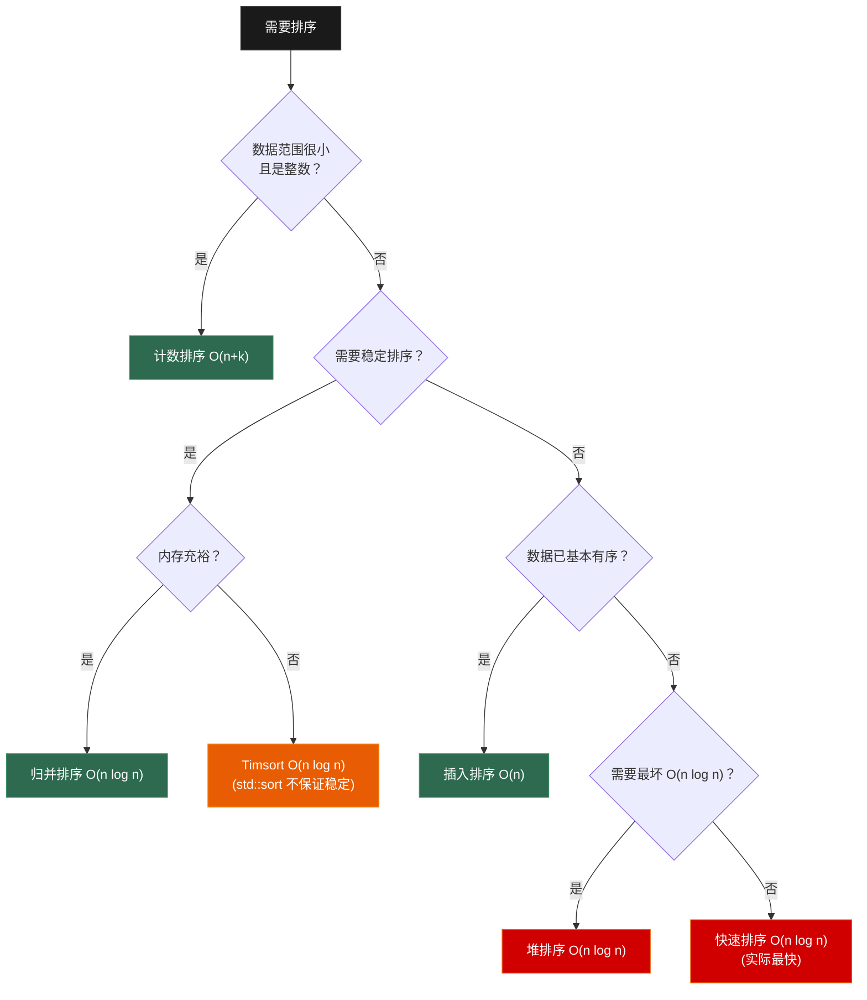
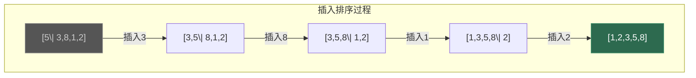
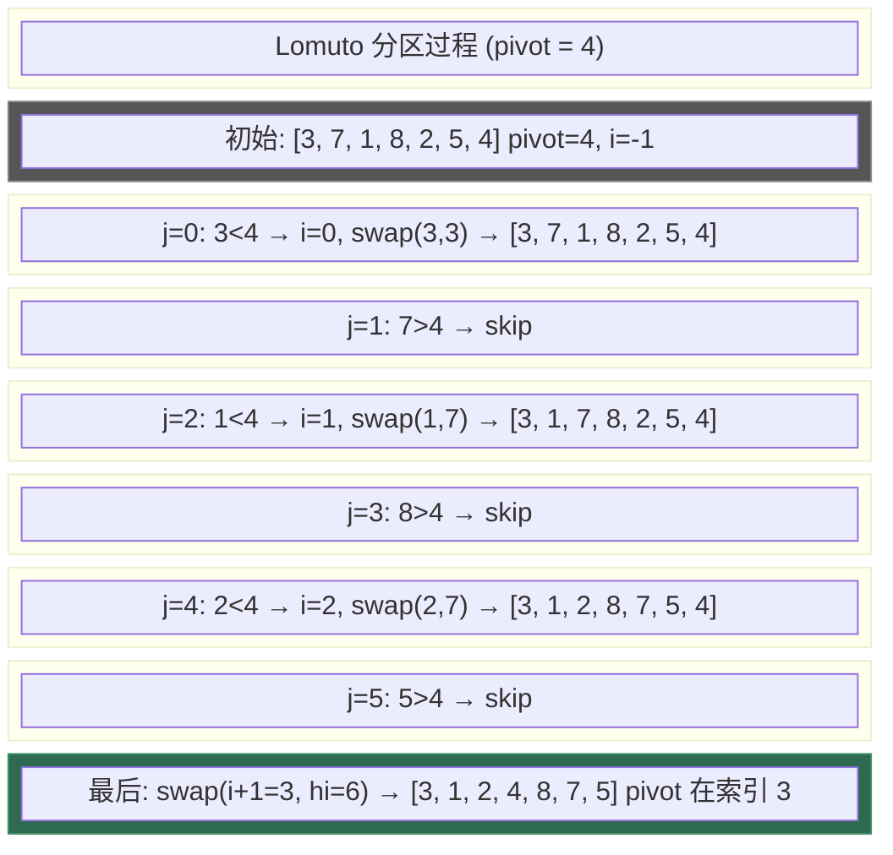
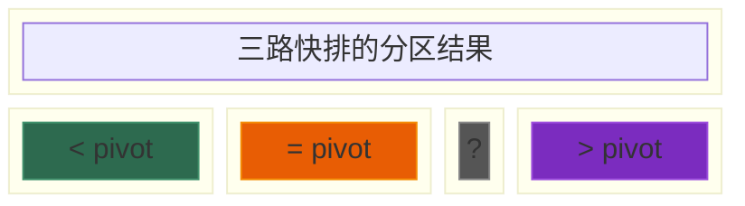
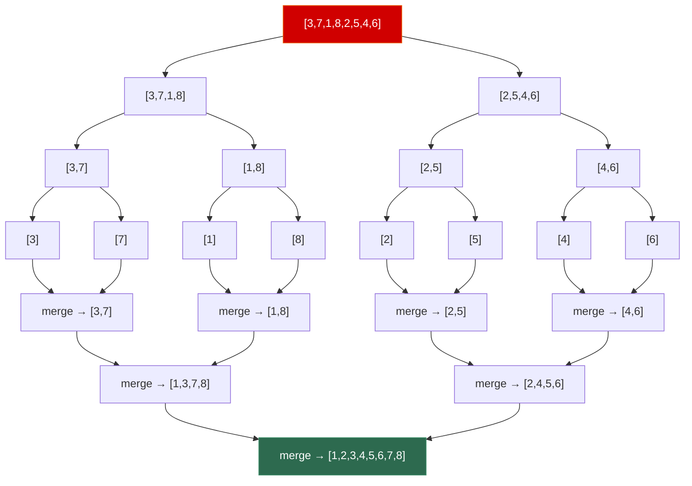
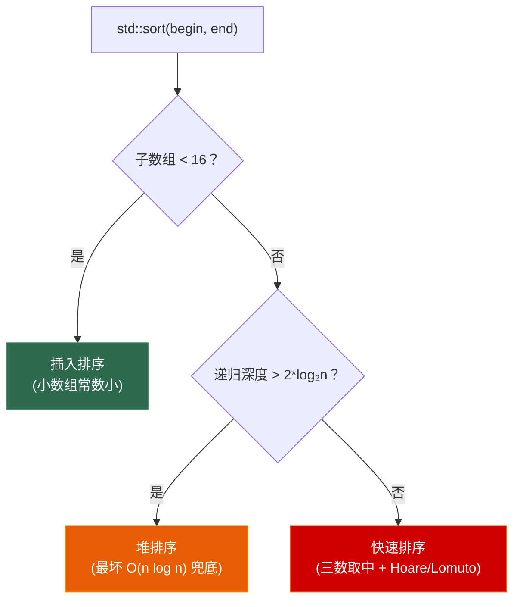

# 第一章 排序算法全家桶

> **一句话理解**：排序不是背代码——是理解每种算法**为什么这样设计**、**在什么场景下最优**、以及**缓存行为如何影响实际性能**。

> 📋 前置知识：数据结构 Ch1（数组）、Ch6.4（堆）

---

## 1.1 概念直觉 —— What & Why

### 为什么排序是算法面试的第一道门槛？

排序是少数几个**每个程序员都必须手写过的算法**。它考察的能力非常全面：

- **分治思想**（快排、归并）—— 算法设计的核心范式
- **数据结构运用**（堆排用堆，桶排用哈希）—— 知识迁移能力
- **复杂度分析**（为什么 O(n log n) 是比较排序的下界）—— 理论功底
- **边界处理**（partition 的 off-by-one、递归终止条件）—— 代码基本功

面试官让候选人写快排，三分钟就能判断这个人有没有扎实的算法基础。

### 三个核心概念

在进入具体算法之前，先建立三个贯穿全章的概念：

**1. 稳定性 (Stability)**

```
输入: [(A, 3), (B, 1), (C, 3), (D, 2)]
按数字排序后:
  稳定排序: [(B, 1), (D, 2), (A, 3), (C, 3)]  ← A 仍在 C 前面（相对顺序不变）
  不稳定排序: [(B, 1), (D, 2), (C, 3), (A, 3)]  ← C 跑到了 A 前面
```

> 稳定性不是"对错"问题，是**需求**问题。UI 中的多级排序（先按在线状态排，再按等级排）必须用稳定排序，否则第二次排序会打乱第一次的结果。

**2. 原地排序 (In-place)**

- **原地**：只使用 O(1) 额外空间（如快排、堆排）
- **非原地**：需要 O(n) 额外空间（如归并排序的标准实现）

游戏开发中内存紧张时，原地性是重要考量。

**3. 比较排序的下界**

> 所有基于**两两比较**的排序算法，时间复杂度下界是 **Ω(n log n)**。证明：n 个元素的排列有 n! 种可能，每次比较最多排除一半可能，需要 log₂(n!) ≈ n log n 次比较（决策树模型）。

非比较排序（计数/桶/基数）可以突破这个下界达到 O(n)，但依赖于数据本身的特性。

---

## 1.2 原理图解

### 排序算法决策树



### 稳定性一览

```
稳定 (Stable)                    不稳定 (Unstable)
──────────────────────────      ──────────────────────────
冒泡排序    Bubble Sort          快速排序    Quick Sort
插入排序    Insertion Sort       堆排序      Heap Sort
归并排序    Merge Sort           选择排序    Selection Sort
计数排序    Counting Sort        希尔排序    Shell Sort
桶排序      Bucket Sort
基数排序    Radix Sort
```

---

## 1.3 核心算法实现

### 1.3.1 O(n²) 排序家族

O(n²) 排序虽然"慢"，但它们是理解更高级排序的垫脚石，且在小数据量或基本有序的场景下实际表现优秀。

#### 冒泡排序 (Bubble Sort)

```cpp
// 冒泡排序：每次把最大的"冒"到最后
// 优化：如果一轮没有交换，说明已经有序，提前退出
void bubbleSort(std::vector<int>& arr) {
    int n = arr.size();
    for (int i = 0; i < n - 1; ++i) {
        bool swapped = false;
        for (int j = 0; j < n - 1 - i; ++j) {  // -i 是因为最后 i 个已排好
            if (arr[j] > arr[j + 1]) {
                std::swap(arr[j], arr[j + 1]);
                swapped = true;
            }
        }
        if (!swapped) break;  // 本轮无交换，已有序
    }
}
```

| 维度 | 值 | 说明 |
|------|-----|------|
| 最好 | O(n) | 已有序，一轮扫描退出 |
| 最坏 | O(n²) | 逆序，每轮都要交换 |
| 平均 | O(n²) | |
| 空间 | O(1) | 原地 |
| 稳定 | ✅ | 相等元素不交换 |

#### 插入排序 (Insertion Sort)

```cpp
// 插入排序：像整理扑克牌，把每张牌插入到已排序部分的正确位置
// 对于"基本有序"的数组，插入排序接近 O(n)——这是它最大的价值
void insertionSort(std::vector<int>& arr) {
    int n = arr.size();
    for (int i = 1; i < n; ++i) {
        int key = arr[i];
        int j = i - 1;
        // 向右移动所有大于 key 的元素
        while (j >= 0 && arr[j] > key) {
            arr[j + 1] = arr[j];
            --j;
        }
        arr[j + 1] = key;
    }
}
```



> `|` 左边是已排序部分，右边是待排序部分。每轮把待排序部分的第一个元素插入到已排序部分的正确位置。

| 维度 | 值 | 说明 |
|------|-----|------|
| 最好 | O(n) | 已有序，每轮只比较一次 |
| 最坏 | O(n²) | 逆序 |
| 平均 | O(n²) | |
| 空间 | O(1) | 原地 |
| 稳定 | ✅ | 相等元素不移动 |

#### 选择排序 (Selection Sort)

```cpp
// 选择排序：每轮选出最小的，放到最前面
// 优点：交换次数最少（每轮最多 1 次交换）
void selectionSort(std::vector<int>& arr) {
    int n = arr.size();
    for (int i = 0; i < n - 1; ++i) {
        int min_idx = i;
        for (int j = i + 1; j < n; ++j) {
            if (arr[j] < arr[min_idx]) {
                min_idx = j;
            }
        }
        std::swap(arr[i], arr[min_idx]);
    }
}
```

| 维度 | 值 | 说明 |
|------|-----|------|
| 最好/最坏/平均 | 均为 O(n²) | 无论数据如何，都要比较所有元素 |
| 空间 | O(1) | 原地 |
| 稳定 | ❌ | 交换可能破坏相等元素的相对顺序 |

> 💡 **面试中的表述**：「三种 O(n²) 排序各有存在价值：冒泡适合教学演示，插入排序在数据基本有序时接近 O(n)（Timsort 底层就用插入排序处理小片段），选择排序交换次数最少——但实际工程中几乎不用选择排序。」

---

### 1.3.2 快速排序 —— 事实上的工业标准

快速排序是**实际应用中最快的通用排序算法**。`std::sort` 的内部实现就是内省排序（Introsort），其核心是快排。

#### 核心思想

```
1. 选一个 pivot（基准元素）
2. 分区（partition）：把小于 pivot 的放左边，大于的放右边
3. 递归排序左右两部分
```

#### Lomuto 分区 —— 最简洁的写法

```cpp
// Lomuto 分区：维护一个"小于区的右边界"指针
// 简洁易懂，面试首选
int partitionLomuto(std::vector<int>& arr, int lo, int hi) {
    int pivot = arr[hi];            // 选最后一个元素为 pivot
    int i = lo - 1;                 // "小于区"的右边界

    for (int j = lo; j < hi; ++j) {
        if (arr[j] < pivot) {       // ⚠️ 用 < 而非 <=，保证稳定性相关行为
            ++i;
            std::swap(arr[i], arr[j]);
        }
    }
    std::swap(arr[i + 1], arr[hi]); // 把 pivot 放到正确位置
    return i + 1;                    // 返回 pivot 的最终位置
}

void quickSort(std::vector<int>& arr, int lo, int hi) {
    if (lo >= hi) return;
    int p = partitionLomuto(arr, lo, hi);
    quickSort(arr, lo, p - 1);
    quickSort(arr, p + 1, hi);
}
```



#### Hoare 分区 —— 原始快排的分区方案

```cpp
// Hoare 分区：左右指针向中间逼近
// 比 Lomuto 少约 1/3 的交换次数，但实现容易出错
int partitionHoare(std::vector<int>& arr, int lo, int hi) {
    int pivot = arr[lo];                    // 选第一个元素
    int i = lo - 1, j = hi + 1;

    while (true) {
        do { ++i; } while (arr[i] < pivot);  // 找左边 >= pivot 的
        do { --j; } while (arr[j] > pivot);  // 找右边 <= pivot 的
        if (i >= j) return j;                // 指针相遇
        std::swap(arr[i], arr[j]);
    }
}
```

**Lomuto vs Hoare 对比**：

| 维度 | Lomuto | Hoare |
|------|--------|-------|
| 交换次数 | ~n/2 次（平均） | ~n/3 次（平均，更少） |
| 实现难度 | 简单，不易出错 | 边界条件容易写错 |
| pivot 位置 | 返回 pivot 的最终索引 | 返回分界点，pivot 不一定在分界点上 |
| 面试推荐 | ✅ 优先选 Lomuto | 可作为优化提及 |

#### 快排的三大优化

**优化 1：三数取中 —— 防止最坏情况**

```cpp
// pivot 选 arr[lo] 或 arr[hi] 在已排序数组上会退化到 O(n²)
// 三数取中：从 arr[lo], arr[mid], arr[hi] 中选中间值做 pivot
int medianOfThree(std::vector<int>& arr, int lo, int hi) {
    int mid = lo + (hi - lo) / 2;
    if (arr[lo] > arr[mid]) std::swap(arr[lo], arr[mid]);
    if (arr[lo] > arr[hi])  std::swap(arr[lo], arr[hi]);
    if (arr[mid] > arr[hi]) std::swap(arr[mid], arr[hi]);
    // 现在 arr[mid] 是三数的中间值
    std::swap(arr[mid], arr[hi]);  // 把 pivot 放到最后（配合 Lomuto）
    return arr[hi];
}
```

**优化 2：三路快排 —— 处理大量重复元素**

```cpp
// 荷兰国旗问题：把数组分成 [< pivot] [= pivot] [> pivot] 三段
// 当重复元素很多时，三路快排远优于普通快排
void quickSort3Way(std::vector<int>& arr, int lo, int hi) {
    if (lo >= hi) return;

    int pivot = arr[lo];
    int lt = lo;        // [lo, lt-1]  < pivot
    int gt = hi;        // [gt+1, hi]  > pivot
    int i = lo + 1;     // [lt, i-1]   = pivot

    while (i <= gt) {
        if (arr[i] < pivot) {
            std::swap(arr[lt], arr[i]);
            ++lt;
            ++i;
        } else if (arr[i] > pivot) {
            std::swap(arr[i], arr[gt]);
            --gt;
            // 注意：i 不自增，因为换过来的 arr[gt] 还没检查
        } else {
            ++i;
        }
    }

    quickSort3Way(arr, lo, lt - 1);
    quickSort3Way(arr, gt + 1, hi);
}
```



**优化 3：尾递归优化 + 小数组切换插入排序**

```cpp
void quickSortOptimized(std::vector<int>& arr, int lo, int hi) {
    while (lo < hi) {
        // 小数组切插入排序（常数因子小，对缓存友好）
        if (hi - lo < 16) {
            insertionSortRange(arr, lo, hi);
            return;
        }

        int pivot = medianOfThree(arr, lo, hi);
        int p = partitionLomuto(arr, lo, hi);

        // 尾递归优化：先递归小的那边，大的那边用循环
        if (p - lo < hi - p) {
            quickSortOptimized(arr, lo, p - 1);
            lo = p + 1;        // 大的那边在下一轮循环中处理
        } else {
            quickSortOptimized(arr, p + 1, hi);
            hi = p - 1;
        }
    }
}
```

> 💡 **面试中的表述**：「快排平均 O(n log n)，最坏 O(n²) 但可通过随机 pivot 或三数取中避免。快排实际比归并和堆排快的原因有三：一是常数因子小（只有比较和交换），二是缓存局部性极好（原地操作，连续访问），三是尾递归优化后递归深度为 O(log n)。」

---

### 1.3.3 归并排序 —— 稳定 O(n log n) 的标杆

归并排序是**稳定排序中效率最高的通用算法**。C++17 中 `std::stable_sort` 通常用归并排序实现。

#### 核心思想

```
1. 递归地把数组分成两半，直到每段只有 1 个元素（天然有序）
2. 合并（merge）两个有序数组，产生一个更长的有序数组
3. 层层归并，最终得到完全有序的数组
```



#### 标准实现

```cpp
// 合并两个有序子数组 [lo..mid] 和 [mid+1..hi]
void merge(std::vector<int>& arr, int lo, int mid, int hi) {
    std::vector<int> left(arr.begin() + lo, arr.begin() + mid + 1);
    std::vector<int> right(arr.begin() + mid + 1, arr.begin() + hi + 1);

    int i = 0, j = 0, k = lo;
    while (i < left.size() && j < right.size()) {
        arr[k++] = (left[i] <= right[j]) ? left[i++] : right[j++];
        //               ↑ 用 <= 保证稳定性！
    }
    while (i < left.size())  arr[k++] = left[i++];
    while (j < right.size()) arr[k++] = right[j++];
}

void mergeSort(std::vector<int>& arr, int lo, int hi) {
    if (lo >= hi) return;
    int mid = lo + (hi - lo) / 2;
    mergeSort(arr, lo, mid);
    mergeSort(arr, mid + 1, hi);
    merge(arr, lo, mid, hi);
}
```

| 维度 | 值 | 说明 |
|------|-----|------|
| 最好/最坏/平均 | 均为 O(n log n) | 无论数据如何，都要完整分治 |
| 空间 | O(n) | 需要临时数组存放合并结果 |
| 稳定 | ✅ | `left[i] <= right[j]` 的 `<=` 是关键 |
| 适用 | 链表排序（不需要额外空间！） | 链表 merge 只需改指针 |

> 💡 **面试中的表述**：「归并排序是稳定 O(n log n) 的标杆。它的代价是 O(n) 额外空间。适合需要稳定性的场景——比如对链表排序，归并排序不需要额外空间，只需修改指针。`std::stable_sort` 的底层就是归并排序。」

---

### 1.3.4 堆排序 —— 最坏 O(n log n) 的原地选择

堆排序的核心是利用**堆这个数据结构**来实现选择排序的优化——每次取最大值从 O(n) 降到 O(log n)。

> 堆的详细原理见 [数据结构 Ch6.4](../data_structure/tree/06_04_heap)。

#### 核心思想

```
1. 建堆 (heapify)：把数组原地构建成最大堆 —— O(n)
2. 逐个取出堆顶（最大值），放到数组末尾
3. 调整剩余部分维持堆性质 —— O(log n) 每次
```

```cpp
// 下沉操作：维护以 root 为根的子树满足最大堆性质
// 前提：root 的左右子树已经是合法堆
void heapifyDown(std::vector<int>& arr, int n, int root) {
    while (true) {
        int largest = root;
        int left  = 2 * root + 1;
        int right = 2 * root + 2;

        if (left  < n && arr[left]  > arr[largest]) largest = left;
        if (right < n && arr[right] > arr[largest]) largest = right;

        if (largest == root) break;  // 堆性质已满足

        std::swap(arr[root], arr[largest]);
        root = largest;              // 继续向下调整
    }
}

void heapSort(std::vector<int>& arr) {
    int n = arr.size();

    // 1. 建堆：从最后一个非叶子节点开始，自底向上 heapify
    //    时间复杂度 O(n)（而非看起来的 O(n log n)）
    for (int i = n / 2 - 1; i >= 0; --i) {
        heapifyDown(arr, n, i);
    }

    // 2. 逐个取最大值
    for (int i = n - 1; i > 0; --i) {
        std::swap(arr[0], arr[i]);   // 把堆顶（当前最大值）换到末尾
        heapifyDown(arr, i, 0);      // 缩小堆，调整
    }
}
```

**建堆为什么是 O(n) 而非 O(n log n)？**

```
建堆时自底向上调用 heapifyDown：

第 k 层节点数: ~n/2^{k+1}（满二叉树的第 k 层从根算起）
第 k 层节点下沉最多: k 次

总操作次数 = Σ(k * n/2^{k+1}) = n * Σ(k/2^{k+1}) < n * 1 = O(n)

直观理解：
- 大部分节点在底层，下沉次数很少
- 只有根节点下沉 log n 次，但它只有一个
```

| 维度 | 值 | 说明 |
|------|-----|------|
| 最好/最坏/平均 | 均为 O(n log n) | 无退化风险 |
| 空间 | O(1) | 原地排序 |
| 稳定 | ❌ | 父子交换会破坏相对顺序 |
| 实际速度 | 通常慢于快排 | 缓存不友好（父子节点在数组中距离远） |

---

### 1.3.5 非比较排序 —— 突破 O(n log n) 的壁垒

非比较排序不通过两两比较来确定顺序，而是利用**数据本身的数值特性**直接计算位置。

#### 计数排序 (Counting Sort)

```cpp
// 计数排序：统计每个值出现的次数，然后按序输出
// 适用条件：数据范围 [minVal, maxVal] 已知且不大
// 时间复杂度 O(n + k)，k = maxVal - minVal + 1
void countingSort(std::vector<int>& arr) {
    if (arr.empty()) return;

    int minVal = *std::min_element(arr.begin(), arr.end());
    int maxVal = *std::max_element(arr.begin(), arr.end());
    int range = maxVal - minVal + 1;

    std::vector<int> count(range, 0);

    // 计数
    for (int x : arr) count[x - minVal]++;

    // 按序写回
    int idx = 0;
    for (int i = 0; i < range; ++i) {
        while (count[i]-- > 0) {
            arr[idx++] = i + minVal;
        }
    }
}
```

#### 基数排序 (Radix Sort)

```cpp
// 基数排序：从低位到高位，对每一位做稳定的计数排序
// O(d * (n + k))，d = 位数，k = 基数（通常 10 或 256）
// 关键：每一位的排序必须是稳定的！
void radixSort(std::vector<int>& arr) {
    if (arr.empty()) return;

    int maxVal = *std::max_element(arr.begin(), arr.end());

    // 从低位到高位，对每一位做计数排序
    for (int exp = 1; maxVal / exp > 0; exp *= 10) {
        std::vector<int> output(arr.size());
        std::vector<int> count(10, 0);

        // 按当前位计数
        for (int x : arr) count[(x / exp) % 10]++;

        // 前缀和：确定每个数字在 output 中的位置
        for (int i = 1; i < 10; ++i) count[i] += count[i - 1];

        // 逆序遍历（保证稳定性！）
        for (int i = arr.size() - 1; i >= 0; --i) {
            int digit = (arr[i] / exp) % 10;
            output[--count[digit]] = arr[i];
        }

        arr = std::move(output);
    }
}
```

> 💡 **逆序遍历为什么保证稳定性？** 对于同一位上数字相同的元素，后遍历到的应该放在更后面的位置。逆序遍历时，count 前缀和从大到小递减，自然保证了这一点。

#### 桶排序 (Bucket Sort)

```cpp
// 桶排序：把数据分散到多个桶，每个桶内做插入排序，最后合并
// 假设数据均匀分布，时间复杂度 O(n)
// 适合浮点数排序（无法直接用计数排序）
void bucketSort(std::vector<float>& arr) {
    int n = arr.size();
    if (n == 0) return;

    // 创建 n 个桶
    std::vector<std::vector<float>> buckets(n);

    // 把元素放入对应的桶
    for (float x : arr) {
        int idx = static_cast<int>(n * x);  // 假设 x ∈ [0, 1)
        buckets[idx].push_back(x);
    }

    // 每个桶内排序
    for (auto& bucket : buckets) {
        std::sort(bucket.begin(), bucket.end());
    }

    // 合并
    int idx = 0;
    for (const auto& bucket : buckets) {
        for (float x : bucket) {
            arr[idx++] = x;
        }
    }
}
```

| 算法 | 时间 | 空间 | 稳定 | 适用条件 |
|------|------|------|------|---------|
| 计数排序 | O(n + k) | O(k) | ✅ | 整数，范围 k 不大 |
| 基数排序 | O(d·(n + k)) | O(n + k) | ✅ | 整数/定长字符串 |
| 桶排序 | O(n) 平均 | O(n + k) | ✅ | 数据均匀分布 |

---

## 1.4 排序算法横评

### 时空复杂度速查

| 算法 | 最好 | 平均 | 最坏 | 空间 | 稳定 |
|------|------|------|------|------|------|
| 冒泡排序 | O(n) | O(n²) | O(n²) | O(1) | ✅ |
| 插入排序 | O(n) | O(n²) | O(n²) | O(1) | ✅ |
| 选择排序 | O(n²) | O(n²) | O(n²) | O(1) | ❌ |
| **快速排序** | O(n log n) | O(n log n) | O(n²) | O(log n) | ❌ |
| **归并排序** | O(n log n) | O(n log n) | O(n log n) | O(n) | ✅ |
| **堆排序** | O(n log n) | O(n log n) | O(n log n) | O(1) | ❌ |
| 计数排序 | O(n + k) | O(n + k) | O(n + k) | O(k) | ✅ |
| 基数排序 | O(d·(n+k))| O(d·(n+k))| O(d·(n+k))| O(n+k) | ✅ |
| Timsort | O(n) | O(n log n) | O(n log n) | O(n) | ✅ |

### 面试选型口诀

> **需要稳定** → 归并排序（或 Timsort）
> **需要原地** → 快排（平均最快）或堆排（最坏 O(n log n)）
> **数据基本有序** → 插入排序（接近 O(n)）
> **整数且范围小** → 计数排序
> **链表排序** → 归并排序（O(1) 额外空间，只需改指针）

### 为什么 std::sort 选择 Introsort？

C++ 标准库的 `std::sort` 使用**内省排序（Introsort）**：

```
Introsort = 快排 + 堆排兜底 + 小数组插入排序

1. 主体用快排（三数取中 + 三路分区）
2. 递归深度超过 2*log₂(n) 时，切换为堆排（防止快排退化的 O(n²)）
3. 子数组小于阈值（通常 16）时，切换为插入排序
```



---

## 1.5 🎮 缓存友好性与排序

> 这是算法笔记区别于普通面试资料的核心内容。游戏开发中，缓存行为往往比理论复杂度对性能的影响更大。

### 缓存的层级与代价

```
CPU 访问延迟（近似）：
┌────────────┬──────────┬───────────┐
│  L1 Cache  │ ~1 ns    │  4 cycles │
│  L2 Cache  │ ~4 ns    │ 12 cycles │
│  L3 Cache  │ ~12 ns   │ 40 cycles │
│  主存 DDR  │ ~100 ns  │ 300 cycles│
└────────────┴──────────┴───────────┘

1 次主存访问 ≈ 100 次 L1 访问
一个 Cache Line = 64 字节（现代 x86）
```

### 三种 O(n log n) 排序的缓存行为对比

```cpp
#include <vector>
#include <algorithm>
#include <chrono>
#include <iostream>

// 演示用：不同排序对同一数组的性能对比
// 实际项目中用 Google Benchmark 或 perf 更准确
void benchmark_sorts() {
    const int N = 1000000;
    std::vector<int> original(N);
    std::generate(original.begin(), original.end(), rand);

    std::vector<int> arr;

    // 快排
    arr = original;
    auto t1 = std::chrono::high_resolution_clock::now();
    std::sort(arr.begin(), arr.end());  // Introsort（主体是快排）
    auto t2 = std::chrono::high_resolution_clock::now();

    // 堆排
    arr = original;
    auto t3 = std::chrono::high_resolution_clock::now();
    std::make_heap(arr.begin(), arr.end());
    std::sort_heap(arr.begin(), arr.end());
    auto t4 = std::chrono::high_resolution_clock::now();

    // 归并（使用 std::stable_sort，底层是归并）
    arr = original;
    auto t5 = std::chrono::high_resolution_clock::now();
    std::stable_sort(arr.begin(), arr.end());
    auto t6 = std::chrono::high_resolution_clock::now();

    // 典型结果（相对耗时）：
    // 快排: 1.0x   ← 最快（缓存局部性好）
    // 归并: 1.5x   ← 慢于快排（需要额外数组 + 合并回写）
    // 堆排: 2.5x   ← 最慢（缓存局部性最差）
}
```

### 为什么快排的缓存行为远优于堆排？

```
快排的内存访问模式（Lomuto 分区）：
┌──────┬──────┬──────┬──────┬──────┬──────┐
│ < p  │ < p  │ > p  │  ?   │  ?   │ pivot│  逐个顺序扫描
└──────┴──────┴──────┴──────┴──────┴──────┘
  ↑ i                          ↑ j 向右移动
  每次访问相邻元素 → Cache Line 利用率接近 100%

堆排的内存访问模式（heapifyDown）：
         [0]
        /   \
     [1]     [2]
     /  \    /  \
   [3]  [4][5]  [6]

访问 [0] → [1] → [3] → [7] ...
在数组中：
[0][1][2][3][4][5][6][7][8]...
 ↑     ↑       ↑         ↑
 每次访问跳 log n 级距离 → 几乎每次都是 Cache Miss
```



```mermaid
graph TD
    subgraph "快排：连续访问模式"
        direction LR
        A1["[3]"] --> A2["[1]"] --> A3["[2]"] --> A4["[8]"] --> A5["[7]"] --> A6["[5]"] --> A7["[4]"]
    end

    subgraph "堆排：跳跃访问模式"
        direction LR
        B1["[8]"] -.-> B2["[3]"] -.-> B3["[7]"] -.-> B4["[1]"] -.-> B5["[5]"]
    end

    style A1 fill:#2d6a4f,stroke:#40916c,color:white
    style A2 fill:#2d6a4f,stroke:#40916c,color:white
    style A3 fill:#2d6a4f,stroke:#40916c,color:white
    style A4 fill:#2d6a4f,stroke:#40916c,color:white
    style A5 fill:#2d6a4f,stroke:#40916c,color:white
    style B1 fill:#d00000,stroke:#e85d04,color:white
    style B2 fill:#d00000,stroke:#e85d04,color:white
    style B3 fill:#d00000,stroke:#e85d04,color:white
    style B4 fill:#d00000,stroke:#e85d04,color:white
```

### Timsort —— 利用"部分有序性"的工程杰作

Timsort 是 Python 和 Java 的默认排序算法，它的核心洞察是：**真实世界的数据往往不是完全随机的——总有一些连续递增或递减的片段**。

```
Timsort 的核心策略：
1. 扫描数组，找出连续的递增/递减片段（称为 run）
2. 如果 run 太短（< 32），用插入排序扩展到 32
3. 用一个栈来管理 run，保证栈中的 run 长度按特定规则合并
4. 合并相邻的 run（用归并排序的 merge）

关键：每个 run 内部已经有序 → merge 只在 run 之间发生
      这大大减少了比较和移动的次数
```

```cpp
// Timsort 简化版的核心概念演示
// 实际 Timsort 实现约 1000 行，这里只展示 run 检测
std::vector<std::pair<int, int>> findRuns(const std::vector<int>& arr) {
    std::vector<std::pair<int, int>> runs;
    int n = arr.size();
    int i = 0;

    while (i < n) {
        int start = i;
        ++i;

        // 检测递增或递减趋势
        if (i < n && arr[i - 1] <= arr[i]) {
            while (i < n && arr[i - 1] <= arr[i]) ++i;  // 递增
        } else {
            while (i < n && arr[i - 1] > arr[i]) ++i;   // 递减
            std::reverse(arr.begin() + start, arr.begin() + i);  // 翻转为递增
        }

        // 如果 run 太短，用插入排序扩展到 minrun
        int runLen = i - start;
        if (runLen < 32 && i < n) {
            int end = std::min(start + 32, n);
            insertionSortRange(arr, start, end - 1);
            i = end;
        }

        runs.push_back({start, i - start});
    }
    return runs;
}
```

### 缓存友好性总结

| 排序算法 | 缓存局部性 | 原因 |
|---------|----------|------|
| **快速排序** | ⭐⭐⭐⭐⭐ | 顺序扫描 partition，每次都在相邻位置操作 |
| **插入排序** | ⭐⭐⭐⭐⭐ | 在已排序部分顺序移动，L1 缓存友好 |
| **归并排序** | ⭐⭐⭐ | 合并时需要读两个数组 + 写一个数组 |
| **堆排序** | ⭐ | 父子节点在数组中距离远，几乎是随机访问 |
| Timsort | ⭐⭐⭐⭐ | 利用了 run 的局部性和插入排序的缓存友好性 |

> 💡 **面试中的表述**：「快排比堆排实际快 2-3 倍的根本原因不是算法复杂度的差异——两者都是 O(n log n)。差异来自缓存行为：快排顺序扫描内存，一个 cache line 的 64 字节全部命中；堆排按完全二叉树的父子关系跳跃访问，几乎步步 cache miss。这也是为什么现代 CPU 上的性能优化，缓存友好性比理论复杂度更重要。」

---

## 1.6 高频面试题精讲

### 题目 1：数组中的第 K 个最大元素 (LeetCode 215)

> 在未排序的数组中找到第 k 个最大的元素。注意是排序后的第 k 个最大，不是第 k 个不同元素。

**思路一：快排分区（Quick Select）—— O(n) 平均**

快排的 partition 函数每次确定 pivot 的最终位置。如果 pivot 正好在第 k 个位置，它就是答案。

```cpp
// Quick Select: O(n) 平均，O(n²) 最坏
int findKthLargest(std::vector<int>& nums, int k) {
    int target = nums.size() - k;  // 第 K 大 = 排序后第 (n-k) 个（0-indexed）
    int lo = 0, hi = nums.size() - 1;

    while (lo < hi) {
        int p = partitionLomuto(nums, lo, hi);
        if (p == target) return nums[p];
        if (p < target) lo = p + 1;
        else            hi = p - 1;
    }
    return nums[lo];
}
```

**思路二：最小堆 —— O(n log k)**

维护一个大小为 k 的最小堆。遍历数组，堆大小超过 k 时弹出堆顶（最小值）。最后堆顶就是第 k 大的元素。

```cpp
int findKthLargest_heap(std::vector<int>& nums, int k) {
    std::priority_queue<int, std::vector<int>, std::greater<int>> minHeap;
    for (int x : nums) {
        minHeap.push(x);
        if (minHeap.size() > k) minHeap.pop();
    }
    return minHeap.top();
}
```

| 方法 | 时间 | 空间 | 适用场景 |
|------|------|------|---------|
| Quick Select | O(n) 平均 | O(1) | k 任意，数据量不大 |
| 最小堆 | O(n log k) | O(k) | k 很小（如 Top 100） |
| 全排序 | O(n log n) | O(1) | 需要所有元素的排位 |

> 💡 面试要主动分析两种方案的取舍——这比直接写出代码更重要。

---

### 题目 2：颜色分类 / 荷兰国旗 (LeetCode 75)

> 给定包含 0、1、2 的数组，原地排序使相同数字相邻，按 0→1→2 排列。

这道题是**三路快排**的直接应用。

```cpp
// 三指针：lt 标记 0 的右边界，gt 标记 2 的左边界，i 扫描
void sortColors(std::vector<int>& nums) {
    int lt = 0, i = 0, gt = nums.size() - 1;

    while (i <= gt) {
        if (nums[i] == 0) {
            std::swap(nums[lt], nums[i]);
            ++lt;
            ++i;
        } else if (nums[i] == 2) {
            std::swap(nums[i], nums[gt]);
            --gt;
            // i 不自增：换过来的 nums[gt] 可能是 0 或 1
        } else {
            ++i;
        }
    }
}
```

**易错点**：遇到 2 时 `i` 不自增。因为 `nums[gt]` 换过来后还没有被检查，可能还需要被换到前面去。

---

### 题目 3：排序链表 (LeetCode 148)

> 在 O(n log n) 时间、O(1) 空间下对链表排序。

数组排序的常规选择是快排，但链表排序的**最佳选择是归并排序**——因为链表 merge 不需要额外空间。

```cpp
struct ListNode {
    int val;
    ListNode* next;
    ListNode(int x) : val(x), next(nullptr) {}
};

// 快慢指针找中点（断开前后两半）
ListNode* split(ListNode* head) {
    if (!head || !head->next) return nullptr;

    ListNode* slow = head;
    ListNode* fast = head->next;  // fast 先走一步，让 slow 停在前半段的末尾

    while (fast && fast->next) {
        slow = slow->next;
        fast = fast->next->next;
    }

    ListNode* mid = slow->next;
    slow->next = nullptr;  // 断开！
    return mid;
}

// 合并两个有序链表
ListNode* merge(ListNode* l1, ListNode* l2) {
    ListNode dummy(0);
    ListNode* tail = &dummy;

    while (l1 && l2) {
        if (l1->val <= l2->val) {
            tail->next = l1;
            l1 = l1->next;
        } else {
            tail->next = l2;
            l2 = l2->next;
        }
        tail = tail->next;
    }
    tail->next = l1 ? l1 : l2;

    return dummy.next;
}

ListNode* sortList(ListNode* head) {
    if (!head || !head->next) return head;

    ListNode* mid = split(head);
    ListNode* left  = sortList(head);
    ListNode* right = sortList(mid);
    return merge(left, right);
}
```

> 空间 O(1) 是因为递归只用了栈空间 O(log n)，没有分配额外的数组。严格意义上迭代版的归并排序链表才能做到真正的 O(1) 空间，但递归版在面试中是可接受的。

---

### 面试题速查清单

| # | 题目 | LeetCode | 难度 | 核心技巧 |
|---|------|----------|------|---------|
| 1 | 数组中的第 K 个最大元素 | 215 | Medium | Quick Select / 最小堆 |
| 2 | 颜色分类（荷兰国旗） | 75 | Medium | 三路快排 / 三指针 |
| 3 | 排序链表 | 148 | Medium | 链表归并排序 |
| 4 | 合并两个有序数组 | 88 | Easy | 逆序归并 |
| 5 | 最大间距 | 164 | Hard | 桶排序思想 |
| 6 | 前 K 个高频元素 | 347 | Medium | 桶排序 / 堆 |
| 7 | 计算右侧小于当前元素的个数 | 315 | Hard | 归并排序 + 索引追踪 |
| 8 | 翻转对 | 493 | Hard | 归并排序变体 |
| 9 | 有序数组的平方 | 977 | Easy | 双指针归并 |
| 10 | 数组中重复的数字 | — | Easy | 原地交换（索引排序） |

---

## 1.7 🎮 游戏实战

### 1.7.1 渲染排序 —— Painter's Algorithm

游戏渲染中，**透明物体必须按深度从后往前排序**，否则会产生错误的遮挡效果。

```cpp
#include <vector>
#include <algorithm>

struct Renderable {
    uint32_t  id;
    float     depth;        // 离相机的距离
    int       material_id;  // 材质 ID
    int       render_queue; // 渲染队列（背景=0, 几何体=1000, 透明=3000, 叠加=4000）
    bool      is_transparent;

    // ... 其他渲染数据
};

// 渲染排序：先按队列分组，再按深度和材质排序
void sortRenderables(std::vector<Renderable>& objects) {
    std::sort(objects.begin(), objects.end(),
        [](const Renderable& a, const Renderable& b) {
            // 1. 先按渲染队列排序（不透明 → 透明 → UI 叠加）
            if (a.render_queue != b.render_queue)
                return a.render_queue < b.render_queue;

            // 2. 同一队列内：
            if (a.render_queue == 3000) {
                // 透明物体：从远到近（Painter's Algorithm）
                return a.depth > b.depth;
            } else {
                // 不透明物体：从近到远（利用 Early-Z 剔除）
                // 同时按材质排序（减少 GPU 状态切换）
                if (a.material_id != b.material_id)
                    return a.material_id < b.material_id;
                return a.depth < b.depth;
            }
        });
}
```

```
渲染优化原理：
┌─────────────────────────────────────────────────────┐
│ Early-Z 优化（不透明物体）                              │
│ 从近到远渲染 → 近处的先写入深度缓冲                      │
│ → 远处的像素被 Early-Z 测试提前剔除                      │
│ → 节省大量像素着色器计算                                │
├─────────────────────────────────────────────────────┤
│ 材质排序                                               │
│ 相同材质的物体一起渲染 → 减少 SetShader/SetTexture 调用   │
│ → 减少 GPU 状态切换（每次切换都有开销）                    │
├─────────────────────────────────────────────────────┤
│ Painter's Algorithm（透明物体）                          │
│ 从远到近渲染 → 远处的颜色先写入                         │
│ → 近处的透明色和远处的颜色做 alpha 混合                  │
│ → 产生正确的半透明效果                                  │
└─────────────────────────────────────────────────────┘
```

> 💡 `std::sort` 是**不稳定排序**。对于渲染排序，如果两个物体的所有排序 key 都相同，`std::sort` 不保证它们的相对顺序不变。大多数情况下这无所谓，但如果需要稳定性（如 UI 层级），用 `std::stable_sort`。

---

### 1.7.2 排行榜 Top-K 系统

游戏排行榜不需要对所有玩家全量排序——只需要前 100 名。

```cpp
#include <queue>
#include <vector>
#include <string>

struct PlayerScore {
    std::string name;
    int64_t     score;
    int         level;

    // 最小堆：分数低的在堆顶（方便弹出）
    bool operator>(const PlayerScore& other) const {
        if (score != other.score) return score > other.score;
        return level > other.level;  // 分数相同按等级排
    }
};

class Leaderboard {
    static constexpr int TOP_K = 100;

    std::priority_queue<PlayerScore, std::vector<PlayerScore>,
                        std::greater<PlayerScore>> _topK;  // 最小堆
public:
    // 更新玩家分数
    void updateScore(const PlayerScore& ps) {
        _topK.push(ps);
        if (_topK.size() > TOP_K) {
            _topK.pop();  // 弹出堆顶（当前第 101 名，即最小值）
        }
    }

    // 获取排行榜（降序）
    std::vector<PlayerScore> getTopK() const {
        auto heap = _topK;  // 拷贝一份
        std::vector<PlayerScore> result;
        result.reserve(heap.size());

        while (!heap.empty()) {
            result.push_back(heap.top());
            heap.pop();
        }
        // 堆是从小到大的，反转得到从大到小
        std::reverse(result.begin(), result.end());
        return result;
    }
};
```

**复杂度分析**：

| 操作 | 全量排序 | Top-K 堆 |
|------|---------|---------|
| 更新分数 | O(n log n) | **O(log k)** |
| 查询排行榜 | O(1)（已排好） | O(k log k) |
| 空间 | O(n) | **O(k)** |

---

### 1.7.3 多级排序 —— 好友列表

游戏好友列表通常需要按多级排序：在线状态 > 亲密度 > 等级 > 名字。

```cpp
struct Friend {
    std::string name;
    bool        online;
    int         intimacy;  // 亲密度
    int         level;
};

void sortFriendList(std::vector<Friend>& friends) {
    // 利用 std::tuple 的字典序比较（C++17）
    std::sort(friends.begin(), friends.end(),
        [](const Friend& a, const Friend& b) {
            // 按优先级从高到低：
            // 在线的在前 → 亲密度高的在前 → 等级高的在前 → 名字字典序
            return std::tie(
                !a.online,          // 反转：online=true → 0（排前面）
                -a.intimacy,        // 反转：亲密度高的排前面
                -a.level,           // 反转：等级高的排前面
                a.name              // 名字字典序（正常顺序）
            ) < std::tie(
                !b.online,
                -b.intimacy,
                -b.level,
                b.name
            );
        });
}
```

> ⚠️ `std::sort` 不稳定，但这里每个好友大概率有唯一的排序 key（名字），所以不稳定性通常不造成问题。如果需要严格稳定，可以用 `std::stable_sort`。

---

## 1.8 30 秒速答

> 📋 以下是本章核心知识点的面试速答模板。每个回答控制在 30 秒内。

---

**Q：三种 O(n log n) 排序分别适合什么场景？**

> 快排是实际最快的通用排序，平均 O(n log n)，缓存友好，`std::sort` 的默认选择；归并排序是稳定排序的首选，链表排序时空间 O(1)；堆排序保证最坏 O(n log n) 且原地，适合内存极度受限的场景。实际工程优先用快排，需要稳定时用归并。

**Q：为什么快排比堆排快？**

> 两者都是 O(n log n)，但快排的缓存局部性远优于堆排。快排的 partition 顺序扫描数组，一个 cache line 的 64 字节全部命中；堆排按完全二叉树的父子关系跳跃访问，几乎每一步都 cache miss。在 100ns 一次主存访问的 CPU 上，cache miss 的代价是致命的。

**Q：什么是稳定排序？什么时候需要它？**

> 稳定排序保证相等元素的相对顺序在排序前后不变。多级排序需要稳定性——比如先按姓名排序再按年龄排序，如果用不稳定排序，第二次排序会打乱第一次按姓名的结果。UI 中的"先按状态分组、再按分数排列"也是同样的道理。

**Q：非比较排序为什么可以突破 O(n log n)？**

> O(n log n) 是比较排序的数学下界，基于决策树模型——每次比较最多排除一半可能。非比较排序不通过比较确定顺序，而是利用数据本身的数值特性直接计算位置。比如计数排序知道"值为 5 的元素一定排在值为 3 的元素之后"，不需要比较。代价是依赖数据范围，范围大了空间不可接受。

**Q：std::sort 内部用了什么算法？为什么？**

> Introsort：主体是快排，递归深度超过 2 log n 时转堆排，小数组用插入排序。这个组合给了快排的平均性能、堆排的最坏保证、插入排序在小数组上的常数优势——三种算法的优点各取所需。

---

## 1.9 本章习题清单

> 建议按顺序刷，难度递进。

```
入门（必做）：
  □ 88. 合并两个有序数组 —— 逆序归并
  □ 977. 有序数组的平方 —— 双指针归并

核心（必须手写）：
  □ 215. 数组中的第 K 个最大元素 —— Quick Select + 堆两种解法
  □ 75.  颜色分类 —— 三路快排/荷兰国旗
  □ 148. 排序链表 —— 链表归并排序

进阶：
  □ 347. 前 K 个高频元素 —— 桶排序 + 堆
  □ 164. 最大间距 —— 桶排序思想
  □ 315. 计算右侧小于当前元素的个数 —— 归并排序 + 索引追踪
  □ 493. 翻转对 —— 归并排序变体
```

---

> 📖 下一章：[第二章 二分查找与二分答案](../algorithm/02_binary_search) —— 从在有序数组中查找一个数，到"猜一个答案，验证它是否可行"的思维跃迁。
