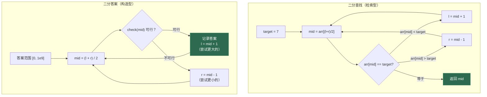
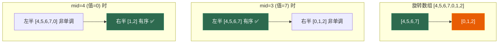
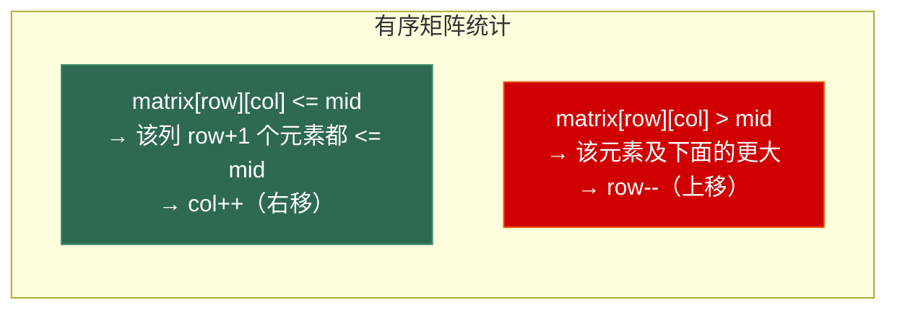

# 第二章 二分查找与二分答案

> **一句话理解**：二分查找是在有序数组中找某个值，二分答案是**猜一个答案，验证它是否可行**——前者是查找技巧，后者是算法设计范式。

> 📋 前置知识：数据结构 Ch1（数组、基础二分查找的边界讨论）

---

## 2.1 概念直觉 —— What & Why

### 两种"二分"的本质区别

数据结构 Ch1 讲的二分查找属于**检索型**：数据已经排好序，你要找到它。

本章要讲的二分答案属于**构造型**：你并不知道答案，但你**知道怎么验证一个候选答案是否可行**。这就够了——如果验证函数是单调的（答案越大越容易可行，或越小越容易可行），就可以二分。

```
二分查找：                  二分答案：
┌─────────────────┐        ┌─────────────────┐
│ [1,3,5,7,9,11] │        │ 答案 ∈ [0, 1e9]  │
│ 找到 7 的位置    │        │ check(x) = x 是否可行？│
│ → 索引 3        │        │ → 最大的可行 x     │
└─────────────────┘        └─────────────────┘
    数据已存在                    答案靠"猜"
```

### 为什么二分答案是一道分水岭？

二分答案在面试中能有效区分候选人：

- **初级**：会写有序数组的二分查找
- **中级**：能识别"最大化最小值"类问题，写出 check 函数
- **高级**：能一眼看出问题的单调性，快速设计 check 函数，处理浮点精度

### 单调性 —— 二分答案的灵魂

二分答案能用的前提是：**check(x) 的结果关于 x 单调**。

```
"最大化最小值"场景（check 单调递减）：
  x 越小 → 越容易满足 → check(x) 越可能是 true
  x 越大 → 越难满足   → check(x) 越可能是 false

  check(x): T T T T T F F F F
            ↑        ↑
         小答案    大答案
                        ↑ 最后一个 T = 最大可行解

"最小化最大值"场景（check 单调递增）：
  x 越小 → 越难满足   → check(x) 越可能是 false
  x 越大 → 越容易满足 → check(x) 越可能是 true

  check(x): F F F T T T T T
                   ↑
              第一个 T = 最小可行解
```

---

## 2.2 原理图解

### 二分查找 vs 二分答案 —— 流程对比



### 二分答案的思维框架

```
二分答案的通用步骤：
┌──────────────────────────────────────────────────────┐
│ 1. 确定答案范围 [lo, hi]                               │
│    - lo = 可能的最小答案                                │
│    - hi = 可能的最大答案（可以设一个安全的上界）            │
│                                                      │
│ 2. 设计 check(mid) 函数                               │
│    - 输入：候选答案 mid                                 │
│    - 输出：按照这个"答案"，能否满足题目要求？               │
│    - 这通常是个贪心模拟——check 才是题目真正的核心          │
│                                                      │
│ 3. 二分搜索                                            │
│    - 如果 check(mid) 可行 → 尝试更大的（或更小的）         │
│    - 如果 check(mid) 不可行 → 调整范围                   │
│    - 循环结束时 lo-1（或 hi）即为答案                     │
│                                                      │
│ 4. 验证边界                                            │
│    - 检查 lo=0 或 hi=1e9 等极端情况                      │
└──────────────────────────────────────────────────────┘
```

---

## 2.3 核心算法实现

### 2.3.1 二分查找统一模板

虽然数据结构 Ch1 已经覆盖了基础二分查找，但在进入二分答案之前，需要一个**不易出错的统一模板**。

```cpp
// 统一模板：在 [lo, hi) 左闭右开区间内查找
// 返回第一个 >= target 的位置（即 std::lower_bound）
//
// 核心原则：
// - 区间 [lo, hi) 始终包含答案
// - 每次迭代缩小一半
// - 循环条件 lo < hi（区间非空）
int lower_bound(const std::vector<int>& arr, int target) {
    int lo = 0, hi = arr.size();  // [lo, hi)

    while (lo < hi) {
        int mid = lo + (hi - lo) / 2;  // 防止溢出
        if (arr[mid] < target) {
            lo = mid + 1;  // 答案在右半边
        } else {
            hi = mid;      // arr[mid] >= target，mid 可能是答案
        }
    }
    return lo;  // lo == hi，是第一个 >= target 的位置
}

// upper_bound：返回第一个 > target 的位置
int upper_bound(const std::vector<int>& arr, int target) {
    int lo = 0, hi = arr.size();
    while (lo < hi) {
        int mid = lo + (hi - lo) / 2;
        if (arr[mid] <= target) {
            lo = mid + 1;
        } else {
            hi = mid;
        }
    }
    return lo;
}
```

**模板为什么这样设计？**

| 设计选择 | 原因 |
|---------|------|
| 左闭右开 `[lo, hi)` | 区间长度为 `hi - lo`，`hi = arr.size()` 天然合法 |
| `lo = mid + 1` | `arr[mid]` 已经被排除，收缩到 `[mid+1, hi)` |
| `hi = mid` | `arr[mid]` 可能是答案，保留在 `[lo, mid)` |
| `mid = lo + (hi - lo) / 2` | 防止 `(lo + hi)` 溢出，向下取整保证收敛 |
| 最终 `lo == hi` | 循环不变量：答案始终在 `[lo, hi)` 中 |

#### 浮点二分

```cpp
// 浮点二分：求 sqrt(2) 的近似值
// 与整数二分的区别：不能用 lo + 1 或 hi - 1，只能用 lo = mid 或 hi = mid
double sqrt_binary(double target, double eps = 1e-9) {
    double lo = 0, hi = std::max(1.0, target);

    while (hi - lo > eps) {         // 区间宽度 > 精度要求时继续
        double mid = (lo + hi) / 2;
        if (mid * mid < target) {
            lo = mid;               // 注意：不是 mid + eps！
        } else {
            hi = mid;
        }
    }
    return lo;
}

// 更稳健的写法：固定迭代次数（避免 eps 选择不当的死循环）
double sqrt_binary_fixed(std::vector<double>& arr, double target) {
    double lo = 0, hi = std::max(1.0, target);
    for (int iter = 0; iter < 80; ++iter) {  // 80 次足够 double 精度
        double mid = (lo + hi) / 2;
        if (mid * mid < target) lo = mid;
        else                    hi = mid;
    }
    return lo;
}
```

> 💡 **面试中的表述**：「浮点二分不要用 `lo = mid + eps` 这种方式，直接用 `lo = mid` 或 `hi = mid`。固定迭代 60-100 次比判断 `hi - lo > eps` 更可靠，避免精度选择不当导致的死循环。」

---

### 2.3.2 旋转数组二分

旋转排序数组是二分查找的经典变体：一个有序数组被"切了一刀"，两部分交换了位置。

```cpp
// LeetCode 33: 搜索旋转排序数组
// 输入: [4,5,6,7,0,1,2], target=0 → 输出: 4
//
// 核心洞察：mid 一定会把数组分成两半，其中至少一半是有序的
int searchRotated(const std::vector<int>& nums, int target) {
    int lo = 0, hi = nums.size() - 1;

    while (lo <= hi) {
        int mid = lo + (hi - lo) / 2;

        if (nums[mid] == target) return mid;

        // 判断哪一半是有序的
        if (nums[lo] <= nums[mid]) {
            // 左半有序
            if (nums[lo] <= target && target < nums[mid]) {
                hi = mid - 1;  // target 在左半
            } else {
                lo = mid + 1;  // target 在右半
            }
        } else {
            // 右半有序
            if (nums[mid] < target && target <= nums[hi]) {
                lo = mid + 1;  // target 在右半
            } else {
                hi = mid - 1;  // target 在左半
            }
        }
    }
    return -1;
}
```



**变体：含重复元素的旋转数组**

```cpp
// LeetCode 81: 搜索旋转排序数组 II（含重复元素）
// 当 nums[lo] == nums[mid] == nums[hi] 时，无法判断哪边有序
bool searchRotatedDup(const std::vector<int>& nums, int target) {
    int lo = 0, hi = nums.size() - 1;

    while (lo <= hi) {
        int mid = lo + (hi - lo) / 2;

        if (nums[mid] == target) return true;

        // 致命情况：无法判断哪边有序
        if (nums[lo] == nums[mid] && nums[mid] == nums[hi]) {
            ++lo;
            --hi;
            continue;
        }

        if (nums[lo] <= nums[mid]) {
            if (nums[lo] <= target && target < nums[mid]) hi = mid - 1;
            else                                          lo = mid + 1;
        } else {
            if (nums[mid] < target && target <= nums[hi]) lo = mid + 1;
            else                                          hi = mid - 1;
        }
    }
    return false;
}
```

> 💡 当 `nums[lo] == nums[mid]` 时，`nums[lo] <= nums[mid]` 仍然成立，左半仍可能有序。但三者全等时无法判断——此时只能退化为线性挪动。

**找旋转点（最小值）**

```cpp
// LeetCode 153: 寻找旋转排序数组中的最小值（无重复）
// 核心：最小值就是"旋转点"
int findMin(const std::vector<int>& nums) {
    int lo = 0, hi = nums.size() - 1;

    while (lo < hi) {
        int mid = lo + (hi - lo) / 2;

        // 与 nums[hi] 比较（不是 nums[lo]！）
        if (nums[mid] > nums[hi]) {
            lo = mid + 1;  // 最小值一定在右半
        } else {
            hi = mid;      // nums[mid] <= nums[hi]，mid 可能是最小值
        }
    }
    return nums[lo];
}
```

> ⚠️ **易错点**：找最小值时比较对象是 `nums[hi]` 而非 `nums[lo]`。因为当 `nums[mid] > nums[hi]` 时，最小值一定在 `[mid+1, hi]`；否则最小值在 `[lo, mid]`。用 `nums[lo]` 比较无法得到这样干净的二分性质。

---

### 2.3.3 二分答案 —— 核心思想

二分答案把"求最优解"转化为"判断某个解是否可行"。这需要两个条件：

1. **check(x) 是单调的**：存在一个分界点，左边全 true 右边全 false（或反过来）
2. **check(x) 可以在 O(n) 或 O(n log n) 内算出**：否则二分本身 O(log range) 的优势被淹没

#### 模板：最大化最小值

```cpp
// 模板："最大的可行解"
// check(x) 单调递减：小的一定可行，大的不一定
//
// check(x):  T  T  T  T  F  F  F
//                        ↑
//                   最后一个 T = 答案
int maxFeasible(int lo, int hi) {
    while (lo < hi) {
        int mid = lo + (hi - lo + 1) / 2;  // ⚠️ 向上取整！
        if (check(mid)) {
            lo = mid;       // mid 可行，尝试更大的
        } else {
            hi = mid - 1;   // mid 不可行，只能更小
        }
    }
    return lo;
}
```

> ⚠️ **死循环陷阱**：最大化时 `mid` 必须**向上取整** `(lo + hi + 1) / 2`。否则当 `lo=2, hi=3` 时 `mid=2`，`check(2)=true` 导致 `lo=2`，区间不缩小，死循环。

#### 模板：最小化最大值

```cpp
// 模板："最小的可行解"
// check(x) 单调递增：大的必然可行，小的不一定
//
// check(x):  F  F  F  T  T  T  T
//                      ↑
//                  第一个 T = 答案
int minFeasible(int lo, int hi) {
    while (lo < hi) {
        int mid = lo + (hi - lo) / 2;  // 向下取整
        if (check(mid)) {
            hi = mid;       // mid 可行，尝试更小的
        } else {
            lo = mid + 1;   // mid 不可行，必须更大
        }
    }
    return lo;
}
```

| | 最大化最小值 | 最小化最大值 |
|------|------------|------------|
| check 单调性 | T→F（递减） | F→T（递增） |
| check(mid) = true | `lo = mid` | `hi = mid` |
| check(mid) = false | `hi = mid - 1` | `lo = mid + 1` |
| mid 取整方向 | **向上** `(lo+hi+1)/2` | 向下 `(lo+hi)/2` |
| 返回 | lo（最后一个 T） | lo（第一个 T） |

---

### 2.3.4 二分答案经典题

#### 题目 1：Koko 吃香蕉 (LeetCode 875)

> N 堆香蕉，每堆有 `piles[i]` 根。Koko 每小时选一堆吃 `k` 根（如果这堆少于 k 根，吃完后这小时不再吃别的）。警卫 `h` 小时后回来。求最小的 `k`。

```cpp
// "最小化最大值" 模板
// check(k): 以速度 k 能否在 h 小时内吃完？
// k 越大 → 越快吃完 → check 单调递增 (F→T)
int minEatingSpeed(std::vector<int>& piles, int h) {
    // 答案范围：至少 1，至多 max(piles)
    int lo = 1;
    int hi = *std::max_element(piles.begin(), piles.end());

    while (lo < hi) {
        int mid = lo + (hi - lo) / 2;  // 向下取整（最小化场景）

        // check(mid): 计算以速度 mid 需要的小时数
        long long hours = 0;
        for (int pile : piles) {
            hours += (pile + mid - 1) / mid;  // 向上取整除法
        }

        if (hours <= h) {
            hi = mid;       // 可行，尝试更小速度
        } else {
            lo = mid + 1;   // 太慢，需要加速
        }
    }
    return lo;
}
```

#### 题目 2：分割数组的最大值 (LeetCode 410)

> 将非负整数数组分成 m 个连续子数组，使得**各子数组的和的最大值最小**。求这个最小值。

```cpp
// "最小化最大值" 模板
// check(maxSum): 能否将数组分成不超过 m 段，每段和 <= maxSum？
// maxSum 越大 → 越容易分割 → check 单调递增 (F→T)
int splitArray(std::vector<int>& nums, int m) {
    // lo = max(nums): 至少要让最大的元素自成一段
    // hi = sum(nums): 至多所有元素在一段
    int lo = *std::max_element(nums.begin(), nums.end());
    int hi = std::accumulate(nums.begin(), nums.end(), 0);

    while (lo < hi) {
        int mid = lo + (hi - lo) / 2;

        // check(mid): 贪心地分割，每段尽量装，超过 mid 就开新段
        int segments = 1;
        int currentSum = 0;
        for (int x : nums) {
            if (currentSum + x > mid) {
                ++segments;
                currentSum = x;
            } else {
                currentSum += x;
            }
        }

        if (segments <= m) {
            hi = mid;       // 可行，尝试更小的最大和
        } else {
            lo = mid + 1;   // 段数太多，maxSum 需要增大
        }
    }
    return lo;
}
```

> 💡 这道题的 check 函数本质是**贪心**。二分答案的难点通常不在二分本身，而在**check 函数的设计**——你得看出可以用贪心来验证。

#### 题目 3：制作 m 束花的最少天数 (LeetCode 1482)

> 花园里有 n 朵花，`bloomDay[i]` 是第 i 朵花开花的日期。需要制作 m 束花，每束需要 k 朵**相邻**的花。求最少等待天数。

```cpp
// check(day): 等到第 day 天，能否制作 m 束花？
// day 越大 → 开的花越多 → check 单调递增 (F→T)
int minDays(std::vector<int>& bloomDay, int m, int k) {
    int n = bloomDay.size();
    if ((long long)m * k > n) return -1;  // 花不够

    int lo = *std::min_element(bloomDay.begin(), bloomDay.end());
    int hi = *std::max_element(bloomDay.begin(), bloomDay.end());

    while (lo < hi) {
        int mid = lo + (hi - lo) / 2;

        // check(mid): 扫描数组，统计连续开了的花能组成几束
        int bouquets = 0;
        int consecutive = 0;
        for (int day : bloomDay) {
            if (day <= mid) {
                ++consecutive;
                if (consecutive == k) {
                    ++bouquets;
                    consecutive = 0;  // 摘完一束，重置
                }
            } else {
                consecutive = 0;  // 花没开，连续性中断
            }
        }

        if (bouquets >= m) {
            hi = mid;
        } else {
            lo = mid + 1;
        }
    }
    return lo;
}
```

---

### 2.3.5 二分 + 其他数据结构

二分查找不只适用于数组——任何**有序的数据结构**都可以结合二分。

#### 有序矩阵中的第 K 小元素 (LeetCode 378)

> n×n 矩阵，每行每列都升序排列。找第 k 小的元素。

```cpp
// 矩阵有序 → 可以用二分答案！
// check(x): 矩阵中 <= x 的元素个数是否 >= k？
// x 越大 → <= x 的元素越多 → check 单调递增 (F→T)
//
// 核心 trick：利用行列双有序性，O(n) 统计 <= x 的元素个数
int kthSmallest(std::vector<std::vector<int>>& matrix, int k) {
    int n = matrix.size();
    int lo = matrix[0][0];
    int hi = matrix[n - 1][n - 1];

    while (lo < hi) {
        int mid = lo + (hi - lo) / 2;

        // 统计 <= mid 的元素个数：从左下角开始
        int count = 0;
        int row = n - 1, col = 0;
        while (row >= 0 && col < n) {
            if (matrix[row][col] <= mid) {
                count += row + 1;  // 该列 [0..row] 行都 <= mid
                ++col;            // 右移
            } else {
                --row;            // 上移
            }
        }

        if (count >= k) {
            hi = mid;
        } else {
            lo = mid + 1;
        }
    }
    return lo;
}
```



#### 两个有序数组的中位数 (LeetCode 4)

> 两个有序数组，找它们合并后的中位数。要求 O(log(m+n))。

```cpp
// 核心思想：对较短的数组做二分，确定"分割线"的位置
// 分割线左侧的元素数量 = (m + n + 1) / 2
double findMedianSortedArrays(std::vector<int>& nums1, std::vector<int>& nums2) {
    // 确保 nums1 是较短的数组
    if (nums1.size() > nums2.size()) {
        return findMedianSortedArrays(nums2, nums1);
    }

    int m = nums1.size(), n = nums2.size();
    int totalLeft = (m + n + 1) / 2;  // 左半部分的元素数

    int lo = 0, hi = m;  // nums1 中分割线左侧的元素数 ∈ [0, m]

    while (lo < hi) {
        int i = lo + (hi - lo) / 2;        // nums1 分割线位置
        int j = totalLeft - i;              // nums2 分割线位置

        if (nums1[i] < nums2[j - 1]) {
            lo = i + 1;  // nums1 分割线太靠左，右移
        } else {
            hi = i;      // 满足条件或太靠右
        }
    }

    int i = lo;
    int j = totalLeft - i;

    // 左半最大值
    int leftMax = std::max(
        i > 0 ? nums1[i - 1] : INT_MIN,
        j > 0 ? nums2[j - 1] : INT_MIN
    );

    // 右半最小值
    int rightMin = std::min(
        i < m ? nums1[i] : INT_MAX,
        j < n ? nums2[j] : INT_MAX
    );

    if ((m + n) % 2 == 1) {
        return leftMax;
    } else {
        return (leftMax + rightMin) / 2.0;
    }
}
```

---

## 2.4 高频面试题精讲

### 题目 1：在 D 天内送达包裹的能力 (LeetCode 1011)

> 传送带上的包裹按顺序排列，每天送一次。求在 D 天内送完所有包裹所需的最小运力。

```cpp
// 与"分割数组的最大值"几乎一样——同一套模板
int shipWithinDays(std::vector<int>& weights, int days) {
    int lo = *std::max_element(weights.begin(), weights.end());
    int hi = std::accumulate(weights.begin(), weights.end(), 0);

    while (lo < hi) {
        int mid = lo + (hi - lo) / 2;

        int needDays = 1;
        int currentLoad = 0;
        for (int w : weights) {
            if (currentLoad + w > mid) {
                ++needDays;
                currentLoad = w;
            } else {
                currentLoad += w;
            }
        }

        if (needDays <= days) hi = mid;
        else                  lo = mid + 1;
    }
    return lo;
}
```

### 题目 2：寻找峰值 (LeetCode 162)

> 峰值元素指其值大于左右相邻元素。假设 `nums[-1] = nums[n] = -∞`。在 O(log n) 内找任意一个峰值。

```cpp
// 关键洞察：如果 nums[mid] < nums[mid+1]，则右侧一定存在峰值
// 因为 nums[n] = -∞，"上升"最终一定会转为"下降"
int findPeakElement(const std::vector<int>& nums) {
    int lo = 0, hi = nums.size() - 1;

    while (lo < hi) {
        int mid = lo + (hi - lo) / 2;

        if (nums[mid] < nums[mid + 1]) {
            lo = mid + 1;  // 右侧在上升，峰值在右边
        } else {
            hi = mid;      // mid 可能本身就是峰值，或在左边
        }
    }
    return lo;
}
```

> 💡 这道题不依赖于数组有序——它依赖的是**"两侧负无穷"确保的局部有序性**。这是二分查找可以脱离"全局有序"的经典例子。

### 题目 3：找出第 K 小的数对距离 (LeetCode 719)

> 给定整数数组，定义数对距离为绝对值差。求第 k 小的数对距离。

```cpp
// 二分答案 + 滑动窗口 check
// check(dist): 距离 <= dist 的数对数量是否 >= k？
int smallestDistancePair(std::vector<int>& nums, int k) {
    std::sort(nums.begin(), nums.end());
    int n = nums.size();

    int lo = 0;
    int hi = nums.back() - nums.front();

    while (lo < hi) {
        int mid = lo + (hi - lo) / 2;

        // 滑动窗口统计 <= mid 的数对数量
        int count = 0;
        int left = 0;
        for (int right = 0; right < n; ++right) {
            while (nums[right] - nums[left] > mid) {
                ++left;
            }
            count += right - left;  // [left, right) 内的都对
        }

        if (count >= k) {
            hi = mid;
        } else {
            lo = mid + 1;
        }
    }
    return lo;
}
```

---

### 面试题速查清单

| # | 题目 | LeetCode | 难度 | 核心技巧 |
|---|------|----------|------|---------|
| 1 | 搜索旋转排序数组 | 33 | Medium | 判断哪半有序 |
| 2 | 寻找旋转排序数组中的最小值 | 153 | Medium | 与 nums[hi] 比较 |
| 3 | 寻找峰值 | 162 | Medium | 局部单调性 |
| 4 | Koko 吃香蕉 | 875 | Medium | 二分答案入门 |
| 5 | 在 D 天内送达包裹 | 1011 | Medium | 二分答案 + 贪心 check |
| 6 | 分割数组的最大值 | 410 | Hard | 二分答案 + 贪心 check |
| 7 | 制作 m 束花的最少天数 | 1482 | Medium | 二分答案 + 连续段统计 |
| 8 | 有序矩阵第 K 小 | 378 | Medium | 二分答案 + 矩阵统计 |
| 9 | 两个有序数组的中位数 | 4 | Hard | 分割线二分 |
| 10 | 第 K 小的数对距离 | 719 | Hard | 二分答案 + 滑动窗口 |

---

## 2.5 🎮 游戏实战

### 2.5.1 游戏难度动态调整

现代游戏通常有**动态难度调整 (Dynamic Difficulty Adjustment)**——根据玩家表现实时调整数值。二分答案可以用来反推最优参数。

```cpp
// 场景：设计一个 Boss 关卡，Boss 有 HP 值
// 已知玩家的 DPS 曲线（随战斗时间递减，模拟疲劳）
// 需要找一个 HP 值，使得玩家恰好能在 120 秒内击败 Boss
// → 二分答案：猜 HP，模拟战斗验证

struct Player {
    float baseDps;        // 基础 DPS
    float fatigueRate;    // 疲劳速率（每秒 DPS 衰减百分比）
};

// check(bossHp): 给定 Boss 血量，玩家能否在 120 秒内击杀？
bool canKillBoss(float bossHp, const Player& player, float timeLimit) {
    float remainingHp = bossHp;
    float currentDps = player.baseDps;

    // 以 0.1 秒为步长模拟战斗
    for (float t = 0; t < timeLimit; t += 0.1f) {
        float damage = currentDps * 0.1f;         // 0.1 秒的伤害
        remainingHp -= damage;

        if (remainingHp <= 0) return true;         // 击杀了

        // DPS 随疲劳衰减
        currentDps *= (1.0f - player.fatigueRate * 0.1f);
        if (currentDps < player.baseDps * 0.3f) {  // 最低 DPS 保底
            currentDps = player.baseDps * 0.3f;
        }
    }
    return remainingHp <= 0;
}

// 二分答案找最优 Boss 血量
float findOptimalBossHp(const Player& player, float timeLimit) {
    float lo = 100.0f;     // 最低血量（太简单）
    float hi = 100000.0f;  // 最高血量（太难）

    for (int iter = 0; iter < 60; ++iter) {
        float mid = (lo + hi) / 2.0f;
        if (canKillBoss(mid, player, timeLimit)) {
            lo = mid;  // 能击杀 → 尝试更高血量
        } else {
            hi = mid;  // 不能 → 降低血量
        }
    }
    return lo;  // 玩家恰好能击败的最大血量
}
```

---

### 2.5.2 LOD 距离阈值优化

LOD (Level of Detail) 系统需要确定每个细节等级的切换距离。二分答案可以用来找到**平衡性能与画质的阈值**。

```cpp
struct LODMetrics {
    int   triangleCount;  // 该 LOD 级别的三角面数
    float visualScore;    // 画质评分 (0-1)
};

// 检查某组 LOD 距离阈值是否满足性能预算
// distances[i] = 第 i 个 LOD 级别的切换距离
bool checkLODBudget(const std::vector<float>& distances,
                    const std::vector<LODMetrics>& lods,
                    int maxTriangles) {
    // 简化模拟：在典型视角下，估算可见三角面总数
    // 实际项目中会用 GPU Profiler 或更复杂的视锥采样
    float typicalViewDist = 500.0f;
    float totalTriangles = 0;

    for (size_t i = 0; i < lods.size(); ++i) {
        float effectiveDist = (i + 1 < distances.size())
                            ? std::min(distances[i + 1], typicalViewDist)
                            : typicalViewDist;

        if (effectiveDist > distances[i]) {
            float weight = (effectiveDist - distances[i]) / typicalViewDist;
            totalTriangles += lods[i].triangleCount * weight;
        }
    }

    return totalTriangles <= maxTriangles;
}

// 二分搜索最高 LOD 的"最远距离"（保证性能不超标）
float findMaxLODDistance(const std::vector<LODMetrics>& lods, int maxTriangles) {
    float lo = 50.0f;    // 至少能显示 50 米
    float hi = 1000.0f;  // 最多 1000 米

    for (int iter = 0; iter < 50; ++iter) {
        float mid = (lo + hi) / 2.0f;

        // 构造当前的 LOD 距离配置
        std::vector<float> distances = {0, mid, mid * 2.5f, mid * 5.0f};

        if (checkLODBudget(distances, lods, maxTriangles)) {
            lo = mid;  // 性能允许 → 尝试更远
        } else {
            hi = mid;  // 性能超标 → 降低距离
        }
    }
    return lo;
}
```

---

### 2.5.3 加载进度与资源预算

游戏启动时需要加载资源。假设已知每个资源的大小和加载时间函数。二分答案可以确定**在限定加载时间内最多能加载多少资源**。

```cpp
struct Asset {
    std::string name;
    int         sizeMB;
    int         priority;  // 1=必须, 2=重要, 3=可选
};

// check(maxSize): 只加载总大小 <= maxSize 的资源，能否满足必须资源？
bool canLoadWithinBudget(const std::vector<Asset>& assets,
                          int maxSize, int& loadedCount) {
    int currentSize = 0;
    loadedCount = 0;

    // 按优先级贪心加载
    for (const auto& asset : assets) {
        if (currentSize + asset.sizeMB <= maxSize) {
            currentSize += asset.sizeMB;
            ++loadedCount;
        } else if (asset.priority == 1) {
            return false;  // 必须资源没加载上
        }
    }
    return true;
}

int findMaxResourceBudget(const std::vector<Asset>& assets) {
    // 预排序：优先级高的在前
    auto sorted = assets;
    std::sort(sorted.begin(), sorted.end(),
        [](const Asset& a, const Asset& b) {
            return a.priority < b.priority;
        });

    int totalSize = 0;
    for (const auto& a : sorted) totalSize += a.sizeMB;

    int lo = 0, hi = totalSize;
    int loadedCount = 0;

    while (lo < hi) {
        int mid = lo + (hi - lo + 1) / 2;  // 最大化 → 向上取整
        int count = 0;

        if (canLoadWithinBudget(sorted, mid, count)) {
            lo = mid;
            loadedCount = count;
        } else {
            hi = mid - 1;
        }
    }
    return lo;
}
```

---

## 2.6 30 秒速答

> 📋 以下是本章核心知识点的面试速答模板。

---

**Q：二分查找统一模板的核心原则？**

> 用左闭右开区间 `[lo, hi)`，循环条件 `lo < hi`，`arr[mid] < target` 时 `lo = mid + 1`，否则 `hi = mid`。返回的 `lo` 就是第一个 `>= target` 的位置。浮点二分用 `lo = mid` 和 `hi = mid`，固定迭代 60-80 次比判断精度更安全。

**Q：旋转数组二分的关键是什么？**

> 每次取中点后，至少有一半是有序的。判断 `nums[lo] <= nums[mid]` 确定哪半有序，再判断 target 是否在有序那半的范围内。有重复元素时，三者全等无法判断，退化线性挪动。找最小值时和 `nums[hi]` 比较而非 `nums[lo]`。

**Q：二分答案的核心思想？**

> 把"求最优解"转化为"判断某个解是否可行"。前提是 check 函数单调——答案越大/越小，check 的结果单调变化。最大化时 mid 向上取整防死循环，check 可行就 `lo = mid`；最小化时 mid 向下取整，check 可行就 `hi = mid`。

**Q：二分答案的难点在哪？**

> 二分框架本身很简单，难点全在 check 函数的设计。check 通常是一个贪心模拟——你需要判断"给定这个候选答案，能否满足条件"。check 的效率决定了整个算法的效率，一般要求 O(n) 内完成。

**Q：二分答案和 DP/贪心有什么关系？**

> 二分答案不解决"怎么分配"的问题——它只回答"这个答案可不可行"。验证可行性通常用贪心（如分割数组时尽量装满当前段）。而求最优分配方案本身可能需要 DP。所以二分答案常常是 DP 题的优化手段：用二分 + 贪心替代 DP 求最优解。

---

## 2.7 本章习题清单

> 建议按顺序刷，二分答案部分由浅入深。

```
二分查找巩固（复习）：
  □ 35.  搜索插入位置 —— 最基础的 lower_bound
  □ 69.  x 的平方根 —— 浮点二分入门

旋转数组：
  □ 33.  搜索旋转排序数组 —— 经典旋转二分
  □ 153. 寻找旋转排序数组中的最小值 —— 找旋转点
  □ 81.  搜索旋转排序数组 II —— 含重复元素

二分答案（入门）：
  □ 875. Koko 吃香蕉 —— 最直观的二分答案
  □ 1011. 在 D 天内送达包裹 —— 与分割数组同模板
  □ 1482. 制作 m 束花的最少天数 —— 连续段统计

二分答案（进阶）：
  □ 410. 分割数组的最大值 —— 经典二分答案
  □ 378. 有序矩阵中第 K 小的元素 —— 矩阵 + 二分答案
  □ 719. 找出第 K 小的数对距离 —— 二分答案 + 滑动窗口

综合：
  □ 4.   寻找两个正序数组的中位数 —— 分割线二分
  □ 162. 寻找峰值 —— 局部单调性
```

---

> 📖 下一章：[第三章 动态规划（基础）—— 线性DP + 背包问题](../algorithm/03_dp_basic) —— 从最优子结构到状态转移方程，从 0-1 背包到完全背包，算法面试的王者专题。
