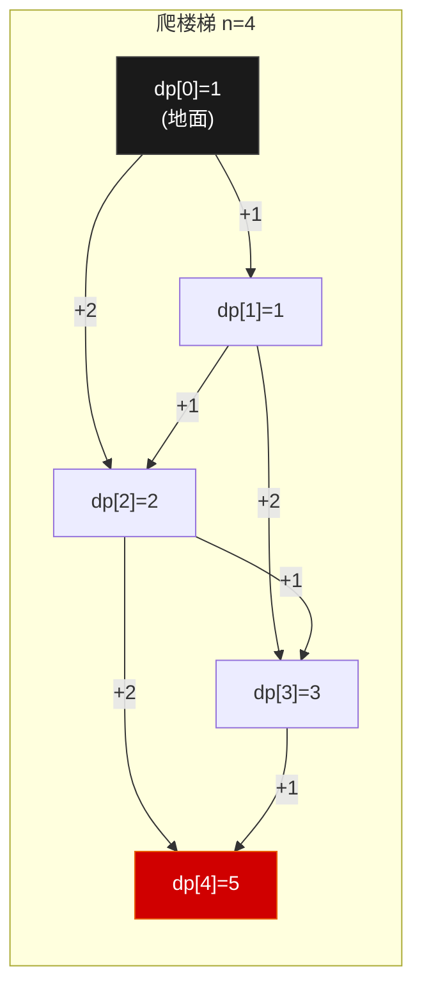
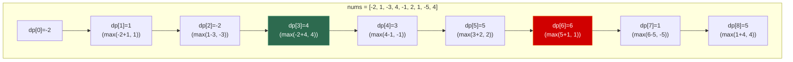
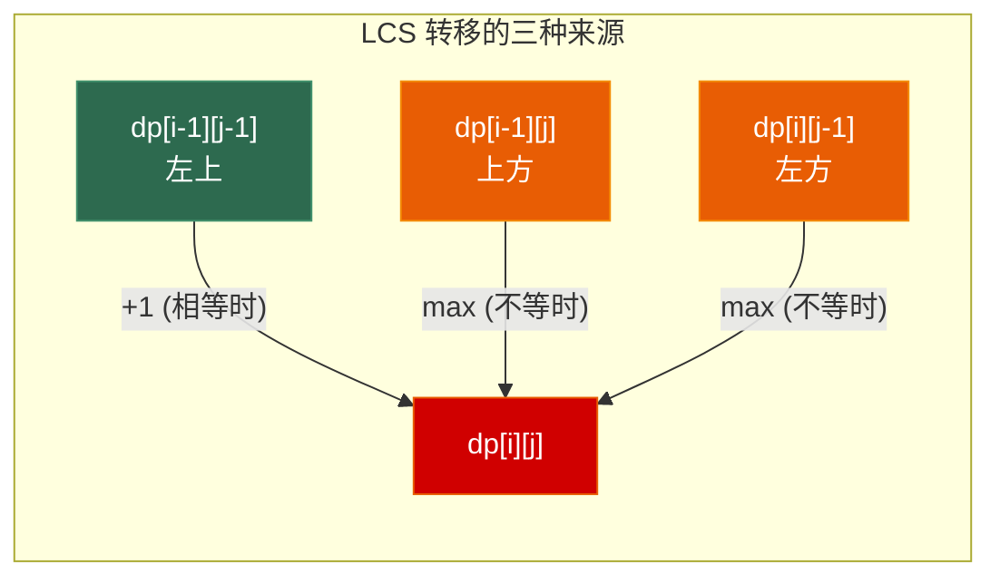
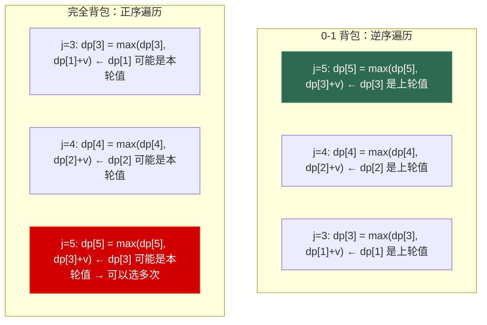

# 第三章 动态规划（基础）—— 线性DP + 背包问题

> **一句话理解**：动态规划不是"记住答案"——是把大问题拆成重叠的子问题，用**状态定义**描述局面，用**状态转移方程**描述子问题间的递推关系，从小到大逐步求解。

> 📋 前置知识：数据结构 Ch1（数组）、Ch5（哈希表）

---

## 3.1 概念直觉 —— What & Why

### DP 不是玄学——它只有三个要素

很多面试者觉得 DP "靠灵感"，因为他们在背题而非理解。DP 的所有题目本质上只由三个要素构成：

```
┌─────────────────────────────────────────────┐
│  1. 状态定义：dp[i] 或 dp[i][j] 表示什么？      │
│     → "用什么信息描述当前的局面？"               │
│                                              │
│  2. 状态转移方程：dp[i] 如何由更小的状态推出？      │
│     → "这个局面可以由哪些更小的局面演变而来？"       │
│                                              │
│  3. 初始条件与边界：dp[0] 或 dp[0][*] 是什么？    │
│     → "最小问题的答案是什么？"                    │
└─────────────────────────────────────────────┘
```

> 面试中遇到 DP 题，不要急着写代码。先大声说出**状态定义**——状态定义对了，转移方程自然会浮现。

### 记忆化搜索 vs 递推（Bottom-Up）

DP 有两种实现方式，面试中都要掌握：

```cpp
// 例：斐波那契数列 F(n) = F(n-1) + F(n-2), F(1)=F(2)=1

// 方法一：记忆化搜索（Top-Down）
// 从大问题出发，递归求解，用缓存避免重复计算
int fib_memo(int n, std::vector<int>& memo) {
    if (n <= 2) return 1;
    if (memo[n] != 0) return memo[n];
    return memo[n] = fib_memo(n - 1, memo) + fib_memo(n - 2, memo);
}

// 方法二：递推（Bottom-Up）
// 从最小的子问题开始，逐步向上构建
int fib_dp(int n) {
    if (n <= 2) return 1;
    int prev2 = 1, prev1 = 1;
    for (int i = 3; i <= n; ++i) {
        int curr = prev1 + prev2;
        prev2 = prev1;
        prev1 = curr;
    }
    return prev1;
}
```

| 维度 | 记忆化搜索 (Top-Down) | 递推 (Bottom-Up) |
|------|----------------------|-------------------|
| 思维难度 | 低（直接翻译递归式） | 较高（需要确定计算顺序） |
| 空间优化 | 较难（递归栈 + 缓存） | **容易**（滚动数组） |
| 实际速度 | 较慢（函数调用开销） | **快** |
| 栈溢出风险 | 有（递归太深） | **无** |
| 面试推荐 | 快速验证思路 | **最终提交版本** |

---

## 3.2 原理图解

### 状态转移的方向 —— DAG 上的最短/最长路

DP 的所有题目都可以看作在 **DAG（有向无环图）**上求最短/最长路径：



```
dp[0] = 1  （不动也是一种方案）
dp[i] = dp[i-1] + dp[i-2]  （最后一步跨 1 级 + 最后一步跨 2 级）

每个状态是图上的一个节点，每条转移边代表一个"选择"
DP 的本质：在 DAG 上做拓扑序递推
```

### DP 题型的识别信号

在面试中，以下信号出现两个以上，大概率是 DP：

```
✅ "最值"问题 —— 最长/最短/最大/最小
✅ "方案数"问题 —— 有多少种方法/路径
✅ "是否可行"问题 —— 能否达到某种状态
✅ 每一步有明确的"选择"
✅ 当前决策只依赖于前面已决策的状态（无后效性）
✅ 暴力递归有大量重复子问题
```

---

## 3.3 核心算法实现

### 3.3.1 线性 DP（上）—— 序列问题

线性 DP 是 DP 中最基础的一类：状态 `dp[i]` 表示"以 i 结尾"或"前 i 个元素"的最优解。

#### 最大子数组和 (LeetCode 53)

```cpp
// Kadane 算法 —— DP 思想的极致简化
// dp[i] = 以 i 结尾的最大子数组和
// 转移：要么接在前面子数组后面，要么自己另起一段
int maxSubArray(std::vector<int>& nums) {
    int dp = nums[0];       // 压缩空间：只需要前一个状态
    int ans = nums[0];

    for (int i = 1; i < nums.size(); ++i) {
        dp = std::max(dp + nums[i], nums[i]);  // 接 vs 新开
        ans = std::max(ans, dp);
    }
    return ans;
}
```



#### 打家劫舍 (LeetCode 198)

```cpp
// dp[i] = 前 i 个房子能偷到的最大金额
// 每个房子：偷（跳过前一个）或不偷（保留前一个的结果）
int rob(std::vector<int>& nums) {
    if (nums.empty()) return 0;
    if (nums.size() == 1) return nums[0];

    int prev2 = nums[0];                       // dp[0]
    int prev1 = std::max(nums[0], nums[1]);    // dp[1]

    for (int i = 2; i < nums.size(); ++i) {
        int curr = std::max(prev1, prev2 + nums[i]);
        prev2 = prev1;
        prev1 = curr;
    }
    return prev1;
}
```

#### 乘积最大子数组 (LeetCode 152)

```cpp
// 与最大子数组和不同：负数乘以负数会变成正数
// 需要同时维护"以 i 结尾的最大乘积"和"最小乘积"
int maxProduct(std::vector<int>& nums) {
    int maxProd = nums[0];   // 以当前位置结尾的最大乘积
    int minProd = nums[0];   // 以当前位置结尾的最小乘积（可能负负得正）
    int ans = nums[0];

    for (int i = 1; i < nums.size(); ++i) {
        int x = nums[i];
        // 三个候选：自己、接最大值、接最小值（x 为负时最小值变最大值）
        int candidates[] = {x, maxProd * x, minProd * x};
        maxProd = *std::max_element(candidates, candidates + 3);
        minProd = *std::min_element(candidates, candidates + 3);
        ans = std::max(ans, maxProd);
    }
    return ans;
}
```

> 💡 **面试中的表述**：「最大子数组积的关键在于负数的存在——一个很小的负数乘以另一个负数会变成很大的正数。所以必须同时维护最大值和最小值，每一步的候选包括三种：自己单独成段、接在最大值后面、接在最小值后面。」

---

### 3.3.2 线性 DP（下）—— LIS 与 LCS

#### 最长递增子序列 LIS (LeetCode 300)

```cpp
// 方法一：DP O(n²)
// dp[i] = 以 nums[i] 结尾的最长递增子序列长度
int lengthOfLIS_dp(std::vector<int>& nums) {
    int n = nums.size();
    std::vector<int> dp(n, 1);  // 每个元素自身构成长度为 1 的 LIS
    int ans = 1;

    for (int i = 1; i < n; ++i) {
        for (int j = 0; j < i; ++j) {
            if (nums[j] < nums[i]) {
                dp[i] = std::max(dp[i], dp[j] + 1);
            }
        }
        ans = std::max(ans, dp[i]);
    }
    return ans;
}

// 方法二：贪心 + 二分 O(n log n) —— 面试加分版
// 维护一个 tails 数组，tails[k] = 长度为 k+1 的递增子序列的最小末尾值
int lengthOfLIS_greedy(std::vector<int>& nums) {
    std::vector<int> tails;
    tails.reserve(nums.size());

    for (int x : nums) {
        // 在 tails 中找第一个 >= x 的位置
        auto it = std::lower_bound(tails.begin(), tails.end(), x);
        if (it == tails.end()) {
            tails.push_back(x);  // x 比所有末尾都大，扩展长度
        } else {
            *it = x;             // 替换，降低该长度对应的最小末尾
        }
    }
    return tails.size();
}
```

```
nums = [3, 5, 1, 8, 2, 6, 8, 5, 9]

tails 的演化过程：
x=3:  [3]                        ← 长度 1 的 LIS 以 3 结尾
x=5:  [3, 5]                     ← 扩展
x=1:  [1, 5]                     ← 用 1 替换 3（长度 1 的末尾更小）
x=8:  [1, 5, 8]                  ← 扩展
x=2:  [1, 2, 8]                  ← 用 2 替换 5
x=6:  [1, 2, 6]                  ← 用 6 替换 8
x=8:  [1, 2, 6, 8]               ← 扩展
x=5:  [1, 2, 5, 8]               ← 用 5 替换 6
x=9:  [1, 2, 5, 8, 9]            ← 扩展 → 答案 5

注意：tails 数组不一定是真实的 LIS 序列，但长度是对的！
```

> 💡 O(n log n) 解法在面试中一旦写出来，基本能拿满分。但要能解释清楚 `tails` 数组的含义和为什么 lower_bound 是对的。

#### 最长公共子序列 LCS (LeetCode 1143)

```cpp
// dp[i][j] = text1[0..i-1] 和 text2[0..j-1] 的 LCS 长度
// 核心分类讨论：
//   - 如果 text1[i-1] == text2[j-1]：这个字符一定在 LCS 中
//   - 否则：至少一个字符串的最后一个字符不在 LCS 中
int longestCommonSubsequence(std::string text1, std::string text2) {
    int m = text1.size(), n = text2.size();
    std::vector<std::vector<int>> dp(m + 1, std::vector<int>(n + 1, 0));

    for (int i = 1; i <= m; ++i) {
        for (int j = 1; j <= n; ++j) {
            if (text1[i - 1] == text2[j - 1]) {
                dp[i][j] = dp[i - 1][j - 1] + 1;
            } else {
                dp[i][j] = std::max(dp[i - 1][j], dp[i][j - 1]);
            }
        }
    }
    return dp[m][n];
}
```



#### 编辑距离 (LeetCode 72)

```cpp
// dp[i][j] = word1[0..i-1] → word2[0..j-1] 的最少操作数
// 三种操作：插入 / 删除 / 替换
int minDistance(std::string word1, std::string word2) {
    int m = word1.size(), n = word2.size();
    std::vector<std::vector<int>> dp(m + 1, std::vector<int>(n + 1));

    // 边界：空串 → 另一个串，只能逐个插入/删除
    for (int i = 0; i <= m; ++i) dp[i][0] = i;  // 全删
    for (int j = 0; j <= n; ++j) dp[0][j] = j;  // 全插

    for (int i = 1; i <= m; ++i) {
        for (int j = 1; j <= n; ++j) {
            if (word1[i - 1] == word2[j - 1]) {
                dp[i][j] = dp[i - 1][j - 1];    // 相同，不需要操作
            } else {
                dp[i][j] = 1 + std::min({       // 三选一：
                    dp[i - 1][j],                //   删除 word1[i-1]
                    dp[i][j - 1],                //   插入 word2[j-1]
                    dp[i - 1][j - 1]             //   替换
                });
            }
        }
    }
    return dp[m][n];
}
```

| 操作 | 转移 | 语义 |
|------|------|------|
| 删除 | `dp[i-1][j] + 1` | 删掉 word1[i-1]，用前 i-1 个去匹配 j 个 |
| 插入 | `dp[i][j-1] + 1` | 在 word1 末尾插入 word2[j-1] |
| 替换 | `dp[i-1][j-1] + 1` | 把 word1[i-1] 改成 word2[j-1] |

---

### 3.3.3 0-1 背包问题

0-1 背包是 DP 的"标准模型"——很多问题看起来不像背包，但本质上是。

```
问题：N 件物品，第 i 件重量 w[i]，价值 v[i]。背包容量 W。
每件物品只能选或不选（0 或 1）。求最大总价值。

状态定义：
  dp[i][j] = 前 i 件物品，背包容量 j，能获得的最大价值

状态转移：
  不选第 i 件：dp[i][j] = dp[i-1][j]
  选第 i 件：  dp[i][j] = dp[i-1][j - w[i]] + v[i]  （前提 j >= w[i]）

  取两者的最大值。
```

#### 基础实现

```cpp
int knapsack01(const std::vector<int>& w, const std::vector<int>& v, int W) {
    int n = w.size();
    // dp[i][j]: 前 i 件，容量 j
    std::vector<std::vector<int>> dp(n + 1, std::vector<int>(W + 1, 0));

    for (int i = 1; i <= n; ++i) {
        for (int j = 0; j <= W; ++j) {
            dp[i][j] = dp[i - 1][j];  // 不选
            if (j >= w[i - 1]) {
                dp[i][j] = std::max(dp[i][j],
                    dp[i - 1][j - w[i - 1]] + v[i - 1]);
            }
        }
    }
    return dp[n][W];
}
```

#### 空间优化：一维滚动数组

```cpp
// 关键：内层循环必须从 W 到 w[i] 逆序遍历！
// 原因：dp[j - w[i]] 必须是"上一轮"的值，而非本轮刚更新的
int knapsack01_1d(const std::vector<int>& w, const std::vector<int>& v, int W) {
    std::vector<int> dp(W + 1, 0);

    for (int i = 0; i < w.size(); ++i) {
        for (int j = W; j >= w[i]; --j) {  // ⚠️ 逆序！
            dp[j] = std::max(dp[j], dp[j - w[i]] + v[i]);
        }
    }
    return dp[W];
}
```

> ⚠️ **逆序遍历是 0-1 背包的灵魂**。如果正序遍历，`dp[j - w[i]]` 可能已经是"选了第 i 件的状态"，相当于同一件物品选了多次——这就变成完全背包了。



#### 经典题：分割等和子集 (LeetCode 416)

```cpp
// 能否将数组分成两个和相等的子集？
// → 等价于：是否存在子集的和 = sum/2？
// → 0-1 背包，容量 = sum/2，每个元素重量 = 值，看能否恰好装满
bool canPartition(std::vector<int>& nums) {
    int sum = std::accumulate(nums.begin(), nums.end(), 0);
    if (sum % 2 != 0) return false;  // 奇数不可能平分

    int target = sum / 2;
    std::vector<bool> dp(target + 1, false);
    dp[0] = true;  // 空集的和为 0

    for (int x : nums) {
        for (int j = target; j >= x; --j) {
            dp[j] = dp[j] || dp[j - x];
        }
    }
    return dp[target];
}
```

> 💡 **面试中的表述**：「分割等和子集本质上是 0-1 背包的变体。把每个数看作一件物品，它既是重量也是价值。问题转化为：能否选取若干物品，恰好装满容量为 sum/2 的背包？`dp[j]` 表示容量 j 能否被恰好装满。」

---

### 3.3.4 完全背包问题

完全背包中每种物品可以选**无限次**。与 0-1 背包的唯一区别是**正序遍历**。

```cpp
// 零钱兑换 (LeetCode 322): 用最少的硬币凑出 amount
// 每种硬币无限次 → 完全背包
int coinChange(std::vector<int>& coins, int amount) {
    // dp[j] = 凑出金额 j 所需的最少硬币数
    std::vector<int> dp(amount + 1, amount + 1);  // amount+1 表示"不可能"
    dp[0] = 0;

    // 外层遍历硬币，内层正序遍历金额 → 每种硬币可以多次使用
    for (int coin : coins) {
        for (int j = coin; j <= amount; ++j) {
            dp[j] = std::min(dp[j], dp[j - coin] + 1);
        }
    }
    return dp[amount] > amount ? -1 : dp[amount];
}
```

**完全背包 vs 0-1 背包 —— 一行之差**：

```cpp
// 0-1 背包（每件物品最多一次）
for (int j = W; j >= w[i]; --j)       // 逆序！
    dp[j] = max(dp[j], dp[j - w[i]] + v[i]);

// 完全背包（每件物品可以无限次）
for (int j = w[i]; j <= W; ++j)       // 正序！
    dp[j] = max(dp[j], dp[j - w[i]] + v[i]);
```

#### 零钱兑换 II (LeetCode 518)

```cpp
// 凑出金额 amount 的组合数（每种硬币无限次）
// 注意：是组合数，不是排列数！
// 外层遍历硬币、内层遍历金额 → 保证了硬币选取顺序固定 = 组合
int change(int amount, std::vector<int>& coins) {
    std::vector<int> dp(amount + 1, 0);
    dp[0] = 1;  // 凑金额 0 有一种方式：什么都不选

    for (int coin : coins) {              // 外层：硬币
        for (int j = coin; j <= amount; ++j) {  // 内层：金额
            dp[j] += dp[j - coin];
        }
    }
    return dp[amount];
}
```

> ⚠️ **组合 vs 排列的陷阱**：外层遍历硬币（内层金额）得到**组合数**（{1,2} 和 {2,1} 算一种）。如果反过来——外层金额（内层硬币）——得到的是**排列数**。面试中这是高频追问点。

```cpp
// 排列数版本：外层金额，内层硬币
dp[0] = 1;
for (int j = 1; j <= amount; ++j) {      // 外层：金额
    for (int coin : coins) {             // 内层：硬币
        if (j >= coin) dp[j] += dp[j - coin];
    }
}
// dp[3] 会把 {1,2} 和 {2,1} 分别计数 = 排列数
```

---

### 3.3.5 背包变体

#### 二维费用背包

```cpp
// 物品有"重量"和"体积"两种消耗，背包有"承重"和"容量"两种限制
// dp[j][k] = 在重量 j、体积 k 限制下的最大价值
int knapsack2D(const std::vector<int>& w, const std::vector<int>& vol,
               const std::vector<int>& v, int maxW, int maxV) {
    std::vector<std::vector<int>> dp(maxW + 1, std::vector<int>(maxV + 1, 0));

    for (int i = 0; i < w.size(); ++i) {
        for (int j = maxW; j >= w[i]; --j) {       // 重量：逆序
            for (int k = maxV; k >= vol[i]; --k) { // 体积：逆序
                dp[j][k] = std::max(dp[j][k],
                    dp[j - w[i]][k - vol[i]] + v[i]);
            }
        }
    }
    return dp[maxW][maxV];
}
```

#### 分组背包

```cpp
// 物品分为若干组，每组最多选一件
// dp[j] = 容量 j 的最大价值
// 对每组：先用临时数组保存上轮结果，再对这组内的物品做 0-1 背包
int knapsackGroup(const std::vector<std::vector<std::pair<int,int>>>& groups,
                  int W) {
    // groups[g] = [(w1,v1), (w2,v2), ...]  每组内的物品互斥
    std::vector<int> dp(W + 1, 0);

    for (const auto& group : groups) {
        std::vector<int> prev = dp;  // 保存这组开始前的状态
        for (const auto& [w, v] : group) {
            for (int j = W; j >= w; --j) {
                dp[j] = std::max(dp[j], prev[j - w] + v);
                //                         ↑ 从 prev 转移，保证组内只选一件
            }
        }
    }
    return dp[W];
}
```

#### 背包问题变体速查

| 变体 | LeetCode | 特殊性 | 思路 |
|------|----------|--------|------|
| 分割等和子集 | 416 | 物品重量=价值 | 0-1 背包，`dp[j]` 是 bool |
| 零钱兑换 | 322 | 完全背包 + 求最少 | `dp[j] = min(dp[j], dp[j-coin]+1)` |
| 零钱兑换 II | 518 | 完全背包 + 求方案数 | `dp[j] += dp[j-coin]` |
| 目标和 | 494 | 转化为子集和 | sum(P) = (sum + target) / 2 |
| 最后一块石头的重量 II | 1049 | 最接近 sum/2 的子集 | 0-1 背包，最大化不超过 sum/2 |
| 完全平方数 | 279 | 硬币为完全平方数 | 完全背包 + 求最少 |

---

## 3.4 🎮 DP 与缓存友好性

> DP 表的遍历顺序不仅决定正确性，还决定了**实际运行速度**。同样的 O(n²) 算法，行优先可能比列优先快 5-10 倍。

### 行优先 vs 列优先 —— 缓存视角

```cpp
// LCS 的 DP 表：dp[i][j] 依赖 左、上、左上
// 两种遍历顺序在正确性上等价，但性能差巨大：

int n = 5000;
std::vector<std::vector<int>> dp(n + 1, std::vector<int>(n + 1, 0));

// ✅ 行优先：内层循环遍历列，连续访问内存
for (int i = 1; i <= n; ++i) {
    for (int j = 1; j <= n; ++j) {   // ⭐ 连续访问 dp[i][j]
        dp[i][j] = std::max(dp[i-1][j], dp[i][j-1]);
    }
}
// 每次访问 dp[i][j] 和 dp[i][j-1] 位于同一 cache line → 命中率高

// ❌ 列优先：内层循环遍历行，跳跃访问内存
for (int j = 1; j <= n; ++j) {
    for (int i = 1; i <= n; ++i) {   // ⭐ 跳跃访问不同行的同一列
        dp[i][j] = std::max(dp[i-1][j], dp[i][j-1]);
    }
}
// dp[i][j] 和 dp[i+1][j] 在内存中相距一整行 → 几乎每次 cache miss
```

```
内存布局（行优先存储）：
dp[0][0] dp[0][1] dp[0][2] ... dp[0][n]    ← 一行连续
dp[1][0] dp[1][1] dp[1][2] ... dp[1][n]    ← 邻接上一行
...

行优先遍历：→ → → → →   每次读的下一个元素就在隔壁（cache line 内）
列优先遍历：↓ ↓ ↓ ↓ ↓   每次读的下一个元素在 n 个元素之外（不同 cache line）
```

### 滚动数组 —— 不仅仅是省内存

```cpp
// 0-1 背包一维优化: dp[W] 只有一行
// 整个 DP 表塞进 L1 缓存 → 极致的缓存友好性

// 对比：
// 二维版本：dp[n+1][W+1]，W=10000 时约 80KB+（可能超出 L1）
// 一维版本：dp[W+1]，W=10000 时约 40KB（在 L1 缓存内）
```

### 何时不能滚动？

并非所有 DP 都可以优化到 O(n) 空间。判断标准：**dp[i][j] 依赖的范围有多大**。

```
可以滚动（只依赖上一层）：
  - 0-1 背包：dp[i][j] 只依赖 dp[i-1][j] 和 dp[i-1][j-w]
  - LCS：dp[i][j] 只依赖上一行 → 用 dp[2][n] 滚动

不能简单滚动（依赖范围大）：
  - 区间 DP：dp[l][r] 依赖 dp[l][k] 和 dp[k+1][r]（多行）
  - 编辑距离：dp[i][j] 依赖上一行即可，可以滚动到 O(min(m,n))
```

```cpp
// LCS 滚动数组优化（只用两行）
int longestCommonSubsequence_roll(std::string text1, std::string text2) {
    int m = text1.size(), n = text2.size();
    std::vector<std::vector<int>> dp(2, std::vector<int>(n + 1, 0));

    for (int i = 1; i <= m; ++i) {
        int cur = i % 2;
        int prev = 1 - cur;
        for (int j = 1; j <= n; ++j) {
            if (text1[i - 1] == text2[j - 1]) {
                dp[cur][j] = dp[prev][j - 1] + 1;
            } else {
                dp[cur][j] = std::max(dp[prev][j], dp[cur][j - 1]);
            }
        }
    }
    return dp[m % 2][n];
}
```

> 💡 **面试中的表述**：「DP 的性能优化分两个层次。第一层是空间优化——用滚动数组或一维数组替代二维表。第二层是缓存优化——保证内层循环连续访问内存。行优先遍历在一行内的访问是连续的，一个 cache line 的 64 字节全部命中；列优先则每步跳一行，几乎步步 cache miss。两者理论复杂度相同，实际耗时差 5-10 倍。」

---

## 3.5 高频面试题精讲

### 题目 1：最长回文子串 (LeetCode 5)

```cpp
// 区间 DP 入门（虽然本章是线性 DP，但这道题在面试中常和 LCS/LIS 放一起考）
// dp[i][j] = s[i..j] 是否是回文串
// 转移：s[i]==s[j] 且 (j-i<2 或 dp[i+1][j-1])
std::string longestPalindrome(std::string s) {
    int n = s.size();
    if (n < 2) return s;

    std::vector<std::vector<bool>> dp(n, std::vector<bool>(n, false));
    int start = 0, maxLen = 1;

    // 所有长度为 1 的都是回文
    for (int i = 0; i < n; ++i) dp[i][i] = true;

    // 按长度递增遍历（区间 DP 的标准遍历顺序）
    for (int len = 2; len <= n; ++len) {
        for (int i = 0; i + len - 1 < n; ++i) {
            int j = i + len - 1;
            if (s[i] == s[j] && (len == 2 || dp[i + 1][j - 1])) {
                dp[i][j] = true;
                if (len > maxLen) {
                    start = i;
                    maxLen = len;
                }
            }
        }
    }
    return s.substr(start, maxLen);
}
```

> ⚠️ 区间 DP 的遍历顺序是**按长度递增**，不是按 i 递增！详细解释将在 Ch4 进阶 DP 中展开。

### 题目 2：单词拆分 (LeetCode 139)

```cpp
// dp[i] = s[0..i-1] 能否由 wordDict 中的单词拼接而成
// 转移：存在 j < i，使得 dp[j] 为 true 且 s[j..i-1] 在字典中
bool wordBreak(std::string s, std::vector<std::string>& wordDict) {
    std::unordered_set<std::string> dict(wordDict.begin(), wordDict.end());
    int n = s.size();

    std::vector<bool> dp(n + 1, false);
    dp[0] = true;  // 空前缀可以被拼接

    for (int i = 1; i <= n; ++i) {
        for (int j = 0; j < i; ++j) {
            if (dp[j] && dict.count(s.substr(j, i - j))) {
                dp[i] = true;
                break;  // 一旦找到一种拼接方式即可
            }
        }
    }
    return dp[n];
}
```

### 题目 3：正则表达式匹配 (LeetCode 10)

```cpp
// dp[i][j] = s[0..i-1] 能否匹配 p[0..j-1]
// 关键：p[j-1] == '*' 时有两种选择：
//   - 不用 '*'（删除 p[j-2] 和 '*'）：dp[i][j-2]
//   - 用 '*'（匹配一个或多个）：s[i-1] 匹配 p[j-2] 且 dp[i-1][j]
bool isMatch(std::string s, std::string p) {
    int m = s.size(), n = p.size();
    std::vector<std::vector<bool>> dp(m + 1, std::vector<bool>(n + 1, false));
    dp[0][0] = true;

    // 处理空字符串匹配 a*, a*b*, ... 的情况
    for (int j = 2; j <= n; ++j) {
        if (p[j - 1] == '*') {
            dp[0][j] = dp[0][j - 2];  // '*' 可以消掉前一个字符
        }
    }

    for (int i = 1; i <= m; ++i) {
        for (int j = 1; j <= n; ++j) {
            if (p[j - 1] == '*') {
                // 不用 '*' : dp[i][j-2]
                // 用 '*' : s[i-1] 匹配 p[j-2] 且 dp[i-1][j]
                dp[i][j] = dp[i][j - 2] ||
                    (dp[i - 1][j] &&
                     (s[i - 1] == p[j - 2] || p[j - 2] == '.'));
            } else {
                dp[i][j] = dp[i - 1][j - 1] &&
                    (s[i - 1] == p[j - 1] || p[j - 1] == '.');
            }
        }
    }
    return dp[m][n];
}
```

---

### 面试题速查清单

| # | 题目 | LeetCode | 难度 | 核心技巧 |
|---|------|----------|------|---------|
| 1 | 爬楼梯 | 70 | Easy | 斐波那契 DP |
| 2 | 最大子数组和 | 53 | Medium | Kadane / 线性 DP |
| 3 | 打家劫舍 | 198 | Medium | 选/不选 的 DP |
| 4 | 乘积最大子数组 | 152 | Medium | 双状态（最大+最小） |
| 5 | 最长递增子序列 | 300 | Medium | DP O(n²) + 贪心 O(n log n) |
| 6 | 最长公共子序列 | 1143 | Medium | 二维 DP 模板 |
| 7 | 编辑距离 | 72 | Hard | 三操作选最小 |
| 8 | 分割等和子集 | 416 | Medium | 0-1 背包变体 |
| 9 | 零钱兑换 | 322 | Medium | 完全背包 + 最少硬币 |
| 10 | 零钱兑换 II | 518 | Medium | 完全背包 + 方案数 |
| 11 | 目标和 | 494 | Medium | 转化为子集和 |
| 12 | 完全平方数 | 279 | Medium | 完全背包 |
| 13 | 单词拆分 | 139 | Medium | 区间划分 DP |
| 14 | 正则表达式匹配 | 10 | Hard | 模式匹配 DP |

---

## 3.6 🎮 游戏实战

### 3.6.1 装备选择系统 —— 0-1 背包的经典应用

RPG 游戏中，角色有负重上限。每件装备有重量和属性加成。选择最优装备组合就是标准的 0-1 背包问题。

```cpp
struct Equipment {
    std::string name;
    int         weight;       // 负重
    float       attackBonus;  // 攻击加成
    float       defenseBonus; // 防御加成
    // 综合评分 = 攻击 * 权重 + 防御 * 权重（玩家可调）
    float score(float attackWeight, float defenseWeight) const {
        return attackBonus * attackWeight + defenseBonus * defenseWeight;
    }
};

struct EquipmentSelection {
    int maxWeight;
    float totalScore;
    std::vector<int> selectedIndices;  // 选中的装备索引
};

EquipmentSelection optimizeEquipment(
    const std::vector<Equipment>& items,
    int maxWeight,
    float atkW = 1.0f, float defW = 1.0f) {

    int n = items.size();
    // dp[j] = 容量 j 时的最大评分
    std::vector<float> dp(maxWeight + 1, 0);
    // 回溯表：trace[i][j] = 在容量 j 时是否选了第 i 件
    std::vector<std::vector<bool>> trace(n, std::vector<bool>(maxWeight + 1, false));

    for (int i = 0; i < n; ++i) {
        float score = items[i].score(atkW, defW);
        for (int j = maxWeight; j >= items[i].weight; --j) {
            float newScore = dp[j - items[i].weight] + score;
            if (newScore > dp[j]) {
                dp[j] = newScore;
                trace[i][j] = true;
            }
        }
    }

    // 回溯：找出具体选了哪些装备
    EquipmentSelection result;
    result.maxWeight = maxWeight;
    result.totalScore = dp[maxWeight];

    int j = maxWeight;
    for (int i = n - 1; i >= 0; --i) {
        if (trace[i][j]) {
            result.selectedIndices.push_back(i);
            j -= items[i].weight;
        }
    }
    std::reverse(result.selectedIndices.begin(), result.selectedIndices.end());
    return result;
}
```

---

### 3.6.2 技能连招优化 —— LIS 变体

动作游戏中，技能有释放条件（如"技能 B 必须在技能 A 之后释放"）。找最长的有效连招链 = 带约束的 LIS。

```cpp
struct Skill {
    int  id;
    int  requiredPrev;   // 前置技能 ID（-1 表示无前置）
    int  damage;
    bool canFollow(int prevSkill) const {
        return requiredPrev == -1 || requiredPrev == prevSkill;
    }
};

// 在满足前置约束的条件下，找最长的有效连招序列
int longestCombo(const std::vector<Skill>& skills, const std::vector<int>& sequence) {
    int n = sequence.size();
    // dp[i] = 以 sequence[i] 结尾的最长有效连招长度
    std::vector<int> dp(n, 1);

    int maxLen = 1;
    for (int i = 1; i < n; ++i) {
        const Skill& cur = skills[sequence[i]];
        for (int j = 0; j < i; ++j) {
            const Skill& prev = skills[sequence[j]];
            if (cur.canFollow(prev.id)) {
                dp[i] = std::max(dp[i], dp[j] + 1);
            }
        }
        maxLen = std::max(maxLen, dp[i]);
    }
    return maxLen;
}
```

---

### 3.6.3 消耗品策略 —— 完全背包的实战

战斗中可以使用多种消耗品（药水、卷轴），每种可以使用任意次数。在有限的时间里，如何最大化总收益？

```cpp
struct Consumable {
    std::string name;
    int         useTime;      // 使用所需时间（秒）
    float       healAmount;   // 回复量
    float       buffAmount;   // Buff 增益
};

float maxCombatEffectiveness(
    const std::vector<Consumable>& items,
    int totalTime) {

    // dp[t] = 在 t 秒内能获得的最大战斗收益
    std::vector<float> dp(totalTime + 1, 0);

    for (const auto& item : items) {
        float value = item.healAmount * 0.6f + item.buffAmount * 0.4f;
        for (int t = item.useTime; t <= totalTime; ++t) {  // 正序：无限使用
            dp[t] = std::max(dp[t], dp[t - item.useTime] + value);
        }
    }
    return dp[totalTime];
}
```

---

### 3.6.4 聊天拼写纠错 —— 编辑距离

MMO 聊天系统中，玩家经常打错字。编辑距离可以实现"你是不是想打 XXX"的提示。

```cpp
#include <string>
#include <vector>
#include <algorithm>

class SpellChecker {
    std::vector<std::string> _dictionary;

public:
    void loadDictionary(const std::vector<std::string>& words) {
        _dictionary = words;
    }

    // 找编辑距离最小的 topK 个候选词
    std::vector<std::string> suggest(const std::string& input, int topK = 3) {
        std::vector<std::pair<int, std::string>> candidates;

        for (const auto& word : _dictionary) {
            int dist = editDistance(input, word);
            candidates.push_back({dist, word});
        }

        std::partial_sort(candidates.begin(),
                          candidates.begin() + std::min(topK, (int)candidates.size()),
                          candidates.end());

        std::vector<std::string> result;
        for (int i = 0; i < std::min(topK, (int)candidates.size()); ++i) {
            result.push_back(candidates[i].second);
        }
        return result;
    }

private:
    // 滚动数组优化版编辑距离：O(min(m,n)) 空间
    int editDistance(const std::string& a, const std::string& b) {
        // 确保 a 是较短的串
        if (a.size() > b.size()) return editDistance(b, a);

        int m = a.size(), n = b.size();
        std::vector<int> dp(m + 1);
        std::iota(dp.begin(), dp.end(), 0);  // dp[i] = i

        for (int j = 1; j <= n; ++j) {
            int prev = dp[0];  // 左上角的值
            dp[0] = j;         // 第一列
            for (int i = 1; i <= m; ++i) {
                int temp = dp[i];
                if (a[i - 1] == b[j - 1]) {
                    dp[i] = prev;
                } else {
                    dp[i] = 1 + std::min({dp[i], dp[i - 1], prev});
                }
                prev = temp;
            }
        }
        return dp[m];
    }
};
```

---

## 3.7 30 秒速答

> 📋 以下是本章核心知识点的面试速答模板。

---

**Q：DP 的三个核心要素是什么？**

> 状态定义、状态转移方程、初始条件。状态定义描述当前局面——`dp[i]` 或 `dp[i][j]` 代表什么。转移方程描述大问题如何由小问题推导。初始条件是最小子问题的答案。面试中先说出状态定义，转移方程自然会浮现。

**Q：0-1 背包和完全背包的本质区别？**

> 0-1 背包每件物品最多选一次，完全背包可以无限次。代码层面只差一行：0-1 背包内层逆序遍历（保证每件只被用一次），完全背包正序遍历（允许同一件被多次使用）。逆序的原因是确保 `dp[j - w[i]]` 是上一轮的值，而非本轮刚更新的。

**Q：LIS 的 O(n log n) 解法核心是什么？**

> 维护一个 tails 数组，`tails[k]` 表示长度为 `k+1` 的递增子序列的**最小末尾值**。遍历每个数 x，在 tails 中二分找第一个 `>= x` 的位置：如果 x 比所有末尾都大则扩展长度，否则替换该位置。tails 的长度就是答案。注意 tails 不一定是真实的 LIS 序列。

**Q：组合数 vs 排列数在完全背包中的区别？**

> 外层遍历硬币（内层金额）得到组合数——`{1,2}` 和 `{2,1}` 算同一种。外层遍历金额（内层硬币）得到排列数——两种都算。面试中如果题目问的是"组合数"（如零钱兑换 II），一定要外层硬币内层金额。

**Q：DP 的缓存友好性如何优化？**

> 两个关键点。第一，保证内层循环连续访问内存——对二维 DP 表，行优先遍历让每次访问的相邻元素在同一个 cache line 内。第二，能用滚动数组就滚动——一维数组整个塞进 L1 缓存，避免访问主存的 ~100ns 延迟。同样的 O(n²) 算法，缓存友好的版本可以快 5-10 倍。

---

## 3.8 本章习题清单

> 建议先掌握线性 DP，再攻背包。

```
线性 DP（入门）：
  □ 70.  爬楼梯 —— 最基础的 DP
  □ 53.  最大子数组和 —— Kadane 算法
  □ 121. 买卖股票的最佳时机 —— 单次交易
  □ 746. 使用最小花费爬楼梯 —— 带权 DP

线性 DP（进阶）：
  □ 198. 打家劫舍 —— 选/不选 模型
  □ 152. 乘积最大子数组 —— 双状态维护
  □ 300. 最长递增子序列 —— DP + 贪心二分，两种都写
  □ 1143. 最长公共子序列 —— 经典二维 DP
  □ 72.  编辑距离 —— 三操作选最小

0-1 背包：
  □ 416. 分割等和子集 —— 背包可行性
  □ 494. 目标和 —— 转化为子集和问题
  □ 1049. 最后一块石头的重量 II —— 最接近 sum/2

完全背包：
  □ 322. 零钱兑换 —— 最少硬币
  □ 518. 零钱兑换 II —— 组合数（注意遍历顺序！）
  □ 279. 完全平方数 —— 完全背包变体
  □ 139. 单词拆分 —— 区间划分 DP

挑战：
  □ 10.  正则表达式匹配 —— 模式匹配 DP
```

---

> 📖 下一章：[第四章 动态规划（进阶）—— 区间DP + 状压DP + 树形DP](../algorithm/04_dp_advanced) —— 从戳气球到旅行商问题，从二叉树最大路径和到 DP 优化技巧。
