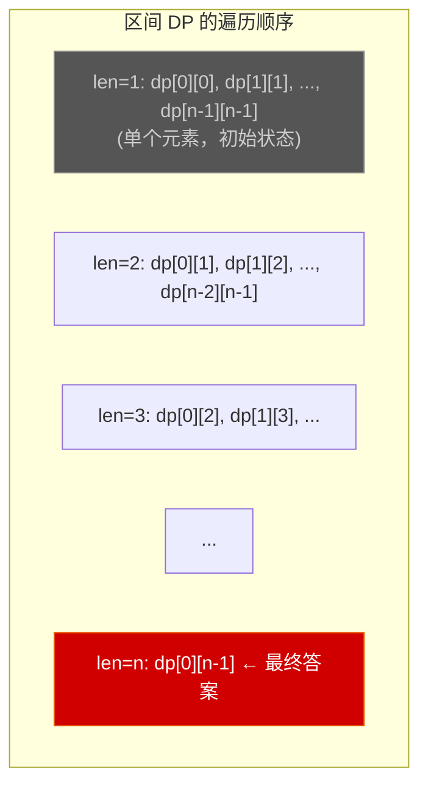
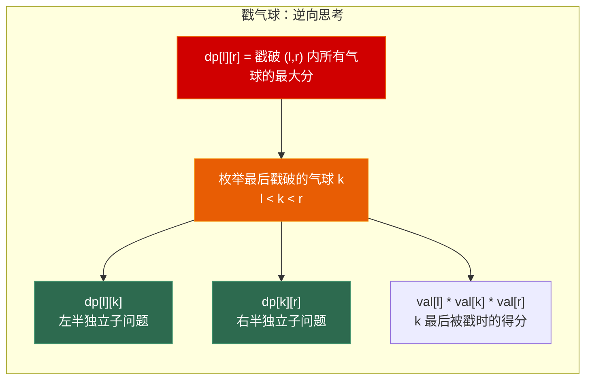
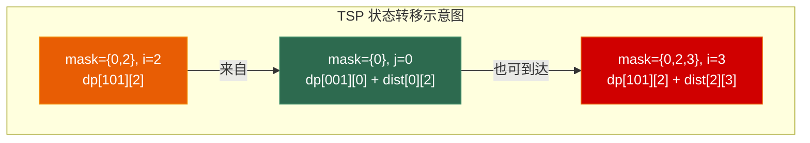
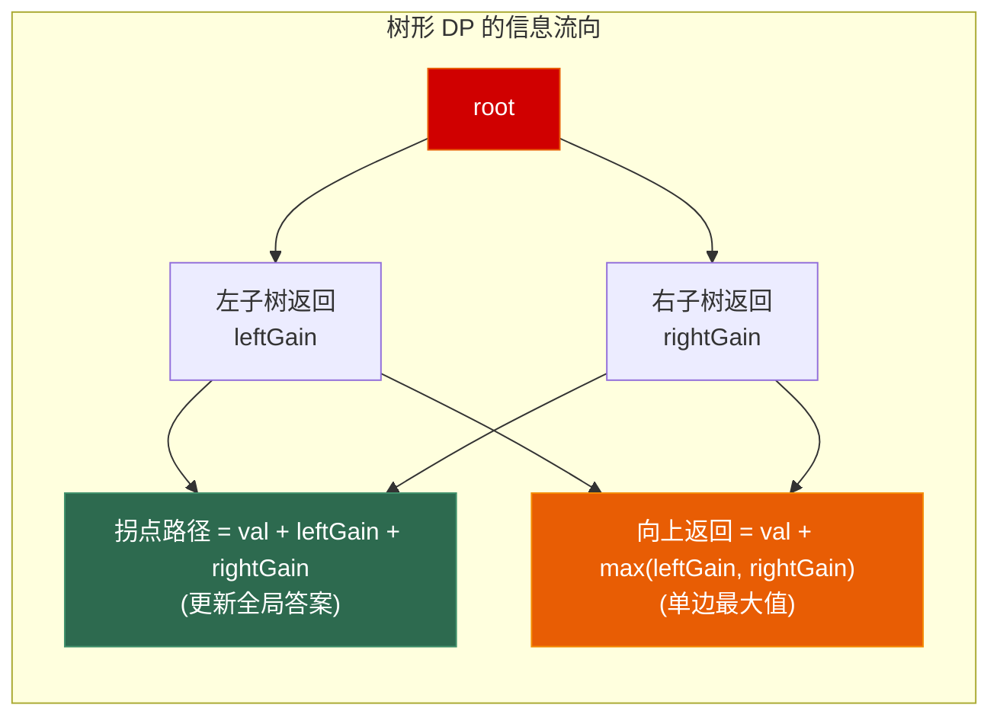

# 第四章 动态规划（进阶）—— 区间DP + 状压DP + 树形DP

> **一句话理解**：基础 DP 处理的是"线性递推"，进阶 DP 处理的是"区间合并"、"集合状态"和"树上的信息汇聚"——状态定义从一维跃升到更高维度，但三要素的本质不变。

> 📋 前置知识：Ch3（基础DP）、数据结构 Ch6（树）、Ch9（并查集）

---

## 4.1 概念直觉 —— 三类进阶 DP 的共性

基础 DP 的状态通常是 `dp[i]`（前 i 个），转移只依赖相邻的前几个状态。进阶 DP 的状态空间更复杂：

```
区间 DP：   dp[l][r]   —— 区间 [l, r] 上的最优解
状压 DP：   dp[mask]   —— mask 的二进制位表示集合
树形 DP：   dp[node]   —— 以 node 为根的子树上的最优解
```

三者的共同特征：**状态的定义不再是一维线性，而是结构化的一维（区间/集合/树节点）**。这导致它们的遍历顺序不再是简单的 `for i from 0 to n`。

---

## 4.2 区间 DP —— 从短到长合并

### 核心模板

区间 DP 处理"一段区间上的最优解"，其核心是**枚举区间的分割点**。

```
模板：
for len = 2 to n:                    // 区间长度从小到大
  for l = 0 to n-len:                // 区间起点
    r = l + len - 1                   // 区间终点
    for k = l to r-1:                 // 枚举分割点
      dp[l][r] = merge(dp[l][k], dp[k+1][r])
```

> ⚠️ **遍历顺序是关键**：必须按**区间长度递增**，而不能按 `l` 递增。因为 `dp[l][r]` 依赖更短区间的结果，而 `dp[l+1][r]` 恰好比 `dp[l][r]` 短——只有按长度遍历才能保证依赖的状态已计算好。



### 戳气球 (LeetCode 312)

```
问题：n 个气球排成一排，戳破第 i 个得 nums[i-1]*nums[i]*nums[i+1] 分。
求最大得分。首尾边界视为 1。

关键洞察：正向思考"先戳哪个"很复杂（戳破后邻居会变）。
逆向思考：最后一个戳破的气球——它的左右两部分是独立子问题！
```

```cpp
int maxCoins(std::vector<int>& nums) {
    int n = nums.size();
    // 首尾补 1，简化边界处理
    std::vector<int> val(n + 2, 1);
    for (int i = 0; i < n; ++i) val[i + 1] = nums[i];

    // dp[l][r] = 戳破开区间 (l, r) 内所有气球的最大得分
    // 注意：(l, r) 是开区间——l 和 r 位置的气球保留不戳
    std::vector<std::vector<int>> dp(n + 2, std::vector<int>(n + 2, 0));

    // 按区间长度递增
    for (int len = 3; len <= n + 2; ++len) {  // 至少包含一个气球
        for (int l = 0; l + len - 1 <= n + 1; ++l) {
            int r = l + len - 1;
            // 枚举 (l, r) 中最后被戳破的气球 k
            for (int k = l + 1; k < r; ++k) {
                // k 是最后一个 → 此时 l 和 r 都还在
                int coins = val[l] * val[k] * val[r];
                dp[l][r] = std::max(dp[l][r],
                    dp[l][k] + dp[k][r] + coins);
            }
        }
    }
    return dp[0][n + 1];  // 开区间 (0, n+1) = 所有气球
}
```



> 💡 **面试中的表述**：「戳气球的难点在于正向思考时邻居会动态变化。关键思维跃迁是反向思考——最后一个戳破的气球，其左右两侧的所有气球都已被戳破，形成两个完全独立的子问题。这种"枚举最后一步"的逆向思维是区间 DP 的核心技巧。」

### 石子游戏 (LeetCode 877)

```cpp
// dp[l][r] = 在 piles[l..r] 上，先手比后手多得的石头数
// 先手可以选 piles[l] 或 piles[r]：
//   - 选 piles[l]：得到 piles[l]，然后对方在 [l+1, r] 上成为先手
//   - 选 piles[r]：得到 piles[r]，然后对方在 [l, r-1] 上成为先手
bool stoneGame(std::vector<int>& piles) {
    int n = piles.size();
    std::vector<std::vector<int>> dp(n, std::vector<int>(n, 0));

    for (int i = 0; i < n; ++i) dp[i][i] = piles[i];

    for (int len = 2; len <= n; ++len) {
        for (int l = 0; l + len - 1 < n; ++l) {
            int r = l + len - 1;
            dp[l][r] = std::max(
                piles[l] - dp[l + 1][r],  // 选左，减去对方在剩余区间上的优势
                piles[r] - dp[l][r - 1]   // 选右
            );
        }
    }
    return dp[0][n - 1] > 0;
}
```

> 这题其实可以直接 `return true`（数学上 Alex 总能赢），但面试中写出 DP 解法更重要。

### 奇怪的打印机 (LeetCode 664)

```cpp
// dp[l][r] = 打印 s[l..r] 的最少次数
// 如果 s[l] == s[k]（k ∈ [l+1, r]），则 s[l] 可以和 s[k] 一起打印
int strangePrinter(std::string s) {
    int n = s.size();
    std::vector<std::vector<int>> dp(n, std::vector<int>(n, n));
    for (int i = 0; i < n; ++i) dp[i][i] = 1;

    for (int len = 2; len <= n; ++len) {
        for (int l = 0; l + len - 1 < n; ++l) {
            int r = l + len - 1;
            // 策略 1：单独打 s[l]，然后打 s[l+1..r]
            dp[l][r] = 1 + dp[l + 1][r];
            // 策略 2：如果 s[l] == s[k]，s[l] 可以顺便带出来
            for (int k = l + 1; k <= r; ++k) {
                if (s[l] == s[k]) {
                    dp[l][r] = std::min(dp[l][r],
                        dp[l][k - 1] + (k + 1 <= r ? dp[k + 1][r] : 0));
                }
            }
        }
    }
    return dp[0][n - 1];
}
```

---

## 4.3 状态压缩 DP —— 用 bitmask 表示集合

当问题涉及"元素的选取状态"且 n ≤ 20 时，状态压缩 DP 是最优选择。核心是**用 int 的二进制位表示集合**。

```
基础操作速查：
mask | (1 << i)       —— 加入元素 i
mask & ~(1 << i)      —— 移除元素 i
mask & (1 << i)       —— 检查元素 i 是否在集合中
mask ^ (1 << i)       —— 翻转元素 i 的状态
__builtin_popcount(mask) —— 集合大小（GCC 内置）
```

### 旅行商问题 TSP

```
问题：N 个城市，求从 0 出发、每个城市恰好访问一次后回到 0 的最短路径。

状态定义：
  dp[mask][i] = 已访问城市集合为 mask，当前在城市 i 的最短距离

转移：
  dp[mask][i] = min(dp[mask\{i}][j] + dist[j][i])  其中 j ∈ mask\{i}

复杂度：O(n² * 2ⁿ)
```

```cpp
int tsp(const std::vector<std::vector<int>>& dist) {
    int n = dist.size();
    int FULL = (1 << n) - 1;

    // dp[mask][i] = 已访问集合 mask，最后一个城市是 i
    std::vector<std::vector<int>> dp(1 << n, std::vector<int>(n, INT_MAX / 2));

    dp[1][0] = 0;  // 只访问了城市 0

    for (int mask = 1; mask <= FULL; ++mask) {
        for (int i = 0; i < n; ++i) {
            if (!(mask & (1 << i))) continue;  // i 必须在 mask 中

            int prevMask = mask ^ (1 << i);     // 去掉 i
            for (int j = 0; j < n; ++j) {
                if (!(prevMask & (1 << j))) continue;
                dp[mask][i] = std::min(dp[mask][i],
                    dp[prevMask][j] + dist[j][i]);
            }
        }
    }

    // 回到起点
    int ans = INT_MAX;
    for (int i = 1; i < n; ++i) {
        ans = std::min(ans, dp[FULL][i] + dist[i][0]);
    }
    return ans;
}
```



### 划分为 k 个相等的子集 (LeetCode 698)

```cpp
// 能否将数组分成 k 个和相等的子集？
// n ≤ 16 → 状压 DP
bool canPartitionKSubsets(std::vector<int>& nums, int k) {
    int sum = std::accumulate(nums.begin(), nums.end(), 0);
    if (sum % k != 0) return false;

    int target = sum / k;
    int n = nums.size();
    int FULL = (1 << n) - 1;

    // dp[mask] = 当前已选集合为 mask 时，当前正在填充的子集的当前和
    // dp[mask] == 0 表示刚好填满了一个子集，从下一个开始
    std::vector<int> dp(1 << n, -1);
    dp[0] = 0;

    for (int mask = 0; mask <= FULL; ++mask) {
        if (dp[mask] == -1) continue;

        for (int i = 0; i < n; ++i) {
            if (mask & (1 << i)) continue;
            int nextSum = dp[mask] + nums[i];
            if (nextSum <= target) {
                dp[mask | (1 << i)] = (nextSum == target) ? 0 : nextSum;
            }
        }
    }
    return dp[FULL] != -1;
}
```

### 并行课程 II (LeetCode 1494)

```cpp
// n 门课，有先修关系和每学期最多选 k 门的限制
// 状压 DP：dp[mask] = 修完 mask 集合所需的最少学期数
int minNumberOfSemesters(int n, std::vector<std::vector<int>>& relations, int k) {
    // pre[i] = 课程 i 的先修课集合
    std::vector<int> pre(n, 0);
    for (const auto& r : relations) {
        int from = r[0] - 1, to = r[1] - 1;
        pre[to] |= (1 << from);
    }

    int FULL = (1 << n) - 1;
    std::vector<int> dp(1 << n, n + 1);
    dp[0] = 0;

    for (int mask = 0; mask <= FULL; ++mask) {
        if (dp[mask] == n + 1) continue;

        // 找出当前可以选的课：先修课都已完成
        int available = 0;
        for (int i = 0; i < n; ++i) {
            if (!(mask & (1 << i)) && (mask & pre[i]) == pre[i]) {
                available |= (1 << i);
            }
        }

        // 枚举 available 的大小 <= k 的子集（Gosper's Hack）
        for (int sub = available; sub; sub = (sub - 1) & available) {
            if (__builtin_popcount(sub) > k) continue;
            dp[mask | sub] = std::min(dp[mask | sub], dp[mask] + 1);
        }
    }
    return dp[FULL];
}
```

> 💡 `for (int sub = mask; sub; sub = (sub - 1) & mask)` 是**枚举 mask 的所有非空子集**的标准写法。总复杂度 O(3ⁿ)，因为每个元素在子集枚举中有三种状态：在 mask、在 sub、都不在。

---

## 4.4 树形 DP —— 后序遍历的信息汇聚

树形 DP 天然配合**后序遍历**：先处理完左右子树，再处理当前节点。

### 二叉树中的最大路径和 (LeetCode 124)

```cpp
// 路径：树上任意两个节点之间的唯一通路
// 对每个节点：以其为"拐点"的最大路径和 = 左路径贡献 + 右路径贡献 + 自身值
int maxPathSum(TreeNode* root) {
    int ans = INT_MIN;

    // dfs(node) = 以 node 为起点、向下延伸的单边最大路径和
    std::function<int(TreeNode*)> dfs = [&](TreeNode* node) -> int {
        if (!node) return 0;

        int leftGain  = std::max(0, dfs(node->left));   // 负贡献不如不走
        int rightGain = std::max(0, dfs(node->right));

        // 以 node 为拐点的路径
        ans = std::max(ans, node->val + leftGain + rightGain);

        // 返回单边最大值（给父节点使用）
        return node->val + std::max(leftGain, rightGain);
    };

    dfs(root);
    return ans;
}
```



### 打家劫舍 III (LeetCode 337)

```cpp
// 树上版本：不能偷相邻节点（父子关系）
// 对每个节点返回两个值：
//   rob[node]   = 偷 node 时的最大收益
//   skip[node]  = 不偷 node 时的最大收益
int rob(TreeNode* root) {
    // 返回 pair: {偷当前节点, 不偷当前节点}
    std::function<std::pair<int,int>(TreeNode*)> dfs =
        [&](TreeNode* node) -> std::pair<int,int> {
        if (!node) return {0, 0};

        auto [lRob, lSkip] = dfs(node->left);
        auto [rRob, rSkip] = dfs(node->right);

        int robCur  = node->val + lSkip + rSkip;          // 偷当前 → 子节点不能偷
        int skipCur = std::max(lRob, lSkip) + std::max(rRob, rSkip); // 不偷 → 子节点可选

        return {robCur, skipCur};
    };

    auto [robRoot, skipRoot] = dfs(root);
    return std::max(robRoot, skipRoot);
}
```

### 树的最小支配集 (简介)

```
问题：选择最少的节点，使得每个节点要么被选中，要么与一个选中节点相邻。

树形 DP 三状态：
  dp[node][0] = node 被选中 → 子树都已被覆盖
  dp[node][1] = node 未被选中，但被某个子节点覆盖
  dp[node][2] = node 未被选中，也没被子节点覆盖（需要父节点覆盖）
```

---

## 4.5 DP 优化技巧

### 滚动数组回顾

基础 DP 已覆盖。这里补充一个通用原则：**dp[i] 依赖 dp[i-1] 和 dp[i-2] → 用两个变量；依赖上一行整行 → 用两行滚动；依赖前 K 行 → 用 K+1 行滚动**。

### 单调队列优化 DP

当转移方程形如 `dp[i] = max(dp[j] + f(i))` 且 j 在一个滑动窗口内时，可以用单调队列优化。

```cpp
// 例题：跳跃游戏 VI (LeetCode 1696)
// dp[i] = nums[i] + max(dp[j])  其中 i-k ≤ j < i
// 朴素是 O(nk)，单调队列优化到 O(n)
int maxResult(std::vector<int>& nums, int k) {
    int n = nums.size();
    std::vector<int> dp(n);
    dp[0] = nums[0];

    // 单调递减队列：存索引，保证 dp 值从大到小
    std::deque<int> dq;
    dq.push_back(0);

    for (int i = 1; i < n; ++i) {
        // 移除过期的（超出窗口 k）
        while (!dq.empty() && dq.front() < i - k) {
            dq.pop_front();
        }

        dp[i] = nums[i] + dp[dq.front()];

        // 维护单调递减：新来的 dp[i] 比队尾大，队尾就没用了
        while (!dq.empty() && dp[dq.back()] <= dp[i]) {
            dq.pop_back();
        }
        dq.push_back(i);
    }
    return dp[n - 1];
}
```

> 💡 **面试中的表述**：「单调队列优化 DP 的核心在于——当转移只依赖滑动窗口内的最值时，用单调队列 O(1) 维护最值，替代 O(k) 的扫描。常见信号：转移方程中有 `max/min(dp[j])`，且 j 的范围是一个随 i 滑动的窗口。」

### 斜率优化简介

当转移方程形如 `dp[i] = min(dp[j] + a[i]*b[j] + c[i])`，可以看作直线方程，用**凸包 + 二分**优化到 O(n log n)。这是竞赛级别的技巧，面试中极少直接要求手写，但了解其存在可以在讨论优化时展现深度。

---

## 4.6 DP 类型识别与选型

> 面试中看到题目的第一分钟，决定它是 DP 后，第二分钟就要锁定 DP 类型。

```
识别 Checklist：

□ 状态是否可以用"区间"描述？
   → 区间 DP。信号：合并、戳破、消除、回文、游戏博弈
   → 遍历顺序：按长度递增

□ 元素数量 n ≤ 20，涉及"选了哪些"？
   → 状压 DP。信号：TSP、子集划分、状态覆盖、分配问题
   → 遍历顺序：按 mask 递增（自动保证子集先于超集）

□ 数据结构是树，问题与子树相关？
   → 树形 DP。信号：子树最值、路径、打家劫舍树上版
   → 遍历顺序：后序遍历（子 → 父）

□ 转移中有滑动窗口内的 max/min(dp[j])？
   → 单调队列优化。信号：dp[i] 依赖前 k 个状态的最值

□ 其他情况？
   → 线性 DP / 背包（回 Ch3），或不是 DP（贪心 / 回溯 → 后续章节）
```

---

## 4.7 高频面试题精讲

### 题目 1：不同路径 III (LeetCode 980)

> 在网格上从起点到终点，要求经过所有空格恰好一次。求路径数。

```cpp
// 网格大小 ≤ 20 → 状压 DP
// 也可以用 DFS 回溯（Ch6 会讲），这里展示状压写法
int uniquePathsIII(std::vector<std::vector<int>>& grid) {
    int m = grid.size(), n = grid[0].size();
    int startR, startC, endR, endC;
    int emptyCount = 0;

    // 编码：把 (r,c) 映射为 [0, m*n)
    auto encode = [n](int r, int c) { return r * n + c; };

    for (int r = 0; r < m; ++r) {
        for (int c = 0; c < n; ++c) {
            if (grid[r][c] == 1)      { startR = r; startC = c; }
            else if (grid[r][c] == 2) { endR = r; endC = c; }
            if (grid[r][c] != -1)     { ++emptyCount; }
        }
    }

    int cells = m * n;
    int FULL = (1 << cells) - 1;
    int dirs[] = {0, 1, 0, -1, 0};

    // dp[mask][pos] = 到达位置 pos，已访问集合为 mask 的路径数
    std::vector<std::vector<int>> dp(1 << cells,
        std::vector<int>(cells, 0));

    int startMask = 1 << encode(startR, startC);
    dp[startMask][encode(startR, startC)] = 1;

    int ans = 0;
    for (int mask = 0; mask <= FULL; ++mask) {
        if (__builtin_popcount(mask) > emptyCount) continue;

        for (int r = 0; r < m; ++r) {
            for (int c = 0; c < n; ++c) {
                int pos = encode(r, c);
                if (dp[mask][pos] == 0) continue;

                if (r == endR && c == endC &&
                    __builtin_popcount(mask) == emptyCount) {
                    ans += dp[mask][pos];
                    continue;
                }

                for (int d = 0; d < 4; ++d) {
                    int nr = r + dirs[d], nc = c + dirs[d + 1];
                    if (nr < 0 || nr >= m || nc < 0 || nc >= n) continue;
                    if (grid[nr][nc] == -1) continue;

                    int npos = encode(nr, nc);
                    if (mask & (1 << npos)) continue;  // 已访问

                    dp[mask | (1 << npos)][npos] += dp[mask][pos];
                }
            }
        }
    }
    return ans;
}
```

---

## 4.8 🎮 游戏实战

### 4.8.1 合成系统的最优策略 —— 区间 DP

游戏中，三件低级装备可以合成一件高级装备，但不同合成顺序影响最终属性。

```cpp
// N 件材料排成一排，每次合并相邻的三件，产生一件新装备
// 属性值 = 三件材料属性之和 * 合成系数
// 求最大属性值 → 区间 DP（与戳气球同模板）
struct Material {
    int atk, def, spd;
    int score() const { return atk + def + spd; }
};

int optimalCraft(const std::vector<Material>& materials) {
    int n = materials.size();
    // dp[l][r] = 将 [l, r] 内所有材料合成为一件的最大评分
    std::vector<std::vector<int>> dp(n, std::vector<int>(n, 0));

    for (int i = 0; i < n; ++i) dp[i][i] = materials[i].score();

    for (int len = 2; len <= n; ++len) {
        for (int l = 0; l + len - 1 < n; ++l) {
            int r = l + len - 1;
            for (int k = l; k < r; ++k) {
                // 将 [l,k] 和 [k+1,r] 的合成结果再合成
                // 合成系数随等级提升
                int level = len / 3 + 1;
                dp[l][r] = std::max(dp[l][r],
                    dp[l][k] + dp[k + 1][r] + level * 10);
            }
        }
    }
    return dp[0][n - 1];
}
```

### 4.8.2 技能树解锁规划 —— 状压 DP

```cpp
// N 个技能节点，有前置依赖（DAG），每个技能有学习成本和战斗力提升
// 给定总技能点数，求最大战斗力 →
// 状压 DP：mask 表示已学习的技能集合
struct SkillNode {
    int cost;        // 学习消耗的技能点
    int power;       // 战斗力提升
    int prerequisites; // 前置技能的 bitmask
};

int maxPower(const std::vector<SkillNode>& skills, int totalPoints) {
    int n = skills.size();
    int FULL = (1 << n) - 1;

    // dp[mask] = 学习 mask 集合所需的最少技能点数
    std::vector<int> dp(1 << n, INT_MAX / 2);
    dp[0] = 0;

    int ans = 0;
    for (int mask = 0; mask <= FULL; ++mask) {
        if (dp[mask] > totalPoints) continue;

        // 计算当前 mask 的战斗力
        int power = 0;
        for (int i = 0; i < n; ++i) {
            if (mask & (1 << i)) power += skills[i].power;
        }
        ans = std::max(ans, power);

        // 尝试学习下一技能
        for (int i = 0; i < n; ++i) {
            if (mask & (1 << i)) continue;
            // 前置技能都已学会？
            if ((mask & skills[i].prerequisites) == skills[i].prerequisites) {
                int nextMask = mask | (1 << i);
                dp[nextMask] = std::min(dp[nextMask],
                    dp[mask] + skills[i].cost);
            }
        }
    }
    return ans;
}
```

### 4.8.3 科技树的最优加点 —— 树形 DP

```cpp
// 科技树是一棵树，每个节点可以投入多个点数
// 每个点数增加固定属性，但有递减收益
// 树形 DP：对每个子树，计算"分配 j 个点数"的最优收益
struct TechNode {
    int  baseGain;    // 每点的基础收益
    float decay;      // 递减系数
    std::vector<int> children;

    int gain(int points) const {
        float total = 0;
        for (int p = 0; p < points; ++p) {
            total += baseGain * std::pow(decay, p);
        }
        return static_cast<int>(total);
    }
};

int dfsAllocate(int node, int remainingPoints,
                const std::vector<TechNode>& tree,
                std::vector<std::vector<int>>& memo) {
    if (remainingPoints == 0) return 0;
    if (memo[node][remainingPoints] != -1) return memo[node][remainingPoints];

    // 对当前节点分配 0..remainingPoints 点
    int best = 0;
    for (int toSelf = 0; toSelf <= remainingPoints; ++toSelf) {
        int gain = tree[node].gain(toSelf);
        int leftPoints = remainingPoints - toSelf;

        // 子节点的 DP（简化版：按子树权重分配）
        // 实际项目中可能需要对子节点再做 DP 合并
        int childGain = 0;
        for (int child : tree[node].children) {
            childGain = std::max(childGain,
                dfsAllocate(child, leftPoints, tree, memo));
        }
        best = std::max(best, gain + childGain);
    }

    return memo[node][remainingPoints] = best;
}
```

### 4.8.4 技能冷却窗口内的最大伤害 —— 单调队列优化

```cpp
// 在接下来 T 秒内，每秒可以释放一个技能（不同技能有不同伤害和冷却）
// 限制：相邻两次释放间隔至少为 cdMin
// dp[t] = 考虑前 t 秒，最大总伤害
// dp[t] = max(dp[t-1], max(dp[t-cd] + skillDamage[t]))
// 用单调队列维护窗口内的最大值
int maxDamageInWindow(const std::vector<int>& skillDamage,
                       int cdMin) {
    int T = skillDamage.size();
    std::vector<int> dp(T + 1, 0);
    std::deque<int> dq;  // 存索引，dp 值单调递减

    dq.push_back(0);

    for (int t = 1; t <= T; ++t) {
        // 不释放技能
        dp[t] = dp[t - 1];

        // 释放技能（需要等 cdMin 冷却）
        if (t >= cdMin) {
            // 维护窗口：只保留 t - cdMin 之前的
            while (!dq.empty() && dq.front() < t - cdMin) {
                dq.pop_front();
            }

            if (!dq.empty()) {
                dp[t] = std::max(dp[t],
                    dp[dq.front()] + skillDamage[t - 1]);
            }
        }

        // 维护单调递减
        while (!dq.empty() && dp[dq.back()] <= dp[t]) {
            dq.pop_back();
        }
        dq.push_back(t);
    }
    return dp[T];
}
```

---

## 4.9 30 秒速答

> 📋 以下是本章核心知识点的面试速答模板。

---

**Q：区间 DP 的遍历顺序为什么必须按长度递增？**

> 因为 `dp[l][r]` 依赖所有比它更短的区间（如 `dp[l][k]` 和 `dp[k+1][r]`）。按长度递增保证了当计算 `dp[l][r]` 时，所有更短的区间已经算好。按 `l` 递增遍历不行——因为 `dp[0][5]` 会依赖 `dp[1][4]`，但 `dp[1][4]` 可能还没算。

**Q：什么情况下用状态压缩 DP？**

> 当 n ≤ 20 且问题涉及"元素的选取状态"时——TSP、子集划分、状态覆盖。用 int 的二进制位表示集合，状态总数是 2ⁿ。因为指数增长，n 不能太大。GCC 的 `__builtin_popcount` 可以快速计算集合大小。

**Q：树形 DP 和后序遍历的关系？**

> 树形 DP 天然是后序遍历——因为要处理子树的信息汇聚到当前节点。递归版直接后序，迭代版需要先压左再压右最后处理根。核心是定义清楚**向上返回什么信息**——是单边最大值（路径和问题），还是两个状态（打家劫舍的偷/不偷）。

**Q：单调队列优化 DP 适用于什么场景？**

> 转移方程形如 `dp[i] = max/min(dp[j]) + f(i)`，且 j 在一个随 i 滑动的窗口内。单调队列可以在 O(1) 内取窗口最值，将 O(nk) 优化到 O(n)。常见信号：跳跃游戏、带冷却的技能释放、滑动窗口内的最优决策。

**Q：面试中如何快速判断 DP 类型？**

> 四个问题：1) 状态能否用区间 [l,r] 描述？→ 区间 DP；2) n ≤ 20 且与集合选择相关？→ 状压 DP；3) 数据是树，与子树相关？→ 树形 DP；4) 转移中有滑动窗口最值？→ 单调队列优化。都不是就回 Ch3 看线性 DP 和背包。

---

## 4.10 本章习题清单

```
区间 DP：
  □ 5.   最长回文子串 —— 区间 DP 入门
  □ 312. 戳气球 —— 逆向思维经典
  □ 877. 石子游戏 —— 博弈 + 区间 DP
  □ 664. 奇怪的打印机 —— 区间 DP 进阶
  □ 546. 移除盒子 —— 三维区间 DP（Hard+）

状压 DP：
  □ 698. 划分为 k 个相等的子集 —— 状压 DP 入门
  □ 526. 优美的排列 —— 状压 + 排列
  □ 847. 访问所有节点的最短路径 —— 状压 BFS/DP
  □ 1494. 并行课程 II —— 子集枚举 + DP

树形 DP：
  □ 124. 二叉树中的最大路径和 —— 树形 DP 经典
  □ 337. 打家劫舍 III —— 树上双状态 DP
  □ 543. 二叉树的直径 —— 简化版路径和

DP 优化：
  □ 1696. 跳跃游戏 VI —— 单调队列优化 DP
```

---

> 📖 下一章：[第五章 贪心算法](../algorithm/05_greedy) —— DP 的"反面"，从区间调度到跳跃游戏，从霍夫曼编码到贪心正确性证明。
