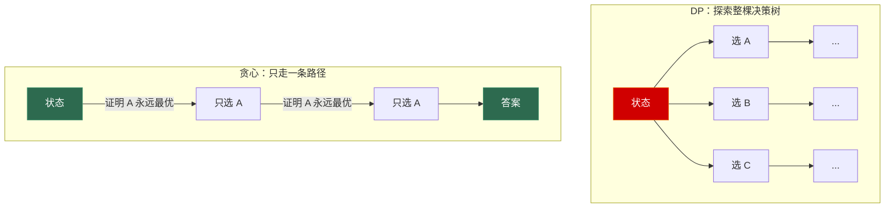
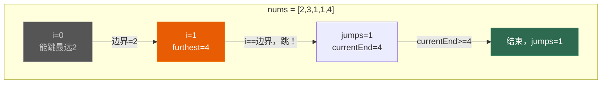

# 第五章 贪心算法：局部最优即全局最优

> **一句话理解**：贪心是 DP 的"反面"——DP 枚举所有可能的选择取最优，贪心则断言"这一步的最优选择就是全局最优的选择"。学贪心的关键是学会**证明为什么贪心策略正确**。

> 📋 前置知识：Ch3（基础DP）—— 先理解 DP 的"枚举所有选择"，才能体会贪心的"只看当前最优"

---

## 5.1 概念直觉 —— What & Why

### 贪心 vs DP —— 本质差异

```
DP 的思维方式：
  dp[i] 依赖之前所有的选择 → 我不知道哪个选择最好 → 我都试一遍

贪心的思维方式：
  当前有两个选择 A 和 B → 我能证明选 A 永远不劣于选 B → 永远选 A
```

| 维度 | DP | 贪心 |
|------|-----|------|
| 决策方式 | 枚举所有可能，取最优 | 只看当前，选局部最优 |
| 正确性保证 | 状态转移方程覆盖所有情况 | **需要严格证明**（难点！） |
| 时间复杂度 | 通常 O(n²) 或 O(n*k) | 通常 **O(n log n)** 或 O(n) |
| 代码量 | 较多（填表/递推） | **极少**（通常是排序 + 遍历） |
| 错的代价 | 错了就是算法设计错误 | **错了也能跑出结果——只是不是最优** |

> ⚠️ 贪心最大的陷阱：想当然。很多看起来"显然"的贪心策略其实是错的。**面试中使用贪心之前，必须能在口头上给出正确性证明**。

### 贪心成立的两个条件

1. **贪心选择性质**：局部最优选择能导致全局最优——即第一步选最优的不会"锁死"后续的可能性
2. **最优子结构**：做出贪心选择后，剩下的子问题与原问题同构

### 常见伪贪心案例 —— 从错误中学习

```
反面教材：找零钱问题
  硬币面值 [1, 3, 4]，找 6 块钱。
  
  贪心（每次选最大面值）：6 → 4 → 1 → 1 （3 枚硬币）
  最优解：3 + 3 = 6 （2 枚硬币）
  
  ❌ 贪心失败！因为选了 4 之后，剩余 2 无法用最优方式凑出。
  
  ✅ 这个问题应该用 DP（完全背包，Ch3）
```

> 💡 **面试中的表述**：「贪心不是万能的——它只在"贪心选择性质"成立时才有效。面试中遇到"最值"问题，先想 DP，如果 DP 的转移中有冗余（很多选择显然不会是最优），再考虑贪心。而且必须能证明贪心策略的正确性。」

---

## 5.2 原理图解

### 贪心 vs DP 的决策树对比



### 区间调度 —— 贪心最经典的应用场景

```
问题：N 个区间 [start, end)，选最多的互不重叠的区间。

直觉 1：每次都选最早开始的 → ❌ 反例：一个超长区间覆盖了所有短的
直觉 2：每次都选最短的 → ❌ 反例：一个短区间位于中间，两边各有一个刚好不重叠的
直觉 3：每次都选最早结束的 → ✅ 正确！可以用交换论证证明
```


---

## 5.3 核心算法实现

### 5.3.1 区间调度 —— 贪心最经典的模板

#### 无重叠区间 (LeetCode 435)

```cpp
// 求需要移除的最少区间数，使剩余区间互不重叠
// 等价于：保留最多的互不重叠区间
// 贪心策略：按结束时间升序，每次选最早结束的
int eraseOverlapIntervals(std::vector<std::vector<int>>& intervals) {
    if (intervals.empty()) return 0;

    // 按结束时间排序（贪心的核心依据）
    std::sort(intervals.begin(), intervals.end(),
        [](const auto& a, const auto& b) {
            return a[1] < b[1];  // 按 end 升序
        });

    int count = 1;                // 保留的区间数
    int lastEnd = intervals[0][1];

    for (int i = 1; i < intervals.size(); ++i) {
        if (intervals[i][0] >= lastEnd) {  // 不重叠
            ++count;
            lastEnd = intervals[i][1];
        }
    }
    return intervals.size() - count;  // 移除的 = 总数 - 保留的
}
```

#### 用最少数量的箭引爆气球 (LeetCode 452)

```cpp
// 气球在 x 轴上占据 [start, end]，箭从 x 轴垂直射出
// 一支箭可以刺穿所有重叠的气球 → 求最少箭数
// 贪心 = 找"最大重叠"：射在重叠区间的共同结束位置
int findMinArrowShots(std::vector<std::vector<int>>& points) {
    if (points.empty()) return 0;

    // 按结束位置排序
    std::sort(points.begin(), points.end(),
        [](const auto& a, const auto& b) { return a[1] < b[1]; });

    int arrows = 1;
    int arrowPos = points[0][1];  // 当前这支箭的射出位置

    for (int i = 1; i < points.size(); ++i) {
        if (points[i][0] > arrowPos) {  // 需要新箭
            ++arrows;
            arrowPos = points[i][1];
        }
    }
    return arrows;
}
```

> 💡 **面试中的表述**：「区间调度问题的贪心策略是"按结束时间排序，每次选最早结束的"。"最早结束"意味着给后面的区间留出了最大的剩余空间——这就是贪心选择的直觉。正确性可以用交换论证严格证明。」

#### 合并区间 (LeetCode 56)

```cpp
// 合并所有重叠区间（不是贪心，但和区间调度一起考）
std::vector<std::vector<int>> merge(std::vector<std::vector<int>>& intervals) {
    if (intervals.empty()) return {};

    // 按起始位置排序（不是结束位置！）
    std::sort(intervals.begin(), intervals.end(),
        [](const auto& a, const auto& b) { return a[0] < b[0]; });

    std::vector<std::vector<int>> result;
    result.push_back(intervals[0]);

    for (int i = 1; i < intervals.size(); ++i) {
        auto& last = result.back();
        if (intervals[i][0] <= last[1]) {
            last[1] = std::max(last[1], intervals[i][1]);  // 合并
        } else {
            result.push_back(intervals[i]);
        }
    }
    return result;
}
```

| 问题 | 排序依据 | 策略 |
|------|---------|------|
| 无重叠区间 (435) | 按结束 | 选最早结束 |
| 最少箭数 (452) | 按结束 | 箭射在重叠区的共同结束点 |
| 合并区间 (56) | **按开始** | 遇到重叠就扩展 |

---

### 5.3.2 分配问题

#### 分发饼干 (LeetCode 455)

```cpp
// N 个孩子各有"胃口" g[i]，M 块饼干各有"尺寸" s[j]
// 每块饼干只能给一个孩子，孩子的胃口 ≤ 饼干尺寸时得到满足
// 求最多满足的孩子数
// 贪心：优先满足胃口小的孩子，用最小的能满足他的饼干
int findContentChildren(std::vector<int>& g, std::vector<int>& s) {
    std::sort(g.begin(), g.end());
    std::sort(s.begin(), s.end());

    int child = 0;
    for (int cookie = 0; child < g.size() && cookie < s.size(); ++cookie) {
        if (s[cookie] >= g[child]) {
            ++child;  // 这块饼干满足了这个孩子
        }
    }
    return child;
}
```

> 直觉：胃口小的孩子更容易满足——把大饼干留给胃口大的孩子。如果反过来，大饼干给了胃口小的孩子，可能导致后面的大胃口孩子没有合适的饼干。

#### 加油站 (LeetCode 134)

```cpp
// 环形路线，gas[i] 是在 i 站可加的油，cost[i] 是从 i 到 i+1 的油耗
// 能否找到起点，绕一圈回到起点？
// 贪心：如果总油量 >= 总消耗，一定存在解；找累计油量降到最低点的下一个站
int canCompleteCircuit(std::vector<int>& gas, std::vector<int>& cost) {
    int totalSurplus = 0;
    int currentSurplus = 0;
    int start = 0;

    for (int i = 0; i < gas.size(); ++i) {
        int diff = gas[i] - cost[i];
        totalSurplus += diff;
        currentSurplus += diff;

        if (currentSurplus < 0) {
            // 从 start 到 i 的任何一站都无法作为起点
            start = i + 1;
            currentSurplus = 0;
        }
    }
    return totalSurplus >= 0 ? start : -1;
}
```

---

### 5.3.3 跳跃游戏系列

#### 跳跃游戏 I (LeetCode 55)

```cpp
// 判断能否从位置 0 跳到位置 n-1
// nums[i] = 在位置 i 能跳的最远距离
// 贪心：维护"当前能到达的最远位置"
bool canJump(std::vector<int>& nums) {
    int furthest = 0;
    for (int i = 0; i < nums.size() && i <= furthest; ++i) {
        furthest = std::max(furthest, i + nums[i]);
    }
    return furthest >= nums.size() - 1;
}
```

```
nums = [2, 3, 1, 1, 4]
i=0: furthest = max(0, 0+2) = 2   → 最远到索引 2
i=1: furthest = max(2, 1+3) = 4   → 最远到索引 4（终点了！）
return true
```

#### 跳跃游戏 II (LeetCode 45)

```cpp
// 求从 0 到 n-1 的最少跳跃次数（保证可达）
// 贪心：每一步跳到"能使我下一步走最远"的位置
int jump(std::vector<int>& nums) {
    int n = nums.size();
    if (n <= 1) return 0;

    int jumps = 0;
    int currentEnd = 0;    // 当前这一步能到达的最远边界
    int furthest = 0;      // 下一步能到达的最远位置

    for (int i = 0; i < n - 1; ++i) {  // 注意：不遍历最后一个位置
        furthest = std::max(furthest, i + nums[i]);

        if (i == currentEnd) {         // 到达当前步的边界
            ++jumps;                    // 必须跳下一步
            currentEnd = furthest;      // 更新边界

            if (currentEnd >= n - 1) break;  // 已能到终点
        }
    }
    return jumps;
}
```



---

### 5.3.4 任务调度器 (LeetCode 621)

```cpp
// N 种任务，同种任务之间必须有 n 个单位的冷却
// 求最短执行时间
// 贪心：按频率降序排列，高频任务之间插入冷却槽
int leastInterval(std::vector<char>& tasks, int n) {
    std::vector<int> freq(26, 0);
    for (char t : tasks) freq[t - 'A']++;
    std::sort(freq.begin(), freq.end(), std::greater<int>());

    int maxFreq = freq[0];
    int idleSlots = (maxFreq - 1) * n;          // 冷却槽总数

    // 用次高频任务填充冷却槽
    for (int i = 1; i < 26 && freq[i] > 0; ++i) {
        idleSlots -= std::min(freq[i], maxFreq - 1);
    }

    idleSlots = std::max(0, idleSlots);
    return tasks.size() + idleSlots;
}
```

```
示例：tasks = [A,A,A,B,B,B], n = 2
maxFreq = 3 (A 出现 3 次)
冷却槽 = (3-1) * 2 = 4

布局：A _ _ A _ _ A
      ↑ 填 B：A B _ A B _ A → idleSlots = 4 - 2 = 2
      ↑ 没有更多任务填了 → 答案 = 6 + 2 = 8
```

---

### 5.3.5 霍夫曼编码

霍夫曼编码是**贪心算法最优子结构的经典证明案例**：用最小堆每次合并频率最低的两个节点。

```cpp
#include <queue>
#include <string>
#include <unordered_map>

struct HuffmanNode {
    char ch;
    int  freq;
    HuffmanNode *left, *right;

    HuffmanNode(char c, int f) : ch(c), freq(f), left(nullptr), right(nullptr) {}
    HuffmanNode(char c, int f, HuffmanNode* l, HuffmanNode* r)
        : ch(c), freq(f), left(l), right(r) {}
};

// 构建霍夫曼树，返回每个字符的编码
std::unordered_map<char, std::string> buildHuffman(
    const std::unordered_map<char, int>& freqMap) {

    // 最小堆，按频率排序
    auto cmp = [](HuffmanNode* a, HuffmanNode* b) {
        return a->freq > b->freq;  // 频率小的优先
    };
    std::priority_queue<HuffmanNode*, std::vector<HuffmanNode*>, decltype(cmp)> pq(cmp);

    for (auto& [ch, freq] : freqMap) {
        pq.push(new HuffmanNode(ch, freq));
    }

    // 贪心：每次合并频率最小的两个
    while (pq.size() > 1) {
        auto* left = pq.top(); pq.pop();
        auto* right = pq.top(); pq.pop();

        auto* parent = new HuffmanNode('\0',
            left->freq + right->freq, left, right);
        pq.push(parent);
    }

    // DFS 遍历树，生成编码
    std::unordered_map<char, std::string> codes;
    std::function<void(HuffmanNode*, std::string)> dfs =
        [&](HuffmanNode* node, std::string code) {
        if (!node) return;
        if (!node->left && !node->right) {  // 叶子节点
            codes[node->ch] = code;
        }
        dfs(node->left,  code + "0");
        dfs(node->right, code + "1");
    };

    dfs(pq.top(), "");
    return codes;
}
```

> 💡 **面试中的表述**：「霍夫曼编码的贪心策略是"每次合并频率最低的两个节点"。这保证了高频字符获得短编码、低频字符获得长编码，从而使加权路径长度最小。正确性证明用了"最优子结构"——如果一棵树是最优的，那么合并它最小频率的两个兄弟节点后，得到的树在"少一个字符"的问题上也是最优的。」

---

### 5.3.6 贪心正确性证明 —— 面试中如何快速论证

面试中不需要写严格数学证明，但需要**口头论证**。三种常用方法：

**方法一：交换论证 (Exchange Argument)**

```
假设存在一个不包含贪心选择的最优解，通过交换操作把它变成包含贪心选择的解，
且交换后不会变差 → 贪心选择可以成为最优解的一部分。

典型应用：区间调度。假设最优解不包含最早结束的区间，
把最优解的第一个区间替换为最早结束的区间 → 不会减少区间数量。
```

**方法二：归纳法**

```
证明：贪心选择第一步后，剩余问题与原问题同构（最优子结构），
且贪心选择不会破坏全局最优性。

典型应用：跳跃游戏。如果能证明"从当前位置跳到能到达的最远位置"
不会错过任何可到达的节点 → 归纳。
```

**方法三：反证法**

```
假设贪心解不是最优解，导出矛盾。

典型应用：分发饼干。假设不给胃口最小的孩子分配"最小的能满足他的饼干"，
而是留给了后面的孩子 → 后面的孩子可能吃不到 → 不是最优。
```

---

## 5.4 高频面试题精讲

### 题目 1：划分字母区间 (LeetCode 763)

```cpp
// 贪心：记录每个字符最后出现的位置
// 遍历时不断扩展当前片段的右边界
std::vector<int> partitionLabels(std::string s) {
    std::vector<int> last(26, 0);
    for (int i = 0; i < s.size(); ++i) {
        last[s[i] - 'a'] = i;
    }

    std::vector<int> result;
    int start = 0, end = 0;

    for (int i = 0; i < s.size(); ++i) {
        end = std::max(end, last[s[i] - 'a']);  // 扩展右边界
        if (i == end) {                          // 到达当前片段的边界
            result.push_back(i - start + 1);
            start = i + 1;
        }
    }
    return result;
}
```

### 题目 2：根据身高重建队列 (LeetCode 406)

```cpp
// people[i] = [h, k]，h 是身高，k 是前面有 k 个身高 ≥ h 的人
// 贪心：先按身高降序排，身高相同按 k 升序排
// 然后逐个插入：k 就是在当前结果中的插入位置
std::vector<std::vector<int>> reconstructQueue(
    std::vector<std::vector<int>>& people) {

    std::sort(people.begin(), people.end(),
        [](const auto& a, const auto& b) {
            return a[0] > b[0] || (a[0] == b[0] && a[1] < b[1]);
        });

    std::vector<std::vector<int>> result;
    for (const auto& p : people) {
        result.insert(result.begin() + p[1], p);
    }
    return result;
}
```

> 💡 为什么先排高个子？因为高个子插入后，后面插入的矮个子不会影响高个子的 k 值——矮个子对高个子的 k 无贡献。

---

### 面试题速查清单

| # | 题目 | LeetCode | 难度 | 核心技巧 |
|---|------|----------|------|---------|
| 1 | 分发饼干 | 455 | Easy | 双指针 + 排序 |
| 2 | 无重叠区间 | 435 | Medium | 按结束时间排序 |
| 3 | 最少箭数 | 452 | Medium | 按结束时间 + 重叠计数 |
| 4 | 合并区间 | 56 | Medium | **按开始时间排序** |
| 5 | 跳跃游戏 | 55 | Medium | 最远可达 |
| 6 | 跳跃游戏 II | 45 | Medium | 分层 BFS 贪心 |
| 7 | 加油站 | 134 | Medium | 累计油量 |
| 8 | 划分字母区间 | 763 | Medium | 最后出现位置 |
| 9 | 任务调度器 | 621 | Medium | 填冷却槽 |
| 10 | 根据身高重建队列 | 406 | Medium | 降序 + 按 k 插入 |
| 11 | IPO | 502 | Hard | 堆 + 贪心 |
| 12 | 拼接最大数 | 321 | Hard | 单调栈 + 合并 |

---

## 5.5 🎮 游戏实战

### 5.5.1 技能 CD 管理 —— 区间调度

```cpp
// 玩家有 N 个技能，每个技能有冷却时间 [start, end)
// 不能同时使用有 CD 重叠的技能，求最多能释放多少个技能
// → 标准区间调度问题
struct Skill {
    std::string name;
    int         cooldownStart;
    int         cooldownEnd;    // 冷却结束时间
};

std::vector<Skill> maxSkillsInWindow(const std::vector<Skill>& skills) {
    auto sorted = skills;
    std::sort(sorted.begin(), sorted.end(),
        [](const Skill& a, const Skill& b) {
            return a.cooldownEnd < b.cooldownEnd;
        });

    std::vector<Skill> result;
    int lastEnd = -1;

    for (const auto& skill : sorted) {
        if (skill.cooldownStart >= lastEnd) {
            result.push_back(skill);
            lastEnd = skill.cooldownEnd;
        }
    }
    return result;
}
```

### 5.5.2 Buff 时间轴安排 —— 区间调度变体

```cpp
// 多个 Buff 道具，每个提供 [start, end) 的属性加成
// 选一组互不重叠的 Buff，使总加成最大
// 这是"带权区间调度"——经典 DP 问题（贪心不适用！）
// 但可以先贪心排序，再 DP
struct Buff {
    int start, end, value;
};

int maxBuffValue(std::vector<Buff>& buffs) {
    std::sort(buffs.begin(), buffs.end(),
        [](const Buff& a, const Buff& b) { return a.end < b.end; });

    int n = buffs.size();
    std::vector<int> dp(n, 0);

    for (int i = 0; i < n; ++i) {
        dp[i] = buffs[i].value;

        // 二分查找最后一个不重叠的 Buff
        int lo = 0, hi = i - 1, last = -1;
        while (lo <= hi) {
            int mid = (lo + hi) / 2;
            if (buffs[mid].end <= buffs[i].start) {
                last = mid;
                lo = mid + 1;
            } else {
                hi = mid - 1;
            }
        }

        if (last != -1) dp[i] = std::max(dp[i], dp[last] + buffs[i].value);
        if (i > 0) dp[i] = std::max(dp[i], dp[i - 1]);
    }
    return dp[n - 1];
}
```

> 💡 带权的区间调度不能用贪心——需要 DP。但贪心排序（按 end）是 DP 的前置步骤。这也是面试中常见的"贪心预处理 + DP"模式。

### 5.5.3 资源点采集路径 —— 加油站问题

```cpp
// N 个资源点排成环形，采集需要消耗燃料
// 找一个起点使得能绕一圈采集完所有资源
// → 标准加油站问题
struct ResourceNode {
    int fuelGain;     // 采集获得燃料
    int fuelCost;     // 去下一个点的消耗
};

int findStartNode(const std::vector<ResourceNode>& nodes) {
    int n = nodes.size();
    int totalSurplus = 0, currentSurplus = 0, start = 0;

    for (int i = 0; i < n; ++i) {
        int diff = nodes[i].fuelGain - nodes[i].fuelCost;
        totalSurplus += diff;
        currentSurplus += diff;

        if (currentSurplus < 0) {
            start = i + 1;
            currentSurplus = 0;
        }
    }
    return totalSurplus >= 0 ? start : -1;
}
```

### 5.5.4 任务优先级调度 —— 任务调度器

```cpp
// 游戏主循环中，不同类型任务有冷却时间
// 同类任务必须间隔 n 帧 → 求最短帧数完成所有任务
int minFrames(const std::vector<int>& taskTypes, int n) {
    // 实现同 LeetCode 621 任务调度器
    std::unordered_map<int, int> freq;
    for (int type : taskTypes) freq[type]++;

    int maxFreq = 0;
    for (auto& [_, f] : freq) maxFreq = std::max(maxFreq, f);

    int maxCount = 0;
    for (auto& [_, f] : freq) {
        if (f == maxFreq) ++maxCount;
    }

    int frameCount = (maxFreq - 1) * (n + 1) + maxCount;
    return std::max(frameCount, (int)taskTypes.size());
}
```

---

## 5.6 30 秒速答

> 📋 以下是本章核心知识点的面试速答模板。

---

**Q：贪心和 DP 的区别？如何判断该用哪个？**

> DP 枚举所有可能的选择取最优，贪心只选当前最优。面试中先想 DP——如果 DP 的转移中很多选择显然不可能成为最优（比如结束更晚的区间不可能比结束更早的好），就转贪心。贪心的风险在于——看起来合理的贪心策略可能是错的，必须能口头证明。

**Q：区间调度问题的标准贪心策略？**

> 按结束时间升序排序，每次选最早结束的、且与已选区间不重叠的。这样给后续区间留出了最大剩余空间。注意：如果是合并区间问题，排序依据变为**开始时间**。

**Q：如何证明贪心策略的正确性？**

> 三种方法。交换论证：把最优解中的某个选择替换为贪心选择，证明不会变差。归纳法：证明贪心选择第一步后，剩余问题与原问题同构。反证法：假设贪心解不是最优，导出矛盾。面试中用交换论证最多——以区间调度为例，把最优解的第一个区间换成最早结束的，不减少总数。

**Q：跳跃游戏 II 的贪心思路？**

> 维护两个变量：当前步的边界 currentEnd，下一步能到达的最远位置 furthest。遍历时不断更新 furthest。当 i 到达 currentEnd 时，步数+1，更新边界为 furthest。本质是 BFS 的贪心版——每层对应"跳一次能到达的所有位置"。

**Q：霍夫曼编码为什么是贪心？**

> 每次合并频率最低的两个节点，保证了频率高的字符离根近（短编码），频率低的离根远（长编码）。这个策略的正确性基于最优子结构：如果全局最优，则"合并最低频两个节点后"对规模-1 的问题也是最优的。

---

## 5.7 本章习题清单

```
区间调度：
  □ 435. 无重叠区间 —— 经典模板
  □ 452. 用最少数量的箭引爆气球 —— 重叠计数
  □ 56.  合并区间 —— 按开始排序
  □ 763. 划分字母区间 —— 动态扩展边界

分配问题：
  □ 455. 分发饼干 —— 入门贪心
  □ 406. 根据身高重建队列 —— 降序 + 插入
  □ 134. 加油站 —— 环形贪心

跳跃游戏：
  □ 55.  跳跃游戏 —— 可行性
  □ 45.  跳跃游戏 II —— 最少步数

调度与编码：
  □ 621. 任务调度器 —— 冷却槽模型
  □ 霍夫曼编码 —— 手写一次最小堆合并过程

挑战：
  □ 502. IPO —— 堆 + 贪心
  □ 321. 拼接最大数 —— 单调栈 + 贪心合并
```

---

> 📖 下一章：[第六章 回溯与搜索进阶](../algorithm/06_backtracking) —— 当 DP 和贪心都不适用时，回溯 + 剪枝是最后的武器。从排列/组合/子集到 N 皇后，从剪枝策略到 BFS→Dijkstra→A* 的完整演化。
