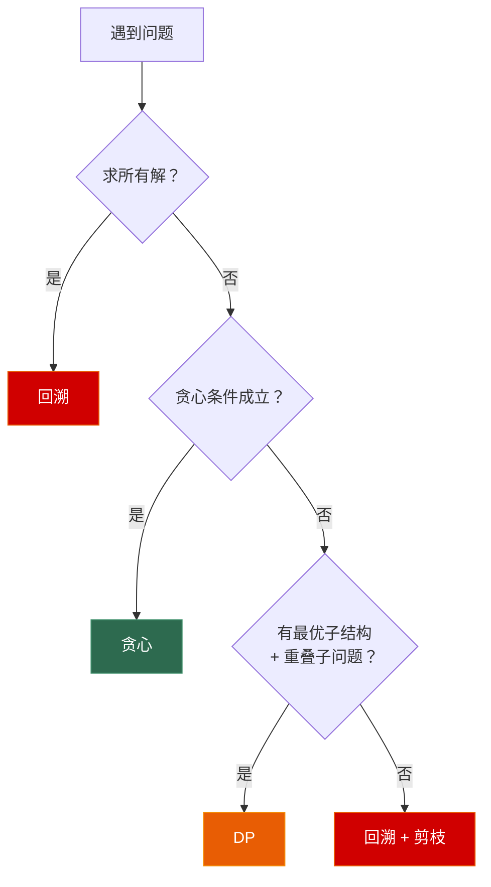
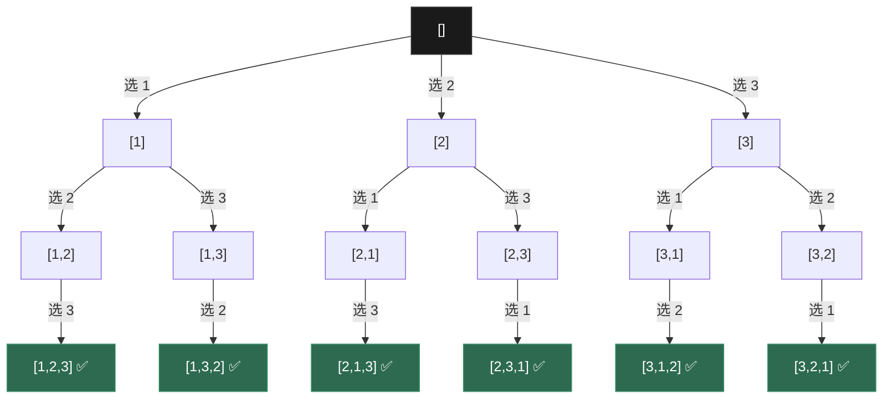
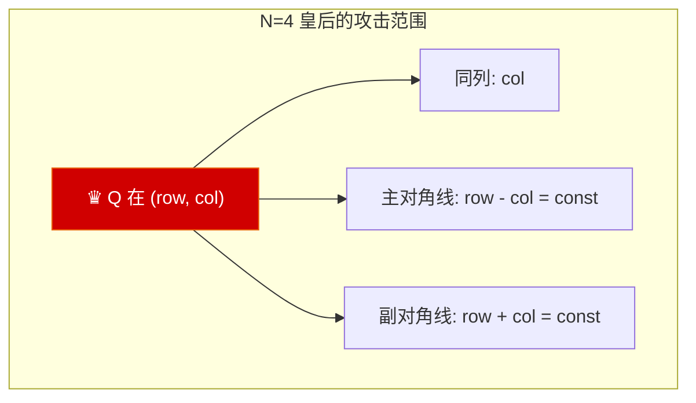
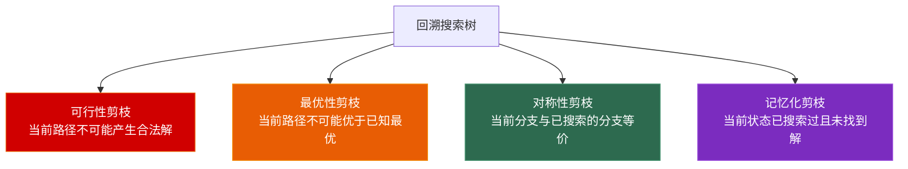
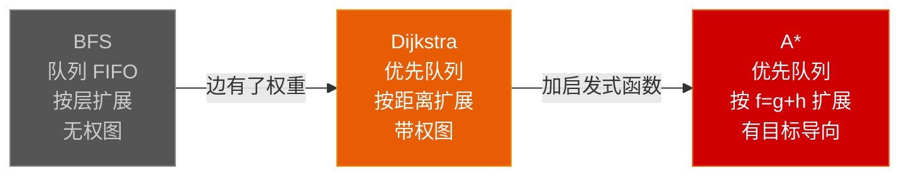

# 第六章 回溯与搜索进阶：从暴力到启发式

> **一句话理解**：回溯是"万能暴力法"——当 DP 和贪心都失效时，回溯 + 剪枝是最后的武器。而 BFS → Dijkstra → A* 的演化展示了搜索如何从盲目走向智能。

> 📋 前置知识：数据结构 Ch3（栈——递归调用栈）、Ch7.1（BFS/DFS）、Ch7.2（Dijkstra）

---

## 6.1 概念直觉 —— What & Why

### 回溯的本质 —— 在状态空间树上做 DFS

回溯算法 = **DFS 遍历决策树 + 适时回溯**。每层代表一个决策点，每条路径代表一个候选解。

```
回溯的通用范式：
┌─────────────────────────────────────────────┐
│ void backtrack(路径, 选择列表) {              │
│     if (满足结束条件) {                       │
│         记录答案;                             │
│         return;                              │
│     }                                        │
│                                              │
│     for (选择 in 选择列表) {                  │
│         if (选择不合法) continue;  ← 剪枝      │
│         做选择;                               │
│         backtrack(路径, 新的选择列表);         │
│         撤销选择;  ← 回溯                     │
│     }                                        │
│ }                                            │
└─────────────────────────────────────────────┘
```

### 回溯 vs DP vs 贪心 —— 三种算法范式的边界

```
问题：求所有可行解 / 所有方案 → 回溯（唯一选择）
问题：求某个可行解 → 回溯 或 贪心（如果贪心条件成立）
问题：求最优解：
  ├─ 贪心条件成立 → 贪心 O(n log n)
  ├─ 有最优子结构 + 重叠子问题 → DP O(n²) 左右
  └─ 都不满足 → 回溯 + 剪枝（指数级，但剪枝后可能很快）
```



---

## 6.2 原理图解

### 回溯的递归树

以 `nums = [1,2,3]` 的全排列为例：



> 每一条从根到叶的路径就是一个排列。回溯的关键在于——到达叶子后，退回上一层，撤销最后的选择，尝试下一个选择。

### 排列 vs 组合 vs 子集 —— 决策树的三种形态

```
排列 (Permutation)：  顺序重要 → 每层可选"所有未选中的元素"
组合 (Combination)：  顺序不重要 → 每层从 start 开始，只能向后选
子集 (Subset)：      每个元素选/不选 → 每层对应一个元素，两个分支
```

---

## 6.3 核心算法实现

### 6.3.1 回溯框架的三种标准写法

#### 排列模板

```cpp
// 全排列：从"尚未选择的元素"中选择
void permute(std::vector<int>& nums, std::vector<bool>& used,
             std::vector<int>& path,
             std::vector<std::vector<int>>& result) {
    if (path.size() == nums.size()) {
        result.push_back(path);
        return;
    }

    for (int i = 0; i < nums.size(); ++i) {
        if (used[i]) continue;           // 跳过已选中的
        // 去重：如果当前元素和前一个相同，且前一个未使用
        // → 说明在同层已处理过相同的值
        if (i > 0 && nums[i] == nums[i - 1] && !used[i - 1]) continue;

        used[i] = true;
        path.push_back(nums[i]);
        permute(nums, used, path, result);
        path.pop_back();                 // 回溯
        used[i] = false;
    }
}
```

> ⚠️ **去重的关键**：`!used[i-1]` 表示 `nums[i-1]` 和 `nums[i]` 相同但在**同一层**被处理过（而非被同一个 path 使用）。同一层的去重用 `!used[i-1]`，同一个 path 的去重用 `used[i-1]`。

#### 组合模板

```cpp
// 组合：从 start 开始，只向后选（避免重复组合）
void combine(int n, int k, int start,
             std::vector<int>& path,
             std::vector<std::vector<int>>& result) {
    if (path.size() == k) {
        result.push_back(path);
        return;
    }

    // 剪枝：如果剩余元素不够凑齐 k 个，提前终止
    // i <= n - (k - path.size()) + 1
    for (int i = start; i <= n - (k - path.size()) + 1; ++i) {
        path.push_back(i);
        combine(n, k, i + 1, path, result);
        path.pop_back();
    }
}
```

#### 子集模板

```cpp
// 子集：每个元素两种选择（选/不选）
void subsets(std::vector<int>& nums, int idx,
             std::vector<int>& path,
             std::vector<std::vector<int>>& result) {
    // 每个节点都是一个有效子集（不只是叶子！）
    result.push_back(path);

    for (int i = idx; i < nums.size(); ++i) {
        if (i > idx && nums[i] == nums[i - 1]) continue;  // 同层去重
        path.push_back(nums[i]);
        subsets(nums, i + 1, path, result);
        path.pop_back();
    }
}
```

| | 排列 | 组合 | 子集 |
|------|------|------|------|
| 结束条件 | `path.size() == n` | `path.size() == k` | 无（每个节点都记录） |
| 选择范围 | 所有未用元素 | `[start, n)` | `[idx, n)` |
| 同层去重 | `!used[i-1]` | `i > start` | `i > idx` |
| 时间复杂度 | O(n!) | O(C(n,k) * k) | O(2ⁿ) |

---

### 6.3.2 排列问题进阶

#### 组合总和 I (LeetCode 39) —— 可重复选的组合

```cpp
// 每个元素可以选无限次 → 组合变体
// start 不前进意味着可以重复选同一个元素
void combinationSum(std::vector<int>& candidates, int target,
                    int start, std::vector<int>& path,
                    std::vector<std::vector<int>>& result) {
    if (target == 0) {
        result.push_back(path);
        return;
    }
    if (target < 0) return;  // 剪枝

    for (int i = start; i < candidates.size(); ++i) {
        path.push_back(candidates[i]);
        combinationSum(candidates, target - candidates[i], i, path, result);
        //                                                      ↑ i 不是 i+1！
        //                                              这样可以重复选
        path.pop_back();
    }
}
```

#### 组合总和 II (LeetCode 40) —— 每个元素只能用一次

```cpp
// 与 39 的区别：i+1 而非 i，且需要排序+去重
void combinationSum2(std::vector<int>& candidates, int target,
                     int start, std::vector<int>& path,
                     std::vector<std::vector<int>>& result) {
    if (target == 0) {
        result.push_back(path);
        return;
    }

    for (int i = start; i < candidates.size(); ++i) {
        if (i > start && candidates[i] == candidates[i - 1]) continue;
        if (candidates[i] > target) break;  // 排序后可提前终止

        path.push_back(candidates[i]);
        combinationSum2(candidates, target - candidates[i], i + 1, path, result);
        path.pop_back();
    }
}
```

#### 括号生成 (LeetCode 22)

```cpp
// 生成 n 对有效括号 → 回溯 + 合法性剪枝
void generateParenthesis(int n, int open, int close,
                         std::string& path,
                         std::vector<std::string>& result) {
    if (path.size() == 2 * n) {
        result.push_back(path);
        return;
    }

    // 选 '('：条件是有剩余的 '('
    if (open < n) {
        path.push_back('(');
        generateParenthesis(n, open + 1, close, path, result);
        path.pop_back();
    }

    // 选 ')'：条件是 ')' 数小于 '(' 数（保证合法性）
    if (close < open) {
        path.push_back(')');
        generateParenthesis(n, open, close + 1, path, result);
        path.pop_back();
    }
}
```

---

### 6.3.3 棋盘问题

#### N 皇后 (LeetCode 51)

```cpp
// 经典回溯：每行放一个皇后，检查列/对角线冲突
std::vector<std::vector<std::string>> solveNQueens(int n) {
    std::vector<std::vector<std::string>> result;
    std::vector<std::string> board(n, std::string(n, '.'));

    // 状态数组：列、主对角线、副对角线是否被占用
    std::vector<bool> cols(n, false);
    std::vector<bool> diag1(2 * n - 1, false);  // 主对角线：row-col = const
    std::vector<bool> diag2(2 * n - 1, false);  // 副对角线：row+col = const

    std::function<void(int)> backtrack = [&](int row) {
        if (row == n) {
            result.push_back(board);
            return;
        }

        for (int col = 0; col < n; ++col) {
            int d1 = row - col + n - 1;  // 主对角线索引（偏移为正）
            int d2 = row + col;           // 副对角线索引

            if (cols[col] || diag1[d1] || diag2[d2]) continue;

            board[row][col] = 'Q';
            cols[col] = diag1[d1] = diag2[d2] = true;

            backtrack(row + 1);

            board[row][col] = '.';
            cols[col] = diag1[d1] = diag2[d2] = false;
        }
    };

    backtrack(0);
    return result;
}
```



#### 解数独 (LeetCode 37)

```cpp
// 回溯 + 约束传播：先填候选数最少的空格
void solveSudoku(std::vector<std::vector<char>>& board) {
    // 行/列/宫的占用状态
    std::vector<std::vector<bool>> rows(9, std::vector<bool>(10, false));
    std::vector<std::vector<bool>> cols(9, std::vector<bool>(10, false));
    std::vector<std::vector<bool>> boxes(9, std::vector<bool>(10, false));

    // 初始化：标记已填数字
    for (int r = 0; r < 9; ++r) {
        for (int c = 0; c < 9; ++c) {
            if (board[r][c] != '.') {
                int num = board[r][c] - '0';
                int box = (r / 3) * 3 + c / 3;
                rows[r][num] = cols[c][num] = boxes[box][num] = true;
            }
        }
    }

    std::function<bool(int, int)> backtrack = [&](int r, int c) -> bool {
        if (r == 9) return true;  // 填完了
        if (c == 9) return backtrack(r + 1, 0);  // 换行

        if (board[r][c] != '.') return backtrack(r, c + 1);  // 已填

        int box = (r / 3) * 3 + c / 3;
        for (int num = 1; num <= 9; ++num) {
            if (rows[r][num] || cols[c][num] || boxes[box][num]) continue;

            board[r][c] = '0' + num;
            rows[r][num] = cols[c][num] = boxes[box][num] = true;

            if (backtrack(r, c + 1)) return true;  // 找到解就停

            board[r][c] = '.';
            rows[r][num] = cols[c][num] = boxes[box][num] = false;
        }
        return false;
    };

    backtrack(0, 0);
}
```

#### 单词搜索 (LeetCode 79)

```cpp
// 在二维网格中搜索单词 → DFS + visited 标记
bool exist(std::vector<std::vector<char>>& board, std::string word) {
    int m = board.size(), n = board[0].size();
    int dirs[] = {0, 1, 0, -1, 0};

    std::function<bool(int, int, int)> dfs = [&](int r, int c, int idx) {
        if (idx == word.size()) return true;
        if (r < 0 || r >= m || c < 0 || c >= n) return false;
        if (board[r][c] != word[idx]) return false;

        char temp = board[r][c];
        board[r][c] = '#';  // 标记已访问（省 visited 数组）

        for (int d = 0; d < 4; ++d) {
            if (dfs(r + dirs[d], c + dirs[d + 1], idx + 1)) {
                return true;
            }
        }

        board[r][c] = temp;  // 回溯恢复
        return false;
    };

    for (int r = 0; r < m; ++r) {
        for (int c = 0; c < n; ++c) {
            if (dfs(r, c, 0)) return true;
        }
    }
    return false;
}
```

> 💡 用 `board[r][c] = '#'` 标记已访问，避免了额外分配 `visited[m][n]` 数组。这是回溯中常用的"原地标记"技巧。

---

### 6.3.4 剪枝策略专题

剪枝是回溯从"暴力"变为"可行"的关键。不剪枝的回溯通常只能处理 n ≤ 10 的问题。



#### 可行性剪枝

```cpp
// 组合总和：candidates 排序后，如果当前元素 > 剩余 target，后面的更大
// → 提前 break（而非 continue）
if (candidates[i] > target) break;  // 后续元素更大，不可能满足

// N 皇后：用 O(1) 检查列/对角线冲突 → 避免每次 O(n) 扫描
```

#### 最优性剪枝

```cpp
// 在求"最少步数"等问题中维护全局最优
// 如果当前路径长度 >= 已知最优解 → 直接返回
void dfsWithPruning(int steps, int target, int& best) {
    if (steps >= best) return;  // 不可能更优了
    if (target == 0) {
        best = std::min(best, steps);
        return;
    }
    // ... 继续搜索
}
```

#### 对称性剪枝

```cpp
// 全排列去重：排序 + 跳过同层重复元素
if (i > 0 && nums[i] == nums[i - 1] && !used[i - 1]) continue;

// N 皇后：第一行只遍历前 ceil(n/2) 个位置（利用镜像对称）
for (int col = 0; col < (n + 1) / 2; ++col) { ... }  // 结果 * 2
```

#### 记忆化剪枝

```cpp
// 单词搜索 II (LeetCode 212)：Trie + 回溯
// 用 Trie 记录所有单词 → 同时搜索多个单词
// 用 memo 记录"从 (r,c) 出发，当前 Trie 节点，是否找到过单词"
```

---

## 6.4 BFS → Dijkstra → A* 完整演化

> 本节展示搜索算法的进化链：每一步演化解决了什么问题，下一个算法如何在前一个的基础上改进。

### BFS —— 无权图的最短路径

BFS 用队列逐层扩展，保证首次遇到目标时就是最短路径。

```cpp
// 标准 BFS：层序遍历
int bfs(const std::vector<std::vector<int>>& graph, int start, int target) {
    int n = graph.size();
    std::vector<bool> visited(n, false);
    std::queue<std::pair<int, int>> q;  // {node, distance}
    q.push({start, 0});
    visited[start] = true;

    while (!q.empty()) {
        auto [node, dist] = q.front(); q.pop();
        if (node == target) return dist;

        for (int next : graph[node]) {
            if (!visited[next]) {
                visited[next] = true;
                q.push({next, dist + 1});
            }
        }
    }
    return -1;
}
```

**BFS 的局限**：假设每条边的代价相同。现实世界中不同边的代价不同（不同路段的长度不同）。

### Dijkstra —— 带权图的最短路径

Dijkstra 用**优先队列**替代 BFS 的普通队列，按"到起点的距离"排序。

```
BFS：普通队列（FIFO）→ 按"层数"扩展
Dijkstra：优先队列 → 按"累计距离"扩展，每次都取最接近起点的节点
```

```cpp
// Dijkstra：贪心松弛
std::vector<int> dijkstra(const std::vector<std::vector<std::pair<int,int>>>& graph,
                          int start) {
    int n = graph.size();
    std::vector<int> dist(n, INT_MAX);
    dist[start] = 0;

    using State = std::pair<int, int>;  // {distance, node}
    std::priority_queue<State, std::vector<State>, std::greater<State>> pq;
    pq.push({0, start});

    while (!pq.empty()) {
        auto [d, node] = pq.top(); pq.pop();
        if (d > dist[node]) continue;  // ⚠️ 懒惰删除

        for (auto& [next, weight] : graph[node]) {
            int newDist = d + weight;
            if (newDist < dist[next]) {
                dist[next] = newDist;
                pq.push({newDist, next});
            }
        }
    }
    return dist;
}
```



**Dijkstra 的局限**：它"盲目地"向所有方向扩展——即使目标在正前方，它也会向后搜索。

### A* —— 有目标导向的搜索

A* 在 Dijkstra 的基础上引入了**启发式函数 h(n)**——估算从 n 到目标的距离。

```
Dijkstra：f(n) = g(n)              （只看过去）
A*：      f(n) = g(n) + h(n)      （兼顾过去和未来）

g(n) = 从起点到 n 的实际代价（已知，精确）
h(n) = 从 n 到终点的估计代价（启发式，必须 ≤ 实际值）
```

**A* 的正确性条件**：h(n) 必须是**可采纳的 (Admissible)**——永远不高估实际代价。对于网格寻路，曼哈顿距离是可采纳的（不允许对角线移动时）。

```cpp
// A* 在网格上的实现：从 (sr,sc) 到 (tr,tc)
struct AStarState {
    int r, c;
    int g;  // 已走步数
    int h;  // 启发式：曼哈顿距离
    int f() const { return g + h; }

    bool operator>(const AStarState& other) const {
        return f() > other.f();  // 优先队列按 f 值
    }
};

int aStar(const std::vector<std::vector<int>>& grid,
          int sr, int sc, int tr, int tc) {
    int m = grid.size(), n = grid[0].size();
    int dirs[] = {0, 1, 0, -1, 0};

    auto heuristic = [&](int r, int c) {
        return std::abs(r - tr) + std::abs(c - tc);  // 曼哈顿距离
    };

    std::vector<std::vector<int>> bestG(m, std::vector<int>(n, INT_MAX));
    std::priority_queue<AStarState, std::vector<AStarState>,
                        std::greater<AStarState>> pq;

    pq.push({sr, sc, 0, heuristic(sr, sc)});
    bestG[sr][sc] = 0;

    while (!pq.empty()) {
        auto [r, c, g, h] = pq.top(); pq.pop();

        if (r == tr && c == tc) return g;

        if (g > bestG[r][c]) continue;  // 懒惰删除

        for (int d = 0; d < 4; ++d) {
            int nr = r + dirs[d], nc = c + dirs[d + 1];
            if (nr < 0 || nr >= m || nc < 0 || nc >= n) continue;
            if (grid[nr][nc] == 1) continue;  // 障碍物

            int ng = g + 1;
            if (ng >= bestG[nr][nc]) continue;

            bestG[nr][nc] = ng;
            pq.push({nr, nc, ng, heuristic(nr, nc)});
        }
    }
    return -1;
}
```

### 三种搜索的可视化对比

```
BFS 探索范围:          Dijkstra 探索范围:       A* 探索范围:
┌─────────────┐       ┌─────────────┐         ┌─────────────┐
│ . . . . . . │       │ . . . . . . │         │ . . . . . . │
│ . . . . . . │       │ . . . . . . │         │ . . . * * . │
│ . . S . T . │       │ . . S . T . │         │ . . S * T . │
│ . . . . . . │       │ . . . . . . │         │ . . . * * . │
│ . . . . . . │       │ . . . . . . │         │ . . . . . . │
└─────────────┘       └─────────────┘         └─────────────┘
  探索 25 个格子          探索 25 个格子           探索 8 个格子
  (完全均匀)              (完全均匀)              (只向目标方向)
                                                  * = 被扩展的节点
```

### 启发函数的设计

| 问题 | 启发函数 h(n) | 效果 |
|------|-------------|------|
| 网格 (4 方向) | 曼哈顿距离 | 最优 |
| 网格 (8 方向) | 对角距离 | 最优 |
| 网格 (任意方向) | 欧几里得距离 | 最优 |
| 八数码 | 曼哈顿距离（每个方块到目标位置） | 很好 |
| 八数码 | 错位方块数 | 一般 |
| 滑动谜题 | 曼哈顿距离 | 最优 |

> 💡 **面试中的表述**：「A* 的核心是 f = g + h。g 是 Dijkstra 的唯一指标（已走的路），h 是新加的启发式（预估还要走的路）。h 必须"可采纳"——永远不高估实际距离，否则找到的路径不一定最短。曼哈顿距离是最常用的可采纳启发式。A* 在 h=0 时退化为 Dijkstra，在 h 完美估算实际距离时退化为直线搜索。」

---

## 6.5 高频面试题精讲

### 题目 1：电话号码的字母组合 (LeetCode 17)

```cpp
std::vector<std::string> letterCombinations(std::string digits) {
    if (digits.empty()) return {};

    const std::vector<std::string> mapping = {
        "", "", "abc", "def", "ghi", "jkl",
        "mno", "pqrs", "tuv", "wxyz"
    };

    std::vector<std::string> result;
    std::string path;

    std::function<void(int)> backtrack = [&](int idx) {
        if (idx == digits.size()) {
            result.push_back(path);
            return;
        }

        for (char c : mapping[digits[idx] - '0']) {
            path.push_back(c);
            backtrack(idx + 1);
            path.pop_back();
        }
    };

    backtrack(0);
    return result;
}
```

### 题目 2：重新安排行程 (LeetCode 332)

```cpp
// 欧拉路径问题：找到字典序最小的"用完所有机票"的行程
// 回溯 + Hierholzer 算法
std::vector<std::string> findItinerary(
    std::vector<std::vector<std::string>>& tickets) {

    // 构建邻接表（按字典序）
    std::unordered_map<std::string,
        std::priority_queue<std::string, std::vector<std::string>,
                            std::greater<std::string>>> graph;

    for (auto& t : tickets) {
        graph[t[0]].push(t[1]);
    }

    std::vector<std::string> result;

    std::function<void(const std::string&)> dfs =
        [&](const std::string& airport) {
        auto& neighbors = graph[airport];
        while (!neighbors.empty()) {
            std::string next = neighbors.top();
            neighbors.pop();
            dfs(next);
        }
        result.push_back(airport);  // 后序加入！
    };

    dfs("JFK");
    std::reverse(result.begin(), result.end());  // 反转得到正序
    return result;
}
```

### 题目 3：滑动谜题 (LeetCode 773) —— A* 实战

```cpp
// 2x3 的滑块拼图，求最少步数 → A* 或 BFS
int slidingPuzzle(std::vector<std::vector<int>>& board) {
    // 将 2x3 展平为字符串，更方便操作
    std::string start;
    for (int r = 0; r < 2; ++r)
        for (int c = 0; c < 3; ++c)
            start += ('0' + board[r][c]);

    std::string target = "123450";

    // 每个位置可交换的邻居索引（2x3 网格）
    std::vector<std::vector<int>> neighbors = {
        {1, 3},       // 0
        {0, 2, 4},    // 1
        {1, 5},       // 2
        {0, 4},       // 3
        {1, 3, 5},    // 4
        {2, 4}        // 5
    };

    // 启发式：曼哈顿距离（每个数字到目标位置的距离之和）
    auto heuristic = [&](const std::string& state) {
        int h = 0;
        for (int i = 0; i < 6; ++i) {
            if (state[i] == '0') continue;
            int num = state[i] - '1';
            h += std::abs(i / 3 - num / 3) + std::abs(i % 3 - num % 3);
        }
        return h;
    };

    using State = std::tuple<int, int, std::string>;  // {f, g, state}
    std::priority_queue<State, std::vector<State>, std::greater<State>> pq;

    std::unordered_map<std::string, int> bestG;
    int startH = heuristic(start);
    pq.push({startH, 0, start});
    bestG[start] = 0;

    while (!pq.empty()) {
        auto [f, g, state] = pq.top(); pq.pop();
        if (state == target) return g;
        if (g > bestG[state]) continue;

        int zeroPos = state.find('0');
        for (int next : neighbors[zeroPos]) {
            std::string nextState = state;
            std::swap(nextState[zeroPos], nextState[next]);

            int ng = g + 1;
            if (bestG.count(nextState) && ng >= bestG[nextState]) continue;

            bestG[nextState] = ng;
            pq.push({ng + heuristic(nextState), ng, nextState});
        }
    }
    return -1;
}
```

---

### 面试题速查清单

| # | 题目 | LeetCode | 难度 | 核心技巧 |
|---|------|----------|------|---------|
| 1 | 全排列 | 46 | Medium | 回溯框架 + used 数组 |
| 2 | 全排列 II | 47 | Medium | 排序 + 同层去重 |
| 3 | 子集 | 78 | Medium | 每个节点都记录 |
| 4 | 子集 II | 90 | Medium | 排序 + 同层去重 |
| 5 | 组合总和 | 39 | Medium | start 不前进（可重复选） |
| 6 | 组合总和 II | 40 | Medium | start 前进 + 排序去重 |
| 7 | 括号生成 | 22 | Medium | 合法性剪枝 |
| 8 | 电话号码的字母组合 | 17 | Medium | 简单回溯 |
| 9 | 单词搜索 | 79 | Medium | DFS + 原地标记 |
| 10 | N 皇后 | 51 | Hard | O(1) 冲突检测 + 对称剪枝 |
| 11 | 解数独 | 37 | Hard | 回溯 + 约束传播 |
| 12 | 单词搜索 II | 212 | Hard | Trie + 回溯 |
| 13 | 重新安排行程 | 332 | Hard | 欧拉路径 |
| 14 | 滑动谜题 | 773 | Hard | A* 搜索 |

---

## 6.6 🎮 游戏实战

### 6.6.1 技能组合枚举 —— 排列/组合回溯

```cpp
// N 个技能，找 K 个技能的最优连招（考虑释放顺序 → 排列）
// 用于战斗系统的技能推荐
struct Skill {
    int id;
    int damage;
    int cooldown;
    std::vector<int> synergy;  // 与其他技能的联动加成
};

void findBestCombo(const std::vector<Skill>& skills, int k,
                   std::vector<int>& bestCombo, int& bestDamage) {
    std::vector<int> path;
    std::vector<bool> used(skills.size(), false);

    std::function<void(int, int)> backtrack = [&](int steps, int totalDmg) {
        if (steps == k) {
            if (totalDmg > bestDamage) {
                bestDamage = totalDmg;
                bestCombo = path;
            }
            return;
        }

        // 最优性剪枝：即使后面都选最大伤害也不可能超过当前最优
        int maxPossible = totalDmg + (k - steps) * maxSkillDamage;
        if (maxPossible <= bestDamage) return;

        for (int i = 0; i < skills.size(); ++i) {
            if (used[i]) continue;

            int bonus = 0;
            if (!path.empty()) {
                for (int prev : skills[path.back()].synergy) {
                    if (prev == skills[i].id) bonus += 50;  // 联动加成
                }
            }

            used[i] = true;
            path.push_back(i);
            backtrack(steps + 1, totalDmg + skills[i].damage + bonus);
            path.pop_back();
            used[i] = false;
        }
    };

    backtrack(0, 0);
}
```

### 6.6.2 Alpha-Beta 剪枝 —— 博弈树的优化

```cpp
// 简化版 Minimax + Alpha-Beta 剪枝（井字棋）
// 这是游戏 AI 的核心技术
int alphaBeta(std::vector<std::vector<char>>& board, int depth,
              int alpha, int beta, bool isMaximizing) {
    int score = evaluate(board);  // 评估当前局面
    if (std::abs(score) >= 1000 || depth == 0) return score;
    if (isDraw(board)) return 0;

    if (isMaximizing) {
        int maxEval = -9999;
        for (auto& move : getMoves(board)) {
            makeMove(board, move, 'X');
            int eval = alphaBeta(board, depth - 1, alpha, beta, false);
            undoMove(board, move);
            maxEval = std::max(maxEval, eval);
            alpha = std::max(alpha, eval);
            if (beta <= alpha) break;  // β 剪枝！
        }
        return maxEval;
    } else {
        int minEval = 9999;
        for (auto& move : getMoves(board)) {
            makeMove(board, move, 'O');
            int eval = alphaBeta(board, depth - 1, alpha, beta, true);
            undoMove(board, move);
            minEval = std::min(minEval, eval);
            beta = std::min(beta, eval);
            if (beta <= alpha) break;  // α 剪枝！
        }
        return minEval;
    }
}
```

> 💡 Alpha-Beta 剪枝是"最优性剪枝"在博弈树上的应用：如果当前分支已经不可能优于已探索的分支，直接剪掉。它能将搜索复杂度从 O(b^d) 降到约 O(b^{d/2})。

### 6.6.3 战棋游戏移动范围 —— BFS/DFS 搜索

```cpp
// 战棋游戏中，计算角色在 N 步内能到达的所有位置
// 考虑地形消耗（平原=1，森林=2，山地=3，不可通过=∞）
std::vector<std::vector<int>> getMovementRange(
    const std::vector<std::vector<int>>& terrain,
    int startR, int startC, int maxSteps) {

    int m = terrain.size(), n = terrain[0].size();
    std::vector<std::vector<int>> cost(m, std::vector<int>(n, INT_MAX));

    // Dijkstra 搜索（带权移动）
    using State = std::tuple<int, int, int>;  // {cost, r, c}
    std::priority_queue<State, std::vector<State>, std::greater<State>> pq;
    pq.push({0, startR, startC});
    cost[startR][startC] = 0;

    int dirs[] = {0, 1, 0, -1, 0};

    while (!pq.empty()) {
        auto [c, r, col] = pq.top(); pq.pop();
        if (c > cost[r][col]) continue;

        for (int d = 0; d < 4; ++d) {
            int nr = r + dirs[d], nc = col + dirs[d + 1];
            if (nr < 0 || nr >= m || nc < 0 || nc >= n) continue;
            if (terrain[nr][nc] < 0) continue;  // 不可通过

            int newCost = c + terrain[nr][nc];  // 地形消耗
            if (newCost > maxSteps) continue;
            if (newCost >= cost[nr][nc]) continue;

            cost[nr][nc] = newCost;
            pq.push({newCost, nr, nc});
        }
    }

    return cost;  // cost[r][c] <= maxSteps 即可达
}
```

### 6.6.4 A* 游戏寻路系统

```cpp
// 游戏中 A* 寻路（支持地形代价 + 启发式）
// 与 6.4 节的 A* 实现基本一致，实际项目中加上地形代价
std::vector<std::pair<int,int>> findPathAStar(
    const std::vector<std::vector<int>>& grid,
    int sr, int sc, int tr, int tc) {

    // ... A* 实现（同 6.4 节，返回实际路径）
    // 需要额外维护 parent 数组来回溯路径
    // 工业级用法：NavMesh 上做 A*，用多边形中心点作为图节点
}
```

---

## 6.7 30 秒速答

> 📋 以下是本章核心知识点的面试速答模板。

---

**Q：回溯算法的通用框架是什么？**

> 三个关键部分：路径（已做的选择）、选择列表（当前可做的选择）、结束条件。框架是 DFS + 做选择 + 递归 + 撤销选择（回溯）。排列用 used 数组做选择列表，组合用 start 索引限制只能向后选，子集在每个节点都记录结果。

**Q：四种剪枝策略分别是什么？**

> 可行性剪枝——当前路径不可能产生合法解，直接 return。最优性剪枝——当前路径不可能优于已知最优解，直接 return。对称性剪枝——当前分支与已搜索分支等价（如排列中同层跳过重复值），跳过。记忆化剪枝——当前状态已搜索过且未找到解，用 memo 避免重复。

**Q：BFS → Dijkstra → A* 的演化逻辑？**

> BFS 按层扩展，适用于无权图。Dijkstra 引入边权重，用优先队列按"已走距离"扩展——但它是盲目的，向所有方向均匀搜索。A* 加入了启发式函数 h(n)，用 f = g + h 指导搜索方向——优先扩展"估计总代价最小"的节点。h(n) 必须可采纳（不高估），曼哈顿距离是最常用的可采纳启发式。

**Q：A* 的启发函数怎么设计？**

> 核心原则：可采纳性——h 永远不能高估实际剩余距离，否则漏掉最短路径。网格 4 方向用曼哈顿距离，8 方向用对角距离，任意方向用欧几里得距离。对于拼图类问题，曼哈顿距离（每个图块到目标位置的曼哈顿距离之和）是最常用的可采纳启发式。

**Q：Alpha-Beta 剪枝的原理和价值？**

> 在博弈树搜索中，如果当前分支已经不可能优于已探索的兄弟分支（对手不会让你进入这个分支），就直接剪掉。Alpha 是最大化玩家的"保底值"，Beta 是最小化玩家的"上限值"。当 Beta ≤ Alpha 时剪枝。效果：将搜索深度从 b^d 降到约 b^{d/2}——原来只能搜 4 层，现在能搜 8 层。

---

## 6.8 本章习题清单

```
回溯基础：
  □ 46.  全排列 —— 排列模板
  □ 47.  全排列 II —— 排序 + 同层去重
  □ 78.  子集 —— 子集模板
  □ 90.  子集 II —— 子集去重
  □ 77.  组合 —— 组合模板

回溯进阶：
  □ 39.  组合总和 —— 可重复选
  □ 40.  组合总和 II —— 不可重复 + 去重
  □ 22.  括号生成 —— 合法性剪枝
  □ 17.  电话号码的字母组合 —— 简单回溯

棋盘问题：
  □ 51.  N 皇后 —— 回溯 + O(1) 冲突检测
  □ 37.  解数独 —— 回溯 + 约束传播
  □ 79.  单词搜索 —— DFS + 原地标记

搜索演化：
  □ 127. 单词接龙 —— BFS
  □ 752. 打开转盘锁 —— BFS（双向 BFS 加分）
  □ 773. 滑动谜题 —— A*

挑战：
  □ 212. 单词搜索 II —— Trie + 回溯
  □ 332. 重新安排行程 —— 欧拉路径
```

---

> 📖 下一章：[第七章 数学算法](../algorithm/07_math) —— 从快速幂到扩展欧几里得，从质数筛到洗牌算法。
