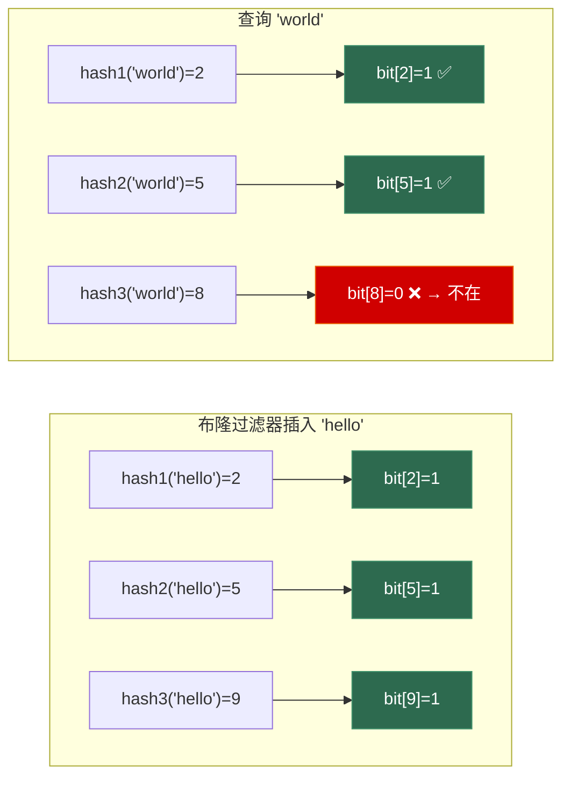

# 第八章 位运算与状态压缩

> **一句话理解**：位运算把 32/64 个布尔状态压缩进一个 int——空间省 32x，时间快一个数量级（一次 `&` 操作同时处理 32 个状态）。在游戏开发中，这是从 Layer Mask 到技能冷却的通用语言。

> 📋 前置知识：Ch4.2（状态压缩 DP 初步）、数据结构 Ch1（数组）

---

## 8.1 概念直觉 —— 为什么要关心位运算

### 三个让你关心位运算的理由

```
1. 面试高频：LeetCode 上专门的位运算标签题约 50 道，Easy~Hard 都有
2. 游戏底层：Unity 的 Layer Mask、UE 的 Collision Channel 全都是位运算
3. 性能极致：一个 cache line 可以存 512 个布尔状态（vs vector<bool> 的 8 个）
```

### 位运算速查表

```
操作          符号    示例 (a=0b1100, b=0b1010)    技巧
─────────────────────────────────────────────────────
按位与        &       a & b  = 0b1000            取特定位 / 清零
按位或        |       a | b  = 0b1110            设置特定位
按位异或      ^       a ^ b  = 0b0110            翻转 / 找不同
按位取反      ~       ~a     = 0b...0011          (补码)
左移          <<      a << 1 = 0b11000           乘 2ⁿ
右移          >>      a >> 2 = 0b0011            除 2ⁿ
─────────────────────────────────────────────────────
消去最低位1    x & (x-1)         0b1100 → 0b1000
取最低位1     x & -x            0b1100 → 0b0100
取最低位0     ~x & (x+1)        0b0011 → 0b0100
位计数        __builtin_popcount(x)  返回 1 的个数
```

---

## 8.2 位运算基础操作与经典题

### 核心技巧：`x & (x-1)` 消去最低位的 1

```cpp
// 这是位运算中最重要的技巧，贯穿几乎所有位运算题

// 示例：x = 12 = 0b1100
// x     = 1100
// x-1   = 1011
// x&(x-1) = 1000  ← 最低位的 1 被消去了

// 应用 1：位 1 的个数 (LeetCode 191)
int hammingWeight(uint32_t n) {
    int count = 0;
    while (n) {
        n &= n - 1;   // 每次消去最低位 1
        ++count;
    }
    return count;
}

// 应用 2：判断 2 的幂 (LeetCode 231)
bool isPowerOfTwo(int n) {
    return n > 0 && (n & (n - 1)) == 0;
    // 2 的幂在二进制中只有一个 1 → 消去后为 0
}

// 应用 3：判断 4 的幂 (LeetCode 342)
bool isPowerOfFour(int n) {
    // 先确定是 2 的幂，再确定那个 1 在"偶数位"（0-indexed 从低位起）
    return n > 0 && (n & (n - 1)) == 0 && (n & 0x55555555) != 0;
    // 0x55555555 = 0101 0101 ... 0101（所有偶数位为 1）
}
```

### 核心技巧：`x & -x` 取最低位的 1

```cpp
// 补码：-x = ~x + 1
// x      = 0b1100
// ~x     = 0b...0011
// ~x+1   = 0b...0100
// x & -x = 0b0100  ← 只保留最低位的 1

// 应用：统计二进制中 1 的个数（另一种写法）
// 不如 x&(x-1) 常用，但在树状数组 (Fenwick Tree) 中是核心操作
```

### 核心技巧：异或 XOR

```cpp
// 异或的三个性质：
// 1. 自反性：a ^ a = 0
// 2. 交换律：a ^ b = b ^ a
// 3. 恒等性：a ^ 0 = a

// 只出现一次的数字 (LeetCode 136)
// 所有出现两次的数异或后互相抵消，剩下的就是出现一次的数
int singleNumber(std::vector<int>& nums) {
    int result = 0;
    for (int x : nums) result ^= x;
    return result;
}

// 只出现一次的数字 III (LeetCode 260)
// 有两个数各出现一次，其他出现两次 → 先全员异或得到 diff = a^b
// 找 diff 最低位的 1 → 按该位是否为 1 分组 → 两组各自异或
std::vector<int> singleNumberIII(std::vector<int>& nums) {
    uint32_t diff = 0;
    for (int x : nums) diff ^= x;

    // 取最低位的 1：diff 中这一位 = 1 意味着 a 和 b 在这一位不同
    uint32_t lowbit = diff & -diff;

    int a = 0, b = 0;
    for (int x : nums) {
        if (x & lowbit) a ^= x;  // 该位为 1 的组
        else            b ^= x;  // 该位为 0 的组
    }
    return {a, b};
}
```

### 颠倒二进制位 (LeetCode 190)

```cpp
uint32_t reverseBits(uint32_t n) {
    uint32_t result = 0;
    for (int i = 0; i < 32; ++i) {
        result = (result << 1) | (n & 1);  // 取 n 的最低位，接到 result 后面
        n >>= 1;
    }
    return result;
}
```

### 数字范围按位与 (LeetCode 201)

```cpp
// [m, n] 范围内所有数的按位与
// 核心：m 和 n 的"公共前缀"会保留，后面的位会变成 0
// 因为从 m 到 n 的过程中，低位一定会经过 0 和 1 的完整周期
int rangeBitwiseAnd(int m, int n) {
    int shift = 0;
    while (m < n) {       // 一直右移直到 m == n
        m >>= 1;
        n >>= 1;
        ++shift;
    }
    return m << shift;     // 公共前缀左移回去
}
```

---

## 8.3 状态压缩技巧

### 子集枚举

```cpp
// 枚举 mask 的所有子集
// 用途：状压 DP、组合枚举
int mask = 0b1101;  // {0, 2, 3}
// 枚举所有非空子集：
for (int sub = mask; sub; sub = (sub - 1) & mask) {
    // sub = 1101, 1100, 1001, 1000, 0101, 0100, 0001
    // 分别对应 {0,2,3}, {2,3}, {0,3}, {3}, {0,2}, {2}, {0}
}
```

> 💡 `(sub - 1) & mask` 是枚举子集的核心技巧——相当于"二进制减法，但只减 mask 范围内的位"。

### Gosper's Hack —— 枚举所有大小为 k 的子集

```cpp
// 枚举所有恰好包含 k 个 1 的 bitmask
// 用途：组合问题（如选 K 个技能的最优组合）
void enumerateKSubsets(int n, int k) {
    if (k == 0) {
        // 只有空集
        return;
    }

    // 初始状态：最低的 k 位为 1
    int mask = (1 << k) - 1;
    int limit = 1 << n;

    while (mask < limit) {
        // 处理 mask（当前有 k 个 1 的 bitmask）
        process(mask);

        // Gosper's Hack：下一个有 k 个 1 的数
        int c = mask & -mask;           // 最低位 1
        int r = mask + c;               // 进位
        mask = (((r ^ mask) >> 2) / c) | r;
    }
}
```

```cpp
// Gosper's Hack 的简化理解版（性能稍差但更易懂）
int nextKSubset(int mask) {
    int c = mask & -mask;
    int r = mask + c;
    return r | (((r ^ mask) >> 2) / c);
}
```

---

## 8.4 🎮 布隆过滤器

布隆过滤器用**多个哈希函数 + 一个 bit 数组**来判断"一个元素是否**可能**在集合中"。

```
特点：
  ✅ 空间效率极高（一个 bit 代表一个元素的存在性）
  ✅ 查询 O(k)，k = 哈希函数个数（常数）
  ✅ 无假阴性（说不在就肯定不在）
  ❌ 有假阳性（说在可能实际不在，但不能删除）
```



### 完整实现

```cpp
#include <vector>
#include <string>
#include <functional>

class BloomFilter {
    std::vector<bool> _bits;   // 生产环境常用 std::bitset 或 vector<uint64_t>
    int               _numHashes;

    // 双重哈希技巧：用两个基础哈希生成任意多个哈希
    // h_i(key) = hash1(key) + i * hash2(key)
    uint64_t hash1(const std::string& key) const {
        uint64_t h = 0;
        for (char c : key) h = h * 31 + c;
        return h;
    }

    uint64_t hash2(const std::string& key) const {
        uint64_t h = 5381;  // DJB2
        for (char c : key) h = ((h << 5) + h) + c;
        return h;
    }

public:
    BloomFilter(int expectedElements, double falsePositiveRate)
        : _numHashes(std::max(1, (int)(-std::log2(falsePositiveRate)))) {

        // 最优 bit 数组大小：m = -n * ln(p) / (ln 2)²
        int m = -(expectedElements * std::log(falsePositiveRate))
                / (std::log(2) * std::log(2));
        _bits.resize(m);
    }

    void insert(const std::string& key) {
        uint64_t h1 = hash1(key);
        uint64_t h2 = hash2(key);

        for (int i = 0; i < _numHashes; ++i) {
            int idx = (h1 + i * h2) % _bits.size();
            _bits[idx] = true;
        }
    }

    bool contains(const std::string& key) const {
        uint64_t h1 = hash1(key);
        uint64_t h2 = hash2(key);

        for (int i = 0; i < _numHashes; ++i) {
            int idx = (h1 + i * h2) % _bits.size();
            if (!_bits[idx]) return false;  // 有一位为 0 → 肯定不在
        }
        return true;  // 所有位都是 1 → 可能在（有假阳性可能）
    }
};
```

> 💡 **面试中的表述**：「布隆过滤器的核心参数：bit 数组大小 m、哈希函数个数 k。k = (m/n) * ln(2) 时假阳性率最低。典型的应用是"缓存穿透保护"——快速排除一定不存在的 key，避免无效的 DB 查询。在游戏中用于聊天敏感词的预筛选和资源去重。」

---

## 8.5 🎮 位运算与缓存友好性

### 位图 vs 数组遍历 —— 数量级的差异

```cpp
// 场景：32 个单位的存活状态
// 方案 A：bool 数组
bool alive[32] = {true, false, true, ...};
int countAlive_A() {
    int count = 0;
    for (int i = 0; i < 32; ++i) {
        if (alive[i]) ++count;
    }
    return count;
}
// 32 次条件判断 + 可能的分支预测失败

// 方案 B：位图
uint32_t aliveMask = 0xDEADBEEF;
int countAlive_B() {
    return __builtin_popcount(aliveMask);  // 单条 POPCNT 指令
}
// 1 条指令，无分支，无 cache miss

// 在缓存层面：
// bool alive[32]：      32 字节 → 可能跨越 2 个 cache line
// uint32_t aliveMask：  4 字节  → 1/16 个 cache line
// 扩展到 512 个单位：
// bool[512]：           512 字节 → 8 个 cache line
// uint64_t mask[8]：    64 字节  → 1 个 cache line（完美！）
```

### 位运算消除分支

```cpp
// 分支版本：min 操作
int min_branch(int a, int b) {
    return a < b ? a : b;  // 分支预测失败 ~20 cycles
}

// 无分支版本：位运算
int min_branchless(int a, int b) {
    return a ^ ((a ^ b) & -(a > b));
    // -(a > b) = a>b 时为 -1（全 1），否则为 0（全 0）
}

// 绝对值（无分支）
int abs_branchless(int x) {
    int mask = x >> 31;           // 正数为 0，负数为 -1
    return (x + mask) ^ mask;     // 负数的补码取反加 1
}
// (x ^ mask) - mask 可以达到同样效果
```

> 现代 CPU 的分支预测器已经非常好，简单 if-else 不一定比位运算慢。位运算的优势在于**SIMD 友好**和**可预测的延迟**（无分支预测失败惩罚）。

---

## 8.6 高频面试题精讲

### 题目 1：只出现一次的数字 II (LeetCode 137)

```cpp
// 每个数字出现 3 次，只有一个出现 1 次
// 思路：统计每个 bit 上 1 出现的次数，% 3 即为那个数的 bit
int singleNumberII(std::vector<int>& nums) {
    int result = 0;
    for (int bit = 0; bit < 32; ++bit) {
        int count = 0;
        for (int x : nums) {
            if (x >> bit & 1) ++count;
        }
        if (count % 3 == 1) {
            result |= (1 << bit);
        }
    }
    return result;
}

// 进阶：有限状态机解法 O(n) 一次遍历
// 核心：用两个变量 ones 和 twos 模拟 3 进制计数器
int singleNumberII_fsm(std::vector<int>& nums) {
    int ones = 0, twos = 0;
    for (int x : nums) {
        ones = (ones ^ x) & ~twos;
        twos = (twos ^ x) & ~ones;
    }
    return ones;
}
```

### 题目 2：最大单词长度乘积 (LeetCode 318)

```cpp
// 找两个没有公共字母的单词的最大长度乘积
// 位运算：用 26-bit 表示每个单词包含哪些字母
int maxProduct(std::vector<std::string>& words) {
    int n = words.size();
    std::vector<int> masks(n, 0);

    for (int i = 0; i < n; ++i) {
        for (char c : words[i]) {
            masks[i] |= (1 << (c - 'a'));
        }
    }

    int ans = 0;
    for (int i = 0; i < n; ++i) {
        for (int j = i + 1; j < n; ++j) {
            if ((masks[i] & masks[j]) == 0) {  // 无公共字母
                ans = std::max(ans,
                    (int)(words[i].size() * words[j].size()));
            }
        }
    }
    return ans;
}
```

### 题目 3：最大异或值 (LeetCode 421) —— 位运算 + Trie

```cpp
// 找两个数的最大异或值
// 策略：从高位到低位构建 Trie，对每个数在 Trie 中贪心找"相反 bit"
struct TrieNode {
    TrieNode* child[2] = {nullptr, nullptr};
};

int findMaximumXOR(std::vector<int>& nums) {
    TrieNode* root = new TrieNode();

    // 插入所有数的二进制
    for (int x : nums) {
        TrieNode* node = root;
        for (int bit = 31; bit >= 0; --bit) {
            int b = (x >> bit) & 1;
            if (!node->child[b]) node->child[b] = new TrieNode();
            node = node->child[b];
        }
    }

    // 对每个数找最大异或值
    int ans = 0;
    for (int x : nums) {
        TrieNode* node = root;
        int curXor = 0;
        for (int bit = 31; bit >= 0; --bit) {
            int b = (x >> bit) & 1;
            // 贪心：想要相反的 bit (1-b)
            if (node->child[1 - b]) {
                curXor |= (1 << bit);
                node = node->child[1 - b];
            } else {
                node = node->child[b];
            }
        }
        ans = std::max(ans, curXor);
    }
    return ans;
}
```

---

## 8.7 🎮 游戏实战

### 8.7.1 Layer Mask —— 游戏碰撞检测的核心

```cpp
// Unity/UE 中用 Layer Mask 控制哪些对象之间需要碰撞检测
// 这是游戏开发中位运算最常见的应用
enum class Layer : uint32_t {
    Default   = 1 << 0,   // 0b00000001
    Player    = 1 << 1,   // 0b00000010
    Enemy     = 1 << 2,   // 0b00000100
    Projectile = 1 << 3,  // 0b00001000
    Ground    = 1 << 4,   // 0b00010000
    UI        = 1 << 5,   // 0b00100000
};

uint32_t operator|(Layer a, Layer b) {
    return static_cast<uint32_t>(a) | static_cast<uint32_t>(b);
}

bool isInLayerMask(uint32_t mask, Layer layer) {
    return (mask & static_cast<uint32_t>(layer)) != 0;
}

// 使用示例：
void setupCollision() {
    // 玩家的子弹只和 Enemy 和 Ground 碰撞
    uint32_t projectileCollidesWith = Layer::Enemy | Layer::Ground;

    // 检测碰撞：
    uint32_t hitLayers = Layer::Player;  // 假设射中了 Player
    if (isInLayerMask(projectileCollidesWith, static_cast<Layer>(hitLayers))) {
        // ❌ 子弹不打玩家，不会进入这里
    }
}
```

### 8.7.2 角色状态机 —— 一个 int 管理所有状态

```cpp
// 用 32-bit 表示角色的所有状态
// 状态可以叠加（中毒+眩晕+无敌 同时存在）
enum class StatusEffect : uint32_t {
    None     = 0,
    Poisoned = 1 << 0,   // 中毒
    Stunned  = 1 << 1,   // 眩晕
    Invincible = 1 << 2, // 无敌
    Silenced = 1 << 3,   // 沉默
    Invisible = 1 << 4,  // 隐身
    Burning  = 1 << 5,   // 灼烧
    Frozen   = 1 << 6,   // 冰冻
    Bleeding = 1 << 7,   // 出血
    // ... 最多 32 种状态
};

class Character {
    uint32_t _status = 0;

public:
    // 添加状态
    void addStatus(StatusEffect effect) {
        _status |= static_cast<uint32_t>(effect);
    }

    // 移除状态
    void removeStatus(StatusEffect effect) {
        _status &= ~static_cast<uint32_t>(effect);
    }

    // 检查状态
    bool hasStatus(StatusEffect effect) const {
        return (_status & static_cast<uint32_t>(effect)) != 0;
    }

    // 检查是否有任何控制类状态
    bool isControlled() const {
        uint32_t ccMask = static_cast<uint32_t>(StatusEffect::Stunned)
                        | static_cast<uint32_t>(StatusEffect::Frozen);
        return (_status & ccMask) != 0;
    }

    // 清除所有 DoT 类状态
    void clearDoTs() {
        uint32_t dotMask = static_cast<uint32_t>(StatusEffect::Poisoned)
                         | static_cast<uint32_t>(StatusEffect::Burning)
                         | static_cast<uint32_t>(StatusEffect::Bleeding);
        _status &= ~dotMask;
    }
};
```

> 💡 一次 `&` 检查多个状态，一次 `|=` 叠加多个状态——比维护 32 个 `bool` 成员变量快一个数量级，且一个 `uint32_t` 只占 4 字节。

### 8.7.3 技能冷却位图

```cpp
// 用 64-bit bitmap 同时检查多个技能的冷却状态
// 每个 bit 代表一个技能的 CD 是否已好（1=可用, 0=冷却中）
class SkillCooldownManager {
    uint64_t _readyMask = ~0ULL;  // 初始全部可用
    // 每个技能的冷却剩余帧数
    std::vector<int> _cooldowns;

public:
    SkillCooldownManager(int numSkills) : _cooldowns(numSkills, 0) {}

    // 使用技能
    bool tryUseSkill(int id, int cooldownFrames) {
        uint64_t mask = 1ULL << id;
        if (!(_readyMask & mask)) return false;  // 还在冷却

        _readyMask &= ~mask;          // 标记为冷却中
        _cooldowns[id] = cooldownFrames;
        return true;
    }

    // 每帧调用：更新冷却
    void tick() {
        for (int i = 0; i < _cooldowns.size(); ++i) {
            if (_cooldowns[i] > 0) {
                if (--_cooldowns[i] == 0) {
                    _readyMask |= (1ULL << i);  // CD 好了
                }
            }
        }
    }

    // 批量查询：哪些技能可用？
    uint64_t getReadySkills() const { return _readyMask; }

    // 快速检查：是否有技能可用（代替 for 循环）
    bool hasAnyReady() const { return _readyMask != 0; }
};
```

### 8.7.4 聊天敏感词预筛选 —— 布隆过滤器

```cpp
// 场景：聊天系统中，每条消息都需要做敏感词检测
// 全量检测太慢（AC 自动机 O(n)），用布隆过滤器快速排除安全消息
class ChatFilter {
    BloomFilter _bloomFilter;
    // ... 精确匹配器（AC 自动机）

public:
    ChatFilter() : _bloomFilter(10000, 0.01) {
        // 初始化：加载所有敏感词到布隆过滤器
        for (const auto& word : loadBadWords()) {
            _bloomFilter.insert(word);
        }
    }

    bool mightContainBadWord(const std::string& message) {
        // 逐词检查（简化版）
        std::string word;
        for (size_t i = 0; i <= message.size(); ++i) {
            if (i == message.size() || message[i] == ' ') {
                if (!word.empty() && _bloomFilter.contains(word)) {
                    // 可能在敏感词中 → 走精确检测
                    return true;
                }
                word.clear();
            } else {
                word += message[i];
            }
        }
        return false;  // 布隆过滤器说不在 → 肯定安全
    }
};
```

---

## 8.8 30 秒速答

---

**Q：`x & (x-1)` 有什么作用？**

> 消去二进制最低位的 1。这是位运算中最常用的技巧——判断 2 的幂（结果为 0）、统计 1 的个数（每次消一个计数+1）。时间复杂度 O(k)，k 是 1 的个数，比逐位检查的 O(32) 更优。

**Q：异或的三个核心性质？**

> 自反性 a^a=0，恒等性 a^0=a，交换律 a^b=b^a。这使异或天然适合"找不同"类问题——所有成对元素异或后自消，剩下的就是单独元素。找两个单独出现的数时，用 diff & -diff 取差异位进行分组。

**Q：布隆过滤器的原理和优缺点？**

> 用 k 个哈希函数将元素映射到 m 位的 bit 数组中。插入时置 k 位为 1，查询时全为 1 说明"可能在"。优点：空间效率极高（1 bit/元素），O(k) 查询。缺点：有假阳性（说在可能不在）、不支持删除。适用场景：缓存穿透保护、敏感词预筛、CDN 去重。

**Q：位运算在游戏中有哪些应用？**

> 三大经典场景：Layer Mask——用位掩码控制碰撞检测的层级过滤；状态管理——一个 uint32_t 存 32 种状态，一次位运算同时操作多个状态；技能冷却——64-bit 位图一次检查所有技能的 CD 状态。相比维护 n 个 bool 变量，位运算省空间、快一个数量级、且对缓存极其友好。

**Q：位运算为什么对缓存友好？**

> 一个 cache line 64 字节 = 512 个 bit。用位图，512 个布尔状态恰好占一个 cache line；用 bool 数组，需要 512 字节（8 个 cache line）。位运算本身是无分支的（无分支预测失败惩罚），且现代 CPU 的 POPCNT、LZCNT 等指令直接操作 64-bit 寄存器。

---

## 8.9 本章习题清单

```
基础位操作：
  □ 191. 位 1 的个数 —— x&(x-1) 经典
  □ 190. 颠倒二进制位 —— 逐位处理
  □ 231. 2 的幂 —— x&(x-1) == 0

异或系列：
  □ 136. 只出现一次的数字 —— 全员异或
  □ 137. 只出现一次的数字 II —— 位统计 / FSM
  □ 260. 只出现一次的数字 III —— 低位 1 分组
  □ 268. 丢失的数字 —— 异或 或 求和

进阶：
  □ 201. 数字范围按位与 —— 公共前缀
  □ 318. 最大单词长度乘积 —— 26-bit 字母掩码
  □ 78.  子集（位运算版） —— mask 遍历

挑战：
  □ 421. 数组中两个数的最大异或值 —— Trie + 位贪心
```

---

> 📖 下一章：[第九章 字符串算法](../algorithm/09_string) —— 从 KMP 到 Rabin-Karp，从 AC 自动机到 Manacher，字符串匹配的艺术。
