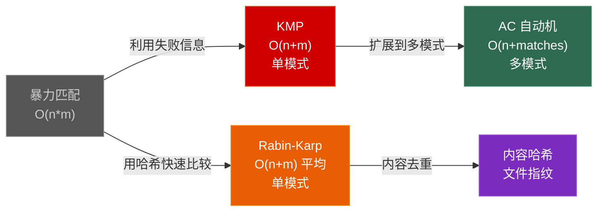
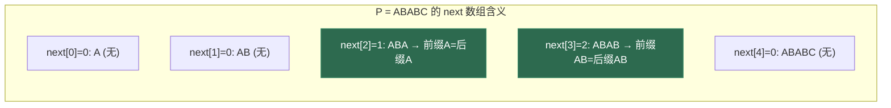
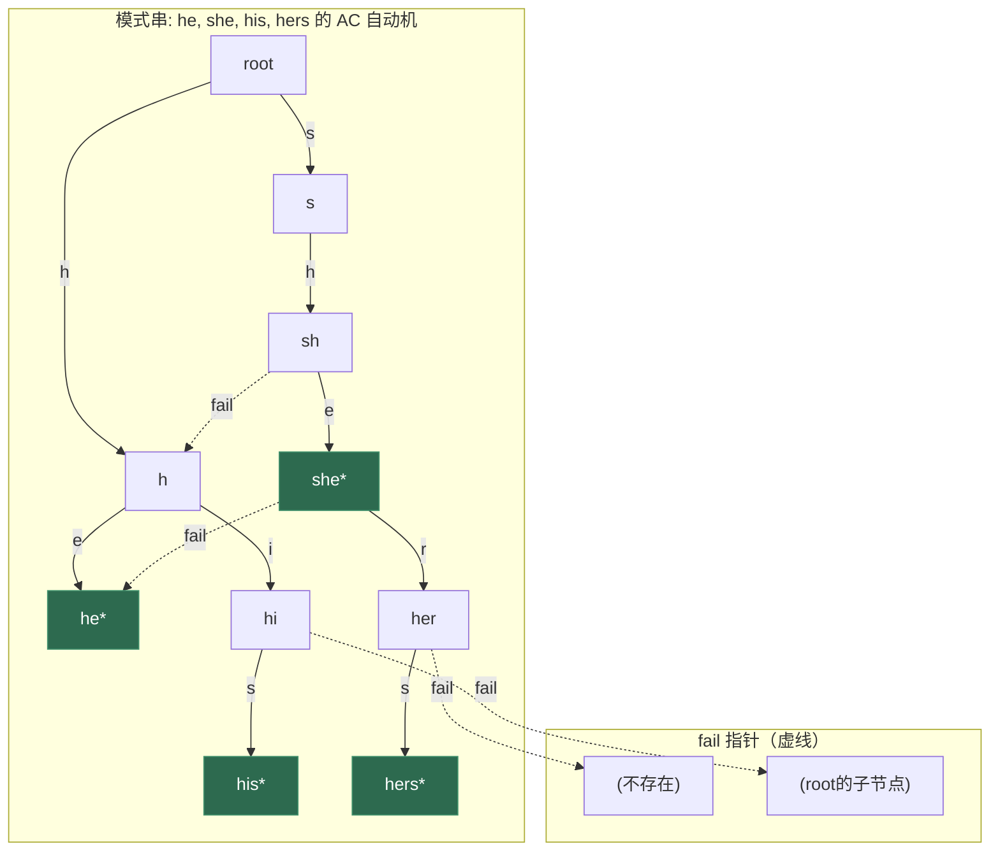

# 第九章 字符串算法：KMP、Rabin-Karp 与 AC 自动机

> **一句话理解**：字符串匹配的本质是"利用已知信息跳过不可能的匹配位置"——KMP 用前缀函数跳过，Rabin-Karp 用哈希跳过，AC 自动机把两者结合扩展到多模式。

> 📋 前置知识：数据结构 Ch8（字典树/Trie）、Ch5（哈希表）

---

## 9.1 概念直觉 —— 字符串匹配问题的演进

### 从暴力到智能 —— 一段 30 年的算法进化

```
问题：在文本串 S 中找模式串 P 的所有出现位置。

暴力匹配：O(n*m)
  每次匹配失败后，S 的指针只前进 1 步 → 大量重复比较

KMP (1977)：O(n+m)
  预处理 P 的"前缀函数" → 匹配失败时，利用已知信息跳过

Rabin-Karp (1987)：O(n+m) 平均
  用哈希快速比较 → 只有哈希相同时才逐字符验证

AC 自动机 (1975)：O(n + total_matches)
  把多个模式串建成 Trie + fail 指针 → 一次扫描匹配所有模式

Manacher (1975)：O(n)
  专门解决最长回文子串的 O(n) 算法
```



---

## 9.2 字符串基础

### 字符串哈希 —— 多项式哈希

把字符串看作一个 base 进制的数，取模后得到哈希值。支持 O(1) 求任意子串的哈希。

```cpp
// 多项式哈希：hash(s) = (s[0]*base^{n-1} + s[1]*base^{n-2} + ... + s[n-1]) % MOD
class StringHash {
    using ULL = unsigned long long;
    static const ULL BASE = 131;     // 常用基数：131, 13331
    static const ULL MOD  = 1e9 + 7; // 或直接用 ULL 自然溢出

    std::vector<ULL> _hash;   // _hash[i] = s[0..i-1] 的哈希
    std::vector<ULL> _power;  // _power[i] = BASE^i

public:
    explicit StringHash(const std::string& s) {
        int n = s.size();
        _hash.resize(n + 1);
        _power.resize(n + 1);

        _hash[0] = 0;
        _power[0] = 1;
        for (int i = 0; i < n; ++i) {
            _hash[i + 1] = (_hash[i] * BASE + s[i]) % MOD;
            _power[i + 1] = (_power[i] * BASE) % MOD;
        }
    }

    // 子串 s[l..r] 的哈希值（0-indexed，闭区间）
    ULL getHash(int l, int r) const {
        return (_hash[r + 1] - _hash[l] * _power[r - l + 1] % MOD + MOD) % MOD;
    }
};

// 使用示例：
// StringHash sh("hello");
// sh.getHash(1, 3) → "ell" 的哈希
```

> ⚠️ 单哈希有碰撞风险。生产环境用**双哈希**（两个不同的 BASE 和 MOD），或直接用 `unsigned long long` 自然溢出（碰撞概率极低，一般够用）。

### 最长公共前缀 (LeetCode 14)

```cpp
// 纵向扫描：逐个字符比较
std::string longestCommonPrefix(std::vector<std::string>& strs) {
    if (strs.empty()) return "";

    for (int i = 0; i < strs[0].size(); ++i) {
        char c = strs[0][i];
        for (int j = 1; j < strs.size(); ++j) {
            if (i == strs[j].size() || strs[j][i] != c) {
                return strs[0].substr(0, i);
            }
        }
    }
    return strs[0];
}
```

---

## 9.3 KMP 算法 —— 永不回退的匹配

### 核心思想

暴力匹配的浪费：模式串"ABCABD"匹配文本"ABCABCABD"时——

```
S: A B C A B C A B D
P: A B C A B D
         ↑ 不匹配！

暴力做法：P 右移 1 位，从 P[0] 重新比较
KMP 做法：P 右移 3 位，从 P[2] 继续比较（利用了"AB"是 P 的前缀且也是已匹配后缀的事实）
```

KMP 的核心是 **next 数组（前缀函数）**：

```
next[i] = 模式串 P[0..i] 的"最长相等前后缀"的长度
        = 匹配失败时，可以跳过多少个字符

更正式的定义：
next[i] = max{ k | k < i+1 且 P[0..k-1] == P[i-k+1..i] }
```

### next 数组的推导过程

```
以 P = "ABABC" 为例：

i=0: "A"         → 无真前缀=真后缀 → next[0] = 0
i=1: "AB"        → 前缀[A] ≠ 后缀[B] → next[1] = 0
i=2: "ABA"       → 前缀[A] = 后缀[A] → next[2] = 1
i=3: "ABAB"      → 前缀[AB] = 后缀[AB] → next[3] = 2
i=4: "ABABC"     → 无相等前后缀 → next[4] = 0

next = [0, 0, 1, 2, 0]
```



### 完整实现

```cpp
#include <vector>
#include <string>

// 构建 next 数组（也称为 pi 数组 / 前缀函数）
std::vector<int> buildNext(const std::string& pattern) {
    int m = pattern.size();
    std::vector<int> next(m, 0);

    // j = 当前已匹配的前缀长度
    for (int i = 1; i < m; ++i) {
        int j = next[i - 1];  // 上一位置的前缀函数值

        // 回退：当前字符不匹配时，沿 next 链回退
        while (j > 0 && pattern[i] != pattern[j]) {
            j = next[j - 1];
        }

        if (pattern[i] == pattern[j]) {
            ++j;
        }
        next[i] = j;
    }
    return next;
}

// KMP 字符串匹配
std::vector<int> kmpSearch(const std::string& text, const std::string& pattern) {
    int n = text.size(), m = pattern.size();
    if (m == 0) return {};

    auto next = buildNext(pattern);
    std::vector<int> matches;

    int j = 0;  // 当前已匹配的模式串长度
    for (int i = 0; i < n; ++i) {
        // 不匹配时，沿 next 数组回退（j 可能回退多次）
        while (j > 0 && text[i] != pattern[j]) {
            j = next[j - 1];
        }

        if (text[i] == pattern[j]) {
            ++j;
        }

        if (j == m) {  // 完全匹配
            matches.push_back(i - m + 1);
            j = next[j - 1];  // 继续找下一个匹配
        }
    }
    return matches;
}
```

```
KMP 匹配过程示例：S="ABCABCABD", P="ABCABD"

next=[0,0,0,1,2,0]

i=0..4: 匹配 "ABCAB" (j=5)
i=5: S[5]='C' ≠ P[5]='D' → j = next[4] = 2
     → 跳过 5-2=3 个字符，从 j=2 继续！
     → 相当于 P 右移 3 位，P 的指针在 2 ("C")

i=5: S[5]='C' = P[2]='C' → j=3
i=6: S[6]='A' = P[3]='A' → j=4
i=7: S[7]='B' = P[4]='B' → j=5
i=8: S[8]='D' = P[5]='D' → j=6==m → 匹配成功！
```

> 💡 **面试中的表述**：「KMP 的时间复杂度是 O(n+m)，因为 j 最多增加 n 次，每次回退至少减 1，总回退次数不超过总增加次数。空间 O(m)。关键在于 next 数组——它存储的是模式串每个前缀的"最长相等前后缀长度"，匹配失败时告诉我们可以跳过多少字符。」

### KMP 的手写记忆版

```cpp
// 面试最简版本：把 next 构建和匹配合并为同一个模板
// next[i] = 以 i 结尾的最长相等前后缀长度
int strStr(std::string haystack, std::string needle) {
    if (needle.empty()) return 0;
    int n = haystack.size(), m = needle.size();

    // 1. 构建 next
    std::vector<int> next(m, 0);
    for (int i = 1, j = 0; i < m; ++i) {
        while (j > 0 && needle[i] != needle[j]) j = next[j - 1];
        if (needle[i] == needle[j]) ++j;
        next[i] = j;
    }

    // 2. 匹配
    for (int i = 0, j = 0; i < n; ++i) {
        while (j > 0 && haystack[i] != needle[j]) j = next[j - 1];
        if (haystack[i] == needle[j]) ++j;
        if (j == m) return i - m + 1;
    }
    return -1;
}
```

---

## 9.4 Rabin-Karp 算法 —— 用哈希快速比较

Rabin-Karp 的核心思想：**字符串比较 O(m) → 哈希值比较 O(1)**。

```
传统：每次匹配需要 O(m) 逐字符比较
RK：  先比较 O(1) 哈希 → 只有哈希相同时才逐字符验证

滚动哈希：已知 hash(s[l..r])，O(1) 计算 hash(s[l+1..r+1])
  hash[l+1..r+1] = (hash[l..r] - s[l]*BASE^{len-1}) * BASE + s[r+1]
```

```cpp
std::vector<int> rabinKarp(const std::string& text, const std::string& pattern) {
    int n = text.size(), m = pattern.size();
    if (m == 0 || m > n) return {};

    using ULL = unsigned long long;
    const ULL BASE = 131;

    // 预处理 BASE^{m-1}
    ULL power = 1;
    for (int i = 0; i < m - 1; ++i) power *= BASE;

    // 计算模式串的哈希
    ULL patternHash = 0;
    for (char c : pattern) patternHash = patternHash * BASE + c;

    // 计算文本串第一个窗口的哈希
    ULL windowHash = 0;
    for (int i = 0; i < m; ++i) windowHash = windowHash * BASE + text[i];

    std::vector<int> matches;

    // 滑动窗口
    for (int i = 0; i <= n - m; ++i) {
        if (windowHash == patternHash) {
            // 哈希相同 → 逐字符验证（防碰撞）
            bool match = true;
            for (int j = 0; j < m; ++j) {
                if (text[i + j] != pattern[j]) {
                    match = false;
                    break;
                }
            }
            if (match) matches.push_back(i);
        }

        // 滚动哈希：移出 text[i]，移入 text[i+m]
        if (i < n - m) {
            windowHash = (windowHash - text[i] * power) * BASE + text[i + m];
        }
    }
    return matches;
}
```

> ⚠️ Rabin-Karp 的哈希碰撞在最坏情况下可能导致 O(n*m)——但实际应用中概率极低。用双哈希或自然溢出（ULL）可以进一步降低风险。

| 维度 | KMP | Rabin-Karp |
|------|-----|-----------|
| 核心思想 | 利用失败信息跳过 | 利用哈希快速比较 |
| 最坏时间 | O(n+m) 稳定 | O(n*m) 哈希碰撞 |
| 实际速度 | 快，稳定 | 常数小，通常更快 |
| 额外空间 | O(m) next 数组 | O(1) 只存哈希值 |
| 扩展性 | 扩展到 AC 自动机 | 扩展到多模式哈希 |
| 面试手写 | 常见（考思想） | 较少（太简单） |

---

## 9.5 AC 自动机 —— 多模式匹配

AC 自动机 = **Trie + KMP 的 fail 指针**。一次扫描文本，同时匹配所有模式串。

```
Trie：      共享前缀，压缩多模式串的存储
KMP：       利用 next 数组在失配时跳转
AC 自动机：  在 Trie 上为每个节点构建 fail 指针
           fail[node] = node 的"最长可匹配后缀"对应的 Trie 节点
```



> \* 标记为模式串的结束节点。fail 指针的跳转逻辑：匹配失败时，沿 fail 跳到"最长可匹配后缀"继续尝试。

### AC 自动机实现

```cpp
#include <vector>
#include <string>
#include <queue>

struct AhoCorasick {
    static constexpr int ALPHABET = 26;

    struct Node {
        int next[ALPHABET] = {};  // 子节点
        int fail = 0;              // fail 指针
        int output = 0;            // 以此节点结尾的模式串数量（或模式串ID列表）
    };

    std::vector<Node> trie;

    AhoCorasick() : trie(1) {}  // root 在索引 0

    // 插入一个模式串
    void insert(const std::string& pattern) {
        int node = 0;
        for (char c : pattern) {
            int idx = c - 'a';
            if (trie[node].next[idx] == 0) {
                trie[node].next[idx] = trie.size();
                trie.emplace_back();
            }
            node = trie[node].next[idx];
        }
        ++trie[node].output;  // 标记为模式串结尾
    }

    // 构建 fail 指针（BFS）
    void build() {
        std::queue<int> q;

        // 第一层：root 的直接子节点的 fail 指向 root
        for (int c = 0; c < ALPHABET; ++c) {
            int child = trie[0].next[c];
            if (child) {
                trie[child].fail = 0;
                q.push(child);
            }
        }

        while (!q.empty()) {
            int node = q.front(); q.pop();

            for (int c = 0; c < ALPHABET; ++c) {
                int child = trie[node].next[c];
                if (!child) continue;

                // 找 child 的 fail：
                // 沿父节点的 fail 链找第一个也有子节点 c 的节点
                int f = trie[node].fail;
                while (f != 0 && trie[f].next[c] == 0) {
                    f = trie[f].fail;
                }
                trie[child].fail = trie[f].next[c];

                // 合并 output：child 也匹配了其 fail 路径上所有的模式串
                trie[child].output += trie[trie[child].fail].output;

                q.push(child);
            }
        }
    }

    // 在文本中搜索所有模式串
    int search(const std::string& text) {
        int node = 0;
        int totalMatches = 0;

        for (char ch : text) {
            int c = ch - 'a';

            // 失配时沿 fail 链跳转
            while (node != 0 && trie[node].next[c] == 0) {
                node = trie[node].fail;
            }

            node = trie[node].next[c];
            totalMatches += trie[node].output;
        }
        return totalMatches;
    }
};
```

> 💡 **面试中的表述**：「AC 自动机 = Trie + KMP 的 fail 指针。构建 fail 用 BFS：对于每个节点，其子节点的 fail 指向"父节点的 fail 链上第一个有相同子节点的节点"。搜索时沿 fail 跳转，一次扫描即可匹配所有模式串。时间复杂度 O(n + total_matches)。」

### AC 自动机 vs 逐个 KMP

```
场景：1000 个敏感词，每条聊天消息都要检查

逐个 KMP：每条消息跑 1000 次匹配 → O(1000 * message_len)
AC 自动机：一次扫描 → O(message_len + 匹配数)
          快 1000 倍
```

---

## 9.6 Manacher 算法 —— 最长回文子串 O(n)

Manacher 的核心是**利用已知回文的对称性，避免重复计算**。

```cpp
// Manacher 算法：O(n) 找最长回文子串
// 预处理：在字符间插入 '#'，统一处理奇偶回文
// "aba"  → "#a#b#a#"
// "aa"   → "#a#a#"
std::string longestPalindromeManacher(const std::string& s) {
    if (s.empty()) return "";

    // 预处理
    std::string t = "#";
    for (char c : s) {
        t += c;
        t += '#';
    }

    int n = t.size();
    std::vector<int> p(n, 0);  // p[i] = 以 i 为中心的回文半径
    int center = 0, right = 0;  // 当前最右回文的中心和右边界
    int maxLen = 0, maxCenter = 0;

    for (int i = 0; i < n; ++i) {
        // 核心优化：利用对称性初始化 p[i]
        int mirror = 2 * center - i;
        if (i < right) {
            p[i] = std::min(right - i, p[mirror]);
        }

        // 中心扩展
        while (i - p[i] - 1 >= 0 && i + p[i] + 1 < n &&
               t[i - p[i] - 1] == t[i + p[i] + 1]) {
            ++p[i];
        }

        // 更新最右回文边界
        if (i + p[i] > right) {
            center = i;
            right = i + p[i];
        }

        if (p[i] > maxLen) {
            maxLen = p[i];
            maxCenter = i;
        }
    }

    // 从 t 中还原原始回文串
    int start = (maxCenter - maxLen) / 2;
    return s.substr(start, maxLen);
}
```

```
Manacher 的核心洞察：
当 i 在当前最右回文的覆盖范围内时（i < right），
以 i 为中心的回文和以 mirror 为中心的回文关于 center 对称。

p[mirror] 已计算好 → 直接复用（但不超过 right-i 的范围）
这避免了大量不必要的中心扩展。
```

---

## 9.7 高频面试题精讲

### 题目 1：重复的 DNA 序列 (LeetCode 187)

```cpp
// 找所有出现超过一次的 10 字符子串
// Rabin-Karp 的典型应用：滚动哈希 + 频次统计
std::vector<std::string> findRepeatedDnaSequences(std::string s) {
    if (s.size() < 10) return {};

    std::unordered_map<int, int> count;  // hash → 出现次数
    std::vector<std::string> result;

    // 用 2-bit 编码 A/C/G/T → 20 bit 就可以存一个 10-gram
    const int L = 10;
    std::unordered_map<char, int> code = {{'A', 0}, {'C', 1}, {'G', 2}, {'T', 3}};
    const int mask = (1 << (2 * L)) - 1;  // 低 20 位为 1

    int hash = 0;
    for (int i = 0; i < s.size(); ++i) {
        hash = ((hash << 2) | code[s[i]]) & mask;  // 滚动哈希
        if (i >= L - 1) {
            if (++count[hash] == 2) {
                result.push_back(s.substr(i - L + 1, L));
            }
        }
    }
    return result;
}
```

### 题目 2：最短回文串 (LeetCode 214)

```cpp
// 在字符串前面添加字符使其成为回文串，求最短
// KMP 思路：找 s 的"最长回文前缀" = s 和 reverse(s) 的最长公共前缀
std::string shortestPalindrome(std::string s) {
    if (s.empty()) return "";

    std::string rev(s.rbegin(), s.rend());
    std::string combined = s + "#" + rev;  // '#' 分隔防止越界匹配

    // 对 combined 构建 next 数组
    int m = combined.size();
    std::vector<int> next(m, 0);
    for (int i = 1; i < m; ++i) {
        int j = next[i - 1];
        while (j > 0 && combined[i] != combined[j]) {
            j = next[j - 1];
        }
        if (combined[i] == combined[j]) ++j;
        next[i] = j;
    }

    // next.back() = s 的最长回文前缀长度
    int prefixLen = next.back();
    return rev.substr(0, s.size() - prefixLen) + s;
}
```

### 题目 3：字符串相乘 (LeetCode 43)

```cpp
// 大数乘法：模拟竖式乘法
std::string multiply(std::string num1, std::string num2) {
    if (num1 == "0" || num2 == "0") return "0";

    int m = num1.size(), n = num2.size();
    std::vector<int> result(m + n, 0);

    // 从低位到高位
    for (int i = m - 1; i >= 0; --i) {
        for (int j = n - 1; j >= 0; --j) {
            int mul = (num1[i] - '0') * (num2[j] - '0');
            int sum = mul + result[i + j + 1];  // 加上之前的进位

            result[i + j + 1] = sum % 10;        // 当前位
            result[i + j]     += sum / 10;       // 进位
        }
    }

    // 转为字符串
    std::string ans;
    for (int digit : result) {
        if (!(ans.empty() && digit == 0)) {  // 跳过前导零
            ans += ('0' + digit);
        }
    }
    return ans;
}
```

---

### 面试题速查清单

| # | 题目 | LeetCode | 难度 | 核心技巧 |
|---|------|----------|------|---------|
| 1 | 实现 strStr() | 28 | Easy | KMP / 暴力均可 |
| 2 | 最长公共前缀 | 14 | Easy | 纵向扫描 |
| 3 | 重复的 DNA 序列 | 187 | Medium | 滚动哈希 + 2-bit 编码 |
| 4 | 最长回文子串 | 5 | Medium | Manacher / DP / 中心扩展 |
| 5 | 字符串相乘 | 43 | Medium | 竖式乘法 |
| 6 | 最短回文串 | 214 | Hard | KMP next 数组妙用 |
| 7 | 实现 Trie | 208 | Medium | 数据结构 Ch8 回顾 |

---

## 9.8 🎮 游戏实战

### 9.8.1 聊天敏感词过滤 —— KMP + AC 自动机

```cpp
// 单敏感词检查：KMP
bool containsBadWord_KMP(const std::string& message,
                          const std::string& badWord) {
    return !kmpSearch(message, badWord).empty();
}

// 多敏感词检查：AC 自动机（一次扫描匹配所有敏感词）
class SensitiveWordFilter {
    AhoCorasick _ac;

public:
    void loadWords(const std::vector<std::string>& badWords) {
        for (const auto& word : badWords) {
            _ac.insert(word);
        }
        _ac.build();
    }

    int countMatches(const std::string& message) {
        return _ac.search(message);
    }

    bool isClean(const std::string& message) {
        return countMatches(message) == 0;
    }
};
```

### 9.8.2 资源文件去重 —— Rabin-Karp 滚动哈希

```cpp
// 对大文件做内容去重：用滚动哈希快速计算文件指纹
// 不需要把整个文件读入内存
#include <fstream>

uint64_t fileFingerprint(const std::string& filePath, int sampleSize = 4096) {
    std::ifstream file(filePath, std::ios::binary);
    if (!file) return 0;

    const uint64_t BASE = 131;
    uint64_t hash = 0;
    char buffer[4096];

    // 读文件头部
    file.read(buffer, sampleSize);
    for (int i = 0; i < file.gcount(); ++i) {
        hash = hash * BASE + (unsigned char)buffer[i];
    }

    // 跳到文件尾部
    file.seekg(-std::min(sampleSize, (int)file.tellg()), std::ios::end);

    // 读文件尾部并混合
    file.read(buffer, sampleSize);
    for (int i = 0; i < file.gcount(); ++i) {
        hash = hash * BASE + (unsigned char)buffer[i];
    }

    // 混合文件大小
    file.seekg(0, std::ios::end);
    hash = hash * BASE + file.tellg();

    return hash;
}
```

### 9.8.3 资源路径前缀索引 —— 字符串哈希

```cpp
// 文件系统路径的前缀匹配："/assets/textures/ui/" 下所有资源
// 用前缀哈希 + Trie 实现快速查找
class ResourcePathIndex {
    struct PathNode {
        std::unordered_map<std::string, int> children;  // 目录名 → 子节点
        std::vector<int> assets;                        // 此路径下的资源 ID
    };

    std::vector<PathNode> _nodes;

public:
    ResourcePathIndex() : _nodes(1) {}

    void insert(const std::string& path, int assetId) {
        int node = 0;
        size_t start = 0;

        while (start < path.size()) {
            size_t slash = path.find('/', start);
            std::string dir = path.substr(start, slash - start);
            start = slash + 1;

            if (_nodes[node].children.count(dir) == 0) {
                _nodes[node].children[dir] = _nodes.size();
                _nodes.emplace_back();
            }
            node = _nodes[node].children[dir];
        }
        _nodes[node].assets.push_back(assetId);
    }

    // 查询某目录下的所有资源
    std::vector<int> query(const std::string& directory) {
        int node = 0;
        size_t start = 0;

        while (start < directory.size()) {
            size_t slash = directory.find('/', start);
            std::string dir = directory.substr(start, slash - start);
            start = slash + 1;

            if (_nodes[node].children.count(dir) == 0) {
                return {};  // 路径不存在
            }
            node = _nodes[node].children[dir];
        }
        return _nodes[node].assets;
    }
};
```

### 9.8.4 回文检测 —— Manacher 在聊天中的应用

```cpp
// 检测玩家是否用回文模式刷屏
// 如 "abccbaabccbaabccba" → 重复的回文结构
struct PalindromeInfo {
    int center;
    int radius;
    std::string palindrome;
};

PalindromeInfo longestPalindrome(const std::string& text) {
    // 使用 Manacher 算法（见 9.6 节）
    // 返回最长回文及其位置
    // 如果回文长度 > 阈值，标记为潜在刷屏
    auto result = longestPalindromeManacher(text);
    return {0, 0, result};
}
```

---

## 9.9 30 秒速答

---

**Q：KMP 算法的核心思想？**

> KMP 利用"已匹配部分的相等前后缀"来避免文本指针回退。next[i] 存储模式串前缀 P[0..i] 的最长相等前后缀长度。匹配失败时，文本指针不动，模式串指针跳到 next[j-1]，相当于右移了 j - next[j-1] 位。构建 next 是 O(m)，匹配是 O(n)，总体 O(n+m)。

**Q：Rabin-Karp 的滚动哈希如何实现？**

> 维护一个长度为 m 的窗口哈希。窗口右移时：`newHash = (oldHash - s[left]*BASE^{m-1}) * BASE + s[right]`。用自然溢出（unsigned long long）或双哈希避免碰撞。哈希相同后才逐字符验证。

**Q：AC 自动机和 KMP 的关系？**

> AC 自动机 = Trie + KMP fail 指针。KMP 的 next 数组在一条链上跳转，AC 自动机把 fail 指针扩展到 Trie 上——每个节点的 fail 指向"最长的可匹配后缀"对应的节点。构建 fail 用 BFS，搜索时沿 fail 跳转，一次扫描同时匹配所有模式串。

**Q：Manacher 为什么是 O(n)？**

> 利用回文的对称性：当 i 在当前最右回文范围内时，p[i] 可以直接复用对称位置 mirror 的 p[mirror] 值（不超过 right-i 的范围）。每个位置的中心扩展都是"从复用值开始"，总体扩展次数受限于 right 的增长——right 最多从 0 增长到 n，所以总扩展次数是 O(n)。

**Q：KMP 和 Rabin-Karp 各适合什么场景？**

> KMP 保证 O(n+m) 最坏情况，不依赖哈希，适合模式串较短、对最坏情况有要求的场景。Rabin-Karp 实现更简单，常数更小，平均更快，且能自然扩展到 2D 模式匹配和文件指纹。面试中 KMP 更常考（考思想），工程中两者都可以用 `std::search` 替代。

---

## 9.10 本章习题清单

```
字符串基础：
  □ 28.  实现 strStr() —— 手写 KMP
  □ 14.  最长公共前缀 —— 纵向扫描

KMP：
  □ 459. 重复的子字符串 —— KMP next 数组妙用
  □ 214. 最短回文串 —— KMP + 反转

Rabin-Karp / 哈希：
  □ 187. 重复的 DNA 序列 —— 滚动哈希
  □ 1044. 最长重复子串 —— 二分 + 哈希

回文：
  □ 5.   最长回文子串 —— Manacher / DP / 中心扩展
  □ 647. 回文子串 —— Manacher / 中心扩展

大数：
  □ 43.  字符串相乘 —— 竖式乘法
  □ 415. 字符串相加 —— 大数加法

回顾 Trie：
  □ 208. 实现 Trie —— 数据结构 Ch8 回顾
```

---

> 📖 全系列终。回顾九章：[第一章 排序](../algorithm/01_sorting) → [第二章 二分](../algorithm/02_binary_search) → [第三章 DP基础](../algorithm/03_dp_basic) → [第四章 DP进阶](../algorithm/04_dp_advanced) → [第五章 贪心](../algorithm/05_greedy) → [第六章 回溯与A*](../algorithm/06_backtracking) → [第七章 数学](../algorithm/07_math) → [第八章 位运算](../algorithm/08_bitwise) → 第九章 字符串。
>
> 总计约 **110 道面试题**，覆盖排序、二分、DP、贪心、回溯、搜索、数学、位运算、字符串九大领域。配合 [数据结构系列](../data_structure/index) 食用效果最佳。
