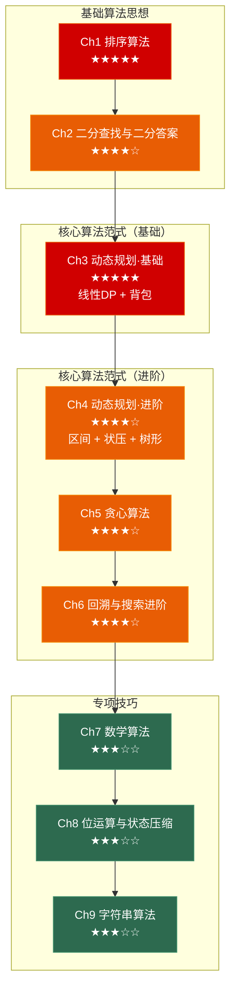

# 算法面试突击：从排序到动态规划

> 面向**游戏客户端开发岗**的算法笔记系列。与数据结构系列互补——数据结构讲"容器"，算法讲"思路"。每章覆盖：原理图解 → 算法实现 → 高频面试题 → 🎮 游戏实战 → 30 秒速答。

---

## 系列全景



---

## 章节导航

### 📗 基础算法思想 (Ch 1–2)

---

#### [第一章 排序算法全家桶](./01_sorting)

> 从 O(n²) 到 O(n log n) 再到 O(n)，手写快排/归并/堆排，稳定性分析与面试选型，缓存友好性深度剖析。

**核心内容**：
- O(n²) 排序（冒泡/插入/选择）及各自的存在价值
- 快速排序（Lomuto/Hoare 分区、三数取中、三路快排）
- 归并排序（链表排序的最佳选择）
- 堆排序（建堆 O(n) 证明）
- 非比较排序（计数/基数/桶）
- **缓存友好性专题**：快排 vs 堆排的缓存行为对比、Timsort 简介
- **面试技巧**：Quick Select、荷兰国旗问题、链表归并
- 🎮 渲染排序、排行榜 Top-K、好友列表多级排序

---

#### [第二章 二分查找与二分答案](./02_binary_search) 🔜

> 数据结构 Ch1 讲了"在有序数组里找一个数"，本章讲的是"猜一个答案，验证它是否可行"——两种完全不同的思维方式。

**核心内容**：
- 二分查找统一模板（`lower_bound` / `upper_bound`）
- 旋转数组二分
- **二分答案**：可行性判定函数设计、"最大化最小值" vs "最小化最大值"
- 二分 + 其他数据结构的组合
- 🎮 游戏难度动态调整、LOD 距离阈值

---

### 📘 核心算法范式·基础 (Ch 3)

---

#### [第三章 动态规划（基础）—— 线性DP + 背包问题](./03_dp_basic) 🔜

> 算法面试的王者。线性 DP 和背包问题是 DP 的两大基石，本章给出通用状态定义模板和转移方程套路。

**核心内容**：
- DP 核心思想：最优子结构、无后效性
- 线性 DP（LIS、LCS、编辑距离）
- 0-1 背包 + 完全背包 + 变体
- **DP 与缓存友好性**：行优先 vs 列优先遍历
- 🎮 装备选择、天赋点数分配、消耗品使用策略

---

### 📙 核心算法范式·进阶 (Ch 4–6)

---

#### [第四章 动态规划（进阶）—— 区间DP + 状压DP + 树形DP](./04_dp_advanced) 🔜

> 进阶 DP 类型覆盖区间、状态压缩、树形三大类——面试中区分"会 DP"和"精通 DP"的分水岭。

**核心内容**：
- 区间 DP（戳气球、石子游戏）
- 状态压缩 DP（TSP、子集划分）
- 树形 DP（二叉树路径、打家劫舍 III）
- DP 优化技巧（滚动数组、单调队列优化）
- 🎮 合成最优策略、技能树解锁规划

---

#### [第五章 贪心算法](./05_greedy) 🔜

> 贪心是 DP 的"反面"——不需要全局最优，每一步选当前最好即可。面试中贪心题的关键是证明为什么贪心正确。

**核心内容**：
- 贪心 vs DP 的抉择判断
- 区间调度、分配问题、跳跃游戏
- 霍夫曼编码
- 贪心正确性证明（交换论证、归纳法、反证法）
- 🎮 技能 CD 管理、AI 寻路 JPS、资源采集路径

---

#### [第六章 回溯与搜索进阶](./06_backtracking) 🔜

> 回溯是"万能暴力法"。当 DP 和贪心都不适用时，回溯 + 剪枝是最后的武器。

**核心内容**：
- 回溯算法框架（排列/组合/子集）
- 棋盘问题（N 皇后、解数独）
- 剪枝策略专题（可行性、最优性、对称性、记忆化）
- **BFS → Dijkstra → A\* 完整演化**
- 🎮 Alpha-Beta 剪枝、战棋移动范围、A\* 寻路

---

### 📕 专项技巧 (Ch 7–9)

---

#### [第七章 数学算法](./07_math) 🔜

> 快速幂、最大公约数、质数筛是面试基础题；组合数学和随机算法在复杂题目中出现。

**核心内容**：
- 快速幂与矩阵快速幂
- GCD、扩展欧几里得、模逆元
- 质数筛（埃筛 + 欧拉筛）
- 组合数学基础（杨辉三角、卡特兰数）
- 概率与随机算法（洗牌、蓄水池抽样）
- 🎮 伤害衰减公式、宽高比计算、卡牌洗牌

---

#### [第八章 位运算与状态压缩](./08_bitwise) 🔜

> 位运算是 C++ 的底层优势，在游戏开发中无处不在（Layer Mask、碰撞检测、状态标记）。

**核心内容**：
- 位运算基础操作与经典题
- 状态压缩应用（Gosper's Hack）
- **布隆过滤器**
- **位运算与缓存友好性**：位图 vs 数组遍历
- 🎮 Layer Mask、角色状态机、技能冷却位图

---

#### [第九章 字符串算法](./09_string) 🔜

> KMP 是面试中的经典手写题，Rabin-Karp 的滚动哈希思想在内容去重中广泛应用。

**核心内容**：
- 字符串哈希（多项式哈希、前缀哈希）
- KMP 算法（next 数组推导）
- Rabin-Karp 算法（滚动哈希）
- AC 自动机简介（Trie + KMP）
- 🎮 聊天敏感词过滤、资源文件去重

---

## 系列特色

| 特色 | 说明 |
|------|------|
| **C++17 实现** | 所有代码均使用 C++17 风格，工业级可运行 |
| **110+ 面试题** | 覆盖 LeetCode Hot 100 + 剑指 Offer 中的算法题目 |
| **Mermaid 图解** | 每种算法都有执行过程、决策树、内存布局的可视化图示 |
| **🎮 游戏实战** | 每章都有游戏客户端/引擎的真实应用场景与代码 |
| **缓存友好性** | 跨章节主线——从缓存视角理解算法的实际性能差异 |
| **30 秒速答** | 每章末尾都有面试口述模板 |

---

## 与数据结构系列的互补关系

| 数据结构系列 | 算法系列 |
|-------------|---------|
| Ch1 数组 → 双指针、滑动窗口、前缀和 | Ch2 二分答案、Ch3 线性 DP |
| Ch3 栈 → 单调栈、递归调用栈 | Ch6 回溯（递归栈的泛化） |
| Ch4 队列 → BFS 层序遍历 | Ch6 BFS → Dijkstra → A\* 演化 |
| Ch5 哈希表 → 两数之和、去重 | Ch9 Rabin-Karp（滚动哈希） |
| Ch6 树 → 遍历框架、BST 操作 | Ch4 树形 DP、Ch6 A\* 寻路 |
| Ch7 图 → BFS/DFS/Dijkstra/A\* | Ch5 贪心、Ch6 剪枝 |
| Ch8 字典树 → Trie 实现 | Ch9 KMP/AC 自动机 |
| Ch9 并查集 → 连通性 | Ch4 状压 DP 类型识别 |

> 数据结构系列给了你**工具**，算法系列教你**怎么用这些工具解决问题**。

---

## 推荐阅读路线

### 🚀 面试急救（5 天）

```
Day 1: Ch1 排序（快排/归并/堆排）→ Ch2 二分答案（核心题）
Day 2: Ch3 DP 基础（线性DP + 0-1背包）
Day 3: Ch3 DP 基础（完全背包）→ Ch5 贪心（区间调度 + 跳跃游戏）
Day 4: Ch6 回溯（排列/组合/子集 + 剪枝）
Day 5: Ch7 数学（快速幂 + GCD）→ Ch8 位运算（基础操作 + 经典题）
```

### 📚 系统掌握（4 周）

```
Week 1: Ch1 排序 → Ch2 二分 → Ch3 DP 基础（线性 + 0-1 背包）
Week 2: Ch3 DP 基础（完全背包 + 变体）→ Ch4 DP 进阶（区间 + 状压）
Week 3: Ch4 DP 进阶（树形 + 优化）→ Ch5 贪心 → Ch6 回溯
Week 4: Ch7 数学 → Ch8 位运算 → Ch9 字符串
```

### 🎮 游戏开发重点

1. **Ch1 排序 + 缓存** — 渲染排序的性能本质
2. **Ch3 背包 DP** — 装备选择、资源分配
3. **Ch6 BFS→Dijkstra→A\*** — 寻路系统（游戏开发面试必问）
4. **Ch8 位运算** — Layer Mask、状态标记
5. **Ch9 字符串** — 敏感词过滤、内容哈希

---

## 面试题统计

| 章节 | 题目数 | Easy | Medium | Hard |
|------|--------|------|--------|------|
| Ch1 排序 | ~15 | 2 | 10 | 3 |
| Ch2 二分 | ~12 | 0 | 10 | 2 |
| Ch3 DP 基础（线性+背包） | ~18 | 3 | 11 | 4 |
| Ch4 DP 进阶（区间+状压+树形） | ~12 | 0 | 3 | 9 |
| Ch5 贪心 | ~12 | 0 | 10 | 2 |
| Ch6 回溯与搜索 | ~15 | 0 | 8 | 7 |
| Ch7 数学 | ~10 | 2 | 6 | 2 |
| Ch8 位运算 | ~8 | 3 | 4 | 1 |
| Ch9 字符串 | ~8 | 2 | 5 | 1 |
| **总计** | **~110** | **12** | **67** | **31** |

> 💡 如果时间有限，优先刷**排序（Quick Select + 荷兰国旗）→ 二分答案 → 背包 DP → 区间贪心 → 排列组合回溯**——这五个专题覆盖了 50% 以上的算法面试题。

---

> 📖 本系列全部文章均采用 CC BY-NC-SA 4.0 协议发布。
