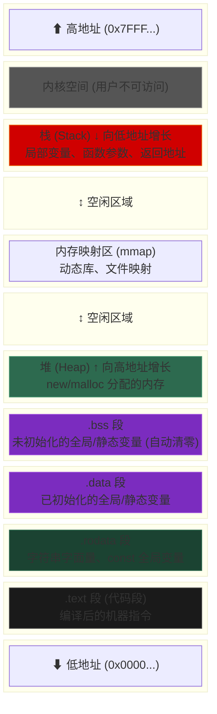
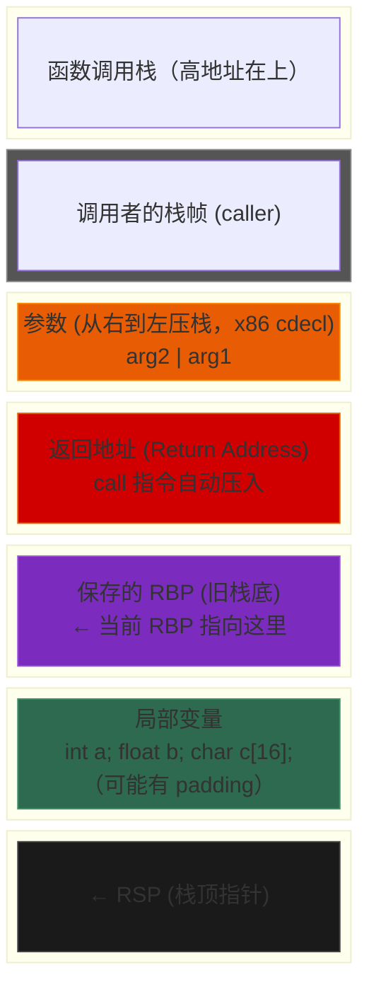
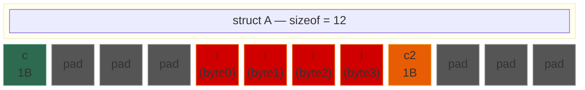
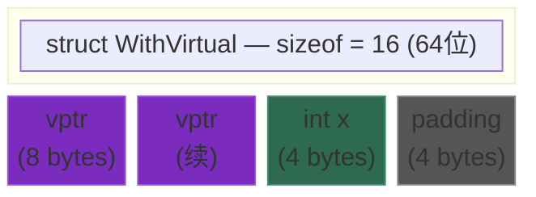
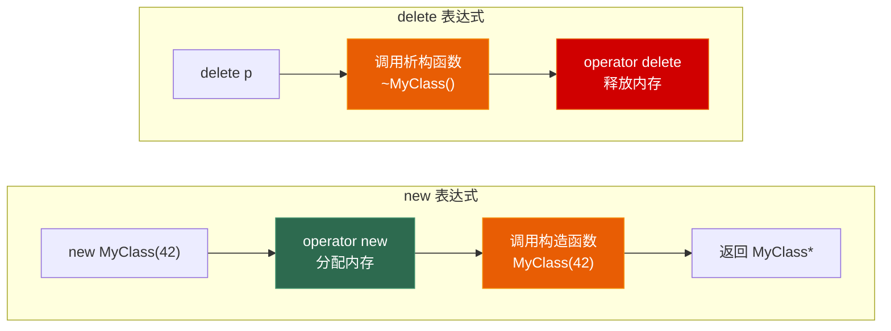
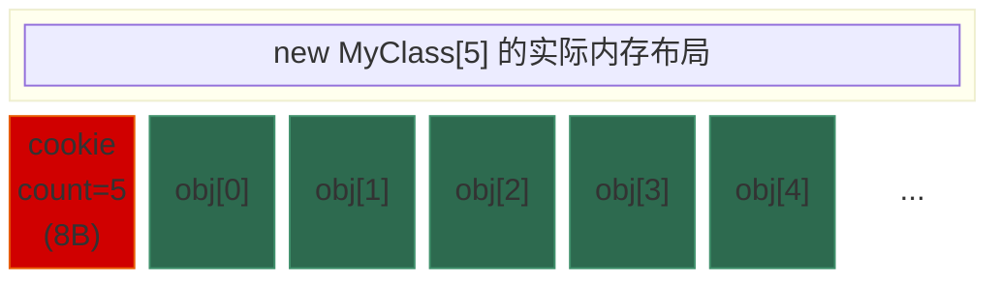
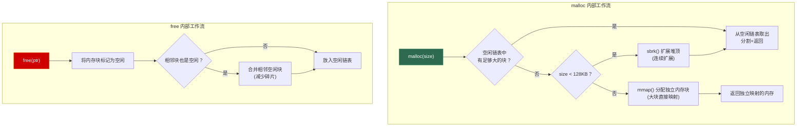

# 第一章 内存模型与对象布局

> **一句话理解**：C++ 给了你直接操作内存的权力——这是它最强大也最危险的特性。理解内存模型，就是理解 C++ 的灵魂。

---

## 1.1 概念直觉 —— What & Why

### 为什么要理解内存模型？

Java、C#、Python 这些语言有垃圾回收（GC），程序员不需要操心内存的生死。但 C++ 不一样：

- **你分配的每一字节，都需要你来释放**
- **你声明的每一个变量，都有确切的地址和大小**
- **你的对象在内存中的排列方式，直接影响程序性能**

面试中考内存模型的频率极高，因为它能区分"会写代码"和"理解代码在机器上怎么跑"的候选人。

### 一个变量到底存在哪？

```cpp
int global_var = 42;                    // 数据段 (.data)
static int static_var = 0;             // 数据段 (.data / .bss)
const char* str = "hello";             // "hello" 在只读段 (.rodata)，str 指针在栈上

void foo() {
    int local_var = 10;                // 栈
    static int static_local = 0;       // 数据段（虽然在函数内声明）
    int* heap_var = new int(20);       // 指针在栈上，指向的 int 在堆上
    delete heap_var;
}
```

> 💡 **面试中的表述**：「C++ 的变量存储位置不是由作用域决定的，而是由**声明方式**决定的：局部变量在栈上，`new` 出来的在堆上，全局/静态变量在数据段，字符串字面量在只读段。」

---

## 1.2 原理图解

### 进程虚拟地址空间

当一个 C++ 程序运行时，操作系统为它分配一个**虚拟地址空间**。以 64 位 Linux 为例：



### 栈 vs 堆 —— 一图对比

| 维度 | 栈 (Stack) | 堆 (Heap) |
|------|-----------|-----------|
| **分配方式** | 编译器自动管理（移动栈指针） | 手动 `new`/`malloc`（需手动释放） |
| **分配速度** | **极快**（一条 `sub rsp, N` 指令） | 较慢（需搜索空闲块、可能系统调用） |
| **释放** | 函数返回自动释放 | 手动 `delete`/`free`（否则泄漏） |
| **大小** | 有限（Linux 默认 ~8MB） | 几乎无限（受物理内存+虚拟内存限制） |
| **增长方向** | 高地址 → 低地址 ↓ | 低地址 → 高地址 ↑ |
| **碎片** | 无碎片（LIFO 连续分配） | 有碎片（分配释放顺序不确定） |
| **生命周期** | 与作用域绑定 | 与 `new`/`delete` 绑定 |
| **存什么** | 局部变量、函数参数、返回地址 | 动态分配的对象、大数组 |
| **缓存友好** | ✅ 极好（栈顶常驻 L1 缓存） | ❌ 对象散落各处 |

### 栈帧结构

每次函数调用都会在栈上创建一个**栈帧 (Stack Frame)**：



```
函数调用流程（简化版）：
1. 调用者把参数压栈（或放寄存器，64 位系统优先用寄存器）
2. call 指令：压入返回地址，跳转到目标函数
3. 被调函数：push rbp; mov rbp, rsp（保存旧栈底，建立新栈帧）
4. sub rsp, N（为局部变量分配空间）
5. ... 函数执行 ...
6. mov rsp, rbp; pop rbp（销毁栈帧）
7. ret（弹出返回地址，跳回调用者）
```

> 💡 **面试中的表述**：「栈帧的创建和销毁非常快——只需要移动栈指针。这就是为什么局部变量的分配比 `new` 快几个数量级。」

---

## 1.3 底层机制剖析

### 1.3.1 对象内存布局与字节对齐

#### 为什么需要字节对齐？

CPU 访问内存不是一次读一个字节，而是按**字长**（32 位 = 4 字节，64 位 = 8 字节）读取。如果一个 `int`（4 字节）跨越了两个字的边界，CPU 需要**两次读取 + 拼接**，严重影响性能。某些架构（如 ARM）甚至会直接崩溃（Bus Error）。

```
地址:    0    1    2    3    4    5    6    7
         ┌────┬────┬────┬────┬────┬────┬────┬────┐
对齐:    │    int (4B)       │    int (4B)       │  ✅ 一次读取
         └────┴────┴────┴────┴────┴────┴────┴────┘

         ┌────┬────┬────┬────┬────┬────┬────┬────┐
不对齐:  │ ?? │    int (4B)       │ ?? │ ?? │ ?? │  ❌ 跨边界，两次读取
         └────┴────┴────┴────┴────┴────┴────┴────┘
```

#### 对齐规则

C++ 的对齐规则可以总结为两条：

1. **成员对齐**：每个成员的起始地址必须是其类型大小的整数倍
   - `char`（1B）→ 任意地址
   - `short`（2B）→ 偶数地址
   - `int`/`float`（4B）→ 4 的倍数地址
   - `double`/`long long`/指针（8B）→ 8 的倍数地址

2. **结构体尾部填充**：结构体的总大小必须是其**最大成员对齐值**的整数倍

#### sizeof 经典题目

```cpp
// === 题目 1：基础 padding ===
struct A {
    char  c;    // offset 0, size 1
                // padding 3 bytes (下一个 int 要求 4 对齐)
    int   i;    // offset 4, size 4
    char  c2;   // offset 8, size 1
                // padding 3 bytes (总大小要求 4 的倍数)
};
// sizeof(A) = 12 ✅

// === 题目 2：调换顺序后更紧凑 ===
struct B {
    int   i;    // offset 0, size 4
    char  c;    // offset 4, size 1
    char  c2;   // offset 5, size 1
                // padding 2 bytes
};
// sizeof(B) = 8 ✅ (比 A 省了 4 字节！)

// === 题目 3：含 double ===
struct C {
    char   c;   // offset 0, size 1
                // padding 7 bytes (double 要求 8 对齐)
    double d;   // offset 8, size 8
    int    i;   // offset 16, size 4
                // padding 4 bytes (总大小要求 8 的倍数)
};
// sizeof(C) = 24 ✅

// === 题目 4：优化布局 ===
struct D {
    double d;   // offset 0, size 8
    int    i;   // offset 8, size 4
    char   c;   // offset 12, size 1
                // padding 3 bytes
};
// sizeof(D) = 16 ✅ (比 C 省了 8 字节！)
```

Mermaid 图解 **struct A** 的内存布局：



> 灰色为 padding 字节。可以看到，**成员声明顺序直接影响结构体大小**。

#### 更多 sizeof 陷阱

```cpp
// === 题目 5：空类 ===
struct Empty {};
// sizeof(Empty) = 1 ✅
// 为什么不是 0？因为 C++ 要求每个对象都有唯一地址。
// 如果 sizeof = 0，数组 Empty arr[10] 中所有元素地址相同，违反标准。

// === 题目 6：空基类优化 (EBO) ===
struct Base {};
struct Derived : Base {
    int x;
};
// sizeof(Derived) = 4 ✅ (不是 1+4=5！)
// 空基类优化：如果基类为空，编译器不为它分配空间。

// === 题目 7：含虚函数 ===
struct WithVirtual {
    virtual void foo() {}
    int x;
};
// sizeof(WithVirtual) = 16 (64位系统) ✅
// 布局: vptr (8B) + int x (4B) + padding (4B) = 16
// vptr 是编译器隐式插入的，指向虚函数表

// === 题目 8：单继承 ===
struct Base2 {
    virtual void foo() {}
    int a;
};
struct Derived2 : Base2 {
    int b;
};
// sizeof(Base2) = 16     (vptr 8 + int 4 + pad 4)
// sizeof(Derived2) = 16  (vptr 8 + int a 4 + int b 4) ← 没有额外 vptr！
// 单继承时，派生类复用基类的 vptr

// === 题目 9：多继承 ===
struct Base3 {
    virtual void bar() {}
    int c;
};
struct Multi : Base2, Base3 {
    int d;
};
// sizeof(Multi) = 32 (64位)
// 布局: Base2 子对象 (vptr1 8 + int a 4 + pad 4) = 16
//      + Base3 子对象 (vptr2 8 + int c 4) = 12
//      + int d 4 = 4
//      = 32
// 多继承时，每个有虚函数的基类都有一个 vptr！
```

Mermaid 图解 **WithVirtual** 的对象布局（题目 7）：



```
vptr 指向该类的虚函数表（vtable）：
┌──────────────────────┐
│ WithVirtual::vtable   │
│ [0] → &foo()         │  ← virtual void foo()
└──────────────────────┘

Derived2 的 vtable 会替换 [0] 的指针：
┌──────────────────────┐
│ Derived2::vtable      │
│ [0] → &Derived2::foo()│  ← override
└──────────────────────┘
```

> 💡 vptr 的详细原理将在 [第三章 OOP 与多态](../03_oop_and_polymorphism) 中深入剖析。

#### 手动控制对齐

```cpp
// alignof：查询类型的对齐要求
alignof(char)   == 1
alignof(int)    == 4
alignof(double) == 8

// alignas：指定对齐（只能增大，不能减小）
struct alignas(16) SIMDFriendly {
    float x, y, z, w;  // 16 字节，对齐到 16 字节边界
};
// sizeof(SIMDFriendly) = 16, alignof(SIMDFriendly) = 16
// 用于 SIMD 指令（SSE/AVX 要求 16/32 字节对齐）

// #pragma pack：强制减小对齐（通常用于网络协议、文件格式）
#pragma pack(push, 1)  // 设置对齐为 1（无 padding）
struct NetworkPacket {
    uint8_t  type;     // 1B
    uint32_t length;   // 4B
    uint16_t checksum; // 2B
};
#pragma pack(pop)
// sizeof(NetworkPacket) = 7 ✅ (无 padding)
// ⚠️ 代价：访问未对齐的 uint32_t 可能更慢（或在某些架构崩溃）
```

> 💡 **面试中的表述**：「结构体的 sizeof 取决于成员的声明顺序、各自的对齐要求、以及尾部填充。一般按成员大小从大到小排列可以最小化 padding。面试中遇到 sizeof 题，画出内存布局图就不会算错。」

---

### 1.3.2 new / delete 的完整流程

#### new 表达式做了什么？

一个简单的 `auto p = new MyClass(42);` 背后发生了两件事：

```cpp
// new MyClass(42) 等价于：
void* raw = operator new(sizeof(MyClass));  // 1. 分配内存（底层调用 malloc）
MyClass* p = static_cast<MyClass*>(raw);
new (p) MyClass(42);                        // 2. 在分配的内存上调用构造函数（placement new）
```

同理，`delete p;` 等价于：

```cpp
p->~MyClass();                              // 1. 调用析构函数
operator delete(p);                         // 2. 释放内存（底层调用 free）
```



#### new[] / delete[] 与数组 cookie

```cpp
MyClass* arr = new MyClass[5];
// 编译器实际分配的内存：
// [count(8B)][obj0][obj1][obj2][obj3][obj4]
//  ↑ 数组 cookie：记录元素个数
//       ↑ 返回给用户的指针指向这里

delete[] arr;
// delete[] 需要知道有多少个元素要析构
// 它从 arr 指针前面 8 字节读取 count = 5
// 然后依次调用 arr[4].~MyClass(), arr[3].~MyClass(), ..., arr[0].~MyClass()
// 最后释放整块内存（从 cookie 开始）
```



```
内存地址:  [cookie 起始]  [arr 指针指向这里]  →  →  →  →
           ← operator new 分配的起始地址
                          ← 返回给用户的地址

delete[] arr 时：
1. 从 arr - 8 读取 count = 5
2. 逆序析构：arr[4].~T(), arr[3].~T(), ..., arr[0].~T()
3. 释放整块内存（从 cookie 开始）
```

> ⚠️ **经典 bug**：`new[]` 必须配 `delete[]`，`new` 必须配 `delete`。混用是**未定义行为**！
> 用 `delete` 释放 `new[]` 的内存时，编译器不知道有 cookie，从错误的地址开始释放 → 堆损坏。

```cpp
int* arr = new int[100];
delete arr;     // ❌ 未定义行为！应该用 delete[]
delete[] arr;   // ✅ 正确

MyClass* p = new MyClass();
delete[] p;     // ❌ 未定义行为！应该用 delete
delete p;       // ✅ 正确
```

#### operator new 的重载

`operator new` 是一个普通的可重载函数（和 `operator+` 一样）。你可以**全局重载**或**为特定类重载**：

```cpp
// 全局重载（影响所有 new）
void* operator new(std::size_t size) {
    std::cout << "Allocating " << size << " bytes\n";
    void* p = std::malloc(size);
    if (!p) throw std::bad_alloc();
    return p;
}

void operator delete(void* p) noexcept {
    std::cout << "Freeing memory\n";
    std::free(p);
}

// 类级别重载（只影响该类的 new）
class GameObject {
public:
    static void* operator new(std::size_t size) {
        // 可以从自定义内存池分配
        return MemoryPool::Allocate(size);
    }

    static void operator delete(void* p) noexcept {
        MemoryPool::Deallocate(p);
    }
};
```

#### new 失败时的行为

```cpp
// 默认行为：抛出 std::bad_alloc
try {
    int* p = new int[1000000000000LL];  // 可能失败
} catch (const std::bad_alloc& e) {
    std::cerr << "Allocation failed: " << e.what() << "\n";
}

// nothrow 版本：失败返回 nullptr
int* p = new (std::nothrow) int[1000000000000LL];
if (!p) {
    // 分配失败
}

// set_new_handler：设置分配失败时的回调
void my_handler() {
    std::cerr << "Memory exhausted! Trying to free cache...\n";
    // 尝试释放一些缓存
    // 如果无法释放更多内存，必须 throw 或 abort
    throw std::bad_alloc();
}
std::set_new_handler(my_handler);
```

---

### 1.3.3 Placement New —— 在已有内存上构造对象

Placement new 是 `new` 的一种特殊形式：不分配内存，只在**指定地址**上调用构造函数。

```cpp
#include <new>      // placement new 的头文件
#include <cstdlib>

// 基本用法
char buffer[sizeof(MyClass)];                   // 手动准备一块内存
MyClass* p = new (buffer) MyClass(42);          // 在 buffer 上构造对象

// 使用完毕后，不能用 delete！（因为不是 new 分配的内存）
p->~MyClass();                                  // 必须手动调用析构函数
// buffer 的内存由栈自动管理，不需要 free

// 对齐版本（C++17）
alignas(MyClass) char aligned_buf[sizeof(MyClass)];
auto* p2 = new (aligned_buf) MyClass();
```

**Placement new 的核心价值**：把"分配内存"和"构造对象"这两个本来耦合的操作**解耦**了。

这正是：
- `std::vector::emplace_back` 的底层原理
- 内存池(Pool Allocator) 的核心机制
- `std::optional` 的实现基础

```cpp
// emplace_back 的简化原理：
template <typename T>
class SimpleVector {
    T* _data;
    size_t _size, _capacity;

public:
    template <typename... Args>
    void emplace_back(Args&&... args) {
        if (_size == _capacity) grow();

        // 不是 _data[_size] = T(args...)（会多一次拷贝/移动）
        // 而是直接在目标位置原地构造：
        new (_data + _size) T(std::forward<Args>(args)...);
        ++_size;
    }

    void pop_back() {
        --_size;
        (_data + _size)->~T();  // 手动调用析构（不释放内存）
    }
};
```

---

### 1.3.4 堆内存分配器初探

#### malloc 的简化原理

`malloc` 不是一个简单的函数——它是一个复杂的**内存管理器**，负责在用户态维护一个堆。



#### 内存碎片

- **外部碎片 (External Fragmentation)**：空闲内存总量够，但分散在各处，无法满足大块分配
- **内部碎片 (Internal Fragmentation)**：分配的块比请求的大（因为对齐或最小块大小限制）

```
外部碎片示例：
[USED 4KB][FREE 2KB][USED 8KB][FREE 3KB][USED 1KB][FREE 2KB]
                                         ↑
                        请求 5KB → 失败！虽然空闲总计 7KB，但没有连续的 5KB
```

> 💡 这就是为什么游戏引擎会使用**自定义分配器**——通用的 `malloc` 不够高效，且容易产生碎片。

---

### 1.3.5 new vs malloc —— 面试经典对比

| 维度 | `new` | `malloc` |
|------|-------|----------|
| **来源** | C++ 运算符 | C 标准库函数 |
| **返回类型** | `T*`（类型安全） | `void*`（需要强转） |
| **大小计算** | 自动 `sizeof(T)` | 手动指定字节数 |
| **构造/析构** | ✅ 调用构造函数 | ❌ 只分配原始内存 |
| **失败行为** | 抛 `std::bad_alloc` | 返回 `NULL` |
| **可重载** | ✅ `operator new` | ❌ |
| **配对释放** | `delete` / `delete[]` | `free` |
| **数组版本** | `new T[n]` + `delete[]` | `malloc(n * sizeof(T))` + `free` |
| **重新分配** | ❌ 无直接等价 | `realloc`（可能移动内存） |

```cpp
// ❌ 不要混用！
int* p1 = new int(42);
free(p1);           // 未定义行为！析构未调用

int* p2 = (int*)malloc(sizeof(int));
delete p2;          // 未定义行为！

// ✅ 正确配对
int* p3 = new int(42);
delete p3;

int* p4 = (int*)malloc(sizeof(int));
*p4 = 42;           // malloc 不调用构造函数，需手动初始化
free(p4);
```

---

## 1.4 经典陷阱与面试题

### 1.4.1 内存泄漏场景

```cpp
// === 场景 1：忘记 delete ===
void leak1() {
    int* p = new int[1000];
    // ... 一些操作 ...
    return;  // ❌ 忘记 delete[]，泄漏 4000 字节
}

// === 场景 2：异常导致跳过 delete ===
void leak2() {
    int* p = new int[1000];
    riskyOperation();   // 如果这里抛异常...
    delete[] p;         // ❌ 这行永远不会执行！
}
// ✅ 解决方案：用智能指针（Ch2 详细讲）
void no_leak() {
    auto p = std::make_unique<int[]>(1000);
    riskyOperation();   // 即使抛异常，unique_ptr 析构时自动释放
}

// === 场景 3：容器中的裸指针 ===
void leak3() {
    std::vector<MyClass*> objects;
    objects.push_back(new MyClass());
    objects.push_back(new MyClass());
    objects.clear();    // ❌ 只清空了指针，对象还在堆上！
}
// ✅ 解决方案：
void no_leak3() {
    std::vector<std::unique_ptr<MyClass>> objects;
    objects.push_back(std::make_unique<MyClass>());
    objects.clear();    // ✅ unique_ptr 自动 delete 对象
}
```

### 1.4.2 悬垂指针/引用

```cpp
// === 返回局部变量的引用 ===
int& dangling_ref() {
    int local = 42;
    return local;       // ❌ local 在函数返回后被销毁！
}                       // 返回的引用指向已销毁的栈内存

// === 返回局部变量的地址 ===
int* dangling_ptr() {
    int local = 42;
    return &local;      // ❌ 同上
}

// === Use-After-Free ===
void use_after_free() {
    int* p = new int(42);
    delete p;
    *p = 100;           // ❌ 未定义行为！p 指向的内存已释放
}

// === Delete 后不置空 ===
void double_delete() {
    int* p = new int(42);
    delete p;
    // ... 很多行代码 ...
    delete p;           // ❌ 二次释放！未定义行为

    // ✅ 好习惯：delete 后置空
    // delete p;
    // p = nullptr;
    // delete nullptr 是安全的（什么都不做）
}
```

### 1.4.3 栈溢出

```cpp
// === 无限递归 ===
void infinite_recursion() {
    infinite_recursion();  // ❌ 每次调用都消耗栈空间，最终 Stack Overflow
}

// === 栈上分配过大的数组 ===
void stack_overflow() {
    int arr[10000000];     // ❌ ~40MB，远超默认栈大小 (8MB)
}
// ✅ 大数组应放在堆上
void ok() {
    auto arr = std::make_unique<int[]>(10000000);  // 堆上
    // 或者用 std::vector<int> arr(10000000);
}
```

### 1.4.4 面试高频问答

**Q1：C++ 内存分为哪几个区？各存什么？**

> 代码段（.text）存可执行指令；只读数据段（.rodata）存字符串字面量和 const 全局变量；数据段（.data/.bss）存全局和静态变量；堆存 new/malloc 分配的动态内存；栈存局部变量、函数参数和返回地址。

**Q2：new 和 malloc 有什么区别？**

> new 是 C++ 运算符，返回类型安全的指针，自动调用构造函数，失败抛异常；malloc 是 C 库函数，返回 void*，不调用构造函数，失败返回 NULL。禁止混用 new/free 或 malloc/delete。

**Q3：什么是内存对齐？为什么需要？**

> 内存对齐要求变量的地址是其类型大小的整数倍。CPU 按字长访问内存，对齐能保证单次读取完成，避免跨边界的性能损失。编译器自动插入 padding 来满足对齐，所以结构体成员的声明顺序会影响 sizeof。

**Q4：什么是 placement new？**

> placement new 不分配内存，只在指定地址上调用构造函数。它把"分配内存"和"构造对象"解耦。内存池、std::vector 的 emplace_back、std::optional 底层都用它。使用后必须手动调用析构函数，不能用 delete。

**Q5：栈和堆有什么区别？**

> 栈由编译器自动管理，分配极快（移动栈指针），大小有限，无碎片；堆由程序员手动管理，分配较慢（搜索空闲块），几乎无限大，有碎片。栈适合生命周期与作用域绑定的小对象，堆适合动态大小或需要跨作用域存活的对象。

---

## 1.5 🎮 游戏实战场景

### 1.5.1 Pool Allocator —— 游戏对象池

游戏中经常需要频繁创建/销毁大量同类型对象（子弹、粒子、特效）。每次 `new`/`delete` 都会调用系统的内存分配器，不仅慢，还会产生碎片。

**解决方案**：预分配一大块内存，自己管理分配和回收。

```cpp
#include <cstddef>
#include <cstdint>
#include <cassert>
#include <new>

// 固定大小对象池
// 核心思想：把空闲块串成链表（Free List），分配 = 链表头部弹出，释放 = 链表头部压入
template <typename T, std::size_t PoolSize = 1024>
class PoolAllocator {
    // 空闲块节点（复用对象的内存空间存储 next 指针）
    union Slot {
        T object;
        Slot* next;

        Slot() {}   // 不初始化
        ~Slot() {}
    };

    Slot _pool[PoolSize];  // 预分配的内存块
    Slot* _free_list;      // 空闲链表头
    std::size_t _used;     // 已使用的数量

public:
    PoolAllocator() : _free_list(nullptr), _used(0) {
        // 初始化空闲链表：所有 slot 串起来
        for (std::size_t i = 0; i < PoolSize; ++i) {
            _pool[i].next = _free_list;
            _free_list = &_pool[i];
        }
    }

    // 分配一个对象（从空闲链表头部弹出）
    template <typename... Args>
    T* allocate(Args&&... args) {
        if (!_free_list) {
            throw std::bad_alloc();  // 池满了
        }

        Slot* slot = _free_list;
        _free_list = _free_list->next;
        ++_used;

        // 在这块内存上 placement new 构造对象
        return new (&slot->object) T(std::forward<Args>(args)...);
    }

    // 释放一个对象（调用析构，然后放回空闲链表头部）
    void deallocate(T* obj) {
        obj->~T();  // 手动调用析构函数

        Slot* slot = reinterpret_cast<Slot*>(obj);
        slot->next = _free_list;
        _free_list = slot;
        --_used;
    }

    std::size_t used() const { return _used; }
    std::size_t available() const { return PoolSize - _used; }
};
```

**使用示例：**

```cpp
struct Bullet {
    float x, y, z;
    float speed;
    float damage;
    bool active;

    Bullet(float px, float py, float pz, float spd, float dmg)
        : x(px), y(py), z(pz), speed(spd), damage(dmg), active(true) {}
};

// 预分配 4096 个子弹的内存
PoolAllocator<Bullet, 4096> bullet_pool;

void SpawnBullet(float x, float y, float z) {
    Bullet* b = bullet_pool.allocate(x, y, z, 100.0f, 25.0f);
    // ... 添加到活跃子弹列表 ...
}

void DestroyBullet(Bullet* b) {
    // ... 从活跃列表移除 ...
    bullet_pool.deallocate(b);
}
```

**Pool Allocator 的优势：**

| 维度 | `new`/`delete` | Pool Allocator |
|------|---------------|----------------|
| 分配速度 | 慢（搜索空闲块、可能系统调用） | **极快**（链表头部弹出 = O(1)） |
| 释放速度 | 慢（合并空闲块等） | **极快**（链表头部压入 = O(1)） |
| 内存碎片 | 有（外部碎片） | **无**（固定大小，无碎片） |
| 缓存友好 | 差（对象散落各处） | **好**（对象在连续内存中） |
| 适用场景 | 通用 | **同类型、频繁创建销毁** |

---

### 1.5.2 Frame Allocator —— 帧级临时分配器

游戏的每一帧都会产生大量临时数据（碰撞检测结果、AI 决策中间数据、渲染命令列表）。这些数据只在本帧有效，帧结束就可以全部扔掉。

**核心思想**：维护一块大内存和一个指针。分配 = 指针前进；帧结束 = 指针归零（全部释放，不用逐个 delete）。

```cpp
class FrameAllocator {
    uint8_t* _buffer;       // 预分配的大内存块
    std::size_t _capacity;  // 总容量
    std::size_t _offset;    // 当前分配位置

public:
    explicit FrameAllocator(std::size_t capacity)
        : _capacity(capacity), _offset(0) {
        _buffer = static_cast<uint8_t*>(std::malloc(capacity));
    }

    ~FrameAllocator() {
        std::free(_buffer);
    }

    // 分配 N 字节（带对齐）
    void* allocate(std::size_t size, std::size_t alignment = alignof(std::max_align_t)) {
        // 对齐调整
        std::size_t aligned_offset = (_offset + alignment - 1) & ~(alignment - 1);

        if (aligned_offset + size > _capacity) {
            return nullptr;  // 本帧内存用尽（应该增大容量）
        }

        void* ptr = _buffer + aligned_offset;
        _offset = aligned_offset + size;
        return ptr;
    }

    // 类型安全的分配 + 构造
    template <typename T, typename... Args>
    T* create(Args&&... args) {
        void* mem = allocate(sizeof(T), alignof(T));
        if (!mem) return nullptr;
        return new (mem) T(std::forward<Args>(args)...);
    }

    // 帧结束：一次性全部释放！
    void reset() {
        _offset = 0;  // 就这么简单。不需要逐个析构（限制：只用于 POD 类型）
    }

    std::size_t used() const { return _offset; }
    std::size_t remaining() const { return _capacity - _offset; }
};

// === 使用示例 ===
FrameAllocator frame_alloc(1024 * 1024);  // 1MB 帧内存

void GameLoop() {
    while (running) {
        // --- 帧开始 ---
        frame_alloc.reset();  // 上一帧的临时数据全部释放

        // 本帧的临时数据直接从 frame_alloc 分配
        auto* collision_results = frame_alloc.create<CollisionResult>();
        auto* render_commands = static_cast<RenderCmd*>(
            frame_alloc.allocate(sizeof(RenderCmd) * 256)
        );

        Update();
        Render();
        // --- 帧结束 ---
        // 不需要逐个 delete！reset() 下一帧统一清理
    }
}
```

**Frame Allocator 的优势**：
- 分配速度：O(1)（指针前进）
- 释放速度：O(1)（指针归零）
- 无碎片：线性分配
- 非常适合"本帧用完即扔"的临时数据

---

### 1.5.3 SIMD 与内存对齐 —— 批量计算的硬件加速

SIMD（Single Instruction, Multiple Data）指令可以用一条指令同时处理多个数据。比如 SSE 一次处理 4 个 float，AVX 一次处理 8 个 float。但 SIMD 指令通常**要求数据对齐到 16/32 字节边界**。

```cpp
#include <immintrin.h>  // SSE/AVX 头文件

// 一个 SIMD 友好的 3D 向量（对齐到 16 字节，方便 SSE）
struct alignas(16) Vec4 {
    float x, y, z, w;  // 4 × 4B = 16B，正好一个 SSE 寄存器
};
static_assert(sizeof(Vec4) == 16);
static_assert(alignof(Vec4) == 16);

// === 标量版本：逐个计算 ===
void addPositions_scalar(Vec4* dst, const Vec4* a, const Vec4* b, int count) {
    for (int i = 0; i < count; ++i) {
        dst[i].x = a[i].x + b[i].x;
        dst[i].y = a[i].y + b[i].y;
        dst[i].z = a[i].z + b[i].z;
        dst[i].w = a[i].w + b[i].w;
    }
}

// === SIMD 版本：一次处理 4 个 float ===
void addPositions_simd(Vec4* dst, const Vec4* a, const Vec4* b, int count) {
    for (int i = 0; i < count; ++i) {
        __m128 va = _mm_load_ps(reinterpret_cast<const float*>(&a[i]));   // 要求 16 字节对齐！
        __m128 vb = _mm_load_ps(reinterpret_cast<const float*>(&b[i]));
        __m128 vc = _mm_add_ps(va, vb);   // 一条指令完成 4 个加法
        _mm_store_ps(reinterpret_cast<float*>(&dst[i]), vc);              // 存回
    }
}

// 如果数据未对齐到 16 字节：
// _mm_load_ps → 💥 段错误（或用 _mm_loadu_ps 降级到未对齐加载，但更慢）
```

| 版本 | 每次迭代操作 | 指令数 | 性能 |
|------|------------|--------|------|
| 标量 | 1 个 float | 4 条 add | 基准 |
| SSE | 4 个 float | 1 条 addps | **~4x** |
| AVX | 8 个 float | 1 条 vaddps | **~8x** |

**在游戏中的应用**：
- 物理引擎中的批量碰撞检测（一次检测 4/8 个 AABB）
- 骨骼动画的矩阵运算（4×4 矩阵恰好用 4 个 SSE 寄存器）
- 粒子系统的批量位置更新
- Unity DOTS 的 Burst 编译器自动向量化

> 💡 **面试中的表述**：「SIMD 指令要求数据对齐到 16 或 32 字节边界。游戏中的向量、矩阵类型通常用 `alignas(16)` 保证对齐，这样就能用 `_mm_load_ps` 等对齐加载指令，获得接近 4~8 倍的并行加速。」

---

### 1.5.4 SoA vs AoS —— 数据布局对 CPU 缓存的影响

这是游戏引擎面试中的经典题目，与 ECS 话题紧密相关（参见 [数据结构 Ch1](../data_structure/01_array) 中的 Object Pool 部分）。

```cpp
// === AoS (Array of Structures) —— 传统面向对象 ===
struct Entity_AoS {
    float x, y, z;       // 位置
    float vx, vy, vz;    // 速度
    float health;         // 血量
    int   sprite_id;      // 贴图 ID
    bool  active;         // 是否激活
    // ... 可能还有很多字段
};
std::vector<Entity_AoS> entities(10000);

// 更新位置：遍历所有实体
for (auto& e : entities) {
    e.x += e.vx * dt;
    e.y += e.vy * dt;
    e.z += e.vz * dt;
}
// 问题：每次迭代加载一个 Entity（~40+ 字节）到缓存
// 但我们只用了其中 24 字节（x,y,z,vx,vy,vz）
// health, sprite_id, active 白白占用了缓存行！


// === SoA (Structure of Arrays) —— 数据驱动 ===
struct Entities_SoA {
    std::vector<float> x,  y,  z;    // 所有实体的 x 坐标连续存放
    std::vector<float> vx, vy, vz;
    std::vector<float> health;
    std::vector<int>   sprite_id;
    std::vector<bool>  active;
};
Entities_SoA entities;  // 每个 vector 初始化 10000 个元素

// 更新位置：
for (int i = 0; i < n; ++i) {
    entities.x[i] += entities.vx[i] * dt;
}
for (int i = 0; i < n; ++i) {
    entities.y[i] += entities.vy[i] * dt;
}
for (int i = 0; i < n; ++i) {
    entities.z[i] += entities.vz[i] * dt;
}
// 优势：x 数组是连续的 float，一条缓存行装 16 个 float
// 不浪费缓存空间，且编译器更容易做 SIMD 自动向量化
```

| 维度 | AoS | SoA |
|------|-----|-----|
| 单个实体的所有属性 | ✅ 连续，方便访问 | ❌ 分散在各数组 |
| 批量处理单一属性 | ❌ 缓存浪费 | ✅ **缓存极友好** |
| SIMD 向量化 | ❌ 难 | ✅ **天然适合** |
| 代码直观性 | ✅ `entity.x` | ❌ `entities.x[i]` |
| 适用场景 | 少量实体、面向对象设计 | **大量实体、批量更新**（ECS） |

> 💡 **面试中的表述**：「AoS 适合面向对象的直觉写法，SoA 适合数据驱动的高性能场景。游戏引擎中 ECS 架构的核心优势之一就是采用 SoA 布局，让同类型组件在内存中连续存放，最大化缓存利用率和 SIMD 并行度。Unity 的 DOTS 就是基于这个思想。」

---

## 1.6 30 秒速答

> 📋 以下是本章核心知识点的面试速答模板。每个回答控制在 30 秒内。

---

**Q：C++ 内存分几个区？**

> 五个区：代码段存指令，只读段存字面量，数据段存全局/静态变量（.data 存已初始化的，.bss 存未初始化的），堆存 new 分配的动态内存，栈存局部变量和函数调用信息。栈向低地址增长，堆向高地址增长。

**Q：new 和 malloc 的区别？**

> 核心区别三点：第一，new 会调用构造函数，malloc 只分配内存；第二，new 失败抛异常，malloc 返回 NULL；第三，new 返回类型安全的指针，malloc 返回 void*。new 底层通常调用 malloc，但额外做了构造。delete 和 free 同理。不能混用。

**Q：什么是内存对齐？**

> CPU 按字长访问内存，如果数据跨越字的边界就需要两次读取。内存对齐要求变量的地址是其大小的整数倍，编译器自动在结构体成员之间和末尾插入 padding。所以成员声明顺序会影响 sizeof——按大小从大到小排列可以最小化 padding。

**Q：什么是 placement new？**

> placement new 不分配内存，只在给定地址上调用构造函数。语法是 `new (ptr) T(args)`。它把分配和构造解耦了——内存池就是靠它实现的：先批量分配一大块内存，然后在需要的位置 placement new 构造对象。用完后必须手动调析构，不能 delete。

**Q：栈和堆的区别？**

> 栈由编译器自动管理，分配只需移动栈指针，速度极快但大小有限（约 8MB）；堆由程序员手动 new/delete，大小几乎无限但分配慢且有碎片。栈适合小的局部变量，堆适合需要动态大小或跨作用域存活的对象。游戏引擎通常用自定义分配器来获得接近栈的速度。

**Q：游戏引擎为什么要自定义内存分配器？**

> 三个原因：第一，通用 malloc 太慢，游戏每帧可能分配释放成千上万个对象；第二，malloc 会产生内存碎片，长时间运行后性能下降；第三，自定义分配器可以针对使用模式优化——对象池用于频繁创建销毁的同类型对象，帧分配器用于本帧即弃的临时数据，两种都能做到 O(1) 分配释放且零碎片。

---

> 📖 下一章：[第二章 指针、引用与智能指针](../02_pointers_and_smart_pointers) —— 从裸指针到智能指针，从所有权语义到 RAII，掌握 C++ 资源管理的核心。
