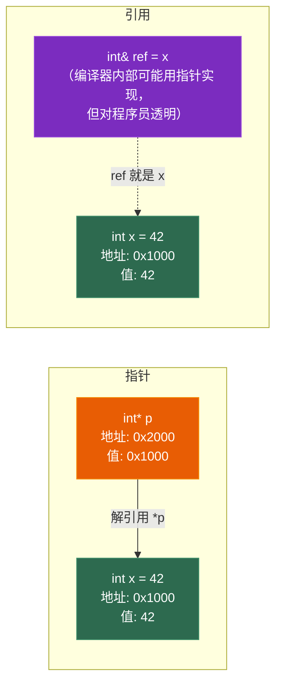
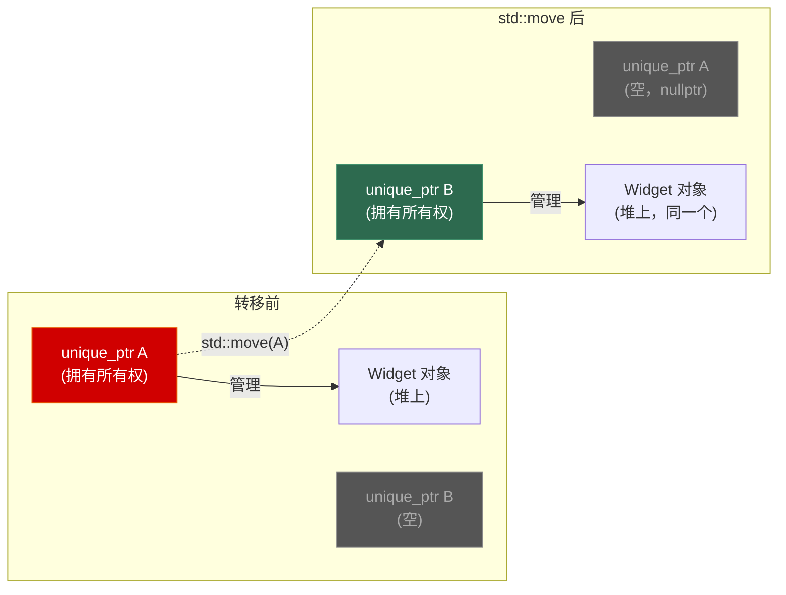
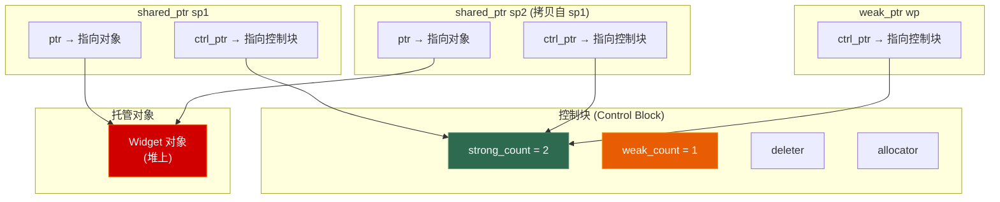
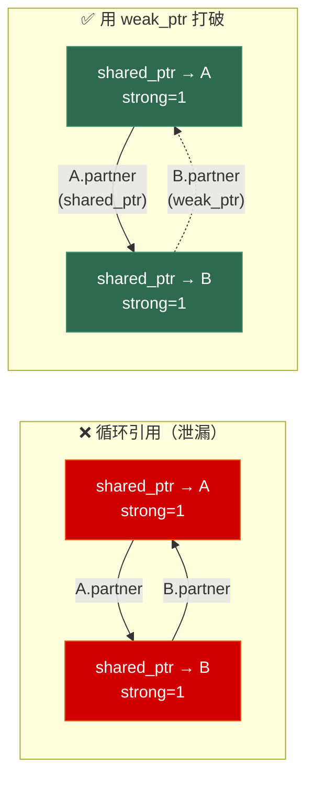
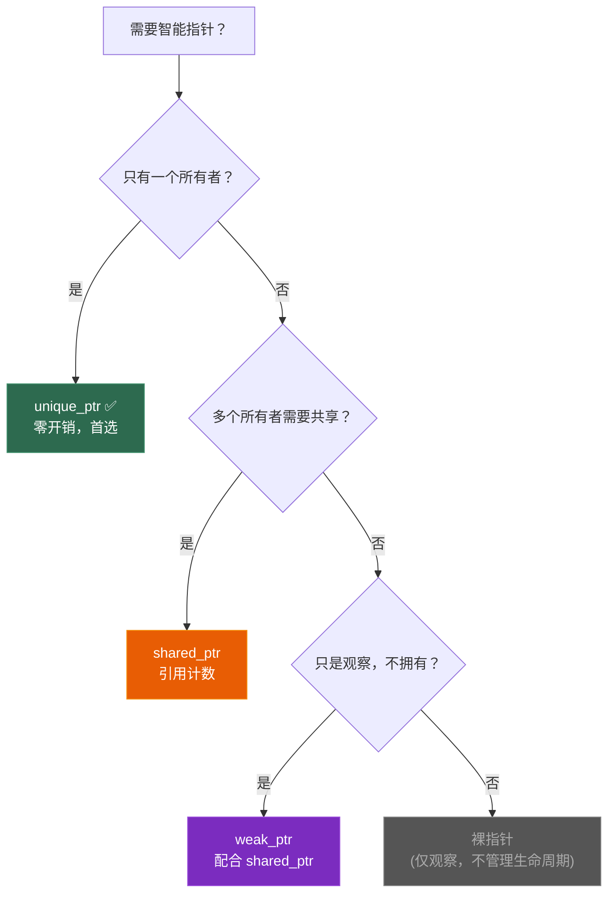

# 第二章 指针、引用与智能指针

> **一句话理解**：指针给了你直接操作内存地址的能力，智能指针则给了你**自动管理内存生命周期**的安全网——理解它们，就是理解 C++ 的资源管理哲学。

---

## 2.1 概念直觉 —— What & Why

### 指针是什么？

指针本质上就是一个**存储内存地址的变量**。它本身也占内存（64 位系统上 = 8 字节），它的值是另一块内存的地址。

```cpp
int x = 42;
int* p = &x;    // p 的值是 x 的内存地址（比如 0x7FFE1234）
*p = 100;       // 解引用：通过地址修改 x 的值

// p 本身占 8 字节（64位），存的是地址
// *p 访问的是 p 指向的那块内存（x 的 4 字节）
```

### 引用是什么？

引用是变量的**别名（alias）**——它不是一个新的变量，而是给已有变量起了个新名字。

```cpp
int x = 42;
int& ref = x;   // ref 就是 x 的另一个名字
ref = 100;       // 等价于 x = 100
```

### 为什么需要智能指针？

裸指针有一个根本问题：**谁负责释放内存？**

```cpp
Widget* create() { return new Widget(); }

void bad_usage() {
    Widget* w = create();
    // ... 很多代码 ...
    // 问题来了：
    // 1. 如果忘记 delete w → 内存泄漏
    // 2. 如果中间抛异常 → 内存泄漏
    // 3. 如果把 w 传给另一个函数，谁来 delete？
    // 4. 如果 delete 了两次 → 崩溃
}
```

智能指针的核心思想是 **RAII (Resource Acquisition Is Initialization)**：

> 把资源的生命周期绑定到对象的生命周期——对象构造时获取资源，对象析构时自动释放资源。

```cpp
void good_usage() {
    auto w = std::make_unique<Widget>();  // 构造时 new
    // ... 很多代码 ...
    // 函数返回 / 抛异常 → w 析构 → 自动 delete
    // 不可能泄漏！
}
```

---

## 2.2 原理图解

### 指针 vs 引用的内存示意



### `unique_ptr` 的所有权转移



### `shared_ptr` 的控制块结构



```
生命周期规则：
• strong_count 降到 0 → 销毁对象（调用析构 + 释放对象内存）
• weak_count 也降到 0 → 销毁控制块本身
• 只要还有 weak_ptr 存在，控制块就不释放（weak_ptr 需要检查对象是否存活）
```

### `weak_ptr` 如何解决循环引用



---

## 2.3 底层机制剖析

### 2.3.1 指针 vs 引用 —— 八条核心区别

| 维度 | 指针 | 引用 |
|------|------|------|
| **本质** | 存储地址的变量 | 变量的别名 |
| **可以为空** | ✅ 可以是 `nullptr` | ❌ 必须绑定到有效对象 |
| **可以重新绑定** | ✅ `p = &y;` | ❌ 初始化后不能改绑 |
| **需要初始化** | ❌ 可以不初始化（危险） | ✅ 必须初始化 |
| **有自己的地址** | ✅ `&p` 是指针自己的地址 | ❌ `&ref` 是引用对象的地址 |
| **sizeof** | 指针的大小（8B/4B） | 引用对象的大小 |
| **多级** | ✅ `int**`（指向指针的指针） | ❌ 没有"引用的引用" |
| **算术运算** | ✅ `p++`、`p + n` | ❌ 不支持 |

```cpp
int x = 10, y = 20;

// 指针可以重新指向
int* p = &x;
p = &y;         // ✅ 现在指向 y

// 引用不能重新绑定
int& ref = x;
ref = y;        // ⚠️ 这不是重新绑定！这是把 y 的值赋给 x！
                // 执行后 x == 20，ref 仍然绑定 x

// 指针可以为空
int* null_p = nullptr;  // ✅ 合法

// 引用不能为空（标准不允许，虽然你可以强行做）
// int& null_ref = *nullptr;  // ❌ 未定义行为！
```

> 💡 **面试中的表述**：「引用在底层通常用指针实现，但语义上它是别名而非独立变量。核心区别三点：引用不能为空、不能重新绑定、不占独立空间。一般优先用引用（更安全），需要可空或重新指向时用指针。」

---

### 2.3.2 const 与指针的排列组合

这是面试高频考点。记住这个口诀：**const 修饰它左边的东西，如果左边没有就修饰右边**。

```cpp
int x = 10, y = 20;

// 1. 指向 const 的指针（底层 const）
const int* p1 = &x;    // 不能通过 p1 修改 x
int const* p1b = &x;   // 与上面完全等价！（const 在 * 左边 → 修饰 int）
// *p1 = 20;           // ❌ 编译错误
p1 = &y;               // ✅ 可以指向别的对象

// 2. const 指针（顶层 const）
int* const p2 = &x;    // 指针本身不能改
*p2 = 20;              // ✅ 可以修改指向的值
// p2 = &y;            // ❌ 编译错误

// 3. 指向 const 的 const 指针（双重 const）
const int* const p3 = &x;
// *p3 = 20;           // ❌
// p3 = &y;            // ❌

// 4. const 引用
const int& cref = x;   // 不能通过 cref 修改 x
// cref = 20;          // ❌
// 但 x 本身可以改：
x = 20;                // ✅ cref 现在也是 20
```

**const 引用的特殊能力——绑定临时对象**：

```cpp
// 普通引用不能绑定临时对象
// int& ref = 42;       // ❌ 编译错误

// const 引用可以！并且延长临时对象的生命周期
const int& ref = 42;   // ✅ 临时 int 的生命周期延长到 ref 的作用域

// 这就是为什么函数参数经常用 const T&：
void process(const std::string& s);  // 可以接受临时 string
process("hello");                     // "hello" → 临时 string → const& 绑定 ✅
```

---

### 2.3.3 函数指针与 `std::function`

#### C 风格函数指针

```cpp
// 声明函数指针（语法丑但必须掌握）
int add(int a, int b) { return a + b; }
int sub(int a, int b) { return a - b; }

// 函数指针类型：int (*)(int, int)
int (*func_ptr)(int, int) = &add;   // & 可省略
int result = func_ptr(3, 4);        // result = 7

func_ptr = sub;                      // 重新指向 sub
result = func_ptr(3, 4);            // result = -1

// 用 typedef / using 简化
using BinaryOp = int (*)(int, int);
BinaryOp op = add;

// 函数指针数组（策略模式的 C 风格实现）
BinaryOp ops[] = {add, sub};
ops[0](3, 4);  // 7
ops[1](3, 4);  // -1
```

#### Lambda 的本质

Lambda 表达式不是魔法——编译器会生成一个**匿名类**，重载 `operator()`：

```cpp
// 你写的 Lambda：
auto add = [](int a, int b) { return a + b; };

// 编译器生成的等价代码：
struct __lambda_1 {
    int operator()(int a, int b) const {
        return a + b;
    }
};
__lambda_1 add;  // 创建实例

// 带捕获的 Lambda：
int factor = 10;
auto mul = [factor](int x) { return x * factor; };

// 编译器生成：
struct __lambda_2 {
    int factor;  // 捕获的变量成为成员
    __lambda_2(int f) : factor(f) {}
    int operator()(int x) const {
        return x * factor;
    }
};
__lambda_2 mul(factor);
```

#### `std::function` —— 类型擦除的通用可调用包装器

```cpp
#include <functional>

// std::function 可以包装任何可调用对象：
// 函数指针、Lambda、仿函数、成员函数指针
std::function<int(int, int)> f;

f = add;                                    // 函数指针
f = [](int a, int b) { return a + b; };     // Lambda
f(3, 4);                                     // 调用

// 代价：std::function 有运行时开销
// 1. 内部用类型擦除（虚函数或函数指针间接调用）
// 2. 可能堆分配（如果可调用对象太大，超出内部缓冲区）
// 3. sizeof(std::function) 通常 = 32 或 64 字节

// 如果可以用 auto 或模板参数，优先用它们（零开销）：
template <typename Func>
void apply(Func&& func, int a, int b) {
    func(a, b);  // 编译期确定类型，可内联，零开销
}
```

> 💡 `std::function` 适合需要**存储**可调用对象的场景（如回调容器、事件系统）。如果只是**传递**可调用对象，用模板参数更高效。

#### `std::function` 的 SBO（小对象优化）

`std::function` 内部有一段固定大小的缓冲区（通常 16~32 字节）。如果可调用对象足够小，就直接存在这个缓冲区里（**栈内存**）；如果太大，则 `new` 到堆上。

```cpp
// std::function 的简化内存布局：
struct function_impl {
    void* invoke_ptr;              // 类型擦除的调用函数指针
    void* manager_ptr;             // 类型擦除的管理函数（拷贝/销毁）
    alignas(max_align_t)
    char buffer[SBO_SIZE];         // 栈上缓冲区（SBO_SIZE 通常 = 16 或 24）
    bool uses_heap;                // 是否使用了堆分配
};

// 小 Lambda（无捕获或捕获少量变量）→ SBO，无堆分配
auto small = [x = 1](int a) { return a + x; };
std::function<int(int)> f1 = small;  // 存在栈缓冲区 ✅

// 大 Lambda（捕获大量数据）→ 堆分配
std::array<int, 100> big_data{};
auto big = [big_data](int a) { return a + big_data[0]; };
std::function<int(int)> f2 = big;    // 超过 SBO → new 到堆上 ⚠️
```

| 场景 | SBO 命中？ | 开销 |
|------|-----------|------|
| 无捕获 Lambda | ✅ | 零堆分配 |
| 捕获 1-2 个 int/ptr | ✅ | 零堆分配 |
| 捕获大结构体/容器 | ❌ | 堆分配（类似 `new`） |
| 函数指针 | ✅ | 零堆分配 |
| 成员函数指针 + 对象指针 | ✅（通常） | 零堆分配 |

> 💡 **面试中的表述**：「`std::function` 使用类型擦除和小对象优化。小的可调用对象直接存在内部缓冲区，避免堆分配；大的才会 `new`。所以在性能敏感的场景（如每帧调用的回调），应该注意 Lambda 捕获的大小，或改用模板实现零开销调用。」

#### 成员函数指针 —— 面试冷门但必会

成员函数不是普通函数——它有一个隐式的 `this` 参数。所以成员函数指针的语法和调用方式都不同：

```cpp
struct Player {
    std::string name;
    int hp = 100;

    void takeDamage(int dmg) {
        hp -= dmg;
        std::cout << name << " took " << dmg << " damage, hp=" << hp << "\n";
    }

    int getHP() const { return hp; }
};

// 声明成员函数指针
void (Player::*dmg_func)(int) = &Player::takeDamage;
int  (Player::*get_func)() const = &Player::getHP;

// 调用：需要一个对象实例
Player p{"Hero", 100};
(p.*dmg_func)(30);          // 通过对象调用：Hero took 30 damage, hp=70

Player* pp = &p;
(pp->*dmg_func)(20);        // 通过指针调用：Hero took 20 damage, hp=50

// 用 using 简化类型
using DamageFunc = void (Player::*)(int);
DamageFunc fn = &Player::takeDamage;

// 配合 std::function / std::bind 使用（更常见的写法）
std::function<void(Player&, int)> f = &Player::takeDamage;
f(p, 10);  // Hero took 10 damage, hp=40

// C++17 std::invoke（统一调用语法）
std::invoke(&Player::takeDamage, p, 5);   // Hero took 5 damage, hp=35
std::invoke(&Player::getHP, p);            // 返回 35
```

**成员函数指针的大小**：

```cpp
// 普通函数指针：8 字节（64 位系统）
sizeof(void(*)(int)) == 8

// 成员函数指针：通常 8~24 字节！
// 单继承类的成员函数指针：通常 8 字节
// 多继承类：可能 16 字节（需要 this 指针调整偏移）
// 虚继承类：可能 16~24 字节（需要通过虚基类表查找）
sizeof(void(Player::*)(int))  // 通常 8B（单继承）
sizeof(void(Multi::*)(int))   // 可能 16B（多继承）
```

> 💡 **面试中的表述**：「成员函数指针和普通函数指针不同——它比普通函数指针大（可能 8~24 字节），因为多继承时需要额外存储 this 指针的调整偏移。调用时用 `.*` 或 `->*` 运算符，或者用 `std::invoke` 统一语法。」

---

### 2.3.4 `unique_ptr` —— 独占所有权

`unique_ptr` 是 C++11 引入的最常用智能指针。核心原则：**同一时刻，只有一个 `unique_ptr` 拥有资源**。

#### 手写简化版

```cpp
template <typename T>
class UniquePtr {
    T* _ptr;

public:
    // 构造
    explicit UniquePtr(T* p = nullptr) : _ptr(p) {}

    // 析构 → 自动释放
    ~UniquePtr() { delete _ptr; }

    // ❌ 禁止拷贝（核心：独占所有权）
    UniquePtr(const UniquePtr&) = delete;
    UniquePtr& operator=(const UniquePtr&) = delete;

    // ✅ 允许移动（所有权转移）
    UniquePtr(UniquePtr&& other) noexcept : _ptr(other._ptr) {
        other._ptr = nullptr;  // 原来的释放所有权
    }

    UniquePtr& operator=(UniquePtr&& other) noexcept {
        if (this != &other) {
            delete _ptr;             // 释放当前资源
            _ptr = other._ptr;       // 接管新资源
            other._ptr = nullptr;    // 原来的释放所有权
        }
        return *this;
    }

    // 解引用
    T& operator*() const { return *_ptr; }
    T* operator->() const { return _ptr; }

    // 获取裸指针（不转移所有权）
    T* get() const { return _ptr; }

    // 释放所有权并返回裸指针
    T* release() {
        T* tmp = _ptr;
        _ptr = nullptr;
        return tmp;
    }

    // 重置：释放旧资源，接管新资源
    void reset(T* p = nullptr) {
        delete _ptr;
        _ptr = p;
    }

    explicit operator bool() const { return _ptr != nullptr; }
};
```

#### 标准库用法

```cpp
#include <memory>

// 创建：优先用 make_unique（异常安全 + 可能优化分配）
auto p1 = std::make_unique<Widget>(42);      // Widget(42)
auto p2 = std::make_unique<int[]>(100);       // int[100]

// 所有权转移
auto p3 = std::move(p1);  // p1 变成 nullptr，p3 拥有 Widget
// p1->doSomething();      // ❌ 崩溃！p1 已经是空的

// 函数间传递所有权
std::unique_ptr<Widget> createWidget() {
    return std::make_unique<Widget>();  // RVO，无需 std::move
}

void takeOwnership(std::unique_ptr<Widget> w) {
    // w 在函数结束时自动释放
}

auto w = createWidget();
takeOwnership(std::move(w));  // 传入时必须 move

// 自定义 deleter
auto file = std::unique_ptr<FILE, decltype(&fclose)>(
    fopen("data.txt", "r"), &fclose
);
// file 析构时自动调用 fclose
```

> ⚠️ `unique_ptr` 开销是零 —— `sizeof(unique_ptr<T>)` == `sizeof(T*)`（无自定义 deleter 时）。它是**编译期的所有权约束**，不增加任何运行时开销。

---

### 2.3.5 `shared_ptr` —— 共享所有权

当多个地方需要共同持有一个资源时，用 `shared_ptr`。内部通过**引用计数**管理生命周期。

#### 控制块详解

```cpp
// 每个 shared_ptr 管理的资源对应一个控制块
// 控制块包含：
struct ControlBlock {
    std::atomic<size_t> strong_count;  // 共享计数（有多少 shared_ptr 指向对象）
    std::atomic<size_t> weak_count;    // 弱计数（有多少 weak_ptr 指向控制块）
    Deleter deleter;                    // 删除器
    Allocator allocator;                // 分配器
    // 可能还有托管对象本身（make_shared 的单次分配优化）
};
```

#### `make_shared` vs `shared_ptr<T>(new T)`

```cpp
// 方式 1：shared_ptr<T>(new T)  → 两次内存分配
auto sp1 = std::shared_ptr<Widget>(new Widget());
// 分配 1：new Widget()     → 堆上分配 Widget
// 分配 2：共享指针内部      → 堆上分配控制块

// 方式 2：make_shared       → 一次内存分配（推荐！）
auto sp2 = std::make_shared<Widget>();
// 只分配一次：Widget + 控制块在同一块内存中
// ┌──────────────────────────────┐
// │  控制块  │  Widget 对象       │  ← 一次 malloc
// └──────────────────────────────┘
```

| 维度 | `shared_ptr<T>(new T)` | `make_shared<T>()` |
|------|------------------------|-------------------|
| 内存分配次数 | **2 次** | **1 次** |
| 缓存友好 | 差（控制块和对象可能不相邻） | 好（连续内存） |
| 异常安全 | ❌ 可能泄漏* | ✅ |
| 自定义 deleter | ✅ 支持 | ❌ 不支持 |
| 内存释放时机 | 对象和控制块独立释放 | weak_ptr 全清才释放** |

> `*` 异常安全问题：`foo(shared_ptr<T>(new T), may_throw())` 中，如果 `new T` 先执行、`may_throw()` 后执行并抛异常，`new T` 的内存就泄漏了。`make_shared` 没有这个问题。

> `**` `make_shared` 的代价：因为对象和控制块在同一块内存中，即使所有 `shared_ptr` 都释放了（对象析构），只要还有 `weak_ptr` 存在，整块内存都不能释放（只是对象被析构了，内存还在）。

#### 引用计数的线程安全

```cpp
// ✅ 引用计数本身是原子的（线程安全）
// 多个线程可以同时拷贝/销毁指向同一对象的 shared_ptr
std::shared_ptr<Widget> global_sp = std::make_shared<Widget>();

void thread1() {
    auto local = global_sp;   // ✅ 原子地 ++strong_count
}
void thread2() {
    auto local = global_sp;   // ✅ 原子地 ++strong_count
}

// ❌ 但 shared_ptr 本身的读写不是线程安全的！
void thread3() {
    global_sp = std::make_shared<Widget>();  // ❌ 如果另一个线程同时读 global_sp → 数据竞争！
}

// ✅ 如果需要多线程读写同一个 shared_ptr 变量，用 mutex 或 atomic<shared_ptr>（C++20）
std::mutex sp_mutex;
void safe_write() {
    std::lock_guard lock(sp_mutex);
    global_sp = std::make_shared<Widget>();
}
```

> 💡 **面试中的表述**：「`shared_ptr` 的引用计数操作是原子的，所以多个线程可以安全地拷贝和销毁 `shared_ptr`。但是，多个线程同时读写**同一个** `shared_ptr` 变量（比如一个全局的 `shared_ptr`）不是线程安全的，需要加锁。」

#### `enable_shared_from_this`

有时候一个对象需要在自己的成员函数中获取一个指向自己的 `shared_ptr`：

```cpp
class Widget : public std::enable_shared_from_this<Widget> {
public:
    std::shared_ptr<Widget> getShared() {
        return shared_from_this();  // ✅ 返回共享自身的 shared_ptr
    }
};

auto sp = std::make_shared<Widget>();
auto sp2 = sp->getShared();  // sp2 和 sp 共享同一个对象和控制块

// ❌ 错误用法：从非 shared_ptr 管理的对象调用 shared_from_this
Widget w;
// w.getShared();  // ❌ 未定义行为！w 不是 shared_ptr 管理的
```

**原理**：`enable_shared_from_this<T>` 内部持有一个 `weak_ptr<T>`。当 `T` 对象被 `shared_ptr` 管理时，构造过程会自动设置这个 `weak_ptr`。`shared_from_this()` 就是通过这个 `weak_ptr` 升级为 `shared_ptr`。

---

### 2.3.6 `weak_ptr` —— 弱引用，不参与所有权

`weak_ptr` 不增加 `strong_count`，不影响对象的生命周期。它的目的是：

1. **打破循环引用**
2. **观察但不拥有**（检查对象是否还活着）

```cpp
std::weak_ptr<Widget> wp;

{
    auto sp = std::make_shared<Widget>();
    wp = sp;             // weak_ptr 不增加 strong_count

    // 使用 weak_ptr：必须先升级为 shared_ptr
    if (auto sp2 = wp.lock()) {
        // sp2 是有效的 shared_ptr，对象还活着
        sp2->doSomething();
    }

    wp.expired();        // false，对象还在
}
// sp 销毁 → strong_count = 0 → Widget 被析构

wp.expired();            // true，对象已死
if (auto sp3 = wp.lock()) {
    // 不会进来，lock() 返回空 shared_ptr
}
```

#### 循环引用实战

```cpp
struct Node {
    std::string name;
    std::shared_ptr<Node> next;    // ← 强引用
    std::weak_ptr<Node> prev;      // ← 弱引用（打破循环）

    Node(std::string n) : name(std::move(n)) {}
    ~Node() { std::cout << name << " destroyed\n"; }
};

void test() {
    auto a = std::make_shared<Node>("A");
    auto b = std::make_shared<Node>("B");

    a->next = b;    // A → B (shared_ptr, strong)
    b->prev = a;    // B → A (weak_ptr, weak) ← 不增加 A 的 strong_count

    // 函数结束：
    // b 销毁 → B 的 strong_count 从 1→0 → B 析构 → B.prev(weak_ptr) 销毁
    // a 销毁 → A 的 strong_count 从 1→0 → A 析构
    // 输出：B destroyed \n A destroyed ✅ 无泄漏！
}

// 如果 prev 也是 shared_ptr：
// a 销毁 → A 的 strong_count 从 2→1（因为 b->prev 还持有 A）→ 不销毁
// b 销毁 → B 的 strong_count 从 2→1（因为 a->next 还持有 B）→ 不销毁
// A 和 B 互相引用 → 永远不销毁 → 内存泄漏！
```

---

### 2.3.7 三种智能指针总结对比

| 维度 | `unique_ptr` | `shared_ptr` | `weak_ptr` |
|------|-------------|-------------|-----------|
| **所有权** | 独占 | 共享 | 不拥有 |
| **拷贝** | ❌ 禁止 | ✅ 引用计数 +1 | ✅ 弱计数 +1 |
| **移动** | ✅ 转移所有权 | ✅ 不改变计数 | ✅ |
| **开销** | **零**（同裸指针） | 原子计数 + 控制块 | 同 shared_ptr |
| **sizeof** | 8B（无自定义 deleter） | 16B（ptr + ctrl_ptr） | 16B |
| **使用场景** | 工厂返回值、独占资源 | 多处共享的资源 | 观察者、缓存、打破循环引用 |
| **对应关系** | 1 对象 : 1 持有者 | 1 对象 : N 持有者 | 1 对象 : N 观察者 |



> 💡 **选择口诀**：「能用 `unique_ptr` 就别用 `shared_ptr`。需要共享时用 `shared_ptr`。观察但不拥有时用 `weak_ptr`。仅做参数传递（调用者保证生命周期）时，直接用裸指针或引用。」

---

## 2.4 经典陷阱与面试题

### 2.4.1 "这段代码有什么问题？"

```cpp
// === 陷阱 1：shared_ptr 从裸指针构造两次 ===
Widget* raw = new Widget();
std::shared_ptr<Widget> sp1(raw);
std::shared_ptr<Widget> sp2(raw);   // ❌ 两个独立的控制块！
// sp1 和 sp2 各自 strong_count = 1
// sp1 析构 → delete raw
// sp2 析构 → delete raw → 💥 Double Free！

// ✅ 正确做法：
auto sp1 = std::make_shared<Widget>();
auto sp2 = sp1;  // 共享同一个控制块

// === 陷阱 2：Lambda 捕获悬垂引用 ===
std::function<int()> createLambda() {
    int local = 42;
    return [&local]() { return local; };  // ❌ local 在返回后销毁！
    // 返回的 Lambda 持有一个悬垂引用
}
auto fn = createLambda();
fn();  // 💥 未定义行为！

// ✅ 正确做法：值捕获
std::function<int()> createLambdaFixed() {
    int local = 42;
    return [local]() { return local; };  // ✅ 拷贝了 local 的值
}

// === 陷阱 3：unique_ptr 尝试拷贝 ===
auto p1 = std::make_unique<Widget>();
// auto p2 = p1;              // ❌ 编译错误！禁止拷贝
auto p2 = std::move(p1);     // ✅ 移动

// === 陷阱 4：在容器中存 shared_ptr 导致意外延长生命周期 ===
std::vector<std::shared_ptr<Widget>> cache;
{
    auto w = std::make_shared<Widget>();
    cache.push_back(w);
}
// Widget 还没被销毁！因为 cache 中的 shared_ptr 还持有它
// 如果 cache 是一个缓存，应该用 weak_ptr
std::vector<std::weak_ptr<Widget>> weak_cache;  // ✅

// === 陷阱 5：悬垂指针三兄弟 ===
// 野指针（Wild Pointer）：未初始化的指针，指向随机地址
int* wild;          // 未初始化！值是栈上的垃圾
*wild = 42;         // 💥 写入随机地址 → 未定义行为

// 悬垂指针（Dangling Pointer）：指向已释放的内存
int* dangling = new int(42);
delete dangling;
*dangling = 100;    // 💥 Use-After-Free

// 空指针（Null Pointer）：显式指向"无"
int* null_ptr = nullptr;
*null_ptr = 42;     // 💥 段错误（但至少可以检查 if (!ptr)）

// ✅ 最佳实践：
// 1. 声明指针时立即初始化（= nullptr 或 = new ...）
// 2. delete 后立即置空：delete p; p = nullptr;
// 3. 优先用智能指针，让编译器帮你管

// === 陷阱 6：shared_ptr 的 this 指针陷阱 ===
class BadWidget {
public:
    std::shared_ptr<BadWidget> getShared() {
        // ❌ 从 this 裸指针构造 shared_ptr → 新的控制块 → Double Free！
        return std::shared_ptr<BadWidget>(this);
    }
};

auto sp = std::make_shared<BadWidget>();
auto sp2 = sp->getShared();  // 💥 两个控制块管理同一个对象！
// sp 和 sp2 析构时都会 delete this → Double Free

// ✅ 正确做法：继承 enable_shared_from_this（见 2.3.5）
```

### 2.4.2 面试辨析

**Q1：`shared_ptr` 线程安全吗？**

> 引用计数的增减是原子的，所以多个线程可以安全地拷贝/销毁指向同一对象的 `shared_ptr`。但是，读写**同一个 `shared_ptr` 变量**不是线程安全的——一个线程读、另一个线程写同一个 `shared_ptr` 会数据竞争。另外，`shared_ptr` 指向的**对象本身**也不是线程安全的，需要单独加锁。

**Q2：`make_shared` 和 `shared_ptr<T>(new T)` 的区别？**

> `make_shared` 只做一次内存分配（对象和控制块在同一块内存），更快且缓存友好。`shared_ptr<T>(new T)` 需要两次分配。但 `make_shared` 不能自定义 deleter，且在有 `weak_ptr` 存在时整块内存不能提前释放。

**Q3：什么时候用裸指针？**

> 当一个函数只是"借用"对象（不影响生命周期），且调用者保证对象在调用期间有效时，可以用裸指针或引用作为参数。这避免了 `shared_ptr` 的引用计数开销。比如 `void process(Widget* w)` 只是使用 w，不管理它的生命周期。

**Q4：指针和引用的区别？** *（最高频！）*

> 三个核心区别：引用不能为空，指针可以；引用初始化后不能改绑，指针可以重新指向；引用不占额外空间（语义上），指针有自己的地址和大小。底层实现中引用通常用 const 指针实现，但语义上是别名。

---

## 2.5 🎮 游戏实战场景

### 2.5.1 资源管理系统 —— `shared_ptr` 管理共享资源

```cpp
// 游戏中，同一张纹理可能被多个 Sprite 使用
// 当所有使用者都释放后，纹理才应该被卸载

class TextureManager {
    std::unordered_map<std::string, std::weak_ptr<Texture>> _cache;

public:
    std::shared_ptr<Texture> load(const std::string& path) {
        // 1. 先检查缓存
        if (auto it = _cache.find(path); it != _cache.end()) {
            if (auto sp = it->second.lock()) {
                return sp;  // 缓存命中，返回已有纹理
            }
            // 纹理已被释放，缓存失效
            _cache.erase(it);
        }

        // 2. 缓存未命中，加载新纹理
        auto texture = std::make_shared<Texture>(path);
        _cache[path] = texture;  // 存 weak_ptr 到缓存
        return texture;
    }
};

// 使用：
TextureManager manager;
auto tex1 = manager.load("hero.png");   // 加载
auto tex2 = manager.load("hero.png");   // 缓存命中！tex1 和 tex2 共享同一张纹理
// tex1、tex2 都销毁后 → strong_count = 0 → 纹理自动卸载
// 下次 load("hero.png") 时重新加载
```

> 为什么缓存用 `weak_ptr` 而不是 `shared_ptr`？因为缓存不应该**阻止**资源被释放。如果缓存用 `shared_ptr`，那即使所有使用者都不再需要这张纹理，缓存的 `shared_ptr` 仍然持有它，永远不会释放——这就是内存泄漏。

### 2.5.2 Entity 引用 —— `weak_ptr` 避免引用已死亡的实体

```cpp
class Entity {
    std::string _name;
    // 追踪目标（可能随时被销毁）
    std::weak_ptr<Entity> _target;

public:
    Entity(std::string name) : _name(std::move(name)) {}

    void setTarget(std::shared_ptr<Entity> target) {
        _target = target;
    }

    void update() {
        if (auto target = _target.lock()) {
            // 目标还活着，追踪它
            std::cout << _name << " is chasing " << target->_name << "\n";
        } else {
            // 目标已死亡，停止追踪
            std::cout << _name << " lost target, idle\n";
            _target.reset();
        }
    }
};

// 使用：
auto player = std::make_shared<Entity>("Player");
auto enemy  = std::make_shared<Entity>("Enemy");
enemy->setTarget(player);

enemy->update();  // "Enemy is chasing Player"

player.reset();   // Player 被销毁
enemy->update();  // "Enemy lost target, idle" ← 安全地检测到目标死亡
```

### 2.5.3 UI 系统 —— `unique_ptr` 管理窗口树

```cpp
class UIWidget {
    std::string _name;
    std::vector<std::unique_ptr<UIWidget>> _children;  // 独占子节点
    UIWidget* _parent = nullptr;                        // 裸指针：仅观察，不拥有

public:
    UIWidget(std::string name) : _name(std::move(name)) {}

    void addChild(std::unique_ptr<UIWidget> child) {
        child->_parent = this;
        _children.push_back(std::move(child));
    }

    // 父节点销毁时，所有子节点自动销毁（unique_ptr 析构链）
    // 子节点的 _parent 裸指针不影响父节点的生命周期
};

// 使用：
auto root = std::make_unique<UIWidget>("Root");
auto panel = std::make_unique<UIWidget>("Panel");
auto button = std::make_unique<UIWidget>("Button");

panel->addChild(std::move(button));
root->addChild(std::move(panel));

// root 销毁 → Panel 自动销毁 → Button 自动销毁
// 整个 UI 树自动清理，无需手动 delete
```

### 2.5.4 回调系统 —— `std::function` + `weak_ptr` 防悬垂

```cpp
class EventSystem {
    std::vector<std::pair<
        std::weak_ptr<void>,           // 观察者的生命周期
        std::function<void()>           // 回调函数
    >> _listeners;

public:
    // 注册监听器时同时绑定生命周期
    template <typename T>
    void subscribe(std::shared_ptr<T> owner, std::function<void()> callback) {
        _listeners.emplace_back(owner, std::move(callback));
    }

    void fire() {
        // 清理已死亡的监听器，只调用存活的
        _listeners.erase(
            std::remove_if(_listeners.begin(), _listeners.end(),
                [](auto& pair) { return pair.first.expired(); }),
            _listeners.end()
        );

        for (auto& [wp, cb] : _listeners) {
            if (!wp.expired()) {
                cb();
            }
        }
    }
};

// 使用：
EventSystem events;
{
    auto npc = std::make_shared<Entity>("NPC");
    events.subscribe(npc, []() { std::cout << "NPC reacts!\n"; });
    events.fire();  // "NPC reacts!"
}
// npc 已销毁
events.fire();      // 不会调用回调，因为 weak_ptr 已过期 ✅
```

### 2.5.5 自定义 Deleter —— GPU 资源的安全释放

GPU 资源（纹理、Shader、Buffer）不能用 `delete` 释放——需要调用特定的图形 API（如 OpenGL 的 `glDeleteTextures`、DirectX 的 `Release()`）。自定义 deleter 让智能指针也能管理这些资源：

```cpp
// OpenGL 纹理的 RAII 封装
struct GLTextureDeleter {
    void operator()(GLuint* id) const {
        if (id && *id != 0) {
            glDeleteTextures(1, id);
            std::cout << "GPU Texture " << *id << " released\n";
        }
        delete id;
    }
};

// unique_ptr + 自定义 deleter
std::unique_ptr<GLuint, GLTextureDeleter> createTexture() {
    auto id = std::make_unique<GLuint>(0);
    glGenTextures(1, id.get());
    glBindTexture(GL_TEXTURE_2D, *id);
    // ... 设置纹理参数、上传数据 ...
    return std::unique_ptr<GLuint, GLTextureDeleter>(id.release());
}

// 更简洁的写法：用 Lambda 作为 deleter
auto createBuffer() {
    GLuint vbo = 0;
    glGenBuffers(1, &vbo);
    // ... 上传顶点数据 ...

    // Lambda deleter（注意：sizeof 会增大！）
    auto deleter = [](GLuint* id) {
        glDeleteBuffers(1, id);
        delete id;
    };
    return std::unique_ptr<GLuint, decltype(deleter)>(
        new GLuint(vbo), deleter
    );
}

// 使用：
{
    auto texture = createTexture();
    auto buffer  = createBuffer();
    // ... 渲染 ...
}
// 作用域结束 → 自动调用 glDeleteTextures / glDeleteBuffers
// 即使中间抛异常，GPU 资源也不会泄漏 ✅
```

**更通用的模式——RAII 封装类**：

```cpp
// 通用 GPU Handle（生产代码中更常见的写法）
template <typename CreateFunc, typename DestroyFunc>
class GPUHandle {
    GLuint _id = 0;
    DestroyFunc _destroy;

public:
    GPUHandle(CreateFunc create, DestroyFunc destroy)
        : _destroy(std::move(destroy)) {
        create(&_id);
    }

    ~GPUHandle() {
        if (_id != 0) _destroy(_id);
    }

    // 禁止拷贝，允许移动
    GPUHandle(const GPUHandle&) = delete;
    GPUHandle& operator=(const GPUHandle&) = delete;

    GPUHandle(GPUHandle&& other) noexcept : _id(other._id), _destroy(std::move(other._destroy)) {
        other._id = 0;
    }

    GLuint id() const { return _id; }
    operator GLuint() const { return _id; }
};

// 使用：
auto vao = GPUHandle(
    [](GLuint* id) { glGenVertexArrays(1, id); },
    [](GLuint id)  { glDeleteVertexArrays(1, &id); }
);

auto shader = GPUHandle(
    [](GLuint* id) { *id = glCreateProgram(); },
    [](GLuint id)  { glDeleteProgram(id); }
);
// 离开作用域自动清理 ✅
```

> 💡 **面试中的表述**：「游戏引擎中 GPU 资源不能用 delete 释放，需要调特定 API。可以用 `unique_ptr` 的自定义 deleter，或者写一个 RAII 封装类，在析构函数中自动释放。这保证了即使出现异常，GPU 资源也不会泄漏。」

---

## 2.6 30 秒速答

**Q：指针和引用的区别？**

> 核心三点：引用不能为空，指针可以 nullptr；引用初始化后不能改绑另一个对象，指针可以重新指向；引用语义上是别名不占独立内存，指针有自己的地址。一般优先用引用（更安全），需要可空或重新指向时用指针。

**Q：三种智能指针的使用场景？**

> `unique_ptr` 用于独占所有权，零开销，首选。比如工厂函数返回值、容器中管理对象。`shared_ptr` 用于共享所有权，有引用计数开销。比如多个模块共享一个资源。`weak_ptr` 用于观察但不拥有，配合 `shared_ptr` 使用。比如缓存系统、打破循环引用、安全观察可能死亡的对象。

**Q：`shared_ptr` 是线程安全的吗？**

> 引用计数的增减是原子操作，多线程拷贝销毁同一对象的 shared_ptr 是安全的。但读写同一个 shared_ptr 变量有数据竞争需要加锁，且指向的对象本身也不是线程安全的。

**Q：什么是循环引用？怎么解决？**

> 两个对象互相持有对方的 shared_ptr，导致引用计数永远不归零，内存永远不释放。解决方案是把其中一个方向改为 weak_ptr，打破循环。比如双向链表中 next 用 shared_ptr、prev 用 weak_ptr。

**Q：`make_shared` 和 `shared_ptr<T>(new T)` 的区别？**

> `make_shared` 只做一次内存分配，对象和控制块在同一块内存中，更快、缓存友好、异常安全。缺点是不能自定义 deleter，且在存在 weak_ptr 时对象的内存不能提前释放。

---

> 📖 上一章：[第一章 内存模型与对象布局](../01_memory_model) —— 进程地址空间、对象布局、new/delete 全流程与游戏内存分配器。

> 📖 下一章：[第三章 面向对象深入：虚函数、多态与继承](../03_oop_and_polymorphism) —— 虚函数表、多继承内存布局、四种 cast 与游戏实体体系设计。
