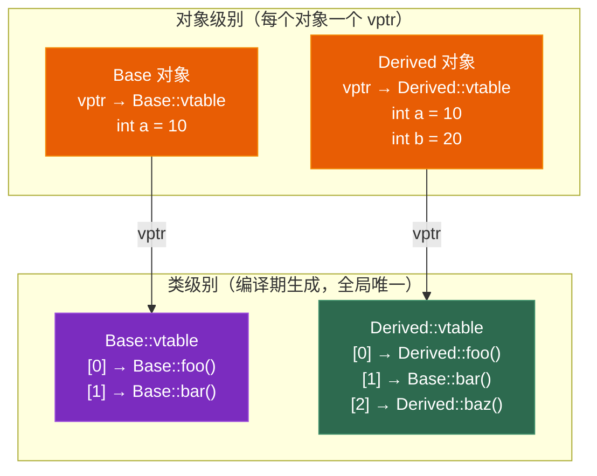
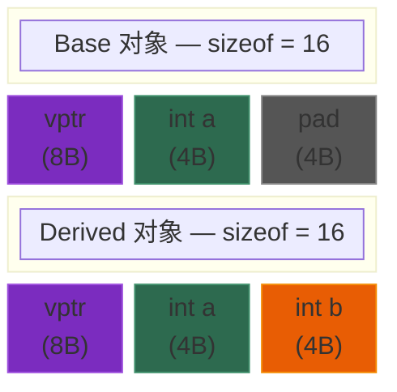
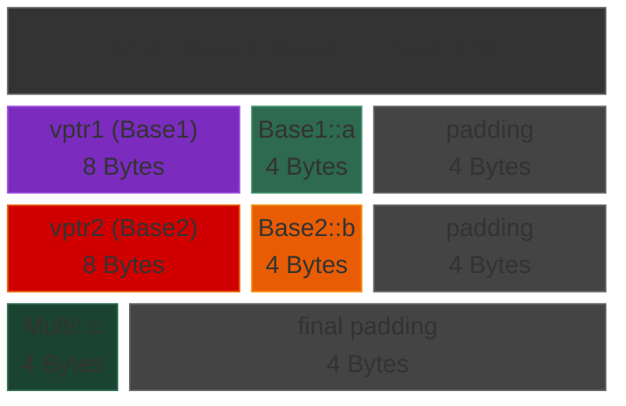
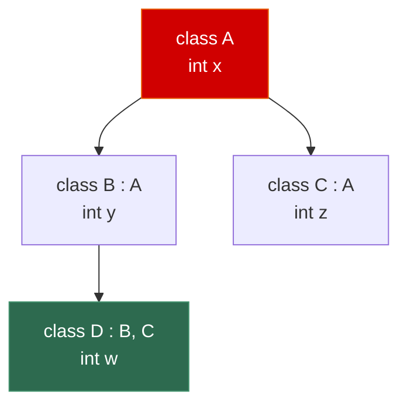

# 第三章 面向对象深入：虚函数、多态与继承

> **一句话理解**：多态让你用**基类指针**调用**派生类方法**——而背后的秘密，就是那张隐藏在每个对象头部的**虚函数表 (vtable)**。

---

## 3.1 概念直觉 —— What & Why

### 两种多态

C++ 支持两种多态机制，各有取舍：

| 维度 | 编译期多态 | 运行期多态 |
|------|-----------|-----------|
| **机制** | 函数重载、模板 | 虚函数 |
| **决定时机** | 编译期 | 运行期 |
| **性能** | **零开销**（内联、特化） | 有开销（间接调用、cache miss） |
| **灵活性** | 类型必须编译期已知 | 可以处理运行时才确定的类型 |
| **典型场景** | 泛型算法、STL 容器 | 游戏实体体系、插件系统 |

### 为什么需要运行期多态？

```cpp
// 一个游戏中的典型场景——
// 你有很多不同类型的实体：玩家、NPC、怪物、道具...
// 它们都需要 Update() 和 Render()，但行为各不相同。

// 没有多态：
void UpdateAll(Player& p, NPC& n, Monster& m) {
    p.Update();
    n.Update();
    m.Update();  // 每加一种实体就改一次代码？不可能！
}

// 有多态：
class Entity {
public:
    virtual void Update() = 0;
    virtual void Render() = 0;
    virtual ~Entity() = default;
};

std::vector<std::unique_ptr<Entity>> entities;
for (auto& e : entities) {
    e->Update();  // 自动调用正确的派生类版本
    e->Render();  // 不管是 Player、NPC 还是 Monster
}
```

> 💡 **面试中的表述**：「运行期多态解决的核心问题是——让代码不依赖具体类型，而是依赖抽象接口。这样新增类型时不需要修改已有代码（开闭原则 OCP）。」

---

## 3.2 原理图解

### vtable 与 vptr 的关系



```
关键规则：
• 每个含虚函数的 类 有一个 vtable（编译期生成，存在 .rodata 段）
• 每个含虚函数的 对象 有一个 vptr（构造时设置，通常在对象最前面）
• 派生类 override 虚函数 = 替换 vtable 中对应位置的函数指针
• 派生类新增虚函数 = 在 vtable 末尾追加
```

### 单继承的内存布局



> 单继承时，Derived 对象的前半部分**就是** Base 的布局。`Base* p = &derived;` 不需要任何指针调整。

### 多继承的内存布局



```
多继承的关键：
• Multi 对象中有两个 vptr（一个继承自 Base1，一个继承自 Base2）
• Base1* p1 = &multi;  → 指向对象开头，无需调整
• Base2* p2 = &multi;  → 需要指针调整！p2 = (char*)&multi + sizeof(Base1子对象)
• 这个调整由编译器自动完成（通过 thunk 函数）
```

### 菱形继承问题



```
不用虚继承时，D 中有两份 A 的数据：
D 的布局: [B 部分: A::x, B::y] [C 部分: A::x, C::z] [D::w]
                     ↑                        ↑
              B 继承的 A::x              C 继承的 A::x    ← 二义性！d.x 是哪个？

虚继承解决方案：
class B : virtual public A { ... };
class C : virtual public A { ... };

D 的布局: [B 部分: vbptr, B::y] [C 部分: vbptr, C::z] [D::w] [共享的 A::x]
           ↑                      ↑                               ↑
    虚基类指针                虚基类指针               只有一份 A 的数据 ✅
```

---

## 3.3 底层机制剖析

### 3.3.1 虚函数表 (vtable) 完整解析

#### vtable 的本质

vtable 就是一个**函数指针数组**，存储在只读数据段（`.rodata`）。每个含虚函数的类有且仅有一个 vtable。

```cpp
class Animal {
public:
    virtual void speak() { std::cout << "...\n"; }
    virtual void move()  { std::cout << "move\n"; }
    virtual ~Animal() = default;
    int age = 0;
};

class Dog : public Animal {
public:
    void speak() override { std::cout << "Woof!\n"; }
    // move() 没有 override → 继承 Animal::move
    void fetch() { std::cout << "Fetch!\n"; }  // 非虚函数，不在 vtable 中
};

class Cat : public Animal {
public:
    void speak() override { std::cout << "Meow!\n"; }
    void move()  override { std::cout << "sneak\n"; }
};
```

编译器为三个类各生成一个 vtable：

```
Animal::vtable:
  [0] → Animal::speak()
  [1] → Animal::move()
  [2] → Animal::~Animal()    // 虚析构

Dog::vtable:
  [0] → Dog::speak()         // override → 替换
  [1] → Animal::move()       // 未 override → 继承
  [2] → Dog::~Dog()          // 析构也需要替换

Cat::vtable:
  [0] → Cat::speak()         // override → 替换
  [1] → Cat::move()          // override → 替换
  [2] → Cat::~Cat()
```

#### 虚函数调用的汇编级分析

```cpp
Animal* p = new Dog();
p->speak();  // 调用的是 Dog::speak()，但编译器怎么知道？
```

编译器为 `p->speak()` 生成的伪汇编：

```
// p->speak() 等价于：
mov rax, [p]           // 1. 读取 p 指向对象的前 8 字节 → 得到 vptr
mov rax, [rax + 0]     // 2. 读取 vtable[0] → 得到 speak() 的函数指针
call rax               // 3. 间接调用

// 如果是 p->move()：
mov rax, [p]           // 1. 读取 vptr
mov rax, [rax + 8]     // 2. 读取 vtable[1]（偏移 8 字节 = 第二个指针）
call rax               // 3. 间接调用
```

**性能开销分析**：

| 开销 | 说明 |
|------|------|
| **间接调用** | 普通函数调用 = `call 地址`（1 次跳转）<br>虚函数调用 = 读 vptr → 读 vtable → call（**3 次内存访问** + 1 次跳转） |
| **无法内联** | 编译器不知道运行时调用的是哪个函数 → 无法内联优化（内联是最重要的优化之一） |
| **分支预测** | 间接 call 的目标地址每次可能不同 → CPU 分支预测器更难预测 → 可能 pipeline stall |
| **缓存** | vtable 访问可能 cache miss（尤其是多态容器中不同类型交替访问时） |

> 💡 **面试中的表述**：「虚函数调用需要两次间接寻址——先读 vptr 找到 vtable，再从 vtable 中找到函数指针。相比直接调用多了内存访问，且无法内联。所以在游戏引擎的热路径（如每帧执行的粒子更新）中，通常避免虚函数，改用数据驱动（ECS）或模板多态。」

#### vptr 的设置时机

```cpp
class Base {
public:
    Base() {
        // 此时 vptr 指向 Base::vtable（还没设置为 Derived 的！）
        this->speak();  // ⚠️ 调用 Base::speak()，不是 Derived::speak()
    }
    virtual void speak() { std::cout << "Base\n"; }
    virtual ~Base() = default;
};

class Derived : public Base {
public:
    Derived() {
        // 此时 vptr 已更新为 Derived::vtable
    }
    void speak() override { std::cout << "Derived\n"; }
};

Derived d;
// 输出：Base（不是 Derived！）
```

```
构造顺序：
1. 分配内存
2. 调用 Base::Base()
   → vptr = &Base::vtable   ← 此时 vptr 指向 Base
   → Base 构造函数体执行
3. 调用 Derived::Derived()
   → vptr = &Derived::vtable ← 此时 vptr 更新为 Derived
   → Derived 构造函数体执行

析构顺序（反过来）：
1. 调用 Derived::~Derived()
   → Derived 析构函数体执行
   → vptr = &Base::vtable    ← vptr 回退为 Base
2. 调用 Base::~Base()
   → Base 析构函数体执行
```

> ⚠️ **面试高频考点**：**构造函数和析构函数中调用虚函数，不会发生动态绑定！** 因为此时 vptr 还没有（或已经不）指向派生类的 vtable。

---

### 3.3.2 虚析构函数

```cpp
class Base {
public:
    ~Base() { std::cout << "~Base\n"; }  // ⚠️ 非虚析构！
};

class Derived : public Base {
    int* data;
public:
    Derived() : data(new int[1000]) {}
    ~Derived() {
        delete[] data;
        std::cout << "~Derived\n";
    }
};

Base* p = new Derived();
delete p;
// 输出：~Base
// ❌ Derived::~Derived 没有被调用 → data 内存泄漏！

// ✅ 修复：基类析构声明为 virtual
class Base {
public:
    virtual ~Base() { std::cout << "~Base\n"; }
};
// 现在 delete p 输出：~Derived ~Base ✅
```

**规则总结**：

> 💡 「只要一个类**可能被继承**，且**可能通过基类指针 delete**，它的析构函数就**必须是 virtual**。」

| 场景 | 需要虚析构？ |
|------|------------|
| 基类指针 delete 派生类对象 | ✅ **必须** |
| 类不会被继承（`final`） | ❌ 不需要 |
| 类只做值语义使用（不用指针） | ❌ 不需要 |
| 抽象基类 / 接口类 | ✅ 推荐（`virtual ~Base() = default;`） |

---

### 3.3.3 纯虚函数与抽象类

```cpp
// 纯虚函数：用 = 0 声明，没有默认实现
class Shape {
public:
    virtual double area() const = 0;        // 纯虚函数
    virtual void draw() const = 0;          // 纯虚函数
    virtual ~Shape() = default;
};

// Shape s;  // ❌ 编译错误！抽象类不能实例化

class Circle : public Shape {
    double radius;
public:
    Circle(double r) : radius(r) {}
    double area() const override { return 3.14159 * radius * radius; }
    void draw() const override { std::cout << "Drawing circle\n"; }
};

Circle c(5.0);  // ✅ 所有纯虚函数都 override 了

// 特殊情况：纯虚析构也需要提供实现！
class AbstractBase {
public:
    virtual ~AbstractBase() = 0;  // 纯虚析构
};
// 必须在类外提供实现（因为派生类析构时会调用它）：
AbstractBase::~AbstractBase() = default;
```

---

### 3.3.4 多继承与指针调整

```cpp
struct Base1 {
    virtual void foo() { std::cout << "Base1::foo\n"; }
    int a = 1;
};

struct Base2 {
    virtual void bar() { std::cout << "Base2::bar\n"; }
    int b = 2;
};

struct Multi : Base1, Base2 {
    void foo() override { std::cout << "Multi::foo\n"; }
    void bar() override { std::cout << "Multi::bar\n"; }
    int c = 3;
};

Multi m;

// 指针调整
Base1* p1 = &m;   // p1 == &m（无调整，Base1 在最前面）
Base2* p2 = &m;   // p2 == (char*)&m + sizeof(Base1子对象)
                   // p2 的值和 p1 不同！

std::cout << "m:  " << &m  << "\n";   // 0x100
std::cout << "p1: " << p1  << "\n";   // 0x100（相同）
std::cout << "p2: " << p2  << "\n";   // 0x110（偏移了 16 字节）
```

**Thunk 函数**：

当通过 `Base2*` 调用 `Multi` 的 override 函数时，需要先把 `this` 指针调整回 `Multi` 的起始位置：

```cpp
// p2->bar() 的实际过程：
// 1. 读取 p2 的 vptr2 → Base2 的 vtable
// 2. vtable 中 bar() 的位置指向一个 thunk 函数
// 3. thunk: this -= offset; jmp Multi::bar()
//    （先把 this 从 Base2 子对象调整回 Multi 起始地址，再跳转）
```

> 💡 **面试中的表述**：「多继承时，转换到非第一个基类的指针需要调整偏移。虚函数调用通过 thunk 函数实现——thunk 先调整 this 指针，再跳转到真正的函数。这就是为什么多继承有额外开销。」

---

### 3.3.5 菱形继承与虚继承

```cpp
struct A {
    int x = 100;
    virtual void hello() { std::cout << "A::hello\n"; }
};

// 不使用虚继承 → 菱形问题
struct B_bad : A { int y = 200; };
struct C_bad : A { int z = 300; };
struct D_bad : B_bad, C_bad { int w = 400; };

D_bad d_bad;
// d_bad.x;           // ❌ 编译错误！歧义：是 B::A::x 还是 C::A::x？
d_bad.B_bad::x = 10;  // ✅ 必须显式指定
d_bad.C_bad::x = 20;  // ✅ 不同的 x！

// 使用虚继承 → 解决菱形问题
struct B : virtual A { int y = 200; };
struct C : virtual A { int z = 300; };
struct D : B, C { int w = 400; };

D d;
d.x = 42;             // ✅ 只有一份 A::x，无歧义

// 虚继承的内存布局：
// D 对象: [B子对象: vbptr, y] [C子对象: vbptr, z] [w] [共享的A: vptr, x]
//          ↑                    ↑                        ↑
//   虚基类指针(vbptr)     虚基类指针(vbptr)         A 只存一份
//   指向虚基类表(vbtable)   指向虚基类表
//   记录从自身到 A 子对象的偏移
```

**虚继承的代价**：

| 维度 | 普通继承 | 虚继承 |
|------|---------|--------|
| 内存 | 无额外开销 | +vbptr（每个虚继承路径一个，通常 8B） |
| 访问基类成员 | 直接偏移 | 间接偏移（通过 vbtable 查找） |
| 构造复杂度 | 按继承链调用 | 最终派生类负责构造虚基类 |
| 实战使用 | 常见 | **很少用**（游戏引擎通常避免） |

> 💡 **面试中的表述**：「菱形继承导致基类被复制多份，虚继承通过虚基类指针(vbptr)和虚基类表保证共享基类只有一份。但虚继承有额外内存和性能开销，且构造逻辑复杂。游戏引擎通常避免多继承和菱形继承，改用组合模式（ECS）。」

---

### 3.3.6 RTTI (Run-Time Type Information)

RTTI 允许在运行时查询对象的真实类型。C++ 提供两个 RTTI 工具：

#### `dynamic_cast`

```cpp
class Base { public: virtual ~Base() = default; };
class Derived : public Base { public: void special() {} };
class Other : public Base {};

Base* p = new Derived();

// 向下转换（安全的）
Derived* d = dynamic_cast<Derived*>(p);  // ✅ 成功，d != nullptr
if (d) d->special();

// 向下转换（失败的）
Other* o = dynamic_cast<Other*>(p);      // ❌ 失败，o == nullptr

// 引用版本（失败时抛异常）
try {
    Derived& ref = dynamic_cast<Derived&>(*p);  // ✅ 成功
    Other&   bad = dynamic_cast<Other&>(*p);    // 抛 std::bad_cast
} catch (const std::bad_cast& e) {
    std::cerr << e.what() << "\n";
}
```

**`dynamic_cast` 的原理**：沿着继承链遍历 RTTI 信息（`type_info` 结构），检查目标类型是否是当前对象的真实类型或基类。时间复杂度 O(继承深度)。

#### `typeid`

```cpp
#include <typeinfo>

Base* p = new Derived();
std::cout << typeid(*p).name() << "\n";  // 输出类似 "7Derived"（编译器 mangled name）

if (typeid(*p) == typeid(Derived)) {
    std::cout << "It's a Derived!\n";
}
```

#### 为什么游戏引擎关闭 RTTI？

```cpp
// 很多游戏引擎用 -fno-rtti 编译选项关闭 RTTI
// 原因：
// 1. 性能：dynamic_cast 需要遍历继承链，可能很慢
// 2. 体积：RTTI 信息占用可执行文件空间
// 3. 不使用异常的项目中，RTTI 几乎没用
// 4. 游戏引擎有自己的类型系统（更快、更灵活）

// 游戏引擎的替代方案——自定义轻量级 RTTI：
class GameObject {
    static constexpr uint32_t TYPE_ID = 0;
public:
    virtual uint32_t getTypeId() const { return TYPE_ID; }
    virtual bool isA(uint32_t id) const { return id == TYPE_ID; }
};

// 用宏自动生成类型 ID
#define DECLARE_TYPE(ClassName, Parent)                              \
    static constexpr uint32_t TYPE_ID = __COUNTER__;                \
    uint32_t getTypeId() const override { return TYPE_ID; }         \
    bool isA(uint32_t id) const override {                          \
        return id == TYPE_ID || Parent::isA(id);                    \
    }

class Player : public GameObject {
public:
    DECLARE_TYPE(Player, GameObject)
};

class NPC : public GameObject {
public:
    DECLARE_TYPE(NPC, GameObject)
};

// 使用：
GameObject* obj = new Player();
if (obj->isA(Player::TYPE_ID)) {
    auto* player = static_cast<Player*>(obj);  // 安全的 static_cast
}
// 比 dynamic_cast 快几十倍——单次虚函数调用 vs 遍历继承链
```

---

### 3.3.7 四种类型转换

C++ 提供四种命名的类型转换，替代 C 风格的强制转换 `(Type)expr`：

```cpp
class Base     { public: virtual ~Base() = default; int x = 1; };
class Derived  : public Base { public: int y = 2; };
class Unrelated {};
```

| 转换 | 用途 | 检查方式 | 失败行为 |
|------|------|---------|---------|
| **`static_cast`** | 明确的类型转换（上下转换、基本类型） | **编译期** | 未定义行为（如果转换实际无效） |
| **`dynamic_cast`** | 安全的向下转换 | **运行期** | 返回 nullptr 或抛 bad_cast |
| **`const_cast`** | 移除/添加 const | 编译期 | — |
| **`reinterpret_cast`** | 按位重新解释 | **无检查** | 几乎总是危险的 |

```cpp
// === static_cast：最常用 ===
// 基本类型转换
double d = 3.14;
int i = static_cast<int>(d);        // 3（截断，明确意图）

// 向上转换（安全的，隐式就行）
Derived  der;
Base*    bp = static_cast<Base*>(&der);     // ✅ 总是安全

// 向下转换（危险：你必须确保类型正确）
Base*    bp2 = new Derived();
Derived* dp  = static_cast<Derived*>(bp2);  // ✅ 实际是 Derived，安全
// Unrelated* up = static_cast<Unrelated*>(bp2); // ❌ 编译错误！无继承关系

// void* 转换
void*    vp = static_cast<void*>(&der);
Derived* dp2 = static_cast<Derived*>(vp);   // ✅ 你必须知道原始类型

// === dynamic_cast：安全但慢 ===
Base* bp3 = new Derived();
Derived* dp3 = dynamic_cast<Derived*>(bp3);  // ✅ 运行时检查，安全
// 要求：Base 必须有虚函数（否则编译错误）

// === const_cast：移除 const ===
const int cx = 42;
int* px = const_cast<int*>(&cx);
*px = 100;  // ⚠️ 未定义行为！cx 本身是 const
// const_cast 主要用于接口适配：
void legacy_api(char* s);       // 接受非 const
const char* str = "hello";
legacy_api(const_cast<char*>(str));  // 如果 legacy_api 不修改 s，这是安全的

// === reinterpret_cast：最危险 ===
int value = 0x42;
float* fp = reinterpret_cast<float*>(&value);  // 按位解释为 float
// 常见用途：序列化、网络字节操作、与 C API 交互
uintptr_t addr = reinterpret_cast<uintptr_t>(&value);  // 指针转整数
```

> 💡 **选择口诀**：「能用 `static_cast` 就不用 `dynamic_cast`（更快）。能用 `dynamic_cast` 就不用 `reinterpret_cast`（更安全）。`const_cast` 只在接口适配时用。C 风格强转 `(Type)expr` 永远不用。」

---

## 3.4 经典陷阱与面试题

### 3.4.1 "输出是什么？" 系列

```cpp
// === 题目 1：构造函数中调用虚函数 ===
struct A {
    A() { print(); }
    virtual void print() { std::cout << "A\n"; }
};
struct B : A {
    void print() override { std::cout << "B\n"; }
};
B b;
// 输出：A
// 原因：B 的构造过程中，先调 A::A()，此时 vptr 指向 A::vtable → 调 A::print()

// === 题目 2：没有虚析构的 delete ===
struct X {
    ~X() { std::cout << "~X "; }   // 非虚！
};
struct Y : X {
    int* data = new int[100];
    ~Y() { delete[] data; std::cout << "~Y "; }
};
X* p = new Y();
delete p;
// 输出：~X
// ❌ ~Y 没有调用 → data 泄漏！

// === 题目 3：切片问题 (Slicing) ===
struct Base { virtual void f() { std::cout << "Base\n"; } int x = 1; };
struct Derived : Base { void f() override { std::cout << "Derived\n"; } int y = 2; };

Derived d;
Base b = d;    // ⚠️ 切片！d 的 Derived 部分被切掉了
b.f();         // 输出：Base（不是 Derived！）
// b 是 Base 类型的对象（不是指针/引用），vptr 指向 Base::vtable

Base& ref = d;
ref.f();       // 输出：Derived ✅ 引用保持多态

// === 题目 4：override 和 final ===
struct Base2 {
    virtual void foo(int) {}
};
struct Derived2 : Base2 {
    void foo(double) override {}  // ❌ 编译错误！参数类型不同，不是 override
    // 如果没有 override 关键字，编译通过但不会覆盖，变成隐藏（hiding）
};

// === 题目 5：隐藏 vs 覆盖 ===
struct Base3 {
    virtual void func(int x) { std::cout << "Base3::func(int)\n"; }
    void func(double x) { std::cout << "Base3::func(double)\n"; }
};
struct Derived3 : Base3 {
    void func(int x) override { std::cout << "Derived3::func(int)\n"; }
    // 注意：Base3::func(double) 被隐藏了！
};

Derived3 d3;
d3.func(42);    // ✅ Derived3::func(int)
// d3.func(3.14); // ⚠️ 调用 Derived3::func(int)（double 被隐式转换为 int）
// 如果想保留基类的重载版本：using Base3::func;

// === 题目 6：析构顺序 ===
struct P { P() { std::cout << "P "; } ~P() { std::cout << "~P "; } };
struct Q : P { Q() { std::cout << "Q "; } ~Q() { std::cout << "~Q "; } };
struct R : Q { R() { std::cout << "R "; } ~R() { std::cout << "~R "; } };

{ R r; }
// 输出：P Q R ~R ~Q ~P
// 构造：基类→派生类  析构：派生类→基类
```

### 3.4.2 概念辨析

**重载 (Overload) vs 覆盖 (Override) vs 隐藏 (Hide)**：

| 项目 | 重载 | 覆盖 | 隐藏 |
|------|------|------|------|
| **关系** | 同一个类中 | 基类与派生类之间 | 基类与派生类之间 |
| **函数名** | 相同 | 相同 | 相同 |
| **参数** | **必须不同** | **必须相同** | 任意 |
| **virtual** | 不要求 | **必须是 virtual** | 不要求 |
| **决定时机** | 编译期 | 运行期 | 编译期 |
| **关键字** | — | `override` | — |

> 💡 **面试中的表述**：「重载是同一个类中函数名相同但参数不同；覆盖是派生类重写基类的虚函数，参数完全相同；隐藏是派生类声明了与基类同名的函数（无论参数是否相同），导致基类版本被屏蔽。始终用 `override` 关键字来避免隐藏 bug。」

---

## 3.5 🎮 游戏实战场景

### 3.5.1 Entity 继承体系

```cpp
// 游戏实体的经典继承设计
class Entity {
protected:
    uint32_t _id;
    std::string _name;
    float _x = 0, _y = 0, _z = 0;

public:
    Entity(uint32_t id, std::string name)
        : _id(id), _name(std::move(name)) {}

    virtual void Update(float dt) = 0;
    virtual void Render() = 0;
    virtual void OnCollision(Entity& other) {}  // 默认空实现

    virtual ~Entity() = default;

    uint32_t getId() const { return _id; }  // 非虚：不需要多态
};

class Character : public Entity {
protected:
    float _hp, _maxHp;
    float _speed;

public:
    Character(uint32_t id, std::string name, float hp, float speed)
        : Entity(id, std::move(name)), _hp(hp), _maxHp(hp), _speed(speed) {}

    virtual void TakeDamage(float dmg) {
        _hp = std::max(0.f, _hp - dmg);
        if (_hp <= 0) OnDeath();
    }

    virtual void OnDeath() = 0;
};

class Player : public Character {
public:
    Player(uint32_t id, std::string name)
        : Character(id, std::move(name), 100.f, 5.f) {}

    void Update(float dt) override {
        // 读取输入 → 移动 → 动画状态机
    }
    void Render() override { /* 渲染玩家模型 */ }
    void OnDeath() override { /* 播放死亡动画，等待重生 */ }
};

class Monster : public Character {
    float _attackRange;
public:
    Monster(uint32_t id, std::string name, float hp, float range)
        : Character(id, std::move(name), hp, 3.f), _attackRange(range) {}

    void Update(float dt) override {
        // AI 状态机：巡逻 → 追踪 → 攻击
    }
    void Render() override { /* 渲染怪物模型 */ }
    void OnDeath() override { /* 掉落物品，播放消亡特效 */ }
};
```

> ⚠️ **继承体系的问题**：当实体类型越来越多（飞行怪物、水下怪物、骑乘怪物...），继承树会变得很深、很宽，修改基类影响所有子类。这就是为什么现代引擎转向**组合模式 / ECS**。

### 3.5.2 虚函数的性能考虑 —— 何时避免

```cpp
// ❌ 热路径中的虚函数（每帧百万次调用）
class Particle {
public:
    virtual void Update(float dt) {  // 每帧每粒子调用 → 百万次虚函数调用！
        x += vx * dt;
        y += vy * dt;
    }
    float x, y, vx, vy;
};

// ✅ 数据驱动替代方案（零虚函数开销）
struct ParticleData {
    std::vector<float> x, y, vx, vy;  // SoA 布局
    size_t count;
};

void UpdateParticles(ParticleData& p, float dt) {
    for (size_t i = 0; i < p.count; ++i) {
        p.x[i] += p.vx[i] * dt;
        p.y[i] += p.vy[i] * dt;
    }
    // 无虚函数、无间接调用、可自动向量化 (SIMD)
}
```

| 方案 | 百万粒子耗时 | 原因 |
|------|------------|------|
| 虚函数 (`virtual Update`) | ~8ms | 间接调用 + 无内联 + cache miss |
| 直接调用（组件模式） | ~2ms | 直接调用 + 可内联 |
| SoA + SIMD | ~0.5ms | 缓存友好 + 自动向量化 |

### 3.5.3 ECS 替代深继承树

```cpp
// 组件模式：用组合替代继承
struct Position { float x, y, z; };
struct Velocity { float vx, vy, vz; };
struct Health   { float current, max; };
struct AIState  { enum { Idle, Chase, Attack } state; };
struct Renderable { uint32_t mesh_id, material_id; };

// 实体只是一个 ID + 组件集合
using Entity = uint32_t;

// 系统（System）处理特定组件组合
void MovementSystem(
    std::vector<Position>& positions,
    const std::vector<Velocity>& velocities,
    float dt)
{
    for (size_t i = 0; i < positions.size(); ++i) {
        positions[i].x += velocities[i].vx * dt;
        positions[i].y += velocities[i].vy * dt;
        positions[i].z += velocities[i].vz * dt;
    }
    // 零虚函数、SoA 布局、缓存友好、可 SIMD
}

// 想要一个"飞行的、会攻击的、可骑乘的怪物"？
// 继承：需要 FlyingMountableAttackingMonster 类 😰
// ECS：给实体挂 Position + Velocity + Fly + Mountable + Attack + AI 组件 ✅
```

> 💡 **面试中的表述**：「继承适合少量、稳定的类型，ECS 适合大量、组合灵活的实体。游戏引擎的趋势是从继承转向 ECS——Unity 的 DOTS、Unreal 的 Mass Entity 都是这个方向。ECS 的核心优势是数据局部性和组合灵活性。」

### 3.5.4 工厂模式 + 虚函数 —— 配置驱动创建对象

游戏中经常需要从配置文件（JSON / XML / 关卡编辑器数据）创建不同类型的实体。**工厂模式 + 虚函数**是经典解法：

```cpp
// 注册表 + 工厂函数
class EntityFactory {
    using CreatorFunc = std::function<
        std::unique_ptr<Entity>(uint32_t id, const Config& cfg)
    >;

    std::unordered_map<std::string, CreatorFunc> _creators;

public:
    // 注册一种实体类型
    void registerType(const std::string& typeName, CreatorFunc creator) {
        _creators[typeName] = std::move(creator);
    }

    // 根据配置创建实体
    std::unique_ptr<Entity> create(const Config& cfg) {
        auto it = _creators.find(cfg.typeName);
        if (it == _creators.end()) {
            throw std::runtime_error("Unknown entity type: " + cfg.typeName);
        }
        return it->second(nextId(), cfg);
    }

private:
    uint32_t _nextId = 0;
    uint32_t nextId() { return ++_nextId; }
};

// 使用：
EntityFactory factory;

// 注册所有类型（通常在引擎初始化时）
factory.registerType("Player", [](uint32_t id, const Config& cfg) {
    return std::make_unique<Player>(id, cfg.getString("name"));
});
factory.registerType("Monster", [](uint32_t id, const Config& cfg) {
    return std::make_unique<Monster>(
        id, cfg.getString("name"),
        cfg.getFloat("hp"), cfg.getFloat("attackRange")
    );
});

// 从关卡文件创建所有实体
for (auto& entityCfg : levelData.entities) {
    auto entity = factory.create(entityCfg);
    world.addEntity(std::move(entity));
    // 不管是 Player、Monster 还是 NPC——
    // 工厂返回 unique_ptr<Entity>，通过虚函数统一调用
}
```

> 💡 这是**开闭原则（OCP）**的典型应用：新增实体类型只需 `registerType`，不需要修改工厂或游戏循环的代码。

---

## 3.6 30 秒速答

**Q：虚函数的实现原理？**

> 每个含虚函数的类有一个虚函数表（vtable），存函数指针数组。每个对象有一个 vptr 指向自己类的 vtable。调用虚函数时，先读 vptr 找到 vtable，再从 vtable 中取函数指针间接调用。派生类 override 就是替换 vtable 中对应位置的指针。

**Q：为什么基类析构要声明 virtual？**

> 如果基类析构非虚，通过基类指针 delete 派生类对象时，只调用基类析构，派生类析构不执行，导致资源泄漏。声明为 virtual 后，delete 会通过 vtable 找到正确的派生类析构函数，先析构派生类再析构基类。

**Q：构造函数中调用虚函数会怎样？**

> 不会动态绑定。构造基类时 vptr 指向基类的 vtable，此时派生类还没构造完成。所以构造函数中调用虚函数只会调用当前类的版本，不会调用派生类的。

**Q：四种 cast 的区别？**

> `static_cast` 编译期检查，用于明确的安全转换；`dynamic_cast` 运行期检查，用于安全向下转换，失败返回 nullptr；`const_cast` 移除 const，用于接口适配；`reinterpret_cast` 按位重新解释，最危险。优先级：static > dynamic > reinterpret。

**Q：重载、覆盖、隐藏的区别？**

> 重载是同类中同名不同参；覆盖是派生类重写基类虚函数，同名同参；隐藏是派生类声明同名函数导致基类版本被屏蔽。用 override 关键字可以让编译器检查是否真的覆盖了。

**Q：游戏引擎为什么避免深继承树？**

> 深继承树导致耦合严重（修改基类影响所有子类）、组合爆炸（每种组合都要新建子类）、性能差（虚函数表膨胀、缓存不友好）。现代引擎用 ECS 组件模式替代——实体是 ID，行为通过组合组件实现，数据连续存放，支持 SIMD 和并行。

---

> 📖 上一章：[第二章 指针、引用与智能指针](../02_pointers_and_smart_pointers) —— 从裸指针到智能指针，从所有权语义到 RAII。

> 📖 下一章：[第四章 值类别、移动语义与完美转发](../04_move_semantics) —— 左值右值、std::move 的真相、RVO 与游戏大资源的零拷贝传递。
