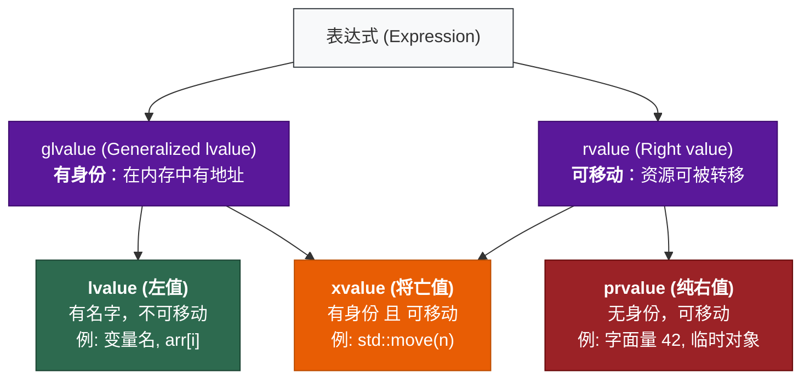
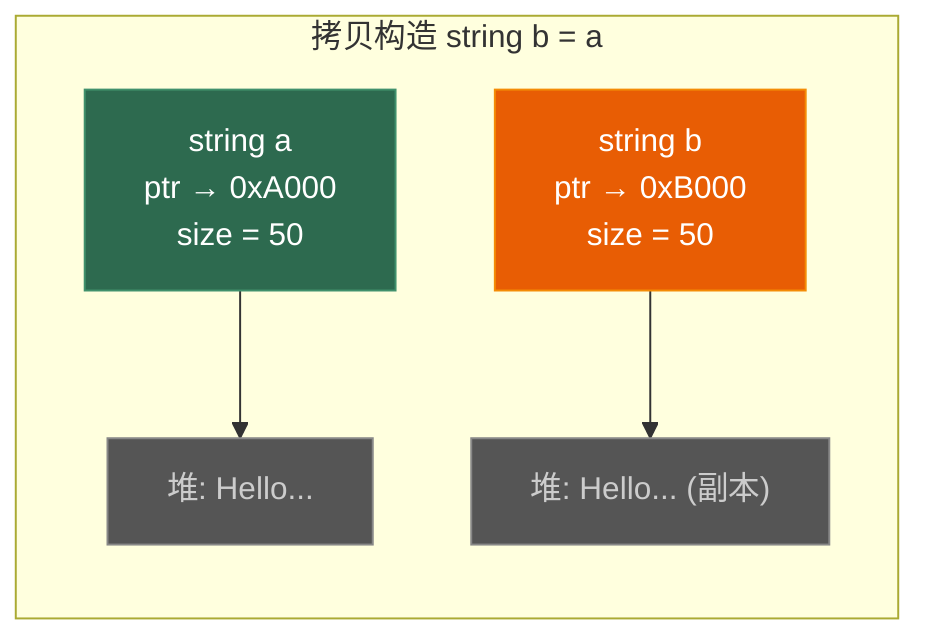
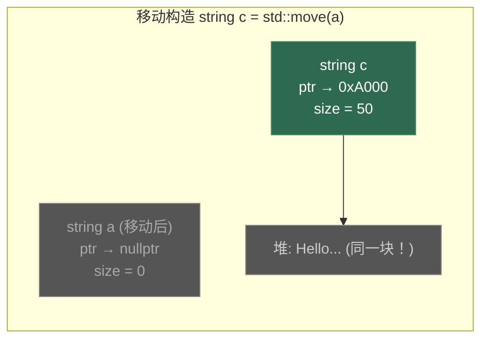
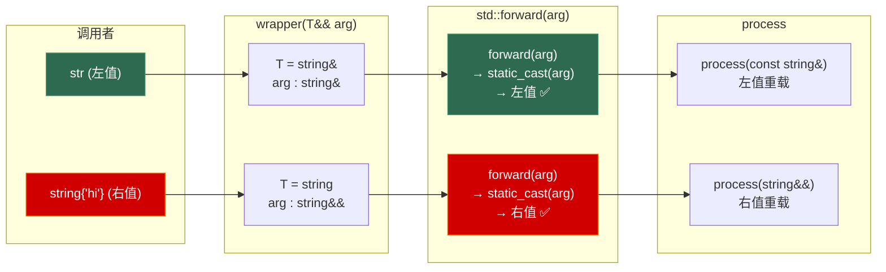

# 第四章 值类别、移动语义与完美转发

> **一句话理解**：移动语义让 C++ 从"拷贝一切"进化到"能偷就偷"——把即将销毁的对象的资源**偷过来**，而不是傻傻复制一份。

---

## 4.1 概念直觉 —— What & Why

### 拷贝 vs 移动

想象你要把一本书从一个房间搬到另一个房间：

- **拷贝** = 用复印机复印一本，原来那本还在。代价：时间 + 纸张。
- **移动** = 直接拿起来走。代价：几乎为零。但原来位置就没有了。

```cpp
std::string a = "Hello, this is a very long string that lives on the heap";

// 拷贝：深拷贝堆上的字符数据
std::string b = a;           // O(n)，分配内存 + 复制每个字符
// a 和 b 各有一份独立的数据

// 移动：把 a 的堆指针"偷"过来
std::string c = std::move(a); // O(1)，只交换内部指针
// c 拥有原来 a 的数据
// a 变成空字符串（valid but unspecified state）
```

### 为什么需要移动语义？

```cpp
std::vector<std::string> buildNames() {
    std::vector<std::string> names;
    names.push_back("Alice");
    names.push_back("Bob");
    return names;  // C++11 之前：拷贝整个 vector + 所有 string → 巨大开销
                   // C++11 之后：移动 vector（偷指针）→ O(1)
}

// 更极端的例子：游戏中的 Mesh 数据
struct Mesh {
    std::vector<float> vertices;      // 可能有百万个顶点
    std::vector<uint32_t> indices;    // 百万个索引
    std::vector<float> normals;       // 百万个法线
    // 拷贝 = 复制 3 个百万级数组 → 几十毫秒
    // 移动 = 偷 3 个指针 → 几纳秒
};
```

> 💡 **面试中的表述**：「移动语义解决的核心问题是：避免对即将销毁的临时对象做无意义的深拷贝。通过"窃取"其内部资源（指针、句柄），把 O(n) 的拷贝降为 O(1) 的指针交换。」

---

## 4.2 原理图解

### 值类别体系

C++ 中每个表达式都有一个**值类别**，决定了它能绑定到什么类型的引用：



**面试简化记忆**：

| 值类别 | 有名字？ | 可取地址？ | 可移动？ | 例子 |
|--------|---------|-----------|---------|------|
| **lvalue** | ✅ | ✅ | ❌（除非 `std::move`） | `int x; x` |
| **prvalue** | ❌ | ❌ | ✅ | `42`, `x + y`, `std::string("hi")` |
| **xvalue** | ✅ | ✅ | ✅ | `std::move(x)`, `static_cast<T&&>(x)` |

> 💡 面试中 99% 的情况只需要区分**左值**（有名字的）和**右值**（没名字的 / `std::move` 过的）。xvalue 是理论完备性需要的概念。

### 拷贝 vs 移动的内存变化





> 移动后，`a` 的内部指针被设为 `nullptr`，数据被 `c` "偷走"了。没有申请新内存，没有复制数据。

---

## 4.3 底层机制剖析

### 4.3.1 左值引用与右值引用

```cpp
int x = 42;

// 左值引用：绑定到左值
int& lref = x;          // ✅
// int& lref2 = 42;     // ❌ 不能绑定到右值

// const 左值引用：可以绑定到**任何东西**（万能？）
const int& clref = x;    // ✅ 绑定左值
const int& clref2 = 42;  // ✅ 绑定右值（延长临时对象生命周期）

// 右值引用：只绑定到右值
int&& rref = 42;          // ✅ 绑定纯右值
int&& rref2 = std::move(x); // ✅ 绑定将亡值
// int&& rref3 = x;       // ❌ 不能绑定到左值

// ⚠️ 关键：rref 本身是一个左值！（因为它有名字）
// int&& rref4 = rref;    // ❌ rref 是左值，不能绑定到 &&
int&& rref4 = std::move(rref); // ✅ 必须再 move 一次
```

> 💡 **最容易混淆的点**：右值引用变量本身是**左值**。`int&& rref = 42;` 之后，`rref` 有名字，可以取地址，所以它是左值。这就是为什么函数内部需要 `std::forward` 来保持右值语义。

---

### 4.3.2 移动构造与移动赋值 —— Rule of Five

手写一个管理堆内存的 `String` 类，实现完整的"五大特殊函数"：

```cpp
class String {
    char* _data;
    size_t _size;

public:
    // 构造
    String(const char* str = "") {
        _size = std::strlen(str);
        _data = new char[_size + 1];
        std::memcpy(_data, str, _size + 1);
    }

    // 1. 析构
    ~String() {
        delete[] _data;
    }

    // 2. 拷贝构造：深拷贝
    String(const String& other) : _size(other._size) {
        _data = new char[_size + 1];
        std::memcpy(_data, other._data, _size + 1);
        std::cout << "拷贝构造（深拷贝 " << _size << " 字节）\n";
    }

    // 3. 拷贝赋值：深拷贝 + 释放旧数据
    String& operator=(const String& other) {
        if (this != &other) {
            delete[] _data;
            _size = other._size;
            _data = new char[_size + 1];
            std::memcpy(_data, other._data, _size + 1);
        }
        std::cout << "拷贝赋值\n";
        return *this;
    }

    // 4. 移动构造：偷资源 ✅
    String(String&& other) noexcept
        : _data(other._data), _size(other._size) {
        other._data = nullptr;   // 偷完后置空，防止 other 析构时 delete
        other._size = 0;
        std::cout << "移动构造（零拷贝！）\n";
    }

    // 5. 移动赋值：释放自己的 + 偷来源的
    String& operator=(String&& other) noexcept {
        if (this != &other) {
            delete[] _data;          // 释放自己的旧数据
            _data = other._data;     // 偷
            _size = other._size;
            other._data = nullptr;   // 置空来源
            other._size = 0;
        }
        std::cout << "移动赋值（零拷贝！）\n";
        return *this;
    }

    size_t size() const { return _size; }
    const char* c_str() const { return _data ? _data : ""; }
};
```

**Rule of Five**：如果你需要自定义其中任何一个（析构、拷贝构造、拷贝赋值、移动构造、移动赋值），通常你需要自定义**全部五个**。

> 💡 在现代 C++ 中，优先使用 **Rule of Zero**：让成员变量自己管理资源（用 `std::string`、`std::vector`、`std::unique_ptr`），这样编译器自动生成的五个特殊函数就够了。

---

### 4.3.3 `noexcept` 的重要性

```cpp
// 为什么移动构造必须标记 noexcept？

std::vector<String> v;
v.push_back(String("hello"));
v.push_back(String("world"));
// vector 扩容时，需要把旧元素搬到新内存

// 如果移动构造是 noexcept：
//   vector 用 移动 搬元素 → O(1) 每个元素 ✅

// 如果移动构造没有 noexcept：
//   vector 用 拷贝 搬元素 → O(n) 每个元素 😱
//   原因：如果移动到一半抛异常，已经移走的元素回不来了（源对象已被修改）
//         而拷贝不会修改源对象，可以安全回滚

// vector 内部的决策逻辑：
// std::move_if_noexcept(element)
// = 如果移动构造是 noexcept → std::move(element)
// = 如果移动构造可能抛异常 → element（拷贝）
```

| 移动构造是否 `noexcept` | vector 扩容行为 | 性能 |
|------------------------|---------------|------|
| ✅ `noexcept` | **移动**每个元素 | O(1)/元素 |
| ❌ 非 `noexcept` | **拷贝**每个元素 | O(n)/元素 |

> 💡 **面试中的表述**：「`vector` 扩容时用 `move_if_noexcept` 决定用移动还是拷贝。如果移动构造标记了 `noexcept`，就用移动（快）；否则为了异常安全性，回退到拷贝（慢）。所以移动构造一定要加 `noexcept`。」

---

### 4.3.4 `std::move` 的真相

**`std::move` 不移动任何东西！** 它只是把左值强转为右值引用：

```cpp
// std::move 的实现（简化版）：
template <typename T>
constexpr std::remove_reference_t<T>&& move(T&& t) noexcept {
    return static_cast<std::remove_reference_t<T>&&>(t);
}

// 它做的事情 100% 等价于：
static_cast<String&&>(s);  // 把 s 的值类别从左值"标记"为右值

// 真正的移动发生在哪里？
// 在移动构造函数 / 移动赋值运算符中！
String a = "hello";
String b = std::move(a);
//          ↑ 这只是把 a 变成右值引用
//                    ↑ 这里调用了 String(String&&)，真正的资源转移在这里
```

```cpp
// ⚠️ move 后的对象处于 "valid but unspecified" 状态
String s = "hello";
String t = std::move(s);

// s 现在可以：
s.size();           // ✅ 合法（可能返回 0）
s = "new value";    // ✅ 可以重新赋值
// 但不能假设 s 的具体内容
// std::cout << s.c_str(); // ⚠️ 可能是 ""，也可能是别的

// ⚠️ 对 const 对象 move 无效！
const String cs = "hello";
String u = std::move(cs);  // 调用的是拷贝构造！不是移动构造！
// 因为 std::move(cs) 返回 const String&&
// const String&& 不能匹配 String(String&&)，但能匹配 String(const String&)
```

> 💡 **面试中的表述**：「`std::move` 本身不做任何移动，它只是一个 `static_cast<T&&>`，把左值标记为右值。真正的资源转移发生在移动构造函数中。对 const 对象 move 不会生效——会回退到拷贝。」

---

### 4.3.5 完美转发 (Perfect Forwarding)

#### 问题：如何写一个"透传"函数？

```cpp
// 你想写一个 wrapper 函数，把参数原封不动地传给另一个函数：
void process(const std::string& s) { std::cout << "lvalue: " << s << "\n"; }
void process(std::string&& s)      { std::cout << "rvalue: " << s << "\n"; }

// 错误尝试 1：值传递 → 总是拷贝
template <typename T>
void wrapper1(T arg) { process(arg); }  // arg 是左值 → 总是调 process(const T&)

// 错误尝试 2：左值引用 → 不能接受右值
template <typename T>
void wrapper2(T& arg) { process(arg); }
// wrapper2(std::string("hi")); // ❌ 编译错误

// 错误尝试 3：const 左值引用 → 丢失了右值信息
template <typename T>
void wrapper3(const T& arg) { process(arg); }  // 总是调 process(const T&)
```

#### 万能引用 (Universal Reference)

```cpp
template <typename T>
void wrapper(T&& arg) {                  // T&& 在模板推导中 = 万能引用
    process(std::forward<T>(arg));        // 完美转发
}

wrapper(str);              // str 是左值 → T = string&  → T&& = string& → 转发为左值
wrapper(std::string("hi")); // 临时对象  → T = string   → T&& = string&& → 转发为右值
```

#### 引用折叠规则

`T&&` 在模板推导中的行为取决于传入的是左值还是右值：

| 传入 | `T` 推导为 | `T&&` 折叠为 | `std::forward<T>(arg)` 返回 |
|------|-----------|-------------|----------------------------|
| **左值** `x` | `string&` | `string& &&` → `string&` | `string&`（左值） |
| **右值** `string("hi")` | `string` | `string&&` | `string&&`（右值） |

折叠规则很简单——**有一个 `&` 就变 `&`**：

```
T& &   → T&    (左值引用 + 左值引用 = 左值引用)
T& &&  → T&    (左值引用 + 右值引用 = 左值引用)
T&& &  → T&    (右值引用 + 左值引用 = 左值引用)
T&& && → T&&   (右值引用 + 右值引用 = 右值引用)  ← 唯一保持右值的情况
```

#### `std::forward` 的实现

```cpp
// std::forward 的简化实现：
template <typename T>
constexpr T&& forward(std::remove_reference_t<T>& t) noexcept {
    return static_cast<T&&>(t);
}

// 当 T = string&（传入左值时）：
// forward<string&>(t) → static_cast<string& &&>(t) → static_cast<string&>(t)
// 返回左值引用 ✅

// 当 T = string（传入右值时）：
// forward<string>(t) → static_cast<string&&>(t)
// 返回右值引用 ✅
```

#### `emplace_back` —— 完美转发的经典应用

```cpp
template <typename T>
class SimpleVector {
    T* _data;
    size_t _size, _capacity;

public:
    // push_back：拷贝或移动一个已有对象
    void push_back(const T& val) {
        if (_size == _capacity) grow();
        new (_data + _size) T(val);  // 拷贝构造
        ++_size;
    }
    void push_back(T&& val) {
        if (_size == _capacity) grow();
        new (_data + _size) T(std::move(val));  // 移动构造
        ++_size;
    }

    // emplace_back：直接在容器内原地构造（零拷贝零移动！）
    template <typename... Args>
    T& emplace_back(Args&&... args) {
        if (_size == _capacity) grow();
        // 完美转发所有参数，直接在目标位置构造
        new (_data + _size) T(std::forward<Args>(args)...);
        return _data[_size++];
    }
};

// 使用区别：
std::vector<std::pair<std::string, int>> v;

// push_back：先构造 pair，再移动到 vector 中
v.push_back(std::make_pair("Alice", 42));   // 构造 + 移动

// emplace_back：直接在 vector 内部构造 pair
v.emplace_back("Alice", 42);                // 只有一次构造 ✅
```

> 💡 **面试中的表述**：「完美转发通过万能引用 `T&&` + `std::forward<T>` 实现：左值进来就以左值方式转发，右值进来就以右值方式转发，不丢失值类别信息。`emplace_back` 就是典型应用——直接在容器内原地构造，避免了 `push_back` 的先构造后移动。」

#### `std::forward` 的完整转发路径



#### `make_unique` —— 完美转发的另一个经典应用

```cpp
// std::make_unique 的简化实现（C++14）
template <typename T, typename... Args>
std::unique_ptr<T> make_unique(Args&&... args) {
    return std::unique_ptr<T>(new T(std::forward<Args>(args)...));
    // 完美转发所有参数给 T 的构造函数
}

// 使用：
auto p1 = std::make_unique<Mesh>("Hero", verts, indices, normals);
// 如果 verts 是左值 → 拷贝传递给 Mesh 构造函数
// 如果 verts 是 std::move(verts) → 移动传递

auto p2 = std::make_unique<Mesh>("Hero",
    std::move(verts), std::move(indices), std::move(normals));
// 三个 vector 都以右值方式转发 → Mesh 内部全移动 ✅
```

> 💡 `make_unique`、`emplace_back`、`make_shared` 内部都是**完美转发 + placement new** 的组合——这是理解 Ch1 placement new 和 Ch2 智能指针的交汇点。

---

### 4.3.6 RVO / NRVO —— 编译器的拷贝省略

#### RVO (Return Value Optimization)

```cpp
std::string createString() {
    return std::string("hello");  // 返回纯右值 (prvalue)
}

std::string s = createString();
// 你可能以为这里有：
// 1. 在 createString 内部构造一个临时 string
// 2. 移动/拷贝到 s
// 实际上：编译器直接在 s 的位置构造 string（跳过移动/拷贝） ✅
// C++17 起，这是强制的（guaranteed copy elision）
```

#### NRVO (Named RVO)

```cpp
std::string createString2() {
    std::string result = "hello";
    result += " world";
    return result;  // 返回有名字的局部变量
}

std::string s2 = createString2();
// NRVO：编译器尝试直接在 s2 的位置构造 result
// C++17 不强制 NRVO（可选优化），但几乎所有编译器都会做
```

#### NRVO 失效的场景

```cpp
// 情况 1：条件返回不同变量
std::string func1(bool flag) {
    std::string a = "hello";
    std::string b = "world";
    if (flag) return a;
    else return b;      // ❌ NRVO 可能失效（编译器不知道该优化哪个）
}                       // 但仍然会自动 move（C++11 起）

// 情况 2：return std::move(local)
std::string func2() {
    std::string result = "hello";
    return std::move(result);  // ❌ 反而阻止了 NRVO！
    // return result;           // ✅ 编译器自动做 NRVO 或 implicit move
}

// 情况 3：返回参数
std::string func3(std::string s) {
    return s;  // 不触发 NRVO（s 是参数不是局部变量），但 C++11 会 implicit move
}
```

| 场景 | 是否触发 RVO/NRVO | 注意事项 |
|------|-------------------|---------|
| `return std::string("hi")` | ✅ RVO（C++17 强制） | 最优 |
| `return local_variable` | ✅ NRVO（通常成功） | 不要 `return std::move(x)` |
| `return 条件变量` | ❌ NRVO 可能失效 | 自动退化为 implicit move |
| `return std::move(local)` | ❌ **阻止** NRVO | 画蛇添足！ |
| `return 参数` | ❌ 不触发 NRVO | C++11 自动 implicit move |

> 💡 **面试中的表述**：「RVO 是编译器直接在调用者的栈帧上构造返回值，跳过拷贝和移动。C++17 对纯右值的 RVO 是强制的。NRVO 对有名字的局部变量是可选优化但几乎总是生效。关键注意：`return std::move(local_var)` 反而会阻止 NRVO——永远不要在 return 语句上加 `std::move`。」

---

## 4.4 经典陷阱与面试题

### 4.4.1 "这段代码移动了吗？"

```cpp
// === 题目 1 ===
std::string s = "hello";
std::string t = std::move(s);
// 答：✅ 移动了。s 变成 valid but unspecified 状态。

// === 题目 2 ===
const std::string cs = "hello";
std::string t2 = std::move(cs);
// 答：❌ 没移动！std::move(cs) 返回 const string&&
// 不匹配 string(string&&)，匹配 string(const string&) → 拷贝

// === 题目 3 ===
std::string foo() {
    std::string s = "hello";
    return s;  // 这里是移动还是拷贝？
}
// 答：都不是。NRVO 直接省略了拷贝/移动。
// 如果 NRVO 失效，则 implicit move（C++11）。

// === 题目 4 ===
void bar(std::string&& s) {
    std::string local = s;  // 这里是移动还是拷贝？
}
// 答：拷贝！s 虽然类型是 string&&，但它有名字，是左值！
// 要移动需要：std::string local = std::move(s);

// === 题目 5 ===
template <typename T>
void baz(T&& arg) {
    process(arg);                    // 总是调用 process(T&)，因为 arg 是左值
    process(std::forward<T>(arg));   // 正确转发：左值→左值，右值→右值
    process(std::move(arg));         // 总是调用 process(T&&)，强制右值
}
```

### 4.4.2 面试辨析

**Q1：`std::move` 和 `std::forward` 的区别？**

> `std::move` 无条件地把参数转为右值引用——它总是"允许移动"。`std::forward` 有条件地转发——如果原来是左值就保持左值，原来是右值就保持右值。`move` 用于你确定要移动的场景，`forward` 用于泛型代码中的参数转发。

**Q2：移动后的对象还能用吗？**

> 标准保证移动后的对象处于 "valid but unspecified" 状态——你可以析构它、赋新值，但不能依赖它的具体内容。标准库类型（如 string、vector）保证移动后是空的，但自定义类型没有这个保证。

**Q3：`const T&&` 有什么用？**

> 几乎没用。`const T&&` 可以绑定到右值，但你不能修改它（因为 const），所以也不能"偷"它的资源。实际代码中极少见。面试中的答案是："const 右值引用实际上禁止了移动语义，因为移动需要修改源对象。"

**Q4：什么是隐式移动（Implicit Move）？**

> C++11 起，当 return 语句返回一个即将离开作用域的局部变量时，即使写 `return x;`（看起来像拷贝），编译器也会先尝试移动。这就是为什么不需要写 `return std::move(x);`。

---

## 4.5 🎮 游戏实战场景

### 4.5.1 大资源的移动 —— Mesh/Texture 数据

```cpp
class Mesh {
    std::vector<float> _vertices;
    std::vector<uint32_t> _indices;
    std::vector<float> _normals;
    std::string _name;

public:
    Mesh(std::string name, std::vector<float> verts,
         std::vector<uint32_t> indices, std::vector<float> normals)
        : _name(std::move(name)),           // 移动
          _vertices(std::move(verts)),       // 移动
          _indices(std::move(indices)),      // 移动
          _normals(std::move(normals)) {}    // 移动
    // 参数按值传递 → 调用者可以选择拷贝或移动
    // 函数内部总是移动（从参数偷）

    // 移动构造：自动生成（Rule of Zero）
    // 因为所有成员都可移动
};

// 使用：
std::vector<float> verts(1000000);   // 百万顶点
std::vector<uint32_t> indices(500000);
std::vector<float> normals(1000000);

// 方式 1：移动进去（零拷贝）
Mesh m1("Hero", std::move(verts), std::move(indices), std::move(normals));
// verts, indices, normals 现在是空的

// 方式 2：直接构造（RVO）
auto m2 = LoadMeshFromFile("hero.obj");
// LoadMeshFromFile 内部构造 Mesh → RVO 直接在 m2 位置构造，零拷贝零移动
```

### 4.5.2 资源加载的返回值优化

```cpp
class Texture {
    std::vector<uint8_t> _pixels;
    int _width, _height;

public:
    Texture(int w, int h, std::vector<uint8_t> pixels)
        : _width(w), _height(h), _pixels(std::move(pixels)) {}
};

// 返回大对象——RVO 保证零开销
Texture LoadTexture(const std::string& path) {
    int w, h;
    auto pixels = ReadFileBytes(path);  // 可能几 MB
    // ... 解码 ...
    return Texture(w, h, std::move(pixels));  // RVO：直接在调用者位置构造
}

auto tex = LoadTexture("hero.png");  // 无拷贝、无移动，直接构造 ✅
```

### 4.5.3 `emplace_back` 构造游戏对象

```cpp
struct Particle {
    float x, y, z;
    float vx, vy, vz;
    float lifetime;

    Particle(float px, float py, float pz,
             float pvx, float pvy, float pvz, float lt)
        : x(px), y(py), z(pz), vx(pvx), vy(pvy), vz(pvz), lifetime(lt) {}
};

std::vector<Particle> particles;
particles.reserve(10000);  // 预分配避免扩容

// ❌ push_back：先构造临时 Particle，再移动到 vector 中
particles.push_back(Particle(1.0f, 2.0f, 3.0f, 0.1f, 0.2f, 0.f, 5.0f));

// ✅ emplace_back：直接在 vector 内部原地构造（完美转发参数）
particles.emplace_back(1.0f, 2.0f, 3.0f, 0.1f, 0.2f, 0.f, 5.0f);
// 省掉了一次构造 + 一次移动
```

### 4.5.4 swap idiom —— 移动语义的最佳搭档

```cpp
// C++11 之前的 swap：3 次拷贝
template <typename T>
void old_swap(T& a, T& b) {
    T tmp = a;       // 拷贝
    a = b;           // 拷贝
    b = tmp;         // 拷贝
}

// C++11 之后的 swap：3 次移动
template <typename T>
void new_swap(T& a, T& b) noexcept(noexcept(T(std::move(a)))) {
    T tmp = std::move(a);  // 移动
    a = std::move(b);      // 移动
    b = std::move(tmp);    // 移动
}

// 对于 Mesh 这样的大对象：
// 旧 swap：复制 3 次百万级数组 → 几十 ms
// 新 swap：交换 3 次指针 → 几 ns
```

---

## 4.6 30 秒速答

**Q：什么是右值引用？**

> 右值引用（`T&&`）是 C++11 引入的，专门绑定到**右值**（临时对象或 `std::move` 标记的对象）。它的核心用途是实现移动语义——允许我们"窃取"即将销毁的对象的资源，把 O(n) 拷贝变成 O(1) 指针交换。

**Q：`std::move` 做了什么？**

> `std::move` 不做任何移动。它只是一个 `static_cast<T&&>`，把左值无条件标记为右值引用。真正的移动发生在移动构造函数或移动赋值运算符中。对 const 对象 move 不会生效，会回退到拷贝。

**Q：移动语义解决什么问题？**

> 避免对临时对象的无意义深拷贝。传统上返回一个大对象或传入一个临时对象都涉及深拷贝，移动语义通过"偷走"内部资源（指针交换）把开销从 O(n) 降到 O(1)。游戏中加载的大资源（Mesh、Texture）尤其受益。

**Q：什么是完美转发？**

> 完美转发通过万能引用 `T&&` 加 `std::forward<T>` 实现参数的"透传"——左值进来就以左值转发，右值进来就以右值转发，不丢失值类别。典型应用是 `emplace_back`，直接把构造参数原地转发到容器内，避免先构造再移动。

**Q：为什么不要 `return std::move(local)`？**

> 因为这会阻止编译器做 NRVO（直接在调用者位置构造，零拷贝零移动）。直接写 `return local;`，编译器会先尝试 NRVO，失败了再自动 implicit move。加 `std::move` 是画蛇添足。

---

> 📖 上一章：[第三章 面向对象深入：虚函数、多态与继承](../03_oop_and_polymorphism) —— 虚函数表、多继承内存布局、四种 cast 与游戏实体体系设计。

> 📖 下一章：[第五章 模板与泛型编程](../05_templates) —— 函数/类模板、SFINAE、变参模板与游戏引擎中的类型安全 Handle 系统。
