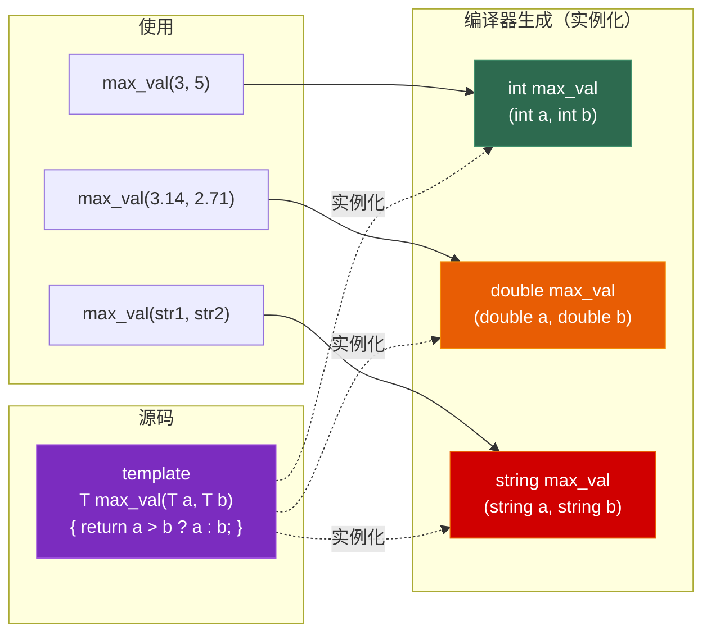
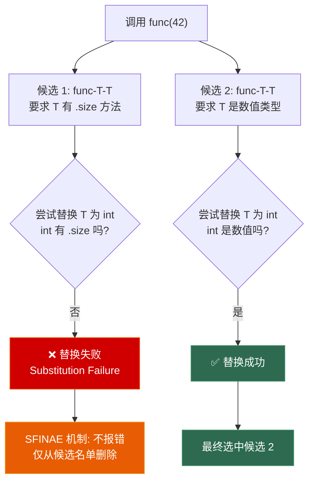

# 第五章 模板与泛型编程

> **一句话理解**：模板是 C++ 的**编译期代码生成器**——你写一份通用代码，编译器根据实际使用的类型帮你"复印"出多份具体代码。

---

## 5.1 概念直觉 —— What & Why

### 模板是什么？

模板让你写出**与类型无关的通用代码**。编译器在编译时根据你使用的具体类型"实例化"出真正的代码：

```cpp
// 没有模板：每种类型都要写一遍
int max_int(int a, int b) { return a > b ? a : b; }
float max_float(float a, float b) { return a > b ? a : b; }
double max_double(double a, double b) { return a > b ? a : b; }

// 有模板：写一份，编译器帮你生成
template <typename T>
T max_val(T a, T b) { return a > b ? a : b; }

max_val(3, 5);        // 编译器生成 max_val<int>
max_val(3.14, 2.71);  // 编译器生成 max_val<double>
// 两份独立的函数代码，各自做类型检查和优化
```

### 编译期多态 vs 运行期多态

| 维度 | 模板（编译期多态） | 虚函数（运行期多态） |
|------|-------------------|---------------------|
| **决定时机** | 编译期 | 运行期 |
| **性能** | **零开销**（可内联） | 间接调用（无法内联） |
| **类型** | 编译期必须已知 | 可处理运行时未知类型 |
| **代码膨胀** | 每种类型生成一份代码 | 共享一份代码 |
| **错误信息** | 冗长难读（C++20 前） | 清晰 |
| **典型场景** | STL 容器/算法 | 游戏实体体系 |

> 💡 **面试中的表述**：「模板是编译期多态，通过代码生成实现，零运行时开销但有代码膨胀风险。虚函数是运行期多态，通过 vtable 间接调用实现，灵活但有性能开销。两者互补——STL 用模板，游戏实体体系用虚函数。」

---

## 5.2 原理图解

### 模板实例化流程



### SFINAE 决策流程



---

## 5.3 底层机制剖析

### 5.3.1 函数模板

#### 模板参数推导

```cpp
template <typename T>
T add(T a, T b) { return a + b; }

add(3, 5);          // T = int（自动推导）
add(3.0, 5.0);      // T = double
// add(3, 5.0);     // ❌ 编译错误！T 不能同时是 int 和 double
add<double>(3, 5.0); // ✅ 显式指定 T = double

// 推导规则：
template <typename T>
void func(T param);       // 按值传递：去掉 const、引用
// func(const int& x) → T = int（去掉 const 和 &）

template <typename T>
void func2(T& param);     // 按引用传递：保留 const
// func2(const int& x) → T = const int

template <typename T>
void func3(T&& param);    // 万能引用：完美转发（见 Ch4）
// func3(x) → T = int&（左值）
// func3(42) → T = int（右值）
```

#### 全特化

```cpp
// 通用版本
template <typename T>
bool equal(T a, T b) { return a == b; }

// 全特化：为 const char* 提供特殊实现
template <>
bool equal<const char*>(const char* a, const char* b) {
    return std::strcmp(a, b) == 0;  // 比较内容而不是指针
}

equal(3, 3);               // 调用通用版本
equal("hello", "hello");   // 调用特化版本
```

> ⚠️ **函数模板不能偏特化**，只能全特化。如果需要偏特化效果，用函数重载或 `if constexpr`。

---

### 5.3.2 类模板

```cpp
// 通用的固定大小数组
template <typename T, size_t N>
class Array {
    T _data[N];

public:
    T& operator[](size_t i) { return _data[i]; }
    const T& operator[](size_t i) const { return _data[i]; }
    constexpr size_t size() const { return N; }

    T* begin() { return _data; }
    T* end()   { return _data + N; }
};

Array<int, 10> arr;    // T=int, N=10
Array<float, 3> vec;   // T=float, N=3
```

#### 类模板的偏特化

```cpp
// 通用版本
template <typename T>
class Storage {
    T _value;
public:
    Storage(T v) : _value(std::move(v)) {}
    void print() { std::cout << _value << "\n"; }
};

// 偏特化：指针类型
template <typename T>
class Storage<T*> {
    T* _ptr;
public:
    Storage(T* p) : _ptr(p) {}
    void print() {
        if (_ptr) std::cout << *_ptr << "\n";
        else std::cout << "nullptr\n";
    }
};

// 全特化：bool 类型（用位压缩）
template <>
class Storage<bool> {
    uint8_t _bits = 0;
public:
    Storage(bool v) : _bits(v ? 1 : 0) {}
    void print() { std::cout << (_bits ? "true" : "false") << "\n"; }
};

int x = 42;
Storage<int> s1(42);     // 通用版本
Storage<int*> s2(&x);    // 偏特化版本
Storage<bool> s3(true);  // 全特化版本
```

#### CTAD (C++17 类模板参数推导)

```cpp
// C++17 之前：必须显式指定模板参数
std::pair<int, double> p1(42, 3.14);
std::vector<int> v1 = {1, 2, 3};

// C++17：自动推导
std::pair p2(42, 3.14);      // pair<int, double>
std::vector v2 = {1, 2, 3};  // vector<int>

// 自定义推导指引 (Deduction Guide)
template <typename T>
class Wrapper {
    T _value;
public:
    Wrapper(T v) : _value(std::move(v)) {}
};
// Wrapper w("hello");  // T = const char*？还是 string？
// 推导指引：
Wrapper(const char*) -> Wrapper<std::string>;
// 现在 Wrapper w("hello"); → Wrapper<string>
```

---

### 5.3.3 变参模板 (Variadic Templates)

```cpp
// 参数包：接受任意数量、任意类型的参数
template <typename... Args>
void log(Args&&... args) {
    // sizeof...(args) = 参数个数
    std::cout << "Args count: " << sizeof...(args) << "\n";
}

log(1, "hello", 3.14);  // Args = int, const char*, double
log();                    // Args = (空)
```

#### C++17 折叠表达式

```cpp
// 递归展开（C++11 方式，繁琐）
void print() {}  // 终止条件

template <typename T, typename... Rest>
void print(T&& first, Rest&&... rest) {
    std::cout << std::forward<T>(first) << " ";
    print(std::forward<Rest>(rest)...);  // 递归
}

// 折叠表达式（C++17，简洁！）
template <typename... Args>
void print17(Args&&... args) {
    ((std::cout << std::forward<Args>(args) << " "), ...);
    // 一行搞定！展开为：
    // (cout << arg1 << " "), (cout << arg2 << " "), ...
    std::cout << "\n";
}

print17(1, "hello", 3.14);   // 输出: 1 hello 3.14

// 折叠表达式的四种形式：
// (args + ...)       // 右折叠: arg1 + (arg2 + (arg3 + ...))
// (... + args)       // 左折叠: ((arg1 + arg2) + arg3) + ...
// (args + ... + init) // 带初始值的右折叠
// (init + ... + args) // 带初始值的左折叠

// 实用：求和
template <typename... Args>
auto sum(Args... args) {
    return (args + ...);
}
sum(1, 2, 3, 4);  // 10

// 实用：全部满足条件
template <typename... Args>
bool all_positive(Args... args) {
    return ((args > 0) && ...);
}
all_positive(1, 2, 3);    // true
all_positive(1, -2, 3);   // false
```

---

### 5.3.4 SFINAE 与条件编译

#### SFINAE 的本质

**S**ubstitution **F**ailure **I**s **N**ot **A**n **E**rror：模板参数替换失败时，编译器不报错，只是丢弃这个候选。

```cpp
// 只对有 .size() 方法的类型生效
template <typename T>
auto getSize(const T& container) -> decltype(container.size()) {
    return container.size();
}

// 对没有 .size() 的类型提供后备
template <typename T>
size_t getSize(const T& val) {
    return sizeof(val);
}

std::vector<int> v = {1, 2, 3};
getSize(v);     // 调用第一个（vector 有 .size()）
getSize(42);    // 调用第二个（int 没有 .size() → 第一个 SFINAE 排除）
```

#### `std::enable_if`

```cpp
// 只对整数类型启用
template <typename T>
std::enable_if_t<std::is_integral_v<T>, T>
safe_divide(T a, T b) {
    if (b == 0) throw std::runtime_error("Division by zero!");
    return a / b;
}

// 只对浮点类型启用
template <typename T>
std::enable_if_t<std::is_floating_point_v<T>, T>
safe_divide(T a, T b) {
    if (std::abs(b) < 1e-10) throw std::runtime_error("Division by near-zero!");
    return a / b;
}

safe_divide(10, 3);      // 整数版本
safe_divide(10.0, 3.0);  // 浮点版本
```

#### C++17 `if constexpr` —— 编译期分支

```cpp
// if constexpr 在编译期决定走哪个分支，另一个分支不编译
template <typename T>
auto serialize(const T& val) {
    if constexpr (std::is_arithmetic_v<T>) {
        // 数值类型：直接转字符串
        return std::to_string(val);
    } else if constexpr (std::is_same_v<T, std::string>) {
        // 字符串：加引号
        return "\"" + val + "\"";
    } else {
        // 其他类型：调用 .toString()
        return val.toString();
    }
}

serialize(42);              // "42"
serialize(std::string("hi")); // "\"hi\""
```

> 💡 **面试中的表述**：「`if constexpr` 是 C++17 引入的编译期分支，在编译时就决定走哪个分支，被丢弃的分支不会实例化。它大幅简化了之前需要 SFINAE 或 tag dispatch 实现的条件编译，代码更直观可读。」

#### C++20 Concepts

```cpp
// Concepts 让模板约束变得清晰可读
template <typename T>
concept Arithmetic = std::is_arithmetic_v<T>;

template <typename T>
concept HasSize = requires(T t) {
    { t.size() } -> std::convertible_to<size_t>;
};

// 使用 concept 约束模板
template <Arithmetic T>
T safe_add(T a, T b) { return a + b; }

template <HasSize T>
size_t getLength(const T& container) { return container.size(); }

// 或者用 requires 子句
template <typename T>
    requires std::integral<T>
T gcd(T a, T b) {
    while (b != 0) { T t = b; b = a % b; a = t; }
    return a;
}

// 错误信息变清晰了：
// safe_add("hello", "world");
// error: "hello" does not satisfy Arithmetic  ← 而不是一堆 SFINAE 模板错误
```

---

### 5.3.5 类型萃取 (Type Traits)

```cpp
#include <type_traits>

// 编译期查询类型属性
static_assert(std::is_integral_v<int>);           // true
static_assert(std::is_floating_point_v<double>);   // true
static_assert(std::is_pointer_v<int*>);            // true
static_assert(std::is_same_v<int, int32_t>);       // true（通常）

// 编译期类型变换
using T1 = std::remove_const_t<const int>;         // int
using T2 = std::remove_reference_t<int&>;          // int
using T3 = std::add_pointer_t<int>;                // int*
using T4 = std::decay_t<const int&>;               // int（去引用 + 去const）

// 条件类型选择
using T5 = std::conditional_t<sizeof(int) == 4,
    int32_t, int64_t>;  // 根据 int 大小选择类型

// 实际应用：安全的数值转换
template <typename To, typename From>
To safe_cast(From value) {
    static_assert(std::is_arithmetic_v<From> && std::is_arithmetic_v<To>,
                  "safe_cast only works with arithmetic types");

    if constexpr (std::is_same_v<To, From>) {
        return value;  // 同类型，直接返回
    } else {
        // 检查范围
        if (value > static_cast<From>(std::numeric_limits<To>::max()) ||
            value < static_cast<From>(std::numeric_limits<To>::lowest())) {
            throw std::overflow_error("Value out of range");
        }
        return static_cast<To>(value);
    }
}
```

---

### 5.3.6 模板的编译模型 —— 为什么不能分离编译？

```cpp
// === math.h ===
template <typename T>
T add(T a, T b);    // 声明

// === math.cpp ===
template <typename T>
T add(T a, T b) { return a + b; }   // 定义

// === main.cpp ===
#include "math.h"
add(3, 5);  // ❌ 链接错误！undefined reference to add<int>
```

**原因**：

```
编译 main.cpp 时：
  看到 add<int> 的调用 → 需要实例化 add<int>
  但只有声明（math.h），没有定义 → 无法实例化
  生成一个未解析符号：add<int>

编译 math.cpp 时：
  有模板定义，但没有人用 add<int> → 不实例化任何东西

链接时：
  main.o 需要 add<int>，但 math.o 里没有 → ❌ undefined reference
```

**解决方案**：

```cpp
// 方案 1（推荐）：模板定义放在头文件中
// math.h
template <typename T>
T add(T a, T b) { return a + b; }   // 声明 + 定义都在头文件

// 方案 2：显式实例化（适用于已知类型集合）
// math.cpp
template <typename T>
T add(T a, T b) { return a + b; }
template int add<int>(int, int);       // 显式实例化 int 版本
template double add<double>(double, double); // 显式实例化 double 版本
```

> 💡 **面试中的表述**：「模板不能分离声明和定义到不同文件，因为模板实例化需要看到完整定义。编译器在使用处实例化，如果定义不可见就无法生成代码。解决方案是把定义写在头文件中，或者在定义所在的 cpp 中显式实例化所有需要的类型。」

---

## 5.4 经典陷阱与面试题

### 5.4.1 代码陷阱

```cpp
// === 陷阱 1：dependent name 需要 typename ===
template <typename T>
void foo() {
    // T::value_type 可能是类型也可能是静态成员
    // typename T::value_type x;   // ✅ 告诉编译器这是类型
    // T::value_type x;            // ❌ 编译器默认当作值，报错
}

// === 陷阱 2：模板方法的两阶段查找 ===
template <typename T>
class Base {
public:
    void base_func() {}
};

template <typename T>
class Derived : public Base<T> {
public:
    void derived_func() {
        // base_func();             // ❌ 可能找不到！因为 Base<T> 是依赖类型
        this->base_func();          // ✅ 用 this-> 明确
        Base<T>::base_func();       // ✅ 或显式指定
    }
};

// === 陷阱 3：auto 推导类型陷阱 ===
auto x1 = 42;          // int
auto x2 = {42};         // std::initializer_list<int>！不是 int！
auto x3{42};            // C++17 起是 int（C++11/14 是 initializer_list<int>）

// === 陷阱 4：decltype vs auto ===
int x = 42;
int& ref = x;
auto a = ref;            // int（auto 去掉引用）
decltype(ref) b = x;     // int&（decltype 保留引用）
decltype(auto) c = ref;  // int&（decltype(auto) = decltype(expr)）
```

### 5.4.2 面试辨析

**Q1：`typename` 和 `class` 在模板参数中有区别吗？**

> 在 `template <typename T>` 和 `template <class T>` 中，完全没有区别。但在依赖类型中（`typename T::value_type`），只能用 `typename`，不能用 `class`。

**Q2：函数模板和函数重载怎么选？**

> 如果只有少量类型且行为不同，用重载。如果是通用算法适用于所有类型，用模板。模板还可以配合 `if constexpr` 或 SFINAE 做条件化。

**Q3：什么是模板的 ODR?**

> 模板在每个翻译单元都可以有定义（因为必须在头文件中），但所有定义必须完全相同。违反 ODR 是未定义行为。

---

## 5.5 🎮 游戏实战场景

### 5.5.1 类型安全的 Handle 系统

```cpp
// 游戏引擎中很多资源用 ID (uint32_t) 引用
// 问题：TextureID 和 MeshID 都是 uint32_t，容易混用

// 模板方案：编译期区分不同类型的 Handle
template <typename Tag>
class Handle {
    uint32_t _id;

public:
    explicit Handle(uint32_t id = 0) : _id(id) {}
    uint32_t id() const { return _id; }
    bool valid() const { return _id != 0; }

    bool operator==(Handle other) const { return _id == other._id; }
    bool operator!=(Handle other) const { return _id != other._id; }

    // 支持作为 unordered_map 的 key
    struct Hash {
        size_t operator()(Handle h) const { return std::hash<uint32_t>{}(h._id); }
    };
};

// 用空 struct 做 Tag，零开销
struct TextureTag {};
struct MeshTag {};
struct ShaderTag {};

using TextureHandle = Handle<TextureTag>;
using MeshHandle    = Handle<MeshTag>;
using ShaderHandle  = Handle<ShaderTag>;

// 使用：
TextureHandle tex(1);
MeshHandle mesh(2);

// tex == mesh;            // ❌ 编译错误！类型不同
// loadMesh(tex);          // ❌ 编译错误！类型不匹配
loadMesh(mesh);            // ✅ 类型正确

// 零运行时开销：sizeof(TextureHandle) == sizeof(uint32_t) == 4
```

### 5.5.2 泛型对象池

```cpp
// 类型安全的对象池（结合 Ch1 的 Pool Allocator）
template <typename T, size_t PoolSize = 1024>
class ObjectPool {
    union Slot {
        T object;
        Slot* next;
        Slot() {}   // union 默认构造
        ~Slot() {}
    };

    std::array<Slot, PoolSize> _pool;
    Slot* _free_list = nullptr;

public:
    ObjectPool() {
        for (size_t i = 0; i < PoolSize - 1; ++i)
            _pool[i].next = &_pool[i + 1];
        _pool[PoolSize - 1].next = nullptr;
        _free_list = &_pool[0];
    }

    template <typename... Args>
    T* create(Args&&... args) {
        if (!_free_list) return nullptr;
        Slot* slot = _free_list;
        _free_list = _free_list->next;
        // 完美转发 + placement new（交汇 Ch1 和 Ch4）
        return new (&slot->object) T(std::forward<Args>(args)...);
    }

    void destroy(T* obj) {
        obj->~T();
        Slot* slot = reinterpret_cast<Slot*>(obj);
        slot->next = _free_list;
        _free_list = slot;
    }
};

// 使用：
struct Bullet {
    float x, y, speed;
    Bullet(float px, float py, float s) : x(px), y(py), speed(s) {}
};

ObjectPool<Bullet, 4096> bullet_pool;
Bullet* b = bullet_pool.create(0.f, 0.f, 100.f);  // 原地构造
// ... 使用 ...
bullet_pool.destroy(b);  // 手动析构 + 回收
```

### 5.5.3 ECS 中的变参模板组件注册

```cpp
// 用变参模板实现灵活的组件添加
class Entity {
    uint32_t _id;
    std::unordered_map<size_t, std::any> _components;

public:
    Entity(uint32_t id) : _id(id) {}

    // 添加单个组件
    template <typename T, typename... Args>
    T& addComponent(Args&&... args) {
        auto typeId = typeid(T).hash_code();
        _components[typeId] = T(std::forward<Args>(args)...);
        return std::any_cast<T&>(_components[typeId]);
    }

    // 获取组件
    template <typename T>
    T* getComponent() {
        auto it = _components.find(typeid(T).hash_code());
        if (it == _components.end()) return nullptr;
        return std::any_cast<T>(&it->second);
    }

    // 检查是否有某些组件（变参模板）
    template <typename... Components>
    bool hasComponents() const {
        return ((_components.count(typeid(Components).hash_code()) > 0) && ...);
        // C++17 折叠表达式：所有组件都存在才返回 true
    }
};

// 使用：
Entity player(1);
player.addComponent<Position>(0.f, 0.f, 0.f);
player.addComponent<Velocity>(1.f, 0.f, 0.f);
player.addComponent<Health>(100.f, 100.f);

if (player.hasComponents<Position, Velocity>()) {
    auto* pos = player.getComponent<Position>();
    auto* vel = player.getComponent<Velocity>();
    // 移动系统
}
```

### 5.5.4 类型安全的序列化

```cpp
// 用 type_traits 实现自动序列化
template <typename T>
void serialize(std::ostream& os, const T& value) {
    if constexpr (std::is_arithmetic_v<T>) {
        // 数值类型：直接写入二进制
        os.write(reinterpret_cast<const char*>(&value), sizeof(T));
    } else if constexpr (std::is_same_v<T, std::string>) {
        // 字符串：先写长度，再写内容
        uint32_t len = static_cast<uint32_t>(value.size());
        os.write(reinterpret_cast<const char*>(&len), sizeof(len));
        os.write(value.data(), len);
    } else if constexpr (requires { value.serialize(os); }) {
        // 有 serialize 方法的类型：调用自己的序列化
        value.serialize(os);
    } else {
        static_assert(false, "Type is not serializable");
    }
}

// 变参模板：批量序列化
template <typename... Args>
void serializeAll(std::ostream& os, const Args&... args) {
    (serialize(os, args), ...);  // 折叠表达式
}

// 使用：
std::ofstream file("save.dat", std::ios::binary);
serializeAll(file, player.hp, player.x, player.y, player.name);
```

---

## 5.6 30 秒速答

**Q：模板是在编译期还是运行期？**

> 编译期。模板在编译时根据使用的具体类型实例化出真正的代码。这意味着零运行时开销（可以内联），但可能导致代码膨胀——每种类型生成一份独立的代码。

**Q：什么是 SFINAE？**

> Substitution Failure Is Not An Error。模板参数替换失败时不报错，只是把这个候选从重载集中排除。C++11 用 `enable_if` 实现条件约束，C++17 用 `if constexpr` 简化，C++20 用 Concepts 彻底取代。

**Q：模板的声明和定义为什么不能分离？**

> 因为模板实例化需要看到完整定义。编译器在使用处实例化，如果定义在另一个 cpp 文件中不可见，就无法生成代码。所以模板定义通常放在头文件中。

**Q：`auto` 和 `decltype` 的区别？**

> `auto` 按值推导（去掉引用和 const），像模板参数推导一样。`decltype` 保留表达式的完整类型（包括引用和 const）。`decltype(auto)` 结合两者，按 `decltype` 规则推导。

---

> 📖 上一章：[第四章 值类别、移动语义与完美转发](../04_move_semantics) —— 左值右值、std::move 的真相、RVO 与游戏大资源的零拷贝传递。

> 📖 下一章：[第六章 编译、链接与构建](../06_compilation_and_linking) —— 从 .cpp 到可执行文件的四步旅程，静态库与动态库，游戏引擎的模块化构建。
