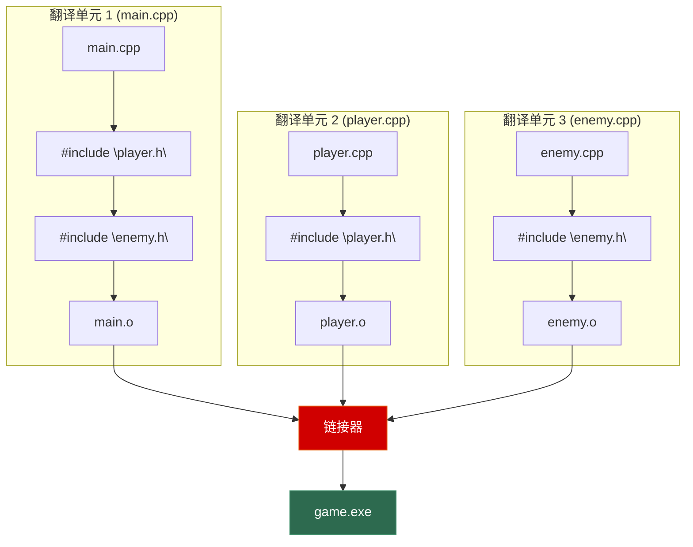
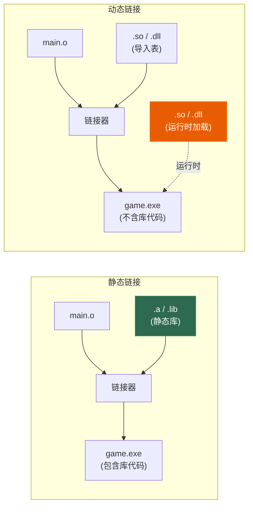

# 第六章 编译、链接与构建

> **一句话理解**：从 `.cpp` 到可执行文件经历**四步旅程**——预处理、编译、汇编、链接。理解每一步做了什么，你就能秒杀所有"这个错误在哪个阶段产生"的面试题。

---

## 6.1 概念直觉 —— What & Why

### 从源码到可执行文件

```
   .cpp / .h           .i              .s             .o / .obj         可执行文件
   ─────────→  预处理  ─────→  编译  ─────→  汇编  ─────→  链接  ─────→  a.out / .exe
   (源码)      (展开宏  (生成    (生成    (合并所有
                #include) 汇编代码) 机器码)   .o + 库)
```

### 为什么需要理解这个过程？

- **面试高频**："这个错误是编译期还是链接期？"
- **排错必备**：`undefined reference` vs `undeclared identifier` 完全不同
- **性能优化**：理解翻译单元才能做 PCH、Unity Build
- **架构设计**：动态库热加载、插件系统

---

## 6.2 原理图解

### 编译四阶段流水线


### 多文件编译的翻译单元



```
关键概念：
• 每个 .cpp 文件 = 一个翻译单元（Translation Unit）
• 每个翻译单元独立编译，互不知道对方的存在
• 头文件通过 #include 被"复制粘贴"到每个翻译单元中
• 链接器负责把所有 .o 文件的符号拼接到一起
```

### 静态链接 vs 动态链接



---

## 6.3 底层机制剖析

### 6.3.1 预处理阶段

预处理器做的是**纯文本替换**，不理解 C++ 语法。

```cpp
// === #include ===
// #include "file.h"  → 把 file.h 的内容原封不动地粘贴到这里
// #include <file.h>  → 从系统目录搜索

// === 头文件保护 ===
// 方式 1：传统 include guard
#ifndef PLAYER_H
#define PLAYER_H
class Player { ... };
#endif

// 方式 2：#pragma once（推荐，简洁，主流编译器都支持）
#pragma once
class Player { ... };

// === 宏定义 ===
#define PI 3.14159
#define MAX(a, b) ((a) > (b) ? (a) : (b))
// ⚠️ 宏的陷阱：
int x = MAX(i++, j++);
// 展开为：((i++) > (j++) ? (i++) : (j++))
// i 或 j 会被自增两次！

// ✅ 现代替代方案：
constexpr double PI = 3.14159;
template <typename T>
constexpr T max_val(T a, T b) { return a > b ? a : b; }

// === 条件编译 ===
#ifdef _WIN32
    #include <windows.h>
#elif __linux__
    #include <unistd.h>
#elif __APPLE__
    #include <mach/mach.h>
#endif

// 游戏引擎中常见：
#ifdef DEBUG
    #define LOG(msg) std::cout << msg << "\n"
#else
    #define LOG(msg)  // Release 下空操作
#endif
```

---

### 6.3.2 编译阶段

每个翻译单元独立编译，经过：词法分析 → 语法分析(AST) → 语义检查 → 中间表示(IR) → 优化 → 汇编代码。

```cpp
// 编译阶段做的事情：
// 1. 名字查找（Name Lookup）
// 2. 重载决议（Overload Resolution）
// 3. 模板实例化（Template Instantiation）
// 4. 类型检查
// 5. 代码优化（内联、常量折叠、循环展开...）
// 6. 生成 .o 文件（包含机器码 + 符号表 + 重定位信息）

// 编译阶段能检测的错误：
int x = "hello";        // ❌ 类型不匹配
foo();                   // ❌ undeclared identifier（未声明）
int f() { }             // ⚠️ 没有 return 值（警告/错误）

// 编译阶段检测不到的错误（链接阶段才会报）：
void foo();              // 声明了但没定义 → 编译通过
foo();                   // 链接时才会报 undefined reference
```

#### ODR (One Definition Rule)

```cpp
// 一个定义规则：
// 1. 整个程序中，每个非内联函数/变量只能有一个定义
// 2. 每个翻译单元中，每个类/模板可以有一个定义（但所有定义必须相同）

// ❌ 违反 ODR：头文件中定义全局变量
// utils.h
int global_count = 0;    // 每个 include 的 .cpp 都会有一个定义 → 链接重复定义！

// ✅ 修复：
// 方案 1：extern 声明 + 一个 .cpp 中定义
// utils.h
extern int global_count;  // 声明
// utils.cpp
int global_count = 0;     // 定义

// 方案 2：C++17 inline 变量
// utils.h
inline int global_count = 0;  // inline 允许多个翻译单元有相同定义
```

---

### 6.3.3 链接阶段

链接器做两件事：**符号解析** + **重定位**。

```cpp
// === 符号解析 ===
// 每个 .o 文件有一个符号表：
// - 导出符号（defined）：本文件中定义的函数/变量
// - 导入符号（undefined）：本文件使用但未定义的函数/变量

// main.o 的符号表：
// DEFINED:   main
// UNDEFINED: Player::Update, Enemy::Render

// player.o 的符号表：
// DEFINED:   Player::Update, Player::Render
// UNDEFINED: std::cout

// 链接器的工作：把 main.o 中的 Player::Update 链接到 player.o 中的定义

// === 常见链接错误 ===
// 1. undefined reference to `foo()`
//    → foo() 声明了但没定义，或定义在没有链接的 .o/.a 中

// 2. multiple definition of `bar`
//    → bar 在多个 .o 中都有定义（违反 ODR）

// 3. undefined reference to `Foo::Foo()`
//    → 类的构造函数声明了但没实现（常见于忘记写 .cpp）
```

#### `extern` / `static` / `inline` 的链接属性

```cpp
// === extern：外部链接 ===
// 默认情况下，全局函数和变量是 extern 的
void foo();              // 隐式 extern → 所有翻译单元可见
extern int global_x;     // 声明（不分配内存）

// === static：内部链接 ===
// 限制符号只在当前翻译单元可见
static int internal_x = 42;     // 只在本 .cpp 可见
static void helper() { ... }    // 只在本 .cpp 可见
// 其他 .cpp 看不到这些符号 → 不会链接冲突

// C++11 推荐用匿名命名空间替代 static：
namespace {
    int internal_x = 42;     // 等价于 static int
    void helper() { ... }    // 等价于 static void
}

// === inline：允许多定义 ===
inline void bar() { ... }   // 每个翻译单元可以有一个定义，链接器只保留一个
// C++17 inline 变量：
inline int shared_val = 0;  // 头文件中定义全局变量的正确方式
```

#### `extern "C"` —— C++ 与 C 混合编程

```cpp
// C++ 编译器对函数名做 name mangling（名字修饰）：
// void foo(int) → _Z3fooi
// void foo(double) → _Z3food
// 这是 C++ 支持函数重载的基础（把参数类型编码进符号名）

// C 编译器不做 name mangling：
// void foo(int) → foo

// 问题：C++ 代码调用 C 库时，链接器找不到符号
// 解决：extern "C" 告诉 C++ 编译器用 C 的命名规则

// 调用 C 库：
extern "C" {
    void c_function(int x);         // 不做 name mangling
    int c_global_var;
}

// 让 C++ 函数也能被 C 调用：
extern "C" void my_callback(int code) {
    // C++ 代码，但符号名不 mangling
}

// 头文件同时支持 C 和 C++：
#ifdef __cplusplus
extern "C" {
#endif

void shared_api(int x);

#ifdef __cplusplus
}
#endif
```

---

### 6.3.4 `static` 关键字的五种含义

这是面试**超高频**考点：

| 语境 | 含义 | 示例 |
|------|------|------|
| **函数内局部变量** | 延长生命周期到程序结束，只初始化一次 | `static int count = 0;` |
| **全局变量/函数** | 内部链接（只在本文件可见） | `static void helper();` |
| **类静态成员变量** | 属于类而非对象，所有实例共享 | `static int s_count;` |
| **类静态成员函数** | 无 this 指针，只能访问静态成员 | `static int getCount();` |
| **C++11 局部静态线程安全** | 局部 static 变量初始化是线程安全的 | 单例模式（Meyers' Singleton） |

```cpp
// 1. 函数内局部 static
int counter() {
    static int count = 0;  // 只初始化一次
    return ++count;
}
counter(); // 1
counter(); // 2
counter(); // 3

// 2. 文件级 static（内部链接）
static int file_only_var = 42;  // 其他 .cpp 看不到

// 3 & 4. 类静态成员
class Entity {
    static int s_count;   // 声明（所有 Entity 共享）
public:
    Entity() { ++s_count; }
    ~Entity() { --s_count; }
    static int getCount() { return s_count; }  // 无 this
};
int Entity::s_count = 0;  // 必须在 .cpp 中定义

// 5. Meyers' Singleton（C++11 线程安全）
class GameManager {
public:
    static GameManager& instance() {
        static GameManager inst;  // C++11 保证线程安全初始化
        return inst;
    }
private:
    GameManager() = default;
};
```

---

### 6.3.5 静态库 vs 动态库

| 维度 | 静态库 (.a / .lib) | 动态库 (.so / .dll) |
|------|-------------------|-------------------|
| **链接时机** | 编译时 | 运行时 |
| **可执行文件大小** | 大（包含库代码） | 小（只包含导入表） |
| **更新库** | 需要重新编译链接 | 替换 .so/.dll 即可 |
| **内存** | 每个程序一份副本 | 进程间共享 |
| **发布** | 单文件，无依赖 | 需要带上 .so/.dll |
| **符号冲突** | 编译时检查 | 运行时可能冲突 |

```bash
# === 静态库操作 ===
# 1. 编译 .o
g++ -c player.cpp -o player.o
g++ -c enemy.cpp  -o enemy.o

# 2. 打包成静态库
ar rcs libgame.a player.o enemy.o

# 3. 链接
g++ main.cpp -L. -lgame -o game

# === 动态库操作 ===
# 1. 编译为位置无关代码(PIC)
g++ -fPIC -c player.cpp -o player.o

# 2. 打包成动态库
g++ -shared -o libgame.so player.o enemy.o

# 3. 链接
g++ main.cpp -L. -lgame -o game
# 运行时需要 libgame.so 在 LD_LIBRARY_PATH 中
```

#### 动态加载（运行时加载库）

```cpp
// Linux
#include <dlfcn.h>

void* handle = dlopen("./libplugin.so", RTLD_LAZY);
auto func = (void(*)(int))dlsym(handle, "plugin_init");
func(42);
dlclose(handle);

// Windows
#include <windows.h>

HMODULE handle = LoadLibrary("plugin.dll");
auto func = (void(*)(int))GetProcAddress(handle, "plugin_init");
func(42);
FreeLibrary(handle);
```

---

## 6.4 经典陷阱与面试题

### 6.4.1 "这个错误是编译期还是链接期？"

```cpp
// === 题目 1 ===
void foo();
int main() { foo(); }
// 答：链接期错误（undefined reference）
// foo() 有声明（编译通过），但没有定义

// === 题目 2 ===
int main() { bar(); }
// 答：编译期错误（undeclared identifier）
// bar() 连声明都没有

// === 题目 3 ===
// a.cpp: int x = 42;
// b.cpp: int x = 100;
// 答：链接期错误（multiple definition of x）
// 两个翻译单元定义了同名全局变量

// === 题目 4 ===
// header.h: void func() { ... }  // 不是 inline！
// a.cpp: #include "header.h"
// b.cpp: #include "header.h"
// 答：链接期错误（multiple definition of func）
// 修复：加 inline 或 static，或只在头文件中放声明

// === 题目 5 ===
template <typename T> T add(T a, T b);  // 只有声明
int main() { add(1, 2); }
// 答：链接期错误（undefined reference to add<int>）
// 模板定义不在头文件中 → 无法实例化（见 Ch5）
```

### 6.4.2 面试辨析

**Q1：`static` 关键字有几种用法？**

> 五种：① 函数内局部变量（延长生命周期，只初始化一次）② 全局变量/函数（内部链接，文件可见性）③ 类静态成员变量（所有对象共享）④ 类静态成员函数（无 this 指针）⑤ C++11 局部 static 线程安全初始化（单例模式）。

**Q2：`extern` 和 `static` 的区别？**

> `extern` 是外部链接——符号在所有翻译单元可见。`static`（全局作用域）是内部链接——符号只在当前翻译单元可见。`extern` 用于声明但不定义全局变量，`static` 用于限制作用域。

**Q3：`inline` 一定会被内联吗？**

> 不一定。`inline` 关键字只是对编译器的**建议**，编译器可以忽略。它的真正作用是**允许多个翻译单元有相同的定义**（解决 ODR 问题）。现代编译器根据函数大小和调用频率自动决定是否内联，与 `inline` 关键字关系不大。

**Q4：什么是 name mangling？**

> C++ 编译器把函数名和参数类型编码成一个唯一的符号名，以支持函数重载。比如 `void foo(int)` → `_Z3fooi`。这就是 C++ 函数不能直接被 C 调用的原因——C 不做 mangling。用 `extern "C"` 可以关闭 mangling。

---

## 6.5 🎮 游戏实战场景

### 6.5.1 动态库热加载 —— Gameplay 热重载

```cpp
// 游戏开发中最实用的动态库应用：修改 Gameplay 代码后无需重启游戏

// === gameplay.dll 接口 ===
// gameplay_api.h
extern "C" {
    struct GameState {
        float player_x, player_y;
        int score;
        float dt;
    };

    // DLL 导出的函数
    typedef void (*GameUpdateFunc)(GameState*);
    typedef void (*GameRenderFunc)(const GameState*);
}

// === 主程序：动态加载 gameplay.dll ===
class HotReloader {
    HMODULE _module = nullptr;
    GameUpdateFunc _update = nullptr;
    GameRenderFunc _render = nullptr;
    std::filesystem::file_time_type _lastModified;
    std::string _dllPath;

public:
    HotReloader(const std::string& dll) : _dllPath(dll) {
        load();
    }

    void load() {
        if (_module) FreeLibrary(_module);

        // 复制 DLL（原文件可能被编译器锁定）
        std::filesystem::copy(_dllPath, "gameplay_live.dll",
            std::filesystem::copy_options::overwrite_existing);

        _module = LoadLibrary("gameplay_live.dll");
        _update = (GameUpdateFunc)GetProcAddress(_module, "game_update");
        _render = (GameRenderFunc)GetProcAddress(_module, "game_render");
        _lastModified = std::filesystem::last_write_time(_dllPath);
    }

    void checkReload() {
        auto current = std::filesystem::last_write_time(_dllPath);
        if (current != _lastModified) {
            std::cout << "🔥 Hot reloading gameplay.dll...\n";
            load();
        }
    }

    void update(GameState* state) { if (_update) _update(state); }
    void render(const GameState* state) { if (_render) _render(state); }
};

// 游戏主循环：
HotReloader gameplay("gameplay.dll");
while (running) {
    gameplay.checkReload();  // 检查文件变化
    gameplay.update(&state);
    gameplay.render(&state);
}
// 修改 gameplay.cpp → 重新编译 → 自动加载新版本 → 无需重启游戏 ✅
```

### 6.5.2 插件系统

```cpp
// 用 extern "C" + 动态加载实现 mod 支持
// plugin_interface.h
extern "C" {
    struct PluginInfo {
        const char* name;
        const char* version;
    };

    typedef PluginInfo (*GetPluginInfoFunc)();
    typedef void (*PluginInitFunc)(void* engine);
    typedef void (*PluginShutdownFunc)();
}

// 加载所有插件
class PluginManager {
    struct LoadedPlugin {
        void* handle;
        PluginInfo info;
        PluginShutdownFunc shutdown;
    };
    std::vector<LoadedPlugin> _plugins;

public:
    void loadAll(const std::string& pluginDir) {
        for (auto& entry : std::filesystem::directory_iterator(pluginDir)) {
            if (entry.path().extension() == ".dll" ||
                entry.path().extension() == ".so") {
                loadPlugin(entry.path().string());
            }
        }
    }

    void loadPlugin(const std::string& path) {
        auto handle = dlopen(path.c_str(), RTLD_LAZY);
        auto getInfo = (GetPluginInfoFunc)dlsym(handle, "get_plugin_info");
        auto init    = (PluginInitFunc)dlsym(handle, "plugin_init");
        auto shutdown = (PluginShutdownFunc)dlsym(handle, "plugin_shutdown");

        auto info = getInfo();
        std::cout << "Loading plugin: " << info.name << " v" << info.version << "\n";
        init(engine_ptr);
        _plugins.push_back({handle, info, shutdown});
    }
};
```

### 6.5.3 编译加速 —— PCH 与 Unity Build

```cpp
// === PCH (Precompiled Header) ===
// 把不常改变的头文件预编译成二进制，加速后续编译

// pch.h（预编译头）
#pragma once
#include <vector>
#include <string>
#include <unordered_map>
#include <memory>
#include <iostream>
#include <algorithm>
// ... 所有稳定的标准库和第三方库头文件

// CMake 配置：
// target_precompile_headers(game PRIVATE pch.h)
// 效果：每个 .cpp 自动 include pch.h 的预编译版本
// 加速：大型项目编译时间减少 30-50%

// === Unity Build（合并编译） ===
// 把多个 .cpp 合并成一个翻译单元编译

// unity_build.cpp（自动生成）
#include "player.cpp"
#include "enemy.cpp"
#include "weapon.cpp"
#include "physics.cpp"
// ... 合并成一个巨大的翻译单元

// 优点：
// - 减少翻译单元数量 → 减少编译器启动开销
// - 减少重复解析头文件
// - 跨文件内联优化

// 缺点：
// - static 变量/函数可能冲突（不同 .cpp 中同名 static）
// - 修改一个 .cpp 要重新编译整个 unity 文件
// - 增量编译效果差

// CMake 配置：
// set_target_properties(game PROPERTIES UNITY_BUILD ON)
```

---

## 6.6 30 秒速答

**Q：从源码到可执行文件经历哪几步？**

> 四步：① 预处理（展开宏和 #include，条件编译）② 编译（语法/语义检查，优化，生成汇编）③ 汇编（生成机器码 .o 文件）④ 链接（符号解析 + 重定位，合并所有 .o 和库文件）。编译期错误是语法/类型问题，链接期错误是符号找不到或重复定义。

**Q：`static` 有几种含义？**

> 五种：函数内局部变量（生命周期到程序结束）、全局变量/函数（内部链接）、类静态成员变量（所有对象共享）、类静态成员函数（无 this）、C++11 局部 static 线程安全初始化。

**Q：什么是 ODR？**

> One Definition Rule。整个程序中，非 inline 的函数和变量只能有一个定义。类和模板可以在多个翻译单元有定义，但必须完全相同。违反 ODR 是未定义行为，通常表现为链接错误。

**Q：动态库和静态库的区别？**

> 静态库在编译时链接，代码被复制进可执行文件，发布无依赖但体积大。动态库在运行时加载，多个程序共享，体积小且可独立更新，但需要带上 .so/.dll。游戏引擎用动态库实现插件系统和热重载。

**Q：什么是 `extern "C"`？**

> 告诉 C++ 编译器不要对函数名做 name mangling，用 C 的命名规则。用于 C/C++ 混合编程——让 C 代码能调用 C++ 函数，或 C++ 代码调用 C 库。

---

> 📖 上一章：[第五章 模板与泛型编程](../05_templates) —— 函数/类模板、SFINAE、变参模板与游戏引擎中的类型安全 Handle 系统。

> 📖 下一章：[第七章 并发与多线程](../07_concurrency) —— 从 std::thread 到原子操作，从死锁到无锁队列，游戏引擎的渲染线程分离与 Job System。
