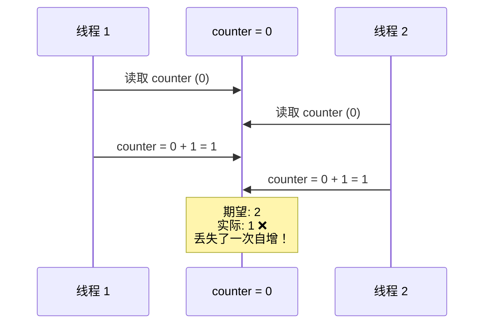
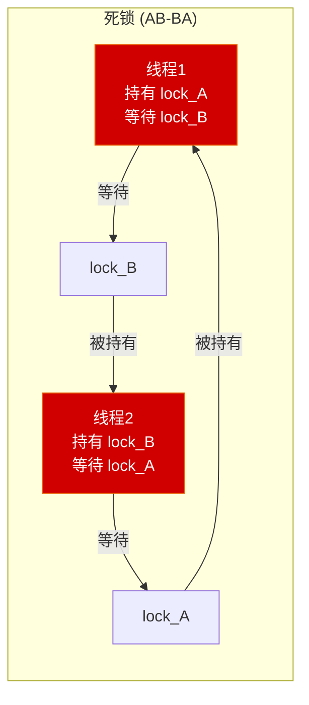

# 第七章 并发与多线程

> **一句话理解**：多线程让你的程序**同时做多件事**——但"共享可变状态"是万恶之源，所有并发 bug 都源于此。

---

## 7.1 概念直觉 —— What & Why

### 并发 vs 并行

| 概念 | 含义 | 类比 |
|------|------|------|
| **并发** (Concurrency) | 交替执行多个任务（逻辑上同时） | 一个厨师交替做两道菜 |
| **并行** (Parallelism) | 真正同时执行多个任务（物理上同时） | 两个厨师各做一道菜 |

- 单核 CPU：只有并发（时间片轮转）
- 多核 CPU：可以并行（每个核真正同时执行一个线程）

### 游戏为什么需要多线程？

```
典型游戏引擎线程模型：
┌─────────────┐  ┌─────────────┐  ┌─────────────┐  ┌─────────────┐
│  主线程      │  │  渲染线程    │  │  物理线程    │  │  加载线程    │
│  Input       │  │  DrawCall    │  │  碰撞检测    │  │  异步 I/O   │
│  Game Logic  │  │  GPU 提交    │  │  刚体模拟    │  │  纹理加载   │
│  UI 更新     │  │  后处理      │  │  射线检测    │  │  模型解析   │
└─────────────┘  └─────────────┘  └─────────────┘  └─────────────┘
```

> 💡 **面试中的表述**：「并发是逻辑上同时处理多个任务，并行是物理上同时执行。游戏引擎用多线程把渲染、物理、IO 分到不同线程/核心，充分利用多核 CPU。核心挑战是线程间数据同步。」

---

## 7.2 原理图解

### 数据竞争



### 死锁的条件



```
死锁的四个必要条件（缺一不可）：
1. 互斥：资源一次只能一个线程持有
2. 持有等待：持有一个资源的同时等待另一个
3. 不可抢占：持有的资源不能被强制释放
4. 循环等待：线程间形成等待环

打破任何一个条件就能避免死锁。
最常用：打破"循环等待"→ 给锁排序，所有线程按相同顺序加锁。
```

---

## 7.3 底层机制剖析

### 7.3.1 `std::thread` 基础

```cpp
#include <thread>

void worker(int id, const std::string& name) {
    std::cout << "Thread " << id << ": " << name << "\n";
}

// 创建线程
std::thread t1(worker, 1, "Alice");
std::thread t2(worker, 2, "Bob");

// 必须 join 或 detach，否则析构时 std::terminate
t1.join();    // 阻塞等待 t1 完成
t2.detach();  // 放到后台运行，t2 生命周期与主线程无关

// ⚠️ 参数传递的陷阱：
int x = 42;
// std::thread t3(func, std::ref(x));  // 传引用必须用 std::ref
// 否则 x 会被拷贝到线程内部

// 移动语义的线程
std::thread t4([](int val) {
    std::cout << "Lambda: " << val << "\n";
}, 100);

auto t5 = std::move(t4);  // 线程所有权转移
// t4 不再关联线程
t5.join();
```

#### `std::jthread` (C++20)

```cpp
#include <thread>
#include <stop_token>

// jthread 自动 join + 支持取消
std::jthread jt([](std::stop_token stoken) {
    while (!stoken.stop_requested()) {
        // 工作...
        std::this_thread::sleep_for(std::chrono::milliseconds(100));
    }
    std::cout << "Thread gracefully stopped\n";
});

// jt 析构时自动请求停止 + join（无需手动）
```

---

### 7.3.2 互斥量 (Mutex)

```cpp
#include <mutex>

std::mutex mtx;
int shared_counter = 0;

// ❌ 不加锁：数据竞争
void bad_increment() {
    for (int i = 0; i < 100000; ++i) {
        shared_counter++;  // 非原子操作：读-改-写
    }
}

// ✅ 用 mutex 保护
void safe_increment() {
    for (int i = 0; i < 100000; ++i) {
        std::lock_guard<std::mutex> lock(mtx);   // 构造时加锁
        shared_counter++;
    }   // 析构时自动解锁
}
```

#### RAII 锁的选择

| 锁类型 | 特点 | 使用场景 |
|--------|------|---------|
| `lock_guard` | 最简单，构造加锁、析构解锁 | 大多数场景 |
| `unique_lock` | 可延迟加锁、手动解锁、移动 | 配合 condition_variable |
| `scoped_lock` (C++17) | 同时锁定多个 mutex，防死锁 | 需要同时持有多把锁 |
| `shared_lock` (C++17) | 共享锁（读锁） | 读写锁模式 |

```cpp
// scoped_lock：同时锁定多个 mutex（自动处理加锁顺序，防死锁）
std::mutex m1, m2;

void transfer(Account& from, Account& to, int amount) {
    std::scoped_lock lock(m1, m2);  // 同时锁定，不会死锁
    from.balance -= amount;
    to.balance += amount;
}

// shared_mutex：读写锁
#include <shared_mutex>
std::shared_mutex rw_mutex;
std::unordered_map<std::string, int> config;

int readConfig(const std::string& key) {
    std::shared_lock lock(rw_mutex);      // 读锁：多个线程可以同时持有
    return config[key];
}

void writeConfig(const std::string& key, int val) {
    std::unique_lock lock(rw_mutex);      // 写锁：独占
    config[key] = val;
}
```

---

### 7.3.3 条件变量

```cpp
#include <condition_variable>

std::mutex mtx;
std::condition_variable cv;
std::queue<int> task_queue;
bool done = false;

// 生产者
void producer() {
    for (int i = 0; i < 10; ++i) {
        {
            std::lock_guard lock(mtx);
            task_queue.push(i);
        }
        cv.notify_one();  // 通知一个等待的消费者
    }
    {
        std::lock_guard lock(mtx);
        done = true;
    }
    cv.notify_all();  // 通知所有消费者结束
}

// 消费者
void consumer(int id) {
    while (true) {
        std::unique_lock lock(mtx);
        cv.wait(lock, [&]() {
            return !task_queue.empty() || done;
        });
        // ↑ wait 做的事情：
        // 1. 如果条件为 false → 解锁 mutex 并休眠
        // 2. 被 notify 唤醒后 → 重新加锁 → 再次检查条件
        // 3. 条件为 true → 继续执行

        if (task_queue.empty() && done) break;

        int task = task_queue.front();
        task_queue.pop();
        lock.unlock();  // 处理前释放锁

        std::cout << "Consumer " << id << " processing: " << task << "\n";
    }
}
```

> ⚠️ **虚假唤醒 (Spurious Wakeup)**：`wait()` 可能在没有 `notify` 的情况下返回。所以**必须用 while 循环或 lambda 谓词检查条件**，不能用 `if`。

---

### 7.3.4 原子操作 (Atomics)

```cpp
#include <atomic>

// atomic 保证操作的原子性，无需加锁
std::atomic<int> counter{0};

void increment() {
    for (int i = 0; i < 100000; ++i) {
        counter.fetch_add(1, std::memory_order_relaxed);
        // 或简写：counter++; （使用默认 seq_cst 内存序）
    }
}

// 两个线程同时 increment → counter = 200000 ✅（不会丢失）
```

#### CAS (Compare-And-Swap)

```cpp
// CAS 是无锁编程的核心原语
std::atomic<int> value{0};

// 尝试把 value 从 expected 改为 desired
int expected = 0;
bool success = value.compare_exchange_strong(expected, 42);
// 如果 value == expected → 把 value 设为 42，返回 true
// 如果 value != expected → 把 expected 设为 value 当前值，返回 false

// CAS 循环：无锁自增
void lock_free_increment(std::atomic<int>& val) {
    int old_val = val.load();
    while (!val.compare_exchange_weak(old_val, old_val + 1)) {
        // old_val 被更新为当前值，重试
    }
}

// 自旋锁：用 atomic_flag 实现
class SpinLock {
    std::atomic_flag _flag = ATOMIC_FLAG_INIT;
public:
    void lock() {
        while (_flag.test_and_set(std::memory_order_acquire)) {
            // 自旋等待（忙等）
        }
    }
    void unlock() {
        _flag.clear(std::memory_order_release);
    }
};
```

#### 内存序 (Memory Order)

```cpp
// 编译器和 CPU 可能重排指令。内存序控制可见性。

// seq_cst（默认）：最严格，全局一致顺序
// 性能最差但最安全
counter.fetch_add(1);  // 默认 memory_order_seq_cst

// acquire / release：配对使用，建立 happens-before 关系
std::atomic<bool> ready{false};
int data = 0;

// 线程 1（生产者）
data = 42;                                         // 普通写
ready.store(true, std::memory_order_release);       // release store

// 线程 2（消费者）
while (!ready.load(std::memory_order_acquire)) {}   // acquire load
assert(data == 42);  // ✅ 保证看到 data = 42
// acquire 能"看到" release 之前的所有写操作

// relaxed：最宽松，只保证原子性，不保证顺序
// 适用于简单计数器（不关心与其他变量的顺序关系）
counter.fetch_add(1, std::memory_order_relaxed);
```

| 内存序 | 保证 | 性能 | 使用场景 |
|--------|------|------|---------|
| `seq_cst` | 全局一致顺序 | 最慢 | 默认选择，最安全 |
| `acquire` | 读后不可前移 | 中等 | 消费者端 |
| `release` | 写前不可后移 | 中等 | 生产者端 |
| `relaxed` | 仅原子性 | 最快 | 计数器、统计 |

> 💡 **面试中的表述**：「内存序控制原子操作的可见性。`seq_cst` 最严格，保证全局一致顺序；`acquire/release` 配对使用，建立 happens-before 关系；`relaxed` 只保证原子性。大多数情况用默认的 `seq_cst`，性能敏感路径才考虑 `relaxed`。」

---

### 7.3.5 异步编程

```cpp
#include <future>

// std::async：把任务提交到线程池（或新线程）
auto future = std::async(std::launch::async, []() {
    // 后台执行的耗时操作
    std::this_thread::sleep_for(std::chrono::seconds(2));
    return 42;
});

// 主线程继续干别的...
std::cout << "Doing other work...\n";

// 需要结果时阻塞等待
int result = future.get();  // 阻塞直到任务完成，返回 42

// std::promise + std::future：手动设置结果
std::promise<int> prom;
auto fut = prom.get_future();

std::thread t([&prom]() {
    int result = heavy_computation();
    prom.set_value(result);  // 设置结果
});

int val = fut.get();  // 阻塞等待 set_value
t.join();
```

---

## 7.4 经典陷阱与面试题

### 7.4.1 代码陷阱

```cpp
// === 陷阱 1：数据竞争 ===
int counter = 0;
// 两个线程同时执行 counter++
// counter++ 不是原子操作！它是 read-modify-write 三步
// 解决：std::atomic<int> 或 mutex

// === 陷阱 2：AB-BA 死锁 ===
std::mutex m1, m2;
// 线程 1: lock(m1) → lock(m2)
// 线程 2: lock(m2) → lock(m1)
// → 互相等待 → 死锁！
// 解决：std::scoped_lock(m1, m2) 或固定加锁顺序

// === 陷阱 3：条件变量用 if 判断 ===
// ❌
cv.wait(lock);
if (queue.empty()) return;  // 虚假唤醒时 queue 可能仍为空！

// ✅
cv.wait(lock, [&]{ return !queue.empty(); });  // lambda 自动循环检查

// === 陷阱 4：detach 的悬垂引用 ===
void bad_detach() {
    int local = 42;
    std::thread t([&local]() {
        std::this_thread::sleep_for(std::chrono::seconds(1));
        std::cout << local;  // 💥 local 已经销毁！
    });
    t.detach();  // 线程在后台运行
}   // local 在这里销毁，但线程还在用它

// ✅ 值捕获或确保生命周期
void good_detach() {
    int local = 42;
    std::thread t([local]() {  // 值捕获
        std::cout << local;    // ✅ 安全
    });
    t.detach();
}

// === 陷阱 5：volatile ≠ 线程安全 ===
volatile int flag = 0;
// volatile 只防止编译器优化掉读取（用于硬件寄存器）
// 它不保证原子性，也不保证内存可见性
// ❌ 不能用于线程同步
// ✅ 用 std::atomic<int> flag
```

### 7.4.2 面试辨析

**Q1：`atomic` 和 `mutex` 怎么选？**

> `atomic` 适合简单操作（计数器、标志位），无锁，性能好。`mutex` 适合保护复杂的代码段（多条语句的临界区）。一般规则：如果能用 `atomic` 就用 `atomic`，需要保护多条语句时用 `mutex`。

**Q2：`volatile` 能保证线程安全吗？**

> 不能。`volatile` 只告诉编译器"不要优化掉对这个变量的读写"，用于硬件寄存器等场景。它不保证原子性（多线程可能看到半写状态），也不保证内存可见性（没有 memory fence）。线程安全要用 `std::atomic`。

**Q3：`shared_ptr` 的引用计数是原子的，但 `shared_ptr` 不是线程安全的？**

> 引用计数的增减是原子操作，多个线程可以安全地拷贝/销毁指向同一对象的不同 `shared_ptr`。但多个线程同时读写**同一个 `shared_ptr` 变量**有数据竞争——比如一个线程 `sp = new_sp` 另一个线程 `auto p = sp`。需要加锁或用 `atomic<shared_ptr>`（C++20）。

---

## 7.5 🎮 游戏实战场景

### 7.5.1 渲染线程 vs 逻辑线程分离

```cpp
// 双缓冲同步：逻辑线程写入帧数据，渲染线程读取上一帧数据
struct FrameData {
    std::vector<DrawCommand> draw_commands;
    glm::mat4 view_matrix;
    glm::mat4 proj_matrix;
    float time;
};

class DoubleBuffer {
    FrameData _buffers[2];
    std::atomic<int> _write_index{0};
    std::atomic<bool> _new_frame{false};

public:
    // 逻辑线程：写入当前帧数据
    FrameData& getWriteBuffer() {
        return _buffers[_write_index.load()];
    }

    void swapBuffers() {
        _write_index.store(1 - _write_index.load());
        _new_frame.store(true, std::memory_order_release);
    }

    // 渲染线程：读取上一帧数据
    const FrameData& getReadBuffer() const {
        return _buffers[1 - _write_index.load(std::memory_order_acquire)];
    }

    bool hasNewFrame() const {
        return _new_frame.exchange(false);
    }
};

// 主循环：
DoubleBuffer frame_buffer;

// 逻辑线程
std::jthread logic_thread([&](std::stop_token st) {
    while (!st.stop_requested()) {
        auto& buf = frame_buffer.getWriteBuffer();
        // 更新游戏逻辑 → 填充 draw_commands
        updateGameLogic(buf);
        frame_buffer.swapBuffers();
    }
});

// 渲染线程（主线程）
while (running) {
    if (frame_buffer.hasNewFrame()) {
        const auto& buf = frame_buffer.getReadBuffer();
        renderFrame(buf);
    }
}
```

### 7.5.2 简化版线程池 / Job System

```cpp
class ThreadPool {
    std::vector<std::thread> _workers;
    std::queue<std::function<void()>> _tasks;
    std::mutex _mutex;
    std::condition_variable _cv;
    bool _stop = false;

public:
    ThreadPool(size_t num_threads) {
        for (size_t i = 0; i < num_threads; ++i) {
            _workers.emplace_back([this]() {
                while (true) {
                    std::function<void()> task;
                    {
                        std::unique_lock lock(_mutex);
                        _cv.wait(lock, [this]{ return _stop || !_tasks.empty(); });
                        if (_stop && _tasks.empty()) return;
                        task = std::move(_tasks.front());
                        _tasks.pop();
                    }
                    task();
                }
            });
        }
    }

    template <typename F>
    auto submit(F&& func) -> std::future<decltype(func())> {
        using ReturnType = decltype(func());
        auto task = std::make_shared<std::packaged_task<ReturnType()>>(
            std::forward<F>(func)
        );
        auto future = task->get_future();
        {
            std::lock_guard lock(_mutex);
            _tasks.emplace([task]() { (*task)(); });
        }
        _cv.notify_one();
        return future;
    }

    ~ThreadPool() {
        {
            std::lock_guard lock(_mutex);
            _stop = true;
        }
        _cv.notify_all();
        for (auto& w : _workers) w.join();
    }
};

// 使用：
ThreadPool pool(std::thread::hardware_concurrency());

auto f1 = pool.submit([]{ return computePhysics(); });
auto f2 = pool.submit([]{ return computeAI(); });
auto f3 = pool.submit([]{ return computeAnimation(); });

// 等待所有结果
auto physics  = f1.get();
auto ai       = f2.get();
auto animation = f3.get();
```

### 7.5.3 SPSC 无锁队列 —— 线程间消息传递

```cpp
// Single-Producer Single-Consumer 无锁环形队列
template <typename T, size_t Capacity>
class SPSCQueue {
    std::array<T, Capacity> _buffer;
    alignas(64) std::atomic<size_t> _head{0};  // 消费者读
    alignas(64) std::atomic<size_t> _tail{0};  // 生产者写
    // alignas(64)：放在不同缓存行，避免 false sharing

public:
    bool push(const T& item) {
        size_t tail = _tail.load(std::memory_order_relaxed);
        size_t next = (tail + 1) % Capacity;
        if (next == _head.load(std::memory_order_acquire)) {
            return false;  // 队列满
        }
        _buffer[tail] = item;
        _tail.store(next, std::memory_order_release);
        return true;
    }

    bool pop(T& item) {
        size_t head = _head.load(std::memory_order_relaxed);
        if (head == _tail.load(std::memory_order_acquire)) {
            return false;  // 队列空
        }
        item = _buffer[head];
        _head.store((head + 1) % Capacity, std::memory_order_release);
        return true;
    }
};

// 使用：主线程 ↔ 网络线程
SPSCQueue<NetworkMessage, 1024> net_to_main;
SPSCQueue<NetworkMessage, 1024> main_to_net;

// 网络线程
void networkThread() {
    while (running) {
        auto msg = receiveFromServer();
        net_to_main.push(msg);  // 无锁推送到主线程

        NetworkMessage outgoing;
        if (main_to_net.pop(outgoing)) {
            sendToServer(outgoing);  // 消费主线程发来的消息
        }
    }
}

// 主线程
void mainLoop() {
    NetworkMessage msg;
    while (net_to_main.pop(msg)) {  // 无锁消费
        processNetworkMessage(msg);
    }
}
```

### 7.5.4 异步资源加载

```cpp
class AsyncLoader {
    ThreadPool& _pool;
    std::unordered_map<std::string, std::shared_future<TexturePtr>> _pending;
    std::mutex _cache_mutex;

public:
    AsyncLoader(ThreadPool& pool) : _pool(pool) {}

    std::shared_future<TexturePtr> loadTexture(const std::string& path) {
        std::lock_guard lock(_cache_mutex);

        // 已经在加载中？返回相同的 future
        if (auto it = _pending.find(path); it != _pending.end()) {
            return it->second;
        }

        // 提交加载任务
        auto future = _pool.submit([path]() -> TexturePtr {
            auto data = readFile(path);          // IO（可能几十 ms）
            auto pixels = decodeImage(data);      // CPU 解码
            return createGPUTexture(pixels);       // 上传 GPU
        }).share();

        _pending[path] = future;
        return future;
    }
};

// 使用：
AsyncLoader loader(pool);
auto tex_future = loader.loadTexture("hero.png");

// 游戏循环中检查是否加载完成
if (tex_future.wait_for(std::chrono::milliseconds(0)) == std::future_status::ready) {
    auto texture = tex_future.get();
    sprite.setTexture(texture);  // 加载完成，使用纹理
} else {
    sprite.setTexture(placeholder);  // 还在加载，用占位图
}
```

---

## 7.6 30 秒速答

**Q：并发和并行的区别？**

> 并发是逻辑上同时处理多个任务（单核也能做到，通过时间片轮转），并行是物理上同时执行（需要多核）。并行是并发的一种实现方式。

**Q：`mutex` 和 `atomic` 怎么选？**

> `atomic` 适合简单操作（计数器、标志位），无锁，性能好。`mutex` 适合保护复杂的临界区（多条语句）。能用 `atomic` 就用 `atomic`，复杂操作用 `mutex`。

**Q：什么是死锁？怎么预防？**

> 死锁是两个以上线程互相等待对方持有的资源。需要同时满足互斥、持有等待、不可抢占、循环等待四个条件。预防方法：给锁排序（所有线程按相同顺序加锁）、用 `std::scoped_lock` 同时锁定多个 mutex、设置超时。

**Q：条件变量为什么要配合 `while` 使用？**

> 因为虚假唤醒——`wait()` 可能在没有 `notify` 的情况下返回。所以必须在循环中检查条件，或用 lambda 谓词形式的 `wait`。

**Q：`volatile` 能替代 `atomic` 吗？**

> 不能。`volatile` 只防止编译器优化掉读写，不保证原子性和内存可见性。线程安全必须用 `std::atomic`。`volatile` 只用于硬件寄存器映射。

---

> 📖 上一章：[第六章 编译、链接与构建](../06_compilation_and_linking) —— 从 .cpp 到可执行文件的四步旅程，静态库与动态库，游戏引擎的模块化构建。

> 📖 下一章：[第八章 现代 C++ 特性精选](../08_modern_cpp) —— auto/decltype、Lambda、optional/variant/string_view 与游戏实战中的现代 C++ 最佳实践。
