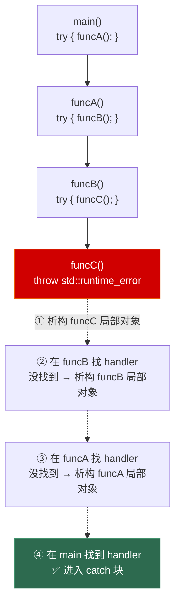
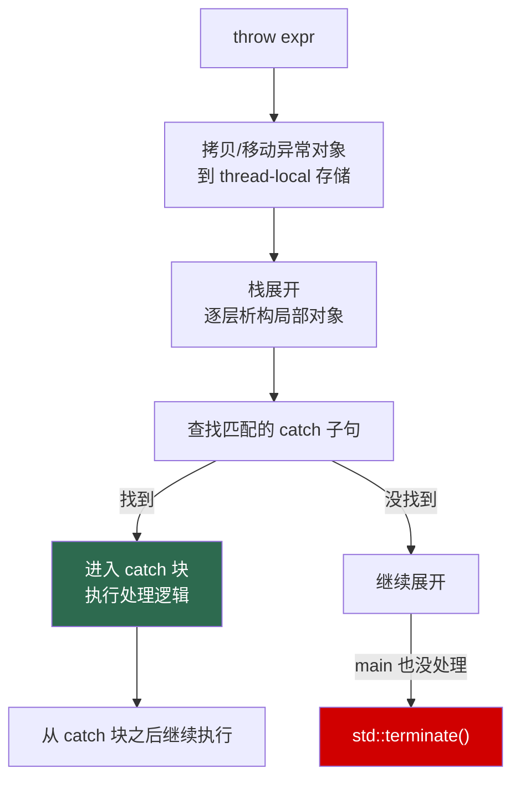

# 第九章 异常处理与异常安全

> **一句话理解**：异常处理不是为了"报错"，而是让错误处理代码和正常业务逻辑分离。C++ 的异常机制与 RAII 深度绑定——析构函数是异常安全的最强防线，`noexcept` 是编译器优化的关键信号。

---

## 9.1 概念直觉 —— What & Why

### 为什么需要异常？

没有异常的年代，错误处理只有三种方式，每种都有缺陷：

```cpp
// 方式一：返回错误码
int divide(int a, int b, int& result) {
    if (b == 0) return -1;  // 错误码
    result = a / b;
    return 0;               // 成功
}
// 问题：错误码和正常返回值混在一起，调用方可以忽略返回值

// 方式二：全局 errno
FILE* f = fopen("data.bin", "rb");
if (!f) {
    printf("error: %s\n", strerror(errno));  // 非线程安全！
}

// 方式三：assert / abort
assert(ptr != nullptr);  // 问题：Release 下失效，不能优雅恢复
```

异常的核心价值：

1. **错误不能被忽略** — 不被 catch 的异常会一路向上抛，最终 terminate
2. **错误处理与业务逻辑分离** — 正常路径写在一起，错误处理集中在 catch 块
3. **构造函数可以报错** — 返回错误码的时代，构造函数没法返回值，出了错只能留个"半成品对象"，异常从根本上解决了这个问题

```cpp
// 异常版本：正常逻辑和错误处理清晰分离
try {
    auto config = Config::load("settings.cfg");  // 构造失败直接抛异常
    auto engine  = Engine(config);
    engine.run();
} catch (const ConfigError& e) {
    // 所有配置相关错误集中处理
    std::cerr << "配置错误：" << e.what() << std::endl;
} catch (const std::exception& e) {
    // 兜底
    std::cerr << "未知错误：" << e.what() << std::endl;
}
```

---

## 9.2 原理图解

### 9.2.1 栈展开（Stack Unwinding）

异常抛出后，运行时从 throw 点开始，沿着调用链**一层一层地退出**，每退出一层就调用该层所有局部对象的析构函数。



```cpp
// 验证栈展开的代码
struct Tracer {
    std::string name;
    Tracer(const std::string& n) : name(n) {
        std::cout << "构造: " << name << std::endl;
    }
    ~Tracer() {
        std::cout << "析构: " << name << std::endl;
    }
};

void funcC() {
    Tracer t("C");
    throw std::runtime_error("oops");  // t 会被自动析构
}

void funcB() {
    Tracer t("B");
    funcC();  // 异常穿透 funcB，t 自动析构
}

void funcA() {
    Tracer t("A");
    funcB();
}

int main() {
    try {
        funcA();
    } catch (const std::exception& e) {
        std::cout << "捕获: " << e.what() << std::endl;
    }
}
// 输出：
// 构造: A
// 构造: B
// 构造: C
// 析构: C
// 析构: B
// 析构: A
// 捕获: oops
```

### 9.2.2 异常处理流程图



---

## 9.3 底层机制剖析

### 9.3.1 try / catch / throw 的核心机制

```cpp
// 基本语法
try {
    // 可能抛出异常的代码
    throw std::runtime_error("something went wrong");
} catch (const std::runtime_error& e) {
    // 按类型匹配，从上到下，第一个匹配的 catch 生效
    std::cerr << "Runtime error: " << e.what() << std::endl;
} catch (const std::logic_error& e) {
    std::cerr << "Logic error: " << e.what() << std::endl;
} catch (const std::exception& e) {
    // 基类 catch 放最后！否则派生类异常永远匹配不到它
    std::cerr << "Generic: " << e.what() << std::endl;
} catch (...) {
    // 捕获所有异常（包括非 std::exception 派生的）
    // 缺点：无法获取异常对象的具体信息
    std::cerr << "Unknown exception" << std::endl;
    throw;  // 可选：重新抛出
}
```

**throw 的底层步骤**：

1. 用 `throw` 的表达式**拷贝或移动**构造一个异常对象（存在 thread-local 的"异常槽"中）
2. 从当前函数开始**栈展开**：销毁所有在 try 块到 throw 点之间构造的局部对象
3. 沿着调用链向上查找匹配的 `catch` 子句
4. 如果到 `main` 还没找到 → 调用 `std::terminate()`

```cpp
// throw 会拷贝！不是传递引用
struct MyEx : std::exception {
    std::string msg;
    MyEx(const std::string& m) : msg(m) {
        std::cout << "构造: " << msg << std::endl;
    }
    MyEx(const MyEx& other) : msg(other.msg) {
        std::cout << "拷贝: " << msg << std::endl;
    }
    const char* what() const noexcept override { return msg.c_str(); }
};

try {
    MyEx ex("original");
    throw ex;  // 拷贝！即使 ex 是局部变量
} catch (const MyEx& e) {  // 用引用捕获（避免再次拷贝）
    // e 引用的是 throw 拷贝出来的那个副本
}
// 输出：
// 构造: original
// 拷贝: original
// (ex 析构)
// (throw 的副析构)

// ✅ 最佳实践：直接 throw + 临时对象，编译器可能做移动甚至省略
try {
    throw MyEx("temporary");  // 可能直接构造到异常槽，省掉拷贝
} catch (const MyEx& e) {
    // ...
}
```

### 9.3.2 异常安全保证（Exception Safety Guarantees）

这是面试中最常考的异常概念。C++ 标准库定义了三个级别的异常安全保证：

| 级别 | 保证内容 | 示例 |
|------|---------|------|
| **Nothrow（无抛出）** | 绝对不抛异常 | 析构函数、`swap`、移动构造（标记 `noexcept`） |
| **Strong（强保证）** | 失败后回滚到操作前状态（像事务） | `std::vector::push_back`（扩容失败时原 vector 不变） |
| **Basic（基本保证）** | 失败后对象仍然合法（不变量保持，不泄漏） | 大多数标准库操作 |

```cpp
// === 不变量（Invariant）==

// 什么是"对象不变量"？
// 一个类内部有一条它自己保证的规则，无论发生什么都不能破。
class NonNegative {
    int _value = 0;
public:
    // 不变量：_value 永远 >= 0
    void set(int v) {
        if (v < 0)
            throw std::invalid_argument("negative");
        _value = v;  // ← 只有前面没抛异常，才到这里
    }
    // 如果 _value = v 本身会抛异常（显然这里不会，但复杂类型可能），
    // 那这个写法只提供了 basic guarantee——对象可能处于不一致状态。
};
```

```cpp
// === 强保证的实现：Copy-and-Swap ===

class String {
    char* _data = nullptr;
    size_t _size = 0;

public:
    String(const char* s = "") : _size(strlen(s)) {
        _data = new char[_size + 1];
        strcpy(_data, s);
    }

    ~String() { delete[] _data; }

    // 拷贝构造（可能抛异常：new 失败）
    String(const String& other) : _size(other._size) {
        _data = new char[_size + 1];  // 可能抛 bad_alloc
        strcpy(_data, other._data);
    }

    // 移动构造（不抛异常）
    String(String&& other) noexcept
        : _data(other._data), _size(other._size) {
        other._data = nullptr;
        other._size = 0;
    }

    // swap（不抛异常）
    void swap(String& other) noexcept {
        std::swap(_data, other._data);
        std::swap(_size, other._size);
    }

    // 拷贝赋值 —— 强异常安全保证！
    String& operator=(const String& other) {
        // 关键：先拷贝到一个临时对象，成功了再 swap
        String temp(other);   // 可能抛异常，但 this 还没被修改
        swap(temp);           // 不抛异常
        return *this;
    }  // temp 在此析构（释放旧资源）

    // ❌ 错误写法 —— 只提供 basic guarantee
    String& operator=(const String& other) {
        if (this != &other) {
            delete[] _data;           // 先删了旧数据
            _size = other._size;
            _data = new char[_size + 1];  // 如果这里抛异常？
            strcpy(_data, other._data);
            // 对象处于: _data 指向已释放内存，_size 已被修改
            // → 不变量被破坏！
        }
        return *this;
    }
};
```

> 💡 **Copy-and-Swap** 是实现强异常安全保证的通用模式：先在新内存中完成所有可能失败的操作，成功后再 swap。失败时原对象毫发无损。

### 9.3.3 noexcept 的语义与优化

`noexcept` 不是"这个函数不会抛异常"的承诺，而是"**如果这个函数抛了异常，直接 terminate**"的声明。

```cpp
// noexcept 的三种写法
void f1() noexcept;          // C++11：不抛异常
void f2() noexcept(true);    // 等价写法
void f3() noexcept(false);   // 可能抛异常（默认）

// 条件 noexcept：取决于模板参数
template <typename T>
void swap(T& a, T& b) noexcept(std::is_nothrow_move_constructible_v<T> &&
                                std::is_nothrow_move_assignable_v<T>);

// noexcept 是类型的一部分（C++17）！函数指针可以区分
void (*p1)() = f1;           // ✅
void (*p2)() noexcept = f1;  // ✅
// p1 = f1;                  // ❌ C++17 起！noexcept 函数不能赋给非 noexcept 指针
```

**为什么 noexcept 对性能至关重要？**

回顾第四章的核心结论：`std::vector` 扩容时，根据元素移动构造的 `noexcept` 声明决定策略。

```cpp
// 重温：vector 的 move_if_noexcept
// 如果 T 的移动构造是 noexcept → 移动元素（O(1) per element）
// 如果 T 的移动构造不是 noexcept → 拷贝元素（O(n) per element）
// 原因：移动中途如果抛异常，已经移走的数据回不来了。
//       拷贝中途抛异常，源数据还在，回滚安全。

struct MoveSafe {
    MoveSafe(MoveSafe&&) noexcept = default;     // ✅ vector 扩容时移动
};

struct MoveUnsafe {
    MoveUnsafe(MoveUnsafe&&) /* 没有 noexcept */; // ⚠️ vector 扩容时拷贝！
};

// 所以：只要你的移动构造/移动赋值不抛异常，务必标记 noexcept
```

**noexcept 的误用陷阱**：

```cpp
// ❌ 不是"编译器帮你检查并抛异常"
void f() noexcept {
    throw std::runtime_error("oops");  // 编译通过！
    // 运行时：直接 std::terminate()，不会被任何 catch 捕获
}

// ✅ noexcept 意思是"我自己保证不抛，编译器请放心优化"
// 如果 noexcept 函数内部抛了异常 → 直接 terminate，不可恢复
```

### 9.3.4 构造与析构中的异常

这是面试中最容易答错的部分。

**构造函数中抛异常**：

```cpp
class ResourceHolder {
    Resource* _a;
    Resource* _b;
public:
    ResourceHolder() : _a(nullptr), _b(nullptr) {
        _a = new Resource("a");   // 假设成功
        _b = new Resource("b");   // 假设这里抛异常！
    }
    ~ResourceHolder() {
        delete _a;  // ⚠️ 如果构造函数抛异常，析构函数不会被调用！
        delete _b;
    }
};
// 泄漏：_a 永远不会被 delete

// ✅ 解决方案一：用 RAII 包装每个资源
class SafeHolder {
    std::unique_ptr<Resource> _a;
    std::unique_ptr<Resource> _b;
public:
    SafeHolder()
        : _a(std::make_unique<Resource>("a"))
        , _b(std::make_unique<Resource>("b"))  // 如果抛异常
    {
        // _a 是已完整构造的子对象，其析构函数会被自动调用！
        // 这就是"已构造成员的析构函数会被调用"的保证
    }
};

// ✅ 解决方案二：try-catch in constructor
class ManualHolder {
    Resource* _a = nullptr;
    Resource* _b = nullptr;
public:
    ManualHolder() {
        _a = new Resource("a");
        try {
            _b = new Resource("b");
        } catch (...) {
            delete _a;  // 手动清理
            throw;       // 重新抛出
        }
    }
};
```

> 🔑 **关键规则**：构造函数抛异常，已完全构造的**成员子对象**（和在初始化列表中初始化的基类）的析构函数会被调用。但构造函数体内 `new` 出来的裸指针**不会**被自动释放——这就是为什么需要 RAII。

**析构函数中抛异常**：

```cpp
// ❌ 绝对不要在析构函数中抛异常！
struct Bad {
    ~Bad() {
        throw std::runtime_error("bad");  // 这是灾难
    }
};

// 为什么？看这个场景：
void disaster() {
    Bad b1;
    Bad b2;
    throw std::runtime_error("first error");
    // 栈展开 → 析构 b2 → 抛异常
    //         → 析构 b1 → 也抛异常？
    // 两个异常同时存在 → std::terminate()
}

// ✅ 正确做法：析构函数吞掉所有异常
struct Safe {
    ~Safe() noexcept {  // 析构函数默认就是 noexcept 的！
        try {
            cleanup_that_might_throw();
        } catch (...) {
            // 记录日志，但不要重新抛出
            std::cerr << "cleanup failed, swallowing" << std::endl;
        }
    }
};
```

### 9.3.5 rethrow 与 std::exception_ptr

```cpp
// throw; — 重新抛出当前捕获的异常（保留原始类型）
try {
    throw std::runtime_error("original");
} catch (const std::exception& e) {
    std::cout << "日志: " << e.what() << std::endl;
    throw;  // 重新抛出 std::runtime_error，不是 std::exception！
}

// throw e; — 抛出的是被 catch 声明类型切片后的副本
try {
    throw std::runtime_error("original");
} catch (const std::exception& e) {
    std::cout << "日志: " << e.what() << std::endl;
    throw e;  // ❌ 抛的是 std::exception，不是 std::runtime_error！
              // 因为 e 的静态类型是 std::exception
}
```

```cpp
// std::exception_ptr — 把异常存起来，稍后再抛
// 典型应用：线程间传递异常
#include <exception>
#include <future>

std::exception_ptr g_stored_exception;  // 全局异常存储

void worker() {
    try {
        throw std::runtime_error("worker failed");
    } catch (...) {
        g_stored_exception = std::current_exception();  // 捕获并存储
    }
}

void later() {
    if (g_stored_exception) {
        try {
            std::rethrow_exception(g_stored_exception);  // 重新抛出
        } catch (const std::runtime_error& e) {
            std::cout << "延迟处理: " << e.what() << std::endl;
        }
    }
}

// std::future 内部就是用 exception_ptr 传递异常的
std::future<void> f = std::async([]() {
    throw std::runtime_error("async error");
});
try {
    f.get();  // 异常在这里重新抛出
} catch (const std::exception& e) {
    std::cout << "捕获异步异常: " << e.what() << std::endl;
}
```

### 9.3.6 标准异常体系

```cpp
// C++ 标准异常层次结构
//
// std::exception              ← 所有标准异常的基类
// ├── std::logic_error        ← 程序逻辑错误（可提前检查避免）
// │   ├── std::invalid_argument
// │   ├── std::domain_error
// │   ├── std::length_error
// │   └── std::out_of_range
// ├── std::runtime_error      ← 运行时错误（不可提前预知）
// │   ├── std::range_error
// │   ├── std::overflow_error
// │   └── std::underflow_error
// └── std::bad_alloc          ← new 失败
//     std::bad_cast           ← dynamic_cast 引用版失败
//     std::bad_function_call  ← 调用空的 std::function
//     std::bad_optional_access (C++17)
//     std::bad_variant_access   (C++17)
```

```cpp
// 自定义异常的最佳实践
// ✅ 继承自 std::runtime_error（或 logic_error），不要直接继承 std::exception
class ConfigParseError : public std::runtime_error {
public:
    // 把 what() 的信息传进基类构造函数
    explicit ConfigParseError(const std::string& msg)
        : std::runtime_error(msg) {}
};

// 如果需要附加信息
class AssetLoadError : public std::runtime_error {
    std::string _path;
public:
    AssetLoadError(const std::string& path, const std::string& reason)
        : std::runtime_error("Failed to load: " + path + " — " + reason)
        , _path(path) {}
    
    const std::string& path() const noexcept { return _path; }
};
```

---

## 9.4 经典陷阱与面试题

### 9.4.1 这段代码有什么问题？

**陷阱一：析构函数抛异常**

```cpp
struct Connection {
    ~Connection() {
        close();
    }
    void close() {
        if (connected) {
            // ... 关闭可能失败
            if (failed) throw std::runtime_error("close failed");  // ❌
        }
    }
    bool connected = true;
};
```

**答案**：析构函数抛异常会在栈展开时触发 `std::terminate()`（两个异常同时存在）。解决：析构函数必须 `noexcept`，内部 `try-catch` 吞掉所有异常。

**陷阱二：构造函数中的裸资源**

```cpp
class Bad {
    int* _a;
    int* _b;
public:
    Bad(int x, int y) {
        _a = new int(x);  // 成功
        _b = new int(y);  // 如果这里抛 bad_alloc？
    }
    ~Bad() {
        delete _a;
        delete _b;
    }
};
```

**答案**：`_a` 泄漏。构造函数抛异常时析构函数不会被调用。解决：用 `std::unique_ptr` 或先全部分配成功再交给成员。

**陷阱三：throw 和 throw e 的区别**

```cpp
try {
    throw std::runtime_error("specific");
} catch (const std::exception& e) {
    // 方式一
    throw;     // 抛出 std::runtime_error
    // 方式二
    throw e;   // 抛出 std::exception（切片！）
}
```

**陷阱四：noexcept 函数抛异常**

```cpp
void important() noexcept {
    // ... 复杂逻辑 ...
    throw std::runtime_error("unexpected");  // 直接 abort，没机会 catch
}

int main() {
    try {
        important();
    } catch (...) {  // 没用！important 是 noexcept
        // 这行永远不会执行
    }
}
```

### 9.4.2 面试问答

**Q：什么是异常安全的三个保证？**

> **Nothrow**：绝不对抛异常（析构函数、`swap`、`noexcept` 移动构造）。
> **Strong（强保证）**：操作要么成功，要么回滚到操作前状态（Copy-and-Swap 是实现方式）。
> **Basic（基本保证）**：操作失败不泄漏资源，对象保持可用（不变量不被破坏），但不保证数据不变。

**Q：为什么析构函数不能抛异常？**

> 如果析构函数抛异常，且同时存在另一个因栈展开而传播的异常，C++ 标准规定必须调用 `std::terminate()`。为保安全，C++11 起析构函数隐式 `noexcept`。

**Q：构造函数抛异常会发生什么？**

> 已完全构造的成员子对象和基类子对象的析构函数会被调用。但构造函数体内 `new` 出来的裸资源不会被自动释放。解决这个问题的正是 RAII——用智能指针等 RAII 包装器管理资源。

**Q：noexcept 对 vector 扩容的影响？**

> `std::vector` 扩容时用 `std::move_if_noexcept` 决定移动还是拷贝元素。如果元素的移动构造函数是 `noexcept`，就用移动（强保证，因为移动不会失败）；如果不是 `noexcept`，则回退到拷贝（保证扩容失败时原 vector 不变）。移动构造不标记 `noexcept` 会导致严重的性能退化。

**Q：catch (...) 和 catch (const std::exception&) 的区别？**

> `catch (const std::exception&)` 只捕获 `std::exception` 及其派生类；`catch (...)` 捕获一切，包括 `int`、字符串字面量、自定义非标准异常类。但 `catch (...)` 内部无法访问异常对象本身，只能做清理然后 `throw;` 重新抛出。

---

## 9.5 游戏实战场景

### 9.5.1 资源加载的异常安全

游戏中最常见的异常场景：加载一批资源，任何一个失败都应该让整个过程失败。

```cpp
// ❌ 不安全的写法
class Level {
    Mesh* _terrain = nullptr;
    Mesh* _building = nullptr;
    Texture* _skybox = nullptr;
public:
    void load(const std::string& path) {
        _terrain  = loadMesh(path + "/terrain.mesh");   // 成功
        _building = loadMesh(path + "/building.mesh");   // 抛异常 → _terrain 泄漏
        _skybox   = loadTexture(path + "/skybox.tex");   // 不会执行到
    }
};

// ✅ 用智能指针的 RAII 保证
class SafeLevel {
    std::unique_ptr<Mesh> _terrain;
    std::unique_ptr<Mesh> _building;
    std::unique_ptr<Texture> _skybox;
public:
    void load(const std::string& path) {
        auto terrain  = std::unique_ptr<Mesh>(loadMesh(path + "/terrain.mesh"));
        auto building = std::unique_ptr<Mesh>(loadMesh(path + "/building.mesh"));
        auto skybox   = std::unique_ptr<Texture>(loadTexture(path + "/skybox.tex"));
        
        // 三者都成功，一次性转移所有权
        _terrain  = std::move(terrain);
        _building = std::move(building);
        _skybox   = std::move(skybox);
    }
};
```

### 9.5.2 配置文件解析

```cpp
class GameConfig {
public:
    int windowWidth = 1920;
    int windowHeight = 1080;
    std::string title = "Game";
    
    static GameConfig load(const std::string& path) {
        std::ifstream file(path);
        if (!file) {
            throw ConfigParseError("Cannot open config file: " + path);
        }
        
        GameConfig config;
        // 逐行解析（可能抛 std::invalid_argument、std::out_of_range）
        std::string line;
        int lineNum = 0;
        while (std::getline(file, line)) {
            ++lineNum;
            try {
                config.parseLine(line);
            } catch (const std::exception& e) {
                // 包装一下，加上行号信息
                throw ConfigParseError(
                    "Error at line " + std::to_string(lineNum) + ": " + e.what()
                );
            }
        }
        return config;
    }

private:
    void parseLine(const std::string& line) {
        auto [key, value] = split(line, '=');
        if (key == "width")  windowWidth  = std::stoi(value);
        if (key == "height") windowHeight = std::stoi(value);
        if (key == "title")  title = std::trim(value);
    }
};

// 使用侧：加载失败 → 用默认值 + 日志告警
GameConfig config;
try {
    config = GameConfig::load("settings.cfg");
} catch (const ConfigParseError& e) {
    std::cerr << "[WARN] " << e.what() << " — 使用默认配置" << std::endl;
    // config 保持默认值
}
```

### 9.5.3 脚本/热重载的错误隔离

游戏引擎中 Hot Reload 场景：加载新的 DLL 或脚本时，不能因为一个模块失败就挨个崩溃。

```cpp
class ScriptEngine {
    std::vector<std::unique_ptr<ScriptModule>> _modules;

public:
    // 尝试加载一个脚本模块，失败不影响已加载的模块
    bool tryLoadModule(const std::string& path) noexcept {
        try {
            auto mod = std::make_unique<ScriptModule>(path);
            _modules.push_back(std::move(mod));
            return true;
        } catch (const std::exception& e) {
            std::cerr << "[ScriptEngine] 加载失败: " << path
                      << " — " << e.what() << std::endl;
            return false;
        }
        // noexcept 保证这个函数不会把异常传给调用方
    }

    // 热重载一个已存在的模块
    void hotReload(size_t index) {
        if (index >= _modules.size())
            throw std::out_of_range("Module index out of range");
        
        auto newMod = std::make_unique<ScriptModule>(_modules[index]->path());
        // 如果上面抛异常，旧模块还在，状态不变 → Strong guarantee
        _modules[index] = std::move(newMod);
    }
};
```

### 9.5.4 帧循环的错误容忍

```cpp
// 游戏主循环：一个系统的错误不应该整帧崩掉
void GameLoop::tick() {
    for (auto& system : _systems) {
        try {
            system->update(deltaTime);
        } catch (const std::exception& e) {
            // 记录错误，继续执行其他系统
            Logger::error("System [{}] crashed this frame: {}",
                          system->name(), e.what());
            // 可选：标记该系统为 disabled，下帧跳过
            system->disable();
        }
    }
}
// ⚠️ 注意：这个方法有争议。有些团队认为不应该吞异常，
// 而是该让它崩到顶层然后 dump 整个状态用于事后分析。
// 选择取决于你的容错哲学。
```

---

## 9.6 30 秒速答

**Q：为什么要用异常而不是返回错误码？**

> 异常让错误不能被忽略（不 catch 会 terminate），让构造函数可以报错，让错误处理代码和正常逻辑分离。错误码的问题是可以被调用方无视，且构造函数里没法返回错误码。

**Q：什么是栈展开（Stack Unwinding）？**

> 异常抛出后，运行时沿着调用链逐层退出，退出时调用每层所有局部对象的析构函数。这个过程就是栈展开。它是 RAII 在异常场景下工作的基础——不管以什么方式离开作用域（正常 return 或异常），析构函数都会被调用。

**Q：异常安全的三个级别？**

> Nothrow（绝对不抛）、Strong（失败回滚到操作前状态）、Basic（失败但不泄漏，对象保持可用）。强保证一般通过 Copy-and-Swap 实现：先做所有可能失败的操作，成功了再 swap。

**Q：为什么移动构造要标记 noexcept？**

> 因为 `std::vector` 扩容时通过 `move_if_noexcept` 判断：如果是 noexcept，移动元素；如果不是，退化到拷贝元素。不标记 noexcept 会导致 vector 扩容从 O(1) 变成 O(n)。

**Q：析构函数里能抛异常吗？**

> 绝对不能。C++11 起析构函数隐式 noexcept。如果在栈展开过程中（已有一个异常在传播），析构函数又抛异常，直接 `std::terminate()`。析构函数内部必须用 try-catch 吞掉所有异常。

**Q：throw; 和 throw e; 的区别？**

> `throw;` 重新抛出的是原始异常对象，类型不变；`throw e;` 用 e 的静态类型重新拷贝一个异常对象，如果 e 是通过基类引用捕获的，会发生切片。

---

> 📖 上一章：[第八章 现代 C++ 特性精选](../08_modern_cpp) —— auto/decltype、Lambda、智能指针、optional/variant、Ranges 与协程。

> 📖 下一章：第十章 运算符重载 —— 从算术到比较、从下标到调用、从类型转换到流操作，一文吃透 C++ 运算符重载的全部规则与陷阱。
