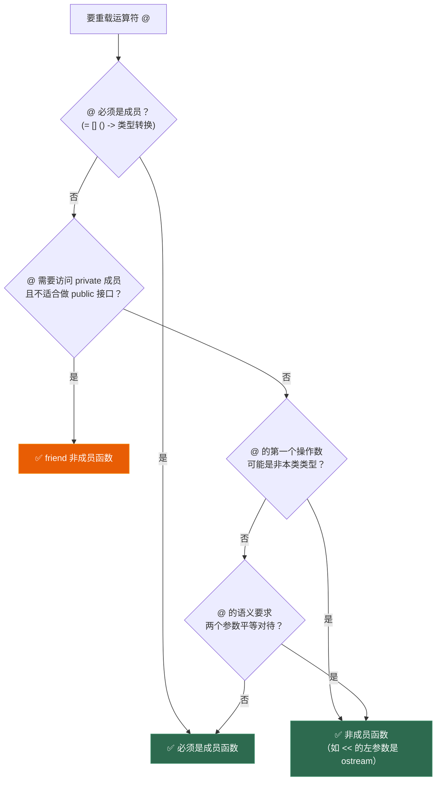
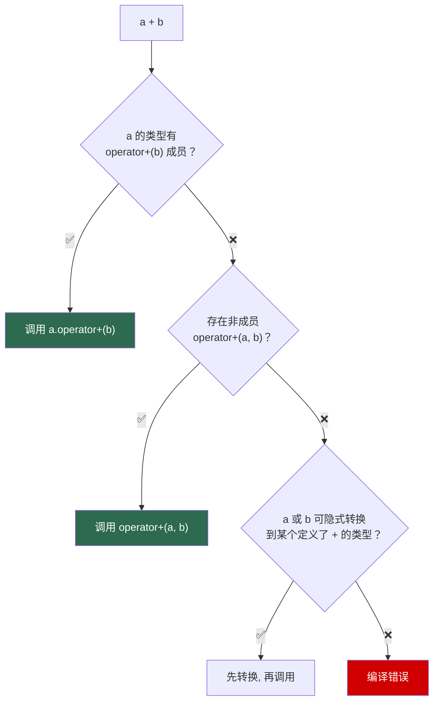

# 第十章 运算符重载：让自定义类型像内置类型一样工作

> **一句话理解**：运算符重载不是必须的技术，但当你希望自己的类型像 `int`、`double` 一样自然使用时，它是必不可少的工具。核心原则：**不要改变运算符的直觉语义**——`+` 应该做加法而不是发网络请求。

---

## 10.1 概念直觉 —— What & Why

### 为什么需要运算符重载？

没有运算符重载的时代：

```cpp
// 没有运算符重载的数学库 —— 丑陋
Vec3 a(1, 2, 3);
Vec3 b(4, 5, 6);
Vec3 c = a.add(b).sub(d).mul(2.0f);   // 链式调用，难以阅读
float d = c.dot(e);

// 有运算符重载 —— 自然
Vec3 a(1, 2, 3);
Vec3 b(4, 5, 6);
Vec3 c = (a + b - d) * 2.0f;           // 读起来像数学公式
float d = c | e;                        // 点积（如果 | 被重载为 dot）
```

运算符重载的两面性：

| 优点 | 风险 |
|------|------|
| 代码自然、可读性高 | 滥用导致语义混乱 |
| 泛型编程的基础（STL 靠 `operator<`、`==` 工作） | 隐式转换 + 运算符重载 = 难以调试 |
| 与模板、移动语义深度配合 | 写错了编译器错误信息极其冗长 |

### 核心规则速览

```cpp
// 🟢 可以重载的 38 个运算符：
// 算术：   +  -  *  /  %  ^  &  |  ~  !  =
// 赋值：   += -= *= /= %= ^= &= |= <<= >>=
// 比较：   <  >  <= >= == != <=>
// 自增减： ++ --
// 位运算： << >> (也是流操作)
// 逻辑：   && ||
// 成员：   ->  ->*  []
// 其他：   ()  ,  new  delete  new[]  delete[]
// 转换：   operator T()

// 🔴 不能重载的 4 个：
// .   (成员访问)
// .*  (成员指针访问)
// ::  (作用域解析)
// ?:  (三元条件)

// 🟡 不能凭空发明的运算符：
// **  ^^  =>  等等都不行，只能用语言定义的 38 个
```

---

## 10.2 原理图解

### 10.2.1 成员 vs 非成员 —— 选择决策



### 10.2.2 a + b 的编译过程



如果成员函数和非成员函数同时存在且都匹配 → **二义性错误**。所以不要同时定义两个版本。

---

## 10.3 底层机制 —— 逐类击破

### 10.3.1 算术运算符（+, -, *, /, %）

**黄金法则**：用非成员函数，返回值（新对象），内部用 `+=` 等复合赋值实现。

```cpp
class Vec3 {
public:
    float x, y, z;
    
    Vec3(float x_ = 0, float y_ = 0, float z_ = 0)
        : x(x_), y(y_), z(z_) {}
    
    // 复合赋值 → 成员函数，返回引用
    Vec3& operator+=(const Vec3& rhs) noexcept {
        x += rhs.x;
        y += rhs.y;
        z += rhs.z;
        return *this;
    }
    
    Vec3& operator*=(float s) noexcept {
        x *= s;
        y *= s;
        z *= s;
        return *this;
    }
};

// 算术运算符 → 非成员，通过 += 实现
// 这样只需要维护复合赋值一处逻辑
inline Vec3 operator+(const Vec3& lhs, const Vec3& rhs) noexcept {
    Vec3 result(lhs);
    result += rhs;
    return result;
}

inline Vec3 operator*(const Vec3& v, float s) noexcept {
    Vec3 result(v);
    result *= s;
    return result;
}

inline Vec3 operator*(float s, const Vec3& v) noexcept {
    return v * s;  // 复用上面的版本
}
```

> 💡 **为什么算术运算符返回新对象而不是引用？** 因为 `a + b` 产生的是一个全新的临时对象，不是 a 也不是 b。返回引用会导致悬垂引用。

### 10.3.2 比较运算符（==, !=, <, >, <=, >=）

**C++20 前**：需要逐个定义 `==`、`!=`、`<`、`>`、`<=`、`>=`。

```cpp
// 传统写法（C++17 及之前）
class Vec3 {
public:
    float x, y, z;
    
    // == 和 != 基于所有成员
    friend bool operator==(const Vec3& a, const Vec3& b) noexcept {
        return a.x == b.x && a.y == b.y && a.z == b.z;
    }
    friend bool operator!=(const Vec3& a, const Vec3& b) noexcept {
        return !(a == b);  // 用 == 实现 !=
    }
    
    // < 用于排序（std::map、std::sort 等）
    friend bool operator<(const Vec3& a, const Vec3& b) noexcept {
        if (a.x != b.x) return a.x < b.x;
        if (a.y != b.y) return a.y < b.y;
        return a.z < b.z;
    }
    // 剩下的 >, <=, >= 都可以用 < 组合出来
    friend bool operator>(const Vec3& a, const Vec3& b) noexcept  { return b < a; }
    friend bool operator<=(const Vec3& a, const Vec3& b) noexcept { return !(b < a); }
    friend bool operator>=(const Vec3& a, const Vec3& b) noexcept { return !(a < b); }
};
```

**C++20 三路比较（Spaceship Operator `<=>`）**：一个运算符搞定所有比较。

```cpp
// C++20 写法 —— 编译器自动生成全部六个比较运算符
class Vec3 {
public:
    float x, y, z;
    
    // = default: 按成员声明顺序逐一比较（类似 std::tie）
    auto operator<=>(const Vec3&) const = default;
    
    // 如果成员全是基本类型，== 也建议 = default
    bool operator==(const Vec3&) const = default;
};

// 以上就是全部！编译器会自动生成：
// ==, !=, <, >, <=, >= 全部六个运算符

// 使用效果
Vec3 a{1, 2, 3}, b{1, 2, 4};
bool result = a < b;   // true（编译器自动生成，比较 x→y→z）
```

```cpp
// 手动实现 <=>（当你的比较逻辑不是简单逐成员时）
struct Score {
    int points;
    int deaths;  // 死亡数越少越好（反向排序）
    
    std::strong_ordering operator<=>(const Score& other) const {
        // 先按 points 降序
        if (auto cmp = other.points <=> points; cmp != 0)
            return cmp;
        // 再按 deaths 升序（death 少 = 好 = 更大）
        return deaths <=> other.deaths;
    }
};

Score a{100, 5}, b{100, 3};
// a: 击杀 100 死亡 5, b: 击杀 100 死亡 3
// b 更好（死亡更少）→ b > a
```

> 💡 **<=> 的三种返回类型**：
> - `std::strong_ordering`：完全可替代（如 int），a == b 意味着 a 和 b 不可区分
> - `std::weak_ordering`：相对等价（如大小写不敏感的字符串），a == b 不意味着不可区分
> - `std::partial_ordering`：部分有序（如 float/double，因为有 NaN），`NaN < 0` 和 `NaN >= 0` 都可能是 false

### 10.3.3 赋值运算符（=, +=, -=, *=, /=）

```cpp
// 拷贝赋值 —— 成员函数，返回引用
class String {
    char* _data;
    size_t _size;
public:
    // 返回 *this 引用，支持链式赋值: a = b = c;
    String& operator=(const String& other) {
        if (this != &other) {               // 防止自赋值
            String temp(other);             // Copy-and-Swap
            swap(temp);
        }
        return *this;
    }
    
    // 移动赋值
    String& operator=(String&& other) noexcept {
        if (this != &other) {
            delete[] _data;
            _data = other._data;
            _size = other._size;
            other._data = nullptr;
            other._size = 0;
        }
        return *this;
    }
    
    // 复合赋值 —— 成员函数，返回引用
    String& operator+=(const String& other) {
        size_t newSize = _size + other._size;
        char* newData = new char[newSize + 1];
        strcpy(newData, _data);
        strcat(newData, other._data);
        delete[] _data;
        _data = newData;
        _size = newSize;
        return *this;
    }
    
    void swap(String& other) noexcept {
        std::swap(_data, other._data);
        std::swap(_size, other._size);
    }
};
```

### 10.3.4 自增/自减（++i, i++）

```cpp
class Iterator {
    int* _ptr;
public:
    // 前置 ++（++it）→ 返回自增后的引用
    Iterator& operator++() noexcept {
        ++_ptr;
        return *this;
    }
    
    // 后置 ++（it++）→ 返回自增前的副本，int 参数是哑元（dummy）
    Iterator operator++(int) noexcept {
        Iterator old(*this);  // 保存旧值
        ++_ptr;               // 调用前置版本
        return old;           // 返回旧值
    }
    
    // 前置 -- 同理
    Iterator& operator--() noexcept {
        --_ptr;
        return *this;
    }
    
    // 后置 --
    Iterator operator--(int) noexcept {
        Iterator old(*this);
        --_ptr;
        return old;
    }
};
```

> 💡 面试中切记：前置返回引用（`T&`），后置返回值（`T`）且接受一个哑元 `int` 参数。后置版本通常调用前置版本实现，避免重复逻辑。

### 10.3.5 下标运算符（operator[]）

```cpp
template <typename T>
class Array {
    T* _data;
    size_t _size;
public:
    // const 版本：const 对象访问
    const T& operator[](size_t i) const {
        assert(i < _size);
        return _data[i];
    }
    
    // 非 const 版本：可修改
    T& operator[](size_t i) {
        assert(i < _size);
        return _data[i];
    }
    
    // ❌ 不要返回临时值的引用
    // T& operator[](size_t i) const { ... }  // 破坏 const 正确性
};
```

### 10.3.6 函数调用运算符（operator()）

```cpp
// 仿函数（Functor）—— 带状态的可调用对象
// C++ 标准库大量使用：std::less<>, std::hash<>, 自定义排序器

// 示例一：自定义排序器
struct ByDistance {
    Vec3 origin;
    bool operator()(const Vec3& a, const Vec3& b) const {
        return (a - origin).length() < (b - origin).length();
    }
};

std::vector<Vec3> points = { ... };
std::sort(points.begin(), points.end(), ByDistance{Vec3{0, 0, 0}});

// 示例二：累计器
struct Accumulator {
    int sum = 0;
    void operator()(int x) { sum += x; }
};

Accumulator acc;
acc = std::for_each(v.begin(), v.end(), acc);
std::cout << acc.sum << std::endl;  // 所有元素的和

// 示例三：多次调用状态机（协程基础）
struct Range {
    int start, end;
    int operator()() {
        if (start < end) return start++;
        throw std::out_of_range("exhausted");
    }
};
Range gen{0, 5};
while (true) {
    try { std::cout << gen() << " "; }
    catch (...) { break; }
}
// 输出: 0 1 2 3 4
```

### 10.3.7 解引用运算符（operator*, operator->）

智能指针的核心。第二章已经展示过手写 `UniquePtr`，这里专注于规律总结。

```cpp
template <typename T>
class Ptr {
    T* _p;
public:
    // operator* → 返回引用
    T& operator*() const { return *_p; }
    
    // operator-> → 返回指针（编译器会自动递归调用 -> 直到遇到裸指针）
    T* operator->() const { return _p; }
};

// operator-> 的特殊行为：
Ptr<Ptr<int>> pp;  // pp-> 调用一次 Ptr::operator->，返回 Ptr<int>*
                   // 编译器发现返回的还是一个对象（Ptr<int>）
                   // → 自动再调用 Ptr<int>::operator->，返回 int*
                   // → 最终访问到 int 的成员

// 这就是智能指针的 operator-> 能链式穿透的原因。
```

### 10.3.8 类型转换运算符（operator T）

```cpp
// 隐式转换运算符 —— 危险！容易引发意料之外的转换
struct Wrapper {
    int _value;
    operator int() const { return _value; }  // 隐式转 int
};

Wrapper w{42};
int x = w;          // 隐式转换
std::cout << w;     // 也工作了！（转为 int 再输出）
auto y = w + 1;     // y = 43，这可能是你想要的，也可能不是

// ✅ C++11 显式转换运算符 —— 安全
struct SafeWrapper {
    int _value;
    explicit operator int() const { return _value; }
};

SafeWrapper sw{42};
// int x = sw;      // ❌ 编译错误！不能隐式转换
int y = static_cast<int>(sw);  // ✅ 必须显式
// 但：if、while、for、!、&&、|| 等需要 bool 的上下文中，
// explicit operator bool 仍然可以隐式工作（contextual conversion）
```

```cpp
// ❌ 经典陷阱：提供太多隐式转换
struct BadString {
    operator const char*() const;  // 转 C 字符串
    operator int() const;          // 转整数？
    // BadString s;
    // s + 1;  // 这不明确！是转为 const char* 做指针算术，还是转为 int 做整数加法？
};

// ✅ 最佳实践：优先用命名函数而非转换运算符
struct GoodString {
    const char* c_str() const;     // 明确、不会意外触发
    int toInt() const;
};
```

### 10.3.9 流运算符（operator<<, operator>>）

```cpp
// 必须是非成员函数（左参数是 std::ostream，不是你的类）
class Point {
    float x, y;
public:
    // 输出到流
    friend std::ostream& operator<<(std::ostream& os, const Point& p) {
        return os << "Point(" << p.x << ", " << p.y << ")";
    }
    
    // 从流读取
    friend std::istream& operator>>(std::istream& is, Point& p) {
        return is >> p.x >> p.y;
    }
};
```

### 10.3.10 new / delete 运算符重载

第一章详细讲过，这里只提面试关键点：

```cpp
// 全局 operator new / delete
void* operator new(size_t size) {
    void* p = std::malloc(size);
    if (!p) throw std::bad_alloc();
    return p;
}

void operator delete(void* p) noexcept {
    std::free(p);
}

// 类内重载 —— 为特定类型定制分配策略
class Pooled {
public:
    static void* operator new(size_t size) {
        return PoolAllocator::allocate(size);
    }
    static void operator delete(void* p) noexcept {
        PoolAllocator::deallocate(p);
    }
};
```

---

## 10.4 经典陷阱与面试题

### 10.4.1 这段代码有什么问题？

**陷阱一：返回局部引用**

```cpp
Vec3& operator+(const Vec3& a, const Vec3& b) {
    Vec3 result(a.x + b.x, a.y + b.y, a.z + b.z);
    return result;  // ❌ 返回局部对象的引用 —— 悬垂！
}
```

**陷阱二：赋值运算符忘了自赋值保护**

```cpp
String& String::operator=(const String& other) {
    delete[] _data;                     // 如果 other 就是 *this？
    _size = other._size;
    _data = new char[_size + 1];
    strcpy(_data, other._data);         // other._data 已被 delete！
    return *this;
}
```

**陷阱三：运算符优先级不直观**

```cpp
// 如果你重载了 operator%
Vec3 v = a + b % c;  // 你以为: (a + b) % c
                     // 实际:   a + (b % c) （% 优先级高于 +）
// 无法改变内置优先级！这是语言硬编码的。
```

**陷阱四：operator&& 和 operator|| 的重载破坏短路**

```cpp
// ❌ 重载 && 和 || 会失去短路求值特性！
struct MyBool {
    bool _v;
    MyBool operator&&(const MyBool& other) const {
        return MyBool{_v && other._v};
    }
};

MyBool a{false}, b{throw std::runtime_error("should not run")};
// 内置 &&：a && b → false（b 不会被求值）
// 重载 &&：a && b → 两个参数都会被求值 → 抛异常！
// 所以：基本上不要重载 && 和 ||
```

**陷阱五：比较运算符不对称**

```cpp
// ❌ 只定义了成员 operator<
struct Data {
    int id;
    bool operator<(const Data& other) const { return id < other.id; }
};

Data d{1};
d < 2;   // ✅ 如果 Data(int) 不是 explicit
2 < d;   // ❌ 编译错误！int 没有 operator<(int, Data)

// ✅ 用非成员函数解决对称性
bool operator<(const Data& a, const Data& b) { return a.id < b.id; }
```

---

## 10.5 游戏实战场景

### 10.5.1 游戏数学库

```cpp
// 游戏中最常见的运算符重载场景
struct Vector2 {
    float x = 0, y = 0;
    
    Vector2() = default;
    Vector2(float x_, float y_) : x(x_), y(y_) {}
    
    // 复合赋值
    Vector2& operator+=(Vector2 v) noexcept { x += v.x; y += v.y; return *this; }
    Vector2& operator-=(Vector2 v) noexcept { x -= v.x; y -= v.y; return *this; }
    Vector2& operator*=(float s)   noexcept { x *= s;   y *= s;   return *this; }
    Vector2& operator/=(float s)   noexcept { x /= s;   y /= s;   return *this; }
    
    // 比较（C++20）
    auto operator<=>(const Vector2&) const = default;
};

// 算术（非成员）
inline Vector2 operator+(Vector2 a, Vector2 b) noexcept { return a += b; }
inline Vector2 operator-(Vector2 a, Vector2 b) noexcept { return a -= b; }
inline Vector2 operator*(Vector2 v, float s)  noexcept { return v *= s; }
inline Vector2 operator*(float s, Vector2 v)  noexcept { return v *= s; }
inline Vector2 operator/(Vector2 v, float s)  noexcept { return v /= s; }

// 一元负号
inline Vector2 operator-(Vector2 v) noexcept { return {-v.x, -v.y}; }

// 点积（用 | 或命名函数；很多人认为用运算符表示点积是滥用）
inline float dot(Vector2 a, Vector2 b) noexcept { return a.x * b.x + a.y * b.y; }

// 在游戏代码中的使用体验
Vector2 position(100, 200);
Vector2 velocity(5, -2);
float dt = 0.016f;

position += velocity * dt;    // 读起来就是物理公式
Vector2 nextPos = position + velocity * dt;  // 更清晰
```

### 10.5.2 自定义迭代器 —— 遍历场景树

```cpp
// 为自定义数据结构实现迭代器，让 range-for 能工作
class SceneNode {
    std::vector<SceneNode*> _children;
public:
    class Iterator {
        SceneNode** _ptr;
    public:
        explicit Iterator(SceneNode** p) : _ptr(p) {}
        
        SceneNode& operator*()  const { return **_ptr; }
        SceneNode* operator->() const { return *_ptr; }
        
        Iterator& operator++()    noexcept { ++_ptr; return *this; }
        Iterator  operator++(int) noexcept { return Iterator(_ptr++); }
        
        bool operator==(const Iterator& other) const noexcept { return _ptr == other._ptr; }
        bool operator!=(const Iterator& other) const noexcept { return _ptr != other._ptr; }
    };
    
    Iterator begin() { return Iterator(_children.data()); }
    Iterator end()   { return Iterator(_children.data() + _children.size()); }
};

// 使用：原生 range-for
SceneNode node;
for (auto& child : node) {
    child.update();
}
```

### 10.5.3 Handle 系统的运算符支持

```cpp
// 联动第五章的 Handle 系统，加入运算符让 Handle 用起来像指针
template <typename T>
class Handle {
    uint32_t _index;
    uint32_t _generation;
public:
    // operator-> 和 operator* —— 像指针一样访问
    T* operator->() {
        return ObjectPool<T>::get(_index, _generation);
    }
    T& operator*() {
        return *operator->();
    }
    
    // operator bool —— 判断 Handle 是否有效
    explicit operator bool() const {
        return ObjectPool<T>::isValid(_index, _generation);
    }
    
    // operator== —— 比较两个 Handle 是否指向同一对象
    bool operator==(const Handle& other) const noexcept {
        return _index == other._index && _generation == other._generation;
    }
    bool operator!=(const Handle& other) const noexcept {
        return !(*this == other);
    }
};

// 使用体验
Handle<Entity> entity = world.spawn();
if (entity) {
    entity->setPosition(1, 2, 3);  // 像指针
    (*entity).setPosition(1, 2, 3); // 等价写法
}
```

---

## 10.6 30 秒速答

**Q：哪些运算符必须重载为成员函数？**

> `=`（赋值）、`[]`（下标）、`()`（函数调用）、`->`（成员访问）、类型转换运算符（`operator T()`）。这五个必须是成员函数，不能作为非成员函数重载。

**Q：什么情况用成员函数，什么情况用非成员？**

> 如果运算符要求左操作数是本类类型且需要修改对象（如 `+=`、`++`），用成员函数。如果要求对称性（如 `+`、`==`，左操作数可能不是本类类型），用非成员函数。`<<` 和 `>>` 因为左操作数是 `std::ostream`/`std::istream`，只能用非成员（或 friend）。

**Q：C++20 的 `<=>` 有什么用？**

> 定义 `operator<=>`（三路比较 / Spaceship），编译器会自动生成 `==`、`!=`、`<`、`>`、`<=`、`>=` 全部六个比较运算符。还可以 `= default` 让编译器帮你逐成员比较，省掉大量样板代码。

**Q：为什么不要重载 `&&` 和 `||`？**

> 内置 `&&` 和 `||` 有短路求值特性（左侧为 false 时不求值右侧）。重载后变成普通函数调用，两个参数都会被求值，破坏了使用者对短路的所有预期，极易引发 bug。

**Q：`operator++()` 和 `operator++(int)` 的区别？**

> 前者是前置自增（`++x`），返回引用；后者是后置自增（`x++`），返回旧值的副本，`int` 参数是哑元仅用于区分签名。后置版本通常调用前置版本实现。

**Q：什么是 ADL（Argument-Dependent Lookup）？**

> 当调用一个函数时，编译器除了在当前作用域查找，还会在**函数参数类型所在的命名空间**中查找。这就是为什么 `std::cout << "hello"` 能找到 `std::operator<<(ostream&, const char*)`，以及为什么你定义的 `operator+` 放在和 `Vec3` 同一个命名空间中就能被找到，而不需要 `using`。

---

> 📖 上一章：[第九章 异常处理与异常安全](../09_exception_handling) —— 栈展开、异常安全三大保证、noexcept 与移动语义的联动、游戏资源加载的错误恢复。

> 📖 下一章：敬请期待 —— C# 系列即将上线。
