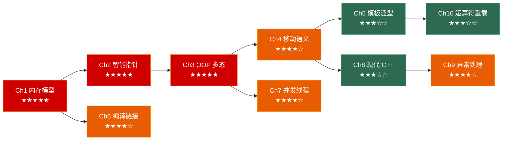

# C++ 面试突击：从语法到底层

> 面向**游戏客户端开发岗**的 C++ 深入笔记系列。每章覆盖：原理图解 → 底层剖析 → 经典陷阱 → 🎮 游戏实战 → 30 秒速答。

---

## 系列全景



---

## 各章速览

| 章节 | 主题 | 面试权重 | 核心考点 |
|------|------|---------|---------|
| [**第一章**](../01_memory_model) | 内存模型与对象布局 | ★★★★★ | 五大内存区、字节对齐、new/delete、对象池 |
| [**第二章**](../02_pointers_and_smart_pointers) | 指针、引用与智能指针 | ★★★★★ | unique/shared/weak_ptr、循环引用、RAII |
| [**第三章**](../03_oop_and_polymorphism) | OOP 深入：虚函数与多态 | ★★★★★ | vtable/vptr、多继承布局、四种 cast、ECS |
| [**第四章**](../04_move_semantics) | 值类别、移动语义与完美转发 | ★★★★☆ | 左值右值、std::move、RVO、emplace_back |
| [**第五章**](../05_templates) | 模板与泛型编程 | ★★★☆☆ | SFINAE、变参模板、if constexpr、Concepts |
| [**第六章**](../06_compilation_and_linking) | 编译、链接与构建 | ★★★★☆ | 四阶段流程、ODR、static 五种含义、热重载 |
| [**第七章**](../07_concurrency) | 并发与多线程 | ★★★★☆ | mutex、atomic、条件变量、无锁队列、线程池 |
| [**第八章**](../08_modern_cpp) | 现代 C++ 特性精选 | ★★★☆☆ | auto、Lambda、optional/variant、协程 |
| [**第九章**](../09_exception_handling) | 异常处理与异常安全 | ★★★★☆ | 栈展开、三种安全保证、noexcept、构造/析构异常 |
| [**第十章**](../10_operator_overloading) | 运算符重载 | ★★★☆☆ | 成员/非成员选择、三路比较<=>、ADL、类型转换运算符 |

---

## 推荐阅读路线

### 🚀 面试急救（3 天）

> 时间紧迫？按面试权重从高到低刷：

```
Day 1: Ch1 内存模型 → Ch2 智能指针 → Ch3 OOP 多态
Day 2: Ch4 移动语义 → Ch6 编译链接
Day 3: Ch7 并发多线程 → Ch9 异常处理 → Ch8 8.2~8.3
```

### 📚 系统掌握（2 周）

> 每天 1 小时，按章节顺序 Ch1→Ch8 完整阅读 + 手写代码验证。

### 🎮 游戏开发重点

> 已有 C++ 基础？重点看游戏实战场景：

- **内存管理**：Ch1 对象池 / 帧分配器、Ch2 自定义 deleter
- **架构设计**：Ch3 ECS vs 继承、Ch5 泛型对象池 / Handle 系统
- **性能优化**：Ch4 RVO / emplace、Ch7 无锁队列 / SPSC
- **工程实践**：Ch6 热重载 / 插件系统、Ch8 协程对话系统、Ch9 资源加载异常安全
- **数学与迭代**：Ch10 数学库运算符重载 / 自定义迭代器

---

## 系列特色

- 🧠 **面试导向**：每章的"30 秒速答"可直接用于面试口述
- 🎮 **游戏实战**：所有示例围绕游戏引擎、ECS、渲染管线
- 📊 **图解原理**：Mermaid 图解内存布局、编译流程、线程同步
- ⚠️ **陷阱速查**："这段代码有什么问题？" 系列覆盖高频考点
- 🔗 **交叉引用**：章节间深度关联（如 Ch5 模板 + Ch1 placement new + Ch4 完美转发 = 泛型对象池；Ch9 异常安全 + Ch4 noexcept = vector 扩容策略）
