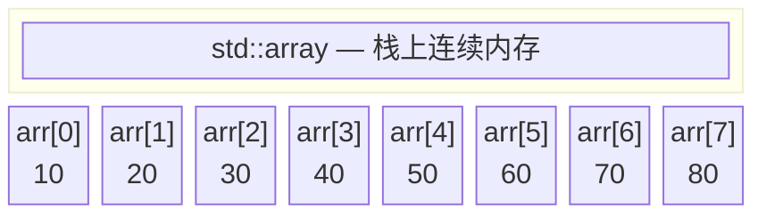
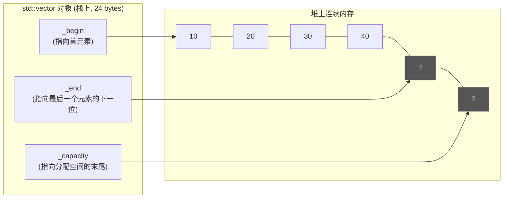
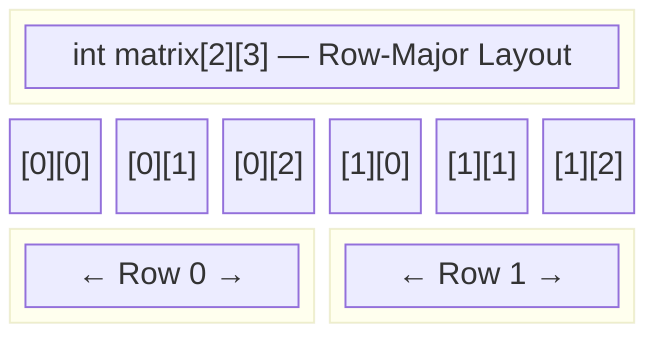
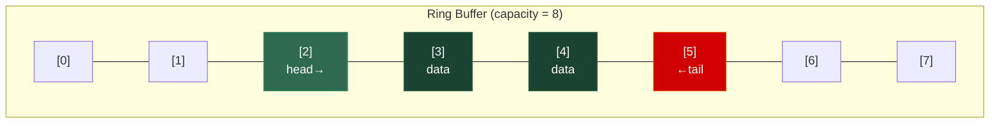
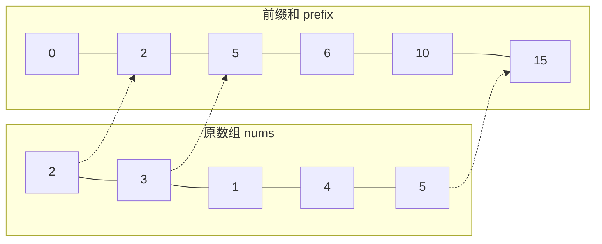

# 第一章 数组 (Array)

> **一句话理解**：数组，就是一段**连续内存**上排列的同类型元素。它是计算机硬件最偏爱的数据结构——没有之一。

---

## 1.1 概念直觉 —— What & Why

### 什么是数组？

数组是最古老、最基础的数据结构。它的定义极简：

- **连续的内存空间**
- **相同类型的元素**
- **通过下标（index）随机访问**

就这么三条。但正因为简单，它和 CPU 的硬件特性配合得天衣无缝。

### 为什么数组快？—— Cache Line 的秘密

现代 CPU 不会一次只读一个字节。当你访问内存地址 `0x1000` 时，CPU 会把从 `0x1000` 开始的一整个 **Cache Line**（通常 64 字节）一次性拉进 L1 缓存。

```
┌─────────────────────────────────────────────────────────┐
│                  CPU Cache Line (64 bytes)              │
│  arr[0]  arr[1]  arr[2]  arr[3]  ...  arr[15]           │
│   4B      4B      4B      4B           4B               │
└─────────────────────────────────────────────────────────┘
```

当你遍历一个 `int` 数组时，访问 `arr[0]` 的同时，`arr[1]` 到 `arr[15]` 已经被预取到缓存了。接下来 15 次访问全部命中 L1 缓存——这就是 **Spatial Locality（空间局部性）**。

**链表就享受不到这个待遇**。链表的每个节点可能散布在内存的任意位置，每次访问下一个节点都可能引发 cache miss。这就是为什么：

> 💡 在数据量较小、遍历频繁的场景下，数组几乎总是比链表快——即使理论复杂度相同。

### 数组 vs 其他结构的定位

| 需求 | 数组 | 链表 | 哈希表 |
|------|------|------|--------|
| 随机访问 | ✅ O(1) | ❌ O(n) | ✅ O(1) 均摊 |
| 尾部插入 | ✅ O(1) 均摊 | ✅ O(1) | ✅ O(1) 均摊 |
| 中间插入 | ❌ O(n) | ✅ O(1) | N/A |
| 内存连续 | ✅ | ❌ | ❌ |
| 缓存友好 | ✅✅✅ | ❌ | ❌ |

---

## 1.2 结构图解

### 静态数组的内存布局



> 地址计算公式：`addr(arr[i]) = base_addr + i * sizeof(element)`
>
> 这就是 O(1) 随机访问的本质——**一次乘法 + 一次加法**。

### `std::vector` 的内部结构

`std::vector` 是 C++ 中最常用的动态数组。它在堆上管理一段连续内存，用三个指针维护状态：



```
size()     = _end - _begin      // 当前元素个数 = 4
capacity() = _capacity - _begin // 已分配容量 = 6
```

### 多维数组的内存布局

C/C++ 的多维数组采用 **Row-Major（行优先）** 布局：



> 💡 **面试考点**：遍历二维数组时，**按行遍历**（`for i → for j`）远比按列遍历快，因为行内元素在内存中连续，缓存命中率高。这是一道经典的性能优化面试题。

---

## 1.3 C++ 底层实现

### 1.3.1 `std::array` —— 编译期固定大小

`std::array` 是 C++11 引入的对原始 C 数组的封装。它在栈上分配，大小编译期确定：

```cpp
#include <array>

// 底层本质上就是一个结构体包了一个 C 数组
// 简化版实现：
template <typename T, std::size_t N>
struct array {
    T _data[N];  // 就这么简单

    // 接口包装
    constexpr T& operator[](std::size_t i) { return _data[i]; }
    constexpr std::size_t size() const noexcept { return N; }
    constexpr T* data() noexcept { return _data; }
    
    // 迭代器
    constexpr T* begin() noexcept { return _data; }
    constexpr T* end() noexcept { return _data + N; }
};
```

**为什么用 `std::array` 而不用 C 数组？**

```cpp
// C 数组的问题
int arr[5] = {1, 2, 3, 4, 5};
// 传递给函数时退化成指针，丢失大小信息：
void foo(int arr[]) {  // 实际上是 int*，sizeof(arr) == 8 ❌
    // 无法知道数组长度！
}

// std::array 不退化
std::array<int, 5> arr = {1, 2, 3, 4, 5};
void foo(const std::array<int, 5>& arr) {
    arr.size();  // ✅ 始终知道长度是 5
}
```

**何时用 `std::array`？**
- 大小编译期已知且不会变
- 需要栈分配（高性能、无堆开销）
- 需要 STL 接口（`begin/end`、`size`）

---

### 1.3.2 `std::vector` —— 动态数组，C++ 的瑞士军刀

`std::vector` 是 C++ 最常用的容器，没有之一。面试中 90% 的数组题都用它。

#### 核心源码解析（精简版）

```cpp
template <typename T, typename Allocator = std::allocator<T>>
class vector {
    T* _begin;      // 指向第一个元素
    T* _end;        // 指向最后一个元素的下一位（past-the-end）
    T* _capacity;   // 指向分配内存块的末尾

public:
    // ========== 容量查询 ==========
    size_t size() const     { return _end - _begin; }
    size_t capacity() const { return _capacity - _begin; }
    bool empty() const      { return _begin == _end; }

    // ========== 元素访问 ==========
    T& operator[](size_t i)       { return _begin[i]; }        // 不做越界检查！
    T& at(size_t i) {                                           // 做越界检查
        if (i >= size()) throw std::out_of_range("vector::at");
        return _begin[i];
    }
    T& front() { return *_begin; }
    T& back()  { return *(_end - 1); }
    T* data()  { return _begin; }       // 获取底层裸指针

    // ========== 尾部操作 ==========
    void push_back(const T& value) {
        if (_end == _capacity) {
            // 容量不足，需要扩容！
            _grow();
        }
        *_end = value;      // 在 _end 位置构造元素
        ++_end;             // 移动 _end 指针
    }

    void pop_back() {
        --_end;
        _end->~T();          // 析构最后一个元素
    }

    // ========== 扩容核心 ==========
    void _grow() {
        size_t old_cap = capacity();
        size_t new_cap = old_cap == 0 ? 1 : old_cap * 2;  // GCC: 2倍扩容
        // MSVC: old_cap + old_cap / 2 (1.5倍扩容)

        T* new_buf = allocator.allocate(new_cap);          // 1. 分配新内存
        std::uninitialized_move(_begin, _end, new_buf);    // 2. 移动旧元素
        allocator.deallocate(_begin, old_cap);              // 3. 释放旧内存

        _end = new_buf + size();
        _begin = new_buf;
        _capacity = new_buf + new_cap;
    }
};
```

#### 扩容策略深入

| 编译器 | 扩容因子 | 示例 (初始 cap=1) |
|--------|----------|-------------------|
| **GCC (libstdc++)** | 2x | 1 → 2 → 4 → 8 → 16 → 32 |
| **MSVC (STL)** | 1.5x | 1 → 2 → 3 → 4 → 6 → 9 → 13 |
| **Clang (libc++)** | 2x | 同 GCC |

**为什么 MSVC 用 1.5x？**

2x 扩容有个问题：每次扩容后释放的旧内存块之和 (1 + 2 + 4 + ... + n/2 = n - 1) 永远小于新分配的块 (n)，所以旧内存**永远不够**重用。

1.5x 扩容在几轮之后，旧内存块的总和会超过新块大小，内存分配器有机会重用旧内存，减少内存碎片。

> 💡 **面试中的表述**："vector 扩容时会分配新的更大的内存块，将元素搬过去，释放旧空间。时间复杂度均摊 O(1)，但单次扩容是 O(n)。如果能预估大小，应该提前 `reserve` 避免多次扩容。"

#### `reserve` vs `resize` vs `shrink_to_fit`

```cpp
std::vector<int> v;

// reserve：只分配内存，不创建元素
v.reserve(1000);      // capacity = 1000, size = 0
                       // 适合：你知道大概要放多少元素

// resize：改变 size，可能创建/销毁元素
v.resize(100);         // capacity = 1000, size = 100
                       // 新元素被值初始化（int → 0）

v.resize(50);          // capacity = 1000, size = 50
                       // 后 50 个元素被析构

// shrink_to_fit：尝试释放多余内存（非强制）
v.shrink_to_fit();     // capacity ≈ 50, size = 50 (实现可以忽略这个请求)
```

#### 迭代器失效 —— 面试重灾区

**什么操作会导致迭代器失效？**

| 操作 | 是否失效 | 原因 |
|------|----------|------|
| `push_back` (未扩容) | 只有 `end()` 失效 | end 后移 |
| `push_back` (触发扩容) | **全部失效** | 内存地址变了！ |
| `insert` | **全部失效** | 可能扩容 + 元素搬移 |
| `erase` | 被删元素及之后的失效 | 后面的元素前移 |
| `clear` | **全部失效** | 所有元素被销毁 |
| `reserve` (扩容时) | **全部失效** | 内存地址变了 |
| `operator[]` / `at` | 不失效 | 只读/写元素 |

```cpp
// ❌ 经典错误：遍历中删除元素
std::vector<int> v = {1, 2, 3, 4, 5};
for (auto it = v.begin(); it != v.end(); ++it) {
    if (*it % 2 == 0) {
        v.erase(it);  // it 失效了！下一次 ++it 是未定义行为
    }
}

// ✅ 正确做法 1：erase 返回下一个有效迭代器
for (auto it = v.begin(); it != v.end(); ) {
    if (*it % 2 == 0) {
        it = v.erase(it);  // erase 返回下一个有效迭代器
    } else {
        ++it;
    }
}

// ✅ 正确做法 2：erase-remove idiom (C++17 更推荐 std::erase_if)
v.erase(std::remove_if(v.begin(), v.end(),
    [](int x) { return x % 2 == 0; }), v.end());

// ✅ 正确做法 3：C++20 std::erase_if
std::erase_if(v, [](int x) { return x % 2 == 0; });
```

---

### 1.3.3 Ring Buffer（环形缓冲区）

环形缓冲区是一种逻辑上首尾相连的数组。它用**两个指针** `head` 和 `tail` 来标记读写位置，写满时覆盖最旧的数据（或阻塞）。



#### 手写实现

```cpp
#include <array>
#include <optional>
#include <stdexcept>

template <typename T, std::size_t Capacity>
class RingBuffer {
    static_assert(Capacity > 0, "Capacity must be > 0");

    std::array<T, Capacity> _buf{};
    std::size_t _head = 0;     // 下一个读取的位置
    std::size_t _tail = 0;     // 下一个写入的位置
    std::size_t _size = 0;     // 当前元素数量

    std::size_t _next(std::size_t idx) const {
        return (idx + 1) % Capacity;
    }

public:
    // 写入：如果满了，覆盖最旧的元素（适用于游戏帧缓冲场景）
    void push(const T& value) {
        _buf[_tail] = value;
        _tail = _next(_tail);

        if (_size == Capacity) {
            _head = _next(_head);  // 满了，头部前移（丢弃最旧元素）
        } else {
            ++_size;
        }
    }

    // 读取并移除最旧的元素
    std::optional<T> pop() {
        if (_size == 0) return std::nullopt;

        T value = _buf[_head];
        _head = _next(_head);
        --_size;
        return value;
    }

    // 查看最旧的元素（不移除）
    std::optional<T> peek() const {
        if (_size == 0) return std::nullopt;
        return _buf[_head];
    }

    std::size_t size() const { return _size; }
    bool empty() const { return _size == 0; }
    bool full() const { return _size == Capacity; }

    // 获取倒数第 n 个元素（0 = 最新的）
    // 游戏中常用：获取"前 N 帧"的数据
    const T& back(std::size_t n = 0) const {
        if (n >= _size) throw std::out_of_range("RingBuffer::back");
        std::size_t idx = (_tail + Capacity - 1 - n) % Capacity;
        return _buf[idx];
    }
};
```

**使用示例**：

```cpp
RingBuffer<float, 120> frame_times;  // 存储最近 120 帧的帧时间

// 每帧写入
frame_times.push(delta_time);

// 计算最近 60 帧的平均帧时间
float sum = 0.0f;
int count = std::min<int>(60, frame_times.size());
for (int i = 0; i < count; ++i) {
    sum += frame_times.back(i);
}
float avg_frame_time = sum / count;
float fps = 1.0f / avg_frame_time;
```

---

## 1.4 复杂度速查表

### `std::array` 复杂度

| 操作 | 时间复杂度 | 说明 |
|------|-----------|------|
| `operator[]` / `at` | O(1) | 直接地址计算 |
| `front` / `back` | O(1) | |
| `size` | O(1) | 编译期常量 |
| `fill` | O(n) | 遍历赋值 |
| `swap` | O(n) | 逐元素交换（不是指针交换！）|

### `std::vector` 复杂度

| 操作 | 时间复杂度 | 备注 |
|------|-----------|------|
| `operator[]` / `at` | **O(1)** | 随机访问核心优势 |
| `front` / `back` | O(1) | |
| `push_back` | **O(1) 均摊** | 单次扩容 O(n)，但均摊 O(1) |
| `pop_back` | O(1) | |
| `insert` (中间) | **O(n)** | 需要搬移后续元素 |
| `erase` (中间) | **O(n)** | 需要搬移后续元素 |
| `insert` / `erase` (尾部) | O(1) | |
| `find` (线性查找) | O(n) | 无序数组 |
| `binary_search` (已排序) | O(log n) | 需要先排序 |
| `sort` | **O(n log n)** | `std::sort` 用 introsort |
| `reserve` | O(n) 或 O(1) | 扩容时 O(n)，不扩容时 O(1) |
| `resize` | O(n) | 可能构造/析构元素 |
| `clear` | O(n) | 析构所有元素 (POD 类型优化为 O(1)) |
| `swap` | **O(1)** | 只交换三个指针！|

### 横向对比

| 操作 | `array` | `vector` | `deque` | `list` |
|------|---------|----------|---------|--------|
| 随机访问 | O(1) | O(1) | O(1) | ❌ O(n) |
| 头部插入 | ❌ | O(n) | **O(1)** | O(1) |
| 尾部插入 | ❌ | O(1)* | O(1)* | O(1) |
| 中间插入 | ❌ | O(n) | O(n) | O(1)** |
| 缓存友好 | ✅✅✅ | ✅✅✅ | ✅✅ | ❌ |
| 内存连续 | ✅ | ✅ | 分段连续 | ❌ |

> `*` 均摊 O(1)  
> `**` 指已有迭代器的情况

---

## 1.5 面试高频题

### 1.5.1 双指针 —— 数组面试的万金油

双指针是数组题中出现频率最高的技巧。根据指针移动方向可分为：

- **同向双指针**（快慢指针）：一个走得快，一个走得慢
- **对向双指针**：从两端向中间移动
- **背向双指针**：从中间向两端扩散（常用于回文）

#### 经典题：移除元素 (LeetCode 27)

> 给定数组 `nums` 和值 `val`，原地移除所有值等于 `val` 的元素，返回新长度。

```cpp
// 快慢指针：slow 维护结果数组的边界
int removeElement(std::vector<int>& nums, int val) {
    int slow = 0;
    for (int fast = 0; fast < nums.size(); ++fast) {
        if (nums[fast] != val) {
            nums[slow] = nums[fast];
            ++slow;
        }
    }
    return slow;  // slow 就是新长度
}
// 时间 O(n), 空间 O(1)
```

#### 经典题：两数之和 II — 有序数组 (LeetCode 167)

> 给定**已排序**数组，找到两个数使其和等于 target。

```cpp
// 对向双指针：利用有序性收缩范围
std::vector<int> twoSum(std::vector<int>& nums, int target) {
    int left = 0, right = nums.size() - 1;
    while (left < right) {
        int sum = nums[left] + nums[right];
        if (sum == target) {
            return {left + 1, right + 1};  // 题目要求 1-indexed
        } else if (sum < target) {
            ++left;   // 和太小，左指针右移
        } else {
            --right;  // 和太大，右指针左移
        }
    }
    return {};  // 题目保证有解
}
// 时间 O(n), 空间 O(1)
```

#### 经典题：三数之和 (LeetCode 15)

> 找出数组中所有和为 0 的三元组，不能重复。

```cpp
std::vector<std::vector<int>> threeSum(std::vector<int>& nums) {
    std::vector<std::vector<int>> result;
    std::sort(nums.begin(), nums.end());  // 必须先排序

    for (int i = 0; i < static_cast<int>(nums.size()) - 2; ++i) {
        if (i > 0 && nums[i] == nums[i - 1]) continue;  // 跳过重复

        int left = i + 1, right = static_cast<int>(nums.size()) - 1;
        while (left < right) {
            int sum = nums[i] + nums[left] + nums[right];
            if (sum == 0) {
                result.push_back({nums[i], nums[left], nums[right]});
                // 跳过重复值
                while (left < right && nums[left] == nums[left + 1]) ++left;
                while (left < right && nums[right] == nums[right - 1]) --right;
                ++left; --right;
            } else if (sum < 0) {
                ++left;
            } else {
                --right;
            }
        }
    }
    return result;
}
// 时间 O(n²), 空间 O(1)（不算结果）
```

---

### 1.5.2 滑动窗口 —— 子数组/子串问题的利器

滑动窗口的核心思想：维护一个窗口 `[left, right]`，`right` 扩大窗口探索新元素，`left` 收缩窗口满足约束。

#### 模板

```cpp
int slidingWindow(std::vector<int>& nums) {
    int left = 0;
    int result = 0;
    // 窗口状态（根据题目定义，可能是 sum、map、set 等）
    int window_state = 0;

    for (int right = 0; right < nums.size(); ++right) {
        // 1. 扩大窗口：加入 nums[right]
        window_state += nums[right];

        // 2. 收缩窗口：当窗口不满足条件时
        while (/* 窗口不满足条件 */) {
            window_state -= nums[left];
            ++left;
        }

        // 3. 更新结果
        result = std::max(result, right - left + 1);
    }
    return result;
}
```

#### 经典题：长度最小的子数组 (LeetCode 209)

> 找到元素和 ≥ target 的**最短**连续子数组长度。

```cpp
int minSubArrayLen(int target, std::vector<int>& nums) {
    int left = 0;
    int sum = 0;
    int min_len = INT_MAX;

    for (int right = 0; right < nums.size(); ++right) {
        sum += nums[right];

        while (sum >= target) {
            min_len = std::min(min_len, right - left + 1);
            sum -= nums[left];
            ++left;
        }
    }
    return min_len == INT_MAX ? 0 : min_len;
}
// 时间 O(n), 空间 O(1)
```

#### 经典题：最大连续 1 的个数 III (LeetCode 1004)

> 最多翻转 k 个 0 为 1，求最长连续 1 的长度。

```cpp
int longestOnes(std::vector<int>& nums, int k) {
    int left = 0, zeros = 0, max_len = 0;

    for (int right = 0; right < nums.size(); ++right) {
        if (nums[right] == 0) ++zeros;

        while (zeros > k) {
            if (nums[left] == 0) --zeros;
            ++left;
        }

        max_len = std::max(max_len, right - left + 1);
    }
    return max_len;
}
// 时间 O(n), 空间 O(1)
```

---

### 1.5.3 前缀和 —— 区间查询的预处理神器

**核心思想**：预处理一个前缀和数组 `prefix[i] = nums[0] + nums[1] + ... + nums[i-1]`，
然后任意区间 `[l, r]` 的和 = `prefix[r+1] - prefix[l]`，O(1) 查询。



```
区间 [1, 3] 的和 = prefix[4] - prefix[1] = 10 - 2 = 8
验证：nums[1] + nums[2] + nums[3] = 3 + 1 + 4 = 8 ✅
```

#### 经典题：和为 K 的子数组 (LeetCode 560)

> 统计数组中和为 k 的连续子数组个数。

```cpp
int subarraySum(std::vector<int>& nums, int k) {
    // 前缀和 + 哈希表
    // 核心：如果 prefix[j] - prefix[i] == k，说明 [i, j) 的和为 k
    //       即寻找之前出现过的 prefix[i] == prefix[j] - k
    std::unordered_map<int, int> prefix_count;
    prefix_count[0] = 1;  // 前缀和为 0 出现 1 次（空子数组）

    int sum = 0, count = 0;
    for (int num : nums) {
        sum += num;
        if (prefix_count.count(sum - k)) {
            count += prefix_count[sum - k];
        }
        ++prefix_count[sum];
    }
    return count;
}
// 时间 O(n), 空间 O(n)
```

---

### 1.5.4 原地操作 —— 空间 O(1) 的艺术

面试官常见追问："能不能不用额外空间？"

#### 经典题：旋转数组 (LeetCode 189)

> 将数组右移 k 位。`[1,2,3,4,5,6,7]`，k=3 → `[5,6,7,1,2,3,4]`

```cpp
// 三次翻转法：优雅且 O(1) 空间
void rotate(std::vector<int>& nums, int k) {
    int n = nums.size();
    k %= n;  // 处理 k > n 的情况
    
    // [1,2,3,4,5,6,7]
    std::reverse(nums.begin(), nums.end());            // [7,6,5,4,3,2,1]
    std::reverse(nums.begin(), nums.begin() + k);      // [5,6,7,4,3,2,1]
    std::reverse(nums.begin() + k, nums.end());        // [5,6,7,1,2,3,4]
}
// 时间 O(n), 空间 O(1)
```

> 💡 **面试技巧**：三次翻转法适用于所有"循环移位"类问题。记住这个模式：**全翻 → 前段翻 → 后段翻**。

#### 经典题：螺旋矩阵 (LeetCode 54)

> 按螺旋顺序输出矩阵中的所有元素。

```cpp
std::vector<int> spiralOrder(std::vector<std::vector<int>>& matrix) {
    std::vector<int> result;
    if (matrix.empty()) return result;

    int top = 0, bottom = matrix.size() - 1;
    int left = 0, right = matrix[0].size() - 1;

    while (top <= bottom && left <= right) {
        // → 从左到右（上边界）
        for (int j = left; j <= right; ++j)
            result.push_back(matrix[top][j]);
        ++top;

        // ↓ 从上到下（右边界）
        for (int i = top; i <= bottom; ++i)
            result.push_back(matrix[i][right]);
        --right;

        // ← 从右到左（下边界）
        if (top <= bottom) {
            for (int j = right; j >= left; --j)
                result.push_back(matrix[bottom][j]);
            --bottom;
        }

        // ↑ 从下到上（左边界）
        if (left <= right) {
            for (int i = bottom; i >= top; --i)
                result.push_back(matrix[i][left]);
            ++left;
        }
    }
    return result;
}
// 时间 O(m*n), 空间 O(1)（不算结果）
```

---

### 1.5.5 二分查找 —— 有序数组的终极武器

二分查找本质上就是利用数组的**随机访问** + **有序性**。

#### 标准模板（左闭右闭）

```cpp
// 找 target，返回下标，不存在返回 -1
int binarySearch(const std::vector<int>& nums, int target) {
    int left = 0, right = nums.size() - 1;  // [left, right] 左闭右闭

    while (left <= right) {  // 注意：<= 因为 right 是闭区间
        int mid = left + (right - left) / 2;  // 防溢出写法
        if (nums[mid] == target) {
            return mid;
        } else if (nums[mid] < target) {
            left = mid + 1;
        } else {
            right = mid - 1;
        }
    }
    return -1;
}
```

#### `lower_bound` / `upper_bound` —— 工程中更常用

```cpp
// lower_bound：找第一个 >= target 的位置
// upper_bound：找第一个 >  target 的位置
// 二者的差就是 target 出现的次数

auto it_lo = std::lower_bound(v.begin(), v.end(), target);
auto it_hi = std::upper_bound(v.begin(), v.end(), target);
int count = it_hi - it_lo;  // target 在数组中出现了多少次
```

#### 经典题：搜索旋转排序数组 (LeetCode 33)

> 在被旋转过的有序数组中搜索。`[4,5,6,7,0,1,2]`，target=0 → 返回 4。

```cpp
int search(std::vector<int>& nums, int target) {
    int left = 0, right = nums.size() - 1;

    while (left <= right) {
        int mid = left + (right - left) / 2;
        if (nums[mid] == target) return mid;

        // 判断哪一半是有序的
        if (nums[left] <= nums[mid]) {
            // 左半段有序
            if (nums[left] <= target && target < nums[mid]) {
                right = mid - 1;  // target 在左半段
            } else {
                left = mid + 1;   // target 在右半段
            }
        } else {
            // 右半段有序
            if (nums[mid] < target && target <= nums[right]) {
                left = mid + 1;   // target 在右半段
            } else {
                right = mid - 1;  // target 在左半段
            }
        }
    }
    return -1;
}
// 时间 O(log n), 空间 O(1)
```

---

### 1.5.6 Kadane 算法 —— 最大子数组和 (LeetCode 53)

> 给定整数数组，找到具有最大和的连续子数组，返回其最大和。

这道题是 DP / 贪心的经典入门，也是数组类面试的高频题之一。

```cpp
int maxSubArray(std::vector<int>& nums) {
    int max_sum = nums[0];
    int current_sum = nums[0];

    for (int i = 1; i < static_cast<int>(nums.size()); ++i) {
        // 核心决策：接上前面的子数组，还是从"我"重新开始？
        current_sum = std::max(nums[i], current_sum + nums[i]);
        max_sum = std::max(max_sum, current_sum);
    }
    return max_sum;
}
// 时间 O(n), 空间 O(1)
```

**图解推演**（`nums = [-2, 1, -3, 4, -1, 2, 1, -5, 4]`）：

```
i=0: current=-2, max=-2
i=1: max(1, -2+1=−1) → current=1,  max=1
i=2: max(-3, 1-3=−2)  → current=−2, max=1
i=3: max(4, -2+4=2)   → current=4,  max=4    ← 从 4 重新开始
i=4: max(-1, 4-1=3)   → current=3,  max=4
i=5: max(2, 3+2=5)    → current=5,  max=5
i=6: max(1, 5+1=6)    → current=6,  max=6    ★ 最终答案
i=7: max(-5, 6-5=1)   → current=1,  max=6
i=8: max(4, 1+4=5)    → current=5,  max=6

答案：6（子数组 [4, -1, 2, 1]）
```

> 💡 **Kadane 算法的本质**：在每个位置做一个贪心决策——如果前面累积的 `current_sum` 是负数，它对后续元素只有"拖后腿"的作用，不如直接抛弃，从当前元素重新开始。

**面试追问**：
- "如果要返回子数组本身而不只是和？" → 记录 `start` 和 `end` 下标
- "如果要求最小子数组和？" → 把 `max` 换成 `min`
- "如果数组是环形的？(LC 918)" → `max(普通 Kadane, total_sum - 最小子数组和)`

### 1.5.7 合并区间 (LeetCode 56)

> 给出若干个区间，合并所有重叠的区间。

```cpp
std::vector<std::vector<int>> merge(std::vector<std::vector<int>>& intervals) {
    if (intervals.empty()) return {};

    // 1. 按起点排序
    std::sort(intervals.begin(), intervals.end(),
        [](const auto& a, const auto& b) { return a[0] < b[0]; });

    std::vector<std::vector<int>> merged;
    merged.push_back(intervals[0]);

    for (int i = 1; i < static_cast<int>(intervals.size()); ++i) {
        auto& last = merged.back();

        if (intervals[i][0] <= last[1]) {
            // 有重叠 → 合并（取更大的右端点）
            last[1] = std::max(last[1], intervals[i][1]);
        } else {
            // 无重叠 → 直接加入
            merged.push_back(intervals[i]);
        }
    }
    return merged;
}
// 时间 O(n log n) 排序主导, 空间 O(n) 结果
```

**图解**：

```
输入: [[1,3],[2,6],[8,10],[15,18]]
排序后: [[1,3],[2,6],[8,10],[15,18]]

[1,3] → merged = [[1,3]]
[2,6] → 2 <= 3 重叠！ merged = [[1,6]]    ← max(3,6)=6
[8,10] → 8 > 6 不重叠  merged = [[1,6],[8,10]]
[15,18] → 15 > 10 不重叠 merged = [[1,6],[8,10],[15,18]]
```

> 💡 **扩展思考**：合并区间是"扫描线思想"的简化版。扫描线算法在游戏开发中用于碰撞检测（Sweep Line / Sweep and Prune）——按 X 轴排序后线性扫描，快速剔除不可能碰撞的对象对。

### 1.5.8 除自身以外数组的乘积 (LeetCode 238)

> 给定数组 nums，返回数组 answer，其中 answer[i] 等于 nums 中除 nums[i] 之外其余各元素的乘积。**不能用除法**，要求 O(n)。

```cpp
std::vector<int> productExceptSelf(std::vector<int>& nums) {
    int n = nums.size();
    std::vector<int> answer(n, 1);

    // 第一遍：从左到右，计算前缀积
    int prefix = 1;
    for (int i = 0; i < n; ++i) {
        answer[i] = prefix;
        prefix *= nums[i];
    }

    // 第二遍：从右到左，乘上后缀积
    int suffix = 1;
    for (int i = n - 1; i >= 0; --i) {
        answer[i] *= suffix;
        suffix *= nums[i];
    }

    return answer;
}
// 时间 O(n), 空间 O(1)（answer 不算额外空间）
```

**图解**（`nums = [1, 2, 3, 4]`）：

```
第一遍（前缀积）:
  answer = [1, 1, 2, 6]
  含义: answer[i] = nums[0] × ... × nums[i-1]

第二遍（后缀积）:
  i=3: answer[3] = 6 × 1 = 6,   suffix = 4
  i=2: answer[2] = 2 × 4 = 8,   suffix = 12
  i=1: answer[1] = 1 × 12 = 12, suffix = 24
  i=0: answer[0] = 1 × 24 = 24, suffix = 24

  answer = [24, 12, 8, 6] ✅
  验证: 2×3×4=24, 1×3×4=12, 1×2×4=8, 1×2×3=6 ✅
```

> 💡 **前缀和/前缀积的一般化**：前缀和解决"区间求和"，前缀积解决"排除某个元素的乘积"。本质上都是利用**可逆运算的预处理**。加法可逆所以前缀和更常见，乘法遇到 0 就不可逆，所以 LC 238 要求不用除法。

---

### 1.5.9 面试题速查表

| 题号 | 题目 | 核心技巧 | 难度 |
|------|------|----------|------|
| LC 1 | 两数之和 | 哈希表 (无序) / 双指针 (有序) | Easy |
| LC 15 | 三数之和 | 排序 + 对向双指针 | Medium |
| LC 26 | 删除有序数组重复项 | 快慢指针 | Easy |
| LC 27 | 移除元素 | 快慢指针 | Easy |
| LC 33 | 搜索旋转排序数组 | 二分查找变种 | Medium |
| LC 53 | 最大子数组和 | Kadane 算法 / DP | Medium |
| LC 54 | 螺旋矩阵 | 边界收缩 | Medium |
| LC 56 | 合并区间 | 排序 + 线性扫描 | Medium |
| LC 128 | 最长连续序列 | 哈希集合 | Medium |
| LC 189 | 旋转数组 | 三次翻转 | Medium |
| LC 209 | 长度最小的子数组 | 滑动窗口 | Medium |
| LC 238 | 除自身以外数组的乘积 | 前缀积 + 后缀积 | Medium |
| LC 560 | 和为 K 的子数组 | 前缀和 + 哈希 | Medium |
| LC 1004 | 最大连续 1 的个数 III | 滑动窗口 | Medium |

---

## 1.6 🎮 实战场景

### 1.6.1 Object Pool —— 对象池（游戏开发核心模式）

**问题**：射击游戏中，子弹频繁创建和销毁。每次 `new/delete` 都有堆分配开销，且频繁分配会产生内存碎片，导致 cache 性能下降。

**解决方案**：用数组预分配一批对象，复用而非销毁。

```cpp
#include <array>
#include <bitset>
#include <optional>
#include <cassert>

template <typename T, std::size_t PoolSize>
class ObjectPool {
    std::array<T, PoolSize> _pool;           // 预分配的对象数组
    std::bitset<PoolSize>   _active;         // 标记哪些位置正在使用
    std::size_t             _next_free = 0;  // 下一个可能空闲的位置（hint）

public:
    struct Handle {
        std::size_t index;
        bool valid() const { return index < PoolSize; }
    };

    static constexpr Handle INVALID = Handle{PoolSize};

    // 获取一个空闲对象
    Handle acquire() {
        // 从 hint 位置开始找空闲槽
        for (std::size_t i = 0; i < PoolSize; ++i) {
            std::size_t idx = (_next_free + i) % PoolSize;
            if (!_active.test(idx)) {
                _active.set(idx);
                _pool[idx] = T{};  // 重置对象状态
                _next_free = (idx + 1) % PoolSize;
                return Handle{idx};
            }
        }
        return INVALID;  // 池满
    }

    // 归还对象
    void release(Handle h) {
        assert(h.valid() && _active.test(h.index));
        _active.reset(h.index);
        _next_free = h.index;  // 更新 hint
    }

    // 访问对象
    T& get(Handle h) {
        assert(h.valid() && _active.test(h.index));
        return _pool[h.index];
    }

    const T& get(Handle h) const {
        assert(h.valid() && _active.test(h.index));
        return _pool[h.index];
    }

    // 遍历所有活跃对象（批量 update 用）
    template <typename Func>
    void for_each_active(Func&& func) {
        for (std::size_t i = 0; i < PoolSize; ++i) {
            if (_active.test(i)) {
                func(_pool[i]);
            }
        }
    }

    std::size_t active_count() const { return _active.count(); }
    std::size_t capacity() const { return PoolSize; }
};
```

**使用场景**：

```cpp
struct Bullet {
    float x = 0, y = 0;         // 位置
    float vx = 0, vy = 0;       // 速度
    float damage = 10.0f;
    float lifetime = 2.0f;      // 剩余存活时间
};

ObjectPool<Bullet, 1024> bullet_pool;  // 最多 1024 颗子弹

// 发射子弹
auto h = bullet_pool.acquire();
if (h.valid()) {
    auto& b = bullet_pool.get(h);
    b.x = player.x;
    b.y = player.y;
    b.vx = dir_x * speed;
    b.vy = dir_y * speed;
}

// 更新所有子弹
bullet_pool.for_each_active([&](Bullet& b) {
    b.x += b.vx * dt;
    b.y += b.vy * dt;
    b.lifetime -= dt;
});
```

**为什么用数组而不是链表？**
- ✅ 数组内存连续 → 遍历 update 时 cache 命中率极高
- ✅ 预分配 → 运行时零堆分配
- ✅ `bitset` 标记 → 分配/释放 O(1)（平均）
- ❌ 链表每个节点散布在堆中 → 遍历时频繁 cache miss

---

### 1.6.2 SoA vs AoS —— 数据布局优化

这是游戏引擎和 ECS（Entity Component System）架构中的核心概念。

**AoS（Array of Structures）**—— 传统面向对象：

```cpp
// 每个粒子的所有属性放在一起
struct Particle {
    float x, y, z;       // 位置
    float vx, vy, vz;    // 速度
    float r, g, b, a;    // 颜色
    float life;           // 剩余寿命
};

std::vector<Particle> particles(10000);  // 1 万个粒子

// 更新位置时：
for (auto& p : particles) {
    p.x += p.vx * dt;  // 访问 x 时，速度和颜色数据也被加载到 cache
    p.y += p.vy * dt;  // 浪费了大量 cache 空间
    p.z += p.vz * dt;
}
```

```
内存布局：[x y z vx vy vz r g b a life] [x y z vx vy vz r g b a life] ...
                ^^^^^^^^^^^^^^^^^^^^^^^^
                     一个 Particle (44 bytes)
每个 cache line (64B) 只能装 ~1.4 个粒子 → cache 利用率低
```

**SoA（Structure of Arrays）**—— 数据驱动设计：

```cpp
// 把同类属性打包到一起
struct ParticleSystem {
    std::vector<float> x, y, z;       // 位置数组
    std::vector<float> vx, vy, vz;    // 速度数组
    std::vector<float> r, g, b, a;    // 颜色数组
    std::vector<float> life;           // 寿命数组
    std::size_t count = 0;

    void resize(std::size_t n) {
        x.resize(n); y.resize(n); z.resize(n);
        vx.resize(n); vy.resize(n); vz.resize(n);
        r.resize(n); g.resize(n); b.resize(n); a.resize(n);
        life.resize(n);
        count = n;
    }
};

ParticleSystem ps;
ps.resize(10000);

// 更新位置时：
for (std::size_t i = 0; i < ps.count; ++i) {
    ps.x[i] += ps.vx[i] * dt;  // x 数组连续 → 完美 cache line
    ps.y[i] += ps.vy[i] * dt;  // y 数组连续 → 完美 cache line
    ps.z[i] += ps.vz[i] * dt;  // z 数组连续 → 完美 cache line
}
```

```
内存布局：
x 数组：[x0 x1 x2 x3 x4 x5 x6 x7 x8 x9 x10 x11 x12 x13 x14 x15]
                   ^^^^^^^^^^^^^^^^^^^^^^^^^^^^^^^^^^^^^^^^^^^^^^^^
                              一个 cache line 装 16 个 float!
vx数组：[vx0 vx1 vx2 vx3 ...]   ← 同样连续
```

**性能对比**：

| 指标 | AoS | SoA |
|------|-----|-----|
| 只更新位置时的 cache 利用率 | ~27% (12B/44B) | **100%** |
| SIMD 向量化 | ❌ 困难 | ✅ 天然适合 |
| 代码可读性 | ✅ 直觉 | ❌ 需要用 index |
| 添加新属性 | ✅ 加字段 | ❌ 加数组 |

> 💡 **总结**：AoS 适合属性之间强关联的场景（一次处理一个完整对象），SoA 适合批量处理单个属性的场景（如物理引擎、粒子系统、ECS）。

---

### 1.6.3 帧输入环形缓冲区

格斗游戏、FPS 和网络同步中，常需要存储最近 N 帧的玩家输入，用于：

- **回放系统**：录像功能
- **输入预测 & 回滚**：GGPO 风格的 rollback netcode
- **连招检测**：判断玩家是否在时间窗口内输入了特定序列

```cpp
struct InputFrame {
    uint32_t frame_number;
    uint8_t  buttons;       // 按键位掩码
    float    stick_x;       // 摇杆 X
    float    stick_y;       // 摇杆 Y
    
    // 按键位定义
    static constexpr uint8_t BTN_ATTACK  = 1 << 0;
    static constexpr uint8_t BTN_JUMP    = 1 << 1;
    static constexpr uint8_t BTN_BLOCK   = 1 << 2;
    static constexpr uint8_t BTN_SPECIAL = 1 << 3;

    bool pressed(uint8_t btn) const { return buttons & btn; }
};

// 存储最近 300 帧的输入（60fps 下约 5 秒）
RingBuffer<InputFrame, 300> input_history;

// 每帧记录输入
void record_input(uint32_t frame, const InputFrame& input) {
    input_history.push(input);
}

// 连招检测：检查最近 N 帧是否匹配特定输入序列
bool detect_combo(const std::vector<uint8_t>& combo_sequence, int window_frames) {
    if (input_history.size() < combo_sequence.size()) return false;
    
    int combo_idx = combo_sequence.size() - 1;
    int frames_checked = 0;

    for (int i = 0; i < input_history.size() && frames_checked < window_frames; ++i) {
        const auto& frame = input_history.back(i);
        if (frame.pressed(combo_sequence[combo_idx])) {
            --combo_idx;
            if (combo_idx < 0) return true;  // 完整匹配！
        }
        ++frames_checked;
    }
    return false;
}

// 示例：检测"↓ → 攻击"（波动拳）
// detect_combo({BTN_DOWN, BTN_RIGHT, InputFrame::BTN_ATTACK}, 30);
```

---

### 1.6.4 Vertex Buffer —— GPU 数据传输

GPU 渲染管线要求顶点数据以**连续数组**的形式传入。这是数组在图形编程中最直接的应用：

```cpp
struct Vertex {
    float position[3];   // x, y, z
    float normal[3];     // 法线
    float texcoord[2];   // UV 坐标
};

// 顶点数据必须是连续数组 —— GPU 要求 DMA 读取连续内存
std::vector<Vertex> vertices;
std::vector<uint32_t> indices;  // 索引数组（EBO）

// OpenGL 上传到 GPU
GLuint vbo, ebo;
glGenBuffers(1, &vbo);
glBindBuffer(GL_ARRAY_BUFFER, vbo);
// data() 返回连续内存的裸指针 → 直接 DMA 传输给 GPU
glBufferData(GL_ARRAY_BUFFER,
    vertices.size() * sizeof(Vertex),
    vertices.data(),     // ← std::vector::data() 的价值所在
    GL_STATIC_DRAW);

glGenBuffers(1, &ebo);
glBindBuffer(GL_ELEMENT_ARRAY_BUFFER, ebo);
glBufferData(GL_ELEMENT_ARRAY_BUFFER,
    indices.size() * sizeof(uint32_t),
    indices.data(),
    GL_STATIC_DRAW);
```

> 💡 这也是为什么 `std::vector::data()` 方法如此重要——它提供了与 C API 和 GPU API 的桥梁。`std::list` 就无法做到这一点。

---

### 1.6.5 配置表 —— 策划数据的内存映射

游戏中大量配置数据（道具表、技能表、怪物属性表等）通常由策划在 Excel 中编辑，导出为 CSV/JSON/Protobuf，运行时加载到内存数组中。

```cpp
struct ItemConfig {
    int32_t     id;
    std::string name;
    int32_t     type;       // 0=消耗品, 1=装备, 2=材料
    int32_t     rarity;     // 1~5 星
    int32_t     price;
    float       effect_value;
};

class ItemTable {
    std::vector<ItemConfig> _items;  // 按 ID 排序的数组

public:
    // 加载后按 ID 排序，之后用二分查找
    void load(const std::string& path) {
        // ... 从 CSV/JSON 加载 ...
        std::sort(_items.begin(), _items.end(),
            [](const auto& a, const auto& b) { return a.id < b.id; });
    }

    // 二分查找 O(log n)
    const ItemConfig* find(int32_t id) const {
        auto it = std::lower_bound(_items.begin(), _items.end(), id,
            [](const ItemConfig& item, int32_t target) {
                return item.id < target;
            });
        if (it != _items.end() && it->id == id) {
            return &(*it);
        }
        return nullptr;
    }

    // 按类型筛选
    std::vector<const ItemConfig*> filter_by_type(int32_t type) const {
        std::vector<const ItemConfig*> result;
        for (const auto& item : _items) {
            if (item.type == type) {
                result.push_back(&item);
            }
        }
        return result;
    }

    std::size_t count() const { return _items.size(); }
};
```

**为什么用 `vector` 而不是 `unordered_map`？**

- 配置表加载后**只读**，不需要动态增删
- 排序后的数组可用**二分查找** O(log n)，而 `unordered_map` 的常数开销在小数据量下可能更大
- 遍历筛选时，数组的 cache 友好性远优于哈希表
- 内存更紧凑，没有哈希桶的额外开销

---

## 1.7 本章小结

### 核心要点

| 概念 | 要点 |
|------|------|
| **内存模型** | 连续内存 → 地址计算 O(1) → cache 友好 |
| **`std::array`** | 栈上分配、编译期大小、零额外开销、不退化 |
| **`std::vector`** | 三指针 (`begin/end/capacity`)、均摊 O(1) 尾插、扩容搬迁 |
| **扩容策略** | GCC 2x / MSVC 1.5x、知道原因 (内存碎片) |
| **迭代器失效** | 扩容 → 全失效、erase → 当前及之后失效 |
| **Ring Buffer** | 逻辑环形、覆写最旧数据、帧缓冲/输入历史 |
| **SoA vs AoS** | 批量处理 → SoA (ECS)、个体操作 → AoS |

### 面试 30 秒速答

> **Q：数组和链表的区别？**
>
> A：数组是**连续内存**，支持 O(1) 随机访问，缓存友好，但中间插删需要 O(n) 搬移。链表是**离散节点**通过指针串联，已知位置的插删是 O(1)，但不支持随机访问，缓存不友好。 在数据量不大、遍历为主的场景下，数组通常更快，因为 CPU cache line 的空间局部性。

> **Q：`std::vector` 的扩容机制？**
>
> A：当 `push_back` 导致 `size == capacity` 时，vector 会分配一块**更大的新内存**（通常 1.5x 或 2x），把旧元素**移动**过去，释放旧内存。单次扩容 O(n)，但**均摊** O(1)。注意扩容后所有迭代器和指针**全部失效**。如果能预估大小，应该提前调用 `reserve()` 避免多次扩容。

> **Q：什么场景下数组比链表差？**
>
> A：频繁在**中间或头部**插入/删除时，数组每次需要 O(n) 搬移元素，链表只需 O(1) 改指针。但要注意，链表的 O(1) 插删前提是**已经有目标位置的指针**，查找目标位置本身是 O(n)。

---

> 📖 下一章：[第二章 链表：指针的艺术](../02_linked_list) —— 单链表、双链表、侵入式链表，以及为什么游戏引擎偏爱侵入式设计。
