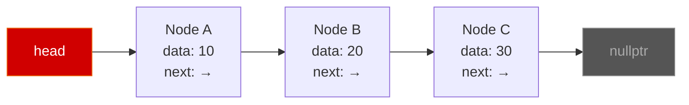
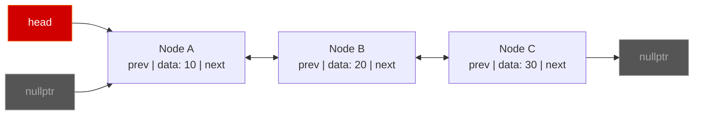
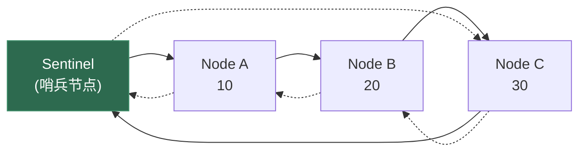
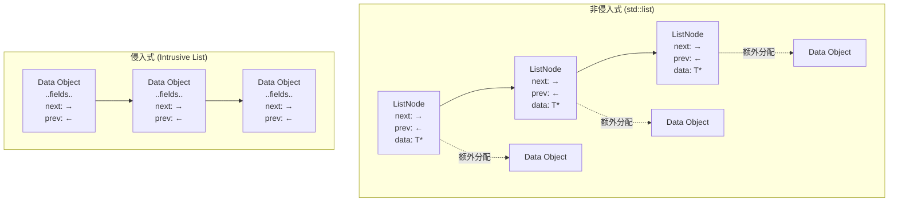

# 第二章 链表 (Linked List)

> **一句话理解**：链表是一组通过**指针**串联的离散节点——牺牲随机访问和缓存友好性，换取任意位置 **O(1) 的插入与删除**。

---

## 2.1 概念直觉 —— What & Why

### 数组的痛点

上一章我们知道数组的核心优势是连续内存和 O(1) 随机访问。但数组有两个硬伤：

1. **中间插删 O(n)**：插入一个元素，后面所有元素都要搬家
2. **扩容代价**：`std::vector` 扩容时要搬运全部元素到新内存

想象一个游戏场景：你的场景中有成百上千的实体（怪物、子弹、NPC），每一帧都有实体 spawn 和 despawn。如果用 `vector` 管理，每次从中间删除一个实体就要搬移后续所有元素——这在热循环中是不可接受的。

### 链表的解决方案

链表的思路极其简单：**不要求连续内存，用指针把离散的节点串起来**。

- 插入：改两个指针 → O(1)
- 删除：改两个指针 → O(1)
- 代价：失去随机访问能力，只能从头遍历 → O(n)

### 链表家族

| 类型 | 特点 | STL 对应 | 常用场景 |
|------|------|----------|----------|
| 单链表 | 每个节点一个 `next` 指针 | `std::forward_list` | 栈实现、哈希表的桶 |
| 双链表 | 每个节点 `prev` + `next` | `std::list` | LRU Cache、任意位置增删 |
| 循环链表 | 尾节点指回头节点 | 无 | 轮询调度、约瑟夫问题 |
| **侵入式链表** | 节点内嵌 link 字段 | 无（需手写） | **游戏引擎、OS 内核** |

---

## 2.2 结构图解

### 单链表 (Singly Linked List)



每个节点仅知道"下一个是谁"，只能**单方向**遍历。

### 双链表 (Doubly Linked List)



双向指针使得：
- **删除已知节点** O(1)（单链表删除需要前驱，要遍历找）
- **反向遍历** O(n) 变为可能

### 循环双链表 (std::list 的实际实现)



> 💡 `std::list` 的真实实现是一个**带哨兵节点的循环双链表**。哨兵节点不存储数据，但简化了边界处理——头插、尾插、删除都不需要特判空链表。

### 侵入式 vs 非侵入式链表



**非侵入式**：链表节点和数据对象**分开分配**，节点通过指针引用数据。每个元素 = 节点分配 + 数据分配 = **两次堆分配**。

**侵入式**：链表的 `prev/next` 指针**嵌入到数据对象自身**。只需**一次分配**，且对象可以同时属于多个链表。

---

## 2.3 C++ 底层实现

### 2.3.1 手写单链表

```cpp
template <typename T>
class SinglyLinkedList {
    struct Node {
        T     data;
        Node* next = nullptr;

        Node(const T& val, Node* n = nullptr) : data(val), next(n) {}
    };

    Node*       _head = nullptr;
    std::size_t _size = 0;

public:
    ~SinglyLinkedList() { clear(); }

    // ========== 头部操作 O(1) ==========
    void push_front(const T& val) {
        _head = new Node(val, _head);
        ++_size;
    }

    void pop_front() {
        if (!_head) return;
        Node* old = _head;
        _head = _head->next;
        delete old;
        --_size;
    }

    T& front() { return _head->data; }

    // ========== 在指定节点后插入 O(1) ==========
    void insert_after(Node* pos, const T& val) {
        if (!pos) return;
        pos->next = new Node(val, pos->next);
        ++_size;
    }

    // ========== 删除指定节点后的节点 O(1) ==========
    void erase_after(Node* pos) {
        if (!pos || !pos->next) return;
        Node* target = pos->next;
        pos->next = target->next;
        delete target;
        --_size;
    }

    // ========== 查找 O(n) ==========
    Node* find(const T& val) {
        Node* cur = _head;
        while (cur) {
            if (cur->data == val) return cur;
            cur = cur->next;
        }
        return nullptr;
    }

    // ========== 反转 O(n) ==========
    void reverse() {
        Node* prev = nullptr;
        Node* curr = _head;
        while (curr) {
            Node* next = curr->next;
            curr->next = prev;
            prev = curr;
            curr = next;
        }
        _head = prev;
    }

    void clear() {
        while (_head) pop_front();
    }

    std::size_t size() const { return _size; }
    bool empty() const { return _head == nullptr; }
};
```

### 2.3.2 `std::list` 底层解析

`std::list` 是一个**带哨兵节点的循环双链表**。精简版实现：

```cpp
template <typename T>
class List {
    struct Node {
        T     data;
        Node* prev;
        Node* next;
        Node() : prev(this), next(this) {}  // 哨兵节点自环
        Node(const T& val, Node* p, Node* n) : data(val), prev(p), next(n) {}
    };

    Node        _sentinel;  // 哨兵节点（不存数据）
    std::size_t _size = 0;

    // 核心：在 pos 之前插入
    Node* _insert(Node* pos, const T& val) {
        Node* node = new Node(val, pos->prev, pos);
        pos->prev->next = node;  // 前驱的 next 指向新节点
        pos->prev = node;        // pos 的 prev 指向新节点
        ++_size;
        return node;
    }

    // 核心：删除 pos 节点
    Node* _erase(Node* pos) {
        Node* next = pos->next;
        pos->prev->next = pos->next;  // 前驱跳过 pos
        pos->next->prev = pos->prev;  // 后继跳过 pos
        delete pos;
        --_size;
        return next;
    }

public:
    // begin/end 利用哨兵形成逻辑区间
    // sentinel.next = 第一个元素
    // sentinel 自身 = end()（past-the-end）

    void push_back(const T& val)  { _insert(&_sentinel, val); }
    void push_front(const T& val) { _insert(_sentinel.next, val); }
    void pop_back()  { _erase(_sentinel.prev); }
    void pop_front() { _erase(_sentinel.next); }

    T& front() { return _sentinel.next->data; }
    T& back()  { return _sentinel.prev->data; }

    std::size_t size() const { return _size; }
    bool empty() const { return _size == 0; }

    // splice: 把另一个链表的节点 O(1) 移过来（不拷贝数据！）
    // 这是 std::list 最强大的操作之一
    void splice(Node* pos, List& other, Node* it) {
        // 从 other 摘下 it
        it->prev->next = it->next;
        it->next->prev = it->prev;
        --other._size;

        // 接到 pos 之前
        it->prev = pos->prev;
        it->next = pos;
        pos->prev->next = it;
        pos->prev = it;
        ++_size;
    }

    ~List() {
        while (!empty()) pop_front();
    }
};
```

**`std::list` 关键特性总结**：

| 特性 | 说明 |
|------|------|
| 哨兵节点 | 简化边界处理，空链表时 `sentinel.next == sentinel.prev == &sentinel` |
| `splice` | **O(1)** 移动节点，不涉及拷贝/分配，链表独有优势 |
| 迭代器稳定性 | 插入/删除**不会使其他迭代器失效**（对比 vector 的噩梦） |
| 每个元素额外开销 | 2 个指针 = 16 字节 (64位)，外加堆分配开销（通常 16-32 字节对齐头） |
| 缓存友好性 | **极差**——每个节点独立分配，散布在堆的各处 |

### 2.3.3 `std::forward_list` —— 最轻量的链表

C++11 引入的单链表，比 `std::list` 更省内存：

```cpp
// forward_list 相比 list 的差异：
// - 只有 next 指针，没有 prev → 每节点省 8 字节
// - 没有 size() 方法！（为了省一个 size_t 成员）
// - 只有 push_front / pop_front / insert_after / erase_after
// - 没有 push_back（单链表尾插需要遍历到尾部 O(n)）

std::forward_list<int> flist = {1, 2, 3, 4, 5};

// 在头部插入
flist.push_front(0);               // [0, 1, 2, 3, 4, 5]

// 在某个位置之后插入（注意 API 是 _after）
auto it = flist.begin();
std::advance(it, 2);               // it 指向 2
flist.insert_after(it, 99);        // [0, 1, 2, 99, 3, 4, 5]

// 删除某个位置之后的元素
flist.erase_after(it);             // [0, 1, 2, 3, 4, 5]

// 获取大小需要手动算（标准库不提供 size()）
auto count = std::distance(flist.begin(), flist.end()); // O(n)
```

> 💡 **何时用 `forward_list`？** 当你需要链表但内存极度敏感时（如哈希表的每个桶用一个单链表——`std::unordered_map` 的常见实现）。

### 2.3.4 侵入式链表 (Intrusive List) —— 游戏引擎的选择

侵入式链表是游戏引擎和操作系统内核中极其常见的数据结构。Linux 内核的 `list_head` 就是最经典的侵入式链表。

**核心思想**：把 `prev/next` 指针嵌入到数据对象中，而不是在链表节点中额外存一个指向数据的指针。

```cpp
// ========== 侵入式链表的 Hook ==========
struct IntrusiveListHook {
    IntrusiveListHook* prev = nullptr;
    IntrusiveListHook* next = nullptr;

    bool is_linked() const { return prev != nullptr; }

    // 从当前链表中脱离
    void unlink() {
        if (prev) prev->next = next;
        if (next) next->prev = prev;
        prev = next = nullptr;
    }
};

// ========== 侵入式链表容器 ==========
template <typename T, IntrusiveListHook T::*HookPtr>
class IntrusiveList {
    IntrusiveListHook _sentinel;
    std::size_t       _size = 0;

    // 从 hook 指针反推出宿主对象指针
    static T* _to_object(IntrusiveListHook* hook) {
        // 计算 hook 成员在 T 中的偏移，反向得到 T* 
        // 等价于 Linux 内核的 container_of 宏
        static constexpr auto offset =
            reinterpret_cast<std::size_t>(
                &(static_cast<T*>(nullptr)->*HookPtr));
        return reinterpret_cast<T*>(
            reinterpret_cast<char*>(hook) - offset);
    }

    IntrusiveListHook* _hook(T* obj) {
        return &(obj->*HookPtr);
    }

public:
    IntrusiveList() {
        _sentinel.prev = &_sentinel;
        _sentinel.next = &_sentinel;
    }

    void push_back(T* obj) {
        auto* hook = _hook(obj);
        hook->prev = _sentinel.prev;
        hook->next = &_sentinel;
        _sentinel.prev->next = hook;
        _sentinel.prev = hook;
        ++_size;
    }

    void push_front(T* obj) {
        auto* hook = _hook(obj);
        hook->next = _sentinel.next;
        hook->prev = &_sentinel;
        _sentinel.next->prev = hook;
        _sentinel.next = hook;
        ++_size;
    }

    // O(1) 移除——对象自己知道自己在链表中的位置
    void remove(T* obj) {
        auto* hook = _hook(obj);
        hook->unlink();
        --_size;
    }

    T* front() { return _to_object(_sentinel.next); }
    T* back()  { return _to_object(_sentinel.prev); }

    bool empty() const { return _size == 0; }
    std::size_t size() const { return _size; }

    // 简易迭代器
    struct Iterator {
        IntrusiveListHook* hook;
        T& operator*() { return *_to_object(hook); }
        Iterator& operator++() { hook = hook->next; return *this; }
        bool operator!=(const Iterator& o) const { return hook != o.hook; }
    };

    Iterator begin() { return {_sentinel.next}; }
    Iterator end()   { return {&_sentinel}; }
};
```

**使用方式**：

```cpp
struct GameObject {
    int         id;
    float       x, y;
    std::string name;

    // 嵌入 hook —— 可以同时属于多个链表！
    IntrusiveListHook scene_link;   // 场景链表
    IntrusiveListHook render_link;  // 渲染链表
    IntrusiveListHook physics_link; // 物理链表
};

// 场景中的所有对象
IntrusiveList<GameObject, &GameObject::scene_link> scene_objects;
// 需要渲染的对象
IntrusiveList<GameObject, &GameObject::render_link> render_list;
// 需要物理更新的对象
IntrusiveList<GameObject, &GameObject::physics_link> physics_list;

// 一个对象可以同时存在于三个链表中
auto* obj = new GameObject{1, 10.0f, 20.0f, "Enemy"};
scene_objects.push_back(obj);
render_list.push_back(obj);
physics_list.push_back(obj);

// 从场景中移除——O(1)，不影响其他链表
scene_objects.remove(obj);
```

**侵入式 vs 非侵入式对比**：

| 特性 | `std::list`（非侵入式） | 侵入式链表 |
|------|------------------------|-----------|
| 每元素堆分配次数 | 2 次（节点 + 数据） | **1 次**（只分配数据） |
| 每元素额外开销 | 2 指针 + 分配器头部 ≈ 32-48B | **2 指针 = 16B** |
| 同时属于多个链表 | ❌ 不行 | ✅ 嵌入多个 hook |
| 已知对象 O(1) 删除 | ❌ 需要迭代器 | ✅ 直接 `unlink()` |
| 谁管理内存？ | 链表管理 | **用户管理**（灵活但也是责任） |
| 类型安全 | ✅ 模板包装 | 需要小心 `container_of` |
| 使用者 | 通用代码 | **游戏引擎、OS 内核** |

---

## 2.4 复杂度速查表

### 各链表类型复杂度

| 操作 | 单链表 | 双链表 (`std::list`) | `forward_list` |
|------|--------|---------------------|----------------|
| 头部插入 | **O(1)** | **O(1)** | **O(1)** |
| 尾部插入 | O(n)* | **O(1)** | O(n) |
| 已知位置插入 | O(1)** | **O(1)** | O(1)** |
| 头部删除 | **O(1)** | **O(1)** | **O(1)** |
| 尾部删除 | O(n) | **O(1)** | O(n) |
| 已知位置删除 | O(n)*** | **O(1)** | O(1)**** |
| 按值查找 | O(n) | O(n) | O(n) |
| 按下标访问 | O(n) | O(n) | O(n) |
| `splice` | O(1) | **O(1)** | O(1) |

> `*` 维护 tail 指针可优化为 O(1)  
> `**` 在给定节点**之后**插入  
> `***` 单链表删除需要前驱，需遍历找前驱  
> `****` 删除给定节点**之后**的节点

### 链表 vs 数组横向对比

| 维度 | `vector` | `list` | `forward_list` | 侵入式链表 |
|------|----------|--------|----------------|-----------|
| 随机访问 | ✅ O(1) | ❌ O(n) | ❌ O(n) | ❌ O(n) |
| 头部插入 | ❌ O(n) | ✅ O(1) | ✅ O(1) | ✅ O(1) |
| 中间插入 | ❌ O(n) | ✅ O(1) | ✅ O(1) | ✅ O(1) |
| 缓存友好 | ✅✅✅ | ❌ | ❌ | ❌~✅* |
| 每元素开销 | 0 | ~32-48B | ~24B | **16B** |
| 迭代器失效 | 常失效 | **极稳定** | **极稳定** | **极稳定** |
| 内存分配 | 批量 | 逐个 | 逐个 | 用户控制 |

> `*` 侵入式链表配合自定义分配器（如 Pool Allocator）可以让节点内存连续，提升 cache 命中。

---

## 2.5 面试高频题

### 2.5.1 反转链表 (LeetCode 206) —— 链表面试第一题

> 反转一个单链表。

这道题面试出现频率极高，必须做到闭眼写。

```cpp
struct ListNode {
    int val;
    ListNode* next;
    ListNode(int x) : val(x), next(nullptr) {}
};

// 方法一：迭代（推荐）
ListNode* reverseList(ListNode* head) {
    ListNode* prev = nullptr;
    ListNode* curr = head;
    while (curr) {
        ListNode* next = curr->next;  // 1. 暂存下一个
        curr->next = prev;            // 2. 反转指针
        prev = curr;                  // 3. prev 前进
        curr = next;                  // 4. curr 前进
    }
    return prev;  // prev 现在是新头
}
// 时间 O(n), 空间 O(1)

// 方法二：递归（理解递归思维）
ListNode* reverseListRecursive(ListNode* head) {
    if (!head || !head->next) return head;
    
    ListNode* newHead = reverseListRecursive(head->next);
    // 此时 head->next 是反转后子链表的尾节点
    head->next->next = head;  // 让尾节点指回 head
    head->next = nullptr;     // head 变成新尾
    return newHead;
}
// 时间 O(n), 空间 O(n)（递归栈）
```

> 💡 **面试技巧**：迭代版三个指针（prev, curr, next）的舞步是固定模式。如果面试官追问"反转链表的第 m 到 n 个节点"（LC 92），核心逻辑不变，只需要定位起止点。

### 2.5.2 反转链表 II (LeetCode 92) —— 区间反转

> 反转链表从位置 left 到 right 的部分。

```cpp
ListNode* reverseBetween(ListNode* head, int left, int right) {
    ListNode dummy(0);
    dummy.next = head;
    
    // 1. 找到反转区间的前一个节点
    ListNode* pre = &dummy;
    for (int i = 1; i < left; ++i) {
        pre = pre->next;
    }
    
    // 2. 头插法反转区间
    // pre -> [left] -> [left+1] -> ... -> [right] -> after
    ListNode* curr = pre->next;
    for (int i = 0; i < right - left; ++i) {
        ListNode* next = curr->next;
        curr->next = next->next;     // curr 跳过 next
        next->next = pre->next;      // next 插到区间最前面
        pre->next = next;            // pre 指向新的区间头
    }
    
    return dummy.next;
}
// 时间 O(n), 空间 O(1)
```

> 💡 **Dummy Node 技巧**：在链表题中创建一个虚拟头节点 `dummy`，让 `dummy.next = head`。这样头节点的操作和中间节点统一，不需要特判。这个技巧在链表题中几乎**必用**。

### 2.5.3 环检测 —— Floyd 快慢指针 (LeetCode 141 & 142)

**判断是否有环（LC 141）**：

```cpp
bool hasCycle(ListNode* head) {
    ListNode* slow = head;
    ListNode* fast = head;
    
    while (fast && fast->next) {
        slow = slow->next;       // 慢指针走 1 步
        fast = fast->next->next; // 快指针走 2 步
        if (slow == fast) return true;  // 相遇 → 有环
    }
    return false;  // fast 到了末尾 → 无环
}
// 时间 O(n), 空间 O(1)
```

**找到环的入口（LC 142）**：

```cpp
ListNode* detectCycle(ListNode* head) {
    ListNode* slow = head;
    ListNode* fast = head;
    
    // 第一阶段：快慢指针找相遇点
    while (fast && fast->next) {
        slow = slow->next;
        fast = fast->next->next;
        if (slow == fast) break;
    }
    if (!fast || !fast->next) return nullptr;  // 无环
    
    // 第二阶段：一个从 head 出发，一个从相遇点出发，都走 1 步
    // 再次相遇的地方就是环入口
    slow = head;
    while (slow != fast) {
        slow = slow->next;
        fast = fast->next;
    }
    return slow;
}
```

**数学证明**：

```
设：head 到环入口距离为 a
    环入口到相遇点距离为 b
    相遇点回到环入口距离为 c
    环长 = b + c

快指针走的距离 = 2 × 慢指针走的距离
a + b + k(b+c) = 2(a + b)     // k 是快指针多绕的圈数
化简：a = c + (k-1)(b+c)
含义：从 head 走 a 步 = 从相遇点走 c 步 + 若干整圈
     → 两指针同时走，一定在环入口相遇！
```

### 2.5.4 合并两个有序链表 (LeetCode 21)

```cpp
ListNode* mergeTwoLists(ListNode* l1, ListNode* l2) {
    ListNode dummy(0);
    ListNode* tail = &dummy;
    
    while (l1 && l2) {
        if (l1->val <= l2->val) {
            tail->next = l1;
            l1 = l1->next;
        } else {
            tail->next = l2;
            l2 = l2->next;
        }
        tail = tail->next;
    }
    tail->next = l1 ? l1 : l2;  // 接上剩余部分
    
    return dummy.next;
}
// 时间 O(n+m), 空间 O(1)
```

### 2.5.5 合并 K 个有序链表 (LeetCode 23) —— 优先队列 + 链表

```cpp
ListNode* mergeKLists(std::vector<ListNode*>& lists) {
    // 最小堆：每次取 K 个链表头中最小的
    auto cmp = [](ListNode* a, ListNode* b) { return a->val > b->val; };
    std::priority_queue<ListNode*, std::vector<ListNode*>, decltype(cmp)> pq(cmp);
    
    // 初始化：把每个链表的头节点入堆
    for (auto* head : lists) {
        if (head) pq.push(head);
    }
    
    ListNode dummy(0);
    ListNode* tail = &dummy;
    
    while (!pq.empty()) {
        ListNode* smallest = pq.top();
        pq.pop();
        
        tail->next = smallest;
        tail = tail->next;
        
        if (smallest->next) {
            pq.push(smallest->next);  // 把下一个节点入堆
        }
    }
    
    return dummy.next;
}
// 时间 O(N log K)，N 是所有节点总数，K 是链表数
// 空间 O(K)（堆的大小）
```

### 2.5.6 LRU Cache (LeetCode 146) —— 哈希表 + 双链表经典组合

**LRU（Least Recently Used）** 是面试超高频题，也是实际工程中最常用的缓存淘汰策略。

核心思想：
- **哈希表**：O(1) 查找 key 是否存在 + 定位节点
- **双链表**：O(1) 维护"最近使用"的顺序，最近用的放头部，淘汰时删尾部

```cpp
class LRUCache {
    struct Node {
        int key, value;
        Node* prev = nullptr;
        Node* next = nullptr;
        Node(int k, int v) : key(k), value(v) {}
    };

    int _capacity;
    std::unordered_map<int, Node*> _map;  // key → Node*
    Node _head{0, 0};  // 虚拟头
    Node _tail{0, 0};  // 虚拟尾

    // 把节点移到头部（标记为最近使用）
    void _move_to_front(Node* node) {
        _remove(node);
        _add_front(node);
    }

    // 从链表中摘除节点
    void _remove(Node* node) {
        node->prev->next = node->next;
        node->next->prev = node->prev;
    }

    // 在虚拟头之后插入（最近使用的位置）
    void _add_front(Node* node) {
        node->next = _head.next;
        node->prev = &_head;
        _head.next->prev = node;
        _head.next = node;
    }

public:
    LRUCache(int capacity) : _capacity(capacity) {
        _head.next = &_tail;
        _tail.prev = &_head;
    }

    int get(int key) {
        auto it = _map.find(key);
        if (it == _map.end()) return -1;

        _move_to_front(it->second);  // 标记为最近使用
        return it->second->value;
    }

    void put(int key, int value) {
        auto it = _map.find(key);
        if (it != _map.end()) {
            it->second->value = value;
            _move_to_front(it->second);
            return;
        }

        // 容量满了，淘汰最久未使用的（链表尾部）
        if (_map.size() == _capacity) {
            Node* lru = _tail.prev;
            _remove(lru);
            _map.erase(lru->key);
            delete lru;
        }

        // 插入新节点
        Node* node = new Node(key, value);
        _add_front(node);
        _map[key] = node;
    }

    ~LRUCache() {
        Node* cur = _head.next;
        while (cur != &_tail) {
            Node* next = cur->next;
            delete cur;
            cur = next;
        }
    }
};
// get: O(1), put: O(1)
```

> 💡 **面试中的表述**："LRU Cache 用**哈希表 + 双链表**实现，哈希表负责 O(1) 定位，双链表负责 O(1) 维护访问顺序。Get 和 Put 都是 O(1)。每次访问都把节点移到链表头部，容量满时淘汰尾部。"

### 2.5.7 相交链表 (LeetCode 160)

> 找到两个单链表相交的起始节点。

```cpp
ListNode* getIntersectionNode(ListNode* headA, ListNode* headB) {
    // 核心：两个指针分别遍历 A+B 和 B+A，走的总长度相同
    // 如果相交，一定在交点相遇；不相交则同时为 nullptr
    ListNode* a = headA;
    ListNode* b = headB;
    
    while (a != b) {
        a = a ? a->next : headB;  // A 走完了跳到 B 头
        b = b ? b->next : headA;  // B 走完了跳到 A 头
    }
    return a;
}
// 时间 O(n+m), 空间 O(1)
// 精妙！两指针各走一遍 A+B（或 B+A），总步数相同
```

### 2.5.8 K 个一组翻转链表 (LeetCode 25) —— Hard 经典

> 给定链表，每 k 个节点一组进行翻转。如果剩余不足 k 个则保持原样。

这是链表题中最经典的 Hard 题，面试出现频率非常高。核心思路：**分组 → 组内反转 → 组间拼接**。

```cpp
ListNode* reverseKGroup(ListNode* head, int k) {
    ListNode dummy(0);
    dummy.next = head;
    ListNode* group_prev = &dummy;  // 每组的前驱

    while (true) {
        // 1. 检查剩余节点是否 >= k 个
        ListNode* kth = group_prev;
        for (int i = 0; i < k; ++i) {
            kth = kth->next;
            if (!kth) return dummy.next;  // 不足 k 个，结束
        }

        ListNode* group_next = kth->next;  // 下一组的起点

        // 2. 反转当前组 [group_prev->next, kth]
        ListNode* prev = group_next;  // 反转后尾部接上下一组
        ListNode* curr = group_prev->next;
        while (curr != group_next) {
            ListNode* next = curr->next;
            curr->next = prev;
            prev = curr;
            curr = next;
        }

        // 3. 拼接：更新前驱和后继
        ListNode* new_group_first = prev;      // 反转后的组头 = kth
        ListNode* new_group_last = group_prev->next;  // 反转后的组尾 = 原组头

        group_prev->next = new_group_first;
        group_prev = new_group_last;  // 移动到下一组的前驱
    }
}
// 时间 O(n), 空间 O(1)
```

**图解**（`[1→2→3→4→5]`，k=2）：

```
初始: dummy → 1 → 2 → 3 → 4 → 5
                  ↑       ↑
               group_prev=dummy, kth=2

第一组反转 [1,2]:
  dummy → 2 → 1 → 3 → 4 → 5
               ↑
            group_prev=1

第二组反转 [3,4]:
  dummy → 2 → 1 → 4 → 3 → 5
                        ↑
                     group_prev=3

不足 k=2 个，结束：
  结果: 2 → 1 → 4 → 3 → 5
```

> 💡 **面试技巧**：这道题的关键在于**正确维护 group_prev 指针**。画图把每一步的指针变化标清楚是写对这题的唯一方法。不画图直接写几乎必错。

### 2.5.9 复制带随机指针的链表 (LeetCode 138)

> 链表每个节点除了 `next` 指针外，还有一个 `random` 指针指向任意节点或 `null`。深拷贝整个链表。

**方法一：哈希表映射**

```cpp
struct RandomNode {
    int val;
    RandomNode* next;
    RandomNode* random;
    RandomNode(int x) : val(x), next(nullptr), random(nullptr) {}
};

RandomNode* copyRandomList(RandomNode* head) {
    if (!head) return nullptr;

    // key = 原节点, value = 新节点
    std::unordered_map<RandomNode*, RandomNode*> map;

    // 第一遍：创建所有新节点
    RandomNode* curr = head;
    while (curr) {
        map[curr] = new RandomNode(curr->val);
        curr = curr->next;
    }

    // 第二遍：连接 next 和 random
    curr = head;
    while (curr) {
        map[curr]->next = map[curr->next];
        map[curr]->random = map[curr->random];
        curr = curr->next;
    }

    return map[head];
}
// 时间 O(n), 空间 O(n)
```

**方法二：交错拼接法（O(1) 空间）**

```cpp
RandomNode* copyRandomList_O1(RandomNode* head) {
    if (!head) return nullptr;

    // 第一步：在每个原节点后面插入一个克隆节点
    // 1 → 1' → 2 → 2' → 3 → 3'
    RandomNode* curr = head;
    while (curr) {
        RandomNode* clone = new RandomNode(curr->val);
        clone->next = curr->next;
        curr->next = clone;
        curr = clone->next;
    }

    // 第二步：设置克隆节点的 random 指针
    curr = head;
    while (curr) {
        if (curr->random) {
            curr->next->random = curr->random->next;  // 精髓！
        }
        curr = curr->next->next;
    }

    // 第三步：拆分两个链表
    RandomNode dummy(0);
    RandomNode* clone_tail = &dummy;
    curr = head;
    while (curr) {
        clone_tail->next = curr->next;
        clone_tail = clone_tail->next;
        curr->next = curr->next->next;  // 恢复原链表
        curr = curr->next;
    }

    return dummy.next;
}
// 时间 O(n), 空间 O(1)
```

> 💡 **交错拼接法的精妙之处**：`curr->random->next` 恰好就是 `curr->random` 的克隆节点！因为我们在第一步中把克隆节点插在了原节点的正后方。这种"利用位置关系代替哈希表"的思想非常巧妙。

### 2.5.11 链表排序 (LeetCode 148)

> 在 O(n log n) 时间和 O(1) 空间内排序链表。

```cpp
// 归并排序（自底向上，O(1) 空间）
ListNode* sortList(ListNode* head) {
    if (!head || !head->next) return head;
    
    // 计算链表长度
    int len = 0;
    for (auto* p = head; p; p = p->next) ++len;
    
    ListNode dummy(0);
    dummy.next = head;
    
    // 步长从 1 开始倍增
    for (int step = 1; step < len; step <<= 1) {
        ListNode* prev = &dummy;
        ListNode* curr = dummy.next;
        
        while (curr) {
            // 切出第一段（长度 step）
            ListNode* left = curr;
            ListNode* right = _split(left, step);
            
            // 切出第二段（长度 step）
            curr = _split(right, step);
            
            // 合并两段，接到 prev 后面
            prev = _merge(left, right, prev);
        }
    }
    return dummy.next;
}

// 从 head 开始切出前 n 个节点，返回剩余部分的头
static ListNode* _split(ListNode* head, int n) {
    for (int i = 1; head && i < n; ++i) {
        head = head->next;
    }
    if (!head) return nullptr;
    ListNode* rest = head->next;
    head->next = nullptr;  // 切断
    return rest;
}

// 合并两个有序链表，接到 prev 后面，返回合并后的尾节点
static ListNode* _merge(ListNode* l1, ListNode* l2, ListNode* prev) {
    while (l1 && l2) {
        if (l1->val <= l2->val) {
            prev->next = l1;
            l1 = l1->next;
        } else {
            prev->next = l2;
            l2 = l2->next;
        }
        prev = prev->next;
    }
    prev->next = l1 ? l1 : l2;
    while (prev->next) prev = prev->next;  // 走到尾部
    return prev;
}
// 时间 O(n log n), 空间 O(1)
```

### 2.5.12 面试题速查表

| 题号 | 题目 | 核心技巧 | 难度 |
|------|------|----------|------|
| LC 206 | 反转链表 | 三指针迭代 / 递归 | Easy |
| LC 92 | 反转链表 II | Dummy + 头插法 | Medium |
| LC 21 | 合并两个有序链表 | Dummy + 双指针 | Easy |
| LC 23 | 合并K个有序链表 | 最小堆 | Hard |
| LC 141 | 环形链表 | Floyd 快慢指针 | Easy |
| LC 142 | 环形链表 II | Floyd + 数学推导 | Medium |
| LC 160 | 相交链表 | 双指针等长遍历 | Easy |
| LC 19 | 删除倒数第N个节点 | 快慢指针（快先走N步）| Medium |
| LC 24 | 两两交换链表节点 | 递归 / 迭代 | Medium |
| LC 25 | K个一组翻转链表 | 分组 + 反转 + 拼接 | Hard |
| LC 138 | 随机指针的复制 | 哈希 / 交错拼接 | Medium |
| LC 146 | LRU 缓存 | **哈希 + 双链表** | Medium |
| LC 148 | 排序链表 | 归并排序（自底向上）| Medium |
| LC 234 | 回文链表 | 快慢指针找中点 + 反转后半 | Easy |

---

## 2.6 🎮 实战场景

### 2.6.1 Free List —— 自定义内存分配器

游戏引擎很少直接用 `new/delete`——每次堆分配都有锁竞争、碎片和系统调用开销。**池分配器 (Pool Allocator)** 通过一个**空闲链表 (Free List)** 管理空闲内存块。

```cpp
template <typename T, std::size_t BlockCount>
class PoolAllocator {
    union Block {
        T      object;
        Block* next;   // 空闲时复用对象内存存指针！
        
        Block() {}     // 不要默认构造 T
        ~Block() {}    // 不要析构 T
    };

    std::array<Block, BlockCount> _pool;
    Block* _free_head = nullptr;   // 空闲链表头

public:
    PoolAllocator() {
        // 初始化空闲链表：所有 block 串成单链表
        for (std::size_t i = 0; i < BlockCount - 1; ++i) {
            _pool[i].next = &_pool[i + 1];
        }
        _pool[BlockCount - 1].next = nullptr;
        _free_head = &_pool[0];
    }

    // 分配一个对象 —— O(1)，零系统调用
    template <typename... Args>
    T* allocate(Args&&... args) {
        if (!_free_head) return nullptr;  // 池满

        Block* block = _free_head;
        _free_head = _free_head->next;

        // 在空闲块上 placement new 构造对象
        return new (&block->object) T(std::forward<Args>(args)...);
    }

    // 释放一个对象 —— O(1)，零系统调用
    void deallocate(T* ptr) {
        ptr->~T();  // 手动析构

        // 把释放的块接回空闲链表头
        Block* block = reinterpret_cast<Block*>(ptr);
        block->next = _free_head;
        _free_head = block;
    }

    std::size_t available() const {
        std::size_t count = 0;
        for (Block* b = _free_head; b; b = b->next) ++count;
        return count;
    }
};
```

**使用场景**：

```cpp
struct Particle {
    float x, y, z;
    float vx, vy, vz;
    float life;
};

PoolAllocator<Particle, 4096> particle_pool;

// 发射粒子 —— 零堆分配！
Particle* p = particle_pool.allocate();
if (p) {
    p->x = emitter.x;
    p->y = emitter.y;
    p->life = 2.0f;
}

// 粒子死亡 —— 零系统调用释放！
particle_pool.deallocate(p);
```

> 💡 **核心洞察**：空闲块的内存本身就足够存一个指针（`sizeof(T) >= sizeof(void*)`），所以用 `union` 复用对象内存存空闲链表指针，**零额外内存开销**。这就是 Free List 的精髓。

### 2.6.2 实体管理 —— 场景中的频繁 Spawn/Despawn

游戏场景中有大量实体需要动态管理。侵入式链表的优势在这里完全展现：

```cpp
class Scene {
    // 使用侵入式链表管理不同类型的实体
    IntrusiveList<GameObject, &GameObject::scene_link> _all_objects;
    IntrusiveList<GameObject, &GameObject::render_link> _renderable;

    PoolAllocator<GameObject, 2048> _pool;  // 配合池分配器

public:
    GameObject* spawn(const std::string& name, float x, float y) {
        auto* obj = _pool.allocate();
        if (!obj) return nullptr;

        obj->name = name;
        obj->x = x;
        obj->y = y;
        
        _all_objects.push_back(obj);
        _renderable.push_back(obj);
        return obj;
    }

    // O(1) 删除——不需要遍历查找！
    void despawn(GameObject* obj) {
        _all_objects.remove(obj);   // O(1) 从场景链表移除
        _renderable.remove(obj);    // O(1) 从渲染链表移除
        _pool.deallocate(obj);      // O(1) 归还内存池
    }

    void update(float dt) {
        for (auto& obj : _all_objects) {
            obj.x += obj.vx * dt;
            obj.y += obj.vy * dt;
        }
    }

    void render() {
        for (auto& obj : _renderable) {
            // draw(obj);
        }
    }
};
```

**为什么不用 `std::vector`？**

如果用 `vector<GameObject*>` 管理：
- 删除中间元素需要 O(n) 搬移，或者 swap-with-last（破坏顺序）
- 无法 O(1) 从多个列表中同时移除
- 扩容可能导致指针失效

侵入式链表：
- ✅ 任意位置 O(1) 删除
- ✅ 同一对象可以在多个链表中
- ✅ 配合池分配器 → 整个 spawn/despawn 流程零堆分配

### 2.6.3 UI 层级管理

游戏 UI 通常是一棵树，但同层级的子节点用**双链表**管理顺序（决定渲染前后关系）：

```cpp
struct UIWidget {
    std::string name;
    bool visible = true;
    int  z_order = 0;

    UIWidget* parent = nullptr;
    UIWidget* first_child = nullptr;  // 子节点链表头
    
    // 兄弟节点双链表
    UIWidget* prev_sibling = nullptr;
    UIWidget* next_sibling = nullptr;

    // 添加子节点到末尾
    void add_child(UIWidget* child) {
        child->parent = this;
        if (!first_child) {
            first_child = child;
            return;
        }
        // 找到最后一个子节点
        UIWidget* last = first_child;
        while (last->next_sibling) last = last->next_sibling;
        last->next_sibling = child;
        child->prev_sibling = last;
    }

    // O(1) 从父节点移除自己
    void remove_from_parent() {
        if (!parent) return;
        if (parent->first_child == this) {
            parent->first_child = next_sibling;
        }
        if (prev_sibling) prev_sibling->next_sibling = next_sibling;
        if (next_sibling) next_sibling->prev_sibling = prev_sibling;
        parent = prev_sibling = next_sibling = nullptr;
    }

    // 把自己移到兄弟链表最前面（提到最上层显示）
    void bring_to_front() {
        UIWidget* p = parent;
        remove_from_parent();
        if (p) {
            // 插到 first_child
            next_sibling = p->first_child;
            if (p->first_child) p->first_child->prev_sibling = this;
            p->first_child = this;
            parent = p;
        }
    }
};
```

> 💡 Unity 的 `Transform` 层级、Unreal 的 `UWidget` 体系底层都是类似的双链表结构。

### 2.6.4 命令队列 —— Undo/Redo 系统

策略游戏、关卡编辑器中的撤销/重做系统，底层就是一个双链表（也可以用两个栈，但链表更灵活）：

```cpp
struct Command {
    virtual ~Command() = default;
    virtual void execute() = 0;
    virtual void undo() = 0;
    virtual std::string description() const = 0;
};

class CommandHistory {
    std::list<std::unique_ptr<Command>> _history;
    // current 指向"当前位置"——current 之后的是被 undo 的命令
    std::list<std::unique_ptr<Command>>::iterator _current;

public:
    CommandHistory() {
        _current = _history.end();
    }

    void execute(std::unique_ptr<Command> cmd) {
        cmd->execute();
        
        // 清除 current 之后的所有命令（undo 后再执行新命令，旧的 redo 分支作废）
        _history.erase(_current, _history.end());
        
        _history.push_back(std::move(cmd));
        _current = _history.end();
    }

    bool can_undo() const {
        return _current != _history.begin();
    }

    bool can_redo() const {
        return _current != _history.end();
    }

    void undo() {
        if (!can_undo()) return;
        --_current;
        (*_current)->undo();
    }

    void redo() {
        if (!can_redo()) return;
        (*_current)->execute();
        ++_current;
    }
};
```

**为什么用 `std::list` 而不是 `std::vector`？**
- 中间位置 `erase` O(1) vs vector 的 O(n)
- 迭代器稳定——`_current` 不会因为其他操作失效
- `std::list::erase(first, last)` 精确删除一段，无需搬移

---

## 2.7 本章小结

### 核心要点

| 概念 | 要点 |
|------|------|
| **单链表** | 一个 `next` 指针，只能单向遍历，头部操作 O(1) |
| **双链表** | `prev + next`，可双向，已知节点删除 O(1)，`std::list` |
| **循环链表** | 尾指向头，哨兵节点简化边界 |
| **侵入式链表** | hook 嵌入对象，零额外分配，可属于多个链表 |
| **`std::list`** | 循环双链表 + 哨兵，`splice` O(1)，迭代器极稳定 |
| **`forward_list`** | 最轻量，单向，无 `size()`，适合内存敏感场景 |
| **Free List** | 复用空闲内存存指针，池分配器的核心 |
| **LRU Cache** | 哈希表 + 双链表的经典组合 |

### 面试 30 秒速答

> **Q：链表和数组的核心区别？**
>
> A：数组是**连续内存**，O(1) 随机访问，缓存友好，但中间插删 O(n)。链表是**离散节点**通过指针串联，已知位置插删 O(1)，但不支持随机访问。实际工程中，小规模数据优先用数组（缓存优势大）；需要频繁中间增删、迭代器稳定性、或 `splice` 操作时用链表。

> **Q：什么是侵入式链表？为什么游戏引擎要用它？**
>
> A：侵入式链表把链表的 `prev/next` 指针**嵌入到数据对象本身**，而不是在外面包一层节点。优势：①每个对象只需一次内存分配（非侵入式需要节点+数据两次分配）；②同一个对象可以同时属于多个链表；③已知对象就能 O(1) 删除，不需要额外查找。Linux 内核和 UE 引擎都大量使用。

> **Q：LRU Cache 怎么实现 O(1) 的 get 和 put？**
>
> A：用**哈希表 + 双链表**。哈希表 O(1) 查找 key 对应的链表节点，双链表维护使用顺序——每次访问把节点移到头部，容量满时删除尾部节点。两个操作都是 O(1)。

---

> 📖 下一章：[第三章 栈：后进先出的秩序](../03_stack) —— 从函数调用栈到单调栈，从表达式求值到游戏状态机。
