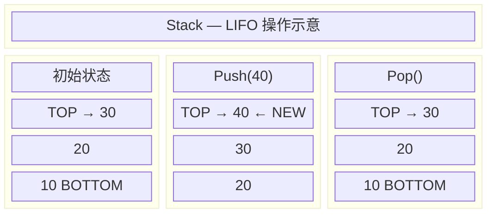
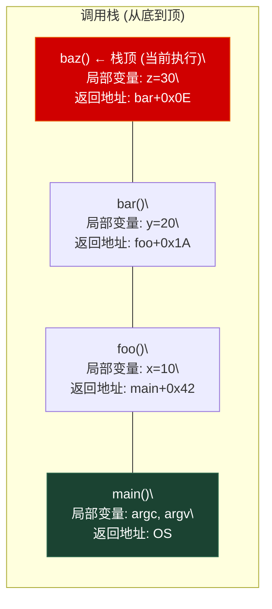
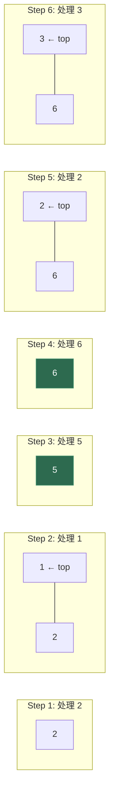
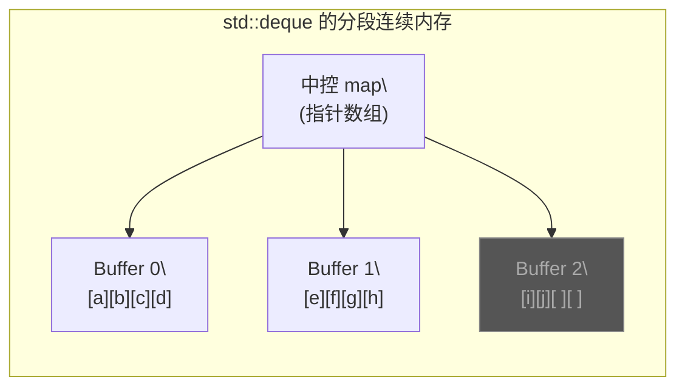

# 第三章 栈 (Stack)

> **一句话理解**：栈是一种**后进先出 (LIFO)** 的受限线性表——它故意阉割了大部分操作，只留 Push / Pop / Top，换来极致的简洁性和明确的意图表达。

---

## 3.1 概念直觉 —— What & Why

### 什么是栈？

你可以把栈想象成一叠**盘子**或者一个**弹夹**：你只能把新盘子放在最顶上（Push），也只能从最顶上拿走盘子（Pop）。这就是 **LIFO (Last In, First Out)** 原则。

栈只暴露三个核心操作：
- `push(x)`：压栈——把元素放到顶部
- `pop()`：出栈——移除顶部元素（C++ 中不返回值）
- `top()`：查看栈顶元素（不移除）

**为什么要限制能力？**

相比于数组和链表提供了大量 API（头插、尾插、中间插、随机访问、反转等），栈故意把能力砍到最少。这在软件工程中是一种极具哲学意味的设计：**少即是多**。限制操作意味着：
1. 一眼就能看出这个数据结构的**意图**——LIFO 顺序
2. 底层实现可以极致优化——只需要关心尾部操作
3. 不会被误用——你不可能"不小心"从中间删除元素

### 函数调用栈 —— 栈最本质的应用

在计算机世界中，栈是极其核心的基础设施。最典型的就是 **函数调用栈 (Call Stack)**：

```
main() 调用 foo()
  → foo() 调用 bar()
    → bar() 调用 baz()
      → baz() 执行完毕，回到 bar()
    → bar() 执行完毕，回到 foo()
  → foo() 执行完毕，回到 main()
```

每次函数调用时，CPU 会把**返回地址、局部变量、参数**打包成一个 **栈帧 (Stack Frame)** 压入调用栈。函数返回时弹出栈帧，恢复上一层的状态。这种"谁最后被调用，谁最先返回"的逻辑，完美契合 LIFO。

> 💡 **面试常考点**：递归的本质就是利用系统调用栈。每一层递归 = 一个栈帧。递归深度太大 → 栈帧太多 → **Stack Overflow**。这也是为什么游戏引擎中要把递归改成手动栈迭代的原因（见 3.6.4）。

### 栈的应用全景

| 领域 | 应用 | 核心原理 |
|------|------|----------|
| 编译器 | 括号匹配、表达式求值 | 配对 / 运算符优先级 |
| 操作系统 | 函数调用栈、中断处理 | 状态保存与恢复 |
| 浏览器 | 前进/后退 | 双栈维护历史 |
| 算法 | DFS、单调栈、回溯 | 后进先出的遍历顺序 |
| 游戏引擎 | UI 栈、状态机、Undo/Redo | 层级压入/弹出 |

---

## 3.2 结构图解

### 栈的 Push / Pop 过程



### 函数调用栈的工作方式



> 每个矩形就是一个**栈帧 (Stack Frame)**。`baz()` 返回时，它的栈帧被弹出，控制权回到 `bar()`。

### 单调栈的推演过程

单调栈是面试中最高频的栈进阶题型。它的核心规则：**栈内元素必须保持单调递增（或递减），当新元素破坏单调性时，循环弹栈直到恢复。**

以 "寻找右侧第一个更大元素" 为例，输入 `[2, 1, 5, 6, 2, 3]`，维护**单调递减栈**（栈底到栈顶递减）：



```
Step 3 细节：5 > 1 → 弹出 1（1 的答案 = 5）
              5 > 2 → 弹出 2（2 的答案 = 5）
              压入 5
Step 4：6 > 5 → 弹出 5（5 的答案 = 6），压入 6
Step 6：3 > 2 → 弹出 2（2 的答案 = 3），压入 3
遍历结束：栈中剩余 [6, 3]，它们右边没有更大的 → 答案为 -1

最终结果：[5, 5, 6, -1, 3, -1]
```

> 💡 **关键洞察**：每个元素**最多进栈一次、出栈一次**，所以即使看起来有嵌套循环，总时间复杂度仍然是 **O(n)**。

---

## 3.3 C++ 底层实现

### 3.3.1 `std::stack` —— 适配器模式

在 C++ STL 中，`std::stack` **不是一个容器，而是一个容器适配器 (Container Adapter)**。它自己不管理内存，而是包装了另一个现成的容器，只暴露出栈允许的接口：

```cpp
#include <deque>

template <typename T, typename Container = std::deque<T>>
class stack {
protected:
    Container c;  // 底层容器（默认为 std::deque）

public:
    // ========== 容量查询 ==========
    bool empty() const       { return c.empty(); }
    std::size_t size() const { return c.size(); }

    // ========== 栈顶访问 ==========
    T& top()                 { return c.back(); }
    const T& top() const     { return c.back(); }

    // ========== 压栈 ==========
    void push(const T& x)   { c.push_back(x); }
    void push(T&& x)        { c.push_back(std::move(x)); }

    template <typename... Args>
    void emplace(Args&&... args) {
        c.emplace_back(std::forward<Args>(args)...);
    }

    // ========== 出栈 ==========
    void pop()               { c.pop_back(); }

    // 注意：pop() 不返回被弹出的元素！
    // 原因：如果返回 T（按值），可能触发拷贝构造，
    //       如果拷贝构造抛异常，元素已经被移除了 → 数据丢失。
    //       分成 top() + pop() 两步操作是异常安全的设计。
};
```

> 💡 **面试追问**：`pop()` 为什么不返回被弹出的元素？
> 这是 C++ 异常安全设计的经典案例。如果 `pop()` 返回 `T`（按值），需要调用拷贝/移动构造函数。如果构造函数抛出异常，元素已经从栈中移除但没成功交给调用者 → **数据丢失**。分成 `top()` + `pop()` 两步，`top()` 返回引用（不会失败），`pop()` 只做移除（不会失败），是**强异常保证**的设计。

### 3.3.2 为什么默认底层是 `std::deque`？



`std::deque` 是一种**分段连续内存**的结构：一个中控 map（指针数组）指向多个固定大小的 Buffer 块。这给了它三个关键优势：

| 对比维度 | `deque` (默认) | `vector` | `list` |
|----------|----------------|----------|--------|
| 扩容方式 | 新增一个 Buffer 块，**不搬老数据** | 分配 2x 新内存，**搬全部元素** | 每次 new 一个节点 |
| 内存释放 | Buffer 空了即释放 | 不主动释放（需 `shrink_to_fit`） | 随删随释放 |
| 缓存友好 | ✅✅（段内连续） | ✅✅✅（全局连续） | ❌（散布堆中） |
| 头部操作 | ✅ O(1) | ❌ O(n) | ✅ O(1) |
| 额外开销 | 中控 map 指针 | 无 | 每元素 2 指针 |

**总结**：`deque` 是 `vector` 和 `list` 的折中方案——既有不错的缓存局部性，又避免了 `vector` 扩容时的全量搬迁。对于栈这种"大小不确定、元素频繁增减"的场景，`deque` 是最安全的默认选择。

> 💡 如果你确定栈最大深度不大（比如 < 1000），完全可以用 `std::stack<T, std::vector<T>>`，因为 `vector` 的缓存局部性最好，且小规模下扩容代价可忽略。

### 3.3.3 手写定长数组栈

在游戏开发中，我们往往极度关注堆分配。如果知道最大深度，直接用栈上数组实现，**零堆分配**：

```cpp
template <typename T, std::size_t MaxDepth>
class FixedStack {
    static_assert(MaxDepth > 0, "MaxDepth must be > 0");

    std::array<T, MaxDepth> _data;
    int _top = -1;  // 指向当前栈顶，-1 表示空

public:
    bool push(const T& val) {
        if (_top >= static_cast<int>(MaxDepth) - 1) {
            return false;  // 栈满
        }
        _data[++_top] = val;
        return true;
    }

    template <typename... Args>
    bool emplace(Args&&... args) {
        if (_top >= static_cast<int>(MaxDepth) - 1) return false;
        _data[++_top] = T(std::forward<Args>(args)...);
        return true;
    }

    void pop() {
        if (_top >= 0) --_top;
    }

    T& top() { return _data[_top]; }
    const T& top() const { return _data[_top]; }

    bool empty() const { return _top == -1; }
    bool full() const { return _top == static_cast<int>(MaxDepth) - 1; }
    std::size_t size() const { return static_cast<std::size_t>(_top + 1); }
    std::size_t capacity() const { return MaxDepth; }
};
```

**使用场景**：

```cpp
// 游戏 UI 栈——最多嵌套 16 层界面
FixedStack<UIPanel*, 16> ui_stack;

// 寻路算法中的 DFS 栈——地图最大 256x256
FixedStack<GridPos, 65536> dfs_stack;
```

### 3.3.4 手写链表栈

当元素非常大（如几 KB 的结构体），不想在栈上开巨大数组时，可以用链表实现。每次 push 只分配一个节点：

```cpp
template <typename T>
class LinkedStack {
    struct Node {
        T data;
        Node* next;
        Node(const T& val, Node* n) : data(val), next(n) {}
    };

    Node* _top = nullptr;
    std::size_t _size = 0;

public:
    ~LinkedStack() { while (!empty()) pop(); }

    void push(const T& val) {
        _top = new Node(val, _top);  // 新节点指向旧栈顶
        ++_size;
    }

    void pop() {
        if (!_top) return;
        Node* old = _top;
        _top = _top->next;
        delete old;
        --_size;
    }

    T& top() { return _top->data; }
    const T& top() const { return _top->data; }

    bool empty() const { return _top == nullptr; }
    std::size_t size() const { return _size; }
};
```

> 链表栈的好处：push/pop **严格 O(1)**（没有均摊），且可以配合自定义 Pool Allocator（第 2 章的 Free List）来避免每次 `new/delete` 的系统调用开销。

---

## 3.4 复杂度速查表

### `std::stack` 操作复杂度

| 操作 | 时间复杂度 | 说明 |
|------|-----------|------|
| `push` | **O(1)** 均摊 | 底层容器的 `push_back` |
| `pop` | **O(1)** | 底层容器的 `pop_back` |
| `top` | **O(1)** | 底层容器的 `back` |
| `size` / `empty` | O(1) | |
| 查找 / 随机访问 | ❌ **不支持** | 栈不暴露随机访问接口 |

### 不同底层容器对比

| 底层容器 | push 复杂度 | pop 复杂度 | 优势 | 劣势 | 适用场景 |
|----------|------------|------------|------|------|----------|
| `std::deque` (默认) | O(1) 均摊 | O(1) | 扩容不搬老数据、可释放空闲块 | 段间跳转略慢 | 通用场景首选 |
| `std::vector` | O(1) 均摊 | O(1) | 内存完全连续、缓存最友好 | 扩容全量拷贝、不主动释放 | 小规模、缓存敏感 |
| `std::list` | O(1) 严格 | O(1) 严格 | 无扩容抖动、严格 O(1) | 每节点额外 16B、缓存极差 | 超大元素、严禁延迟抖动 |
| `FixedStack` (数组) | O(1) 严格 | O(1) 严格 | 零堆分配、栈上内存 | 大小固定、可能浪费 | 游戏热路径、嵌入式 |

### 横向对比：栈 vs 其他受限结构

| 特性 | 栈 (LIFO) | 队列 (FIFO) | 双端队列 | 优先队列 |
|------|-----------|-------------|----------|----------|
| 插入端 | 顶部 | 尾部 | 两端 | 任意 |
| 删除端 | 顶部 | 头部 | 两端 | 最大/最小 |
| 查看 | `top()` | `front()` | `front()`/`back()` | `top()` |
| 典型用途 | DFS、回溯、配对 | BFS、排队 | 滑动窗口 | 贪心、Top-K |
| STL | `std::stack` | `std::queue` | `std::deque` | `std::priority_queue` |

---

## 3.5 面试高频题

### 3.5.1 有效的括号 (LeetCode 20)

> 判断给定字符串中的括号 `()[]{}` 是否成对合法闭合。

**思路**：最经典的栈应用。遇到左括号压栈，遇到右括号弹栈检查配对。

```cpp
bool isValid(const std::string& s) {
    std::stack<char> st;
    for (char c : s) {
        // 遇到左括号：压入对应的右括号
        if (c == '(')      st.push(')');
        else if (c == '[') st.push(']');
        else if (c == '{') st.push('}');
        // 遇到右括号：栈空或不配对 → 非法
        else if (st.empty() || st.top() != c) return false;
        else st.pop();  // 配对成功
    }
    return st.empty();  // 栈没清空 → 左括号多了
}
// 时间 O(n), 空间 O(n)
```

> 💡 **技巧**：压入"期望的右括号"比压入左括号再做映射更简洁。

### 3.5.2 最小栈 (LeetCode 155)

> 设计一个栈，在常数时间检索到最小元素。支持 `push`, `pop`, `top`, `getMin`。

**思路**：用**辅助栈**同步维护当前最小值。每次 push 时，如果新元素 ≤ 当前最小值，就也把它推入辅助栈。

```cpp
class MinStack {
    std::stack<int> _data;
    std::stack<int> _min;  // 同步维护最小值

public:
    void push(int val) {
        _data.push(val);
        if (_min.empty() || val <= _min.top()) {
            _min.push(val);
        }
    }

    void pop() {
        if (_data.top() == _min.top()) {
            _min.pop();  // 弹出的恰好是当前最小值
        }
        _data.pop();
    }

    int top()    { return _data.top(); }
    int getMin() { return _min.top(); }
};
// 所有操作 O(1), 空间 O(n)
```

> 💡 **面试变体**：面试官可能追问"能不能只用一个栈？"——可以，每次 push 时把 `val` 和当前 `min` 打包成 pair 一起压栈，但本质上空间复杂度不变。

### 3.5.3 逆波兰表达式求值 (LeetCode 150)

> 给定逆波兰表示法（后缀表达式），求值。例如 `["2","1","+","3","*"]` → `(2+1)*3 = 9`

**逆波兰表达式**是编译器内部处理表达式的常用形式。它的求值过程天然就是一个栈操作：

```cpp
int evalRPN(std::vector<std::string>& tokens) {
    std::stack<int> st;

    for (const auto& token : tokens) {
        if (token == "+" || token == "-" ||
            token == "*" || token == "/") {
            // 遇到运算符：弹出两个操作数，计算后压回
            int b = st.top(); st.pop();  // 注意：b 是后弹出的（右操作数）
            int a = st.top(); st.pop();  // a 是先弹出的（左操作数）

            if      (token == "+") st.push(a + b);
            else if (token == "-") st.push(a - b);
            else if (token == "*") st.push(a * b);
            else if (token == "/") st.push(a / b);  // 题目保证不除 0
        } else {
            // 遇到数字：直接压栈
            st.push(std::stoi(token));
        }
    }
    return st.top();  // 栈中最后剩的就是结果
}
// 时间 O(n), 空间 O(n)
```

> 💡 **面试考点**：注意操作数弹出顺序！`b` 先弹（栈顶），`a` 后弹。对于减法和除法，顺序是 `a op b`，不能反。

### 3.5.4 每日温度 (LeetCode 739) —— 单调栈入门

> 给一个数组表示每天的温度，返回一个新数组：需等待几天才能遇到更高的温度。遇不到填 0。

**核心模型**：找**右边第一个比自己大的数**。维护一个**单调递减栈**（存下标）。

```cpp
std::vector<int> dailyTemperatures(std::vector<int>& temperatures) {
    int n = temperatures.size();
    std::vector<int> result(n, 0);
    std::stack<int> st;  // 存下标，栈内下标对应的温度单调递减

    for (int i = 0; i < n; ++i) {
        // 当前温度 > 栈顶下标的温度 → 栈顶找到了它的答案
        while (!st.empty() && temperatures[i] > temperatures[st.top()]) {
            int prev = st.top();
            st.pop();
            result[prev] = i - prev;  // 天数差
        }
        st.push(i);
    }
    // 栈中剩余的下标，右边没有更大的 → 结果保持 0
    return result;
}
// 时间 O(n)：每个元素最多进栈一次、出栈一次
// 空间 O(n)
```

### 3.5.5 柱状图中最大的矩形 (LeetCode 84) —— 单调栈进阶

> 给定非负整数数组 `heights` 表示柱状图的高度，找出能勾勒出的最大矩形面积。

这是**单调栈最经典的 Hard 题**，面试区分度极高。核心思路：对每个柱子，找到它**左边第一个比它矮的**和**右边第一个比它矮的**，这两个边界之间就是以该柱子高度为高的最大矩形宽度。

```cpp
int largestRectangleArea(std::vector<int>& heights) {
    int n = heights.size();
    std::stack<int> st;  // 单调递增栈（存下标）
    int max_area = 0;

    for (int i = 0; i <= n; ++i) {
        // 在末尾加一个高度为 0 的虚拟柱子，保证所有柱子都会被弹出
        int cur_height = (i == n) ? 0 : heights[i];

        while (!st.empty() && cur_height < heights[st.top()]) {
            int h = heights[st.top()];  // 被弹出柱子的高度
            st.pop();

            // 宽度 = 左边界到右边界
            // 左边界：栈顶的下一个元素（如果栈空则为 -1）
            // 右边界：当前的 i（第一个比 h 矮的）
            int width = st.empty() ? i : (i - st.top() - 1);
            max_area = std::max(max_area, h * width);
        }
        st.push(i);
    }
    return max_area;
}
// 时间 O(n), 空间 O(n)
```

**图解关键步骤**（以 `[2, 1, 5, 6, 2, 3]` 为例）：

```
处理到 i=4, heights[4]=2:
  弹出 6 (index=3): 高=6, 宽=4-2-1=1, 面积=6
  弹出 5 (index=2): 高=5, 宽=4-1-1=2, 面积=10 ← 最大！

最终答案：10
```

> 💡 **面试技巧**：在数组末尾追加一个高度为 0 的"哨兵"，可以保证循环结束时栈被完全清空，省去了循环后的额外处理逻辑。这是一个非常优雅的技巧。

### 3.5.6 用栈实现队列 (LeetCode 232)

> 仅使用两个栈实现先入先出 (FIFO) 队列。

**思路**：`in_stack` 专管推入，`out_stack` 专管弹出。当 `out_stack` 空了，把 `in_stack` 全部倒过来——LIFO 翻转一次就变成了 FIFO。

```cpp
class MyQueue {
    std::stack<int> _in;   // 专管入队
    std::stack<int> _out;  // 专管出队

    // 惰性转移：只在 out 空时才倒
    void _transfer() {
        if (_out.empty()) {
            while (!_in.empty()) {
                _out.push(_in.top());
                _in.pop();
            }
        }
    }

public:
    void push(int x)  { _in.push(x); }

    int pop() {
        _transfer();
        int val = _out.top();
        _out.pop();
        return val;
    }

    int peek() {
        _transfer();
        return _out.top();
    }

    bool empty() { return _in.empty() && _out.empty(); }
};
// push: O(1)
// pop/peek: 均摊 O(1)（每个元素最多被倒一次）
```

> 💡 **面试追问**："均摊 O(1) 怎么理解？" —— 每个元素一生中最多从 `_in` 倒到 `_out` 一次。n 次操作中，所有倒腾加起来最多 n 次，均摊下来每次操作 O(1)。

---

### 3.5.7 面试题速查表

| 题号 | 题目 | 核心技巧 | 难度 |
|------|------|----------|------|
| LC 20 | 有效的括号 | 栈配对 | Easy |
| LC 155 | 最小栈 | 辅助栈维护 min | Medium |
| LC 150 | 逆波兰表达式求值 | 栈模拟计算 | Medium |
| LC 232 | 用栈实现队列 | 双栈翻转 | Easy |
| LC 225 | 用队列实现栈 | 双队列 / 单队列翻转 | Easy |
| LC 739 | 每日温度 | **单调递减栈** | Medium |
| LC 496 | 下一个更大元素 I | 单调栈 + 哈希 | Easy |
| LC 503 | 下一个更大元素 II | 单调栈 + **循环遍历** | Medium |
| LC 84 | 柱状图中最大矩形 | **单调递增栈** | Hard |
| LC 85 | 最大矩形 | 逐行转化为 LC 84 | Hard |
| LC 42 | 接雨水 | 单调栈 / 双指针 | Hard |
| LC 71 | 简化路径 | 栈处理 `..` 和 `.` | Medium |
| LC 394 | 字符串解码 | 双栈（数字栈 + 字符串栈） | Medium |
| LC 32 | 最长有效括号 | 栈记录下标 | Hard |

---

## 3.6 🎮 实战场景

### 3.6.1 UI 层级管理 (UI Stack)

任何有嵌套菜单的游戏（RPG 属性面板、背包系统、设置页），当玩家层层点击 `主菜单` → `装备栏` → `强化界面` 时，按 `ESC` 应该**逐层退出**。这就是典型的栈结构。

```cpp
// UI 面板的生命周期接口
class UIPanel {
public:
    virtual ~UIPanel() = default;
    virtual void OnEnter()  = 0;  // 首次进入（播放进场动画）
    virtual void OnExit()   = 0;  // 被关闭（播放退场动画，释放资源）
    virtual void OnPause()  = 0;  // 被新面板覆盖（失去焦点，停止接收输入）
    virtual void OnResume() = 0;  // 上层面板关闭，重新获得焦点
    virtual void OnUpdate(float dt) = 0;
    virtual void OnRender() = 0;
};

class UIManager {
    std::stack<std::unique_ptr<UIPanel>> _stack;

public:
    // 打开新面板 —— Push
    void OpenPanel(std::unique_ptr<UIPanel> panel) {
        if (!_stack.empty()) {
            _stack.top()->OnPause();   // 当前面板失焦
        }
        panel->OnEnter();              // 新面板入场
        _stack.push(std::move(panel));
    }

    // 关闭当前面板 —— Pop
    void CloseCurrentPanel() {
        if (_stack.empty()) return;

        _stack.top()->OnExit();        // 当前面板退场
        _stack.pop();                  // 销毁

        if (!_stack.empty()) {
            _stack.top()->OnResume();  // 下层面板恢复焦点
        }
    }

    // 关闭所有面板（回到主界面）
    void CloseAll() {
        while (!_stack.empty()) {
            _stack.top()->OnExit();
            _stack.pop();
        }
    }

    // 只更新/渲染栈顶面板（或者根据需求渲染多层）
    void Update(float dt) {
        if (!_stack.empty()) {
            _stack.top()->OnUpdate(dt);
        }
    }

    void Render() {
        // 可以选择渲染所有层（半透明叠加效果）
        // 简化版：只渲染栈顶
        if (!_stack.empty()) {
            _stack.top()->OnRender();
        }
    }

    bool HasPanel() const { return !_stack.empty(); }
    std::size_t Depth() const { return _stack.size(); }
};
```

### 3.6.2 GameState Stack (游戏状态机嵌套)

整个游戏的流转本身就是一个大号状态栈。不同于传统有限状态机（FSM）的 **"切换"**，状态栈支持 **"叠加"**——新状态压在旧状态上面，旧状态暂停但不销毁。

```cpp
class GameState {
public:
    virtual ~GameState() = default;
    virtual void OnEnter()  = 0;
    virtual void OnExit()   = 0;
    virtual void OnPause()  = 0;
    virtual void OnResume() = 0;
    virtual void Update(float dt) = 0;
    virtual void Render() = 0;
};

class GameStateManager {
    std::stack<std::unique_ptr<GameState>> _states;

public:
    // 压入新状态（不销毁旧状态）
    void PushState(std::unique_ptr<GameState> state) {
        if (!_states.empty()) {
            _states.top()->OnPause();
        }
        state->OnEnter();
        _states.push(std::move(state));
    }

    // 弹出当前状态（恢复下层状态）
    void PopState() {
        if (_states.empty()) return;
        _states.top()->OnExit();
        _states.pop();
        if (!_states.empty()) {
            _states.top()->OnResume();
        }
    }

    // 替换当前状态（弹出旧的 + 压入新的）
    void ChangeState(std::unique_ptr<GameState> state) {
        if (!_states.empty()) {
            _states.top()->OnExit();
            _states.pop();
        }
        state->OnEnter();
        _states.push(std::move(state));
    }

    void Update(float dt) {
        if (!_states.empty()) {
            _states.top()->Update(dt);
        }
    }

    // 渲染可以从底部往上全部渲染（实现半透明叠加）
    void Render() {
        // 简化：用临时容器逆序渲染
        // 完整实现可以用 vector<GameState*> 替代 stack 来支持底层遍历
        if (!_states.empty()) {
            _states.top()->Render();
        }
    }
};
```

**典型流程**：

```
[Boot] → PushState(MainMenu)
         PushState(Loading)      // MainMenu.OnPause()
         PopState()              // Loading 结束, MainMenu.OnResume()
         ChangeState(InGame)     // MainMenu 被替换
         PushState(PauseMenu)    // InGame.OnPause() — 暂停但不销毁
                                 // 玩家能看到半透明暂停菜单下的游戏画面
         PopState()              // PauseMenu 关闭, InGame.OnResume()
```

### 3.6.3 Undo / Redo 系统 (Command Pattern + 双栈)

地图编辑器、关卡工具、策略游戏中的撤销/重做功能是游戏工具链的核心架构之一：

```cpp
// 命令接口 —— 每个可撤销的操作都是一个 Command
class Command {
public:
    virtual ~Command() = default;
    virtual void Execute() = 0;   // 执行
    virtual void Undo() = 0;      // 撤销（执行逆操作）
    virtual std::string Description() const = 0;
};

// ===== 具体命令示例：移动实体 =====
class MoveEntityCommand : public Command {
    Entity* _entity;
    Vec2 _old_pos;
    Vec2 _new_pos;

public:
    MoveEntityCommand(Entity* e, Vec2 new_pos)
        : _entity(e), _old_pos(e->position), _new_pos(new_pos) {}

    void Execute() override { _entity->position = _new_pos; }
    void Undo() override    { _entity->position = _old_pos; }
    std::string Description() const override {
        return "Move " + _entity->name;
    }
};

// ===== Undo/Redo 管理器 =====
class UndoRedoManager {
    std::stack<std::unique_ptr<Command>> _undo_stack;
    std::stack<std::unique_ptr<Command>> _redo_stack;

public:
    void Execute(std::unique_ptr<Command> cmd) {
        cmd->Execute();
        _undo_stack.push(std::move(cmd));

        // 关键：执行新操作后，redo 历史作废
        while (!_redo_stack.empty()) _redo_stack.pop();
    }

    void Undo() {
        if (_undo_stack.empty()) return;

        auto cmd = std::move(_undo_stack.top());
        _undo_stack.pop();
        cmd->Undo();
        _redo_stack.push(std::move(cmd));
    }

    void Redo() {
        if (_redo_stack.empty()) return;

        auto cmd = std::move(_redo_stack.top());
        _redo_stack.pop();
        cmd->Execute();
        _undo_stack.push(std::move(cmd));
    }

    bool CanUndo() const { return !_undo_stack.empty(); }
    bool CanRedo() const { return !_redo_stack.empty(); }
};
```

**为什么用栈而不是 `std::list`？**

第 2 章中提到了用 `std::list` + 迭代器实现 Undo/Redo（支持在中间位置操作）。两种方案各有侧重：

| 维度 | 双栈 | list + 迭代器 |
|------|------|---------------|
| 复杂度 | 更简单，代码量少 | 更灵活，可以跳到任意历史点 |
| 内存 | 栈弹出即释放 | 需要额外管理截断 |
| 适用 | 标准 Undo/Redo | 需要历史分支的高级编辑器 |

### 3.6.4 递归转迭代 —— 防止 Stack Overflow

游戏引擎中，很多算法天然是递归的（DFS、场景树遍历、AI 行为树评估）。但线程的调用栈空间有限（Windows 默认 1MB，Linux 默认 8MB），递归深度过大会直接**崩溃**。

**解决方案**：用**堆上的 `std::stack` 模拟调用栈**，手动管理"栈帧"。

#### 示例：DFS 递归版 vs 迭代版

```cpp
// ========== 递归版 DFS（简洁但有栈溢出风险）==========
void dfs_recursive(const std::vector<std::vector<int>>& graph,
                   int node,
                   std::vector<bool>& visited) {
    visited[node] = true;
    // process(node);

    for (int neighbor : graph[node]) {
        if (!visited[neighbor]) {
            dfs_recursive(graph, neighbor, visited);  // 递归调用
        }
    }
}

// ========== 迭代版 DFS（手动栈，无栈溢出风险）==========
void dfs_iterative(const std::vector<std::vector<int>>& graph,
                   int start,
                   std::vector<bool>& visited) {
    std::stack<int> st;   // 堆上分配，几十 GB 空间
    st.push(start);

    while (!st.empty()) {
        int node = st.top();
        st.pop();

        if (visited[node]) continue;
        visited[node] = true;
        // process(node);

        // 注意：如果需要和递归版访问顺序完全一致，
        // 要逆序压栈（让第一个邻居在栈顶）
        for (auto it = graph[node].rbegin(); it != graph[node].rend(); ++it) {
            if (!visited[*it]) {
                st.push(*it);
            }
        }
    }
}
```

#### 示例：场景树遍历

```cpp
struct SceneNode {
    std::string name;
    std::vector<SceneNode*> children;
};

// 递归版——如果场景树有 10000 层就爆栈了
void traverse_recursive(SceneNode* node) {
    if (!node) return;
    // process(node);
    for (auto* child : node->children) {
        traverse_recursive(child);
    }
}

// 迭代版——安全
void traverse_iterative(SceneNode* root) {
    if (!root) return;

    std::stack<SceneNode*> st;
    st.push(root);

    while (!st.empty()) {
        SceneNode* node = st.top();
        st.pop();
        // process(node);

        // 逆序压栈以保持遍历顺序
        for (int i = static_cast<int>(node->children.size()) - 1; i >= 0; --i) {
            st.push(node->children[i]);
        }
    }
}
```

> 💡 **经验法则**：在游戏引擎中，任何涉及树/图遍历的代码，如果递归深度可能超过几百层，就应该改成迭代版。UE5 的渲染管线、Unity 的 Transform 层级遍历，底层都是迭代实现。

---

## 3.7 本章小结

### 核心要点

| 概念 | 要点 |
|------|------|
| **LIFO** | 后进先出，只操作栈顶，push/pop/top 全 O(1) |
| **`std::stack`** | 容器**适配器**，默认底层 `deque`，也支持 `vector`/`list` |
| **为什么默认 deque** | 不像 vector 扩容全搬、不像 list 缓存差，折中最优 |
| **pop() 不返回值** | C++ 异常安全设计：避免拷贝构造抛异常导致数据丢失 |
| **单调栈** | 栈内保持单调，O(n) 解决"找两侧第一个更大/小元素"问题 |
| **双栈** | 两个栈可以模拟队列（LC 232），也可以实现 Undo/Redo |
| **递归的本质** | 系统调用栈 = 隐式的栈。手动栈 = 显式的栈，可防栈溢出 |

### 面试 30 秒速答

> **Q：什么是栈？**
>
> A：受限的 LIFO 线性表，只允许在栈顶操作。Push / Pop / Top 都是 O(1)。核心应用：函数调用栈、括号匹配、DFS、单调栈。

> **Q：`std::stack` 底层是什么？为什么选 deque？**
>
> A：`std::stack` 是适配器，默认底层是 `deque`。选 `deque` 因为它分段连续，扩容时只需分配新 Buffer 块而**不搬老数据**（`vector` 会全量拷贝）；同时空闲块可以释放（`vector` 不主动释放），且比 `list` 缓存友好。

> **Q：什么是单调栈？时间复杂度为什么是 O(n)？**
>
> A：单调栈要求栈内元素保持递增或递减。当新元素破坏单调性时循环弹栈。虽然有嵌套循环，但**每个元素最多入栈一次、出栈一次**，总操作 2n 次，所以是 O(n)。常用于解决"找到每个元素左/右边第一个比它大/小的元素"类问题。

---

> 📖 下一章：[第四章 队列：先来后到的公平](../04_queue) —— 从 FIFO 到双端队列，从 BFS 层序遍历到滑动窗口最大值，再到游戏引擎的事件系统与渲染命令缓冲区。
