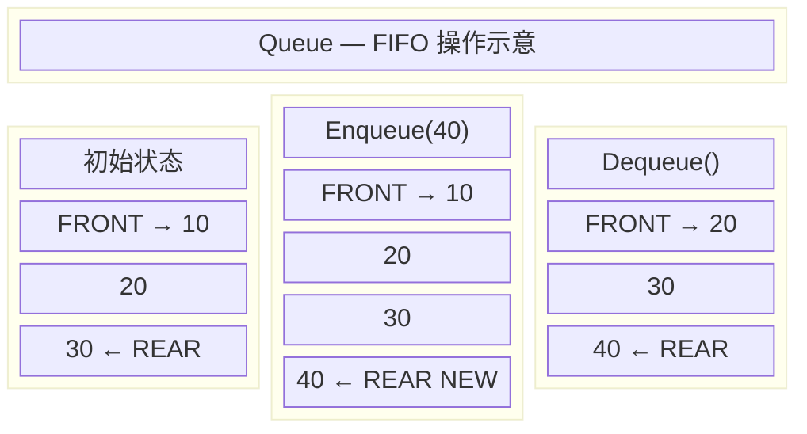
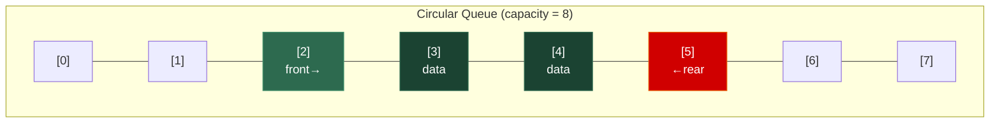
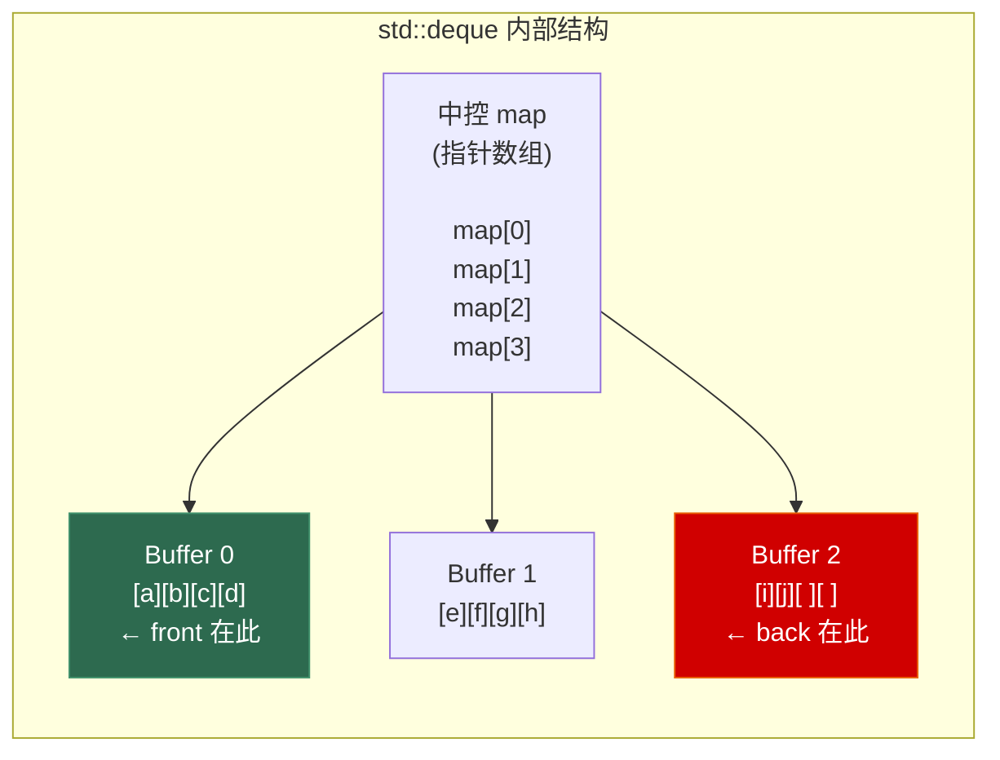
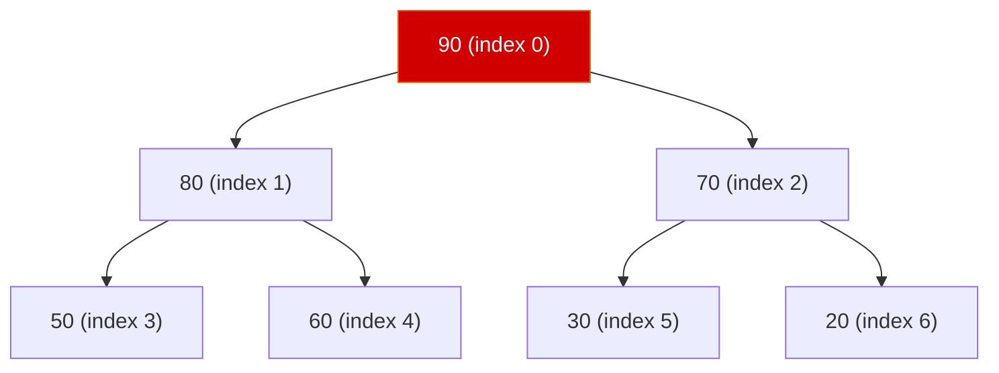

# 第四章 队列 (Queue)

> **一句话理解**：队列是一种**先进先出 (FIFO)** 的受限线性表——它在一端进、另一端出，保证了处理顺序的**绝对公平**。如果说栈是"后来居上"，那队列就是"先来后到"。

---

## 4.1 概念直觉 —— What & Why

### 什么是队列？

排队买奶茶——先到的人先点单、先拿到饮料。这就是队列的核心原则：**FIFO (First In, First Out)**。

队列暴露的核心操作：
- `push(x)` / `enqueue(x)`：入队——从**队尾**添加元素
- `pop()` / `dequeue()`：出队——从**队头**移除元素
- `front()`：查看队头元素（不移除）
- `back()`：查看队尾元素（不移除）

和栈一样，队列也是一种**受限的线性表**——故意限制操作来表达清晰的语义。当你看到一个 `std::queue`，你一眼就知道："这里的数据按照到达顺序被处理"。

### 队列的家族

队列不止一种。根据功能的扩展方向，队列分化出了几个重要的变体：

| 类型 | 特点 | STL 对应 | 典型场景 |
|------|------|----------|----------|
| 普通队列 | FIFO，一端进一端出 | `std::queue` | BFS、任务调度 |
| 循环队列 | 数组实现，首尾相接 | 无（需手写） | 固定大小缓冲区 |
| 双端队列 | **两端**都可以进出 | `std::deque` | 滑动窗口、工作窃取 |
| 优先队列 | 按**优先级**出队，不是按顺序 | `std::priority_queue` | A* 寻路、Top-K、任务调度 |
| 单调队列 | 维护队内单调性 | 无（需手写） | 滑动窗口最大/最小值 |

### 队列 vs 栈：FIFO vs LIFO

上一章我们深入了栈的世界。队列和栈是一对互补的受限结构：

| 维度 | 栈 (LIFO) | 队列 (FIFO) |
|------|-----------|-------------|
| 核心原则 | 后进先出 | **先进先出** |
| 生活类比 | 弹夹、一叠盘子 | 排队买票 |
| 插入端 | 顶部 | **尾部** |
| 删除端 | 顶部 | **头部** |
| 经典算法 | DFS、回溯、括号匹配 | **BFS**、层序遍历 |
| 游戏应用 | UI 栈、Undo/Redo | **事件系统**、消息队列 |

> 💡 **面试金句**：「DFS 用栈，BFS 用队列」是算法面试中最基本的选型公理。栈的后进先出导致**深度优先**（先钻到最深），队列的先进先出导致**广度优先**（先处理同层）。

### 为什么队列在系统设计中如此重要？

队列是**异步处理**和**解耦**的基石：

- **生产者-消费者模型**：生产者把任务丢进队列就走，消费者按顺序处理。二者互不等待。
- **流量削峰**：突发的请求先进队列缓冲，后端按自己的节奏消费。
- **事件驱动**：游戏引擎的事件系统、操作系统的消息循环，都是队列在幕后支撑。

从操作系统的进程调度到分布式系统的消息中间件（Kafka、RabbitMQ），队列无处不在。

---

## 4.2 结构图解

### 普通队列的 Enqueue / Dequeue 过程



> 入队（Enqueue）发生在**尾部**，出队（Dequeue）发生在**头部**。两端各司其职，互不干扰。

### 循环队列 —— 数组实现的精妙

普通数组实现队列有个致命问题：出队后前面的空间就浪费了。循环队列用取模运算让数组"首尾相接"：



```
入队：rear = (rear + 1) % capacity
出队：front = (front + 1) % capacity
队满判断：(rear + 1) % capacity == front  // 牺牲一个位置区分空和满
队空判断：front == rear
```

### `std::deque` 的分段连续内存

`std::deque`（Double-Ended Queue）是 C++ STL 中最精巧的容器之一。它在逻辑上是连续的，但物理上是**分段连续**——由一个中控 map 指向多个固定大小的 Buffer 块：



**关键设计**：
- 每个 Buffer 块大小固定（通常 512 字节 / `sizeof(T)` 个元素）
- 中控 map 是一个指针数组，可以**双向扩展**
- 头部插入：在 Buffer 0 的前端填充；如果 Buffer 0 满了，分配新 Buffer 放到 map 头部
- 尾部插入：在最后一个 Buffer 的尾端填充；满了就分配新 Buffer 追加到 map 尾部

> 💡 这种设计的妙处：扩容时只需要分配新的 Buffer 块，**不需要搬运旧数据**。对比 `std::vector` 扩容时要把所有元素拷贝到新内存，`deque` 的扩容代价要小得多。

### 优先队列 —— 堆的数组表示

`std::priority_queue` 底层是一个**二叉堆**，用数组存储完全二叉树：



```
数组表示：[90, 80, 70, 50, 60, 30, 20]

父节点 index = (i - 1) / 2
左子节点 index = 2 * i + 1  
右子节点 index = 2 * i + 2

最大堆性质：parent >= children（每次 top() 取最大值）
```

> 优先队列在第 6 章（堆）中会有更深入的分析。本章聚焦于它作为"队列变体"的使用方式。

---

## 4.3 C++ 底层实现

### 4.3.1 `std::queue` —— 又一个容器适配器

和 `std::stack` 一模一样，`std::queue` 也是一个**容器适配器**——自己不管理内存，只是在底层容器上包了一层 FIFO 接口：

```cpp
#include <deque>

template <typename T, typename Container = std::deque<T>>
class queue {
protected:
    Container c;  // 底层容器（默认 std::deque）

public:
    // ========== 容量查询 ==========
    bool empty() const       { return c.empty(); }
    std::size_t size() const { return c.size(); }

    // ========== 队头 / 队尾访问 ==========
    T& front()             { return c.front(); }
    const T& front() const { return c.front(); }
    T& back()              { return c.back(); }
    const T& back() const  { return c.back(); }

    // ========== 入队（尾部）==========
    void push(const T& x)   { c.push_back(x); }
    void push(T&& x)        { c.push_back(std::move(x)); }

    template <typename... Args>
    void emplace(Args&&... args) {
        c.emplace_back(std::forward<Args>(args)...);
    }

    // ========== 出队（头部）==========
    void pop()               { c.pop_front(); }
    // 同 std::stack，pop() 不返回值——异常安全设计
};
```

**为什么默认底层是 `std::deque` 而不是 `std::vector`？**

队列的核心操作是**尾部入队 + 头部出队**。`std::vector` 的 `pop_front` 是 O(n)（要搬运所有元素），这对队列来说是灾难性的。而 `std::deque` 的头部和尾部操作**都是 O(1)**：

| 操作 | `deque` | `vector` | `list` |
|------|---------|----------|--------|
| `push_back` | O(1) 均摊 | O(1) 均摊 | O(1) |
| `pop_front` | **O(1)** | ❌ **O(n)** | O(1) |
| 缓存友好 | ✅✅ (段内连续) | ✅✅✅ | ❌ |
| 扩容代价 | 新增 Buffer | 全量拷贝 | 无 |

> 💡 `std::queue` 也可以用 `std::list` 做底层（`std::queue<T, std::list<T>>`），但 `deque` 的缓存友好性更好，通常是更优选择。`vector` **不能**做 `std::queue` 的底层，因为它没有 `pop_front` 方法。

### 4.3.2 `std::deque` 深入 —— 分段连续内存的实现

`std::deque` 是 STL 中最复杂的顺序容器。理解它的内部结构对面试非常有帮助，因为它同时是 `std::queue` 和 `std::stack` 的默认底层。

#### 核心数据结构

```cpp
template <typename T>
class deque {
    // 每个 Buffer 块的元素数量（编译期计算）
    static constexpr std::size_t BUFFER_SIZE = 
        sizeof(T) < 512 ? (512 / sizeof(T)) : 1;

    // 迭代器——deque 迭代器是 STL 中最复杂的迭代器之一
    struct iterator {
        T*  cur;    // 当前元素的指针
        T*  first;  // 当前 Buffer 块的首元素
        T*  last;   // 当前 Buffer 块的尾后元素
        T** node;   // 指向中控 map 中的对应槽位
    };

    T**      _map;        // 中控 map（指针的数组）
    size_t   _map_size;   // map 的槽位数量
    iterator _start;      // 指向第一个元素
    iterator _finish;     // 指向最后一个元素的下一位
};
```

#### 随机访问的实现

虽然 `deque` 不是连续内存，但它**支持 O(1) 随机访问**！诀窍在于：已知每个 Buffer 块的大小，可以算出任意下标落在哪个 Buffer、哪个偏移：

```cpp
T& operator[](size_t n) {
    // 先算出在 start 所在 Buffer 内的偏移
    size_t offset = n + (_start.cur - _start.first);
    
    // 哪个 Buffer？
    size_t buffer_index = offset / BUFFER_SIZE;
    // Buffer 内偏移？
    size_t element_index = offset % BUFFER_SIZE;
    
    return _map[buffer_index][element_index];
}
```

> 💡 虽然是 O(1)，但常数比 `vector` 大（多了一次除法和间接寻址）。对于随机访问密集的场景，`vector` 仍然是首选。

#### 头部 / 尾部插入的实现

```cpp
void push_back(const T& value) {
    if (_finish.cur != _finish.last - 1) {
        // 当前 Buffer 还有空间
        *_finish.cur = value;
        ++_finish.cur;
    } else {
        // 当前 Buffer 满了，需要新 Buffer
        _push_back_aux(value);  // 分配新 Buffer 块, 不搬旧数据!
    }
}

void push_front(const T& value) {
    if (_start.cur != _start.first) {
        // 当前 Buffer 前面还有空间
        --_start.cur;
        *_start.cur = value;
    } else {
        // 需要在前面分配新 Buffer
        _push_front_aux(value);
    }
}
```

**`std::deque` 关键特性总结**：

| 特性 | 说明 |
|------|------|
| 随机访问 | ✅ O(1)，但常数比 `vector` 大 |
| 头尾插删 | ✅ O(1) 均摊 |
| 中间插删 | ❌ O(n)，需要搬移元素 |
| 扩容策略 | 分配新 Buffer 块，**不搬旧数据** |
| 内存释放 | Buffer 块空了可以释放 |
| 迭代器失效 | 头尾插入：可能使迭代器失效（map 可能重新分配）；中间插入：全部失效 |
| 内存连续性 | 段内连续，段间不连续 |
| 适合场景 | 两端频繁增删、不确定大小的容器（`stack`/`queue` 的默认底层） |

### 4.3.3 `std::priority_queue` —— 堆适配器

`std::priority_queue` 是第三个容器适配器（前两个是 `stack` 和 `queue`）。它的底层是一个 `std::vector`，通过 `make_heap` / `push_heap` / `pop_heap` 维护堆序：

```cpp
template <
    typename T,
    typename Container = std::vector<T>,
    typename Compare = std::less<T>       // 默认最大堆
>
class priority_queue {
protected:
    Container c;
    Compare   comp;

public:
    // ========== 容量 ==========
    bool empty() const       { return c.empty(); }
    std::size_t size() const { return c.size(); }

    // ========== 堆顶（最大/最小元素）==========
    const T& top() const { return c.front(); }

    // ========== 入队（插入 + 上浮）==========
    void push(const T& x) {
        c.push_back(x);                    // 1. 先放到末尾
        std::push_heap(c.begin(), c.end(), comp);  // 2. sift-up 恢复堆序
    }

    // ========== 出队（堆顶移除 + 下沉）==========
    void pop() {
        std::pop_heap(c.begin(), c.end(), comp);  // 1. 堆顶换到末尾
        c.pop_back();                              // 2. 删除末尾
        // pop_heap 内部做了 sift-down 恢复堆序
    }
};
```

**关键细节**：

```cpp
// 默认是最大堆（std::less → 父 > 子）
std::priority_queue<int> max_pq;  // top() 返回最大值

// 最小堆需要用 std::greater
std::priority_queue<int, std::vector<int>, std::greater<int>> min_pq;

// 自定义比较器（常用于结构体）
auto cmp = [](const Task& a, const Task& b) {
    return a.priority < b.priority;  // priority 大的先出队
};
std::priority_queue<Task, std::vector<Task>, decltype(cmp)> task_pq(cmp);
```

> 💡 **面试陷阱**：`std::less` 对应**最大堆**（直觉上容易搞反）。记忆方法：`std::less` 决定了谁应该"沉下去"（小的沉底 → 大的在顶）。

### 4.3.4 手写循环队列 (Circular Queue)

循环队列是面试高频手写题（LeetCode 622）。用数组 + 取模实现首尾相接：

```cpp
template <typename T, std::size_t Capacity>
class CircularQueue {
    static_assert(Capacity > 0, "Capacity must be > 0");

    // 多分配一个位置，用于区分"空"和"满"
    std::array<T, Capacity + 1> _buf{};
    std::size_t _front = 0;  // 队头（下一个出队的位置）
    std::size_t _rear  = 0;  // 队尾（下一个入队的位置）

    static constexpr std::size_t N = Capacity + 1;

    std::size_t _next(std::size_t idx) const {
        return (idx + 1) % N;
    }

public:
    bool enqueue(const T& value) {
        if (full()) return false;
        _buf[_rear] = value;
        _rear = _next(_rear);
        return true;
    }

    bool dequeue() {
        if (empty()) return false;
        _front = _next(_front);
        return true;
    }

    T& front() { return _buf[_front]; }
    const T& front() const { return _buf[_front]; }

    T& back() {
        // rear 的前一个位置就是最后入队的元素
        return _buf[(_rear + N - 1) % N];
    }

    bool empty() const { return _front == _rear; }
    bool full() const  { return _next(_rear) == _front; }

    std::size_t size() const {
        return (_rear + N - _front) % N;
    }

    std::size_t capacity() const { return Capacity; }
};
```

**为什么要多分配一个位置？**

如果不多分配，当 `front == rear` 时，无法区分是"队列空"还是"队列满"。多分配一个位置后：

```
空：front == rear
满：(rear + 1) % N == front
```

代价仅仅是浪费一个 `T` 大小的空间——比维护一个额外的 `size` 计数器更简洁。

> 💡 另一种方案是用一个 `_size` 成员变量来区分空和满（第 1 章的 RingBuffer 就是这种方案）。两种方案各有拥趸，面试时任选其一，但要能解释另一种。

### 4.3.5 手写双端循环队列 (Circular Deque)

LeetCode 641 要求实现双端循环队列，比普通循环队列多了 `insertFront` 和 `deleteLast`：

```cpp
template <typename T, std::size_t Capacity>
class CircularDeque {
    static_assert(Capacity > 0, "Capacity must be > 0");

    std::array<T, Capacity + 1> _buf{};
    std::size_t _front = 0;
    std::size_t _rear  = 0;

    static constexpr std::size_t N = Capacity + 1;

    std::size_t _next(std::size_t idx) const { return (idx + 1) % N; }
    std::size_t _prev(std::size_t idx) const { return (idx + N - 1) % N; }

public:
    // ========== 尾部操作（和普通队列一样）==========
    bool insertLast(const T& value) {
        if (full()) return false;
        _buf[_rear] = value;
        _rear = _next(_rear);
        return true;
    }

    bool deleteLast() {
        if (empty()) return false;
        _rear = _prev(_rear);
        return true;
    }

    // ========== 头部操作（双端队列特有）==========
    bool insertFront(const T& value) {
        if (full()) return false;
        _front = _prev(_front);  // front 向前退一步
        _buf[_front] = value;
        return true;
    }

    bool deleteFront() {
        if (empty()) return false;
        _front = _next(_front);
        return true;
    }

    // ========== 访问 ==========
    T& getFront() { return _buf[_front]; }
    T& getRear()  { return _buf[_prev(_rear)]; }

    bool empty() const { return _front == _rear; }
    bool full() const  { return _next(_rear) == _front; }
    std::size_t size() const { return (_rear + N - _front) % N; }
};
```

> 💡 **核心技巧**：`_prev` 函数用 `(idx + N - 1) % N` 而不是 `(idx - 1) % N`，因为当 `idx == 0` 时，`-1 % N` 在 C++ 中的行为取决于实现（C++11 前是实现定义的）。加上 N 再取模确保结果始终非负。

---

## 4.4 复杂度速查表

### `std::queue` 操作复杂度

| 操作 | 时间复杂度 | 说明 |
|------|-----------|------|
| `push` | **O(1)** 均摊 | 底层容器的 `push_back` |
| `pop` | **O(1)** | 底层容器的 `pop_front` |
| `front` / `back` | **O(1)** | |
| `size` / `empty` | O(1) | |
| 查找 / 随机访问 | ❌ **不支持** | 队列不暴露随机访问接口 |

### `std::deque` 操作复杂度

| 操作 | 时间复杂度 | 说明 |
|------|-----------|------|
| `operator[]` / `at` | **O(1)** | 除法 + 间接寻址，常数比 vector 大 |
| `push_back` | **O(1)** 均摊 | 新增 Buffer 块时有分配开销 |
| `push_front` | **O(1)** 均摊 | 同上 |
| `pop_back` | **O(1)** | |
| `pop_front` | **O(1)** | |
| `insert` (中间) | **O(n)** | 需要搬移元素 |
| `erase` (中间) | **O(n)** | 需要搬移元素（会选搬移较少一侧） |
| `front` / `back` | O(1) | |

### `std::priority_queue` 操作复杂度

| 操作 | 时间复杂度 | 说明 |
|------|-----------|------|
| `push` | **O(log n)** | 插入末尾 + sift-up |
| `pop` | **O(log n)** | 堆顶与末尾交换 + sift-down |
| `top` | **O(1)** | 返回堆顶（最大 or 最小元素） |
| `size` / `empty` | O(1) | |
| 查找 | ❌ **不支持** | 堆内部无序 |
| 修改优先级 | ❌ **不支持** | 需要手写堆或用 `std::set` 替代 |

### 横向对比：队列家族

| 维度 | `queue` | `deque` | `priority_queue` | 循环队列 |
|------|---------|---------|-------------------|----------|
| 入队复杂度 | O(1) | O(1) | **O(log n)** | O(1) |
| 出队复杂度 | O(1) | O(1) | **O(log n)** | O(1) |
| 出队顺序 | FIFO | 两端均可 | **按优先级** | FIFO |
| 随机访问 | ❌ | ✅ O(1) | ❌ | ❌ |
| 底层结构 | 适配器 (deque) | 分段数组 | 适配器 (vector + heap) | 数组 + 取模 |
| 头部插入 | ❌ | ✅ O(1) | N/A | ❌ |
| 内存 | 动态 | 动态 | 动态 | **固定** |

---

## 4.5 面试高频题

### 4.5.1 BFS 层序遍历 (LeetCode 102)

> 给定二叉树，返回其按层序遍历的结果（即逐层从左到右访问所有节点）。

BFS 是队列最经典的应用。核心模型：用队列维护"当前层的待处理节点"。

```cpp
struct TreeNode {
    int val;
    TreeNode* left;
    TreeNode* right;
    TreeNode(int x) : val(x), left(nullptr), right(nullptr) {}
};

std::vector<std::vector<int>> levelOrder(TreeNode* root) {
    std::vector<std::vector<int>> result;
    if (!root) return result;

    std::queue<TreeNode*> q;
    q.push(root);

    while (!q.empty()) {
        int level_size = q.size();  // 关键：记录当前层的节点数
        std::vector<int> level;

        for (int i = 0; i < level_size; ++i) {
            TreeNode* node = q.front();
            q.pop();

            level.push_back(node->val);

            // 下一层的节点入队
            if (node->left)  q.push(node->left);
            if (node->right) q.push(node->right);
        }

        result.push_back(std::move(level));
    }
    return result;
}
// 时间 O(n)：每个节点进出队列各一次
// 空间 O(n)：最坏情况（完全二叉树最后一层有 n/2 个节点）
```

> 💡 **面试核心技巧**：`level_size = q.size()` 这行是层序遍历的灵魂。在循环开始前记录当前层有多少节点，然后只处理这么多个——这样就把"层"的概念隐含在了 BFS 中。

**变体题**：
- **LC 107 层序遍历 II**：结果从底层到顶层 → 把 result `reverse` 即可
- **LC 103 锯齿形遍历**：奇数层从右到左 → 奇数层的 level 做 `reverse`
- **LC 199 右视图**：每层只取最后一个元素
- **LC 515 每层最大值**：每层取 `max`

### 4.5.2 岛屿数量 — BFS 版 (LeetCode 200)

> 给定一个 '1'（陆地）和 '0'（水）组成的二维网格，计算岛屿数量。

虽然 DFS（栈 / 递归）也能解，但 BFS 是更工程化的做法（避免栈溢出）：

```cpp
int numIslands(std::vector<std::vector<char>>& grid) {
    if (grid.empty()) return 0;

    int rows = grid.size(), cols = grid[0].size();
    int count = 0;

    // 方向数组——上下左右
    constexpr int dx[] = {0, 0, 1, -1};
    constexpr int dy[] = {1, -1, 0, 0};

    for (int i = 0; i < rows; ++i) {
        for (int j = 0; j < cols; ++j) {
            if (grid[i][j] == '1') {
                ++count;
                grid[i][j] = '0';  // 标记为已访问

                // BFS 扩散
                std::queue<std::pair<int, int>> q;
                q.push({i, j});

                while (!q.empty()) {
                    auto [x, y] = q.front();
                    q.pop();

                    for (int d = 0; d < 4; ++d) {
                        int nx = x + dx[d];
                        int ny = y + dy[d];
                        if (nx >= 0 && nx < rows && ny >= 0 && ny < cols
                            && grid[nx][ny] == '1') {
                            grid[nx][ny] = '0';  // 入队时就标记！
                            q.push({nx, ny});
                        }
                    }
                }
            }
        }
    }
    return count;
}
// 时间 O(M×N), 空间 O(min(M, N))
```

> 💡 **易错点**：标记已访问应该在**入队时**而不是**出队时**！如果在出队时标记，同一个节点可能被相邻节点重复入队，导致性能退化甚至 TLE。

### 4.5.3 滑动窗口最大值 (LeetCode 239) —— 单调队列

> 给定数组和窗口大小 k，返回每个窗口中的最大值。

这是**队列题中最经典的 Hard 题**，面试区分度极高。暴力 O(nk) 会超时，单调队列可以做到 O(n)。

**核心思想**：维护一个**单调递减的双端队列**（存下标），队头永远是当前窗口的最大值。

```cpp
std::vector<int> maxSlidingWindow(std::vector<int>& nums, int k) {
    std::vector<int> result;
    std::deque<int> dq;  // 存下标，对应的值单调递减

    for (int i = 0; i < static_cast<int>(nums.size()); ++i) {
        // 1. 移除队头过期的元素（出了窗口范围）
        while (!dq.empty() && dq.front() <= i - k) {
            dq.pop_front();
        }

        // 2. 维护单调性：新元素比队尾大，队尾永远不可能是答案了
        while (!dq.empty() && nums[dq.back()] <= nums[i]) {
            dq.pop_back();
        }

        // 3. 新元素入队
        dq.push_back(i);

        // 4. 窗口形成后，队头就是最大值
        if (i >= k - 1) {
            result.push_back(nums[dq.front()]);
        }
    }
    return result;
}
// 时间 O(n)：每个元素最多入队一次、出队一次
// 空间 O(k)
```

**图解推演**（`nums = [1, 3, -1, -3, 5, 3, 6, 7]`，`k = 3`）：

```
i=0: deque=[0]           nums[0]=1    窗口未满
i=1: 3>1,弹0  deque=[1]  nums[1]=3    窗口未满
i=2: -1<3     deque=[1,2]             窗口[1,3,-1] → max=nums[1]=3
i=3: -3<-1    deque=[1,2,3]           窗口[3,-1,-3] → max=nums[1]=3
i=4: 5>-3,弹3; 5>-1,弹2; 5>3,弹1
               deque=[4]              窗口[-1,-3,5] → max=nums[4]=5
i=5: 3<5      deque=[4,5]             窗口[-3,5,3] → max=nums[4]=5
i=6: 6>3,弹5; 6>5,弹4
               deque=[6]              窗口[5,3,6] → max=nums[6]=6
i=7: 7>6,弹6  deque=[7]              窗口[3,6,7] → max=nums[7]=7

结果：[3, 3, 5, 5, 6, 7]
```

> 💡 **单调队列 vs 单调栈**：
> - **单调栈**（第 3 章）：解决"找左/右边第一个更大/小元素"
> - **单调队列**：解决"滑动窗口中的最值"
> - 两者都利用了"永远不可能成为答案的元素提前淘汰"的贪心思想

### 4.5.4 Top-K 问题 (LeetCode 215 / 347)

#### 数组中第 K 大的元素 (LC 215)

> 在未排序的数组中找到第 K 大的元素。

**方法一：最小堆（优先队列），O(n log k)**

```cpp
int findKthLargest(std::vector<int>& nums, int k) {
    // 维护一个大小为 k 的最小堆
    // 堆中始终保存目前为止最大的 k 个元素
    // 堆顶就是第 k 大的
    std::priority_queue<int, std::vector<int>, std::greater<int>> min_pq;

    for (int num : nums) {
        min_pq.push(num);
        if (min_pq.size() > k) {
            min_pq.pop();  // 弹出最小的，保持堆大小为 k
        }
    }
    return min_pq.top();
}
// 时间 O(n log k), 空间 O(k)
```

> 💡 **为什么用最小堆而不是最大堆？** 我们要保留最大的 k 个元素，当堆满时需要淘汰最小的那个。最小堆的堆顶恰好就是堆中最小的，pop 掉即可。

**方法二：快速选择（Quick Select），平均 O(n)**

```cpp
int findKthLargest_quickselect(std::vector<int>& nums, int k) {
    // 第 k 大 = 第 (n-k) 小（0-indexed）
    int target = nums.size() - k;
    int lo = 0, hi = nums.size() - 1;

    while (lo < hi) {
        int pivot = _partition(nums, lo, hi);
        if (pivot == target)      return nums[pivot];
        else if (pivot < target)  lo = pivot + 1;
        else                      hi = pivot - 1;
    }
    return nums[lo];
}

int _partition(std::vector<int>& nums, int lo, int hi) {
    // 随机选 pivot 避免最坏情况
    int rand_idx = lo + rand() % (hi - lo + 1);
    std::swap(nums[rand_idx], nums[hi]);

    int pivot = nums[hi];
    int i = lo;
    for (int j = lo; j < hi; ++j) {
        if (nums[j] <= pivot) {
            std::swap(nums[i], nums[j]);
            ++i;
        }
    }
    std::swap(nums[i], nums[hi]);
    return i;
}
// 平均 O(n), 最坏 O(n²)
```

| 方法 | 时间 | 空间 | 优势 | 劣势 |
|------|------|------|------|------|
| 最小堆 | O(n log k) | O(k) | 稳定、适合数据流 | k 接近 n 时退化 |
| 快速选择 | O(n) 平均 | O(1) | 平均最快 | 最坏 O(n²)、会修改数组 |
| `std::nth_element` | O(n) 平均 | O(1) | STL 内置、最简洁 | 同快速选择 |

#### 前 K 个高频元素 (LC 347)

> 给定整数数组和 k，返回出现频率最高的 k 个元素。

```cpp
std::vector<int> topKFrequent(std::vector<int>& nums, int k) {
    // 1. 统计频率
    std::unordered_map<int, int> freq;
    for (int n : nums) ++freq[n];

    // 2. 最小堆，按频率排序
    auto cmp = [](const std::pair<int,int>& a, const std::pair<int,int>& b) {
        return a.second > b.second;  // 频率小的在堆顶
    };
    std::priority_queue<std::pair<int,int>,
                        std::vector<std::pair<int,int>>,
                        decltype(cmp)> pq(cmp);

    for (auto& [num, cnt] : freq) {
        pq.push({num, cnt});
        if (pq.size() > k) pq.pop();
    }

    // 3. 输出
    std::vector<int> result;
    while (!pq.empty()) {
        result.push_back(pq.top().first);
        pq.pop();
    }
    return result;
}
// 时间 O(n log k), 空间 O(n)
```

### 4.5.5 任务调度器 (LeetCode 621)

> 给定任务数组和冷却时间 n，同种任务之间至少间隔 n 个时间段。求完成所有任务的最少时间。

```cpp
int leastInterval(std::vector<char>& tasks, int n) {
    // 贪心策略：每个时间段优先执行剩余数量最多的任务
    std::array<int, 26> freq{};
    for (char t : tasks) ++freq[t - 'A'];

    // 最大堆：按剩余次数排序
    std::priority_queue<int> pq;
    for (int f : freq) {
        if (f > 0) pq.push(f);
    }

    int time = 0;

    while (!pq.empty()) {
        std::vector<int> cooldown;  // 本轮执行后需要冷却的任务

        // 一个冷却周期 = n + 1 个时间段
        for (int i = 0; i <= n; ++i) {
            if (!pq.empty()) {
                int remaining = pq.top() - 1;  // 执行一次
                pq.pop();
                if (remaining > 0) {
                    cooldown.push_back(remaining);
                }
            }
            ++time;

            // 如果所有任务都做完了，提前退出
            if (pq.empty() && cooldown.empty()) break;
        }

        // 冷却完毕，重新入堆
        for (int r : cooldown) pq.push(r);
    }

    return time;
}
// 时间 O(n × |tasks|), 空间 O(26) = O(1)
```

> 💡 **面试中的思路阐述**：「贪心策略：每次优先处理剩余次数最多的任务，这样可以最大化利用冷却间隙。优先队列天然支持高效取最大值。」

### 4.5.6 用队列实现栈 (LeetCode 225)

> 仅使用两个队列（或一个队列）实现 LIFO 栈。

第 3 章我们用双栈实现了队列，这次反过来：

```cpp
class MyStack {
    std::queue<int> _q;

public:
    // 核心技巧：push 时把新元素"翻"到队列头部
    void push(int x) {
        _q.push(x);
        // 把前面所有元素搬到 x 后面
        for (int i = 0; i < static_cast<int>(_q.size()) - 1; ++i) {
            _q.push(_q.front());
            _q.pop();
        }
    }

    int pop() {
        int val = _q.front();
        _q.pop();
        return val;
    }

    int top()   { return _q.front(); }
    bool empty() { return _q.empty(); }
};
// push: O(n), pop/top: O(1)
// 用一个队列就够了！
```

> 💡 **面试对称题**：LC 232（栈→队列）的均摊 push O(1)、pop O(1)，和 LC 225（队列→栈）的 push O(n)、pop O(1)，形成完美对照。面试官经常连着考这两道。

### 4.5.7 面试题速查表

| 题号 | 题目 | 核心技巧 | 难度 |
|------|------|----------|------|
| LC 102 | 二叉树层序遍历 | BFS + 队列 | Medium |
| LC 200 | 岛屿数量 | BFS 扩散 | Medium |
| LC 225 | 用队列实现栈 | 单队列翻转 | Easy |
| LC 239 | 滑动窗口最大值 | **单调队列** | Hard |
| LC 215 | 第 K 大的元素 | 最小堆 / 快选 | Medium |
| LC 347 | 前 K 个高频元素 | 哈希 + 最小堆 | Medium |
| LC 621 | 任务调度器 | 贪心 + 最大堆 | Medium |
| LC 622 | 设计循环队列 | 数组 + 取模 | Medium |
| LC 641 | 设计循环双端队列 | 双端取模 | Medium |
| LC 862 | 和至少为 K 的最短子数组 | 前缀和 + **单调队列** | Hard |
| LC 933 | 最近的请求次数 | 队列 + 时间窗口 | Easy |
| LC 994 | 腐烂的橘子 | 多源 BFS | Medium |
| LC 1696 | 跳跃游戏 VI | DP + **单调队列优化** | Medium |
| LC 373 | 查找和最小的 K 对数字 | 优先队列 + BFS | Medium |

---

## 4.6 🎮 实战场景

### 4.6.1 事件系统 (Event Queue) —— 游戏引擎的神经系统

几乎所有游戏引擎都有一个核心的**事件队列**。当各个子系统产生事件（玩家输入、碰撞检测、网络消息、UI 交互等），不是立刻处理，而是先入队，然后在帧循环的特定阶段统一分发。

**为什么不直接处理？**

1. **解耦**：产生事件的模块不需要知道谁会处理它
2. **时序可控**：所有事件在统一时间点处理，避免处理中途状态不一致
3. **可重放**：事件队列天然支持录像回放和网络同步

```cpp
#include <queue>
#include <variant>
#include <functional>
#include <unordered_map>
#include <vector>
#include <string>

// ===== 事件类型定义 =====
struct InputEvent {
    enum class Type { KeyDown, KeyUp, MouseMove, MouseClick };
    Type type;
    int  key_code;
    float mouse_x, mouse_y;
};

struct CollisionEvent {
    uint32_t entity_a;
    uint32_t entity_b;
    float    impact_force;
};

struct DamageEvent {
    uint32_t source;
    uint32_t target;
    float    amount;
    std::string damage_type;  // "physical", "magical", "true"
};

struct AudioEvent {
    std::string sound_name;
    float volume;
    float x, y;  // 3D 位置
};

// 使用 std::variant 统一所有事件类型
using GameEvent = std::variant<InputEvent, CollisionEvent, DamageEvent, AudioEvent>;

// ===== 事件队列 =====
class EventQueue {
    std::queue<GameEvent> _queue;

public:
    // 任何系统都可以发布事件
    template <typename E>
    void publish(E&& event) {
        _queue.push(std::forward<E>(event));
    }

    // 每帧统一处理
    void process_all(auto&& handler) {
        while (!_queue.empty()) {
            std::visit(handler, _queue.front());
            _queue.pop();
        }
    }

    std::size_t pending() const { return _queue.size(); }
    bool empty() const { return _queue.empty(); }
};

// ===== 使用示例 =====
class GameEngine {
    EventQueue _events;

public:
    void update(float dt) {
        // 1. 各子系统产生事件
        poll_input();
        update_physics(dt);
        update_ai(dt);

        // 2. 统一处理所有事件
        _events.process_all([this](auto&& event) {
            using T = std::decay_t<decltype(event)>;

            if constexpr (std::is_same_v<T, DamageEvent>) {
                apply_damage(event);
            } else if constexpr (std::is_same_v<T, CollisionEvent>) {
                handle_collision(event);
            } else if constexpr (std::is_same_v<T, AudioEvent>) {
                play_sound(event);
            } else if constexpr (std::is_same_v<T, InputEvent>) {
                handle_input(event);
            }
        });

        // 3. 渲染
        render();
    }

    // 物理系统检测到碰撞 → 发布事件（而不是直接处理）
    void update_physics(float dt) {
        // ... 碰撞检测 ...
        // if (collision_detected) {
        //     _events.publish(CollisionEvent{id_a, id_b, force});
        //     _events.publish(DamageEvent{id_a, id_b, 25.0f, "physical"});
        //     _events.publish(AudioEvent{"hit_sound", 0.8f, x, y});
        // }
    }

    // 以下为简化声明
    void poll_input() {}
    void update_ai(float) {}
    void apply_damage(const DamageEvent&) {}
    void handle_collision(const CollisionEvent&) {}
    void play_sound(const AudioEvent&) {}
    void handle_input(const InputEvent&) {}
    void render() {}
};
```

**事件队列的进阶模式**：

| 模式 | 描述 | 用途 |
|------|------|------|
| 优先级事件队列 | 用 `priority_queue` 按优先级处理 | 关键事件（如死亡）优先于普通事件（如UI动画） |
| 延迟事件 | 事件附带触发时间，到时才处理 | 定时技能、延迟伤害、倒计时 |
| 事件过滤 | 处理前过滤重复/过期事件 | 防止帧内重复碰撞 |
| 帧内 vs 帧间 | 区分立即处理和延迟到下帧的事件 | 避免事件触发链导致死循环 |

### 4.6.2 渲染命令缓冲 (Render Command Buffer)

现代渲染架构（Vulkan、DirectX 12、Metal）的核心理念就是**命令缓冲**——CPU 把渲染指令录入命令队列，GPU 异步执行。即使在较高层的引擎中，也会用命令队列来**解耦渲染线程和逻辑线程**。

```cpp
#include <queue>
#include <variant>
#include <cstdint>
#include <array>

// ===== 渲染命令定义 =====
struct ClearCommand {
    float r, g, b, a;
};

struct DrawMeshCommand {
    uint32_t mesh_id;
    uint32_t material_id;
    std::array<float, 16> transform;  // 4x4 矩阵（列主序）
};

struct SetViewportCommand {
    int x, y, width, height;
};

struct DrawUICommand {
    uint32_t texture_id;
    float x, y, w, h;    // 屏幕坐标矩形
    float u0, v0, u1, v1; // UV 坐标
};

struct SetBlendModeCommand {
    enum class Mode { Opaque, Alpha, Additive };
    Mode mode;
};

using RenderCommand = std::variant<
    ClearCommand,
    DrawMeshCommand,
    SetViewportCommand,
    DrawUICommand,
    SetBlendModeCommand
>;

// ===== 渲染命令队列 =====
class RenderCommandBuffer {
    std::queue<RenderCommand> _commands;

public:
    template <typename Cmd>
    void submit(Cmd&& cmd) {
        _commands.push(std::forward<Cmd>(cmd));
    }

    // 渲染线程按顺序执行所有命令
    void execute(auto&& gpu) {
        while (!_commands.empty()) {
            std::visit(gpu, _commands.front());
            _commands.pop();
        }
    }

    void clear() {
        std::queue<RenderCommand> empty;
        std::swap(_commands, empty);
    }

    std::size_t command_count() const { return _commands.size(); }
};
```

**使用方式**：

```cpp
// 逻辑线程：录制渲染命令（不涉及 GPU 调用）
RenderCommandBuffer cmd_buf;

cmd_buf.submit(ClearCommand{0.1f, 0.1f, 0.15f, 1.0f});
cmd_buf.submit(SetViewportCommand{0, 0, 1920, 1080});

// 渲染所有不透明物体
cmd_buf.submit(SetBlendModeCommand{SetBlendModeCommand::Mode::Opaque});
for (auto& obj : opaque_objects) {
    cmd_buf.submit(DrawMeshCommand{obj.mesh, obj.material, obj.transform});
}

// 渲染半透明物体
cmd_buf.submit(SetBlendModeCommand{SetBlendModeCommand::Mode::Alpha});
for (auto& obj : transparent_objects) {
    cmd_buf.submit(DrawMeshCommand{obj.mesh, obj.material, obj.transform});
}

// UI 最后渲染
for (auto& ui : ui_elements) {
    cmd_buf.submit(DrawUICommand{ui.texture, ui.rect.x, ui.rect.y,
                                  ui.rect.w, ui.rect.h,
                                  0, 0, 1, 1});
}

// 渲染线程：执行命令（实际调用 GPU API）
// cmd_buf.execute(gpu_backend);
```

> 💡 **为什么用队列而不是 vector？** 在简单场景下 `vector` 也能用（存完后遍历执行）。但队列的优势是可以**边录边放**——当逻辑线程和渲染线程在不同核心上时，逻辑线程往队列尾部推命令，渲染线程从队列头部取命令执行，实现流水线并行。

### 4.6.3 网络消息缓冲 (Network Message Buffer)

网络游戏中，服务器发来的消息到达时间不确定，且可能突发大量消息（如进入新场景时同步大量实体）。用队列缓冲后逐帧处理，避免单帧卡顿：

```cpp
#include <queue>
#include <mutex>
#include <optional>
#include <vector>
#include <cstdint>

struct NetworkMessage {
    uint16_t type;
    uint32_t sender_id;
    std::vector<uint8_t> payload;
    double   timestamp;
};

// 线程安全的消息队列（网络线程写入，逻辑线程读取）
class MessageQueue {
    std::queue<NetworkMessage> _queue;
    mutable std::mutex _mutex;

    // 防止单帧处理太多消息导致卡顿
    static constexpr int MAX_MESSAGES_PER_FRAME = 100;

public:
    // 网络线程调用——线程安全推入
    void push(NetworkMessage msg) {
        std::lock_guard lock(_mutex);
        _queue.push(std::move(msg));
    }

    // 逻辑线程调用——批量取出（限制数量）
    std::vector<NetworkMessage> drain(int max_count = MAX_MESSAGES_PER_FRAME) {
        std::lock_guard lock(_mutex);
        std::vector<NetworkMessage> batch;

        int count = std::min(max_count, static_cast<int>(_queue.size()));
        batch.reserve(count);

        for (int i = 0; i < count; ++i) {
            batch.push_back(std::move(_queue.front()));
            _queue.pop();
        }
        return batch;
    }

    std::size_t pending() const {
        std::lock_guard lock(_mutex);
        return _queue.size();
    }
};

// ===== 游戏逻辑中使用 =====
class NetworkManager {
    MessageQueue _incoming;

public:
    // 每帧调用
    void process_messages() {
        auto messages = _incoming.drain();

        for (auto& msg : messages) {
            switch (msg.type) {
                case 0x01: handle_player_move(msg); break;
                case 0x02: handle_spawn_entity(msg); break;
                case 0x03: handle_chat_message(msg); break;
                case 0x04: handle_damage_sync(msg); break;
                default: break;
            }
        }
    }

    // 网络线程回调
    void on_message_received(NetworkMessage msg) {
        _incoming.push(std::move(msg));
    }

private:
    void handle_player_move(const NetworkMessage&) {}
    void handle_spawn_entity(const NetworkMessage&) {}
    void handle_chat_message(const NetworkMessage&) {}
    void handle_damage_sync(const NetworkMessage&) {}
};
```

> 💡 **生产者-消费者模式**：网络线程是生产者（不停收消息入队），逻辑线程是消费者（每帧取一批处理）。`std::mutex` 保证线程安全。实际项目中可能使用无锁队列（Lock-Free Queue）来避免锁竞争。

### 4.6.4 A* 寻路的 Open List (优先队列)

A* 是游戏开发中最经典的寻路算法。它的核心数据结构就是一个**优先队列**（Open List），按 `f = g + h` 的值排序：

```cpp
#include <queue>
#include <vector>
#include <unordered_set>
#include <cmath>
#include <functional>

struct GridPos {
    int x, y;
    bool operator==(const GridPos& o) const { return x == o.x && y == o.y; }
};

// 哈希函数（用于 unordered_set）
struct GridPosHash {
    std::size_t operator()(const GridPos& p) const {
        return std::hash<int>()(p.x) ^ (std::hash<int>()(p.y) << 16);
    }
};

struct AStarNode {
    GridPos pos;
    float g;  // 起点到当前的实际代价
    float f;  // f = g + h（总估计代价）

    // 优先队列需要：f 小的优先级高
    bool operator>(const AStarNode& o) const { return f > o.f; }
};

// 启发函数：曼哈顿距离（四方向移动）
float manhattan(GridPos a, GridPos b) {
    return std::abs(a.x - b.x) + std::abs(a.y - b.y);
}

// 启发函数：欧几里得距离（八方向移动）
float euclidean(GridPos a, GridPos b) {
    float dx = a.x - b.x;
    float dy = a.y - b.y;
    return std::sqrt(dx * dx + dy * dy);
}

std::vector<GridPos> a_star(
    const std::vector<std::vector<int>>& grid,
    GridPos start, GridPos goal)
{
    int rows = grid.size(), cols = grid[0].size();

    // ★ 核心：优先队列（最小堆），按 f 值排序
    std::priority_queue<AStarNode, std::vector<AStarNode>,
                        std::greater<AStarNode>> open_list;

    // Closed set：已确定最短路径的节点
    std::unordered_set<GridPos, GridPosHash> closed;

    // 记录每个节点的最优 g 值和父节点（用于回溯路径）
    std::unordered_map<GridPos, float, GridPosHash> best_g;
    std::unordered_map<GridPos, GridPos, GridPosHash> parent;

    open_list.push({start, 0.0f, manhattan(start, goal)});
    best_g[start] = 0.0f;

    // 四方向移动
    constexpr int dx[] = {0, 0, 1, -1};
    constexpr int dy[] = {1, -1, 0, 0};

    while (!open_list.empty()) {
        AStarNode current = open_list.top();
        open_list.pop();

        // 到达终点！
        if (current.pos == goal) {
            // 回溯路径
            std::vector<GridPos> path;
            GridPos p = goal;
            while (!(p == start)) {
                path.push_back(p);
                p = parent[p];
            }
            path.push_back(start);
            std::reverse(path.begin(), path.end());
            return path;
        }

        // 跳过已处理的节点
        if (closed.count(current.pos)) continue;
        closed.insert(current.pos);

        // 扩展邻居
        for (int d = 0; d < 4; ++d) {
            GridPos next{current.pos.x + dx[d], current.pos.y + dy[d]};

            // 边界检查 + 障碍物检查
            if (next.x < 0 || next.x >= rows ||
                next.y < 0 || next.y >= cols ||
                grid[next.x][next.y] == 1 ||   // 1 = 障碍物
                closed.count(next)) {
                continue;
            }

            float new_g = current.g + 1.0f;  // 每步代价 1

            // 只在找到更优路径时更新
            if (!best_g.count(next) || new_g < best_g[next]) {
                best_g[next] = new_g;
                float h = manhattan(next, goal);
                open_list.push({next, new_g, new_g + h});
                parent[next] = current.pos;
            }
        }
    }

    return {};  // 无路径
}
```

**A* 中优先队列的角色**：

| 组件 | 数据结构 | 作用 |
|------|----------|------|
| Open List | **`priority_queue`** (最小堆) | 每次取出 f 值最小的节点扩展 |
| Closed Set | `unordered_set` | 记录已确定最优路径的节点 |
| g 值表 | `unordered_map` | 维护起点到各节点的最优距离 |
| 父节点表 | `unordered_map` | 回溯最终路径 |

> 💡 **`std::priority_queue` 的局限**：标准优先队列**不支持 decrease-key 操作**（修改已入队元素的优先级）。在 A* 中，同一个节点可能以不同 g 值多次入队，出队时通过 closed set 过滤重复。更高效的做法是使用自定义的索引堆（Indexed Heap），但面试中标准优先队列足够。

### 4.6.5 AI 行为队列 (Action Queue)

在 RPG 或回合制战斗中，AI 的行为决策通常以**行为队列**的形式组织——AI 规划一系列动作，然后逐个执行：

```cpp
#include <queue>
#include <memory>
#include <string>
#include <functional>

// AI 行为基类
class AIAction {
public:
    virtual ~AIAction() = default;
    virtual void execute(float dt) = 0;
    virtual bool is_done() const = 0;
    virtual std::string name() const = 0;
};

// 具体行为：移动到指定位置
class MoveToAction : public AIAction {
    float _target_x, _target_y;
    float _speed;
    float* _entity_x;
    float* _entity_y;
    bool _done = false;

public:
    MoveToAction(float tx, float ty, float spd, float* ex, float* ey)
        : _target_x(tx), _target_y(ty), _speed(spd),
          _entity_x(ex), _entity_y(ey) {}

    void execute(float dt) override {
        float dx = _target_x - *_entity_x;
        float dy = _target_y - *_entity_y;
        float dist = std::sqrt(dx * dx + dy * dy);

        if (dist < 0.5f) {
            _done = true;
            return;
        }

        float step = _speed * dt;
        *_entity_x += (dx / dist) * step;
        *_entity_y += (dy / dist) * step;
    }

    bool is_done() const override { return _done; }
    std::string name() const override { return "MoveTo"; }
};

// 具体行为：攻击目标
class AttackAction : public AIAction {
    uint32_t _target_id;
    float _damage;
    bool _done = false;
    float _anim_timer = 0.5f;  // 攻击动画时间

public:
    AttackAction(uint32_t target, float dmg)
        : _target_id(target), _damage(dmg) {}

    void execute(float dt) override {
        _anim_timer -= dt;
        if (_anim_timer <= 0) {
            // deal_damage(_target_id, _damage);
            _done = true;
        }
    }

    bool is_done() const override { return _done; }
    std::string name() const override { return "Attack"; }
};

// 具体行为：等待
class WaitAction : public AIAction {
    float _duration;
    float _elapsed = 0;

public:
    WaitAction(float dur) : _duration(dur) {}

    void execute(float dt) override { _elapsed += dt; }
    bool is_done() const override { return _elapsed >= _duration; }
    std::string name() const override { return "Wait"; }
};

// ===== AI 行为队列管理器 =====
class AIActionQueue {
    std::queue<std::unique_ptr<AIAction>> _actions;

public:
    void enqueue(std::unique_ptr<AIAction> action) {
        _actions.push(std::move(action));
    }

    // 每帧调用
    void update(float dt) {
        if (_actions.empty()) return;

        auto& current = _actions.front();
        current->execute(dt);

        if (current->is_done()) {
            _actions.pop();  // 当前行为完成，执行下一个
        }
    }

    bool idle() const { return _actions.empty(); }
    std::size_t pending() const { return _actions.size(); }

    // 清空队列（被打断时）
    void interrupt() {
        std::queue<std::unique_ptr<AIAction>> empty;
        std::swap(_actions, empty);
    }
};
```

**使用方式**：

```cpp
AIActionQueue enemy_ai;
float enemy_x = 0, enemy_y = 0;

// AI 规划一系列行为
enemy_ai.enqueue(std::make_unique<MoveToAction>(10, 5, 3.0f, &enemy_x, &enemy_y));
enemy_ai.enqueue(std::make_unique<AttackAction>(player_id, 25.0f));
enemy_ai.enqueue(std::make_unique<WaitAction>(1.0f));  // 攻击后冷却
enemy_ai.enqueue(std::make_unique<MoveToAction>(0, 0, 3.0f, &enemy_x, &enemy_y));

// 游戏循环中
while (!enemy_ai.idle()) {
    enemy_ai.update(dt);
}
```

> 💡 **队列 vs 有限状态机**：简单 AI（巡逻→追击→攻击）用状态机更直接。但当 AI 需要执行**一系列有序动作**时（移动到 A → 捡起物品 → 移动到 B → 放下物品），行为队列更自然、更灵活。两者可以结合使用：状态机决定"做什么"，行为队列管理"怎么做"。

### 4.6.6 消息中间件概念 —— 从游戏到分布式

游戏中的事件队列思想放大到分布式系统，就是消息中间件：

| 游戏概念 | 分布式对应 | 框架 |
|----------|-----------|------|
| 事件队列 | 消息队列 | RabbitMQ、ZeroMQ |
| 多消费者事件处理 | 发布/订阅 (Pub/Sub) | Redis Pub/Sub、Kafka Topics |
| 有序处理 | 顺序消费 | Kafka Partition |
| 命令缓冲 | 命令队列 (CQRS) | Event Sourcing |
| 网络消息缓冲 | 流量削峰 | Kafka 缓冲层 |
| 优先级事件 | 优先级队列 | RabbitMQ Priority Queues |

了解游戏中的队列架构，对理解后端分布式系统的消息模型非常有帮助。核心思想一脉相承：**异步、解耦、有序、缓冲**。

---

## 4.7 本章小结

### 核心要点

| 概念 | 要点 |
|------|------|
| **FIFO** | 先进先出，队尾入队、队头出队，push/pop 全 O(1) |
| **`std::queue`** | 容器**适配器**，默认底层 `deque`，不支持 `vector`（没有 `pop_front`）|
| **`std::deque`** | **分段连续内存**：中控 map + 多个固定 Buffer 块，头尾 O(1)，扩容不搬旧数据 |
| **`std::priority_queue`** | 堆适配器，底层 `vector` + `make_heap`，默认**最大堆**（`std::less`） |
| **循环队列** | 数组 + 取模实现首尾相接，多分配一格区分空/满 |
| **单调队列** | 维护队内单调性，O(n) 解决滑动窗口最值问题 |
| **BFS = 队列** | 层序遍历、最短路径、连通性——队列是 BFS 的标准搭档 |

### 面试 30 秒速答

> **Q：队列和栈有什么区别？**
>
> A：栈是 **LIFO**（后进先出），队列是 **FIFO**（先进先出）。栈的典型应用是 DFS、函数调用和括号匹配；队列的典型应用是 BFS、任务调度和消息缓冲。在 C++ STL 中，`std::stack` 和 `std::queue` 都是容器适配器，默认底层都是 `std::deque`。

> **Q：`std::deque` 的底层结构是什么？为什么是 `queue` 和 `stack` 的默认底层？**
>
> A：`std::deque` 是**分段连续内存**——一个中控 map（指针数组）指向多个固定大小的 Buffer 块。头尾插删 O(1)，扩容只分配新 Buffer **不搬旧数据**。它同时支持 `push_back`、`pop_back`、`push_front`、`pop_front`，所以既能做栈（只用 back）又能做队列（back 进 front 出），且比 `vector` 的扩容代价小、比 `list` 的缓存友好性好。

> **Q：什么是优先队列？`std::priority_queue` 默认是最大堆还是最小堆？**
>
> A：优先队列每次出队的是**优先级最高**的元素，而不是最先入队的。`std::priority_queue` 底层是 `vector` + 二叉堆，默认使用 `std::less` 比较器，对应**最大堆**（`top()` 返回最大元素）。要用最小堆需要传 `std::greater<T>` 作为第三个模板参数。Push 和 Pop 都是 O(log n)。

> **Q：什么场景下用队列而不用栈？**
>
> A：当需要按**到达顺序**处理（FIFO）时用队列。典型场景：**BFS**（层序遍历、最短路径）、**事件系统**（按时间顺序处理事件）、**消息缓冲**（网络消息排队处理）。栈适合需要**回溯**或**嵌套**的场景（DFS、括号匹配、Undo/Redo）。简单记：**BFS 用队列，DFS 用栈**。

---

> 📖 下一章：[第五章 哈希表：空间换时间的极致](../05_hash_table) —— 从哈希函数设计到冲突解决，从 `std::unordered_map` 的桶数组到 Robin Hood Hashing，再到游戏引擎中的资源管理与 Spatial Hashing 碰撞检测。
