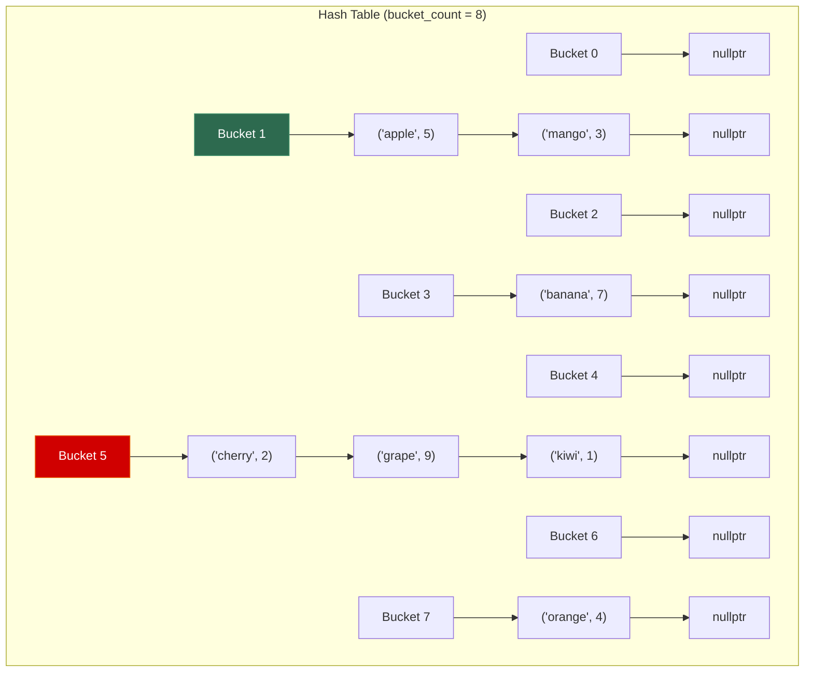
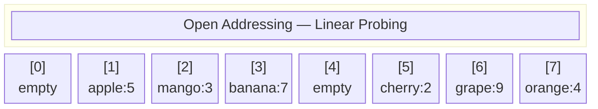
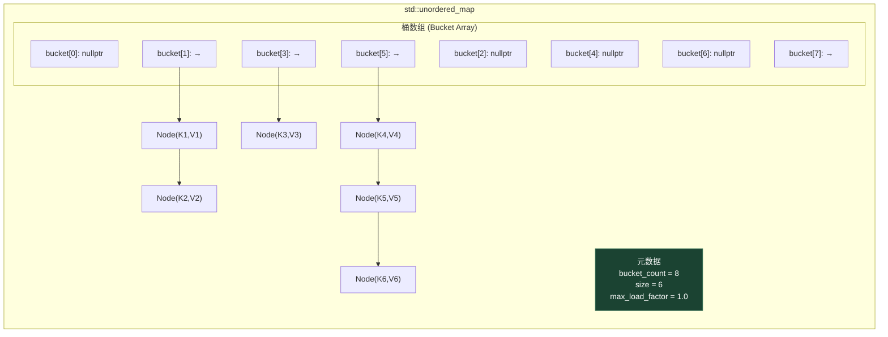

# 第五章 哈希表 (Hash Table)

> **一句话理解**：哈希表通过哈希函数将 Key **直接映射**到数组下标，用 **O(1)** 的时间完成增删查——它是"空间换时间"这一思想的极致体现。

---

## 5.1 概念直觉 —— What & Why

### 问题的起源

假设你有一亿个用户，每个用户有一个 ID。现在需要高频地"根据 ID 查用户数据"。

- **数组**：如果 ID 是连续的 0 ~ 1亿，直接用 `arr[id]`，O(1) 完美。但如果 ID 范围是 0 ~ 2^64（如 UUID），不可能开这么大的数组。
- **有序数组 + 二分**：O(log n)，还行，但不够快。每秒几十万次查询时，log n 的常数也会成为瓶颈。
- **链表**：O(n)，不用想了。

**哈希表的解决方案**：用一个**哈希函数**把任意 Key 映射（压缩）到有限的数组下标范围内，实现"任意 Key → O(1) 查找"。

```
Key("lonelystar") → hash("lonelystar") → 847293 → 847293 % 1024 → index 177
                     ↑ 哈希函数                      ↑ 取模映射到桶
```

### 哈希表的工作原理

哈希表的核心就三步：

1. **计算哈希值**：`hash(key)` → 得到一个整数
2. **映射到桶下标**：`hash(key) % bucket_count` → 得到数组中的位置
3. **处理冲突**：不同的 Key 可能映射到同一个桶（这叫**哈希冲突**），需要一种策略来处理

### 两个核心问题

整个哈希表的设计，围绕**两个核心问题**展开：

**问题 1：哈希函数怎么设计？**

好的哈希函数要满足：
- **确定性**：相同的 Key 永远产生相同的哈希值
- **均匀性**：不同的 Key 应该**尽量均匀**地分布在整个输出空间中
- **高效性**：计算要快（O(key 长度)）

**问题 2：冲突了怎么办？**

无论哈希函数多好，当 Key 的数量超过桶的数量时，冲突是**不可避免**的（鸽巢原理）。两种主流策略：
- **链地址法 (Separate Chaining)**：每个桶挂一个链表
- **开放寻址法 (Open Addressing)**：冲突时在数组中找下一个空位

### 哈希表 vs 其他数据结构

| 需求 | 数组 | 有序数组 / BST | 哈希表 |
|------|------|----------------|--------|
| 精确查找 | O(1)* | O(log n) | **O(1)** 均摊 |
| 范围查询 | O(n) | **O(log n + k)** | ❌ O(n) |
| 插入 | O(1)* / O(n) | O(log n) | **O(1)** 均摊 |
| 删除 | O(n) | O(log n) | **O(1)** 均摊 |
| 有序遍历 | ❌ | ✅ | ❌ |
| 内存开销 | 最少 | 中等 | **较大**（桶 + 负载因子 < 1） |
| 最坏情况 | O(1)* | O(log n) | **O(n)**（全部冲突） |

> `*` 仅当 Key 可直接作为下标时

> 💡 **选型金句**：「只需要精确查找（有就有、没有就没有），用哈希表；需要范围查询或有序遍历，用红黑树（`std::map`）。」这是面试中最高频的选型题。

---

## 5.2 结构图解

### 链地址法 (Separate Chaining)



```
hash("apple")  % 8 = 1    ← apple 和 mango 冲突在桶 1
hash("mango")  % 8 = 1
hash("banana") % 8 = 3
hash("cherry") % 8 = 5    ← cherry, grape, kiwi 三个冲突在桶 5
hash("grape")  % 8 = 5
hash("kiwi")   % 8 = 5
hash("orange") % 8 = 7

负载因子 = 元素数 / 桶数 = 6 / 8 = 0.75
```

> 链地址法是 `std::unordered_map` 的默认策略。每个桶是一个链表，冲突时在链表尾部追加。

### 开放寻址法 (Open Addressing)



```
插入 mango: hash("mango") % 8 = 1 → 位置 1 被 apple 占了！
           → 线性探测：试 2 → 空的！放这里。

查找 mango: hash("mango") % 8 = 1 → 位置 1 是 apple ≠ mango
           → 继续看 2 → 命中！

删除时不能简单置空（会切断探测链），需要用特殊标记 DELETED。
```

### 链地址法 vs 开放寻址法

| 维度 | 链地址法 | 开放寻址法 |
|------|----------|------------|
| 冲突处理 | 桶挂链表 | 在数组内找下一个空位 |
| 内存布局 | 指针 + 堆上链表节点 | **纯数组**，缓存友好 |
| 负载因子容忍 | 可以 > 1（链表无限长） | **必须 < 1**（否则找不到空位） |
| 删除 | 链表删除 O(1) | 需要 DELETED 标记，复杂 |
| 缓存友好性 | ❌ 链表散布堆中 | ✅ 数据在连续数组中 |
| 适合场景 | 通用，STL 默认 | 高性能、低延迟、内存池 |
| 代表实现 | `std::unordered_map` | Google `absl::flat_hash_map`、Rust `HashMap` |

### `std::unordered_map` 的内部结构



---

## 5.3 C++ 底层实现

### 5.3.1 哈希函数设计

#### C++ 标准库的 `std::hash`

```cpp
#include <functional>

// std::hash 为基本类型提供了默认实现
std::hash<int>{}(42);                    // → 整数直接用
std::hash<std::string>{}("hello");       // → FNV-1a 或 MurmurHash 变体
std::hash<double>{}(3.14);               // → 二进制重新解释
std::hash<void*>{}(ptr);                 // → 地址直接转换

// 但 std::hash 对自定义类型 ❌ 没有默认实现！
// 需要自己写。
```

#### 常见哈希函数

| 哈希函数 | 特点 | 用途 |
|----------|------|------|
| **取模哈希** | `key % p`（p 为质数） | 教学、面试手写 |
| **FNV-1a** | 简单、快速、分布均匀 | GCC/Clang 的 `std::hash<string>` |
| **MurmurHash3** | 高质量、快速、适合大数据 | Redis、Kafka、Google |
| **xxHash** | 极快（SIMD 优化） | 文件校验、游戏资源哈希 |
| **CityHash / FarmHash** | Google 出品，64/128 位 | 分布式系统 |
| **SipHash** | 防碰撞攻击（密码学安全） | Python dict、Rust HashMap |

#### 手写哈希函数

```cpp
// FNV-1a 哈希（最简单的"好"哈希，面试手写够用）
struct FNV1aHash {
    std::size_t operator()(const std::string& s) const {
        // 64 位 FNV offset basis 和 prime
        std::size_t hash = 14695981039346656037ULL;
        constexpr std::size_t prime = 1099511628211ULL;

        for (char c : s) {
            hash ^= static_cast<std::size_t>(c);  // XOR
            hash *= prime;                          // 乘以质数
        }
        return hash;
    }
};

// 对整数的常用哈希（避免简单取模的聚集问题）
struct IntHash {
    std::size_t operator()(int key) const {
        // Knuth 乘法哈希
        return static_cast<std::size_t>(key) * 2654435761ULL;
    }
};

// 对 pair 的哈希（面试常用！std::hash 默认不支持 pair）
struct PairHash {
    std::size_t operator()(const std::pair<int, int>& p) const {
        auto h1 = std::hash<int>{}(p.first);
        auto h2 = std::hash<int>{}(p.second);
        // 经典组合方式（Boost hash_combine）
        return h1 ^ (h2 * 2654435761ULL + 0x9e3779b9 + (h1 << 6) + (h1 >> 2));
    }
};
```

> 💡 **面试常见坑**：`std::unordered_map` / `std::unordered_set` 不能直接用 `std::pair` 或 `std::vector` 做 Key，因为标准库没有为它们提供 `std::hash` 特化。必须自定义哈希函数。

#### 什么是"好"的哈希函数？

```cpp
// ❌ 坏的哈希函数——大量冲突
struct BadHash {
    std::size_t operator()(int key) const {
        return key % 10;  // 所有个位相同的数都冲突！
    }
};

// ❌ 更差的哈希函数——常数输出
struct TerribleHash {
    std::size_t operator()(int key) const {
        return 42;  // 所有 key 全冲突！退化成链表 O(n)
    }
};

// ✅ 好的哈希函数——均匀分布
struct GoodHash {
    std::size_t operator()(int key) const {
        std::size_t x = key;
        x = ((x >> 16) ^ x) * 0x45d9f3b;    // bit mixing
        x = ((x >> 16) ^ x) * 0x45d9f3b;
        x = (x >> 16) ^ x;
        return x;
    }
};
```

### 5.3.2 `std::unordered_map` 底层解析

`std::unordered_map` 使用**链地址法**。底层核心是一个桶数组（`bucket array`），每个桶指向一个链表。

#### 精简版实现

```cpp
template <
    typename Key, typename Value,
    typename Hash = std::hash<Key>,
    typename KeyEqual = std::equal_to<Key>
>
class HashMap {
    struct Node {
        std::pair<const Key, Value> kv;
        Node* next;
        std::size_t hash_cache;  // 缓存哈希值，rehash 时不用重算

        Node(const Key& k, const Value& v, std::size_t h, Node* n = nullptr)
            : kv(k, v), next(n), hash_cache(h) {}
    };

    std::vector<Node*> _buckets;   // 桶数组
    std::size_t        _size = 0;  // 元素总数
    float _max_load_factor = 1.0f; // 最大负载因子
    Hash      _hasher;
    KeyEqual  _equal;

    // 桶下标 = hash % bucket_count
    std::size_t _bucket_index(std::size_t hash) const {
        return hash % _buckets.size();
    }

public:
    HashMap(std::size_t initial_buckets = 16)
        : _buckets(initial_buckets, nullptr) {}

    ~HashMap() { clear(); }

    // ========== 查找 ==========
    Value* find(const Key& key) {
        std::size_t h = _hasher(key);
        std::size_t idx = _bucket_index(h);

        Node* cur = _buckets[idx];
        while (cur) {
            if (cur->hash_cache == h && _equal(cur->kv.first, key)) {
                return &cur->kv.second;
            }
            cur = cur->next;
        }
        return nullptr;  // 未找到
    }

    // ========== 插入 / 更新 ==========
    void insert(const Key& key, const Value& value) {
        // 先检查是否已存在
        if (Value* existing = find(key)) {
            *existing = value;  // 更新
            return;
        }

        // 检查是否需要 rehash
        if (load_factor() >= _max_load_factor) {
            _rehash(_buckets.size() * 2);
        }

        std::size_t h = _hasher(key);
        std::size_t idx = _bucket_index(h);

        // 头插法（新节点插到链表头部）
        _buckets[idx] = new Node(key, value, h, _buckets[idx]);
        ++_size;
    }

    // ========== 删除 ==========
    bool erase(const Key& key) {
        std::size_t h = _hasher(key);
        std::size_t idx = _bucket_index(h);

        Node* cur = _buckets[idx];
        Node* prev = nullptr;

        while (cur) {
            if (cur->hash_cache == h && _equal(cur->kv.first, key)) {
                if (prev) {
                    prev->next = cur->next;
                } else {
                    _buckets[idx] = cur->next;
                }
                delete cur;
                --_size;
                return true;
            }
            prev = cur;
            cur = cur->next;
        }
        return false;
    }

    // ========== operator[] ==========
    Value& operator[](const Key& key) {
        if (Value* v = find(key)) return *v;
        insert(key, Value{});  // 不存在则默认构造
        return *find(key);
    }

    // ========== Rehash ==========
    void _rehash(std::size_t new_bucket_count) {
        std::vector<Node*> new_buckets(new_bucket_count, nullptr);

        for (Node* head : _buckets) {
            Node* cur = head;
            while (cur) {
                Node* next = cur->next;
                // 用缓存的哈希值重新映射（不用重新计算！）
                std::size_t new_idx = cur->hash_cache % new_bucket_count;
                cur->next = new_buckets[new_idx];
                new_buckets[new_idx] = cur;
                cur = next;
            }
        }

        _buckets = std::move(new_buckets);
    }

    // ========== 辅助 ==========
    float load_factor() const {
        return static_cast<float>(_size) / _buckets.size();
    }

    std::size_t size() const { return _size; }
    std::size_t bucket_count() const { return _buckets.size(); }

    void clear() {
        for (Node*& head : _buckets) {
            while (head) {
                Node* next = head->next;
                delete head;
                head = next;
            }
        }
        _size = 0;
    }
};
```

#### 负载因子与 Rehash

**负载因子 (Load Factor)** = 元素数量 / 桶数量

```cpp
std::unordered_map<std::string, int> map;

// 查看当前状态
map.load_factor();      // 当前负载因子
map.max_load_factor();  // 阈值（默认 1.0）
map.bucket_count();     // 当前桶数量

// 当 load_factor() >= max_load_factor() 时，自动 rehash
// rehash 过程：
// 1. 分配更大的桶数组（通常 2x，且取下一个质数）
// 2. 遍历旧桶中所有节点
// 3. 用 hash % new_bucket_count 重新映射每个节点
// 4. 释放旧桶数组

// 手动控制
map.reserve(10000);         // 预分配桶，避免多次 rehash
map.rehash(20000);          // 强制 rehash 到指定桶数
map.max_load_factor(0.5f);  // 降低阈值 → 更少冲突但更多内存
```

**Rehash 的代价**：

| 操作 | 不触发 rehash | 触发 rehash |
|------|-------------|------------|
| `insert` | O(1) | **O(n)**（搬运所有元素）|
| 均摊 | **O(1)** | **O(1)**（和 vector 扩容一样的均摊分析）|

> 💡 **面试中的表述**：「`unordered_map` 的 insert 均摊 O(1)，但单次可能因 rehash 达到 O(n)。如果能预估元素数量，应该提前调用 `reserve()` 避免多次 rehash。这和 `vector::reserve()` 的思路完全一致。」

### 5.3.3 手写开放寻址哈希表

开放寻址法在游戏引擎中更常见（缓存友好、无堆分配）。最简单的变体是**线性探测 (Linear Probing)**：

```cpp
template <typename Key, typename Value, typename Hash = std::hash<Key>>
class OpenAddressMap {
    enum class State : uint8_t { EMPTY, OCCUPIED, DELETED };

    struct Slot {
        Key    key;
        Value  value;
        State  state = State::EMPTY;
    };

    std::vector<Slot> _slots;
    std::size_t _size = 0;
    std::size_t _capacity;
    Hash _hasher;

    static constexpr float MAX_LOAD = 0.7f;  // 开放寻址必须 < 1

    std::size_t _probe(std::size_t hash) const {
        return hash % _capacity;
    }

    std::size_t _next(std::size_t idx) const {
        return (idx + 1) % _capacity;  // 线性探测
    }

public:
    OpenAddressMap(std::size_t cap = 16)
        : _slots(cap), _capacity(cap) {}

    // ========== 查找 ==========
    Value* find(const Key& key) {
        std::size_t idx = _probe(_hasher(key));

        for (std::size_t i = 0; i < _capacity; ++i) {
            if (_slots[idx].state == State::EMPTY) {
                return nullptr;  // 碰到空位，说明不存在
            }
            if (_slots[idx].state == State::OCCUPIED && _slots[idx].key == key) {
                return &_slots[idx].value;
            }
            idx = _next(idx);
        }
        return nullptr;
    }

    // ========== 插入 ==========
    void insert(const Key& key, const Value& value) {
        if (static_cast<float>(_size + 1) / _capacity >= MAX_LOAD) {
            _grow();
        }

        std::size_t idx = _probe(_hasher(key));

        while (true) {
            if (_slots[idx].state != State::OCCUPIED) {
                // 空位或已删除位 → 放这里
                _slots[idx] = {key, value, State::OCCUPIED};
                ++_size;
                return;
            }
            if (_slots[idx].key == key) {
                // 已存在 → 更新
                _slots[idx].value = value;
                return;
            }
            idx = _next(idx);
        }
    }

    // ========== 删除（标记删除）==========
    bool erase(const Key& key) {
        std::size_t idx = _probe(_hasher(key));

        for (std::size_t i = 0; i < _capacity; ++i) {
            if (_slots[idx].state == State::EMPTY) return false;
            if (_slots[idx].state == State::OCCUPIED && _slots[idx].key == key) {
                _slots[idx].state = State::DELETED;  // 不能置 EMPTY！
                --_size;
                return true;
            }
            idx = _next(idx);
        }
        return false;
    }

    // ========== 扩容 ==========
    void _grow() {
        std::size_t new_cap = _capacity * 2;
        std::vector<Slot> new_slots(new_cap);

        // 搬运所有 OCCUPIED 的元素
        for (auto& slot : _slots) {
            if (slot.state == State::OCCUPIED) {
                std::size_t idx = _hasher(slot.key) % new_cap;
                while (new_slots[idx].state == State::OCCUPIED) {
                    idx = (idx + 1) % new_cap;
                }
                new_slots[idx] = {std::move(slot.key),
                                   std::move(slot.value),
                                   State::OCCUPIED};
            }
        }

        _slots = std::move(new_slots);
        _capacity = new_cap;
        // 注意：DELETED 标记在 rehash 后全部消失 → 自动"清洗"
    }

    std::size_t size() const { return _size; }
    float load_factor() const { return static_cast<float>(_size) / _capacity; }
};
```

**线性探测的问题 —— Primary Clustering**：

线性探测 `(idx + 1) % N` 会导致**聚集效应**——已有元素的区域越来越大，新元素更容易在附近堆积，查找时需要探测更长的序列。

**改进方案**：

| 探测策略 | 公式 | 特点 |
|----------|------|------|
| 线性探测 | `(h + i) % N` | 最简单，但有 primary clustering |
| 二次探测 | `(h + i²) % N` | 减少聚集，但可能跳过某些位置 |
| 双重哈希 | `(h₁ + i * h₂) % N` | 最均匀，但计算两个哈希 |
| **Robin Hood** | 线性探测 + "劫富济贫" | 方差最小，现代首选 |

### 5.3.4 Robin Hood Hashing —— 现代高性能哈希表的首选

Robin Hood Hashing 基于一个直觉：**不应该有元素离自己的"家"太远，而另一些元素紧挨着"家"**。当插入新元素时，如果新元素的探测距离 > 当前位置元素的探测距离，就**抢占**当前位置，把被抢的元素继续往后找位置。

```cpp
// Robin Hood 插入的核心逻辑（概念性伪代码）
void robin_hood_insert(Key key, Value value) {
    size_t idx = hash(key) % capacity;
    size_t dist = 0;  // 当前元素的探测距离

    while (true) {
        if (slots[idx].empty()) {
            // 空位：直接放
            slots[idx] = {key, value, dist};
            return;
        }

        if (dist > slots[idx].probe_distance) {
            // "劫富济贫"：新元素离家更远 → 抢占这个位置
            std::swap(key, slots[idx].key);
            std::swap(value, slots[idx].value);
            std::swap(dist, slots[idx].probe_distance);
        }

        idx = (idx + 1) % capacity;
        ++dist;
    }
}
```

**Robin Hood 的优势**：

| 指标 | 普通线性探测 | Robin Hood |
|------|------------|------------|
| 最大探测距离 | 很长的尾部（少数元素极远） | **所有元素的距离趋于均匀** |
| 查找成功的平均探测 | O(1/(1-α)) | 同，但方差更小 |
| 查找失败的代价 | 可能遍历整个聚集区 | **可以提前终止**（如果探测距离 > 最大可能距离） |
| 缓存友好 | ✅ | ✅（仍然是纯数组） |

> 💡 Robin Hood Hashing 被 Rust 的 `HashMap`（v1.36前）、`absl::flat_hash_map`（Google）等高性能实现采用。

### 5.3.5 `std::unordered_map` vs `std::map` —— 面试必考对比

```cpp
#include <map>
#include <unordered_map>

std::map<std::string, int> ordered_map;          // 红黑树
std::unordered_map<std::string, int> hash_map;   // 哈希表
```

| 维度 | `std::map` (红黑树) | `std::unordered_map` (哈希表) |
|------|---------------------|-------------------------------|
| 查找 | O(log n) | **O(1)** 均摊 |
| 插入 | O(log n) | **O(1)** 均摊 |
| 删除 | O(log n) | **O(1)** 均摊 |
| 最坏情况 | **O(log n)** | O(n)（极端冲突） |
| 有序遍历 | ✅ 自然有序 | ❌ 无序 |
| 范围查询 | ✅ `lower_bound` / `upper_bound` | ❌ 不支持 |
| 迭代器稳定性 | ✅ 插删不影响其他迭代器 | ❌ rehash 时全部失效 |
| 内存 | 每节点 3 指针 + 颜色 = ~40B | 桶指针 + 链表节点 + 负载因子 |
| Key 要求 | `operator<` | `std::hash` + `operator==` |
| 缓存友好 | ❌ 红黑树离散 | ❌ 链地址法链表离散 |
| 适合场景 | 需要有序、范围查询 | **只需要精确查找、追求速度** |

```cpp
// 什么时候用 map？
// 1. 需要有序遍历
for (auto& [key, value] : ordered_map) {
    // key 按字典序遍历 ✅
}

// 2. 需要范围查询
auto it_lo = ordered_map.lower_bound("banana");
auto it_hi = ordered_map.upper_bound("mango");
// 遍历 [banana, mango] 范围内的元素 ✅

// 3. 什么时候用 unordered_map？
// 绝大多数情况！只要不需要有序性和范围查询。
hash_map["key"] = 42;       // O(1) 插入
if (hash_map.count("key"))  // O(1) 查找
```

### 5.3.6 自定义类型做 Key

面试中经常遇到需要把**自定义结构体**放进 `unordered_map` 或 `unordered_set`：

```cpp
struct Point {
    int x, y;

    // unordered_map 需要 operator==
    bool operator==(const Point& o) const {
        return x == o.x && y == o.y;
    }
};

// 方案一：提供哈希函数对象
struct PointHash {
    std::size_t operator()(const Point& p) const {
        auto h1 = std::hash<int>{}(p.x);
        auto h2 = std::hash<int>{}(p.y);
        return h1 ^ (h2 * 2654435761ULL + 0x9e3779b9 + (h1 << 6) + (h1 >> 2));
    }
};

std::unordered_map<Point, std::string, PointHash> point_map;
std::unordered_set<Point, PointHash> point_set;

// 方案二：特化 std::hash（更优雅）
namespace std {
    template <>
    struct hash<Point> {
        std::size_t operator()(const Point& p) const {
            auto h1 = hash<int>{}(p.x);
            auto h2 = hash<int>{}(p.y);
            return h1 ^ (h2 * 2654435761ULL + 0x9e3779b9 + (h1 << 6) + (h1 >> 2));
        }
    };
}

// 特化后可以直接用，无需传第三个模板参数
std::unordered_map<Point, std::string> point_map2;  // ✅
```

> 💡 **`0x9e3779b9`** 是什么？它是黄金比例 φ = (√5-1)/2 对应的 32 位整数表示。这个"魔法数"能帮助哈希值更均匀地分布，减少冲突。Boost 的 `hash_combine` 就是这个公式。

---

## 5.4 复杂度速查表

### `std::unordered_map` / `std::unordered_set` 操作复杂度

| 操作 | 平均 | 最坏 | 说明 |
|------|------|------|------|
| `operator[]` / `at` | **O(1)** | O(n) | 哈希 + 桶内遍历 |
| `find` | **O(1)** | O(n) | 同上 |
| `insert` | **O(1)** 均摊 | O(n) | 可能触发 rehash |
| `erase` | **O(1)** | O(n) | 桶内链表删除 |
| `count` | **O(1)** | O(n) | 等价于 `find != end` |
| `size` / `empty` | O(1) | O(1) | 维护内部计数器 |
| `bucket_count` | O(1) | O(1) | |
| `load_factor` | O(1) | O(1) | |
| `reserve` | O(n) | O(n) | 触发 rehash |
| `rehash` | O(n) | O(n) | 重新分配所有元素 |
| 遍历全部元素 | O(n + bucket_count) | 同 | 需要跳过空桶 |

> 最坏 O(n) 只在**所有元素全部冲突到同一个桶**时发生。合理的哈希函数 + 适当的负载因子下，几乎不会出现。

### `std::map` / `std::set` 操作复杂度（对比用）

| 操作 | 时间复杂度 | 说明 |
|------|-----------|------|
| `find` / `count` | O(log n) | 红黑树查找 |
| `insert` | O(log n) | 红黑树插入 + 可能旋转 |
| `erase` | O(log n) | 红黑树删除 + 可能旋转 |
| `lower_bound` / `upper_bound` | O(log n) | 范围查询 |
| 有序遍历 | O(n) | 中序遍历 |

### 横向对比：查找结构大全

| 结构 | 精确查找 | 范围查询 | 插入 | 删除 | 有序 | 内存 |
|------|----------|----------|------|------|------|------|
| 有序数组 | O(log n) | O(log n + k) | O(n) | O(n) | ✅ | 最紧凑 |
| `std::map` (红黑树) | O(log n) | **O(log n + k)** | O(log n) | O(log n) | ✅ | 高（3 指针/节点） |
| `std::unordered_map` | **O(1)** | ❌ | **O(1)*** | **O(1)** | ❌ | 中高 |
| 跳表 (Skip List) | O(log n) | O(log n + k) | O(log n) | O(log n) | ✅ | 中 |
| B+ 树 | O(log n) | O(log n + k) | O(log n) | O(log n) | ✅ | 最适合磁盘 |
| Trie | O(m) | 前缀查询 | O(m) | O(m) | ✅* | 高 |

> `*` 均摊 O(1)  
> `m` = key 长度

---

## 5.5 面试高频题

### 5.5.1 两数之和 (LeetCode 1) —— 哈希表面试第一题

> 给定数组和目标值 target，找出数组中和为 target 的两个数的**下标**。

这道题是 LeetCode 的开山题，也是哈希表最经典的应用：**把"从数组中找配对"从 O(n²) 降到 O(n)**。

```cpp
std::vector<int> twoSum(std::vector<int>& nums, int target) {
    // key = 数值, value = 下标
    std::unordered_map<int, int> seen;

    for (int i = 0; i < static_cast<int>(nums.size()); ++i) {
        int complement = target - nums[i];

        auto it = seen.find(complement);
        if (it != seen.end()) {
            return {it->second, i};  // 找到配对
        }

        seen[nums[i]] = i;  // 记录当前数
    }
    return {};
}
// 时间 O(n), 空间 O(n)
```

> 💡 **核心思路**：遍历数组的同时，把已遍历的元素存入哈希表。对每个新元素，检查它的"互补数"是否已在哈希表中。一次遍历搞定。

**面试追问**：
- "如果数组已排序？" → 双指针 O(n)，不需要额外空间
- "如果要找所有配对？" → 不能提前 return，需要继续遍历
- "如果有重复元素？" → 哈希表存 index 就能处理

### 5.5.2 字母异位词分组 (LeetCode 49)

> 把字母异位词（字母相同、顺序不同的单词）分到同一组。如 `["eat","tea","tan","ate","nat","bat"]`。

**核心洞察**：异位词排序后相同。用**排序后的字符串**做 Key。

```cpp
std::vector<std::vector<std::string>> groupAnagrams(
    std::vector<std::string>& strs)
{
    std::unordered_map<std::string, std::vector<std::string>> groups;

    for (auto& s : strs) {
        std::string key = s;
        std::sort(key.begin(), key.end());  // "eat" → "aet"
        groups[key].push_back(s);
    }

    std::vector<std::vector<std::string>> result;
    for (auto& [key, group] : groups) {
        result.push_back(std::move(group));
    }
    return result;
}
// 时间 O(n × k log k), k = 最长字符串长度
// 空间 O(n × k)
```

**优化方案**：用**字符频率数组**做 Key（避免排序）：

```cpp
// 用 26 个字母的频率作为 key → O(n × k) 替代 O(n × k log k)
std::string freq_key(const std::string& s) {
    std::array<int, 26> freq{};
    for (char c : s) ++freq[c - 'a'];

    std::string key;
    for (int i = 0; i < 26; ++i) {
        key += std::to_string(freq[i]) + '#';
    }
    return key;  // "aet" → "1#0#0#0#1#...#1#0#..."
}
```

### 5.5.3 最长无重复子串 (LeetCode 3)

> 找出字符串中不含重复字符的最长子串的长度。

**核心模型**：**滑动窗口 + 哈希集合**。用 `unordered_set` 记录窗口内的字符。

```cpp
int lengthOfLongestSubstring(const std::string& s) {
    std::unordered_set<char> window;
    int left = 0, max_len = 0;

    for (int right = 0; right < static_cast<int>(s.size()); ++right) {
        // 收缩窗口直到没有重复
        while (window.count(s[right])) {
            window.erase(s[left]);
            ++left;
        }

        window.insert(s[right]);
        max_len = std::max(max_len, right - left + 1);
    }
    return max_len;
}
// 时间 O(n), 空间 O(min(n, charset))
```

**更快的方案**：用 `unordered_map` 记录字符最后出现的位置，遇到重复时直接跳转：

```cpp
int lengthOfLongestSubstring_v2(const std::string& s) {
    std::unordered_map<char, int> last_pos;  // 字符 → 最后出现的下标
    int left = 0, max_len = 0;

    for (int right = 0; right < static_cast<int>(s.size()); ++right) {
        if (last_pos.count(s[right]) && last_pos[s[right]] >= left) {
            left = last_pos[s[right]] + 1;  // 直接跳！
        }
        last_pos[s[right]] = right;
        max_len = std::max(max_len, right - left + 1);
    }
    return max_len;
}
// 时间 O(n), 空间 O(min(n, charset))
// 比 set 版本更快：left 只跳不走
```

### 5.5.4 LRU Cache (LeetCode 146) —— 哈希表 + 双链表

> 设计一个 LRU（最近最少使用）缓存。支持 `get(key)` 和 `put(key, value)`，容量满时淘汰最久未使用的。

这道题在第 2 章（链表）已经详细实现过。这里从哈希表的角度再回顾一下**为什么需要哈希表**：

```
如果只用双链表：
  get(key):  遍历链表找 key → O(n) ❌
  put(key):  遍历链表找 key → O(n) ❌

加上哈希表：
  get(key):  hash_map[key] → 定位到链表节点 → O(1) ✅ 
  put(key):  hash_map[key] → 定位或创建节点 → O(1) ✅
```

**数据结构选型的本质**：

| 需求 | 用什么 | 为什么 |
|------|--------|--------|
| O(1) 精确查找 key | **哈希表** | key → node 的映射 |
| O(1) 维护访问顺序 | **双链表** | 移动节点到头部、删除尾部节点 |
| O(1) 移动链表节点 | 双链表节点指针 | 已知指针后，摘除 + 插入都是 O(1) |

> 💡 **面试金句**：「LRU Cache = HashMap + Doubly Linked List。哈希表负责 O(1) 定位，双链表负责 O(1) 维护使用顺序。这是两种数据结构的经典组合。」

### 5.5.5 最长连续序列 (LeetCode 128)

> 给定未排序的整数数组，找出最长连续元素序列的长度。要求 O(n)。

排序后扫一遍是 O(n log n)。用哈希集合可以做到 **O(n)**。

```cpp
int longestConsecutive(std::vector<int>& nums) {
    std::unordered_set<int> num_set(nums.begin(), nums.end());
    int max_len = 0;

    for (int num : num_set) {
        // 关键优化：只从序列起点开始计数
        // 如果 num-1 存在，说明 num 不是起点，跳过
        if (num_set.count(num - 1)) continue;

        // num 是某个连续序列的起点
        int length = 1;
        while (num_set.count(num + length)) {
            ++length;
        }

        max_len = std::max(max_len, length);
    }
    return max_len;
}
// 时间 O(n)：每个元素最多被访问两次（一次外层循环，一次内层 while）
// 空间 O(n)
```

> 💡 **关键优化**：`if (num_set.count(num - 1)) continue;` 这行是 O(n) 的保证。没有这行，每个元素都可能触发内层 while 循环，复杂度退化为 O(n²)。有了这行，只有**序列起点**才会进入 while 循环，总计遍历次数 = n。

### 5.5.6 有效的数独 (LeetCode 36)

> 判断一个 9×9 的数独棋盘是否有效。只需验证已填数字没有重复（不需要可解）。

```cpp
bool isValidSudoku(std::vector<std::vector<char>>& board) {
    // 每行、每列、每个 3×3 宫各用一个 set
    std::array<std::unordered_set<char>, 9> rows, cols, boxes;

    for (int i = 0; i < 9; ++i) {
        for (int j = 0; j < 9; ++j) {
            char c = board[i][j];
            if (c == '.') continue;

            int box_idx = (i / 3) * 3 + (j / 3);  // 3×3 宫的编号

            // 任一集合中已存在 → 无效
            if (rows[i].count(c) || cols[j].count(c) || boxes[box_idx].count(c)) {
                return false;
            }

            rows[i].insert(c);
            cols[j].insert(c);
            boxes[box_idx].insert(c);
        }
    }
    return true;
}
// 时间 O(81) = O(1), 空间 O(81) = O(1)
```

### 5.5.7 一致性哈希 (Consistent Hashing) —— 系统设计加分项

一致性哈希不是 LeetCode 题，但在**系统设计面试**中极为重要。

**问题**：分布式缓存有 N 台机器，数据按 `hash(key) % N` 分配。当一台机器宕掉（N → N-1），**几乎所有** key 的映射都变了 → 缓存大规模失效（雪崩）。

**一致性哈希的解决方案**：

```
传统取模：hash(key) % N
  机器 3 台：key → hash → 42 % 3 = 0 (机器 A)
  机器 2 台：key → hash → 42 % 2 = 0 (机器 A) ← 碰巧没变
  但大部分 key 都会变！

一致性哈希：把机器和 key 都映射到一个"哈希环"上
  → 一台机器挂了，只影响它到下一台机器之间的 key
  → 平均只有 1/N 的 key 需要重新映射
```

```cpp
#include <map>
#include <string>
#include <functional>

class ConsistentHash {
    // 用 std::map（有序！）存哈希环上的虚拟节点
    std::map<std::size_t, std::string> _ring;
    int _virtual_nodes;  // 每台机器的虚拟节点数

public:
    ConsistentHash(int virtual_nodes = 150,
                   std::vector<std::string> servers = {})
        : _virtual_nodes(virtual_nodes) 
    {
        for (auto& srv : servers) add_server(srv);
    }

    void add_server(const std::string& server) {
        for (int i = 0; i < _virtual_nodes; ++i) {
            std::size_t h = std::hash<std::string>{}(
                server + "#" + std::to_string(i));
            _ring[h] = server;
        }
    }

    void remove_server(const std::string& server) {
        for (int i = 0; i < _virtual_nodes; ++i) {
            std::size_t h = std::hash<std::string>{}(
                server + "#" + std::to_string(i));
            _ring.erase(h);
        }
    }

    // 给定 key，找到负责它的机器
    std::string get_server(const std::string& key) const {
        if (_ring.empty()) return "";

        std::size_t h = std::hash<std::string>{}(key);
        // 在环上找到 >= h 的第一个节点
        auto it = _ring.lower_bound(h);
        if (it == _ring.end()) {
            it = _ring.begin();  // 环绕回环首
        }
        return it->second;
    }
};
```

> 💡 **虚拟节点**的作用：如果每台机器只在环上占一个位置，数据分布可能极不均匀。用 150 个虚拟节点（virtual nodes）可以让数据分布趋于均匀。

### 5.5.8 面试题速查表

| 题号 | 题目 | 核心技巧 | 难度 |
|------|------|----------|------|
| LC 1 | 两数之和 | **哈希表记录互补数** | Easy |
| LC 49 | 字母异位词分组 | 排序/频率做 key | Medium |
| LC 3 | 最长无重复子串 | **滑动窗口 + 哈希集合** | Medium |
| LC 146 | LRU Cache | **哈希表 + 双链表** | Medium |
| LC 128 | 最长连续序列 | 哈希集合 + 起点优化 | Medium |
| LC 36 | 有效的数独 | 三组哈希集合 | Medium |
| LC 242 | 有效的字母异位词 | 频率数组或哈希 | Easy |
| LC 383 | 赎金信 | 频率数组 | Easy |
| LC 202 | 快乐数 | 哈希集合检测循环 | Easy |
| LC 205 | 同构字符串 | 双映射哈希 | Easy |
| LC 290 | 单词规律 | 双映射哈希 | Easy |
| LC 349 | 两个数组的交集 | 哈希集合 | Easy |
| LC 454 | 四数相加 II | **分组哈希** | Medium |
| LC 560 | 和为 K 的子数组 | **前缀和 + 哈希** | Medium |
| LC 438 | 找所有字母异位词 | 滑动窗口 + 频率 | Medium |

---

## 5.6 🎮 实战场景

### 5.6.1 资源管理器 (Resource Manager)

游戏引擎中最核心的管理器之一。所有资源（纹理、模型、音效、Shader）通过**路径字符串**索引，底层就是一个大号哈希表：

```cpp
#include <unordered_map>
#include <memory>
#include <string>
#include <functional>
#include <iostream>

// 资源基类
class Resource {
public:
    virtual ~Resource() = default;
    virtual std::size_t memory_size() const = 0;
    virtual const std::string& type_name() const = 0;
};

// 具体资源类型
class Texture : public Resource {
    int _width, _height;
    std::vector<uint8_t> _pixels;

public:
    Texture(int w, int h) : _width(w), _height(h), _pixels(w * h * 4) {}
    std::size_t memory_size() const override { return _pixels.size(); }
    const std::string& type_name() const override {
        static std::string name = "Texture";
        return name;
    }
};

class AudioClip : public Resource {
    std::vector<float> _samples;

public:
    AudioClip(std::size_t sample_count) : _samples(sample_count) {}
    std::size_t memory_size() const override { return _samples.size() * sizeof(float); }
    const std::string& type_name() const override {
        static std::string name = "AudioClip";
        return name;
    }
};

// ===== 资源管理器 =====
class ResourceManager {
    // 核心：路径 → 资源的哈希表
    std::unordered_map<std::string, std::shared_ptr<Resource>> _cache;

    // 资源加载工厂（按扩展名分发）
    using LoaderFunc = std::function<std::shared_ptr<Resource>(const std::string&)>;
    std::unordered_map<std::string, LoaderFunc> _loaders;

public:
    // 注册加载器
    void register_loader(const std::string& extension, LoaderFunc loader) {
        _loaders[extension] = std::move(loader);
    }

    // 获取资源（懒加载 + 缓存）
    template <typename T>
    std::shared_ptr<T> get(const std::string& path) {
        // 1. 缓存命中 → O(1) 返回
        auto it = _cache.find(path);
        if (it != _cache.end()) {
            return std::dynamic_pointer_cast<T>(it->second);
        }

        // 2. 缓存未命中 → 加载并缓存
        std::string ext = path.substr(path.rfind('.'));
        auto loader_it = _loaders.find(ext);
        if (loader_it == _loaders.end()) {
            return nullptr;  // 不支持的格式
        }

        auto resource = loader_it->second(path);
        _cache[path] = resource;  // 缓存
        return std::dynamic_pointer_cast<T>(resource);
    }

    // 卸载指定资源
    void unload(const std::string& path) {
        _cache.erase(path);
    }

    // 卸载所有无引用的资源
    void gc() {
        for (auto it = _cache.begin(); it != _cache.end(); ) {
            if (it->second.use_count() == 1) {  // 只有 cache 持有引用
                it = _cache.erase(it);
            } else {
                ++it;
            }
        }
    }

    // 预加载（提前 reserve 减少 rehash）
    void preload(const std::vector<std::string>& paths) {
        _cache.reserve(_cache.size() + paths.size());
        for (auto& path : paths) {
            get<Resource>(path);  // 触发加载
        }
    }

    std::size_t cached_count() const { return _cache.size(); }

    std::size_t total_memory() const {
        std::size_t total = 0;
        for (auto& [path, res] : _cache) {
            total += res->memory_size();
        }
        return total;
    }
};
```

**为什么用 `unordered_map` 而不是 `map`？**
- 资源路径查找只需要**精确匹配**，不需要有序或范围查询
- 每帧可能有成百上千次资源查找（绘制每个物体都要查材质、纹理）
- O(1) vs O(log n) 在高频调用下差距显著

### 5.6.2 Entity ID 映射 (Entity Registry)

ECS（实体组件系统）架构中，每个实体有一个唯一 ID，需要 O(1) 根据 ID 查找实体信息：

```cpp
#include <unordered_map>
#include <cstdint>

using EntityID = uint32_t;

struct Transform {
    float x, y, z;
    float rotation;
    float scale;
};

struct Sprite {
    uint32_t texture_id;
    int layer;
    float width, height;
};

struct Health {
    float current;
    float max;
    bool is_dead() const { return current <= 0; }
};

// 简化版 ECS：每种组件一个哈希表
class EntityRegistry {
    EntityID _next_id = 0;

    // 每种组件类型对应一个 EntityID → Component 的映射
    std::unordered_map<EntityID, Transform> _transforms;
    std::unordered_map<EntityID, Sprite>    _sprites;
    std::unordered_map<EntityID, Health>    _healths;

public:
    EntityID create() { return _next_id++; }

    void destroy(EntityID id) {
        _transforms.erase(id);
        _sprites.erase(id);
        _healths.erase(id);
    }

    // 添加组件
    void add_transform(EntityID id, Transform t) { _transforms[id] = t; }
    void add_sprite(EntityID id, Sprite s)       { _sprites[id] = s; }
    void add_health(EntityID id, Health h)        { _healths[id] = h; }

    // 查询组件——O(1)
    Transform* get_transform(EntityID id) {
        auto it = _transforms.find(id);
        return it != _transforms.end() ? &it->second : nullptr;
    }

    Health* get_health(EntityID id) {
        auto it = _healths.find(id);
        return it != _healths.end() ? &it->second : nullptr;
    }

    // 批量更新示例：移动所有有 Transform 的实体
    void update_movement(float dt) {
        for (auto& [id, transform] : _transforms) {
            // 只更新活着的实体
            if (auto* hp = get_health(id); hp && hp->is_dead()) continue;
            // transform.x += velocity.x * dt; ...
        }
    }
};
```

### 5.6.3 技能/Buff 冷却表 (Cooldown Manager)

```cpp
#include <unordered_map>
#include <string>

class CooldownManager {
    // key = 技能ID, value = 剩余冷却时间
    std::unordered_map<std::string, float> _cooldowns;

public:
    // 使用技能：设置冷却
    void use_skill(const std::string& skill_id, float cooldown_time) {
        _cooldowns[skill_id] = cooldown_time;
    }

    // 技能是否可用？——O(1) 查询
    bool is_ready(const std::string& skill_id) const {
        auto it = _cooldowns.find(skill_id);
        return it == _cooldowns.end() || it->second <= 0;
    }

    // 获取剩余冷却时间
    float remaining(const std::string& skill_id) const {
        auto it = _cooldowns.find(skill_id);
        return (it != _cooldowns.end()) ? std::max(0.0f, it->second) : 0.0f;
    }

    // 每帧更新所有冷却
    void update(float dt) {
        for (auto it = _cooldowns.begin(); it != _cooldowns.end(); ) {
            it->second -= dt;
            if (it->second <= 0) {
                it = _cooldowns.erase(it);  // 冷却完毕，移除
            } else {
                ++it;
            }
        }
    }
};
```

### 5.6.4 Spatial Hashing —— 碰撞检测优化

朴素的碰撞检测是 O(n²)（每对实体都检查一次）。Spatial Hashing 把空间划分成网格，每个网格用哈希表索引，只检查同一网格内的实体——将碰撞检测从 O(n²) 降到接近 O(n)。

```cpp
#include <unordered_map>
#include <vector>
#include <cmath>
#include <cstdint>

struct AABB {
    float x, y;  // 中心
    float w, h;  // 宽高
};

class SpatialHash {
    float _cell_size;

    // key = 网格坐标 (编码为 int64), value = 该网格内的实体 ID 列表
    std::unordered_map<int64_t, std::vector<uint32_t>> _grid;

    // 将 (gx, gy) 编码为单个 int64 key
    int64_t _encode(int gx, int gy) const {
        return (static_cast<int64_t>(gx) << 32) | static_cast<uint32_t>(gy);
    }

    // 世界坐标 → 网格坐标
    int _to_grid(float coord) const {
        return static_cast<int>(std::floor(coord / _cell_size));
    }

public:
    SpatialHash(float cell_size = 64.0f) : _cell_size(cell_size) {}

    // 每帧重建（清空 → 全部重新插入）
    void clear() { _grid.clear(); }

    // 插入实体的 AABB
    void insert(uint32_t entity_id, const AABB& aabb) {
        // 计算 AABB 覆盖的所有网格
        int min_gx = _to_grid(aabb.x - aabb.w / 2);
        int max_gx = _to_grid(aabb.x + aabb.w / 2);
        int min_gy = _to_grid(aabb.y - aabb.h / 2);
        int max_gy = _to_grid(aabb.y + aabb.h / 2);

        for (int gx = min_gx; gx <= max_gx; ++gx) {
            for (int gy = min_gy; gy <= max_gy; ++gy) {
                _grid[_encode(gx, gy)].push_back(entity_id);
            }
        }
    }

    // 查询与给定 AABB 可能碰撞的实体
    std::vector<uint32_t> query(const AABB& aabb) const {
        std::vector<uint32_t> candidates;

        int min_gx = _to_grid(aabb.x - aabb.w / 2);
        int max_gx = _to_grid(aabb.x + aabb.w / 2);
        int min_gy = _to_grid(aabb.y - aabb.h / 2);
        int max_gy = _to_grid(aabb.y + aabb.h / 2);

        for (int gx = min_gx; gx <= max_gx; ++gx) {
            for (int gy = min_gy; gy <= max_gy; ++gy) {
                auto it = _grid.find(_encode(gx, gy));
                if (it != _grid.end()) {
                    candidates.insert(candidates.end(),
                                     it->second.begin(),
                                     it->second.end());
                }
            }
        }

        // 去重（同一实体可能跨多个网格）
        std::sort(candidates.begin(), candidates.end());
        candidates.erase(std::unique(candidates.begin(), candidates.end()),
                        candidates.end());

        return candidates;
    }
};
```

**碰撞检测流程**：

```cpp
SpatialHash spatial(64.0f);  // 网格大小 64 像素

// 每帧：
spatial.clear();

// 1. 所有实体插入空间哈希
for (auto& [id, aabb] : entities) {
    spatial.insert(id, aabb);
}

// 2. 对每个实体，只检查同一网格中的候选者
for (auto& [id, aabb] : entities) {
    auto candidates = spatial.query(aabb);
    for (uint32_t other_id : candidates) {
        if (other_id <= id) continue;  // 避免重复检查
        if (aabb_overlap(aabb, entities[other_id])) {
            handle_collision(id, other_id);
        }
    }
}
```

> 💡 **网格大小的选择**：`cell_size` 应约等于**最大实体的尺寸**。太小 → 大实体跨太多网格，插入开销大。太大 → 同一格内实体太多，失去过滤效果。

### 5.6.5 配置表热加载 (Hot Reload)

开发阶段常需要**不重启游戏就更新配置**。哈希表是天然的热加载载体：

```cpp
#include <unordered_map>
#include <string>
#include <fstream>
#include <sstream>
#include <filesystem>

class ConfigTable {
    struct ConfigEntry {
        std::unordered_map<std::string, std::string> fields;

        int get_int(const std::string& key, int default_val = 0) const {
            auto it = fields.find(key);
            return it != fields.end() ? std::stoi(it->second) : default_val;
        }

        float get_float(const std::string& key, float default_val = 0.0f) const {
            auto it = fields.find(key);
            return it != fields.end() ? std::stof(it->second) : default_val;
        }

        const std::string& get_string(const std::string& key) const {
            static std::string empty;
            auto it = fields.find(key);
            return it != fields.end() ? it->second : empty;
        }
    };

    std::unordered_map<std::string, ConfigEntry> _entries;  // ID → 配置项
    std::string _file_path;
    std::filesystem::file_time_type _last_modified;

public:
    void load(const std::string& path) {
        _file_path = path;
        _last_modified = std::filesystem::last_write_time(path);
        _entries.clear();
        _parse_csv(path);
    }

    // 每帧检查文件是否被修改
    bool check_and_reload() {
        auto current_time = std::filesystem::last_write_time(_file_path);
        if (current_time != _last_modified) {
            load(_file_path);  // 文件变了，重新加载
            return true;
        }
        return false;
    }

    const ConfigEntry* get(const std::string& id) const {
        auto it = _entries.find(id);
        return it != _entries.end() ? &it->second : nullptr;
    }

private:
    void _parse_csv(const std::string& path) {
        // 简化的 CSV 解析...
        // 第一行是 header（字段名），后续每行是一条记录
        // 第一列作为 ID（哈希表的 key）
    }
};
```

### 5.6.6 数据库索引概念 —— Hash Index vs B+ Tree Index

| 维度 | Hash Index | B+ Tree Index |
|------|-----------|---------------|
| 精确查找 | **O(1)** | O(log n) |
| 范围查询 | ❌ | ✅ `WHERE price BETWEEN 10 AND 50` |
| 排序 | ❌ | ✅ `ORDER BY` 利用索引 |
| 前缀匹配 | ❌ | ✅ `WHERE name LIKE 'John%'` |
| 等值连接 | ✅ | ✅ |
| 内存效率 | 中 | **高**（叶子节点连续） |
| 代表 | MySQL Memory 引擎、Redis | **MySQL InnoDB（默认）** |

> 💡 **为什么 MySQL 默认用 B+ Tree 而不是 Hash？** 因为实际业务中**范围查询**（如分页、时间范围、价格区间）极为常见，Hash Index 完全不支持。B+ Tree 虽然单次查找慢一点（O(log n) vs O(1)），但支持所有查询模式，是更通用的选择。

---

## 5.7 本章小结

### 核心要点

| 概念 | 要点 |
|------|------|
| **哈希函数** | Key → 整数，要求确定性、均匀性、高效性 |
| **冲突解决** | 链地址法（STL 默认）vs 开放寻址法（高性能）|
| **`unordered_map`** | 桶数组 + 链表，均摊 O(1)，rehash 时 O(n) |
| **负载因子** | `size / bucket_count`，达到 `max_load_factor` 时触发 rehash |
| **`reserve`** | 预分配桶数避免多次 rehash，和 `vector::reserve` 同理 |
| **Robin Hood** | 现代开放寻址首选，"劫富济贫"使探测距离均匀 |
| **map vs unordered_map** | 精确查找用 unordered_map；范围/有序用 map |
| **自定义 Key** | 需要 `operator==` + `std::hash` 特化或自定义哈希函数 |

### 面试 30 秒速答

> **Q：哈希表的原理？时间复杂度？**
>
> A：哈希表通过**哈希函数**将 Key 映射到数组下标，实现均摊 **O(1)** 的增删查。当多个 Key 映射到同一位置（**哈希冲突**），用链地址法（桶挂链表）或开放寻址法（数组内探测）解决。最坏情况 O(n)（全部冲突），但合理的哈希函数下几乎不会发生。

> **Q：什么是 rehash？什么时候触发？**
>
> A：当**负载因子**（元素数 / 桶数）超过阈值（默认 1.0）时，哈希表会**重新分配更大的桶数组**，把所有元素重新映射。单次 rehash 是 O(n)，但均摊下来每次插入仍是 O(1)。可以用 `reserve()` 预分配来避免多次 rehash。

> **Q：`unordered_map` 和 `map` 怎么选？**
>
> A：绝大多数场景用 `unordered_map`（O(1) 查找）。只有在需要**有序遍历**或**范围查询**（`lower_bound` / `upper_bound`）时才用 `map`（O(log n)，但有序）。`map` 底层是红黑树，`unordered_map` 底层是哈希表。

> **Q：如何把自定义类型放进 `unordered_map`？**
>
> A：需要两样东西：**`operator==`**（判断 Key 相等）和**哈希函数**（可以是独立的函数对象，也可以特化 `std::hash`）。哈希函数推荐用 Boost 的 `hash_combine` 模式组合各字段的哈希值。

---

> 📖 下一章：[第六章 树：层级世界的骨架](../tree/) —— 从二叉树遍历到 AVL 旋转，从红黑树到堆排序，再到游戏引擎中的场景树、骨骼动画与定时器管理。
