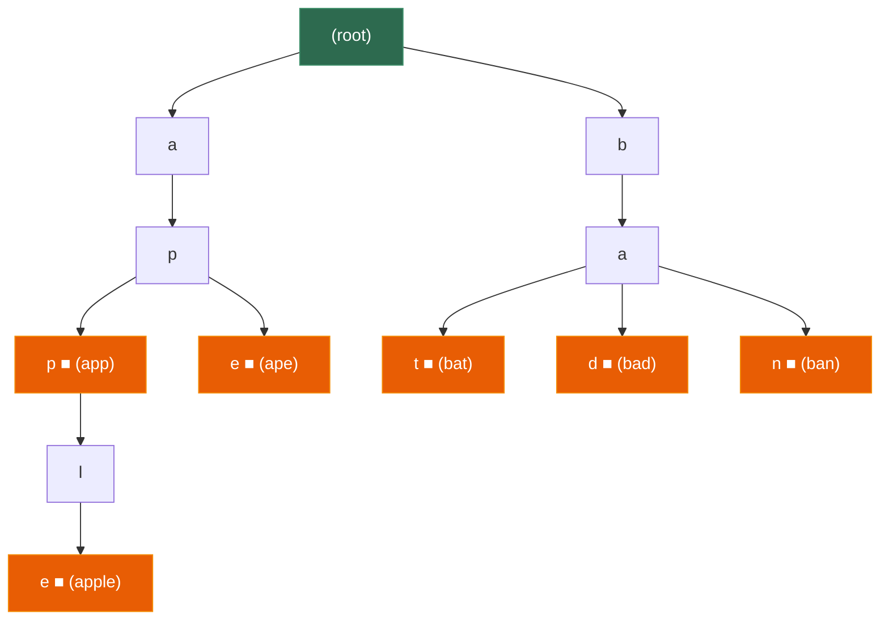

# 第八章 字典树 (Trie)

> **一句话理解**：字典树是一棵"按字符逐层展开"的树——多个字符串**共享公共前缀**，使得前缀查询 O(m)（m = 查询串长度），与数据集大小 n 无关。

---

## 8.1 概念直觉 —— What & Why

### 问题的起源

假设你有一个包含 10 万个英文单词的词典，需要频繁做以下操作：

1. 查找某个单词是否存在
2. 查找以某个前缀开头的所有单词（如自动补全）
3. 词频统计

| 方案 | 精确查找 | 前缀查找 | 说明 |
|------|---------|---------|------|
| 排序数组 + 二分 | O(m log n) | O(m log n + k) | 需要反复比较字符串 |
| 哈希表 | O(m) | **❌ 不支持** | 哈希值无法推导前缀关系 |
| **Trie** | **O(m)** | **O(m + k)** | **前缀查询的王者** |

> m = 字符串长度，n = 词典大小，k = 匹配结果数

### 生活类比

```
Trie 就像一本字典的目录:
  翻到 "t" 开头的章节
    → 翻到 "tr" 的页
      → 翻到 "tri" 的段落
        → 找到 "trie" ✅

你不需要从第一个单词开始逐个比较,
而是沿着前缀 "t → r → i → e" 直达目标.

共享前缀 = 共享查找路径
  "tree" 和 "trie" 共享 "tr" 路径
  10万个单词可能只需要几千个节点
```

### Trie vs 哈希表

| 维度 | 哈希表 | Trie |
|------|--------|------|
| 精确查找 | O(m) 均摊 | O(m) |
| **前缀搜索** | ❌ 不支持 | **✅ O(m + k)** |
| 按字典序遍历 | ❌ 无序 | **✅ 天然有序** |
| 最坏情况 | O(n) 全冲突 | O(m) 始终稳定 |
| 内存 | 紧凑（存完整 key） | **较大**（每个字符一个节点）|
| 适用场景 | 精确 key 查找 | **前缀匹配、自动补全、词典** |

> 💡 **选型金句**：如果需要前缀匹配或字典序遍历，Trie 是唯一的选择；如果只需要精确查找，哈希表更简洁高效。

---

## 8.2 结构图解

### 标准 Trie

```
插入单词: ["apple", "app", "ape", "bat", "bad", "ban"]

          (root)
         /      \
        a        b
        |        |
        p        a
       / \      / | \
      p   e    t   d   n
      |   ■    ■   ■   ■
      l
      |
      e
      ■

■ = 标记"这里结束了一个完整单词"
  "app" 在 p-p 处标记 ■
  "ape" 在 p-e 处标记 ■
  "apple" 在 l-e 处标记 ■
```



**核心观察**：

```
"apple" 和 "app" 共享路径 a → p → p
"app" 和 "ape" 共享路径 a → p
"bat", "bad", "ban" 共享路径 b → a

共享前缀 → 共享节点 → 节省空间 + 加速查找
```

### Trie 节点的两种实现方式

```
方式一: 固定数组 children[26]  (只支持小写字母)
  ┌───────────────────────────────────────────────┐
  │ TrieNode                                      │
  │   children[0] (a) → nullptr                   │
  │   children[1] (b) → TrieNode*                 │
  │   children[2] (c) → nullptr                   │
  │   ...                                         │
  │   children[25] (z) → nullptr                  │
  │   is_end = false                              │
  └───────────────────────────────────────────────┘
  优点: O(1) 随机访问子节点
  缺点: 每个节点 26 个指针, 大量 nullptr 浪费内存

方式二: 哈希表 unordered_map<char, TrieNode*>
  ┌───────────────────────────────────────────────┐
  │ TrieNode                                      │
  │   children = { 'b' → TrieNode*, 'x' → ... }  │
  │   is_end = false                              │
  └───────────────────────────────────────────────┘
  优点: 只存实际存在的子节点, 节省内存
  缺点: 哈希表查找常数略大, 不支持字典序遍历(除非用 map)
```

---

## 8.3 C++ 底层实现

### 8.3.1 固定数组版 (面试首选)

```cpp
#include <string>
#include <vector>

class Trie {
    struct TrieNode {
        TrieNode* children[26] = {};  // 初始化为 nullptr
        bool is_end = false;          // 是否是某个单词的结尾
        // int count = 0;             // 可选: 以此为前缀的单词数
    };

    TrieNode* _root;

public:
    Trie() : _root(new TrieNode()) {}

    ~Trie() { _destroy(_root); }

    // ========== 插入单词 ==========
    void insert(const std::string& word) {
        TrieNode* node = _root;
        for (char c : word) {
            int idx = c - 'a';
            if (!node->children[idx]) {
                node->children[idx] = new TrieNode();
            }
            node = node->children[idx];
        }
        node->is_end = true;  // 标记单词结尾
    }

    // ========== 查找单词 (精确匹配) ==========
    bool search(const std::string& word) const {
        const TrieNode* node = _find_node(word);
        return node != nullptr && node->is_end;
    }

    // ========== 前缀查询 ==========
    bool startsWith(const std::string& prefix) const {
        return _find_node(prefix) != nullptr;
    }

private:
    // 沿着 key 的字符路径走到对应节点
    const TrieNode* _find_node(const std::string& key) const {
        const TrieNode* node = _root;
        for (char c : key) {
            int idx = c - 'a';
            if (!node->children[idx]) return nullptr;
            node = node->children[idx];
        }
        return node;
    }

    void _destroy(TrieNode* node) {
        if (!node) return;
        for (auto* child : node->children) {
            _destroy(child);
        }
        delete node;
    }
};
```

**使用示例**：

```cpp
Trie trie;
trie.insert("apple");
trie.insert("app");
trie.insert("ape");

trie.search("apple");    // true
trie.search("app");      // true
trie.search("ap");       // false (不是完整单词)
trie.startsWith("ap");   // true  (是某个单词的前缀)
trie.startsWith("b");    // false
```

### 8.3.2 哈希表版 (支持任意字符集)

```cpp
#include <string>
#include <unordered_map>

class TrieMap {
    struct TrieNode {
        std::unordered_map<char, TrieNode*> children;
        bool is_end = false;
    };

    TrieNode* _root;

public:
    TrieMap() : _root(new TrieNode()) {}

    void insert(const std::string& word) {
        TrieNode* node = _root;
        for (char c : word) {
            if (node->children.find(c) == node->children.end()) {
                node->children[c] = new TrieNode();
            }
            node = node->children[c];
        }
        node->is_end = true;
    }

    bool search(const std::string& word) const {
        const TrieNode* node = _find(word);
        return node && node->is_end;
    }

    bool startsWith(const std::string& prefix) const {
        return _find(prefix) != nullptr;
    }

    // 收集以 prefix 开头的所有单词 (自动补全)
    std::vector<std::string> autocomplete(const std::string& prefix,
                                          int max_results = 10) const
    {
        const TrieNode* node = _find(prefix);
        if (!node) return {};

        std::vector<std::string> results;
        std::string current = prefix;
        _collect(node, current, results, max_results);
        return results;
    }

private:
    const TrieNode* _find(const std::string& key) const {
        const TrieNode* node = _root;
        for (char c : key) {
            auto it = node->children.find(c);
            if (it == node->children.end()) return nullptr;
            node = it->second;
        }
        return node;
    }

    // DFS 收集所有完整单词
    void _collect(const TrieNode* node, std::string& current,
                  std::vector<std::string>& results, int max) const
    {
        if (static_cast<int>(results.size()) >= max) return;

        if (node->is_end) {
            results.push_back(current);
        }

        for (auto& [c, child] : node->children) {
            current.push_back(c);
            _collect(child, current, results, max);
            current.pop_back();
        }
    }
};
```

### 8.3.3 两种实现方式对比

| 维度 | 数组 `children[26]` | 哈希表 `unordered_map` |
|------|--------------------|-----------------------|
| 子节点查找 | **O(1)** 数组索引 | O(1) 均摊，常数略大 |
| 内存 | 每节点 26 × 8B = **208B** | 只存实际存在的子节点 |
| 字符集 | **只支持小写字母** | **任意字符集** |
| 字典序 | ✅ 天然有序（a→z 遍历）| ❌ 无序（用 `map` 可有序）|
| 缓存友好 | ✅ 连续数组 | ❌ 哈希表跳转 |
| 面试场景 | **小写字母题目首选** | 多字符集、稀疏字符 |

> 💡 **面试中 95% 的 Trie 题目只涉及小写字母**，直接用 `children[26]` 数组版即可。简洁、快速、面试官一眼能看懂。

---

## 8.4 进阶变体

### 8.4.1 压缩 Trie (Radix Tree / Patricia Tree)

标准 Trie 的问题：如果有一条只有单个子节点的长链（如 "antidisestablishmentarianism"），会产生大量只有一个子节点的节点——纯粹浪费。

**压缩 Trie** 将这些单链路径合并为一个节点：

```
标准 Trie:                     压缩 Trie:
    (root)                        (root)
      |                          /     \
      t                       "te"    "to"
      |                        / \       \
      e                      "a"  "n"    "p"
     / \                      ■    ■      ■
    a    n                 (tea)  (ten) (top)
    ■    ■
  (tea) (ten)

标准 Trie: 6 个节点
压缩 Trie: 4 个节点 — 单链 "t→e" 合并为 "te"
```

```
压缩 Trie 的应用:
  1. Linux 内核的路由表 (Radix Tree)
  2. Redis 的 RADIX TREE (Stream 消息 ID 索引)
  3. IP 路由最长前缀匹配 (Longest Prefix Match)
  4. 数据库索引 (ART: Adaptive Radix Tree)
```

### 8.4.2 后缀树 / 后缀数组 (概述)

| 结构 | 原理 | 用途 | 复杂度 |
|------|------|------|--------|
| **后缀树** | 把字符串的**所有后缀**插入压缩 Trie | 子串查找、最长重复子串、最长公共子串 | 建树 O(n)，查询 O(m) |
| **后缀数组** | 所有后缀按字典序排序后的下标数组 | 同上，但更省内存 | 建数组 O(n log n)，配合 LCP 数组 |

> 后缀树/数组面试考察频率极低，了解概念即可。竞赛中偶尔出现。

### 8.4.3 带计数的 Trie

面试中常见的增强——在每个节点上维护经过次数和结束次数：

```cpp
class CountTrie {
    struct TrieNode {
        TrieNode* children[26] = {};
        int pass_count = 0;  // 经过这个节点的单词数
        int end_count = 0;   // 在这个节点结束的单词数
    };

    TrieNode* _root;

public:
    CountTrie() : _root(new TrieNode()) {}

    void insert(const std::string& word) {
        TrieNode* node = _root;
        node->pass_count++;
        for (char c : word) {
            int idx = c - 'a';
            if (!node->children[idx]) {
                node->children[idx] = new TrieNode();
            }
            node = node->children[idx];
            node->pass_count++;
        }
        node->end_count++;
    }

    // 删除一个单词 (支持重复插入)
    void erase(const std::string& word) {
        if (count_word(word) == 0) return;  // 不存在

        TrieNode* node = _root;
        node->pass_count--;
        for (char c : word) {
            int idx = c - 'a';
            node->children[idx]->pass_count--;
            if (node->children[idx]->pass_count == 0) {
                // 后续子树没有任何单词经过了, 直接删除
                _destroy(node->children[idx]);
                node->children[idx] = nullptr;
                return;
            }
            node = node->children[idx];
        }
        node->end_count--;
    }

    // 查询某个单词出现了几次
    int count_word(const std::string& word) const {
        const TrieNode* node = _find(word);
        return node ? node->end_count : 0;
    }

    // 查询以某个前缀开头的单词有几个
    int count_prefix(const std::string& prefix) const {
        const TrieNode* node = _find(prefix);
        return node ? node->pass_count : 0;
    }

private:
    const TrieNode* _find(const std::string& key) const {
        const TrieNode* node = _root;
        for (char c : key) {
            int idx = c - 'a';
            if (!node->children[idx]) return nullptr;
            node = node->children[idx];
        }
        return node;
    }

    void _destroy(TrieNode* node) {
        if (!node) return;
        for (auto* child : node->children) _destroy(child);
        delete node;
    }
};
```

---

## 8.5 复杂度速查表

| 操作 | 时间复杂度 | 说明 |
|------|-----------|------|
| 插入 | **O(m)** | m = 字符串长度 |
| 精确查找 | **O(m)** | 沿路径走 m 步 |
| 前缀查询 | **O(m)** | 走到前缀末尾 |
| 前缀枚举 | **O(m + k)** | k = 匹配结果数 |
| 删除 | **O(m)** | 沿路径走 m 步 |
| 按字典序遍历 | O(N) | N = Trie 中所有字符总数 |

**空间复杂度**：

| 实现 | 每节点大小 | 总空间 |
|------|-----------|--------|
| `children[26]` | ~208 字节 (26 × 8B 指针 + 元数据) | O(N × 26) |
| `unordered_map` | ~56 字节 (map 开销) + 每子节点 ~16B | O(N × avg_children) |

```
N = Trie 中的总节点数
   = 所有字符串的字符总数 - 共享前缀节省的字符数
   最坏: N = 所有字符串长度之和 (完全无共享前缀)
   最好: N ≈ max(字符串长度) (所有字符串是同一个前缀关系)
```

### Trie vs 哈希表 vs BST 横向对比

| 维度 | Trie | `unordered_set` | `std::set` (红黑树) |
|------|------|-----------------|---------------------|
| 精确查找 | O(m) | **O(m)** 均摊 | O(m log n) |
| 前缀查询 | **O(m)** ✅ | ❌ | O(m log n)* |
| 按序遍历 | ✅ 字典序 | ❌ | ✅ |
| 最坏情况 | O(m) | O(n × m) | O(m log n) |
| 内存 | **较大** | 较小 | 中等 |

> `*` `std::set` 的 `lower_bound` 可以做前缀范围查询，但需要构造区间端点，不如 Trie 直觉。

---

## 8.6 面试高频题

### 实现 Trie (LeetCode 208)

> 实现 Trie 类的三个方法：`insert`、`search`、`startsWith`。

就是 8.3.1 的实现。这道题是 Trie 的**入门必做题**，面试中经常作为后续题目的基础：

```cpp
// 解法见 8.3.1 —— 固定数组版 Trie
// 时间: insert O(m), search O(m), startsWith O(m)
// 空间: O(N × 26), N = 总字符数
```

> 💡 **面试写法要点**：(1) 用 `children[26]` 数组而非哈希表——简洁且面试官友好；(2) 区分 `search` 和 `startsWith`——前者要 `is_end == true`，后者只要节点存在。

### 单词搜索 II (LeetCode 212)

> 给定 m×n 的字符网格和一个单词列表，找出所有存在于网格中的单词。单词通过相邻上下左右格子的字母拼成。

**终极 Trie + DFS 回溯题**。暴力对每个单词做 DFS → O(W × m × n × 4^L)。Trie 优化：把所有单词建入 Trie，DFS 时同时在 Trie 上走，遇到不存在的前缀直接剪枝。

```cpp
class Solution {
    struct TrieNode {
        TrieNode* children[26] = {};
        std::string* word = nullptr;  // 到达此节点时的完整单词

        ~TrieNode() {
            for (auto* child : children) delete child;
        }
    };

    TrieNode* _root;

    void _build_trie(std::vector<std::string>& words) {
        _root = new TrieNode();
        for (auto& w : words) {
            TrieNode* node = _root;
            for (char c : w) {
                int idx = c - 'a';
                if (!node->children[idx]) {
                    node->children[idx] = new TrieNode();
                }
                node = node->children[idx];
            }
            node->word = &w;  // 指向原始单词 (避免复制)
        }
    }

    void _dfs(std::vector<std::vector<char>>& board,
              int i, int j, TrieNode* node,
              std::vector<std::string>& result)
    {
        if (i < 0 || i >= static_cast<int>(board.size())
            || j < 0 || j >= static_cast<int>(board[0].size()))
            return;

        char c = board[i][j];
        if (c == '#') return;  // 已访问

        int idx = c - 'a';
        if (!node->children[idx]) return;  // Trie 中没有这个前缀 → 剪枝!

        node = node->children[idx];

        if (node->word) {
            result.push_back(*node->word);
            node->word = nullptr;  // 去重: 一个单词只加一次
        }

        // DFS 四个方向
        board[i][j] = '#';  // 标记已访问
        _dfs(board, i + 1, j, node, result);
        _dfs(board, i - 1, j, node, result);
        _dfs(board, i, j + 1, node, result);
        _dfs(board, i, j - 1, node, result);
        board[i][j] = c;    // 回溯: 恢复

        // 优化: 如果当前节点已无子节点, 从 Trie 中剪掉
        // (后续不会再有单词经过这里)
    }

public:
    std::vector<std::string> findWords(
        std::vector<std::vector<char>>& board,
        std::vector<std::string>& words)
    {
        _build_trie(words);

        std::vector<std::string> result;
        int m = board.size(), n = board[0].size();

        for (int i = 0; i < m; ++i) {
            for (int j = 0; j < n; ++j) {
                _dfs(board, i, j, _root, result);
            }
        }

        delete _root;
        return result;
    }
};
// 时间 O(m × n × 4^L), L = 最长单词长度
// 实际远快于暴力, 因为 Trie 前缀剪枝砍掉了大量无效搜索
```

> 💡 **为什么 Trie + DFS 比暴力快？** 假设有 1000 个单词，暴力要对每个单词做一次 DFS。用 Trie 只需一次 DFS——在 DFS 过程中同步在 Trie 上走，一旦当前前缀不在任何单词中，立即剪枝。1000 次 DFS → 1 次 DFS + 剪枝。

### 设计搜索自动补全系统 (LeetCode 642)

> 设计一个搜索自动补全系统，支持输入字符后返回热度最高的 3 个匹配前缀的句子。

```cpp
class AutocompleteSystem {
    struct TrieNode {
        std::unordered_map<char, TrieNode*> children;
        std::unordered_map<std::string, int> sentences;
        // 经过此节点的所有句子及其热度
    };

    TrieNode* _root;
    TrieNode* _current;   // 当前输入位置
    std::string _input;   // 当前输入缓冲

public:
    AutocompleteSystem(std::vector<std::string>& sentences,
                       std::vector<int>& times)
    {
        _root = new TrieNode();
        _current = _root;

        for (int i = 0; i < static_cast<int>(sentences.size()); ++i) {
            _insert(sentences[i], times[i]);
        }
    }

    std::vector<std::string> input(char c) {
        if (c == '#') {
            // 输入结束, 记录当前输入的句子
            _insert(_input, 1);
            _input.clear();
            _current = _root;
            return {};
        }

        _input += c;

        // 在 Trie 上移动
        if (_current && _current->children.count(c)) {
            _current = _current->children[c];
        } else {
            _current = nullptr;  // 无匹配
            return {};
        }

        // 找热度最高的 3 个
        auto& candidates = _current->sentences;
        std::vector<std::pair<std::string, int>> sorted(
            candidates.begin(), candidates.end());

        std::sort(sorted.begin(), sorted.end(),
            [](const auto& a, const auto& b) {
                return a.second > b.second
                    || (a.second == b.second && a.first < b.first);
            });

        std::vector<std::string> result;
        for (int i = 0; i < 3 && i < static_cast<int>(sorted.size()); ++i) {
            result.push_back(sorted[i].first);
        }
        return result;
    }

private:
    void _insert(const std::string& sentence, int times) {
        TrieNode* node = _root;
        for (char c : sentence) {
            if (!node->children.count(c)) {
                node->children[c] = new TrieNode();
            }
            node = node->children[c];
            node->sentences[sentence] += times;  // 每个路径节点都记录完整句子
        }
    }
};
```

### 添加与搜索单词 (LeetCode 211)

> 设计支持 `.` 通配符的搜索：`.` 可以匹配任意字母。

```cpp
class WordDictionary {
    struct TrieNode {
        TrieNode* children[26] = {};
        bool is_end = false;
    };

    TrieNode* _root;

public:
    WordDictionary() : _root(new TrieNode()) {}

    void addWord(const std::string& word) {
        TrieNode* node = _root;
        for (char c : word) {
            int idx = c - 'a';
            if (!node->children[idx]) {
                node->children[idx] = new TrieNode();
            }
            node = node->children[idx];
        }
        node->is_end = true;
    }

    bool search(const std::string& word) {
        return _dfs(_root, word, 0);
    }

private:
    bool _dfs(TrieNode* node, const std::string& word, int pos) {
        if (!node) return false;
        if (pos == static_cast<int>(word.size())) return node->is_end;

        char c = word[pos];

        if (c == '.') {
            // 通配符: 尝试所有子节点
            for (int i = 0; i < 26; ++i) {
                if (_dfs(node->children[i], word, pos + 1)) {
                    return true;
                }
            }
            return false;
        } else {
            return _dfs(node->children[c - 'a'], word, pos + 1);
        }
    }
};
// 时间: addWord O(m), search O(m) 无通配, O(26^k × m) 有 k 个通配
```

> 💡 **`.` 通配符的处理**：遇到 `.` 时，DFS 尝试所有 26 个子节点——本质是回溯。最坏情况全是 `.`，需要遍历整棵 Trie。面试中这道题考察的是 Trie + DFS 回溯的结合。

### 回文对 (LeetCode 336)

> 给定一组唯一字符串，找出所有不同的 (i, j) 使得 words[i] + words[j] 是回文。

**Trie + 逆序 + 回文检查**。将所有单词**逆序**插入 Trie，然后对每个单词在 Trie 上查找，沿途检查剩余部分是否是回文：

```cpp
class Solution {
    struct TrieNode {
        TrieNode* children[26] = {};
        int word_idx = -1;  // 如果某个逆序单词在此结束
        std::vector<int> palindrome_below;  // 后续子树中构成回文的单词下标
    };

    TrieNode* _root;

    bool _is_palindrome(const std::string& s, int left, int right) {
        while (left < right) {
            if (s[left++] != s[right--]) return false;
        }
        return true;
    }

public:
    std::vector<std::vector<int>> palindromePairs(std::vector<std::string>& words) {
        _root = new TrieNode();

        // 1. 所有单词逆序插入 Trie
        for (int i = 0; i < static_cast<int>(words.size()); ++i) {
            TrieNode* node = _root;
            const auto& w = words[i];

            for (int j = w.size() - 1; j >= 0; --j) {
                // 如果 w[0..j] 是回文, 记录下标
                if (_is_palindrome(w, 0, j)) {
                    node->palindrome_below.push_back(i);
                }

                int idx = w[j] - 'a';
                if (!node->children[idx]) {
                    node->children[idx] = new TrieNode();
                }
                node = node->children[idx];
            }
            node->word_idx = i;
            node->palindrome_below.push_back(i);  // 空串也是回文
        }

        // 2. 对每个单词, 在 Trie 上查找回文对
        std::vector<std::vector<int>> result;

        for (int i = 0; i < static_cast<int>(words.size()); ++i) {
            TrieNode* node = _root;
            const auto& w = words[i];

            for (int j = 0; j < static_cast<int>(w.size()); ++j) {
                // 当前 Trie 节点是某个逆序单词的结尾
                // 且 w 剩余部分 w[j..end] 是回文
                if (node->word_idx != -1 && node->word_idx != i
                    && _is_palindrome(w, j, w.size() - 1))
                {
                    result.push_back({i, node->word_idx});
                }

                int idx = w[j] - 'a';
                if (!node->children[idx]) {
                    node = nullptr;
                    break;
                }
                node = node->children[idx];
            }

            if (!node) continue;

            // w 完全匹配了 Trie 路径, 检查后续回文子树
            for (int j : node->palindrome_below) {
                if (j != i) {
                    result.push_back({i, j});
                }
            }
        }

        return result;
    }
};
// 时间 O(n × m²), n = 单词数, m = 最长单词长度
```

### 最长公共前缀 (LeetCode 14)

> 找出字符串数组的最长公共前缀。

虽然这题不一定要用 Trie（纵向比较更简洁），但用 Trie 思路更清晰：

```cpp
// Trie 解法: 所有字符串插入 Trie, 从根走到第一个分叉点
std::string longestCommonPrefix(std::vector<std::string>& strs) {
    if (strs.empty()) return "";

    Trie trie;
    for (auto& s : strs) {
        if (s.empty()) return "";
        trie.insert(s);
    }

    // 从根开始, 沿着唯一子节点走, 直到分叉或遇到单词结尾
    std::string prefix;
    auto* node = trie.root();  // 假设 Trie 暴露了 root()

    while (true) {
        int child_count = 0, child_idx = -1;
        for (int i = 0; i < 26; ++i) {
            if (node->children[i]) {
                ++child_count;
                child_idx = i;
            }
        }

        // 分叉 (>1 个子节点) 或到达某个单词结尾 → 停止
        if (child_count != 1 || node->is_end) break;

        prefix += static_cast<char>('a' + child_idx);
        node = node->children[child_idx];
    }

    return prefix;
}
```

> 💡 **更简洁的非 Trie 解法**：直接逐字符纵向比较所有字符串，O(S) 时间（S = 所有字符总数）。但 Trie 解法体现了"公共前缀 = Trie 中没有分叉的路径"这一核心直觉。

---

## 8.7 🎮 实战场景

### 聊天敏感词过滤 (AC 自动机基础 = Trie + 失败指针)

```cpp
// 游戏中的聊天系统, 需要实时过滤敏感词
// 方案: 将所有敏感词建入 Trie, 对用户输入逐字符在 Trie 上匹配

class SensitiveWordFilter {
    struct TrieNode {
        TrieNode* children[128] = {};  // 支持 ASCII
        bool is_end = false;
        int word_length = 0;  // 匹配到时需要替换的长度
    };

    TrieNode* _root;

public:
    SensitiveWordFilter() : _root(new TrieNode()) {}

    // 添加敏感词
    void add_word(const std::string& word) {
        TrieNode* node = _root;
        for (char c : word) {
            if (!node->children[static_cast<int>(c)]) {
                node->children[static_cast<int>(c)] = new TrieNode();
            }
            node = node->children[static_cast<int>(c)];
        }
        node->is_end = true;
        node->word_length = word.size();
    }

    // 过滤: 将敏感词替换为 ***
    std::string filter(const std::string& text) {
        std::string result = text;

        for (int i = 0; i < static_cast<int>(text.size()); ++i) {
            TrieNode* node = _root;

            for (int j = i; j < static_cast<int>(text.size()); ++j) {
                int idx = static_cast<int>(text[j]);
                if (!node->children[idx]) break;

                node = node->children[idx];

                if (node->is_end) {
                    // 命中敏感词! 替换为 ***
                    for (int k = i; k <= j; ++k) {
                        result[k] = '*';
                    }
                    // 不 break: 继续匹配更长的敏感词
                    // (如 "麻" 和 "麻将" 都是敏感词, 要匹配最长的)
                }
            }
        }

        return result;
    }
};

// 使用:
// SensitiveWordFilter filter;
// filter.add_word("fuck");
// filter.add_word("shit");
// filter.add_word("damn");
// std::string safe = filter.filter("what the fuck");  // "what the ****"
```

```
进阶: AC 自动机 (Aho-Corasick)
  Trie 的多模式匹配增强版:
    - 在 Trie 上加 "失败指针" (类似 KMP 的 next 数组)
    - 当某个分支匹配失败时, 不回退到根, 而是跳到另一个匹配的前缀
    - 一次扫描文本 O(n) 即可找到所有敏感词
    - 面试中不常考, 但游戏工程中是标配

  简单 Trie 过滤:  O(n × m × L)  n=文本长, m=敏感词数, L=最长词
  AC 自动机过滤:   O(n + m × L)  建 Trie O(m×L), 扫描 O(n)
```

### 控制台命令补全

```cpp
// 游戏内控制台 (如 Minecraft 的 / 命令):
// /help  /home  /tp  /teleport  /time  /give  /gamemode

class ConsoleAutocomplete {
    struct TrieNode {
        std::unordered_map<char, TrieNode*> children;
        std::string full_command;  // 非空表示这是一个完整命令
        std::string description;   // 命令描述
    };

    TrieNode* _root;

public:
    ConsoleAutocomplete() : _root(new TrieNode()) {}

    void register_command(const std::string& command,
                          const std::string& desc)
    {
        TrieNode* node = _root;
        for (char c : command) {
            if (!node->children.count(c)) {
                node->children[c] = new TrieNode();
            }
            node = node->children[c];
        }
        node->full_command = command;
        node->description = desc;
    }

    // 输入前缀, 返回匹配的命令和描述
    struct Suggestion {
        std::string command;
        std::string description;
    };

    std::vector<Suggestion> suggest(const std::string& prefix) {
        TrieNode* node = _root;
        for (char c : prefix) {
            if (!node->children.count(c)) return {};
            node = node->children[c];
        }

        std::vector<Suggestion> results;
        _collect(node, results);
        return results;
    }

private:
    void _collect(TrieNode* node, std::vector<Suggestion>& results) {
        if (!node->full_command.empty()) {
            results.push_back({node->full_command, node->description});
        }
        for (auto& [c, child] : node->children) {
            _collect(child, results);
        }
    }
};

// 使用:
// ConsoleAutocomplete console;
// console.register_command("/teleport", "传送到指定坐标");
// console.register_command("/time", "设置时间");
// console.register_command("/tp", "传送到玩家 (简写)");
//
// 玩家输入 "/t" → suggest("/t"):
//   ["/teleport - 传送到指定坐标", "/time - 设置时间", "/tp - 传送到玩家"]
//
// 玩家输入 "/te" → suggest("/te"):
//   ["/teleport - 传送到指定坐标"]
```

### 资源路径前缀索引

```cpp
// 游戏引擎中, 资源路径有大量共享前缀:
// "assets/textures/character/hero_01.png"
// "assets/textures/character/hero_02.png"
// "assets/textures/environment/grass.png"
// "assets/textures/environment/sky.png"
// "assets/models/character/hero.fbx"
// "assets/sounds/bgm/battle.ogg"

// Trie 优势:
// 1. 共享前缀节省内存 ("assets/textures/" 只存一次)
// 2. 快速前缀查询: "assets/textures/character/" → 列出所有角色贴图
// 3. 热加载: 某个文件夹变化时, 快速定位受影响的资源

// 本地化 key 查找:
// "ui.menu.start"
// "ui.menu.settings"
// "ui.menu.quit"
// "ui.dialog.confirm"
// "ui.dialog.cancel"
// 用 Trie 按 '.' 分割, 快速获取某个 namespace 下的所有 key
```

### 游戏场景总结

| 游戏系统 | Trie 用法 | 关键优势 |
|----------|----------|---------|
| **聊天敏感词过滤** | 所有敏感词建 Trie → 逐字符匹配 | 多模式同时匹配，AC 自动机进阶 |
| **控制台命令补全** | 所有命令建 Trie → 前缀搜索 | 实时补全，O(m) 查找 |
| **资源路径索引** | 所有路径建 Trie → 前缀枚举 | 共享前缀节省内存，热加载定位 |
| **本地化 key 查找** | 多层级 key 建 Trie → 命名空间查询 | 快速获取某个模块的所有文案 |
| **拼写检查** | 词典建 Trie + 编辑距离 | 自动纠错建议 |

---

## 8.8 面试题速查表

| 题号 | 题目 | 核心技巧 | 难度 |
|------|------|----------|------|
| LC 208 | 实现 Trie | **Trie 基础模板** | Medium |
| LC 211 | 添加与搜索单词 | Trie + DFS (`.` 通配符) | Medium |
| LC 212 | 单词搜索 II | **Trie + 网格 DFS 回溯** | Hard |
| LC 642 | 设计搜索自动补全 | Trie + 排序/热度 | Hard |
| LC 336 | 回文对 | Trie + 逆序 + 回文检查 | Hard |
| LC 14 | 最长公共前缀 | Trie 或纵向比较 | Easy |
| LC 648 | 单词替换 | Trie 前缀匹配 | Medium |
| LC 677 | 键值映射 | Trie + DFS 求前缀和 | Medium |
| LC 720 | 词典中最长的单词 | Trie + BFS/DFS | Medium |
| LC 421 | 数组中两个数的最大异或值 | **位 Trie** (0/1 Trie) | Medium |

---

## 8.9 本章小结

### 核心要点

| 概念 | 要点 |
|------|------|
| **Trie 结构** | 每个节点代表一个字符，从根到某节点的路径 = 一个前缀 |
| **is_end 标记** | 区分"前缀"和"完整单词" |
| **时间复杂度** | O(m)——与数据集大小 n 无关，只与查询串长度 m 相关 |
| **空间代价** | 每节点 26 个指针 → 空间换时间。共享前缀能显著节省 |
| **核心优势** | 前缀查询、自动补全、多模式匹配——哈希表做不到 |
| **两种实现** | `children[26]`（快、面试首选）vs `unordered_map`（灵活、省空间）|
| **面试重点** | LC 208（模板）→ LC 212（Trie+DFS 终极结合）→ LC 211（通配符）|

### 面试 30 秒速答

> **Q：Trie 的原理？和哈希表比有什么优势？**
>
> A：Trie 是一棵按字符逐层展开的树，多个字符串**共享公共前缀**，从而共享查找路径。插入和查找都是 O(m)（m = 字符串长度），与数据集大小无关。相比哈希表，Trie 的核心优势是**前缀查询 O(m)**和**字典序遍历**——哈希表的哈希值破坏了前缀关系，无法做前缀搜索。

> **Q：Trie 的空间开销大吗？怎么优化？**
>
> A：标准 Trie 每个节点 26 个指针，空间确实较大。优化方案：(1) **压缩 Trie (Radix Tree)**——合并只有一个子节点的链路，大幅减少节点数；(2) 用 **`unordered_map`** 代替固定数组——只存实际存在的子节点；(3) **数组池化**——预分配节点数组避免堆碎片化。

> **Q：怎么用 Trie 实现自动补全？**
>
> A：所有候选词插入 Trie。用户输入前缀时，沿 Trie 走到前缀末尾节点，然后 **DFS 收集**该子树下所有 `is_end = true` 的路径即可。如果要按热度排序，在节点上再维护一个热度信息，收集后排序取 Top-K。

> **Q：LC 212 单词搜索 II 怎么做？为什么用 Trie？**
>
> A：把所有单词建入 Trie，然后对网格每个格子启动 DFS，DFS 同时在 Trie 上走。遇到 Trie 中不存在的前缀直接**剪枝**。这比暴力（对每个单词各做一次 DFS）快得多——一次 DFS 同时搜索所有单词，前缀不匹配立即终止。

---

> 📖 上一章：[第七章 图：万物皆可连](../graph/)
>
> 📖 下一章：[第九章 并查集：找老大](../09_union_find) —— 路径压缩与按秩合并，近 O(1) 的等价类合并，Kruskal MST 的核心组件。
