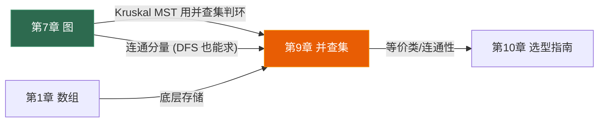

# 第九章 并查集 (Union-Find)

> **一句话理解**：并查集是专门处理"**动态连通性**"的数据结构——它能在**近 O(1)** 的时间内完成两个操作：判断两个元素是否在同一集合（Find），以及合并两个集合（Union）。

---

## 9.1 概念直觉 —— What & Why

### "找老大"类比

```
想象一个黑帮世界:
  每个人都有一个"老大" (parent)
  最终的大佬没有老大 → 他就是这一派的"根" (root)
  
  问: 张三和李四是不是同一帮的?
    → 分别找到各自的大佬 (Find)
    → 大佬相同 → 同一帮 ✅
    → 大佬不同 → 不同帮 ❌

  操作: 两帮合并 (Union)
    → 让一个帮的大佬认另一个帮的大佬当老大
    → 两帮变一帮

  这就是并查集!
```

### 问题的起源

给定 n 个元素，初始时每个元素独立成一个集合。需要支持两种操作：

1. **Union(x, y)**：合并 x 和 y 所在的集合
2. **Find(x)**：找到 x 所在集合的代表元素（根）
3. **Connected(x, y)**：判断 x 和 y 是否在同一集合 → `Find(x) == Find(y)`

| 方案 | Union | Find | 说明 |
|------|-------|------|------|
| 暴力数组 | O(n) | O(1) | Quick Find（每次合并要遍历所有元素）|
| 链表 | O(1)* | O(n) | 每次 Find 要走到链尾 |
| **并查集** | **≈ O(1)** | **≈ O(1)** | **路径压缩 + 按秩合并 → α(n)** |

### 等价类 / 连通分量

并查集维护的本质是**等价关系**——满足自反性、对称性、传递性的关系：

```
例: 好友关系 (传递性: A和B是好友, B和C是好友 → A和C是同一圈子)

  初始: {A}, {B}, {C}, {D}, {E}

  Union(A, B) → {A, B}, {C}, {D}, {E}
  Union(C, D) → {A, B}, {C, D}, {E}
  Union(B, D) → {A, B, C, D}, {E}    ← A和C现在也连通了!

  Find(A) == Find(C) → true  (同一连通分量)
  Find(A) == Find(E) → false (不同连通分量)
```

---

## 9.2 结构图解

### 并查集的树形结构

```
并查集用"森林"表示——每棵树是一个集合, 根节点是代表元素

初始 (每个元素自成一棵树):
  0   1   2   3   4   5   6   7

Union(0,1): 1 的 parent = 0
  0   2   3   4   5   6   7
  |
  1

Union(2,3): 3 的 parent = 2
  0   2   4   5   6   7
  |   |
  1   3

Union(0,2): 2 的 parent = 0  (把 2 的树挂到 0 下面)
    0       4   5   6   7
   / \
  1   2
      |
      3

Union(4,5), Union(6,7), Union(4,6):
    0           4
   / \         / \
  1   2       5   6
      |           |
      3           7

现在: Find(3) → 走 3→2→0 → 返回 0
      Find(7) → 走 7→6→4 → 返回 4
      Connected(1, 3) → Find(1)==0, Find(3)==0 → true ✅
      Connected(1, 7) → Find(1)==0, Find(7)==4 → false ❌
```

### 底层存储 —— 一个数组就够了

```
parent 数组: parent[i] = i 的父节点, 如果 parent[i] == i 则 i 是根

下标:     0  1  2  3  4  5  6  7
parent:  [0, 0, 0, 2, 4, 4, 4, 6]

树形结构:     0           4
             / \         / \
            1   2       5   6
                |           |
                3           7

Find(3): parent[3]=2 → parent[2]=0 → parent[0]=0 (根!) → 返回 0
```

---

## 9.3 C++ 底层实现

### 9.3.1 Quick Find (朴素版 —— 了解即可)

```cpp
class QuickFind {
    std::vector<int> _id;  // _id[i] = i 所在集合的标识

public:
    QuickFind(int n) : _id(n) {
        std::iota(_id.begin(), _id.end(), 0);
    }

    int find(int x) const { return _id[x]; }  // O(1)!

    void unite(int x, int y) {
        int id_x = _id[x], id_y = _id[y];
        if (id_x == id_y) return;

        // 把所有 id_y 的元素改成 id_x → O(n)!
        for (int& id : _id) {
            if (id == id_y) id = id_x;
        }
    }

    bool connected(int x, int y) const { return _id[x] == _id[y]; }
};
```

**Quick Find 的问题**：Find O(1) 很快，但 Union O(n) 太慢——每次合并要遍历整个数组。如果有 n 次 Union 操作，总时间 O(n²)。

### 9.3.2 Quick Union (树形结构)

```cpp
class QuickUnion {
    std::vector<int> _parent;

public:
    QuickUnion(int n) : _parent(n) {
        std::iota(_parent.begin(), _parent.end(), 0);  // parent[i] = i
    }

    int find(int x) {
        while (_parent[x] != x) {
            x = _parent[x];  // 沿着 parent 走到根
        }
        return x;
    }

    void unite(int x, int y) {
        int rx = find(x), ry = find(y);
        if (rx != ry) {
            _parent[ry] = rx;  // 把 y 的根挂到 x 的根下面
        }
    }

    bool connected(int x, int y) { return find(x) == find(y); }
};
```

**Quick Union 的问题**：Find 的时间取决于树的高度。最坏情况退化成链表 → Find O(n)。

```
退化示例:
  Union(1,0), Union(2,1), Union(3,2), Union(4,3)
  
  0 ← 1 ← 2 ← 3 ← 4    (链表!)

  Find(4): 4→3→2→1→0 → O(n)
```

### 9.3.3 路径压缩 (Path Compression)

**核心优化**：Find 的时候，把沿途所有节点直接指向根。下次 Find 这些节点时就是 O(1) 了。

```
路径压缩前:                   路径压缩后:
      0                            0
      |                         / | \ \
      1                        1  2  3  4
      |
      2
      |
      3
      |
      4

Find(4): 4→3→2→1→0            Find(4): 4→0 (一步到位!)
同时: parent[4]=0, parent[3]=0, parent[2]=0, parent[1]=0
```

```cpp
// 路径压缩 —— 递归版 (最简洁)
int find(int x) {
    if (_parent[x] != x) {
        _parent[x] = find(_parent[x]);  // 递归 + 直接挂到根
    }
    return _parent[x];
}

// 路径压缩 —— 迭代版 (防栈溢出)
int find_iterative(int x) {
    int root = x;
    while (_parent[root] != root) {
        root = _parent[root];
    }
    // 第二遍: 把路径上所有节点直接指向根
    while (_parent[x] != root) {
        int next = _parent[x];
        _parent[x] = root;
        x = next;
    }
    return root;
}

// 路径压缩的"兄弟版" —— 路径分裂 (Path Splitting)
// 每个节点指向祖父节点 (不需要两遍, 效果接近完全压缩)
int find_splitting(int x) {
    while (_parent[x] != x) {
        _parent[x] = _parent[_parent[x]];  // 指向祖父
        x = _parent[x];
    }
    return x;
}
```

### 9.3.4 按秩合并 (Union by Rank)

**核心优化**：Union 时，把矮的树挂到高的树下面。这保证树的高度增长缓慢——最多 O(log n)。

```
按秩合并:
  rank 代表树的"大致高度"

  合并时: 如果两棵树高度不同, 矮树挂到高树下 → 总高度不变
          如果两棵树高度相同, 任选一个挂 → 总高度 +1

  结果: 树高度最多 O(log n), 不会退化成链表
```

### 9.3.5 终极实现 —— 路径压缩 + 按秩合并

```cpp
#include <vector>
#include <numeric>

class UnionFind {
    std::vector<int> _parent;
    std::vector<int> _rank;
    int _count;  // 连通分量数

public:
    UnionFind(int n) : _parent(n), _rank(n, 0), _count(n) {
        std::iota(_parent.begin(), _parent.end(), 0);
    }

    // ========== Find (路径压缩) ==========
    int find(int x) {
        if (_parent[x] != x) {
            _parent[x] = find(_parent[x]);  // 路径压缩
        }
        return _parent[x];
    }

    // ========== Union (按秩合并) ==========
    bool unite(int x, int y) {
        int rx = find(x), ry = find(y);
        if (rx == ry) return false;  // 已在同一集合

        // 按秩合并: 矮树挂到高树下
        if (_rank[rx] < _rank[ry]) std::swap(rx, ry);
        _parent[ry] = rx;

        // 如果高度相同, 合并后高度 +1
        if (_rank[rx] == _rank[ry]) ++_rank[rx];

        --_count;  // 连通分量减少
        return true;
    }

    // ========== 查询 ==========
    bool connected(int x, int y) { return find(x) == find(y); }
    int count() const { return _count; }  // 当前连通分量数
};
```

**使用示例**：

```cpp
UnionFind uf(10);

uf.unite(0, 1);
uf.unite(2, 3);
uf.unite(0, 3);     // {0,1,2,3} 合并为一个集合

uf.connected(0, 3); // true
uf.connected(0, 5); // false
uf.count();          // 7 (10 - 3 次成功合并)
```

### 9.3.6 按大小合并 (Union by Size) —— 替代方案

有时用"集合大小"代替"秩"更方便，因为 size 有实际物理意义：

```cpp
class UnionFindBySize {
    std::vector<int> _parent;
    std::vector<int> _size;
    int _count;

public:
    UnionFindBySize(int n) : _parent(n), _size(n, 1), _count(n) {
        std::iota(_parent.begin(), _parent.end(), 0);
    }

    int find(int x) {
        if (_parent[x] != x) _parent[x] = find(_parent[x]);
        return _parent[x];
    }

    bool unite(int x, int y) {
        int rx = find(x), ry = find(y);
        if (rx == ry) return false;

        // 小集合挂到大集合下
        if (_size[rx] < _size[ry]) std::swap(rx, ry);
        _parent[ry] = rx;
        _size[rx] += _size[ry];  // 更新大小

        --_count;
        return true;
    }

    int size_of(int x) { return _size[find(x)]; }
    bool connected(int x, int y) { return find(x) == find(y); }
    int count() const { return _count; }
};
```

---

## 9.4 复杂度分析

### α(n) —— 反阿克曼函数

路径压缩 + 按秩合并后，单次操作的均摊时间是 **O(α(n))**，其中 α 是**反阿克曼函数 (Inverse Ackermann Function)**。

```
α(n) 增长极其缓慢:
  α(1)         = 0
  α(2)         = 1
  α(4)         = 2
  α(16)        = 3
  α(65536)     = 4
  α(2^65536)   = 5  ← 这个数比宇宙中的原子数还多!

对于所有实际可能的 n (n < 2^65536):
  α(n) ≤ 5

因此 α(n) 在工程上等价于常数 → 并查集的操作几乎是 O(1)
```

### 复杂度速查

| 实现 | Find | Union | 说明 |
|------|------|-------|------|
| Quick Find | O(1) | **O(n)** | 每次合并遍历数组 |
| Quick Union | O(n) | O(n) | 树可能退化成链 |
| + 按秩合并 | O(log n) | O(log n) | 树高 ≤ log n |
| + 路径压缩 | O(α(n))≈O(1) | O(α(n))≈O(1) | 摊还分析 |
| **终极版 (两者结合)** | **O(α(n))** | **O(α(n))** | **实际 O(1)** |

| 操作 | 时间 | 空间 |
|------|------|------|
| 初始化 | O(n) | O(n) |
| Find | O(α(n)) ≈ O(1) | O(1)（迭代）/ O(α(n))（递归栈）|
| Unite | O(α(n)) ≈ O(1) | O(1) |
| Connected | O(α(n)) ≈ O(1) | O(1) |
| m 次操作总计 | **O(m × α(n))** ≈ O(m) | O(n) |

> 💡 **面试表述**：「并查集的 Find 和 Union 操作时间复杂度是 O(α(n))，α 是反阿克曼函数，对所有实际输入都 ≤ 5，可以视为**常数时间**。」

---

## 9.5 进阶变体

### 9.5.1 带权并查集 (Weighted Union-Find)

在普通并查集的基础上，每条 parent 边带一个**权重**，表示节点到父节点的某种"距离"或"倍率关系"。

**核心难点**：路径压缩时，权重不能丢——必须沿路径**累乘**。

```
应用: LC 399 除法求值
  a / b = 2.0  →  a = 2 × b  →  weight(a→b) = 2.0
  b / c = 3.0  →  b = 3 × c  →  weight(b→c) = 3.0
  
  求 a / c?
    a → b → c
    a = 2 × b = 2 × 3 × c = 6 × c
    a / c = 6.0
    
  路径压缩时, 权重要累积!
```

### 图解：带权路径压缩

```
初始：unite(a, b, 2.0) → a/b=2, 即 weight(a→b)=2.0

    b (root)
    ↑ w=2.0
    a

再 unite(b, c, 3.0) → b/c=3, 即 weight(b→c)=3.0

    c (root)
    ↑ w=3.0
    b
    ↑ w=2.0
    a

现在 find(a) 触发路径压缩:
  Step 1: 递归 find(b)
    Step 1.1: 递归 find(c)
      c 是根, 返回 c
    Step 1.2: 回到 b
      weight[b] *= weight[parent[b]] → weight[b] = 3.0 × 1.0 = 3.0
      parent[b] = c  (已经是 c, 不变)
  Step 2: 回到 a
    weight[a] *= weight[parent[a]] → weight[a] = 2.0 × 3.0 = 6.0
    parent[a] = c  (直接指向根!)

压缩后:
    c (root)
   ↗ ↑
  a   b
  w=6 w=3

query(a, c) = weight[a] / weight[c] = 6.0 / 1.0 = 6.0 ✅
query(a, b) = weight[a] / weight[b] = 6.0 / 3.0 = 2.0 ✅
```

### 带权合并的权重推导

```
已有:
  a --w[a]--> root_x    (a 到 root_x 的累积权重 = w[a])
  b --w[b]--> root_y    (b 到 root_y 的累积权重 = w[b])

现在 unite(a, b, val), 即 a/b = val:
  需要让 root_x 和 root_y 合并
  
  假设 root_y 挂到 root_x 下:
    weight[root_y] = ?
  
  推导:
    a = w[a] × root_x
    b = w[b] × root_y
    a/b = val  →  w[a] × root_x / (w[b] × root_y) = val
    →  root_y = w[a] × root_x / (val × w[b])
    →  weight[root_y → root_x] = w[a] / (val × w[b])
```

### C++ 实现

```cpp
class WeightedUnionFind {
    std::vector<int> _parent;
    std::vector<double> _weight;  // weight[i] = i 到 parent[i] 的权重比
    std::vector<int> _rank;

public:
    WeightedUnionFind(int n)
        : _parent(n), _weight(n, 1.0), _rank(n, 0)
    {
        std::iota(_parent.begin(), _parent.end(), 0);
    }

    // 带权路径压缩
    int find(int x) {
        if (_parent[x] != x) {
            int root = find(_parent[x]);
            _weight[x] *= _weight[_parent[x]];  // 权重累积!
            _parent[x] = root;
        }
        return _parent[x];
    }

    // 带权合并: x / y = value → x = value × y
    void unite(int x, int y, double value) {
        int rx = find(x), ry = find(y);
        if (rx == ry) return;

        if (_rank[rx] < _rank[ry]) {
            _parent[rx] = ry;
            _weight[rx] = value * _weight[y] / _weight[x];
        } else {
            _parent[ry] = rx;
            _weight[ry] = _weight[x] / (value * _weight[y]);
            if (_rank[rx] == _rank[ry]) ++_rank[rx];
        }
    }

    // 查询 x / y 的值; 如果不在同一集合返回 -1.0
    double query(int x, int y) {
        if (find(x) != find(y)) return -1.0;
        return _weight[x] / _weight[y];
    }
};
```

> 💡 **带权并查集的本质**：普通并查集维护的是"谁和谁在同一组"的**布尔关系**；带权并查集维护的是"谁是谁的**多少倍**"的**定量关系**。Find 返回的 `weight[x]` 代表 x 到根的累积倍率，任意两个同组节点 x、y 之间的关系 = `weight[x] / weight[y]`。

### 带权并查集的另一类应用：种类并查集

```
问题: 判断一群动物的敌友关系是否矛盾 (LC 399 的变体)
  - "A 和 B 是朋友" (同类)
  - "A 和 B 是敌人" (异类)
  
方法: weight = 0 表示"同类", weight = 1 表示"异类"
  合并时: 关系用 XOR (异或) 传递
  
  A-B 朋友, B-C 朋友 → A-C? XOR(0,0) = 0 → 朋友 ✅
  A-B 朋友, B-C 敌人 → A-C? XOR(0,1) = 1 → 敌人 ✅  
  A-B 敌人, B-C 敌人 → A-C? XOR(1,1) = 0 → 朋友 ✅ (敌人的敌人是朋友)

这种思路在 LC 886 (可能的二分法) 中也适用。
```

### 9.5.2 可持久化并查集 (概述)

```
普通并查集只支持"合并"，不支持"撤销"。
可持久化并查集通过保存历史版本实现:
  - 版本 0: {A}, {B}, {C}, {D}
  - 版本 1: Union(A,B) → {A,B}, {C}, {D}
  - 版本 2: Union(C,D) → {A,B}, {C,D}
  - 回退到版本 1: {A,B}, {C}, {D}

实现: 可持久化数组 (线段树或 Treap)
面试: 极少考，竞赛进阶
```

### 9.5.3 并查集 + 额外信息

面试中常见的增强模式：

```cpp
// 维护每个集合的额外信息
class EnhancedUnionFind {
    std::vector<int> _parent, _rank;
    std::vector<int> _size;      // 集合大小
    std::vector<int> _min_val;   // 集合中最小值
    std::vector<int> _max_val;   // 集合中最大值

public:
    EnhancedUnionFind(int n, const std::vector<int>& values)
        : _parent(n), _rank(n, 0), _size(n, 1),
          _min_val(values), _max_val(values)
    {
        std::iota(_parent.begin(), _parent.end(), 0);
    }

    int find(int x) {
        if (_parent[x] != x) _parent[x] = find(_parent[x]);
        return _parent[x];
    }

    void unite(int x, int y) {
        int rx = find(x), ry = find(y);
        if (rx == ry) return;

        if (_rank[rx] < _rank[ry]) std::swap(rx, ry);
        _parent[ry] = rx;

        // 合并额外信息
        _size[rx] += _size[ry];
        _min_val[rx] = std::min(_min_val[rx], _min_val[ry]);
        _max_val[rx] = std::max(_max_val[rx], _max_val[ry]);

        if (_rank[rx] == _rank[ry]) ++_rank[rx];
    }

    int get_size(int x) { return _size[find(x)]; }
    int get_min(int x) { return _min_val[find(x)]; }
    int get_max(int x) { return _max_val[find(x)]; }
};
```

---

## 9.6 面试高频题

### 连通分量个数 (LeetCode 323)

> 给定 n 个节点和边列表，求无向图中连通分量的个数。

**并查集模板题**——Union 所有边，最终 count 就是答案：

```cpp
int countComponents(int n, std::vector<std::vector<int>>& edges) {
    UnionFind uf(n);

    for (auto& e : edges) {
        uf.unite(e[0], e[1]);
    }

    return uf.count();
}
// 时间 O(E × α(V)), 空间 O(V)
```

> 💡 **DFS/BFS 也能求连通分量**（第 7.1 节已讲）。但并查集的优势是**动态**——可以一边加边一边查询连通性，不需要一开始就知道所有边。

### 冗余连接 (LeetCode 684)

> 给定 n 条边的无向图（本应是树，多了一条边），找出多余的那条边。

第 7.3 节已用并查集解过，这里再给出完整代码：

```cpp
std::vector<int> findRedundantConnection(std::vector<std::vector<int>>& edges) {
    int n = edges.size();
    UnionFind uf(n + 1);  // 节点 1~n

    for (auto& e : edges) {
        if (!uf.unite(e[0], e[1])) {
            return e;  // 两端点已连通 → 多余边!
        }
    }

    return {};
}
// 时间 O(n × α(n)), 空间 O(n)
```

> 💡 **并查集判环的本质**：加边 (u,v) 时，如果 Find(u) == Find(v)，说明 u 和 v 已经在同一连通分量中——再加这条边就形成环了。这和 Kruskal MST 的逻辑完全相同。

### 账户合并 (LeetCode 721)

> 给定多个账户（每个账户有一个姓名和若干邮箱），相同邮箱的账户属于同一人。合并同一人的所有邮箱。

**思路**：每个邮箱是一个节点，同一账户内的邮箱互相 Union。最后按根节点分组：

```cpp
std::vector<std::vector<std::string>> accountsMerge(
    std::vector<std::vector<std::string>>& accounts)
{
    // 邮箱 → 编号
    std::unordered_map<std::string, int> email_id;
    std::unordered_map<std::string, std::string> email_name;
    int id = 0;

    for (auto& acc : accounts) {
        const std::string& name = acc[0];
        for (int i = 1; i < static_cast<int>(acc.size()); ++i) {
            if (email_id.find(acc[i]) == email_id.end()) {
                email_id[acc[i]] = id++;
            }
            email_name[acc[i]] = name;
        }
    }

    // 并查集: 同一账户内的邮箱 Union
    UnionFind uf(id);
    for (auto& acc : accounts) {
        int first = email_id[acc[1]];
        for (int i = 2; i < static_cast<int>(acc.size()); ++i) {
            uf.unite(first, email_id[acc[i]]);
        }
    }

    // 按根节点分组
    std::unordered_map<int, std::set<std::string>> groups;
    for (auto& [email, eid] : email_id) {
        groups[uf.find(eid)].insert(email);
    }

    // 组装结果
    std::vector<std::vector<std::string>> result;
    for (auto& [root, emails] : groups) {
        std::vector<std::string> merged;
        // 找这组任意一个邮箱的姓名
        merged.push_back(email_name[*emails.begin()]);
        for (auto& e : emails) {
            merged.push_back(e);
        }
        result.push_back(std::move(merged));
    }

    return result;
}
// 时间 O(n × m × α(n×m)), 空间 O(n × m)
// n = 账户数, m = 平均每个账户的邮箱数
```

> 💡 **此题的关键**：同一账户内的邮箱 Union；不同账户如果有相同邮箱，通过 `email_id` 映射到同一个节点，自动 Union。最终按根分组输出。

### 等式方程的可满足性 (LeetCode 990)

> 给定一组等式和不等式（如 `["a==b","b!=c","c==a"]`），判断是否存在矛盾。

```cpp
bool equationsPossible(std::vector<std::string>& equations) {
    UnionFind uf(26);  // 26 个字母

    // 第一遍: 处理所有 == (合并)
    for (auto& eq : equations) {
        if (eq[1] == '=') {
            uf.unite(eq[0] - 'a', eq[3] - 'a');
        }
    }

    // 第二遍: 检查所有 != (是否矛盾)
    for (auto& eq : equations) {
        if (eq[1] == '!') {
            if (uf.connected(eq[0] - 'a', eq[3] - 'a')) {
                return false;  // a==b 但要求 a!=b → 矛盾!
            }
        }
    }

    return true;
}
// 时间 O(n × α(26)) ≈ O(n), 空间 O(1)
```

> 💡 **两遍扫描法**：先处理"相等"关系（Union），再检查"不等"关系是否与已建立的等价类矛盾。顺序不能反——必须先知道哪些变量等价，才能判断不等式是否合理。

### 最长连续序列 (LeetCode 128)

> 给定无序数组，找出最长连续序列的长度。要求 O(n) 时间。

**并查集解法**：把每个相邻数字 (x 和 x+1) Union，最后找最大的集合：

```cpp
int longestConsecutive(std::vector<int>& nums) {
    std::unordered_map<int, int> num_to_id;
    int n = nums.size();
    if (n == 0) return 0;

    // 去重并分配 ID
    int id = 0;
    for (int num : nums) {
        if (num_to_id.find(num) == num_to_id.end()) {
            num_to_id[num] = id++;
        }
    }

    UnionFindBySize uf(id);

    // 对每个数, 如果 num+1 存在, Union 它们
    for (auto& [num, nid] : num_to_id) {
        if (num_to_id.count(num + 1)) {
            uf.unite(nid, num_to_id[num + 1]);
        }
    }

    // 找最大集合
    int max_size = 1;
    for (auto& [num, nid] : num_to_id) {
        max_size = std::max(max_size, uf.size_of(nid));
    }

    return max_size;
}
// 时间 O(n), 空间 O(n)
```

> 💡 这道题更常见的解法是哈希集合 + 找序列起点，但并查集解法体现了"连续 = 连通"的巧妙映射。面试中如果刚讲完并查集，用这道题展示应用很加分。

### 岛屿数量 —— 并查集版 (LeetCode 200)

> 同 7.1 的岛屿数量，但用并查集而非 DFS 解。

```cpp
int numIslands(std::vector<std::vector<char>>& grid) {
    int m = grid.size(), n = grid[0].size();
    UnionFind uf(m * n);
    int water = 0;

    for (int i = 0; i < m; ++i) {
        for (int j = 0; j < n; ++j) {
            if (grid[i][j] == '0') {
                ++water;
                continue;
            }

            // 只向右和向下合并 (避免重复)
            if (i + 1 < m && grid[i + 1][j] == '1') {
                uf.unite(i * n + j, (i + 1) * n + j);
            }
            if (j + 1 < n && grid[i][j + 1] == '1') {
                uf.unite(i * n + j, i * n + j + 1);
            }
        }
    }

    return uf.count() - water;  // 总分量 - 水的个数 = 岛屿数
}
// 时间 O(m×n × α(m×n)), 空间 O(m×n)
```

### 除法求值 (LeetCode 399)

> 给定一些除法等式（如 a/b=2, b/c=3），求其他除法结果（如 a/c=?）。

**带权并查集**的经典应用：

```cpp
std::vector<double> calcEquation(
    std::vector<std::vector<std::string>>& equations,
    std::vector<double>& values,
    std::vector<std::vector<std::string>>& queries)
{
    // 字符串 → 编号
    std::unordered_map<std::string, int> var_id;
    int id = 0;
    for (auto& eq : equations) {
        if (!var_id.count(eq[0])) var_id[eq[0]] = id++;
        if (!var_id.count(eq[1])) var_id[eq[1]] = id++;
    }

    WeightedUnionFind uf(id);

    // 建立关系: eq[0] / eq[1] = values[i]
    for (int i = 0; i < static_cast<int>(equations.size()); ++i) {
        uf.unite(var_id[equations[i][0]], var_id[equations[i][1]], values[i]);
    }

    // 查询
    std::vector<double> result;
    for (auto& q : queries) {
        if (!var_id.count(q[0]) || !var_id.count(q[1])) {
            result.push_back(-1.0);
        } else {
            result.push_back(uf.query(var_id[q[0]], var_id[q[1]]));
        }
    }

    return result;
}
```

### 冗余连接 II —— 有向图版 (LeetCode 685)

> 给定一个有根树（有向），多了一条边导致不再是树。找出多余的那条边。注意：如果有多个答案，返回输入中最后出现的那条。

**🧠 思路推导（面试时怎么想到的）**：

```
Step 1: 与 LC 684 的区别
  LC 684 是无向图, 直接并查集判环即可。
  LC 685 是有向图, 多了一条边可能造成:
    Case A: 某个节点有 2 个父节点 (入度=2), 无环
    Case B: 某个节点有 2 个父节点 (入度=2), 且形成环
    Case C: 没有入度=2 的节点, 但有环 (环上某条是多余的)

Step 2: 观察
  树的性质: 除根外每个节点恰好 1 个父节点 (入度=1)
  多一条边 → 要么某节点入度变 2, 要么形成环

Step 3: 方案
  1. 先扫描所有边, 找入度=2 的节点 (如果有)
     → 记录指向它的两条边: candidate1 (先出现) 和 candidate2 (后出现)
  2. 先尝试删 candidate2 (题目要求返回最后出现的)
     → 用并查集加剩余边, 如果无环 → candidate2 就是答案
     → 如果有环 → 说明 candidate2 不是多余的, candidate1 是答案
  3. 如果没有入度=2 的节点 → Case C
     → 直接并查集判环 (和 LC 684 一样)
```

```cpp
std::vector<int> findRedundantDirectedConnection(
    std::vector<std::vector<int>>& edges)
{
    int n = edges.size();
    std::vector<int> parent(n + 1, 0);  // parent[i] = i 的父节点

    // Step 1: 找入度=2 的节点
    std::vector<int> cand1, cand2;
    for (auto& e : edges) {
        if (parent[e[1]] == 0) {
            parent[e[1]] = e[0];  // 记录父节点
        } else {
            // e[1] 已有父节点 → 入度=2!
            cand1 = {parent[e[1]], e[1]};  // 先出现的边
            cand2 = e;                      // 后出现的边
        }
    }

    // 重建并查集
    std::iota(parent.begin(), parent.end(), 0);

    auto find = [&](int x) {
        while (parent[x] != x) {
            parent[x] = parent[parent[x]];  // 路径压缩
            x = parent[x];
        }
        return x;
    };

    for (auto& e : edges) {
        if (e == cand2) continue;  // 先尝试删 cand2

        int rx = find(e[0]), ry = find(e[1]);
        if (rx == ry) {
            // 有环!
            // 如果有 cand1 → cand2 不是问题, cand1 才是
            // 如果没有 cand1 → 这条边是多余的 (Case C)
            return cand1.empty() ? e : cand1;
        }
        parent[ry] = rx;
    }

    // 删 cand2 后无环 → cand2 就是多余的
    return cand2;
}
// 时间 O(n × α(n)), 空间 O(n)
```

> 💡 **面试价值**：LC 685 是并查集类题目中最难的之一，面试官通过这道题考察你的**分类讨论能力**——能不能识别出三种 case 并统一处理。核心 insight：有向图的多余边要么破坏了"每个非根节点恰好一个父节点"的性质（入度 2），要么引入了环。

---

## 9.7 🎮 游戏实战场景

### 地图连通性验证

```cpp
// Roguelike 地图生成后, 需要验证所有房间是否连通
// 如果不连通, 要添加额外走廊

class MapConnectivityChecker {
    int _rows, _cols;
    UnionFind _uf;

    int _encode(int x, int y) const { return x * _cols + y; }

public:
    MapConnectivityChecker(int rows, int cols)
        : _rows(rows), _cols(cols), _uf(rows * cols) {}

    // 连接两个相邻的可通行格子
    void connect(int x1, int y1, int x2, int y2) {
        _uf.unite(_encode(x1, y1), _encode(x2, y2));
    }

    // 扫描地图, 合并所有相邻的可通行格子
    void scan_map(const std::vector<std::vector<int>>& map) {
        for (int i = 0; i < _rows; ++i) {
            for (int j = 0; j < _cols; ++j) {
                if (map[i][j] == 0) continue;  // 墙壁

                if (i + 1 < _rows && map[i + 1][j])
                    _uf.unite(_encode(i, j), _encode(i + 1, j));
                if (j + 1 < _cols && map[i][j + 1])
                    _uf.unite(_encode(i, j), _encode(i, j + 1));
            }
        }
    }

    // 检查两个位置是否连通
    bool is_reachable(int x1, int y1, int x2, int y2) {
        return _uf.connected(_encode(x1, y1), _encode(x2, y2));
    }

    // 获取所有不同的连通区域 → 如果 > 1, 需要额外走廊
    int region_count(const std::vector<std::vector<int>>& map) {
        std::unordered_set<int> roots;
        for (int i = 0; i < _rows; ++i) {
            for (int j = 0; j < _cols; ++j) {
                if (map[i][j]) {
                    roots.insert(_uf.find(_encode(i, j)));
                }
            }
        }
        return roots.size();
    }
};
```

### 队伍 / 公会合并

```cpp
// MMO 游戏中, 玩家可以组队或加入公会
// 两个公会合并 → Union
// 查询两个玩家是否同一公会 → Connected

class GuildSystem {
    UnionFindBySize _uf;
    std::unordered_map<int, std::string> _guild_names;

public:
    GuildSystem(int max_players) : _uf(max_players) {}

    // 创建公会 (leader 成为代表)
    void create_guild(int leader, const std::string& name) {
        _guild_names[leader] = name;
    }

    // 玩家加入公会 (Union 到公会 leader)
    void join_guild(int player, int guild_leader) {
        _uf.unite(player, guild_leader);
    }

    // 合并两个公会
    void merge_guilds(int leader_a, int leader_b) {
        _uf.unite(leader_a, leader_b);
    }

    // 查询两个玩家是否同一公会
    bool same_guild(int a, int b) {
        return _uf.connected(a, b);
    }

    // 获取公会人数
    int guild_size(int player) {
        return _uf.size_of(player);
    }
};

// 使用:
// GuildSystem gs(10000);
// gs.create_guild(1, "风暴军团");
// gs.join_guild(2, 1);   // 玩家2 加入 玩家1 的公会
// gs.join_guild(3, 1);   // 玩家3 加入
// gs.same_guild(2, 3);   // true
// gs.guild_size(1);      // 3
```

### 动态地图生成 —— 房间连通验证

```cpp
// 第 7.3 节用 Kruskal MST 生成走廊, 核心就是并查集:
// 1. 随机放置房间
// 2. 所有房间对之间建边
// 3. Kruskal: 按距离排序, 逐条边 Union
//    → 如果两个房间已连通, 跳过 (避免环)
//    → 如果不连通, 添加走廊 + Union
// 4. 选够 n-1 条边 → 所有房间连通

// 并查集在这里的角色: O(α(n)) 判断两个房间是否已连通
// 没有并查集, Kruskal 需要 O(n) 的 DFS/BFS 来判断连通性, 效率大幅下降
```

### 网络拓扑连通检测

```cpp
// 多人游戏的 P2P 网络:
// 每个玩家是一个节点, 直连关系是边
// 如果某个玩家掉线, 需要检测网络是否断裂

// 方案一: 静态检测 (用并查集)
// 重建并查集 (去掉掉线玩家的所有连接), 检查 count > 1?

// 方案二: 动态监测 (更复杂, 但实时)
// 维护一个并查集, 掉线时需要"拆分"操作
// 标准并查集不支持拆分 → 可以用"反向并查集"
// (时间逆序: 从最终状态往回加边, 每加一条边做一次 Union)
```

### 游戏场景总结

| 游戏系统 | 并查集用法 | 关键操作 |
|----------|----------|---------|
| **地图连通性** | 格子=节点，相邻可通行=边 | Union + count → 检测是否全连通 |
| **队伍/公会** | 玩家=节点，同队/同会=同集合 | Union(join) + Connected(same_guild) |
| **Kruskal 地图生成** | 房间=节点，走廊=边 | Union + Connected → 判环/选边 |
| **网络拓扑** | 设备=节点，连接=边 | Union → 检测连通 |
| **洪水填充** | 格子=节点，同色相邻=边 | Union 同色邻居 → 计算区域大小 |

---

## 9.8 面试题速查表

| 题号 | 题目 | 核心技巧 | 难度 |
|------|------|----------|------|
| LC 323 | 连通分量个数 | **并查集模板** | Medium |
| LC 684 | 冗余连接 | 并查集判环 | Medium |
| LC 721 | 账户合并 | 并查集 + 邮箱映射 | Medium |
| LC 990 | 等式方程可满足性 | 并查集 + 两遍扫描 | Medium |
| LC 128 | 最长连续序列 | 并查集 / 哈希集合 | Medium |
| LC 200 | 岛屿数量 | 并查集 / DFS | Medium |
| LC 399 | 除法求值 | **带权并查集** | Medium |
| LC 685 | 冗余连接 II (有向图) | 并查集 + 入度分析 | Hard |
| LC 547 | 省份数量 | 并查集 / DFS | Medium |
| LC 1319 | 连通网络的操作次数 | 并查集 + 多余边计数 | Medium |
| LC 952 | 按公因数计算最大组件大小 | 并查集 + 质因数分解 | Hard |
| LC 1202 | 交换字符串中的元素 | 并查集 + 组内排序 | Medium |

---

## 9.9 并查集在系列中的位置

### 与其他章节的关联



```
并查集是"胶水"数据结构:
  - Kruskal MST 的核心组件 (第 7.3 章)
  - 冗余连接 = MST 判环的特殊情况
  - 岛屿数量 = 连通分量计数 (DFS/BFS 的替代方案)
  - 社交网络好友圈 = 等价类划分
  - 等式方程 = 传递性等价关系
  
并查集不适合:
  - 需要删除元素 / 拆分集合 (标准并查集只支持合并)
  - 需要遍历集合内的所有元素 (并查集不维护集合成员列表)
  - 需要有序性 (并查集不提供排序)
```

---

## 9.10 本章小结

### 核心要点

| 概念 | 要点 |
|------|------|
| **并查集** | 维护**动态连通性**的数据结构，支持 Union 和 Find |
| **路径压缩** | Find 时把沿途节点直接挂到根 → 树变扁 |
| **按秩合并** | Union 时矮树挂到高树下 → 树高 ≤ log n |
| **α(n)** | 反阿克曼函数，实际 ≤ 5 → **近 O(1)** |
| **底层** | 一个 parent 数组 + 一个 rank/size 数组 |
| **核心能力** | 判断连通性、合并集合、计数连通分量 |
| **不能做** | 拆分集合、遍历集合成员、删除元素 |

### 面试 30 秒速答

> **Q：并查集的原理？为什么接近 O(1)？**
>
> A：并查集用**森林**表示不相交集合——每棵树是一个集合，根节点是代表元素。Find 沿 parent 走到根，Union 把一个根挂到另一个根下。两个优化让它接近 O(1)：**路径压缩**让 Find 时沿途节点直接指向根（树变扁），**按秩合并**让矮树挂到高树下（树不会退化成链）。两者结合后单次操作 O(α(n))，α 是反阿克曼函数，对一切实际输入 ≤ 5。

> **Q：路径压缩和按秩合并分别有什么作用？只用一个行不行？**
>
> A：**路径压缩**加速 Find——把路径上的节点全指向根，后续访问 O(1)。**按秩合并**防止退化——保证树高 ≤ log n。只用路径压缩，单次 Find 均摊 O(log n)；只用按秩合并，单次 Find 最坏 O(log n)。两者结合才得到 O(α(n)) ≈ O(1)。面试中一般都写两个优化。

> **Q：并查集和 DFS/BFS 求连通分量有什么区别？**
>
> A：结果相同，但并查集支持**动态加边**——每加一条边只需 O(α(n))，不需要重新遍历整张图。DFS/BFS 是**离线算法**，需要先知道所有边才能一次性求连通分量。当边动态增加时（如 Kruskal 逐步选边），并查集远优于每次重跑 DFS。

> **Q：为什么 Kruskal 要用并查集？**
>
> A：Kruskal 按权重排序边后逐条选边。选边时需要判断"两端点是否已连通"——如果已连通再加就形成环。并查集 O(α(n)) 判断连通性，比每次 DFS/BFS O(V+E) 快得多。Kruskal 的总时间 = 排序 O(E log E) + E 次并查集操作 O(E × α(V))。

---

> 📖 上一章：[第八章 字典树：前缀的力量](../08_trie)
>
> 📖 下一章：[第十章 数据结构选型指南](../10_selection_guide) —— 9 大数据结构全局横评，游戏场景映射，面试结构化答题模板。
