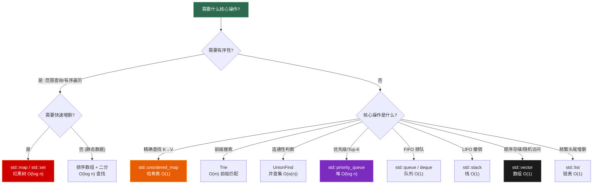
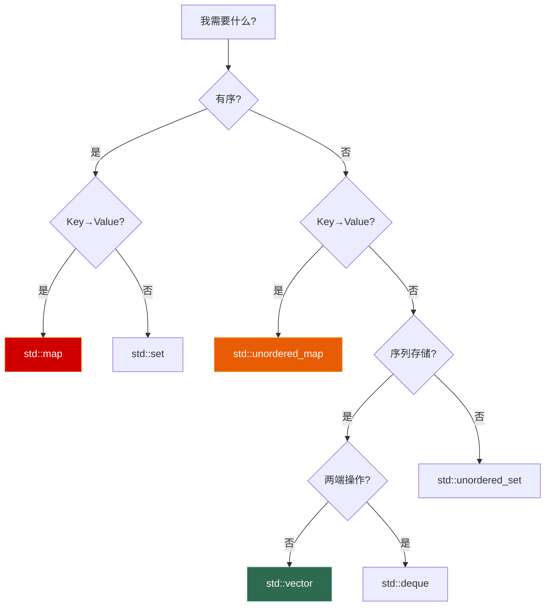
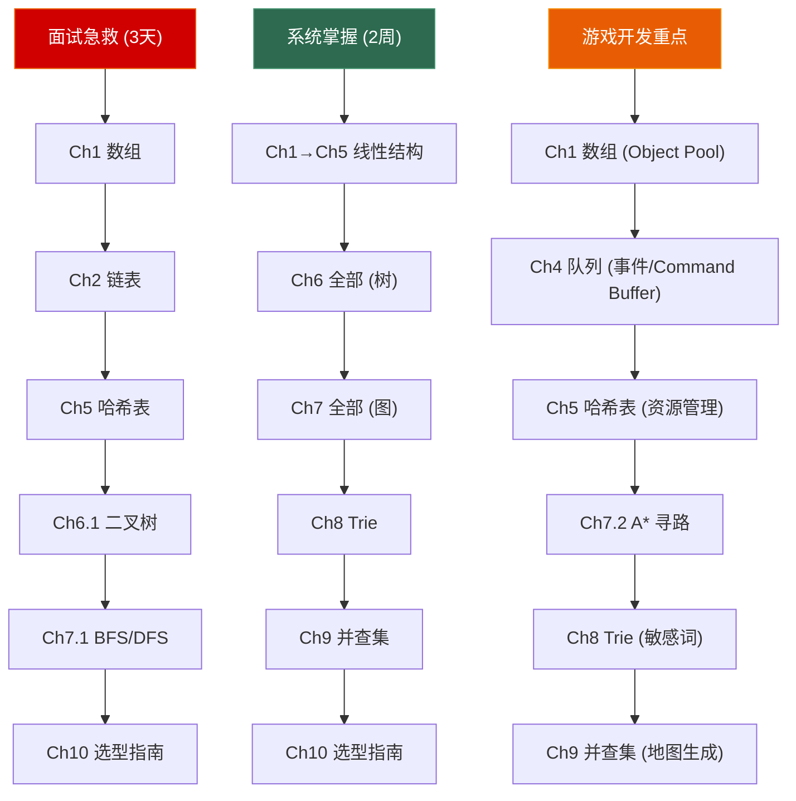

# 第十章 数据结构选型指南

> **一句话理解**：数据结构面试的终极问题不是"你会不会写红黑树"，而是"**面对这个需求，你该选什么结构、为什么？**"。本章把前九章串成一张全景图，给你一套系统化的选型方法论。

---

## 10.1 全局对比表 —— 九大数据结构横评

### 复杂度总览

| 数据结构 | 随机访问 | 查找 | 插入 | 删除 | 有序 | 前缀 | 核心场景 |
|----------|---------|------|------|------|------|------|---------|
| **数组** | **O(1)** | O(n) | O(n)* | O(n) | ❌ | ❌ | 连续存储、缓存友好 |
| **链表** | O(n) | O(n) | **O(1)**† | **O(1)**† | ❌ | ❌ | 频繁增删、LRU |
| **栈** | ❌ | ❌ | **O(1)** | **O(1)** | ❌ | ❌ | LIFO、括号匹配、撤销 |
| **队列** | ❌ | ❌ | **O(1)** | **O(1)** | ❌ | ❌ | FIFO、BFS、事件系统 |
| **哈希表** | ❌ | **O(1)** | **O(1)** | **O(1)** | ❌ | ❌ | 精确查找、计数 |
| **BST/红黑树** | ❌ | O(log n) | O(log n) | O(log n) | **✅** | ❌ | 有序查找、范围查询 |
| **堆** | ❌ | O(n) | O(log n) | O(log n) | 部分 | ❌ | Top-K、优先级 |
| **Trie** | ❌ | O(m) | O(m) | O(m) | ✅ | **✅** | 前缀搜索、补全 |
| **并查集** | ❌ | ❌ | ❌ | ❌ | ❌ | ❌ | 连通性、合并 |

> `*` 尾部插入均摊 O(1)　`†` 已知位置时 O(1)　`m` = 字符串长度

### 内存 & 缓存友好性

| 数据结构 | 内存布局 | 缓存友好 | 每元素额外开销 | 适合数据量 |
|----------|---------|---------|--------------|-----------|
| **数组 / vector** | **连续** | **★★★★★** | 0（均摊）| 任意 |
| **链表 / list** | 离散 | ★☆☆☆☆ | 2 指针 (~16B) | 小~中 |
| **deque** | 分段连续 | ★★★☆☆ | 少量 | 中~大 |
| **unordered_map** | 桶+链表 | ★★☆☆☆ | 哈希+指针+桶 | 任意 |
| **map / set** | 红黑树 | ★★☆☆☆ | 3 指针+颜色 (~40B) | 中~大 |
| **priority_queue** | **连续**(vector) | **★★★★★** | 0 | 任意 |
| **Trie** | 树形指针 | ★☆☆☆☆ | 26 指针/节点 | 字符串集 |
| **并查集** | **连续**(数组) | **★★★★★** | 1~2 int | 任意 |

> 💡 **缓存友好性为什么重要？** 现代 CPU 的 L1 缓存访问 ~1ns，主存访问 ~100ns——差 100 倍。连续内存布局（数组、堆、并查集）能利用 CPU 预取机制，实际性能远超理论复杂度相同但内存离散的结构（链表、红黑树）。

### 线程安全性

| 数据结构 | STL 线程安全 | 常见并发方案 |
|----------|------------|------------|
| **vector** | 读并发安全，写不安全 | 分段锁 / 无锁 ring buffer |
| **unordered_map** | 不安全 | `tbb::concurrent_hash_map` / 分片锁 |
| **map** | 不安全 | 读写锁 / ConcurrentSkipList |
| **queue** | 不安全 | 无锁队列 (MPSC/SPSC) |
| **priority_queue** | 不安全 | 并发跳表 / 分段堆 |

> 面试中"线程安全的数据结构"通常不要求手写，但要能说出方案。

---

## 10.2 选型决策树

### 核心决策流程



### 更细致的选型场景

```
场景 → 结构:

"我需要根据 key 快速查 value"
  → 无序? → unordered_map (O(1))
  → 有序? → map (O(log n))

"我需要判断元素是否存在"
  → 无序? → unordered_set (O(1))
  → 有序? → set (O(log n))

"我需要按优先级取元素"
  → 只需最大/最小? → priority_queue (O(log n))
  → 需要修改优先级? → 手写堆 / std::set 模拟

"我需要维护一个滑动窗口的最值"
  → 单调队列 (deque) (O(1) 每次)

"我需要频繁在中间插入/删除"
  → 已知位置? → list (O(1))
  → 需要查找? → 跳表或平衡树 (O(log n))

"我需要后进先出"
  → stack

"我需要先进先出"
  → queue

"我需要两端都能操作"
  → deque

"我需要判断两个东西是否在同一组"
  → 并查集 (O(α(n)) ≈ O(1))

"我需要前缀搜索/自动补全"
  → Trie (O(m))

"我需要最短路径"
  → 无权图? → BFS
  → 有权图? → Dijkstra / A*
  → 有负权? → Bellman-Ford

"我需要连通所有节点"
  → MST: Kruskal / Prim

"我需要依赖排序"
  → 拓扑排序 (Kahn / DFS)
```

---

## 10.3 🎮 游戏场景 → 数据结构映射

### 速查表

| 游戏系统 | 推荐数据结构 | 理由 | 章节 |
|----------|------------|------|------|
| **背包系统** | `vector` + `unordered_map` | 物品列表(数组) + ID查找(哈希) | Ch1, Ch5 |
| **渲染 Command Buffer** | 环形缓冲区 (`ring buffer`) | 固定大小、FIFO、无分配 | Ch1 |
| **Object Pool** | `vector` + free list | 连续内存、缓存友好、O(1) 分配 | Ch1, Ch2 |
| **UI 页面栈** | `stack` | push 打开、pop 关闭、LIFO 语义 | Ch3 |
| **Undo/Redo** | 双栈 (Command Pattern) | undo 栈 + redo 栈 | Ch3 |
| **事件系统** | `queue` / ring buffer | 发布者入队、消费者出队 | Ch4 |
| **AI 行为队列** | `queue` | 按顺序执行 AI 动作 | Ch4 |
| **A\* Open List** | `priority_queue` | 最小 f(n) 优先出队 | Ch4, Ch7 |
| **定时器管理** | 最小堆 (`priority_queue`) | 最近触发的定时器先处理 | Ch6d |
| **资源管理器** | `unordered_map<path, handle>` | 路径→资源句柄 O(1) 查找 | Ch5 |
| **Spatial Hashing** | `unordered_map<cell, entities>` | 空间分区碰撞检测 | Ch5 |
| **配置表热加载** | `unordered_map` + 版本号 | 运行时替换配置 | Ch5 |
| **LRU Cache** | `unordered_map` + `list` | O(1) 查找 + O(1) 淘汰 | Ch2, Ch5 |
| **骨骼动画** | 树 (N叉树) | 父子关系、递归变换 | Ch6a |
| **排行榜** | BST / 线段树 | 有序排名、范围查询 | Ch6b, Ch6e |
| **区间伤害统计** | 线段树 / 树状数组 | 区间修改+查询 | Ch6e |
| **NavMesh 寻路** | 图 + A\* | 多边形导航网格 | Ch7 |
| **地图生成** | MST (Kruskal) | 保证房间连通 | Ch7, Ch9 |
| **技能树** | DAG + 拓扑排序 | 前置依赖解锁 | Ch7 |
| **资源加载** | DAG + 拓扑分层 | 并行加载依赖 | Ch7 |
| **敏感词过滤** | Trie / AC 自动机 | 多模式前缀匹配 | Ch8 |
| **命令补全** | Trie | /tp → /teleport | Ch8 |
| **公会合并** | 并查集 | O(α(n)) 合并+查询 | Ch9 |
| **地图连通性** | 并查集 / BFS | 验证全部可达 | Ch9 |

### 进阶系统选型详解

#### ECS (Entity Component System) 架构

```
ECS 是现代游戏引擎 (Unity DOTS, Bevy, EnTT) 的核心架构，
数据结构选型直接决定性能:

  Entity:   纯 ID (int)         → 数组下标或稀疏集合
  Component: 纯数据 (POD)       → SoA 数组 (第 1 章)
  System:   纯逻辑 (函数)       → 遍历 Component 数组

关键数据结构:
  ┌──────────────────────────────────────┐
  │ Entity → Component 映射              │
  │   方案 A: 稀疏集合 (Sparse Set)       │
  │     → O(1) 查/增/删, 遍历连续        │
  │   方案 B: unordered_map<Entity, Idx>  │
  │     → 简单但遍历不连续               │
  │   方案 C: Archetype 表               │
  │     → 同类型组合的实体打包存储        │
  │     → Unity DOTS / Flecs 的做法      │
  └──────────────────────────────────────┘

  Component 存储: SoA 数组 (Ch1)
    Position:  [x0, x1, x2, ...] [y0, y1, y2, ...]
    Velocity:  [vx0, vx1, ...]   [vy0, vy1, ...]
    → SIMD 向量化友好, cache 命中率极高

  System 调度: DAG + 拓扑排序 (Ch7)
    PhysicsSystem 必须在 RenderSystem 之前
    InputSystem 必须在 MovementSystem 之前
    → 拓扑排序决定 System 执行顺序
```

#### 物理引擎

```
碰撞检测的两阶段:

  Broad Phase (粗筛): 快速排除不可能碰撞的物体对
    → Spatial Hashing: unordered_map<cell, vector<Entity>> (Ch5)
    → Sort and Sweep: 排序数组 + 扫描线 (Ch1)
    → BVH 树: 层级包围盒 (树结构, Ch6)
    → 四叉树/八叉树: 空间递归划分 (N 叉树, Ch6)

  Narrow Phase (精筛): 精确判断几何体碰撞
    → 纯数学计算, 不依赖特殊数据结构

  碰撞事件分发:
    → 事件队列 (Ch4): 碰撞事件入队, 物理帧统一处理
    → 回调注册: unordered_map<pair<TypeA,TypeB>, callback> (Ch5)

  约束求解 (关节、铰链):
    → 图结构 (Ch7): 刚体=节点, 关节=边
    → 迭代求解器遍历约束图
```

#### 网络同步

```
多人游戏的网络架构大量依赖数据结构:

  输入缓冲: 环形缓冲区 (Ch1)
    → 存储最近 N 帧的输入, 支持回滚
    → GGPO rollback netcode 的核心

  快照系统: vector<EntityState> + 哈希表
    → 每个 tick 的完整世界状态 (数组)
    → entity_id → 状态映射 (哈希表)
    → Delta 压缩: 只发送变化的部分

  优先级消息队列: priority_queue (Ch4/Ch6d)
    → 带宽有限时, 高优先级消息先发
    → 如: 玩家血量变化 > 远处NPC移动

  兴趣管理 (Area of Interest):
    → Spatial Hashing (Ch5): 只同步玩家附近的实体
    → 格子划分: unordered_map<cell, set<player>>

  实体同步表:
    → unordered_map<entity_id, NetworkState> (Ch5)
    → 记录每个实体的同步状态 (已确认帧号、预测状态)

  延迟补偿:
    → 历史位置缓冲: 环形缓冲区 (Ch1)
    → 按时间戳二分查找: 排序数组 + lower_bound (Ch1)
```

#### 程序化生成

```
Roguelike / 开放世界的过程生成:

  BSP 地图切割: 二叉树 (Ch6)
    → 递归二分空间, 每个叶子是一个房间

  房间连通: 并查集 + MST (Ch9, Ch7)
    → Kruskal 按距离选走廊, 并查集判连通

  地形高度图: 二维数组 (Ch1)
    → Perlin Noise 填充, GPU 采样

  物品掉落表: 加权随机
    → 排序数组 + 前缀和 + 二分查找 (Ch1)
    → 权重累积后 lower_bound 选中

  Chunk 管理: unordered_map<ChunkCoord, Chunk> (Ch5)
    → Minecraft 风格: 按坐标哈希加载/卸载 Chunk
```

#### 音频系统

```
  混音通道管理: priority_queue (Ch4)
    → 通道数有限 (如 32 个), 高优先级声音抢占低优先级
    → 类似 Top-K 问题

  音频资源缓存: LRU Cache (Ch2 + Ch5)
    → 最近播放的音频留在内存, 不常用的淘汰

  事件驱动播放: 事件队列 (Ch4)
    → 游戏逻辑线程发事件, 音频线程消费
```

### 常见组合套路

实际工程中，很少单独使用一种数据结构。**经典组合**才是面试和工程的核心：

| 组合 | 数据结构 | 效果 | 经典题 |
|------|---------|------|--------|
| **LRU Cache** | `哈希表 + 双向链表` | O(1) 查找 + O(1) 淘汰 | LC 146 |
| **A\* 寻路** | `图 + 优先队列 + 哈希表` | 启发式最短路径 | 游戏寻路 |
| **AC 自动机** | `Trie + BFS (失败指针)` | O(n) 多模式匹配 | 敏感词过滤 |
| **Kruskal MST** | `排序 + 并查集` | O(E log E) 最小生成树 | LC 1584 |
| **Top-K 流式** | `堆 + 哈希表` | O(n log k) 动态 Top-K | LC 347 |
| **滑动窗口最值** | `单调队列 (deque)` | O(1) 窗口最大值 | LC 239 |
| **数据流中位数** | `对顶堆 (大+小)` | O(log n) 动态中位数 | LC 295 |
| **前缀匹配+DFS** | `Trie + 回溯` | 网格单词搜索 | LC 212 |
| **拓扑排序+层序** | `DAG + BFS 分层` | 并行调度/关键路径 | LC 1136 |
| **区间更新+查询** | `线段树 + 懒传播` | O(log n) 区间操作 | LC 307 |

---

## 10.4 LRU Cache 深度拆解 —— 组合的典范

LRU Cache 是面试中"数据结构组合"的标杆题目（LC 146），完美展示了如何将两种结构组合以获得最优性能：

```
需求分析:
  get(key)    → O(1) 查找    → 需要哈希表
  put(key,v)  → O(1) 插入    → 需要哈希表
  淘汰最久未使用 → O(1) 删除最老 → 需要有序结构
  访问时更新位置 → O(1) 移动  → 需要链表

  单独的哈希表: ❌ 无法知道"最久未使用"
  单独的链表:   ❌ 查找 O(n)
  组合: 哈希表 + 双向链表 → 两全其美!

结构:
  ┌─────────────────────────────────┐
  │  HashMap<Key, ListNode*>        │  ← O(1) 查找
  │    "a" → node_a                 │
  │    "b" → node_b                 │
  │    "c" → node_c                 │
  └─────────────────────────────────┘
                  ↕
  HEAD ↔ [c] ↔ [b] ↔ [a] ↔ TAIL    ← O(1) 增删移动
         最近     ←→      最久       ← 淘汰 TAIL 前面的
```

```cpp
#include <unordered_map>
#include <list>

class LRUCache {
    int _capacity;
    std::list<std::pair<int,int>> _list;  // {key, value}, 头=最新, 尾=最老
    std::unordered_map<int, std::list<std::pair<int,int>>::iterator> _map;

public:
    LRUCache(int capacity) : _capacity(capacity) {}

    int get(int key) {
        auto it = _map.find(key);
        if (it == _map.end()) return -1;

        // 移到链表头部 (最近使用)
        _list.splice(_list.begin(), _list, it->second);
        return it->second->second;
    }

    void put(int key, int value) {
        auto it = _map.find(key);

        if (it != _map.end()) {
            // 已存在: 更新值, 移到头部
            it->second->second = value;
            _list.splice(_list.begin(), _list, it->second);
            return;
        }

        // 不存在: 如果满了, 淘汰尾部
        if (static_cast<int>(_map.size()) >= _capacity) {
            auto& back = _list.back();
            _map.erase(back.first);
            _list.pop_back();
        }

        // 插入头部
        _list.emplace_front(key, value);
        _map[key] = _list.begin();
    }
};
// get O(1), put O(1), 空间 O(capacity)
```

> 💡 **面试要点**：`std::list::splice` 是 O(1) 的链表节点移动操作，不涉及内存分配/释放。这是 STL 提供的"移动节点"利器。

---

## 10.5 面试结构化答题模板

### 30 秒选型框架

面试中被问"这个问题用什么数据结构？"时，用以下三步框架：

```
Step 1: 分析核心操作
  "这个问题的核心操作是 _____"
  (查找? 插入? 排序? 连通性? 前缀匹配? 最值?)

Step 2: 确定复杂度需求
  "我需要这个操作在 _____ 时间内完成"
  (O(1)? O(log n)? O(n) 可以接受?)

Step 3: 选择结构
  "所以我选择 _____，因为它能在 _____ 时间完成 _____"
  (数据结构名 + 复杂度 + 操作名)
```

### 实战示例

```
Q: "设计一个系统，支持 O(1) 插入随机数和 O(1) 获取随机元素。"

A: (Step 1) 核心操作: 插入 + 随机访问
   (Step 2) 需要 O(1)
   (Step 3) 随机访问 O(1) → 需要数组 (vector)
            插入 O(1) → 尾部追加
            但如果需要 O(1) 删除呢? → 哈希表记录下标, 交换到末尾再 pop_back

   最终方案: vector + unordered_map<val, index>
   (这就是 LC 380 的标准答案)
```

```
Q: "设计一个排行榜，支持更新分数和查询排名。"

A: (Step 1) 核心操作: 精确查找(按 ID) + 有序排名
   (Step 2) 查找 O(1), 排名 O(log n)
   (Step 3) 精确查找 → 哈希表 (ID → 分数)
            有序排名 → 平衡 BST (std::set) 或线段树
            
   最终方案: unordered_map<id, score> + std::set<{score, id}>
   更新: 哈希表改分数 + set 删旧插新 → O(log n)
   查排名: set::order_of_key 或线段树区间查询 → O(log n)
```

```
Q: "判断一个图中是否有环。"

A: (Step 1) 核心操作: 环检测
   (Step 2) O(V+E) 可以接受
   (Step 3) 有向图 → DFS 三色标记 (7.1 已讲)
            无向图 → 并查集 (加边时判连通) 或 DFS

   关键追问: "有向还是无向?"
   有向用 DFS 三色, 无向用并查集更快
```

### 高频选型面试题

| 问题 | 核心操作 | 推荐结构 | 理由 |
|------|---------|---------|------|
| "O(1) 查找 + O(1) 淘汰" | 查找 + 顺序维护 | 哈希表 + 双向链表 | LRU Cache |
| "动态中位数" | 插入 + 求中间值 | 对顶堆 (大+小) | O(log n) 平衡两堆 |
| "前 K 大元素" | 部分排序 | 小顶堆 size=K | 淘汰最小的 |
| "自动补全" | 前缀搜索 | Trie | O(m) 前缀匹配 |
| "区间求和 + 单点修改" | 区间聚合 | 树状数组/线段树 | O(log n) |
| "两数之和" | 精确查找 | 哈希表 | O(1) 查配对 |
| "有序交集" | 有序 + 合并 | 双指针/归并 | O(n+m) |
| "任务依赖排序" | 有向图排序 | 拓扑排序 (Kahn) | O(V+E) |
| "动态连通性" | 合并 + 查询 | 并查集 | O(α(n)) |
| "最短路径" | 加权图搜索 | Dijkstra / A\* | O((V+E)logV) |

---

## 10.6 STL 容器一页速查

### 序列容器

```cpp
// ===== std::vector =====
#include <vector>
std::vector<int> v = {1, 2, 3};
v.push_back(4);          // 尾部追加 O(1) 均摊
v.pop_back();             // 尾部删除 O(1)
v[2];                     // 随机访问 O(1)
v.insert(v.begin(), 0);  // 头部插入 O(n) ← 慢!
v.erase(v.begin());      // 头部删除 O(n)
v.size(); v.empty();      // O(1)
v.reserve(1000);          // 预分配, 避免多次扩容
v.shrink_to_fit();        // 释放多余内存

// ===== std::deque =====
#include <deque>
std::deque<int> dq;
dq.push_front(1);        // 头部插入 O(1)
dq.push_back(2);          // 尾部插入 O(1)
dq.pop_front();           // 头部删除 O(1)
dq[0];                    // 随机访问 O(1) (但常数比 vector 大)

// ===== std::list =====
#include <list>
std::list<int> lst = {1, 2, 3};
lst.push_front(0);        // 头部插入 O(1)
lst.push_back(4);         // 尾部插入 O(1)
auto it = lst.begin();
lst.insert(it, 99);       // 任意位置插入 O(1)
lst.erase(it);            // 任意位置删除 O(1)
lst.splice(lst.begin(), lst, it);  // 移动节点 O(1)
// ❌ lst[0] → 不支持随机访问!

// ===== std::array =====
#include <array>
std::array<int, 5> arr = {1, 2, 3, 4, 5};  // 固定大小, 栈上
arr[2];                   // O(1), 和原生数组一样快
arr.size();               // 编译期常量, O(1)
```

### 关联容器

```cpp
// ===== std::map / std::set (红黑树, 有序) =====
#include <map>
#include <set>
std::map<std::string, int> m;
m["hello"] = 42;                     // 插入/更新 O(log n)
m.find("hello");                      // 查找 O(log n)
m.erase("hello");                     // 删除 O(log n)
m.lower_bound("h"); m.upper_bound("i"); // 范围查询 O(log n)
for (auto& [k, v] : m) { /* 有序遍历 */ }

std::set<int> s = {3, 1, 4, 1, 5};   // {1, 3, 4, 5} 自动排序去重

// ===== std::unordered_map / std::unordered_set (哈希, 无序) =====
#include <unordered_map>
#include <unordered_set>
std::unordered_map<std::string, int> um;
um["hello"] = 42;                     // 插入/更新 O(1) 均摊
um.find("hello");                      // 查找 O(1)
um.count("hello");                     // 0 或 1, O(1)
um.erase("hello");                     // 删除 O(1)
um.reserve(10000);                     // 预分配桶, 避免 rehash
// ❌ 不支持有序遍历和范围查询!

// ===== std::multimap / std::multiset (允许重复 key) =====
std::multiset<int> ms = {1, 1, 2, 3, 3, 3};
ms.count(3);  // 3
```

### 容器适配器

```cpp
// ===== std::stack =====
#include <stack>
std::stack<int> stk;      // 底层默认 deque
stk.push(1);              // 入栈 O(1)
stk.top();                // 查看栈顶 O(1)
stk.pop();                // 出栈 O(1)

// ===== std::queue =====
#include <queue>
std::queue<int> q;        // 底层默认 deque
q.push(1);                // 入队 O(1)
q.front();                // 查看队头 O(1)
q.pop();                  // 出队 O(1)

// ===== std::priority_queue =====
#include <queue>
// 最大堆 (默认)
std::priority_queue<int> max_pq;
max_pq.push(3); max_pq.push(1); max_pq.push(4);
max_pq.top();   // 4 (最大值)

// 最小堆
std::priority_queue<int, std::vector<int>, std::greater<int>> min_pq;
min_pq.push(3); min_pq.push(1); min_pq.push(4);
min_pq.top();   // 1 (最小值)

// 自定义比较
auto cmp = [](const auto& a, const auto& b) { return a.cost > b.cost; };
std::priority_queue<Node, std::vector<Node>, decltype(cmp)> pq(cmp);
```

### STL 选型速查



---

## 10.7 通用场景选型

### 后端 / 服务端

| 场景 | 数据结构 | 理由 |
|------|---------|------|
| **缓存** | LRU (哈希+链表) / Redis | O(1) 查找 + O(1) 淘汰 |
| **消息队列** | 环形缓冲区 / Kafka | FIFO、高吞吐量 |
| **索引** | B+ 树 / 哈希索引 | 磁盘友好 / 精确查找 |
| **路由表** | Radix Tree (压缩 Trie) | 最长前缀匹配 |
| **限流器** | 滑动窗口 (deque) / 令牌桶 | O(1) 判断是否限流 |
| **分布式 ID** | 跳表 (Skip List) | 有序 + 并发友好 |

### 工具链 / 编译器

| 场景 | 数据结构 | 理由 |
|------|---------|------|
| **语法分析** | 栈 (括号匹配、表达式求值) | LIFO 天然适配递归结构 |
| **符号表** | 哈希表 (变量名→类型) | O(1) 查找变量定义 |
| **依赖分析** | DAG + 拓扑排序 | 编译顺序、死代码消除 |
| **正则引擎** | Trie / NFA / DFA | 模式匹配 |

### 嵌入式 / 性能敏感

| 场景 | 数据结构 | 理由 |
|------|---------|------|
| **定时器** | 最小堆 / 时间轮 | 最近触发优先 |
| **内存池** | Free List (侵入式链表) | 零分配、O(1) 分配回收 |
| **Ring Buffer** | 固定数组 + 双指针 | 零分配、缓存友好 |
| **实时系统** | 数组 > 链表 | 缓存友好、确定性延迟 |

---

## 10.8 面试中的"反选型"—— 什么时候不用

知道"该用什么"很重要，知道"不该用什么"同样重要：

| 不要用 | 当 | 理由 |
|--------|-----|------|
| **链表** | 需要随机访问或数据量大 | O(n) 查找、缓存不友好 |
| **哈希表** | 需要有序遍历/范围查询 | 哈希破坏了顺序 |
| **红黑树 (map)** | 只需要精确查找 | O(log n) 比 O(1) 慢 |
| **Trie** | 只需要精确匹配、无前缀需求 | 内存开销太大 |
| **并查集** | 需要拆分集合/删除元素 | 只支持合并不支持拆分 |
| **线段树** | 只需要前缀和(静态) | 前缀和数组 O(1) 足够 |
| **Stack/Queue** | 需要随机访问中间元素 | 只能访问端点 |
| **vector** | 频繁在头部插入 | 每次 O(n) 搬运 |
| **Dijkstra** | 有负权边 | 贪心假设被打破 |
| **Floyd** | V > 1000 | O(V³) 太慢 |

---

## 10.9 全系列章节导航

```
数据结构面试突击系列 · 全 17 篇

基础线性结构:
  ├── 第 1 章  数组             ← 连续内存、vector 底层、滑动窗口
  ├── 第 2 章  链表             ← 指针操作、反转、LRU Cache
  ├── 第 3 章  栈               ← LIFO、单调栈、括号匹配
  ├── 第 4 章  队列与优先队列   ← FIFO、BFS、滑动窗口最值
  └── 第 5 章  哈希表           ← O(1) 查找、冲突解决、Robin Hood

树家族 (5 篇):
  ├── 6.1  二叉树基础与遍历    ← 四种遍历、Morris、面试高频
  ├── 6.2  二叉搜索树          ← BST 性质、插删查、退化分析
  ├── 6.3  平衡树 AVL & 红黑树 ← 旋转、map/set 底层
  ├── 6.4  堆                  ← 优先队列、Top-K、堆排序
  └── 6.5  线段树 & 树状数组   ← 区间操作、懒传播

图家族 (3 篇):
  ├── 7.1  图的表示与遍历      ← BFS/DFS、连通分量、环检测
  ├── 7.2  最短路径             ← Dijkstra/Bellman-Ford/Floyd/A*
  └── 7.3  MST & 拓扑排序      ← Kruskal/Prim、Kahn/DFS 拓扑

高级结构:
  ├── 第 8 章  字典树           ← Trie、前缀搜索、AC 自动机
  └── 第 9 章  并查集           ← 路径压缩、按秩合并、α(n)

总结:
  └── 第 10 章 选型指南         ← 你在这里 ★
```

### 推荐阅读路线



---

## 10.10 本章小结 —— 也是全系列总结

### 一张表记住所有

| 结构 | 一句话 | 面试必杀技 |
|------|--------|-----------|
| **数组** | 连续内存，O(1) 随机访问 | 双指针、滑动窗口、前缀和 |
| **链表** | 指针串联，O(1) 已知位置增删 | 反转链表、快慢指针、LRU |
| **栈** | LIFO，后进先出 | 括号匹配、单调栈、递归改迭代 |
| **队列** | FIFO，先进先出 | BFS、滑动窗口最值、事件系统 |
| **哈希表** | O(1) 精确查找 | 两数之和、字母异位词、LRU |
| **BST/红黑树** | O(log n) 有序操作 | 范围查询、排名、map/set |
| **堆** | O(log n) 取最值 | Top-K、合并K链表、中位数 |
| **线段树** | O(log n) 区间操作 | 区间和、区间最值、懒传播 |
| **图 + BFS/DFS** | 遍历关系网络 | 岛屿数量、课程表、克隆图 |
| **Dijkstra/A\*** | 加权最短路径 | 网络延迟、游戏寻路 |
| **MST** | 最小代价连通 | 连接城市、地图生成 |
| **拓扑排序** | DAG 依赖排序 | 课程表 II、编译顺序 |
| **Trie** | O(m) 前缀搜索 | Trie 实现、单词搜索 II |
| **并查集** | ≈O(1) 合并 + 连通 | 冗余连接、等式方程、Kruskal |

### 面试终极速答

> **Q：面对一个新问题，你怎么选数据结构？**
>
> A：三步法。**(1) 识别核心操作**——这个问题最频繁的操作是什么？精确查找？排序？连通性？前缀匹配？**(2) 确定复杂度需求**——需要 O(1)、O(log n) 还是 O(n) 可以接受？**(3) 映射到数据结构**——O(1) 查找 → 哈希表，有序 → 红黑树/排序数组，前缀 → Trie，连通 → 并查集，最值 → 堆。如果单一结构不够，考虑组合——比如 LRU = 哈希表 + 链表，A\* = 图 + 优先队列。

---

> 📖 上一章：[第九章 并查集：找老大](../09_union_find)
>
> 🎉 **全系列完结！** 17 篇、9 大数据结构、100+ 面试题、游戏实战场景全覆盖。祝面试顺利！
