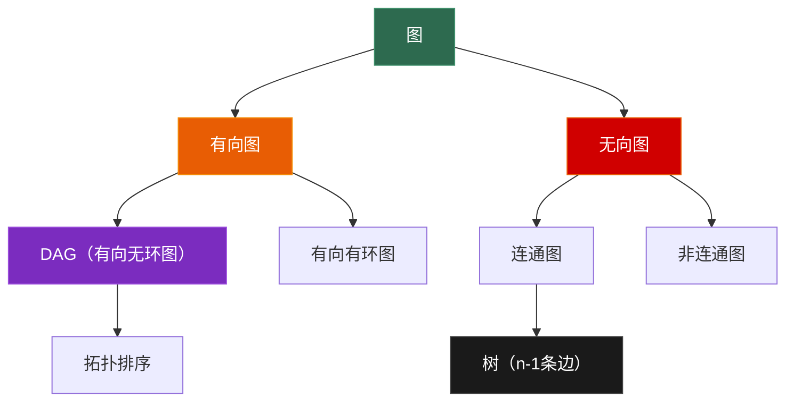

# 7.1 图的表示与遍历

> **一句话理解**：图由**顶点 (Vertex)** 和**边 (Edge)** 组成，是所有数据结构中最通用的——数组、链表、树都是图的特殊形态。掌握图的两种存储方式和两种遍历算法（BFS / DFS），是所有图算法的基础。

---

## 7.1.1 基本术语

```
图 G = (V, E)
  V = 顶点集合 {v₀, v₁, ..., vₙ₋₁}
  E = 边集合 {(vᵢ, vⱼ), ...}

  |V| = n（顶点数）
  |E| = m（边数）
```

| 术语 | 定义 | 说明 |
|------|------|------|
| **有向图** | 边有方向：(u→v) ≠ (v→u) | 微博关注（A 关注 B ≠ B 关注 A）|
| **无向图** | 边无方向：(u,v) = (v,u) | 微信好友（双向对等）|
| **加权图** | 边带权重：(u,v,w) | 地图路程（路段有距离）|
| **度 (Degree)** | 与节点相连的边数 | 无向图：degree(v)；有向图：入度 + 出度 |
| **入度 / 出度** | 有向图中，指向 v 的边数 / 从 v 出发的边数 | 拓扑排序的基础 |
| **路径** | 从 u 到 v 的顶点序列 | 路径长度 = 边数（无权）或权重之和（加权）|
| **环 (Cycle)** | 起点 = 终点的路径 | 无环有向图 = DAG |
| **连通图** | 任意两点之间存在路径 | 无向图概念 |
| **连通分量** | 最大连通子图 | 一个图可以有多个连通分量 |
| **稀疏图** | m ≈ n | 用邻接表 |
| **稠密图** | m ≈ n² | 用邻接矩阵 |

### 图的分类全景



> 💡 **树是图的特例**：n 个节点、n-1 条边、无环、连通。这四个条件中任意三个成立，第四个自动成立。

---

## 7.1.2 图的存储

### 邻接矩阵 (Adjacency Matrix)

用 n×n 的矩阵存边。`matrix[i][j] = 1`（或权重）表示 i→j 有边。

```
无向图：                邻接矩阵：
  0 --- 1               0  1  2  3
  |   / |           0 [ 0  1  1  0 ]
  |  /  |           1 [ 1  0  1  1 ]
  2 --- 3           2 [ 1  1  0  1 ]
                    3 [ 0  1  1  0 ]

特点：对称矩阵（无向图）
```

```cpp
class AdjMatrix {
    int _n;
    std::vector<std::vector<int>> _mat;

public:
    AdjMatrix(int n) : _n(n), _mat(n, std::vector<int>(n, 0)) {}

    void add_edge(int u, int v, int w = 1) {
        _mat[u][v] = w;
        _mat[v][u] = w;  // 无向图；有向图去掉这行
    }

    bool has_edge(int u, int v) const { return _mat[u][v] != 0; }

    // 获取 u 的所有邻居
    std::vector<int> neighbors(int u) const {
        std::vector<int> result;
        for (int v = 0; v < _n; ++v) {
            if (_mat[u][v]) result.push_back(v);
        }
        return result;
    }

    int vertex_count() const { return _n; }
};
```

### 邻接表 (Adjacency List)

每个顶点维护一个邻居列表。

```
无向图：                邻接表：
  0 --- 1           0 → [1, 2]
  |   / |           1 → [0, 2, 3]
  |  /  |           2 → [0, 1, 3]
  2 --- 3           3 → [1, 2]
```

```cpp
class AdjList {
    int _n;
    std::vector<std::vector<std::pair<int, int>>> _adj;  // {neighbor, weight}

public:
    AdjList(int n) : _n(n), _adj(n) {}

    void add_edge(int u, int v, int w = 1) {
        _adj[u].push_back({v, w});
        _adj[v].push_back({u, w});  // 无向图
    }

    const std::vector<std::pair<int, int>>& neighbors(int u) const {
        return _adj[u];
    }

    int vertex_count() const { return _n; }
};
```

### 存储方式对比

| 维度 | 邻接矩阵 | 邻接表 |
|------|---------|--------|
| 空间 | O(n²) | **O(n + m)** |
| 判断 u→v 有边 | **O(1)** | O(degree(u)) |
| 遍历 u 的邻居 | O(n) | **O(degree(u))** |
| 添加边 | O(1) | O(1) |
| 删除边 | O(1) | O(degree(u)) |
| 适用场景 | **稠密图**（m ≈ n²）| **稀疏图**（m ≈ n）|
| 实际选择 | Floyd 全源最短路 | **绝大多数场景** |

> 💡 **面试默认用邻接表**。因为大部分图题都是稀疏图（n ≤ 10⁵，m ≤ 几n），邻接矩阵 O(n²) 的空间开销太大。

### 隐式图 —— 面试中最常见的图

面试中很多题**不显式给你图**，图藏在题目条件里：

```
网格/矩阵：每个格子是节点，上下左右是边
  → 岛屿数量 (LC 200)
  → 腐烂的橘子 (LC 994)
  → 太平洋大西洋水流 (LC 417)

字符串变换：每个字符串是节点，一步变换是边
  → 单词接龙 (LC 127)

状态空间：每个状态是节点，合法操作是边
  → 打开转盘锁 (LC 752)
```

---

## 7.1.3 广度优先搜索 (BFS)

### 核心思想

BFS 像**水波扩散**——从起点开始，先访问所有距离为 1 的节点，再访问距离为 2 的，以此类推。

```
BFS 从节点 0 开始：

    0      层 0: [0]
   / \
  1   2    层 1: [1, 2]
 / \   \
3   4   5  层 2: [3, 4, 5]

访问顺序: 0 → 1 → 2 → 3 → 4 → 5
```

### C++ 实现

```cpp
#include <vector>
#include <queue>

// 基础 BFS —— 从 start 出发遍历所有可达节点
std::vector<int> bfs(const std::vector<std::vector<int>>& graph, int start) {
    int n = graph.size();
    std::vector<bool> visited(n, false);
    std::vector<int> order;
    std::queue<int> q;

    visited[start] = true;
    q.push(start);

    while (!q.empty()) {
        int u = q.front();
        q.pop();
        order.push_back(u);

        for (int v : graph[u]) {
            if (!visited[v]) {
                visited[v] = true;
                q.push(v);
            }
        }
    }

    return order;
}

// BFS 求最短距离（无权图）
std::vector<int> bfs_distance(const std::vector<std::vector<int>>& graph, int start) {
    int n = graph.size();
    std::vector<int> dist(n, -1);  // -1 = 不可达
    std::queue<int> q;

    dist[start] = 0;
    q.push(start);

    while (!q.empty()) {
        int u = q.front();
        q.pop();

        for (int v : graph[u]) {
            if (dist[v] == -1) {
                dist[v] = dist[u] + 1;
                q.push(v);
            }
        }
    }

    return dist;
}
```

### BFS 的特性

| 特性 | 说明 |
|------|------|
| 时间 | O(V + E) |
| 空间 | O(V)（visited 数组 + 队列）|
| **无权最短路** | BFS 天然求出从起点到所有节点的**最短距离** |
| 层序遍历 | BFS 天然按层遍历（第 6 章已见）|
| 数据结构 | **队列**（FIFO）|

> 💡 **BFS = 无权图的 Dijkstra**。如果图的每条边权重都是 1，BFS 就等价于 Dijkstra——先到达的一定是最短距离。

---

## 7.1.4 深度优先搜索 (DFS)

### 核心思想

DFS 像**走迷宫**——沿着一条路走到死胡同，然后回退一步换条路。

```
DFS 从节点 0 开始（假设邻居按数字顺序）：

    0
   / \
  1   2
 / \   \
3   4   5

访问顺序: 0 → 1 → 3 → 4 → 2 → 5（先深入左子树）
```

### C++ 实现

```cpp
// DFS 递归版
void dfs_recursive(const std::vector<std::vector<int>>& graph,
                   int u, std::vector<bool>& visited, std::vector<int>& order) {
    visited[u] = true;
    order.push_back(u);

    for (int v : graph[u]) {
        if (!visited[v]) {
            dfs_recursive(graph, v, visited, order);
        }
    }
}

// DFS 迭代版（用栈）
std::vector<int> dfs_iterative(const std::vector<std::vector<int>>& graph, int start) {
    int n = graph.size();
    std::vector<bool> visited(n, false);
    std::vector<int> order;
    std::stack<int> stk;

    stk.push(start);

    while (!stk.empty()) {
        int u = stk.top();
        stk.pop();

        if (visited[u]) continue;
        visited[u] = true;
        order.push_back(u);

        // 逆序压栈，保证按顺序访问
        for (int i = graph[u].size() - 1; i >= 0; --i) {
            if (!visited[graph[u][i]]) {
                stk.push(graph[u][i]);
            }
        }
    }

    return order;
}
```

### DFS 的特性

| 特性 | 说明 |
|------|------|
| 时间 | O(V + E) |
| 空间 | O(V)（visited + 递归栈/显式栈）|
| 用途 | 连通分量、环检测、拓扑排序、路径搜索 |
| 数据结构 | **栈**（递归隐式栈 / 显式栈）|
| 缺点 | 不保证最短路径 |

### BFS vs DFS 对比

| 维度 | BFS | DFS |
|------|-----|-----|
| 数据结构 | 队列 | 栈 |
| 遍历顺序 | 按层（由近到远）| 按深度（一条路走到底）|
| **最短路径** | ✅ 无权图天然最短 | ❌ 不保证 |
| 连通分量 | ✅ | ✅ |
| **环检测** | ✅（有向图较复杂）| ✅（更常用）|
| 空间 | 最坏 O(n)（稠密层）| 最坏 O(n)（长链）|
| 面试选择 | 最短距离、层序问题 | 连通分量、路径、回溯 |

---

## 7.1.5 连通分量

### 无向图连通分量

```cpp
int countComponents(int n, const std::vector<std::vector<int>>& graph) {
    std::vector<bool> visited(n, false);
    int count = 0;

    for (int i = 0; i < n; ++i) {
        if (!visited[i]) {
            // 从 i 出发 DFS / BFS 标记所有可达节点
            _dfs(graph, i, visited);
            ++count;
        }
    }

    return count;
}

void _dfs(const std::vector<std::vector<int>>& graph,
           int u, std::vector<bool>& visited) {
    visited[u] = true;
    for (int v : graph[u]) {
        if (!visited[v]) _dfs(graph, v, visited);
    }
}
```

### 有向图环检测

```cpp
// 三色标记法：
// WHITE(0) = 未访问，GRAY(1) = 正在访问（在递归栈中），BLACK(2) = 已完成
bool hasCycle(int n, const std::vector<std::vector<int>>& graph) {
    std::vector<int> color(n, 0);  // 0=WHITE

    for (int i = 0; i < n; ++i) {
        if (color[i] == 0 && _dfs_cycle(graph, i, color)) {
            return true;
        }
    }
    return false;
}

bool _dfs_cycle(const std::vector<std::vector<int>>& graph,
                int u, std::vector<int>& color) {
    color[u] = 1;  // GRAY

    for (int v : graph[u]) {
        if (color[v] == 1) return true;  // 回边 → 有环！
        if (color[v] == 0 && _dfs_cycle(graph, v, color)) return true;
    }

    color[u] = 2;  // BLACK
    return false;
}
```

> 💡 **三色标记**：WHITE = 没看过，GRAY = 正在看（还在递归栈里），BLACK = 看完了。如果 DFS 过程中遇到 GRAY 节点，说明存在**回边**（从后代指向祖先），即有环。

---

## 7.1.6 面试高频题

### 岛屿数量 (LeetCode 200)

> 给定 '1'（陆地）和 '0'（水）组成的二维网格，计算岛屿数量。

```cpp
int numIslands(std::vector<std::vector<char>>& grid) {
    if (grid.empty()) return 0;
    int rows = grid.size(), cols = grid[0].size();
    int count = 0;

    for (int i = 0; i < rows; ++i) {
        for (int j = 0; j < cols; ++j) {
            if (grid[i][j] == '1') {
                ++count;
                _dfs_flood(grid, i, j);  // 洪水填充，标记整座岛
            }
        }
    }

    return count;
}

void _dfs_flood(std::vector<std::vector<char>>& grid, int i, int j) {
    if (i < 0 || i >= grid.size() || j < 0 || j >= grid[0].size()) return;
    if (grid[i][j] != '1') return;

    grid[i][j] = '0';  // 标记已访问（沉岛）

    _dfs_flood(grid, i + 1, j);
    _dfs_flood(grid, i - 1, j);
    _dfs_flood(grid, i, j + 1);
    _dfs_flood(grid, i, j - 1);
}
// 时间 O(m×n), 空间 O(m×n)（递归栈最坏）
```

> 💡 **网格 DFS 模板**：这道题是所有网格图问题的基础模板。关键：(1) 边界检查；(2) 标记已访问（防止重复）；(3) 向四个方向递归。

### 腐烂的橘子 (LeetCode 994)

> 每分钟，腐烂的橘子让相邻的新鲜橘子腐烂。求所有橘子都腐烂的最短时间。

```cpp
int orangesRotting(std::vector<std::vector<int>>& grid) {
    int rows = grid.size(), cols = grid[0].size();
    std::queue<std::pair<int,int>> q;
    int fresh = 0;

    // 1. 所有腐烂橘子入队（多源 BFS 起点）
    for (int i = 0; i < rows; ++i) {
        for (int j = 0; j < cols; ++j) {
            if (grid[i][j] == 2) q.push({i, j});
            else if (grid[i][j] == 1) ++fresh;
        }
    }

    if (fresh == 0) return 0;

    int minutes = 0;
    int dx[] = {0, 0, 1, -1};
    int dy[] = {1, -1, 0, 0};

    // 2. 多源 BFS
    while (!q.empty()) {
        int size = q.size();
        bool rotted = false;

        for (int i = 0; i < size; ++i) {
            auto [x, y] = q.front();
            q.pop();

            for (int d = 0; d < 4; ++d) {
                int nx = x + dx[d], ny = y + dy[d];
                if (nx >= 0 && nx < rows && ny >= 0 && ny < cols && grid[nx][ny] == 1) {
                    grid[nx][ny] = 2;
                    q.push({nx, ny});
                    --fresh;
                    rotted = true;
                }
            }
        }

        if (rotted) ++minutes;
    }

    return fresh == 0 ? minutes : -1;
}
// 时间 O(m×n), 空间 O(m×n)
```

> 💡 **多源 BFS**：把所有腐烂橘子同时入队作为起点，就像"同时从多个点扩散"。这比逐个 BFS 高效——只需一次 BFS 就能求出所有新鲜橘子的最短腐烂时间。

### 克隆图 (LeetCode 133)

> 深拷贝一个无向连通图。

```cpp
class Solution {
    std::unordered_map<Node*, Node*> _cloned;

public:
    Node* cloneGraph(Node* node) {
        if (!node) return nullptr;

        if (_cloned.count(node)) return _cloned[node];

        Node* copy = new Node(node->val);
        _cloned[node] = copy;  // 先注册，防止环导致无限递归

        for (Node* neighbor : node->neighbors) {
            copy->neighbors.push_back(cloneGraph(neighbor));
        }

        return copy;
    }
};
// 时间 O(V+E), 空间 O(V)
```

> 💡 **克隆图的核心**：用哈希表记录 `原节点 → 克隆节点` 的映射。遇到已克隆的节点直接返回，避免无限递归。与第 2 章的"复制链表 (LC 138)"思路完全相同。

### 课程表 (LeetCode 207)

> 判断能否修完所有课程（有向图环检测）。

```cpp
bool canFinish(int numCourses, std::vector<std::vector<int>>& prerequisites) {
    std::vector<std::vector<int>> graph(numCourses);
    for (auto& p : prerequisites) {
        graph[p[1]].push_back(p[0]);  // p[1] → p[0]
    }

    // 三色标记 DFS 检测环
    std::vector<int> color(numCourses, 0);

    for (int i = 0; i < numCourses; ++i) {
        if (color[i] == 0 && _has_cycle(graph, i, color)) {
            return false;  // 有环 → 不能修完
        }
    }
    return true;
}

bool _has_cycle(const std::vector<std::vector<int>>& graph,
                int u, std::vector<int>& color) {
    color[u] = 1;  // 正在访问

    for (int v : graph[u]) {
        if (color[v] == 1) return true;  // 发现环
        if (color[v] == 0 && _has_cycle(graph, v, color)) return true;
    }

    color[u] = 2;  // 访问完毕
    return false;
}
// 时间 O(V+E), 空间 O(V+E)
```

### 太平洋大西洋水流 (LeetCode 417)

> 找出能同时流向太平洋和大西洋的所有格子。

**核心思路**：反向思考——从海洋向内陆 BFS，找出哪些格子能"被两个海洋触达"。

```cpp
std::vector<std::vector<int>> pacificAtlantic(std::vector<std::vector<int>>& heights) {
    int m = heights.size(), n = heights[0].size();
    std::vector<std::vector<bool>> pacific(m, std::vector<bool>(n, false));
    std::vector<std::vector<bool>> atlantic(m, std::vector<bool>(n, false));

    // 从四条边界出发 BFS
    for (int i = 0; i < m; ++i) {
        _bfs(heights, pacific, i, 0);      // 太平洋左边界
        _bfs(heights, atlantic, i, n - 1); // 大西洋右边界
    }
    for (int j = 0; j < n; ++j) {
        _bfs(heights, pacific, 0, j);      // 太平洋上边界
        _bfs(heights, atlantic, m - 1, j); // 大西洋下边界
    }

    // 取交集
    std::vector<std::vector<int>> result;
    for (int i = 0; i < m; ++i) {
        for (int j = 0; j < n; ++j) {
            if (pacific[i][j] && atlantic[i][j]) {
                result.push_back({i, j});
            }
        }
    }
    return result;
}

void _bfs(const std::vector<std::vector<int>>& heights,
           std::vector<std::vector<bool>>& reachable, int si, int sj) {
    if (reachable[si][sj]) return;

    int m = heights.size(), n = heights[0].size();
    std::queue<std::pair<int,int>> q;
    reachable[si][sj] = true;
    q.push({si, sj});

    int dx[] = {0, 0, 1, -1};
    int dy[] = {1, -1, 0, 0};

    while (!q.empty()) {
        auto [x, y] = q.front();
        q.pop();

        for (int d = 0; d < 4; ++d) {
            int nx = x + dx[d], ny = y + dy[d];
            if (nx >= 0 && nx < m && ny >= 0 && ny < n
                && !reachable[nx][ny]
                && heights[nx][ny] >= heights[x][y]) {  // 反向：只能流向更高处
                reachable[nx][ny] = true;
                q.push({nx, ny});
            }
        }
    }
}
// 时间 O(m×n), 空间 O(m×n)
```

### 所有可能的路径 (LeetCode 797)

> 给定有向无环图 (DAG)，找出从 0 到 n-1 的所有路径。

```cpp
std::vector<std::vector<int>> allPathsSourceTarget(std::vector<std::vector<int>>& graph) {
    std::vector<std::vector<int>> result;
    std::vector<int> path = {0};

    _dfs_path(graph, 0, graph.size() - 1, path, result);

    return result;
}

void _dfs_path(const std::vector<std::vector<int>>& graph,
               int u, int target,
               std::vector<int>& path,
               std::vector<std::vector<int>>& result) {
    if (u == target) {
        result.push_back(path);
        return;
    }

    for (int v : graph[u]) {
        path.push_back(v);
        _dfs_path(graph, v, target, path, result);
        path.pop_back();  // 回溯
    }
}
// 时间 O(2ⁿ × n) 最坏, 空间 O(n)
```

> 💡 **DAG 不需要 visited**：因为无环，不会重复访问同一节点。如果是有环图，必须加 visited 防止死循环。

### 被围绕的区域 (LeetCode 130)

> 将所有被 'X' 包围的 'O' 翻转为 'X'（边界上的 'O' 及其连通的 'O' 保留）。

```cpp
void solve(std::vector<std::vector<char>>& board) {
    int m = board.size(), n = board[0].size();

    // 从边界的 'O' 出发 DFS，标记为 '#'（不会被翻转）
    for (int i = 0; i < m; ++i) {
        if (board[i][0] == 'O') _dfs_mark(board, i, 0);
        if (board[i][n-1] == 'O') _dfs_mark(board, i, n-1);
    }
    for (int j = 0; j < n; ++j) {
        if (board[0][j] == 'O') _dfs_mark(board, 0, j);
        if (board[m-1][j] == 'O') _dfs_mark(board, m-1, j);
    }

    // 翻转：'O' → 'X'，'#' → 'O'
    for (int i = 0; i < m; ++i) {
        for (int j = 0; j < n; ++j) {
            if (board[i][j] == 'O') board[i][j] = 'X';
            else if (board[i][j] == '#') board[i][j] = 'O';
        }
    }
}

void _dfs_mark(std::vector<std::vector<char>>& board, int i, int j) {
    if (i < 0 || i >= board.size() || j < 0 || j >= board[0].size()) return;
    if (board[i][j] != 'O') return;

    board[i][j] = '#';
    _dfs_mark(board, i+1, j);
    _dfs_mark(board, i-1, j);
    _dfs_mark(board, i, j+1);
    _dfs_mark(board, i, j-1);
}
```

---

## 7.1.7 🎮 游戏实战场景

### 网格地图的隐式图表示

```cpp
// 游戏中的 2D 网格地图，每个格子是节点
// 隐式邻接关系：上下左右（4连通）或加对角线（8连通）
struct GridGraph {
    int rows, cols;
    std::vector<std::vector<int>> terrain;  // 0=可通行, 1=障碍

    // 4方向邻居
    static constexpr int dx4[] = {0, 0, 1, -1};
    static constexpr int dy4[] = {1, -1, 0, 0};

    // 8方向邻居（含对角线）
    static constexpr int dx8[] = {0, 0, 1, -1, 1, 1, -1, -1};
    static constexpr int dy8[] = {1, -1, 0, 0, 1, -1, 1, -1};

    bool is_valid(int x, int y) const {
        return x >= 0 && x < rows && y >= 0 && y < cols && terrain[x][y] == 0;
    }

    // 获取 (x,y) 的可通行邻居
    std::vector<std::pair<int,int>> neighbors(int x, int y, bool use_diagonal = false) const {
        std::vector<std::pair<int,int>> result;
        int dirs = use_diagonal ? 8 : 4;
        const int* dx = use_diagonal ? dx8 : dx4;
        const int* dy = use_diagonal ? dy8 : dy4;

        for (int d = 0; d < dirs; ++d) {
            int nx = x + dx[d], ny = y + dy[d];
            if (is_valid(nx, ny)) {
                result.push_back({nx, ny});
            }
        }
        return result;
    }
};
```

### BFS 寻路（无权最短路）

```cpp
// 游戏中最简单的寻路：BFS 在网格上找最短路径
std::vector<std::pair<int,int>> bfs_pathfind(
    const GridGraph& grid, std::pair<int,int> start, std::pair<int,int> goal)
{
    std::vector<std::vector<bool>> visited(grid.rows, std::vector<bool>(grid.cols, false));
    std::vector<std::vector<std::pair<int,int>>> parent(
        grid.rows, std::vector<std::pair<int,int>>(grid.cols, {-1, -1}));

    std::queue<std::pair<int,int>> q;
    visited[start.first][start.second] = true;
    q.push(start);

    while (!q.empty()) {
        auto [x, y] = q.front();
        q.pop();

        if (x == goal.first && y == goal.second) {
            // 回溯路径
            std::vector<std::pair<int,int>> path;
            auto cur = goal;
            while (cur != start) {
                path.push_back(cur);
                cur = parent[cur.first][cur.second];
            }
            path.push_back(start);
            std::reverse(path.begin(), path.end());
            return path;
        }

        for (auto [nx, ny] : grid.neighbors(x, y)) {
            if (!visited[nx][ny]) {
                visited[nx][ny] = true;
                parent[nx][ny] = {x, y};
                q.push({nx, ny});
            }
        }
    }

    return {};  // 无路可达
}
```

> 💡 **BFS 寻路 vs A\***：BFS 保证最短路但盲目扩展所有方向。A* 用启发式函数引导搜索方向，大幅减少探索节点数。详见 7.2 节。

---

## 7.1.8 面试题速查表

| 题号 | 题目 | 核心技巧 | 难度 |
|------|------|----------|------|
| LC 200 | 岛屿数量 | **DFS 洪水填充** | Medium |
| LC 695 | 岛屿的最大面积 | DFS + 计数 | Medium |
| LC 994 | 腐烂的橘子 | **多源 BFS** | Medium |
| LC 133 | 克隆图 | DFS + 哈希表映射 | Medium |
| LC 207 | 课程表 | **三色标记环检测** | Medium |
| LC 417 | 太平洋大西洋水流 | 反向 BFS 从边界扩散 | Medium |
| LC 797 | 所有路径 | DFS 回溯（DAG 无需 visited）| Medium |
| LC 130 | 被围绕的区域 | 边界 DFS 标记 | Medium |
| LC 547 | 省份数量 | DFS 连通分量 | Medium |
| LC 127 | 单词接龙 | BFS + 状态空间图 | Hard |
| LC 752 | 打开转盘锁 | BFS + 状态空间搜索 | Medium |

---

## 7.1.9 本节小结

### 核心要点

| 概念 | 要点 |
|------|------|
| **图的存储** | 邻接矩阵 O(n²) 适合稠密图；邻接表 O(n+m) 适合稀疏图（面试默认）|
| **BFS** | 队列实现。无权图最短路径、层序遍历、多源 BFS |
| **DFS** | 栈/递归实现。连通分量、环检测、路径搜索、回溯 |
| **隐式图** | 网格、字符串变换、状态空间——面试中最常见的图不显式给出 |
| **环检测** | 三色标记：WHITE→GRAY→BLACK，遇到 GRAY = 有环 |
| **网格 DFS** | 边界检查 + 标记已访问 + 四方向递归 = 万能模板 |

### 面试 30 秒速答

> **Q：BFS 和 DFS 的区别？什么时候用哪个？**
>
> A：BFS 用**队列**按层遍历，天然求出**无权图的最短路径**——用于最短距离、层序问题。DFS 用**栈/递归**一路深入，用于**连通分量、环检测、路径枚举**。简单记：要最短距离用 BFS，要遍历所有方案用 DFS。

> **Q：如何检测有向图中的环？**
>
> A：用**三色标记法**：未访问(WHITE)、正在访问(GRAY)、已完成(BLACK)。DFS 过程中如果遇到 GRAY 节点，说明从它的后代回到了它自己，即存在**回边**，有环。

> **Q：图的两种存储方式怎么选？**
>
> A：**邻接矩阵**适合稠密图（m ≈ n²），判断 u→v 有边 O(1)，但空间 O(n²)。**邻接表**适合稀疏图（m ≈ n），空间 O(n+m)，遍历邻居只需 O(degree)。面试中几乎都用邻接表。

---

> 📖 返回总览：[第七章 图 —— 总览与导航](./index)
>
> 📖 下一节：[7.2 最短路径：Dijkstra & A*](./07_02_shortest_path) —— 从 Dijkstra 的贪心策略到 A* 的启发式搜索，掌握图中"找最优路径"的核心算法。
