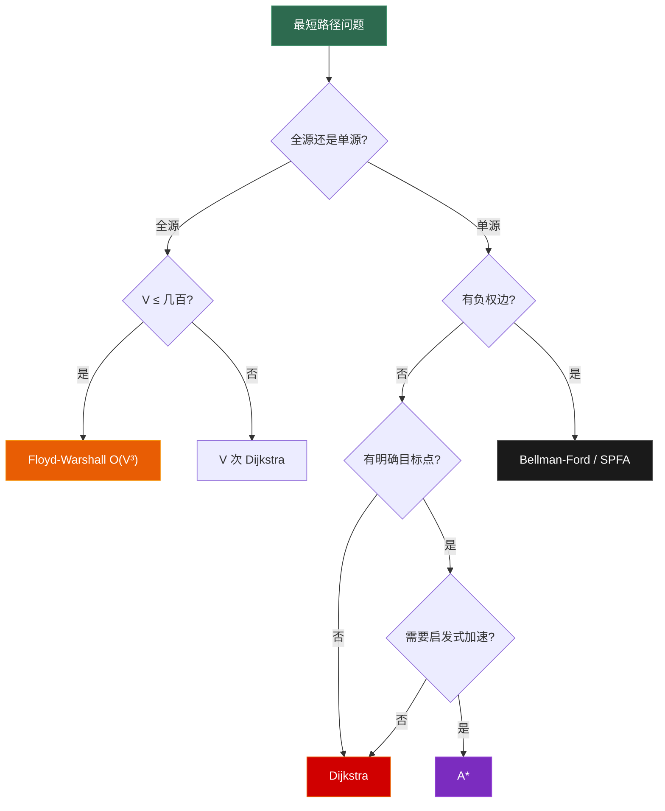

# 7.2 最短路径

> **一句话理解**：最短路径问题是图论的核心——给定一个加权图，找出从起点到终点的权重最小路径。四种算法各有所长：**Dijkstra** 处理非负权单源问题，**Bellman-Ford** 兼容负权，**Floyd-Warshall** 求解全源，**A\*** 用启发式加速搜索。

---

## 7.2.1 问题分类

在深入算法之前，先厘清"最短路径"问题的分类：

```
最短路径问题
├── 单源最短路径 (Single-Source Shortest Path, SSSP)
│   ├── 非负权边 ─→ Dijkstra        O((V+E) log V)
│   ├── 有负权边 ─→ Bellman-Ford    O(V × E)
│   └── 无权图   ─→ BFS            O(V + E)  ← 7.1 已讲
│
├── 全源最短路径 (All-Pairs Shortest Path, APSP)
│   └── Floyd-Warshall              O(V³)
│
└── 启发式搜索 (Informed Search)
    └── A*                          O(b^d) 最坏，实际远优于 Dijkstra
```

| 算法 | 权重要求 | 类型 | 时间复杂度 | 空间 | 面试频率 |
|------|---------|------|-----------|------|---------|
| **BFS** | 无权（或等权）| 单源 | O(V + E) | O(V) | ★★★★★ |
| **Dijkstra** | **非负权** | 单源 | O((V+E) log V) | O(V) | ★★★★★ |
| **Bellman-Ford** | 允许**负权** | 单源 | O(V × E) | O(V) | ★★★☆☆ |
| **Floyd-Warshall** | 允许负权（无负环）| **全源** | O(V³) | O(V²) | ★★★☆☆ |
| **A\*** | 非负权 + 启发函数 | 单源（目标导向）| 取决于启发函数 | O(V) | ★★★★☆（游戏）|

> 💡 **面试中 80% 的最短路径题用 Dijkstra 或 BFS 就能解决**。Bellman-Ford 和 Floyd 偶尔出现，A* 在游戏面试中几乎必问。

---

## 7.2.2 Dijkstra 算法 —— 贪心 + 最小堆

### 核心思想

Dijkstra 是一个**贪心算法**：每次从未确定的节点中选择"距离起点最近的"，确定它的最短距离，然后用它来**松弛 (Relax)** 邻居。

```
松弛操作 (Relaxation):
  如果 dist[u] + weight(u,v) < dist[v]
  那么更新 dist[v] = dist[u] + weight(u,v)

直觉：经过 u 到 v 是否比当前已知的路更短？
```

### 算法流程

```
Dijkstra 从节点 S 出发:

初始: dist = [0, ∞, ∞, ∞, ∞]  (起点距离 0, 其他无穷大)

Step 1: 从优先队列取出距离最小的节点 S (dist=0)
        松弛 S 的邻居 → 更新 dist[A]=4, dist[B]=2

Step 2: 取出 B (dist=2)
        松弛 B 的邻居 → dist[C] = 2+3 = 5, dist[D] = 2+1 = 3

Step 3: 取出 D (dist=3)
        松弛 D 的邻居 → ...

规律: 每个节点被取出时, 它的 dist 值就是最终最短距离 (贪心正确性)
```

### C++ 实现

```cpp
#include <vector>
#include <queue>
#include <limits>

// Dijkstra —— 求从 start 到所有节点的最短距离
// graph[u] = {{v1, w1}, {v2, w2}, ...}  邻接表
std::vector<int> dijkstra(
    const std::vector<std::vector<std::pair<int,int>>>& graph, int start)
{
    int n = graph.size();
    std::vector<int> dist(n, std::numeric_limits<int>::max());
    // 最小堆: {距离, 节点}
    std::priority_queue<std::pair<int,int>,
                        std::vector<std::pair<int,int>>,
                        std::greater<>> pq;

    dist[start] = 0;
    pq.push({0, start});

    while (!pq.empty()) {
        auto [d, u] = pq.top();
        pq.pop();

        // 关键优化: 如果当前距离已经过时, 跳过
        if (d > dist[u]) continue;

        for (auto [v, w] : graph[u]) {
            int new_dist = dist[u] + w;
            if (new_dist < dist[v]) {
                dist[v] = new_dist;
                pq.push({new_dist, v});
            }
        }
    }

    return dist;  // dist[i] = 起点到 i 的最短距离, INT_MAX = 不可达
}
```

### 逐步图解

```
图:
    S ---4--- A
    |         |
    2         1
    |         |
    B ---3--- C ---2--- D
    |                   |
    1                   5
    |                   |
    E --------7-------- F

dist 表变化 (起点 S):

初始: [S=0, A=∞, B=∞, C=∞, D=∞, E=∞, F=∞]

取出 S(0): 松弛 A→4, B→2
       [S=0, A=4, B=2, C=∞, D=∞, E=∞, F=∞]

取出 B(2): 松弛 C→5, E→3
       [S=0, A=4, B=2, C=5, D=∞, E=3, F=∞]

取出 E(3): 松弛 F→10
       [S=0, A=4, B=2, C=5, D=∞, E=3, F=10]

取出 A(4): 松弛 C→5(不更新, 5≤5)
       [S=0, A=4, B=2, C=5, D=∞, E=3, F=10]

取出 C(5): 松弛 D→7
       [S=0, A=4, B=2, C=5, D=7, E=3, F=10]

取出 D(7): 松弛 F→12(不更新, 10≤12)
       [S=0, A=4, B=2, C=5, D=7, E=3, F=10]

取出 F(10): 无更新
       最终: [S=0, A=4, B=2, C=5, D=7, E=3, F=10]  ✅
```

### 路径恢复

面试中经常不仅要最短距离，还要最短**路径**。用 `prev` 数组记录前驱节点：

```cpp
// Dijkstra 带路径恢复
std::pair<std::vector<int>, std::vector<int>> dijkstra_with_path(
    const std::vector<std::vector<std::pair<int,int>>>& graph, int start)
{
    int n = graph.size();
    std::vector<int> dist(n, std::numeric_limits<int>::max());
    std::vector<int> prev(n, -1);  // 前驱节点
    std::priority_queue<std::pair<int,int>,
                        std::vector<std::pair<int,int>>,
                        std::greater<>> pq;

    dist[start] = 0;
    pq.push({0, start});

    while (!pq.empty()) {
        auto [d, u] = pq.top();
        pq.pop();

        if (d > dist[u]) continue;

        for (auto [v, w] : graph[u]) {
            int new_dist = dist[u] + w;
            if (new_dist < dist[v]) {
                dist[v] = new_dist;
                prev[v] = u;  // 记录: v 的最短路来自 u
                pq.push({new_dist, v});
            }
        }
    }

    return {dist, prev};
}

// 从 prev 数组恢复路径
std::vector<int> reconstruct_path(const std::vector<int>& prev, int target) {
    std::vector<int> path;
    for (int v = target; v != -1; v = prev[v]) {
        path.push_back(v);
    }
    std::reverse(path.begin(), path.end());
    return path;
}
```

### Dijkstra 的正确性 & 局限

| 方面 | 说明 |
|------|------|
| **贪心正确性** | 每次取出的最小距离节点，其 dist 一定是最终最短距离（因为所有边权 ≥ 0，后续不可能找到更短路）|
| **为什么不能有负权？** | 负权边可能让已经确定的节点获得更短的距离。贪心假设"当前最小 = 全局最小"被打破 |
| **时间复杂度** | O((V + E) log V)——每个节点至多入堆一次 O(V log V)，每条边松弛一次 O(E log V) |
| **空间复杂度** | O(V + E)（图 + dist + 堆）|

```
反例: 为什么负权打破 Dijkstra?

  S ---1--- A ---(-3)--- B
  |                      |
  2                      |
  |                      |
  C --------5-----------+

Dijkstra 会先确定 A (dist=1), 但实际上 S→C→B→... 可能更短
因为 A→B 有 -3 的边，Dijkstra 不会重新检查已确定的 A
```

> 💡 **面试陷阱**：如果题目说"边权可能为负"，就**不能用 Dijkstra**，要用 Bellman-Ford。这是面试官经常设的坑。

---

## 7.2.3 Bellman-Ford 算法 —— 负权边的守护者

### 核心思想

Bellman-Ford 采用**反复松弛**的策略：对所有边进行 V-1 轮松弛。由于最短路径最多经过 V-1 条边，V-1 轮松弛后一定能找到所有最短路径。此外，**第 V 轮如果还能松弛，说明存在负环**。

```
Bellman-Ford 的逻辑:
  重复 V-1 次:
    对每条边 (u, v, w):
      如果 dist[u] + w < dist[v]:
        dist[v] = dist[u] + w

  为什么 V-1 次就够?
    → 最短路径最多经过 V-1 条边
    → 每一轮至少确定一个节点的最终最短距离
    → V-1 轮后所有节点都确定了
```

### C++ 实现

```cpp
#include <vector>
#include <limits>

struct Edge {
    int from, to, weight;
};

// Bellman-Ford —— 支持负权边, 可检测负环
// 返回 {dist 数组, 是否存在负环}
std::pair<std::vector<int>, bool> bellman_ford(
    int n, const std::vector<Edge>& edges, int start)
{
    std::vector<int> dist(n, std::numeric_limits<int>::max());
    dist[start] = 0;

    // V-1 轮松弛
    for (int i = 0; i < n - 1; ++i) {
        bool updated = false;
        for (const auto& [u, v, w] : edges) {
            if (dist[u] != std::numeric_limits<int>::max()
                && dist[u] + w < dist[v])
            {
                dist[v] = dist[u] + w;
                updated = true;
            }
        }
        // 优化: 如果本轮没有更新, 提前终止
        if (!updated) break;
    }

    // 第 V 轮: 检测负环
    bool has_negative_cycle = false;
    for (const auto& [u, v, w] : edges) {
        if (dist[u] != std::numeric_limits<int>::max()
            && dist[u] + w < dist[v])
        {
            has_negative_cycle = true;
            break;
        }
    }

    return {dist, has_negative_cycle};
}
```

### 负环检测的原理

```
正常情况 (无负环):
  经过 V-1 轮松弛后, 所有最短距离都已确定
  第 V 轮不会有任何更新

存在负环时:
  A ---(-1)--- B
  |            |
  (-1)       (-1)
  |            |
  D ---(-1)--- C

  绕环一圈: 权重之和 = -4 < 0
  每绕一圈, 距离还能减少 → 不存在"最短路径"
  第 V 轮仍然能松弛 → 检测到负环!
```

### Bellman-Ford 的特性

| 特性 | 说明 |
|------|------|
| 时间 | **O(V × E)**——远慢于 Dijkstra |
| 空间 | O(V) |
| 负权边 | ✅ 支持 |
| 负环检测 | ✅ 如果第 V 轮还能松弛 → 负环存在 |
| 适用场景 | (1) 有负权边 (2) 需要检测负环 (3) 边数限制 (LC 787) |

### SPFA (Bellman-Ford 的队列优化)

SPFA (Shortest Path Faster Algorithm) 是 Bellman-Ford 的常数优化：只对"距离刚被更新"的节点的邻居进行松弛，用队列维护这些节点。

```cpp
// SPFA —— Bellman-Ford 的队列优化
std::vector<int> spfa(
    const std::vector<std::vector<std::pair<int,int>>>& graph, int start)
{
    int n = graph.size();
    std::vector<int> dist(n, std::numeric_limits<int>::max());
    std::vector<bool> in_queue(n, false);
    std::queue<int> q;

    dist[start] = 0;
    q.push(start);
    in_queue[start] = true;

    while (!q.empty()) {
        int u = q.front();
        q.pop();
        in_queue[u] = false;

        for (auto [v, w] : graph[u]) {
            if (dist[u] + w < dist[v]) {
                dist[v] = dist[u] + w;
                if (!in_queue[v]) {
                    q.push(v);
                    in_queue[v] = true;
                }
            }
        }
    }

    return dist;
}
```

> 💡 **SPFA 的局限**：虽然平均性能好，但最坏情况仍是 O(V × E)，和原版 Bellman-Ford 一样。在正权图中**没有理由用 SPFA 替代 Dijkstra**。SPFA 主要用在有负权边的场景。

---

## 7.2.4 Floyd-Warshall 算法 —— 全源最短路径

### 核心思想

Floyd-Warshall 是一个经典的**动态规划**算法，一次性求出所有顶点对之间的最短距离。

```
核心 DP 定义:
  dp[k][i][j] = 从 i 到 j, 只经过节点 {0, 1, ..., k} 的最短距离

状态转移:
  dp[k][i][j] = min(
      dp[k-1][i][j],           // 不经过节点 k
      dp[k-1][i][k] + dp[k-1][k][j]  // 经过节点 k: i→k + k→j
  )

空间优化: k 维可以原地更新 → 二维 dp[i][j]
```

### C++ 实现

```cpp
#include <vector>
#include <limits>

// Floyd-Warshall —— 全源最短路径
// dist[i][j] = i 到 j 的最短距离
void floyd_warshall(std::vector<std::vector<int>>& dist) {
    int n = dist.size();
    constexpr int INF = std::numeric_limits<int>::max() / 2;  // 防溢出

    // k = 中转节点
    for (int k = 0; k < n; ++k) {
        for (int i = 0; i < n; ++i) {
            for (int j = 0; j < n; ++j) {
                if (dist[i][k] + dist[k][j] < dist[i][j]) {
                    dist[i][j] = dist[i][k] + dist[k][j];
                }
            }
        }
    }
}

// 使用示例:
// 初始化: dist[i][j] = weight(i,j), 无边 = INF, dist[i][i] = 0
// 调用后: dist[i][j] = i 到 j 的最短距离
```

### 图解

```
初始距离矩阵 (INF=∞):
       0    1    2    3
  0 [  0    3    ∞    7  ]
  1 [  ∞    0    2    ∞  ]
  2 [  ∞    ∞    0    1  ]
  3 [  ∞    ∞    ∞    0  ]

k=0 (经过节点 0): 无变化 (0 到 1,3 有边, 但没有新的更短路)

k=1 (经过节点 1):
  dist[0][2] = min(∞, dist[0][1] + dist[1][2]) = min(∞, 3+2) = 5
       0    1    2    3
  0 [  0    3    5    7  ]

k=2 (经过节点 2):
  dist[0][3] = min(7, dist[0][2] + dist[2][3]) = min(7, 5+1) = 6
  dist[1][3] = min(∞, dist[1][2] + dist[2][3]) = min(∞, 2+1) = 3
       0    1    2    3
  0 [  0    3    5    6  ]
  1 [  ∞    0    2    3  ]

k=3: 无新更新

最终: dist[0][3] = 6 (路径: 0→1→2→3)  ✅
```

### Floyd-Warshall 的特性

| 特性 | 说明 |
|------|------|
| 时间 | **O(V³)** |
| 空间 | O(V²) |
| 适用 | **全源**最短路径、传递闭包、检测负环 |
| 负权 | 支持（无负环）|
| 负环检测 | 如果 `dist[i][i] < 0`，说明 i 在负环上 |
| 代码 | 极其简洁（三重循环），适合竞赛和小规模图 |

> 💡 **Floyd vs 多次 Dijkstra**：如果需要全源最短路，V 次 Dijkstra = O(V(V+E)logV)，当图**稠密**（E ≈ V²）时 Floyd 的 O(V³) 更简洁。当图**稀疏**时多次 Dijkstra 更快。面试中 Floyd 主要考三重循环的 DP 思想。

---

## 7.2.5 A\* 算法 —— 启发式搜索

### 为什么需要 A\*？

Dijkstra 是"盲目"的——它向**所有方向**均匀扩展，不知道终点在哪里。A\* 加入了**启发函数 h(n)**，引导搜索向目标方向前进，大幅减少探索的节点数。

```
Dijkstra vs A* 的扩展方式:

Dijkstra (盲目扩展):          A* (启发式引导):
    · · · · · · · ·               · · · · · · · ·
    · · · * * · · ·               · · · · · · · ·
    · · * * * * · ·               · · · * · · · ·
    · * * * S * * ·               · · * * S · · ·
    · · * * * * · ·               · · · * * · · ·
    · · · * * · · G               · · · · * * · G
    · · · · · · · ·               · · · · · * * ·
    · · · · · · · ·               · · · · · · · ·

    S=起点, G=终点, *=已探索节点

Dijkstra 探索了大量无用方向;  A* 直奔目标, 探索量大幅减少
```

### 核心公式

```
A* 的评估函数:
  f(n) = g(n) + h(n)

  g(n) = 从起点到 n 的实际代价 (已知, 同 Dijkstra 的 dist)
  h(n) = 从 n 到终点的**估计代价** (启发函数, 需要设计)
  f(n) = 总估计代价 (A* 按 f(n) 从小到大扩展)

特殊情况:
  h(n) = 0          → A* 退化为 Dijkstra (盲目搜索)
  h(n) = 实际距离    → A* 直接找到最短路 (完美启发, 不现实)
  h(n) ≤ 实际距离    → A* 保证最优解 (Admissible, 可采纳的)
```

### 启发函数设计

启发函数的选择直接决定 A* 的性能。游戏中常用以下三种：

```
在网格地图上, 从 (x1,y1) 到 (x2,y2) 的启发估计:

1. Manhattan Distance (曼哈顿距离) —— 4方向移动
   h = |x1-x2| + |y1-y2|

2. Euclidean Distance (欧几里得距离) —— 任意方向
   h = √((x1-x2)² + (y1-y2)²)

3. Chebyshev Distance (切比雪夫距离) —— 8方向移动
   h = max(|x1-x2|, |y1-y2|)

4. Octile Distance (八方向真实距离) —— 8方向 + 对角线代价
   dx = |x1-x2|, dy = |y1-y2|
   h = max(dx, dy) + (√2 - 1) × min(dx, dy)
```

| 启发函数 | 适用场景 | Admissible? | 效率 |
|---------|---------|-------------|------|
| Manhattan | 4方向移动的网格 | ✅ | 高（紧凑下界）|
| Euclidean | 任意方向移动 | ✅ | 中（较松下界）|
| Chebyshev | 8方向移动的网格 | ✅ | 高 |
| Octile | 8方向 + 对角线代价不同 | ✅ | 最高（最紧凑）|
| Zero (h=0) | — | ✅ | 最低（= Dijkstra）|

> 💡 **Admissible (可采纳)**：h(n) 永远不超过真实距离。这是 A\* 保证最优解的**必要条件**。如果 h 高估了，A\* 可能跳过最优路径。

### Consistent (一致性)

一个更强的条件——**Consistent (一致的/单调的)**：

```
对所有邻居 (n, n'):
  h(n) ≤ cost(n, n') + h(n')

即: 启发函数满足三角不等式

Consistent ⊂ Admissible:
  一致性 → 可采纳性 (反之不一定)
  一致性 → 每个节点只需扩展一次 → 不需要 closed set 检查
  上面列的四种启发函数都是 Consistent 的
```

### C++ 实现 —— 网格 A\*

```cpp
#include <vector>
#include <queue>
#include <cmath>
#include <algorithm>

struct Node {
    int x, y;
    int g;        // 起点到当前的实际代价
    double f;     // f = g + h, 总估计代价
    bool operator>(const Node& other) const { return f > other.f; }
};

// Manhattan 启发函数 (4方向)
inline int heuristic(int x1, int y1, int x2, int y2) {
    return std::abs(x1 - x2) + std::abs(y1 - y2);
}

// A* 寻路 —— 在网格上找最短路径
std::vector<std::pair<int,int>> a_star(
    const std::vector<std::vector<int>>& grid,  // 0=可走, 1=障碍
    std::pair<int,int> start,
    std::pair<int,int> goal)
{
    int rows = grid.size(), cols = grid[0].size();
    auto [sx, sy] = start;
    auto [gx, gy] = goal;

    // dist[x][y] = 起点到 (x,y) 的最短距离
    std::vector<std::vector<int>> dist(rows, std::vector<int>(cols, INT_MAX));
    // 前驱节点
    std::vector<std::vector<std::pair<int,int>>> prev(
        rows, std::vector<std::pair<int,int>>(cols, {-1, -1}));

    // 最小堆, 按 f = g + h 排序
    std::priority_queue<Node, std::vector<Node>, std::greater<Node>> open;

    dist[sx][sy] = 0;
    open.push({sx, sy, 0, static_cast<double>(heuristic(sx, sy, gx, gy))});

    constexpr int dx[] = {0, 0, 1, -1};
    constexpr int dy[] = {1, -1, 0, 0};

    while (!open.empty()) {
        auto [x, y, g, f] = open.top();
        open.pop();

        // 到达终点
        if (x == gx && y == gy) {
            // 回溯路径
            std::vector<std::pair<int,int>> path;
            auto cur = goal;
            while (cur != start) {
                path.push_back(cur);
                cur = prev[cur.first][cur.second];
            }
            path.push_back(start);
            std::reverse(path.begin(), path.end());
            return path;
        }

        // 跳过已过时的节点
        if (g > dist[x][y]) continue;

        // 扩展四个方向
        for (int d = 0; d < 4; ++d) {
            int nx = x + dx[d], ny = y + dy[d];
            if (nx < 0 || nx >= rows || ny < 0 || ny >= cols) continue;
            if (grid[nx][ny] == 1) continue;  // 障碍

            int new_g = g + 1;  // 边权 = 1
            if (new_g < dist[nx][ny]) {
                dist[nx][ny] = new_g;
                prev[nx][ny] = {x, y};
                double new_f = new_g + heuristic(nx, ny, gx, gy);
                open.push({nx, ny, new_g, new_f});
            }
        }
    }

    return {};  // 无路可达
}
```

### A\* vs Dijkstra 性能对比

```
100×100 网格, S=(0,0), G=(99,99), 随机 20% 障碍:

算法        | 扩展节点数 | 时间
------------|-----------|------
Dijkstra    |  ~8,000   | 基准
A* (Manhattan)| ~2,500  | ~3x 加速
A* (Euclidean)| ~3,200  | ~2.5x 加速

障碍越多、路径越曲折时, A* 优势缩小 (因为启发函数的引导效果减弱)
开阔地图上, A* 通常快 5-10 倍
```

### A\* 的正确性分析

| 条件 | 结论 |
|------|------|
| h(n) admissible | A\* 找到的第一条到达终点的路径**一定是最短的** |
| h(n) consistent | 每个节点**只需扩展一次**，无需 closed set 的二次检查 |
| h(n) = 0 | A\* 退化为 Dijkstra |
| h(n) > actual | **不保证最优**，但搜索更快（Weighted A\*、游戏中的常见取舍）|

> 💡 **游戏中的实际取舍**：在实时游戏中，寻路必须在**毫秒级**完成。工程师可能故意让 h 稍微高估（`h *= 1.1`），牺牲最优性换取速度。这叫 **Weighted A\*** 或 **ε-suboptimal A\***。

---

## 7.2.6 复杂度速查表

| 算法 | 时间 | 空间 | 权重要求 | 负环检测 | 类型 |
|------|------|------|---------|---------|------|
| **BFS** | O(V+E) | O(V) | 无权/等权 | ❌ | 单源 |
| **Dijkstra** | O((V+E)logV) | O(V+E) | **非负** | ❌ | 单源 |
| **Bellman-Ford** | O(V×E) | O(V) | 任意 | ✅ | 单源 |
| **SPFA** | O(V×E) 最坏 | O(V) | 任意 | ✅ | 单源 |
| **Floyd** | O(V³) | O(V²) | 任意（无负环）| ✅ | **全源** |
| **A\*** | 取决于 h | O(V) | 非负 | ❌ | 单源目标 |

### 算法选择决策树



---

## 7.2.7 面试高频题

### 网络延迟时间 (LeetCode 743)

> 有 n 个节点的网络，给定发送信号的节点 k，求信号到达所有节点的最短时间。若无法到达所有节点，返回 -1。

**经典 Dijkstra 模板题**：

```cpp
int networkDelayTime(std::vector<std::vector<int>>& times, int n, int k) {
    // 建图
    std::vector<std::vector<std::pair<int,int>>> graph(n + 1);
    for (auto& t : times) {
        graph[t[0]].push_back({t[1], t[2]});
    }

    // Dijkstra
    std::vector<int> dist(n + 1, INT_MAX);
    std::priority_queue<std::pair<int,int>,
                        std::vector<std::pair<int,int>>,
                        std::greater<>> pq;

    dist[k] = 0;
    pq.push({0, k});

    while (!pq.empty()) {
        auto [d, u] = pq.top();
        pq.pop();

        if (d > dist[u]) continue;

        for (auto [v, w] : graph[u]) {
            if (dist[u] + w < dist[v]) {
                dist[v] = dist[u] + w;
                pq.push({dist[v], v});
            }
        }
    }

    // 答案 = 所有节点最短距离中的最大值
    int ans = 0;
    for (int i = 1; i <= n; ++i) {
        if (dist[i] == INT_MAX) return -1;  // 有节点不可达
        ans = std::max(ans, dist[i]);
    }
    return ans;
}
// 时间 O((V+E)logV), 空间 O(V+E)
```

> 💡 **面试要点**：这道题就是纯 Dijkstra，唯一的变化是答案不是某个 dist[target]，而是 `max(dist[1..n])`——信号到达所有节点的时间 = 最远那个节点的距离。

### K 站中转内最便宜的航班 (LeetCode 787)

> 找从 src 到 dst 最多经过 k 次中转的最便宜航班价格。

**关键约束**：最多 k 次中转 = 最多 k+1 条边。这是**带步数限制的最短路**，Dijkstra 不能直接处理（贪心假设被打破），要用 **Bellman-Ford**（恰好 k+1 轮松弛）。

```cpp
int findCheapestPrice(int n, std::vector<std::vector<int>>& flights,
                      int src, int dst, int k)
{
    // Bellman-Ford: 最多 k+1 轮松弛
    std::vector<int> dist(n, INT_MAX);
    dist[src] = 0;

    for (int i = 0; i <= k; ++i) {
        // 关键: 用上一轮的 dist 来松弛, 防止"链式更新"
        std::vector<int> prev_dist = dist;

        for (auto& f : flights) {
            int u = f[0], v = f[1], w = f[2];
            if (prev_dist[u] != INT_MAX && prev_dist[u] + w < dist[v]) {
                dist[v] = prev_dist[u] + w;
            }
        }
    }

    return dist[dst] == INT_MAX ? -1 : dist[dst];
}
// 时间 O(k × E), 空间 O(V)
```

> 💡 **为什么要复制 prev_dist？** 如果直接用 dist 松弛，同一轮中 A→B→C 会产生链式更新——B 更新后 C 立即用 B 的新值松弛，相当于用了 2 条边。复制一份确保每轮只延伸一条边。

### 最大概率路径 (LeetCode 1514)

> 求从 start 到 end 的最大成功概率路径。边权是概率 (0~1)。

**变体 Dijkstra**: 把"最短距离"改为"最大概率"，把"加法"改为"乘法"，最小堆改为**最大堆**。

```cpp
double maxProbability(int n, std::vector<std::vector<int>>& edges,
                      std::vector<double>& succProb, int start, int end)
{
    // 建图
    std::vector<std::vector<std::pair<int,double>>> graph(n);
    for (int i = 0; i < static_cast<int>(edges.size()); ++i) {
        graph[edges[i][0]].push_back({edges[i][1], succProb[i]});
        graph[edges[i][1]].push_back({edges[i][0], succProb[i]});
    }

    // "最大"概率 → 最大堆
    std::vector<double> prob(n, 0.0);
    std::priority_queue<std::pair<double,int>> pq;  // 默认最大堆

    prob[start] = 1.0;
    pq.push({1.0, start});

    while (!pq.empty()) {
        auto [p, u] = pq.top();
        pq.pop();

        if (p < prob[u]) continue;  // 过时节点
        if (u == end) return p;     // 提前终止

        for (auto [v, w] : graph[u]) {
            double new_prob = prob[u] * w;  // 概率相乘
            if (new_prob > prob[v]) {
                prob[v] = new_prob;
                pq.push({new_prob, v});
            }
        }
    }

    return 0.0;  // 不可达
}
// 时间 O((V+E)logV), 空间 O(V+E)
```

> 💡 **Dijkstra 变体识别法**：只要问题满足 (1) 从左到右的贪心性 (2) 单调性——"经过更多节点只会让结果更差"——就能用 Dijkstra 框架。最大概率满足：概率 ∈ (0,1]，多乘一个 ≤ 1 的数只会更小。

### 路径存在性（带权重限制变体）

面试中常见的 Dijkstra 变体套路：

| 变体 | 改动 | 示例 |
|------|------|------|
| 最短距离 | 标准 Dijkstra | LC 743 |
| 最大概率 | 加法→乘法，最小→最大 | LC 1514 |
| 最小最大边权 | `max(dist[u], w)` 代替 `dist[u]+w` | LC 1631 |
| 步数限制 | Bellman-Ford，限制轮次 | LC 787 |
| 多起点 | 所有起点初始 dist=0 | LC 994 多源 BFS |

### Floyd 的面试应用 (LeetCode 1334)

> 给定 n 个城市和带权双向边，找阈值距离内邻居最少的城市。

```cpp
int findTheCity(int n, std::vector<std::vector<int>>& edges, int distanceThreshold) {
    constexpr int INF = 1e9;
    std::vector<std::vector<int>> dist(n, std::vector<int>(n, INF));

    // 初始化
    for (int i = 0; i < n; ++i) dist[i][i] = 0;
    for (auto& e : edges) {
        dist[e[0]][e[1]] = e[2];
        dist[e[1]][e[0]] = e[2];
    }

    // Floyd-Warshall
    for (int k = 0; k < n; ++k)
        for (int i = 0; i < n; ++i)
            for (int j = 0; j < n; ++j)
                dist[i][j] = std::min(dist[i][j], dist[i][k] + dist[k][j]);

    // 找邻居最少的城市
    int result = -1, min_count = n;
    for (int i = 0; i < n; ++i) {
        int count = 0;
        for (int j = 0; j < n; ++j) {
            if (i != j && dist[i][j] <= distanceThreshold) ++count;
        }
        if (count <= min_count) {
            min_count = count;
            result = i;  // 相同数量取编号最大的
        }
    }
    return result;
}
// 时间 O(V³), 空间 O(V²)
```

### 迷宫中的最短路径 (LeetCode 1091)

> 在 n×n 的 01 网格中，找从左上角到右下角的最短路径长度（8方向移动）。

**标准 BFS**（无权最短路），但 8 方向：

```cpp
int shortestPathBinaryMatrix(std::vector<std::vector<int>>& grid) {
    int n = grid.size();
    if (grid[0][0] == 1 || grid[n-1][n-1] == 1) return -1;

    std::queue<std::pair<int,int>> q;
    q.push({0, 0});
    grid[0][0] = 1;  // 标记已访问
    int steps = 1;

    // 8方向
    int dx[] = {0,0,1,-1,1,1,-1,-1};
    int dy[] = {1,-1,0,0,1,-1,1,-1};

    while (!q.empty()) {
        int size = q.size();
        for (int i = 0; i < size; ++i) {
            auto [x, y] = q.front();
            q.pop();

            if (x == n-1 && y == n-1) return steps;

            for (int d = 0; d < 8; ++d) {
                int nx = x + dx[d], ny = y + dy[d];
                if (nx >= 0 && nx < n && ny >= 0 && ny < n && grid[nx][ny] == 0) {
                    grid[nx][ny] = 1;
                    q.push({nx, ny});
                }
            }
        }
        ++steps;
    }

    return -1;
}
// 时间 O(n²), 空间 O(n²)
```

---

## 7.2.8 🎮 游戏实战场景

### A\* 寻路 —— 游戏开发最核心的图算法

A\* 是几乎所有游戏中角色移动/AI 寻路的基础。下面是一个完整的游戏级 A\* 实现：

```cpp
#include <vector>
#include <queue>
#include <unordered_set>
#include <cmath>
#include <algorithm>

// 坐标编码: (x, y) → x * cols + y
struct PathNode {
    int pos;      // 编码后的坐标
    int g;        // 实际代价
    double f;     // f = g + h

    bool operator>(const PathNode& o) const { return f > o.f; }
};

class GamePathfinder {
    int _rows, _cols;
    const std::vector<std::vector<int>>& _terrain;

    // 8方向移动, 对角线代价 14 (≈√2×10), 直线代价 10
    static constexpr int dx[] = {0, 0, 1, -1, 1, 1, -1, -1};
    static constexpr int dy[] = {1, -1, 0, 0, 1, -1, 1, -1};
    static constexpr int cost[] = {10, 10, 10, 10, 14, 14, 14, 14};

    int _encode(int x, int y) const { return x * _cols + y; }
    std::pair<int,int> _decode(int pos) const { return {pos / _cols, pos % _cols}; }

    // Octile 距离 (最紧凑的 8方向启发函数)
    double _heuristic(int x1, int y1, int x2, int y2) const {
        int dx = std::abs(x1 - x2), dy = std::abs(y1 - y2);
        return 10.0 * std::max(dx, dy) + 4.0 * std::min(dx, dy);
        // 直线代价 10, 对角线额外代价 ≈ 14 - 10 = 4
    }

    bool _walkable(int x, int y) const {
        return x >= 0 && x < _rows && y >= 0 && y < _cols
            && _terrain[x][y] == 0;
    }

    // 对角线移动需要检查"肩膀"是否被卡住
    bool _diagonal_allowed(int x, int y, int d) const {
        if (d < 4) return true;  // 直线移动不需要检查

        // 例如右下移动 (1,1): 需要 (x+1,y) 和 (x,y+1) 至少一个可通行
        // 否则角色会"穿墙"
        int nx1 = x + dx[d], ny1 = y;  // 水平分量
        int nx2 = x, ny2 = y + dy[d];  // 垂直分量
        return _walkable(nx1, ny1) || _walkable(nx2, ny2);
    }

public:
    GamePathfinder(const std::vector<std::vector<int>>& terrain)
        : _rows(terrain.size()), _cols(terrain[0].size()), _terrain(terrain) {}

    // A* 寻路: 返回坐标路径
    std::vector<std::pair<int,int>> find_path(
        std::pair<int,int> start, std::pair<int,int> goal)
    {
        int total = _rows * _cols;
        std::vector<int> g_score(total, INT_MAX);
        std::vector<int> prev(total, -1);
        std::priority_queue<PathNode, std::vector<PathNode>,
                            std::greater<PathNode>> open;

        auto [sx, sy] = start;
        auto [gx, gy] = goal;
        int start_pos = _encode(sx, sy);
        int goal_pos = _encode(gx, gy);

        g_score[start_pos] = 0;
        open.push({start_pos, 0, _heuristic(sx, sy, gx, gy)});

        while (!open.empty()) {
            auto [pos, g, f] = open.top();
            open.pop();

            if (pos == goal_pos) {
                // 回溯路径
                std::vector<std::pair<int,int>> path;
                for (int p = goal_pos; p != -1; p = prev[p]) {
                    path.push_back(_decode(p));
                }
                std::reverse(path.begin(), path.end());
                return path;
            }

            if (g > g_score[pos]) continue;  // 跳过过时节点

            auto [x, y] = _decode(pos);

            for (int d = 0; d < 8; ++d) {
                int nx = x + dx[d], ny = y + dy[d];
                if (!_walkable(nx, ny)) continue;
                if (!_diagonal_allowed(x, y, d)) continue;

                int new_g = g + cost[d];
                int npos = _encode(nx, ny);

                if (new_g < g_score[npos]) {
                    g_score[npos] = new_g;
                    prev[npos] = pos;
                    double new_f = new_g + _heuristic(nx, ny, gx, gy);
                    open.push({npos, new_g, new_f});
                }
            }
        }

        return {};  // 不可达
    }
};

// 使用示例:
// GamePathfinder pf(terrain_map);
// auto path = pf.find_path({0, 0}, {99, 99});
// for (auto [x, y] : path) { move_character_to(x, y); }
```

### 游戏寻路的工程优化

实际游戏中，A\* 还有大量工程优化。以下是常见技巧：

```
1. Jump Point Search (JPS)
   在均匀网格上, 跳过不必要的中间节点
   加速 10-30 倍 (无障碍区域效果最好)

2. 分层寻路 (Hierarchical Pathfinding)
   大地图: 先在"区域图"上 A* 找粗略路径
   再在每个区域内 A* 找精确路径
   MMO 大世界必备

3. Navigation Mesh (NavMesh)
   不用网格, 用三角形/多边形覆盖地图
   节点数大幅减少 → A* 更快
   Unity/Unreal 引擎标配

4. 流场寻路 (Flow Field)
   大量单位移向同一目标 (RTS 游戏)
   一次计算, 所有单位共享 → O(n) 优于 n 次 A*

5. 路径平滑 (Path Smoothing)
   A* 输出的路径是锯齿状的
   用 String-Pulling / Funnel 算法平滑
   视觉效果: 角色沿弧线走而非折线走
```

| 优化技术 | 适用场景 | 加速倍率 |
|----------|---------|---------|
| **JPS** | 均匀网格 | 10-30x |
| **分层寻路** | 大世界地图 | 50-100x |
| **NavMesh** | 3D 场景 / 非网格地形 | 5-20x |
| **Flow Field** | RTS 大量同目标单位 | n 倍（n=单位数）|
| **缓存路径** | 相似起终点复用 | 取决于命中率 |

### 加权地形代价

```cpp
// 真实游戏中, 不同地形有不同移动代价
enum Terrain {
    ROAD    = 1,   // 道路: 代价 1
    GRASS   = 3,   // 草地: 代价 3
    FOREST  = 5,   // 森林: 代价 5
    SWAMP   = 8,   // 沼泽: 代价 8
    WALL    = -1,  // 墙壁: 不可通行
};

// 修改 A* 中的移动代价:
// int move_cost = base_cost[d] * terrain_cost[grid[nx][ny]];
// 而非固定的 cost[d]

// 这使得 A* 自动倾向于走道路而非翻山越岭
// 玩家看到的效果: NPC 会走大路, 除非绕路代价太高
```

### 动态避障

```cpp
// 游戏中障碍物是动态的 (其他角色、可破坏物体、门)
// 方案一: 局部重规划 (Replanning)
//   检测到路径被阻断 → 从当前位置重新 A*
//   适合: 偶尔的障碍变化

// 方案二: D* Lite (Dynamic A*)
//   增量式更新: 只重新计算受影响的节点
//   适合: 频繁的障碍变化 (RTS 战争迷雾)

// 方案三: 避障层 (Steering + Pathfinding 分离)
//   A* 负责全局路径
//   Steering Behavior 负责局部避障 (绕过移动中的NPC)
//   现代游戏最常用的架构

// 伪代码:
// global_path = a_star(current_pos, target);
// while (not_arrived) {
//     if (path_blocked(global_path)) {
//         global_path = a_star(current_pos, target);  // 重规划
//     }
//     next_waypoint = global_path.next();
//     steer_towards(next_waypoint, avoid_nearby_units());
// }
```

---

## 7.2.9 面试题速查表

| 题号 | 题目 | 核心算法 | 难度 |
|------|------|----------|------|
| LC 743 | 网络延迟时间 | **Dijkstra 模板** | Medium |
| LC 787 | K 站中转内最便宜航班 | **Bellman-Ford + 步数限制** | Medium |
| LC 1514 | 最大概率路径 | Dijkstra 变体（乘法 + 最大堆）| Medium |
| LC 1334 | 阈值距离内邻居最少的城市 | **Floyd-Warshall 模板** | Medium |
| LC 1091 | 二进制矩阵中的最短路径 | BFS (8方向) | Medium |
| LC 1631 | 最小体力消耗路径 | Dijkstra 变体（min-max 边权）| Medium |
| LC 778 | 水位上升的泳池中游泳 | Dijkstra / 二分+BFS | Hard |
| LC 882 | 细分图中的可达节点 | Dijkstra + 边上节点计数 | Hard |
| LC 399 | 除法求值 | 带权图 BFS/DFS / Floyd | Medium |
| LC 1162 | 地图分析 | 多源 BFS（找最远距离）| Medium |

---

## 7.2.10 本节小结

### 核心要点

| 算法 | 核心思想 | 记忆口诀 |
|------|---------|---------|
| **Dijkstra** | 贪心 + 最小堆，每次确定最近的节点 | "贪心取最小，松弛更新邻居" |
| **Bellman-Ford** | V-1 轮全局松弛，兼容负权 | "松弛 V-1 轮，第 V 轮查负环" |
| **Floyd** | DP 三重循环，枚举中转节点 | "i→k→j 是否更短？" |
| **A\*** | Dijkstra + 启发函数 h(n) 引导方向 | "f = g + h，h 别高估" |

### 面试 30 秒速答

> **Q：Dijkstra 算法的原理？为什么不能处理负权边？**
>
> A：Dijkstra 是**贪心**策略——每次从优先队列中取出距离最小的节点，标记为"已确定"，并用它松弛邻居。正确性依赖于"**当前最小 = 全局最小**"的假设。如果有**负权边**，一个已确定的节点可能通过负边获得更短路径，破坏贪心假设。此时需要用 **Bellman-Ford**（V-1 轮全局松弛）。

> **Q：A\* 和 Dijkstra 有什么区别？A\* 如何保证最优？**
>
> A：A\* 在 Dijkstra 的基础上加了**启发函数 h(n)**：优先队列按 `f(n) = g(n) + h(n)` 排序，g 是已知代价，h 是到终点的估计代价。h 引导搜索方向，减少无用探索。保证最优的条件是 h **Admissible（可采纳）**——h 永远不高估真实距离。常用 Manhattan（4方向）、Octile（8方向）。

> **Q：什么时候用 Floyd？什么时候用多次 Dijkstra？**
>
> A：都能求全源最短路。**Floyd** O(V³) 代码极简（三重循环），适合 V 较小（≤ 几百）的稠密图。**多次 Dijkstra** O(V(V+E)logV)，在稀疏图上更快。面试中 Floyd 主要考 DP 思想和"枚举中转节点"的直觉。

> **Q：游戏中的 A\* 有哪些优化？**
>
> A：(1) **JPS**（跳点搜索）在均匀网格上加速 10-30 倍；(2) **分层寻路**先在区域图上规划再局部精确化；(3) **NavMesh** 用多边形代替网格减少节点数；(4) **Flow Field** 适合大量同目标单位（RTS）。工程上还会用 Weighted A\*（h\*=1.1）牺牲微小最优性换取速度。

---

> 📖 返回总览：[第七章 图 —— 总览与导航](../index)
>
> 📖 上一节：[7.1 图的表示与遍历](../07_01_graph_basics) —— 邻接矩阵/邻接表 + BFS/DFS 基础
>
> 📖 下一节：[7.3 最小生成树 & 拓扑排序](../07_03_mst_topo) —— Kruskal/Prim + Kahn/DFS 拓扑排序，掌握"最小代价连通"和"依赖排序"。
