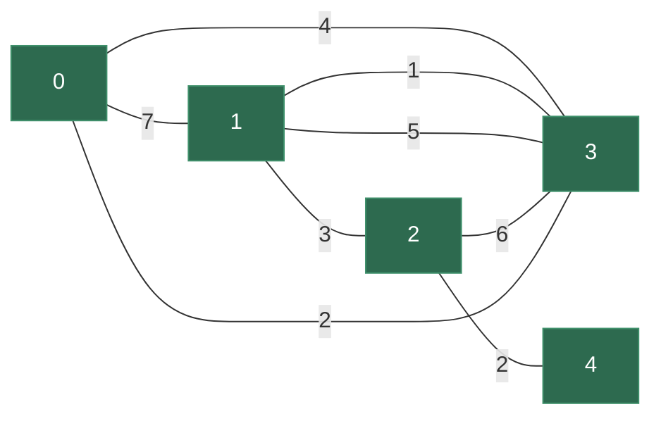

# 7.3 最小生成树 & 拓扑排序

> **一句话理解**：最小生成树 (MST) 解决的是"用**最小总代价**把所有节点连通"的问题；拓扑排序解决的是"给有向无环图 (DAG) 排出一个**合法执行顺序**"的问题。两者是图论中最经典的两类算法，面试高频、游戏常用。

---

## 7.3.1 最小生成树 —— 概念与直觉

### 什么是生成树？

```
原图 (5个节点, 7条边):           一棵生成树 (5个节点, 4条边):
    1 ---3--- 2                     1 ---3--- 2
   /|         |\                              |
  7  1        6  2                            6
 /  |         |    \                          |
0   +----5----+     4                 0 --1-- 3 ---2--- 4
 \       |        /
  4     2       3
   \   |      /
    3-+------+

生成树 = 包含所有 V 个节点、恰好 V-1 条边的连通无环子图
一个图可以有多棵不同的生成树
```

| 概念 | 定义 |
|------|------|
| **生成树** | 包含图中**所有顶点**，恰好 V-1 条边，连通且无环 |
| **最小生成树 (MST)** | 所有生成树中**边权之和最小**的那棵 |
| **存在条件** | 图必须**连通**（否则是最小生成**森林**）|
| **唯一性** | 如果所有边权互不相同，MST 唯一；否则可能有多棵 |

### 生活类比

```
问题: 城市之间要修公路, 保证所有城市互通, 总里程最短

  城市 = 节点
  候选公路 = 边 (带权重 = 里程)
  MST = 用最少总里程连通所有城市

为什么不需要 "最短路径"?
  → 最短路径关心的是 A→B 的最优路线
  → MST 关心的是 "让所有节点连通" 的最小总代价
  → 两个完全不同的问题!
```

---

## 7.3.2 Kruskal 算法 —— 贪心选边 + 并查集

### 核心思想

Kruskal 是一个**贪心算法**：把所有边按权重从小到大排序，依次选边。如果选的边不会形成环（两端点不在同一个连通分量内），就加入 MST。用**并查集**快速判断连通性。

```
Kruskal 算法流程:

1. 所有边排序: [1, 2, 2, 3, 3, 4, 5, 6, 7]

2. 依次尝试每条边:
   边(3,1) w=1 → 3和1不连通 → 选 ✓  并查集合并 {1,3}
   边(0,3) w=2 → 0和3不连通 → 选 ✓  并查集合并 {0,1,3}
   边(2,4) w=2 → 2和4不连通 → 选 ✓  并查集合并 {2,4}
   边(1,2) w=3 → 1和2不连通 → 选 ✓  并查集合并 {0,1,2,3,4}
   已选 4 条边 = V-1 → MST 完成!

   剩余边 [3,4,5,6,7] 全部跳过 (会形成环)

MST 总权重 = 1 + 2 + 2 + 3 = 8
```

### 并查集回顾

Kruskal 的核心依赖是**并查集 (Union-Find)**——判断两个节点是否已连通、合并两个连通分量。这里给出精简实现，详细分析见第 9 章：

```cpp
class UnionFind {
    std::vector<int> _parent, _rank;

public:
    UnionFind(int n) : _parent(n), _rank(n, 0) {
        std::iota(_parent.begin(), _parent.end(), 0);  // parent[i] = i
    }

    int find(int x) {
        if (_parent[x] != x) {
            _parent[x] = find(_parent[x]);  // 路径压缩
        }
        return _parent[x];
    }

    bool unite(int x, int y) {
        int rx = find(x), ry = find(y);
        if (rx == ry) return false;  // 已连通，不合并

        // 按秩合并
        if (_rank[rx] < _rank[ry]) std::swap(rx, ry);
        _parent[ry] = rx;
        if (_rank[rx] == _rank[ry]) ++_rank[rx];
        return true;  // 合并成功
    }

    bool connected(int x, int y) { return find(x) == find(y); }
};
```

### Kruskal C++ 实现

```cpp
#include <vector>
#include <algorithm>
#include <numeric>

struct Edge {
    int u, v, weight;
    bool operator<(const Edge& other) const { return weight < other.weight; }
};

// Kruskal —— 返回 {MST 的总权重, MST 的边集}
// 如果图不连通, 返回的边数 < V-1
std::pair<int, std::vector<Edge>> kruskal(int n, std::vector<Edge>& edges) {
    // 1. 按权重排序
    std::sort(edges.begin(), edges.end());

    // 2. 初始化并查集
    UnionFind uf(n);

    int total_weight = 0;
    std::vector<Edge> mst_edges;

    // 3. 贪心选边
    for (const auto& e : edges) {
        if (uf.unite(e.u, e.v)) {
            // 两端点不在同一连通分量 → 选这条边
            total_weight += e.weight;
            mst_edges.push_back(e);

            // 优化: 选够 V-1 条边就可以停了
            if (static_cast<int>(mst_edges.size()) == n - 1) break;
        }
    }

    return {total_weight, mst_edges};
}
```

### 图解



```
排序后的边: (1,3,1)  (0,3,2)  (2,4,2)  (1,2,3)  (0,3,4)  (1,3,5)  (2,3,6)  (0,1,7)
            ✅选      ✅选      ✅选      ✅选      ❌环      停止

MST 边: {1-3, 0-3, 2-4, 1-2}, 总权重 = 1+2+2+3 = 8
```

### Kruskal 的特性

| 特性 | 说明 |
|------|------|
| 时间 | **O(E log E)** ← 排序主导。并查集操作近 O(1) |
| 空间 | O(V + E) |
| 适用 | **稀疏图**（E 较小时排序快）|
| 正确性 | **切割性质 (Cut Property)**：任意切割中权重最小的边一定在 MST 中 |
| 额外能力 | 可以求**最小生成森林**（不连通图自动处理）|

> 💡 **Kruskal 的正确性**来自贪心的切割性质：每次选最小的不形成环的边，等价于每次在某个切割中选最小边。这可以用反证法严格证明。

---

## 7.3.3 Prim 算法 —— 贪心扩点 + 最小堆

### 核心思想

Prim 从**一个节点**出发，不断把"与已选集合相邻的最小边"加入 MST。像 Dijkstra 一样用最小堆维护候选边。

```
Prim 算法流程 (从节点 0 出发):

初始: MST = {0}, 候选边 = 0 的所有邻边

Step 1: 候选边中最小的 = (0,3,2) → 选 ✓
        MST = {0, 3}, 加入 3 的邻边到候选

Step 2: 候选边中最小的 = (3,1,1) → 选 ✓
        MST = {0, 3, 1}, 加入 1 的邻边

Step 3: 候选边中最小的 = (1,2,3) → 选 ✓
        MST = {0, 3, 1, 2}, 加入 2 的邻边

Step 4: 候选边中最小的 = (2,4,2) → 选 ✓
        MST = {0, 3, 1, 2, 4}

V-1 = 4 条边选完 → MST 完成!

Prim 的思路: "从已有的岛屿出发, 每次找最便宜的桥连到新节点"
```

### C++ 实现

```cpp
#include <vector>
#include <queue>

// Prim —— 邻接表版, 返回 MST 总权重
// graph[u] = {{v, w}, ...}
int prim(const std::vector<std::vector<std::pair<int,int>>>& graph) {
    int n = graph.size();
    std::vector<bool> in_mst(n, false);
    // 最小堆: {边权, 目标节点}
    std::priority_queue<std::pair<int,int>,
                        std::vector<std::pair<int,int>>,
                        std::greater<>> pq;

    int total_weight = 0;
    int edges_added = 0;

    // 从节点 0 开始
    in_mst[0] = true;
    for (auto [v, w] : graph[0]) {
        pq.push({w, v});
    }

    while (!pq.empty() && edges_added < n - 1) {
        auto [w, u] = pq.top();
        pq.pop();

        if (in_mst[u]) continue;  // 已在 MST 中, 跳过

        // 纳入 MST
        in_mst[u] = true;
        total_weight += w;
        ++edges_added;

        // 把 u 的邻边加入候选
        for (auto [v, wt] : graph[u]) {
            if (!in_mst[v]) {
                pq.push({wt, v});
            }
        }
    }

    return total_weight;
}
```

### Prim 的特性

| 特性 | 说明 |
|------|------|
| 时间 | **O((V + E) log V)**（最小堆版）|
| 空间 | O(V + E) |
| 适用 | **稠密图**（E 较大时优于 Kruskal 的排序）|
| 与 Dijkstra 的关系 | 几乎完全相同的代码！只是 Dijkstra 松弛 `dist[u]+w`，Prim 直接用 `w` |

---

## 7.3.4 Kruskal vs Prim

| 维度 | Kruskal | Prim |
|------|---------|------|
| 思路 | 从**边**出发，贪心选最小边 | 从**点**出发，贪心扩展最近邻 |
| 数据结构 | 排序 + **并查集** | **最小堆** |
| 时间 | O(E log E) | O((V+E) log V) |
| 稀疏图 (E ≈ V) | **更优**（排序 O(V log V)）| O(V log V) 差不多 |
| 稠密图 (E ≈ V²) | O(V² log V)（排序慢）| **更优** O(V² log V)，但可用邻接矩阵版 O(V²) |
| 实现难度 | 需要并查集 | 只需最小堆 (STL 现成) |
| 断开的图 | 自动产生最小生成**森林** | 只连通起点所在分量 |
| 面试选择 | **边列表输入时首选** | 邻接表输入时方便 |

```
选择策略:
  题目给你 边列表 (edges = [[u,v,w], ...]) → Kruskal 更自然
  题目给你 邻接表/矩阵                    → Prim 更自然
  不确定时: Kruskal 代码更短、更好写 (面试推荐)
```

> 💡 **面试中 Kruskal 出现频率更高**，因为 MST 面试题通常给边列表，且 Kruskal 的"排序 + 并查集"逻辑更清晰。但一定要知道 Prim 的存在和适用场景。

### Prim vs Dijkstra 代码对比

这两个算法的代码几乎一模一样，但含义不同：

```cpp
// Dijkstra: 松弛的是 "从起点到 v 的总距离"
if (dist[u] + w < dist[v]) {
    dist[v] = dist[u] + w;    // 累加路径代价
    pq.push({dist[v], v});
}

// Prim: 关心的是 "连接 v 到 MST 的最小边权"
if (w < key[v]) {             // 只看单条边的权重
    key[v] = w;
    pq.push({w, v});
}
```

```
直觉区别:
  Dijkstra: "从起点到你最近要多远?"  → 路径总代价
  Prim:     "把你接入已有网络最便宜要多少?" → 单边代价
```

---

## 7.3.5 拓扑排序 —— 概念与直觉

### 什么是拓扑排序？

拓扑排序是对**有向无环图 (DAG)** 的顶点排列，使得对每条有向边 u→v，u 在排列中都在 v 前面。

```
课程依赖图 (DAG):
  高数 → 线代 → 机器学习
  高数 → 概率论 → 机器学习
  编程基础 → 数据结构 → 算法

合法的拓扑序:
  [编程基础, 高数, 数据结构, 线代, 概率论, 算法, 机器学习]
  [高数, 编程基础, 线代, 概率论, 数据结构, 机器学习, 算法]
  ... (多种合法排列)

不合法:
  [机器学习, 高数, ...]  ← 机器学习依赖高数, 不能排在前面!

如果图中有环:
  A → B → C → A  ← 循环依赖, 不存在拓扑序!
```

| 概念 | 说明 |
|------|------|
| **DAG** | 有向无环图 (Directed Acyclic Graph) |
| **拓扑排序** | DAG 的线性排列，满足所有依赖方向 |
| **唯一性** | 不唯一（除非 DAG 是一条链）|
| **存在条件** | 当且仅当图是 **DAG**（无环）|
| **入度 (In-degree)** | 指向该节点的边数。入度为 0 = 无前置依赖 |
| **出度 (Out-degree)** | 从该节点出发的边数。出度为 0 = 无后续依赖 |

> 💡 **拓扑排序 = 无环判定 + 依赖排序**：如果拓扑排序成功，图是 DAG；如果失败（排出的节点数 < V），图中有环。

---

## 7.3.6 Kahn 算法 —— BFS + 入度

### 核心思想

Kahn 算法是**BFS 式**的拓扑排序：

1. 计算所有节点的入度
2. 把所有入度为 0 的节点入队（没有前置依赖的先执行）
3. 每次出队一个节点，把它的所有邻居入度 -1
4. 如果邻居入度变为 0，入队
5. 如果最终排出的节点数 = V，则成功；否则有环

```
图:           入度:
  5 → 2       0: 0
  5 → 0       1: 0
  4 → 0       2: 2 (来自 5,3)
  4 → 1       3: 1 (来自 4)
  2 → 3       4: 0
  3 → 1       5: 0

Step 1: 入度=0 的入队: [5, 4, 1, 0]  (多个合法起点)

Step 2: 出队 5 → 排列=[5]
        5→2: 入度[2]=1  5→0: 入度[0]已为0且已入队

Step 3: 出队 4 → 排列=[5,4]
        4→0: 入度[0]已处理  4→1: 入度[1]已为0
        ... (继续)

最终: [5, 4, 0, 1, 2, 3] 或其他合法序列
```

### C++ 实现

```cpp
#include <vector>
#include <queue>

// Kahn 拓扑排序 —— BFS + 入度
// 返回拓扑序列; 如果有环, 返回的序列长度 < n
std::vector<int> topological_sort_kahn(
    int n, const std::vector<std::vector<int>>& graph)
{
    // 1. 计算入度
    std::vector<int> in_degree(n, 0);
    for (int u = 0; u < n; ++u) {
        for (int v : graph[u]) {
            ++in_degree[v];
        }
    }

    // 2. 所有入度为 0 的节点入队
    std::queue<int> q;
    for (int i = 0; i < n; ++i) {
        if (in_degree[i] == 0) {
            q.push(i);
        }
    }

    // 3. BFS
    std::vector<int> topo_order;
    while (!q.empty()) {
        int u = q.front();
        q.pop();
        topo_order.push_back(u);

        for (int v : graph[u]) {
            --in_degree[v];
            if (in_degree[v] == 0) {
                q.push(v);
            }
        }
    }

    // 4. 如果排出的节点数 < n, 说明有环
    // topo_order.size() == n → DAG, 排序成功
    // topo_order.size() <  n → 有环, 排序失败
    return topo_order;
}
```

### Kahn 的特性

| 特性 | 说明 |
|------|------|
| 时间 | **O(V + E)** |
| 空间 | O(V + E) |
| 环检测 | 排出节点数 < V → 有环 |
| 层级信息 | BFS 天然按"依赖深度"分层，可以求**最长路径** |
| 字典序最小 | 把 queue 换成 priority_queue → 拓扑序中字典序最小 |

---

## 7.3.7 DFS 拓扑排序 —— 后序翻转

### 核心思想

利用 DFS 的**后序遍历**：一个节点在所有后继都访问完后才被加入结果。将后序结果翻转，就是拓扑序。

```
DFS 拓扑排序的直觉:
  一个节点 "完成" 意味着它的所有依赖项都已探索完毕
  后序: 先完成的节点排在后面 → 翻转后就是拓扑序

  等价于: 7.1 中三色标记的 BLACK 顺序 的翻转
```

### C++ 实现

```cpp
#include <vector>
#include <algorithm>

// DFS 拓扑排序
class TopologicalSortDFS {
    std::vector<std::vector<int>> _graph;
    std::vector<int> _color;  // 0=WHITE, 1=GRAY, 2=BLACK
    std::vector<int> _order;
    bool _has_cycle = false;

    void _dfs(int u) {
        if (_has_cycle) return;

        _color[u] = 1;  // GRAY: 正在访问

        for (int v : _graph[u]) {
            if (_color[v] == 1) {
                _has_cycle = true;  // 遇到 GRAY → 环!
                return;
            }
            if (_color[v] == 0) {
                _dfs(v);
            }
        }

        _color[u] = 2;  // BLACK: 访问完毕
        _order.push_back(u);  // 后序: 完成时加入
    }

public:
    // 返回拓扑序列; 如果有环, 返回空数组
    std::vector<int> sort(int n, const std::vector<std::vector<int>>& graph) {
        _graph = graph;
        _color.assign(n, 0);
        _order.clear();
        _has_cycle = false;

        for (int i = 0; i < n; ++i) {
            if (_color[i] == 0) {
                _dfs(i);
            }
        }

        if (_has_cycle) return {};

        std::reverse(_order.begin(), _order.end());  // 后序翻转 = 拓扑序
        return _order;
    }
};
```

### Kahn vs DFS 拓扑排序

| 维度 | Kahn (BFS) | DFS 后序翻转 |
|------|-----------|-------------|
| 数据结构 | 队列 + 入度数组 | 递归栈 + 颜色标记 |
| 环检测 | 排出节点数 < V | 遇到 GRAY 节点 |
| 层级信息 | ✅ 天然按层（可求最长路径）| ❌ 不直接提供 |
| 字典序 | 换 priority_queue 可得字典序最小 | 不方便 |
| 代码量 | 略长（需要预计算入度）| 更简洁 |
| 面试选择 | **更常用**（逻辑清晰、代码直觉）| 已经有 DFS 框架时方便 |

> 💡 **面试中默认用 Kahn**。Kahn 的 BFS 逻辑与"层层推进"的直觉一致，面试官更容易理解。DFS 版本在需要环检测的同时输出拓扑序时比较方便（一套三色标记两用）。

---

## 7.3.8 复杂度速查表

### MST 算法

| 算法 | 时间 | 空间 | 适合场景 | 数据结构 |
|------|------|------|---------|---------|
| **Kruskal** | O(E log E) | O(V + E) | **稀疏图**、边列表输入 | 排序 + 并查集 |
| **Prim (堆)** | O((V+E) log V) | O(V + E) | **稠密图**、邻接表输入 | 最小堆 |
| **Prim (矩阵)** | O(V²) | O(V²) | 稠密图 + 邻接矩阵 | 数组扫描 |

### 拓扑排序

| 算法 | 时间 | 空间 | 特点 |
|------|------|------|------|
| **Kahn (BFS)** | O(V + E) | O(V + E) | 入度驱动，可求层级/最长路径 |
| **DFS 后序** | O(V + E) | O(V + E) | 三色标记，环检测+拓扑一体 |

---

## 7.3.9 面试高频题

### 连接所有点的最小费用 (LeetCode 1584)

> 给定 n 个点的坐标，连接所有点的最小代价（两点之间代价 = 曼哈顿距离）。

**经典 Kruskal**，但 n 最大 1000 → E = n(n-1)/2 ≈ 50 万条边：

```cpp
int minCostConnectPoints(std::vector<std::vector<int>>& points) {
    int n = points.size();
    std::vector<Edge> edges;

    // 建完全图的边列表
    for (int i = 0; i < n; ++i) {
        for (int j = i + 1; j < n; ++j) {
            int dist = std::abs(points[i][0] - points[j][0])
                     + std::abs(points[i][1] - points[j][1]);
            edges.push_back({i, j, dist});
        }
    }

    // Kruskal
    std::sort(edges.begin(), edges.end());

    UnionFind uf(n);
    int total = 0, count = 0;

    for (const auto& [u, v, w] : edges) {
        if (uf.unite(u, v)) {
            total += w;
            if (++count == n - 1) break;
        }
    }

    return total;
}
// 时间 O(n² log n), 空间 O(n²)
```

> 💡 这道题也可以用 **Prim O(n²)** 更优——因为是完全图（E = n²），Prim 的邻接矩阵版 O(V²) 比 Kruskal 的 O(E log E) = O(n² log n) 更快。面试中两种都能过。

**Prim 解法**（O(n²) 无需建边）：

```cpp
int minCostConnectPoints_prim(std::vector<std::vector<int>>& points) {
    int n = points.size();
    std::vector<int> min_cost(n, INT_MAX);  // 连接到 MST 的最小代价
    std::vector<bool> in_mst(n, false);

    min_cost[0] = 0;
    int total = 0;

    for (int i = 0; i < n; ++i) {
        // 找不在 MST 中的最小 cost 节点
        int u = -1;
        for (int j = 0; j < n; ++j) {
            if (!in_mst[j] && (u == -1 || min_cost[j] < min_cost[u])) {
                u = j;
            }
        }

        in_mst[u] = true;
        total += min_cost[u];

        // 更新所有非 MST 节点到 MST 的最小代价
        for (int v = 0; v < n; ++v) {
            if (!in_mst[v]) {
                int dist = std::abs(points[u][0] - points[v][0])
                         + std::abs(points[u][1] - points[v][1]);
                min_cost[v] = std::min(min_cost[v], dist);
            }
        }
    }

    return total;
}
// 时间 O(n²), 空间 O(n) —— 比 Kruskal 更优!
```

### 课程表 II (LeetCode 210)

> 给定课程数和前置依赖，返回一个合法的学习顺序。如果有环返回空数组。

**Kahn 拓扑排序模板题**：

```cpp
std::vector<int> findOrder(int numCourses,
                           std::vector<std::vector<int>>& prerequisites)
{
    std::vector<std::vector<int>> graph(numCourses);
    std::vector<int> in_degree(numCourses, 0);

    for (auto& p : prerequisites) {
        graph[p[1]].push_back(p[0]);  // p[1] → p[0]
        ++in_degree[p[0]];
    }

    std::queue<int> q;
    for (int i = 0; i < numCourses; ++i) {
        if (in_degree[i] == 0) q.push(i);
    }

    std::vector<int> order;
    while (!q.empty()) {
        int u = q.front();
        q.pop();
        order.push_back(u);

        for (int v : graph[u]) {
            if (--in_degree[v] == 0) {
                q.push(v);
            }
        }
    }

    // 有环 → 排出的节点数 < numCourses
    return static_cast<int>(order.size()) == numCourses ? order : std::vector<int>{};
}
// 时间 O(V+E), 空间 O(V+E)
```

> 💡 **LC 207（课程表）vs LC 210（课程表 II）**：207 只需判断有无环（7.1 已讲），210 需要输出拓扑序。代码几乎一样，210 多了个 order 数组。

### 外星字典 (LeetCode 269)

> 给定一个字母按外星语言排序的字典，推导字母的排列顺序。

**🧠 思路推导（面试时怎么想到的）**：

```
Step 1: 理解题意
  输入的单词列表是按"外星字典序"排列的
  我们要从这个排列顺序中反推出字母的先后关系

Step 2: 关键观察
  两个相邻单词的第一个不同字符, 暗示了字母的偏序
  例: words = ["wrt", "wrf"]
    → 第一个不同: 't' vs 'f' → 在外星语中 't' < 'f'
  
  这就像比较两个中文词的拼音序, 从差异字推导拼音表!

Step 3: 建模
  "字母 A 排在字母 B 前面" → 有向边 A → B
  多个这样的偏序关系 → 有向图
  求所有字母的总排序 → 拓扑排序!

Step 4: 边界
  - "abc" 排在 "ab" 前面 → 不合法 (短的应该在前)
  - 有环 → 不合法
  - 多个合法答案 → 任选其一 (Kahn 自然给出一个)
```

**思路**：从相邻单词的差异中提取字母的偏序关系 → 建有向图 → 拓扑排序。

```cpp
std::string alienOrder(std::vector<std::string>& words) {
    // 1. 收集所有出现的字符
    std::unordered_map<char, std::unordered_set<char>> graph;
    std::unordered_map<char, int> in_degree;

    for (auto& w : words) {
        for (char c : w) {
            if (graph.find(c) == graph.end()) {
                graph[c] = {};
                in_degree[c] = 0;
            }
        }
    }

    // 2. 从相邻单词的第一个不同字符提取偏序
    for (int i = 0; i + 1 < static_cast<int>(words.size()); ++i) {
        const auto& w1 = words[i];
        const auto& w2 = words[i + 1];

        // 特殊情况: "abc" 在 "ab" 前面 → 不合法
        if (w1.size() > w2.size()
            && w1.substr(0, w2.size()) == w2)
        {
            return "";
        }

        int len = std::min(w1.size(), w2.size());
        for (int j = 0; j < len; ++j) {
            if (w1[j] != w2[j]) {
                // w1[j] → w2[j]: w1[j] 排在 w2[j] 前面
                if (graph[w1[j]].insert(w2[j]).second) {
                    ++in_degree[w2[j]];
                }
                break;  // 只看第一个不同的字符
            }
        }
    }

    // 3. Kahn 拓扑排序
    std::queue<char> q;
    for (auto& [c, deg] : in_degree) {
        if (deg == 0) q.push(c);
    }

    std::string result;
    while (!q.empty()) {
        char c = q.front();
        q.pop();
        result += c;

        for (char next : graph[c]) {
            if (--in_degree[next] == 0) {
                q.push(next);
            }
        }
    }

    // 有环 → 排出的字符数 < 总字符数
    return result.size() == in_degree.size() ? result : "";
}
// 时间 O(C), C = 所有字符串的总长度
```

> 💡 **外星字典的核心**：(1) 相邻单词第一个不同字符给出偏序 `a < b`；(2) 建图 + 拓扑排序；(3) 注意边界：前缀关系 ("abc" < "ab" 不合法)、多个合法答案任选其一。

### 最小高度树 (LeetCode 310)

> 给定无向无环图（树），找出使树高度最小的根节点。

**思路**：像剥洋葱一样，反复去掉叶节点（度为 1 的节点），最后剩下的 1-2 个节点就是答案。本质是**拓扑排序的变体**——对无向图做"度数驱动的 BFS"。

```cpp
std::vector<int> findMinHeightTrees(int n, std::vector<std::vector<int>>& edges) {
    if (n == 1) return {0};

    std::vector<std::unordered_set<int>> adj(n);
    for (auto& e : edges) {
        adj[e[0]].insert(e[1]);
        adj[e[1]].insert(e[0]);
    }

    // 叶节点入队 (度 = 1)
    std::queue<int> leaves;
    for (int i = 0; i < n; ++i) {
        if (adj[i].size() == 1) leaves.push(i);
    }

    int remaining = n;
    while (remaining > 2) {
        int leaf_count = leaves.size();
        remaining -= leaf_count;

        for (int i = 0; i < leaf_count; ++i) {
            int leaf = leaves.front();
            leaves.pop();

            // 删除叶节点及其边
            int neighbor = *adj[leaf].begin();
            adj[neighbor].erase(leaf);

            if (adj[neighbor].size() == 1) {
                leaves.push(neighbor);  // 新叶节点
            }
        }
    }

    // 剩余 1 或 2 个节点 = 答案
    std::vector<int> result;
    while (!leaves.empty()) {
        result.push_back(leaves.front());
        leaves.pop();
    }
    return result;
}
// 时间 O(V), 空间 O(V)
```

> 💡 **为什么最后剩 1-2 个？** 树的"中心"最多有 2 个（在最长路径的中点）。不断剥叶节点等价于"从两端向中心收缩"，最终收敛到中心。

### 冗余连接 (LeetCode 684)

> 给定 n 条边的无向图（本该是树，多了一条边），找出多余的那条边。

**并查集模板**：加边时如果两端点已连通 → 这条边是多余的。

```cpp
std::vector<int> findRedundantConnection(std::vector<std::vector<int>>& edges) {
    int n = edges.size();
    UnionFind uf(n + 1);  // 节点编号 1~n

    for (auto& e : edges) {
        if (!uf.unite(e[0], e[1])) {
            return e;  // 已连通还要加边 → 多余!
        }
    }

    return {};
}
// 时间 O(n × α(n)) ≈ O(n), 空间 O(n)
```

> 💡 这道题和 Kruskal 用了相同的并查集逻辑——"加边时判断是否形成环"。只不过 Kruskal 是跳过形成环的边，这道题是返回它。

### 平行课程 (LeetCode 1136)

> 每学期可以同时修所有无前置依赖的课程，求修完所有课程的**最少学期数**。

**Kahn 拓扑排序 + 层序 BFS**：每一层 = 一个学期。

```cpp
int minimumSemesters(int n, std::vector<std::vector<int>>& relations) {
    std::vector<std::vector<int>> graph(n + 1);
    std::vector<int> in_degree(n + 1, 0);

    for (auto& r : relations) {
        graph[r[0]].push_back(r[1]);
        ++in_degree[r[1]];
    }

    std::queue<int> q;
    for (int i = 1; i <= n; ++i) {
        if (in_degree[i] == 0) q.push(i);
    }

    int semesters = 0, count = 0;

    while (!q.empty()) {
        ++semesters;
        int size = q.size();

        for (int i = 0; i < size; ++i) {
            int u = q.front();
            q.pop();
            ++count;

            for (int v : graph[u]) {
                if (--in_degree[v] == 0) {
                    q.push(v);
                }
            }
        }
    }

    return count == n ? semesters : -1;  // -1 = 有环
}
// 时间 O(V+E), 空间 O(V+E)
```

> 💡 **DAG 的最长路径 = 拓扑排序的层数**。每一"层"的节点都可以并行执行，层数就是**关键路径**的长度——项目管理中的经典问题。

---

## 7.3.10 🎮 游戏实战场景

### 技能树 / 科技树 (DAG + 拓扑排序)

```cpp
// RPG 游戏中的技能依赖系统
// 技能之间有前置要求: "学了火球术才能学陨石火雨"
// 本质: DAG + 拓扑排序

struct Skill {
    int id;
    std::string name;
    int level_required;
    std::vector<int> prerequisites;  // 前置技能 ID
    bool unlocked = false;
};

class SkillTree {
    std::vector<Skill> _skills;
    std::vector<std::vector<int>> _graph;  // 依赖图: prereq → skill
    int _n;

public:
    SkillTree(int n) : _n(n), _skills(n), _graph(n) {}

    void add_dependency(int prereq, int skill) {
        _graph[prereq].push_back(skill);
        _skills[skill].prerequisites.push_back(prereq);
    }

    // 检查技能是否可学习
    bool can_learn(int skill_id) const {
        for (int prereq : _skills[skill_id].prerequisites) {
            if (!_skills[prereq].unlocked) return false;
        }
        return true;
    }

    // 获取当前可学习的所有技能 (入度为 0 的未解锁技能)
    std::vector<int> available_skills() const {
        std::vector<int> result;
        for (int i = 0; i < _n; ++i) {
            if (!_skills[i].unlocked && can_learn(i)) {
                result.push_back(i);
            }
        }
        return result;
    }

    // 验证技能树是否有循环依赖 (开发阶段的完整性检查)
    bool validate() const {
        auto topo = topological_sort_kahn(_n, _graph);
        return static_cast<int>(topo.size()) == _n;
    }

    // 计算到学会目标技能的最短路径 (需要学多少个前置技能)
    std::vector<int> learning_path(int target) const {
        // 反向 BFS: 从 target 出发, 找到所有必须先学的技能
        std::vector<bool> needed(_n, false);
        std::queue<int> q;
        q.push(target);
        needed[target] = true;

        while (!q.empty()) {
            int s = q.front();
            q.pop();
            for (int prereq : _skills[s].prerequisites) {
                if (!needed[prereq] && !_skills[prereq].unlocked) {
                    needed[prereq] = true;
                    q.push(prereq);
                }
            }
        }

        // 对 "needed" 子图做拓扑排序 → 学习顺序
        std::vector<int> path;
        // ... (拓扑排序, 只包含 needed=true 的节点)
        return path;
    }
};

// 使用示例:
// SkillTree tree(10);
// tree.add_dependency(FIREBALL, METEOR);        // 火球术 → 陨石
// tree.add_dependency(FIREBALL, FIRE_WALL);     // 火球术 → 火墙
// tree.add_dependency(FIRE_WALL, INFERNO);      // 火墙 → 地狱火
// tree.add_dependency(METEOR, INFERNO);          // 陨石 → 地狱火
//
// auto avail = tree.available_skills();  // 当前可学: [FIREBALL, ICE_BOLT, ...]
```

### 资源加载依赖图 (拓扑排序)

```cpp
// 游戏启动时, 资源之间有加载依赖
// Shader 编译 → Material 创建 → Mesh 渲染
// 纹理加载 → Material 创建
// 本质: DAG 拓扑排序, 确定加载顺序; 层级信息 → 并行加载

struct Resource {
    std::string name;
    std::string type;  // "texture", "shader", "material", "mesh"
};

class ResourceLoader {
    int _n;
    std::vector<Resource> _resources;
    std::vector<std::vector<int>> _deps;  // deps[i] = i 依赖的资源

public:
    // 用 Kahn 拓扑排序, 确定加载顺序
    // 同一层的资源可以**并行**加载!
    std::vector<std::vector<int>> get_loading_batches() {
        std::vector<int> in_degree(_n, 0);
        std::vector<std::vector<int>> graph(_n);

        for (int i = 0; i < _n; ++i) {
            for (int dep : _deps[i]) {
                graph[dep].push_back(i);
                ++in_degree[i];
            }
        }

        std::queue<int> q;
        for (int i = 0; i < _n; ++i) {
            if (in_degree[i] == 0) q.push(i);
        }

        std::vector<std::vector<int>> batches;
        while (!q.empty()) {
            std::vector<int> batch;
            int size = q.size();

            for (int i = 0; i < size; ++i) {
                int r = q.front();
                q.pop();
                batch.push_back(r);

                for (int next : graph[r]) {
                    if (--in_degree[next] == 0) {
                        q.push(next);
                    }
                }
            }

            batches.push_back(std::move(batch));
        }

        return batches;
        // batches[0] = 无依赖, 先加载 (并行)
        // batches[1] = 依赖 batch 0 的, 再加载 (并行)
        // ...
    }
};

// 实际效果:
// Batch 0: [base_shader, stone_texture, wood_texture]  ← 并行加载
// Batch 1: [wall_material, floor_material]              ← 依赖 batch 0
// Batch 2: [level_mesh]                                 ← 依赖 batch 1
// 总加载时间 = max(batch时间) 之和, 远优于串行加载
```

### 地图随机生成 —— MST 保证连通

```cpp
// Roguelike 地图生成: 随机放置房间, 用 MST 保证连通
// 步骤:
// 1. 随机生成 N 个房间的中心点
// 2. 所有房间之间建完全图 (距离 = 曼哈顿/欧几里得)
// 3. Kruskal 求 MST → 保证所有房间互通
// 4. 随机额外添加几条非 MST 边 → 增加路径多样性
// 5. 沿选中的边挖走廊

struct Room {
    int cx, cy;   // 中心坐标
    int width, height;
};

class DungeonGenerator {
public:
    struct Corridor {
        int room_a, room_b;
    };

    std::vector<Corridor> generate_corridors(const std::vector<Room>& rooms) {
        int n = rooms.size();

        // 1. 建完全图的边列表
        std::vector<Edge> edges;
        for (int i = 0; i < n; ++i) {
            for (int j = i + 1; j < n; ++j) {
                int dist = std::abs(rooms[i].cx - rooms[j].cx)
                         + std::abs(rooms[i].cy - rooms[j].cy);
                edges.push_back({i, j, dist});
            }
        }

        // 2. Kruskal 求 MST
        std::sort(edges.begin(), edges.end());
        UnionFind uf(n);

        std::vector<Corridor> corridors;
        std::vector<Edge> non_mst;

        for (const auto& e : edges) {
            if (uf.unite(e.u, e.v)) {
                corridors.push_back({e.u, e.v});  // MST 边 → 必要走廊
            } else {
                non_mst.push_back(e);  // 非 MST 边
            }
        }

        // 3. 随机添加 10-20% 的额外走廊 (增加路径多样性)
        int extra = std::max(1, static_cast<int>(non_mst.size()) / 5);
        // 随机选 extra 条非 MST 边加入
        std::shuffle(non_mst.begin(), non_mst.end(),
                     std::mt19937{std::random_device{}()});
        for (int i = 0; i < extra && i < static_cast<int>(non_mst.size()); ++i) {
            corridors.push_back({non_mst[i].u, non_mst[i].v});
        }

        return corridors;
    }
};

// 结果:
// MST 走廊保证所有房间可达 (不会有死角)
// 额外走廊增加分支路径 (玩家体验更好)
// 这是 Roguelike 游戏中最经典的地图生成算法之一
```

### 任务链前置依赖 (DAG)

```cpp
// MMO 的任务系统: 任务之间有前置关系
// "完成主线 1-3 才能接主线 4"
// "完成支线 A 和 B 才能接隐藏任务"

struct Quest {
    int id;
    std::string name;
    std::vector<int> prerequisites;
    bool completed = false;
};

class QuestManager {
    std::vector<Quest> _quests;

public:
    // 玩家当前可接的任务 = 入度为 0 的未完成任务
    std::vector<int> available_quests() const {
        std::vector<int> result;
        for (const auto& q : _quests) {
            if (q.completed) continue;
            bool all_prereq_done = true;
            for (int p : q.prerequisites) {
                if (!_quests[p].completed) {
                    all_prereq_done = false;
                    break;
                }
            }
            if (all_prereq_done) result.push_back(q.id);
        }
        return result;
    }

    // 完成任务 → 可能解锁新任务
    std::vector<int> complete_quest(int quest_id) {
        _quests[quest_id].completed = true;
        return available_quests();  // 返回新的可接任务列表
    }

    // 估算完成某个目标任务需要做多少个前置任务
    // = 从目标任务反向 BFS 到所有未完成的前置
    int estimate_effort(int target) const {
        std::unordered_set<int> needed;
        std::queue<int> q;
        q.push(target);

        while (!q.empty()) {
            int cur = q.front();
            q.pop();
            for (int p : _quests[cur].prerequisites) {
                if (!_quests[p].completed && needed.insert(p).second) {
                    q.push(p);
                }
            }
        }
        return needed.size();
    }
};
```

### 游戏场景总结

| 游戏系统 | 图模型 | 核心算法 |
|----------|--------|---------|
| **技能树 / 科技树** | DAG: 技能 = 节点，前置 = 有向边 | **拓扑排序**（可学技能 = 入度 0）|
| **任务链** | DAG: 任务 = 节点，前置 = 有向边 | **拓扑排序**（可接任务 = 入度 0）|
| **资源加载** | DAG: 资源 = 节点，依赖 = 有向边 | **拓扑排序**（分层并行加载）|
| **地图生成** | 完全图: 房间 = 节点，距离 = 边权 | **Kruskal MST**（保证连通）|
| **网络拓扑** | 无向加权图: 设备 = 节点，链路 = 边 | **Prim / Kruskal**（最小代价布线）|
| **电力布线** | 无向加权图: 设施 = 节点，线缆 = 边 | **MST**（最小成本覆盖）|

---

## 7.3.11 面试题速查表

| 题号 | 题目 | 核心算法 | 难度 |
|------|------|----------|------|
| LC 1584 | 连接所有点的最小费用 | **Kruskal / Prim** | Medium |
| LC 210 | 课程表 II | **Kahn 拓扑排序** | Medium |
| LC 269 | 外星字典 | 建图 + 拓扑排序 | Hard |
| LC 310 | 最小高度树 | 拓扑排序变体（剥叶节点）| Medium |
| LC 684 | 冗余连接 | **并查集**（同 Kruskal 逻辑）| Medium |
| LC 1136 | 平行课程 | Kahn + 层数 = 最长路径 | Medium |
| LC 1135 | 最低成本联通所有城市 | Kruskal / Prim | Medium |
| LC 1489 | 找到最小生成树里的关键边和伪关键边 | 枚举边 + Kruskal | Hard |
| LC 329 | 矩阵中的最长递增路径 | 拓扑排序 / 记忆化 DFS | Hard |
| LC 802 | 找到最终的安全状态 | 反向图 + 拓扑排序 | Medium |

---

## 7.3.12 本节小结

### 核心要点

| 概念 | 要点 |
|------|------|
| **Kruskal** | 排序 + 并查集选边。O(E log E)，适合**稀疏图/边列表输入** |
| **Prim** | 最小堆扩点。O((V+E)logV)，适合**稠密图/邻接表输入** |
| **MST 性质** | 连通图的最小权重生成树。V 个点恰好 V-1 条边 |
| **Kahn** | BFS + 入度。O(V+E)。排出 < V 则有环。可求层数/最长路径 |
| **DFS 拓扑** | 后序翻转。O(V+E)。三色标记兼顾环检测 |
| **DAG = 拓扑 OK** | 有拓扑序 ⟺ 无环 ⟺ DAG |

### 面试 30 秒速答

> **Q：Kruskal 和 Prim 的区别？什么时候用哪个？**
>
> A：都是求最小生成树的贪心算法。**Kruskal** 从**边**出发——按权重排序所有边，用**并查集**判断是否形成环，时间 O(E log E)。**Prim** 从**点**出发——用**最小堆**每次扩展最近的邻居，时间 O((V+E) log V)。稀疏图用 Kruskal（边少排序快），稠密图用 Prim（可优化到 O(V²)）。面试中题目给边列表就用 Kruskal，给邻接表就用 Prim。

> **Q：拓扑排序是什么？如何判断有环？**
>
> A：拓扑排序是对 **DAG（有向无环图）**的节点排列，使得所有有向边 u→v 中 u 都在 v 前面。**Kahn 算法**用 BFS——先把入度为 0 的节点入队（无依赖），每处理一个节点就把邻居入度 -1，入度变 0 就入队。如果最终排出的节点数 **< V**，说明有环（环上的节点入度永远不会变 0）。

> **Q：MST 和最短路径有什么区别？**
>
> A：**最短路径**关心的是 A→B 的最优路线（一条链），**MST** 关心的是用最小总代价连通所有节点（一棵树）。例如：修公路连接所有城市用 MST；导航从 A 到 B 用 Dijkstra。两个问题的最优解通常不同。

> **Q：Roguelike 游戏怎么保证地图连通？**
>
> A：随机生成房间后，对房间中心点建完全图（边权 = 距离），用 **Kruskal 求 MST**——MST 保证所有房间互通且走廊总长度最小。然后随机添加 10-20% 的非 MST 边，增加分支路径和探索性。这是最经典的 Roguelike 地图生成算法。

---

> 📖 返回总览：[第七章 图 —— 总览与导航](../index)
>
> 📖 上一节：[7.2 最短路径：Dijkstra & A*](../07_02_shortest_path) —— 四大最短路径算法和游戏寻路实战
>
> 📖 下一章：[第八章 字典树：前缀的力量](../../08_trie) —— 前缀共享、Trie 实现、单词搜索、自动补全与游戏敏感词过滤。
