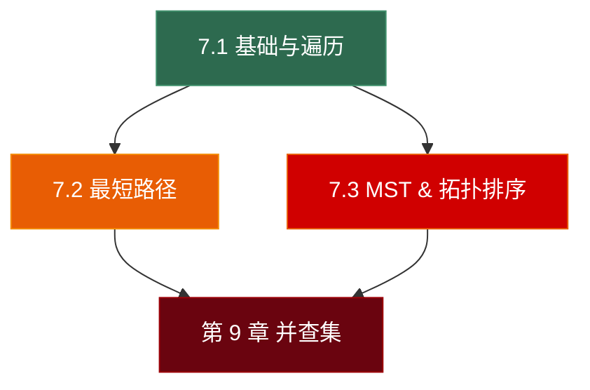

# 第七章 图 (Graph) —— 总览与导航

> **一句话理解**：前面六章的数据结构（数组、链表、栈、队列、哈希表、树）都是**特殊的图**——树是无环连通图，链表是每个节点度为 1 的图。图是最通用的非线性结构，它用**节点 (Vertex)** 和**边 (Edge)** 描述任意对象之间的关系。

---

## 为什么图需要三篇？

图的考点覆盖范围极广——从基础的 BFS/DFS 到复杂的最短路径算法，再到最小生成树和拓扑排序。三篇的分工：

| 子章节 | 聚焦主题 | 对应面试层次 |
|--------|---------|-------------|
| **7.1** 图的表示与遍历 | 存储方式 + BFS/DFS + 连通性/环检测 | 基础（必会）|
| **7.2** 最短路径 | Dijkstra / Bellman-Ford / Floyd / A* | 进阶（高频）|
| **7.3** 最小生成树 & 拓扑排序 | Prim / Kruskal + Kahn / DFS 拓扑 | 进阶（高频）|

> 💡 **并查集 (Union-Find)** 是独立的第 9 章。虽然 Kruskal 算法用到了并查集，但并查集本身是一个独立的数据结构，有自己的面试高频题和优化策略，值得单独成章。

---

## 图的应用全景

| 领域 | 图模型 | 算法 |
|------|--------|------|
| 社交网络 | 用户 = 节点，好友关系 = 边 | BFS 找六度分隔、推荐好友 |
| 地图导航 | 路口 = 节点，道路 = 带权边 | Dijkstra / A* 最短路径 |
| 课程选修 | 课程 = 节点，前置依赖 = 有向边 | 拓扑排序 |
| 网络路由 | 路由器 = 节点，链路 = 边 | 最小生成树 (Prim / Kruskal) |
| 编译器 | 变量 = 节点，依赖 = 边 | 强连通分量 / 死代码消除 |
| **游戏寻路** | 地图格子 = 节点，可通行 = 边 | **A\* / Navigation Mesh** |
| **技能依赖** | 技能 = 节点，前置要求 = 有向边 | **拓扑排序 / DFS** |
| **地图生成** | 房间 = 节点，走廊 = 边 | **MST 保证连通 + 随机化** |

---

## 章节导航

### 📗 [7.1 图的表示与遍历](./07_01_graph_basics)

> 从图的分类（有/无向、有/无权、稀疏/稠密）到两种存储方式（邻接矩阵 / 邻接表），掌握 BFS 和 DFS 的完整实现，以及连通分量、环检测等基础算法。

**核心内容**：
- 图的术语：顶点、边、度、路径、环、连通性
- 有向图 vs 无向图 vs 加权图
- 邻接矩阵 vs 邻接表（存储选择的工程考量）
- BFS（广度优先搜索）—— 最短路径（无权图）、层序遍历
- DFS（深度优先搜索）—— 连通分量、环检测、路径搜索
- **面试题**：LC 200 岛屿数量、LC 133 克隆图、LC 207 课程表（环检测）、LC 994 腐烂的橘子、LC 417 太平洋大西洋水流、LC 797 所有路径
- 🎮 NavMesh 的图表示、地图格子的隐式邻接关系

---

### 📘 [7.2 最短路径：Dijkstra & A*](./07_02_shortest_path)

> 从单源最短路径（Dijkstra / Bellman-Ford）到多源最短路径（Floyd-Warshall），以及游戏寻路的核心算法 A*。

**核心内容**：
- Dijkstra 算法（贪心 + 最小堆）—— 非负权单源最短路
- Bellman-Ford 算法 —— 支持负权边、检测负环
- Floyd-Warshall 算法 —— 多源最短路径（DP）
- **A\* 算法**（启发式搜索）—— 启发函数设计（Manhattan / Euclidean / Chebyshev）、Admissible & Consistent
- 四种算法的适用场景与时空复杂度对比
- **面试题**：LC 743 网络延迟时间、LC 787 最便宜的航班、LC 1514 最大概率路径
- 🎮 **A\* 寻路**（最核心应用）、Jump Point Search 优化、多层 NavMesh、动态避障

---

### 📙 [7.3 最小生成树 & 拓扑排序](./07_03_mst_topo)

> 最小生成树（Kruskal / Prim）保证用最小代价连通所有节点；拓扑排序（Kahn / DFS）为 DAG 排列出合法执行顺序。

**核心内容**：
- Kruskal 算法（贪心 + 并查集）—— 从边出发，按权重排序
- Prim 算法（贪心 + 最小堆）—— 从点出发，类似 Dijkstra
- Kruskal vs Prim：稀疏图用 Kruskal，稠密图用 Prim
- 拓扑排序 —— Kahn 算法（BFS + 入度）与 DFS 后序反转
- DAG 判定（有环 → 拓扑排序失败）
- **面试题**：LC 1584 连接所有点的最小费用、LC 210 课程表 II（拓扑序列）、LC 310 最小高度树、LC 269 外星字典
- 🎮 技能树/科技树（DAG + 拓扑排序）、任务链前置依赖、地图随机生成（MST 连通保证）、资源加载依赖图

---

## 阅读建议

- **面试急救**：7.1（BFS/DFS 必会）→ 7.3 拓扑排序（课程表系列高频）→ 7.2 Dijkstra
- **系统掌握**：7.1 → 7.2 → 7.3 顺序阅读
- **游戏开发**：7.1 基础 → 7.2 A* 寻路 → 7.3 技能树/地图生成

---

## 面试题全景预览

| 子章节 | 高频面试题 | 数量 |
|--------|-----------|------|
| 7.1 基础与遍历 | 岛屿数量、克隆图、课程表(环检测)、腐烂的橘子 | ~10 题 |
| 7.2 最短路径 | 网络延迟、最便宜航班、A* 寻路设计 | ~8 题 |
| 7.3 MST & 拓扑排序 | 最小费用连接、课程表II、外星字典 | ~8 题 |
| **合计** | | **~26 题** |

> 💡 图的面试题数量不如树多，但**难度更高**。BFS/DFS 是基础中的基础（必须秒杀），Dijkstra 和拓扑排序是进阶高频，A* 在游戏面试中几乎必问。

---

## 图 vs 树 —— 关键区别速查

| 维度 | 树 | 图 |
|------|-----|-----|
| 环 | **无环** | 可以有环 |
| 连通性 | 连通（一棵树）| 可能不连通（多个连通分量）|
| 根节点 | 有唯一根 | 没有根的概念 |
| 边数 | n - 1（n 个节点）| 0 到 n(n-1)/2 |
| 父子关系 | 每个节点有唯一父节点 | 没有固定父子关系 |
| 遍历 | 前/中/后序 + 层序 | BFS + DFS（需要 visited 标记）|

> 💡 **树是图的特例**：n 个节点、n-1 条边、无环、连通 → 这四个条件中任意三个成立，第四个自动成立。面试偶尔会考这个性质。

---

## 全系列章节导航

| 章节 | 主题 | 状态 |
|------|------|------|
| 1-5 | 数组、链表、栈、队列、哈希表 | ✅ |
| **6 (5篇)** | 树 | ✅ |
| **7 (3篇)** | **图** ← 当前 | 🔨 |
| 8 | 字典树 (Trie) | ⬜ |
| 9 | 并查集 (Union-Find) | ⬜ |
| 10 | 数据结构选型指南 | ⬜ |

---

> 📖 上一章：[第六章 树：层级世界的骨架](../tree/)
>
> 📖 下一章：[第八章 字典树：前缀的力量](../08_trie) — 前缀共享、Trie 实现、单词搜索、自动补全与游戏敏感词过滤。
