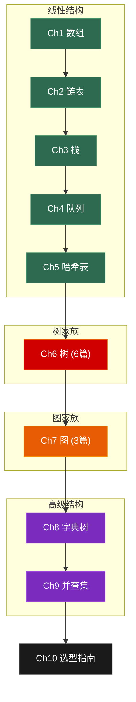
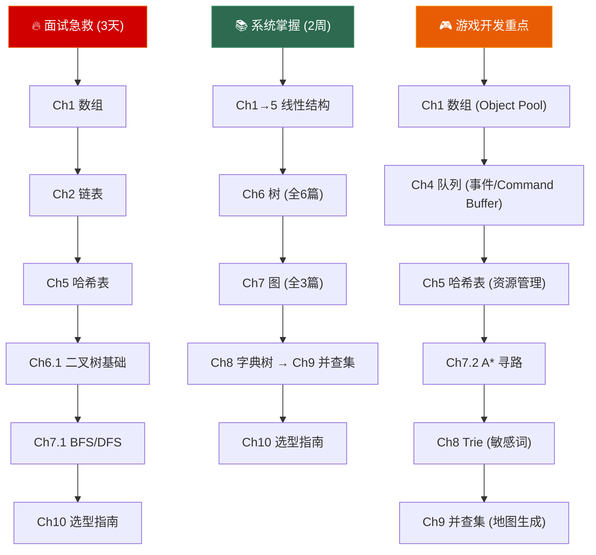

# 数据结构面试突击 —— 全系列导航

> **一句话理解**：这是一套面向面试的 C++17 数据结构笔记。10 章 17 篇，从最朴素的数组到最通用的图，每章都包含**底层实现剖析 → 复杂度速查 → 高频面试题 → 游戏实战场景**四大模块。不背八股，只讲本质。

---

## 系列全景

---

## 章节导航

### 📗 基础线性结构 (Ch 1–5)

线性结构是一切的起点。数组和链表是底层基石，栈和队列是行为约束的抽象，哈希表是"空间换时间"的极致。

---

#### [第一章 数组：最朴素的力量](./01_array/)

> 从连续内存到缓存行，从 `std::vector` 三指针到 Object Pool，一文吃透数组的底层、考法和游戏实战。

**核心内容**：
- `std::array` / `std::vector` 底层结构与扩容策略
- 迭代器失效的完整规则
- 手写环形缓冲区 (Ring Buffer)
- **面试技巧**：双指针、滑动窗口、前缀和、二分查找
- 🎮 Object Pool、Vertex Buffer、ECS 中的 SoA 布局

---

#### [第二章 链表：指针的艺术](./02_linked_list/)

> 从单链表到侵入式链表，从 Floyd 环检测到 LRU Cache，掌握指针操作的精髓。

**核心内容**：
- 单链表 / 双链表 / 循环链表 / 侵入式链表
- `std::list` 双向环状链表实现解析
- **面试技巧**：反转链表、快慢指针、合并 K 链表、LRU Cache
- 🎮 Free List 内存管理、实体管理、UI 渲染层级

---

#### [第三章 栈：后进先出的秩序](./03_stack/)

> LIFO 不只是一种数据结构，更是一种思维方式——从函数调用栈到单调栈，栈无处不在。

**核心内容**：
- `std::stack` 适配器模式（底层 `deque` / `vector` / `list`）
- 单调栈专题
- **面试技巧**：有效括号、最小栈、每日温度、柱状图最大矩形
- 🎮 UI 界面栈、Undo/Redo (Command Pattern + 双栈)、GameState Stack

---

#### [第四章 队列与优先队列：先来后到的公平](./04_queue/)

> 从 FIFO 到双端队列，从优先队列到单调队列——队列是 BFS、事件系统和 A\* 寻路的共同基础。

**核心内容**：
- `std::deque` 分段连续内存架构
- `std::priority_queue` 底层堆实现
- 单调队列 (Monotonic Queue)
- **面试技巧**：BFS 层序遍历、滑动窗口最大值、Top-K、任务调度器
- 🎮 事件系统 Event Queue、网络消息缓冲、渲染 Command Buffer

---

#### [第五章 哈希表：空间换时间的极致](./05_hash_table/)

> Key → Hash → Index，三步到位。O(1) 查找的背后是精妙的哈希函数设计与冲突解决策略。

**核心内容**：
- 哈希函数设计（取模 / FNV / MurmurHash）
- 冲突解决（链地址法 vs 开放寻址 vs Robin Hood Hashing）
- `std::unordered_map` 桶数组 + 链表、负载因子与 rehash
- **面试技巧**：两数之和、字母异位词分组、最长无重复子串
- 🎮 Resource Manager、Spatial Hashing 碰撞检测、配置表热加载

---

### 📘 树家族 (Ch 6 · 6 篇)

树是面试中考查密度最高的数据结构。从二叉树基础到线段树进阶，从 BST 到红黑树，六篇全覆盖。

#### [第六章 树：层级世界的骨架 — 总览与导航](./tree/index/)

> 树的六个子章节：二叉树基础与遍历、BST、平衡树（AVL & 红黑树）、堆与优先队列、线段树与树状数组、游戏引擎实战。共计覆盖 50+ 道高频面试题。

| 子章节 | 主题 | 面试权重 |
|--------|------|---------|
| 6.1 | 二叉树基础与遍历 | ★★★★★ |
| 6.2 | 二叉搜索树 BST | ★★★★☆ |
| 6.3 | 平衡树：AVL & 红黑树 | ★★★☆☆ |
| 6.4 | 堆与优先队列 | ★★★★☆ |
| 6.5 | 线段树 & 树状数组 | ★★☆☆☆ |
| 6.6 | 实战场景：场景树、骨骼动画与定时器 | ★★★☆☆ |

---

### 📙 图家族 (Ch 7 · 3 篇)

图是最通用的非线性结构——社交网络、地图导航、任务依赖、游戏寻路，一切"关系"都可以用图建模。

#### [第七章 图：万物皆可连 — 总览与导航](./graph/index/)

> 图的三个子章节：图的表示与遍历（BFS/DFS）、最短路径（Dijkstra/A\*）、最小生成树与拓扑排序。共计覆盖 26+ 道高频面试题。

| 子章节 | 主题 | 面试权重 |
|--------|------|---------|
| 7.1 | 图的表示与遍历 | ★★★★★ |
| 7.2 | 最短路径：Dijkstra & A\* | ★★★★☆ |
| 7.3 | 最小生成树 & 拓扑排序 | ★★★★☆ |

---

### 📕 高级结构 (Ch 8–9)

字典树和并查集是两种"专精"型数据结构——各自在特定问题上有不可替代的优势。

---

#### [第八章 字典树：前缀的力量](./08_trie/)

> 前缀共享、空间换时间。Trie 是自动补全、敏感词过滤和 IP 路由的共同基础。

**核心内容**：
- 标准 Trie / 压缩 Trie (Radix Tree)
- `unordered_map<char, TrieNode*>` vs `TrieNode* children[26]` 实现对比
- **面试技巧**：实现 Trie、单词搜索 II (Trie + DFS)、设计搜索自动补全
- 🎮 聊天敏感词过滤 (AC 自动机)、控制台命令补全、资源路径前缀索引

---

#### [第九章 并查集：找老大](./09_union_find/)

> "你和谁是一组的？"——并查集用近乎 O(1) 的时间回答连通性问题。

**核心内容**：
- Quick Find vs Quick Union、路径压缩、按秩合并
- 反阿克曼函数 α(n) 复杂度分析
- 带权并查集
- **面试技巧**：连通分量数、冗余连接、账户合并、等式方程的可满足性
- 🎮 地图连通性、公会合并、动态地图生成、Kruskal MST 的核心组件

---

### 📓 总结篇 (Ch 10)

#### [第十章 数据结构选型指南：一图定乾坤](./10_selection_guide/)

> 9 大数据结构全局横评——复杂度、内存、缓存友好性一表打尽；决策流程图秒定选型；游戏系统映射速查；30 秒结构化答题模板。

**核心内容**：
- 九大数据结构复杂度 × 内存 × 缓存友好性大横评
- Mermaid 决策流程图：一步选定数据结构
- 游戏系统 → 数据结构映射速查表（20+ 个系统）
- 经典组合拆解：LRU Cache、A\*、AC 自动机、对顶堆
- 面试 30 秒结构化答题模板
- STL 容器一页速查

---

## 系列特色

| 特色 | 说明 |
|------|------|
| **C++17 实现** | 所有代码均使用 C++17 风格，覆盖 STL 源码级解析 |
| **100+ 面试题** | 覆盖 LeetCode Hot 100 + 剑指 Offer 中的数据结构题目 |
| **Mermaid 图解** | 每个数据结构都有内存布局 / 逻辑结构的可视化图示 |
| **🎮 游戏实战** | 每章都有游戏客户端/引擎的真实应用场景与代码 |
| **复杂度速查** | 每章都有完整的时间 / 空间复杂度对比表 |
| **30 秒速答** | 每章末尾都有面试速答模板 |

---

## 推荐阅读路线

---

## 面试题统计

| 章节 | 题目数 | 难度分布 |
|------|--------|---------|
| Ch1 数组 | ~15 | Easy 40% / Medium 50% / Hard 10% |
| Ch2 链表 | ~12 | Easy 30% / Medium 50% / Hard 20% |
| Ch3 栈 | ~10 | Easy 30% / Medium 50% / Hard 20% |
| Ch4 队列 | ~10 | Easy 20% / Medium 60% / Hard 20% |
| Ch5 哈希表 | ~12 | Easy 30% / Medium 50% / Hard 20% |
| Ch6 树 (6篇) | ~50 | Easy 20% / Medium 50% / Hard 30% |
| Ch7 图 (3篇) | ~26 | Easy 10% / Medium 50% / Hard 40% |
| Ch8 字典树 | ~8 | Medium 50% / Hard 50% |
| Ch9 并查集 | ~8 | Medium 60% / Hard 40% |
| **全系列** | **~150+** | |

> 💡 如果时间有限，优先刷**数组双指针** → **链表反转** → **哈希表两数之和** → **二叉树遍历** → **BFS/DFS 岛屿问题**——这五个专题覆盖了 60% 以上的数据结构面试题。

---

> 📖 本系列全部文章均采用 CC BY-NC-SA 4.0 协议发布。
