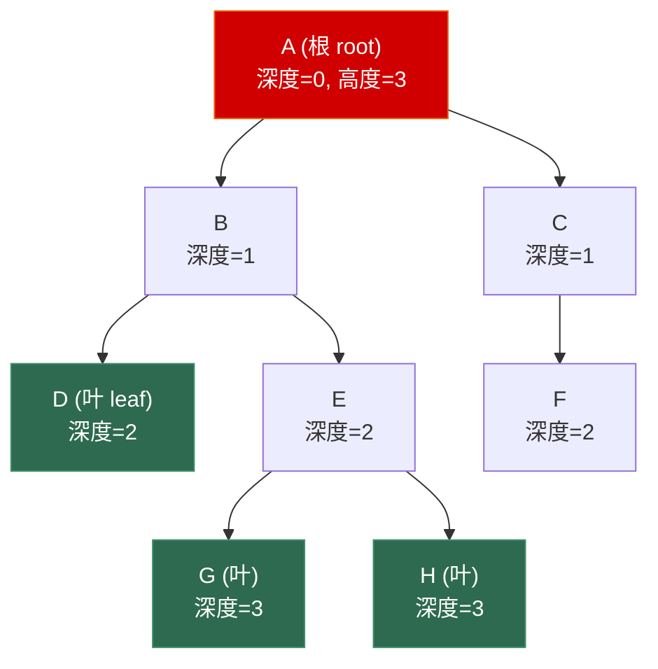
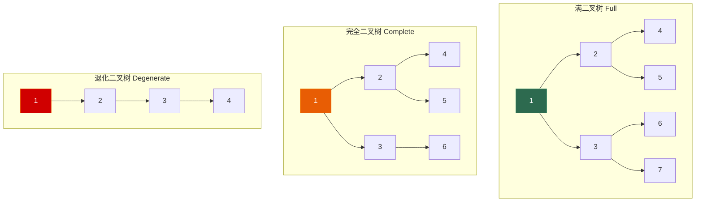
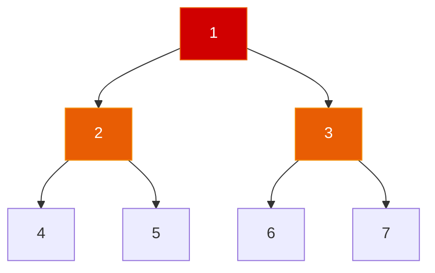

# 6.1 二叉树基础与遍历

> **一句话理解**：二叉树是每个节点**最多有两个子节点**的树结构。它是所有树形数据结构的基石——BST、AVL、红黑树、堆、线段树都是二叉树的特化。

---

## 6.1.1 基本概念

### 树的术语



| 术语 | 定义 | 上图示例 |
|------|------|----------|
| **根 (Root)** | 没有父节点的唯一节点 | A |
| **叶 (Leaf)** | 没有子节点的节点 | D, F, G, H |
| **边 (Edge)** | 父子之间的连线 | A→B, B→E 等 |
| **深度 (Depth)** | 从根到该节点的**边数** | A=0, B=1, G=3 |
| **高度 (Height)** | 从该节点到最远叶子的**边数** | A=3, B=2, D=0 |
| **度 (Degree)** | 节点的子节点个数 | A 的度=2, D 的度=0 |
| **子树 (Subtree)** | 以某节点为根的树 | B 的子树包含 B,D,E,G,H |
| **层 (Level)** | 深度相同的节点集合 | Level 2 = {D, E, F} |
| **n 个节点的树** | 恰好有 n-1 条边 | 上图 8 节点, 7 边 |

> 💡 **深度 vs 高度**：深度从**上往下数**（根的深度=0），高度从**下往上数**（叶的高度=0）。面试中经常搞混，一定要先和面试官确认定义（有些教材根的深度=1）。

### 二叉树的特殊形态



| 类型 | 定义 | 节点数与高度关系 |
|------|------|-----------------|
| **满二叉树** (Full/Perfect) | 每层都**完全填满** | n = 2^(h+1) - 1 |
| **完全二叉树** (Complete) | 除最后一层外全满，最后一层**从左到右**连续 | 堆的前提条件，可用数组存储 |
| **退化二叉树** (Degenerate) | 每个节点只有一个子节点 → **链表** | h = n - 1（最坏情况）|
| **平衡二叉树** (Balanced) | 任何节点的左右子树高度差 ≤ 1 | h = O(log n) |

### 二叉树的存储方式

**方式一：链式存储**（最常用）

```cpp
struct TreeNode {
    int val;
    TreeNode* left;
    TreeNode* right;
    TreeNode(int x) : val(x), left(nullptr), right(nullptr) {}
};
```

**方式二：数组存储**（完全二叉树专用，堆就是这样做的）

```
对于下标 i 的节点（0-indexed）：
  父节点:   (i - 1) / 2
  左子节点: 2 * i + 1
  右子节点: 2 * i + 2

数组表示: [1, 2, 3, 4, 5, 6]
对应的树:
        1
       / \
      2   3
     / \ /
    4  5 6
```

> 💡 **数组存储的局限**：如果二叉树不是完全二叉树，数组中会有大量空洞（用特殊标记填充），浪费内存。所以一般只有**堆**使用数组存储，普通二叉树都用链式。

### 二叉树的节点数公式

面试中偶尔会考这些数学关系：

| 条件 | 公式 |
|------|------|
| n 个节点的二叉树 | 边数 = n - 1 |
| 高度为 h 的满二叉树 | n = 2^(h+1) - 1 |
| n 个节点的完全二叉树 | 高度 h = ⌊log₂ n⌋ |
| 度为 0 的节点数 n₀（叶节点） | n₀ = n₂ + 1（n₂ 是度为 2 的节点数）|

> 💡 **n₀ = n₂ + 1** 是一个优雅的公式：在任何二叉树中，叶节点数 = 度为 2 的节点数 + 1。面试偶尔会直接问这个。

---

## 6.1.2 结构图解 —— 四种遍历顺序

对于以下二叉树：



```
四种遍历结果：

前序 (Pre-order):  根 → 左 → 右  →  [1, 2, 4, 5, 3, 6, 7]
中序 (In-order):   左 → 根 → 右  →  [4, 2, 5, 1, 6, 3, 7]
后序 (Post-order): 左 → 右 → 根  →  [4, 5, 2, 6, 7, 3, 1]
层序 (Level-order): 逐层从左到右 →  [1, 2, 3, 4, 5, 6, 7]
```

**记忆方法**：

- **前/中/后** 指的是 **根** 在遍历中的位置（前=根先，中=根中间，后=根最后）
- **左永远在右前面**，只有根的位置变化

```
前序：根 [左子树] [右子树]     ← 根在最前
中序：[左子树] 根 [右子树]     ← 根在中间
后序：[左子树] [右子树] 根     ← 根在最后
```

> 💡 **中序遍历的特殊性**：对 BST 做中序遍历，结果天然**有序**（从小到大）。这是 BST 最核心的性质，也是大量面试题的基础。

---

## 6.1.3 C++ 实现 —— 递归遍历

### 前序遍历 (Pre-order)

```cpp
struct TreeNode {
    int val;
    TreeNode* left;
    TreeNode* right;
    TreeNode(int x) : val(x), left(nullptr), right(nullptr) {}
};

// 递归版——最直觉
void preorder(TreeNode* root, std::vector<int>& result) {
    if (!root) return;
    result.push_back(root->val);  // 根
    preorder(root->left, result);  // 左
    preorder(root->right, result); // 右
}

// 包装版
std::vector<int> preorderTraversal(TreeNode* root) {
    std::vector<int> result;
    preorder(root, result);
    return result;
}
```

### 中序遍历 (In-order)

```cpp
void inorder(TreeNode* root, std::vector<int>& result) {
    if (!root) return;
    inorder(root->left, result);   // 左
    result.push_back(root->val);   // 根
    inorder(root->right, result);  // 右
}
```

### 后序遍历 (Post-order)

```cpp
void postorder(TreeNode* root, std::vector<int>& result) {
    if (!root) return;
    postorder(root->left, result);  // 左
    postorder(root->right, result); // 右
    result.push_back(root->val);    // 根
}
```

**递归遍历的本质**：

```
三种遍历的代码完全一样，只是 result.push_back 的位置不同！

preorder:   push → left → right
inorder:    left → push → right
postorder:  left → right → push
```

> 💡 **递归的代价**：递归深度 = 树的高度 h。对于平衡树 h = O(log n)，但退化树 h = O(n)，可能导致**栈溢出**。面试中如果树可能很深，面试官会追问"能不能用迭代实现？"

### 层序遍历 (Level-order)

层序遍历不是递归（DFS），而是**BFS**——使用队列：

```cpp
std::vector<std::vector<int>> levelOrder(TreeNode* root) {
    std::vector<std::vector<int>> result;
    if (!root) return result;

    std::queue<TreeNode*> q;
    q.push(root);

    while (!q.empty()) {
        int level_size = q.size();  // 关键：当前层的节点数
        std::vector<int> level;

        for (int i = 0; i < level_size; ++i) {
            TreeNode* node = q.front();
            q.pop();

            level.push_back(node->val);

            if (node->left)  q.push(node->left);
            if (node->right) q.push(node->right);
        }

        result.push_back(std::move(level));
    }
    return result;
}
// 时间 O(n), 空间 O(n)
```

> 这道题在第 4 章（队列）已经出现过，这里再次出现说明了**层序遍历 = BFS = 队列**的三位一体关系。

---

## 6.1.4 C++ 实现 —— 迭代遍历（用栈模拟递归）

递归的本质是利用系统**调用栈**。我们可以用一个**显式栈**来模拟，避免递归深度限制。

### 前序遍历 —— 迭代

```cpp
std::vector<int> preorderIterative(TreeNode* root) {
    std::vector<int> result;
    if (!root) return result;

    std::stack<TreeNode*> stk;
    stk.push(root);

    while (!stk.empty()) {
        TreeNode* node = stk.top();
        stk.pop();

        result.push_back(node->val);  // 根

        // 先压右，再压左 → 出栈时左先于右
        if (node->right) stk.push(node->right);
        if (node->left)  stk.push(node->left);
    }
    return result;
}
```

> 💡 **先压右再压左**：栈是 LIFO，所以先压右子节点，出栈时左子节点先出来，恰好满足"根→左→右"的前序顺序。

### 中序遍历 —— 迭代

中序的迭代写法比前序更复杂，需要一直往左走到底：

```cpp
std::vector<int> inorderIterative(TreeNode* root) {
    std::vector<int> result;
    std::stack<TreeNode*> stk;
    TreeNode* curr = root;

    while (curr || !stk.empty()) {
        // 一路向左，把沿途节点全压栈
        while (curr) {
            stk.push(curr);
            curr = curr->left;
        }

        // 弹出栈顶 = 当前最左的未处理节点
        curr = stk.top();
        stk.pop();
        result.push_back(curr->val);  // 处理根

        // 转向右子树
        curr = curr->right;
    }
    return result;
}
```

**图解**（树 `[1, 2, 3, 4, 5]`）：

```
        1
       / \
      2   3
     / \
    4   5

执行过程：
1. curr=1, 一路向左: push 1, push 2, push 4, curr=null
2. pop 4 → result=[4], curr=4.right=null
3. pop 2 → result=[4,2], curr=2.right=5
4. push 5, curr=5.left=null
5. pop 5 → result=[4,2,5], curr=5.right=null
6. pop 1 → result=[4,2,5,1], curr=1.right=3
7. push 3, curr=3.left=null
8. pop 3 → result=[4,2,5,1,3], curr=3.right=null
9. 栈空且 curr=null → 结束

结果: [4, 2, 5, 1, 3] ✅ (中序)
```

### 后序遍历 —— 迭代

后序最复杂。有一个巧妙的技巧：**后序 = 反转的"根右左"**。

```cpp
// 方法一：反转法（最易理解）
// 后序 = 左右根  ←→  反转（根右左）
std::vector<int> postorderIterative(TreeNode* root) {
    std::vector<int> result;
    if (!root) return result;

    std::stack<TreeNode*> stk;
    stk.push(root);

    while (!stk.empty()) {
        TreeNode* node = stk.top();
        stk.pop();

        result.push_back(node->val);  // 根

        // 先压左，再压右 → 出栈时右先于左 → "根右左"
        if (node->left)  stk.push(node->left);
        if (node->right) stk.push(node->right);
    }

    // 反转得到 "左右根"
    std::reverse(result.begin(), result.end());
    return result;
}
```

```cpp
// 方法二：标记法（真正的后序，无需反转）
std::vector<int> postorderIterative_v2(TreeNode* root) {
    std::vector<int> result;
    std::stack<TreeNode*> stk;
    TreeNode* curr = root;
    TreeNode* last_visited = nullptr;

    while (curr || !stk.empty()) {
        // 一路向左
        while (curr) {
            stk.push(curr);
            curr = curr->left;
        }

        TreeNode* top = stk.top();

        // 如果右子树存在且未被访问过 → 先处理右子树
        if (top->right && top->right != last_visited) {
            curr = top->right;
        } else {
            // 右子树不存在或已处理 → 访问当前节点
            result.push_back(top->val);
            last_visited = top;
            stk.pop();
        }
    }
    return result;
}
```

> 💡 **面试中的选择**：前序迭代最简单（直接栈模拟），中序迭代是标准模板（一路向左），后序迭代最难（推荐反转法，写起来快且不容易出错）。

### 统一模板 —— 标记法（可选进阶）

有一种统一的迭代模板可以同时处理三种遍历，通过一个 `bool` 标记区分"已展开"和"未展开"的节点：

```cpp
// 统一迭代模板（以中序为例）
std::vector<int> unified_inorder(TreeNode* root) {
    std::vector<int> result;
    if (!root) return result;

    // pair<节点, 是否已标记>
    std::stack<std::pair<TreeNode*, bool>> stk;
    stk.push({root, false});

    while (!stk.empty()) {
        auto [node, visited] = stk.top();
        stk.pop();

        if (visited) {
            result.push_back(node->val);  // 已标记的直接输出
        } else {
            // 按 "右 → 根(标记) → 左" 入栈（栈是 LIFO，反过来就是中序）
            if (node->right) stk.push({node->right, false});
            stk.push({node, true});  // 标记当前节点
            if (node->left)  stk.push({node->left, false});
        }
    }
    return result;
}

// 前序只需改入栈顺序:  右 → 左 → 根(标记)
// 后序只需改入栈顺序:  根(标记) → 右 → 左
```

---

## 6.1.5 Morris 遍历 —— O(1) 空间的极致

Morris 遍历是面试中的"加分项"——在 O(1) 额外空间（不用栈、不用递归）的前提下完成中序遍历。核心思想：利用叶节点的空闲指针（`right = nullptr`）临时指回前驱节点，形成**线索 (Thread)**。

### Morris 中序遍历

```cpp
std::vector<int> morrisInorder(TreeNode* root) {
    std::vector<int> result;
    TreeNode* curr = root;

    while (curr) {
        if (!curr->left) {
            // 没有左子树：直接访问，转右
            result.push_back(curr->val);
            curr = curr->right;
        } else {
            // 有左子树：找前驱（左子树的最右节点）
            TreeNode* predecessor = curr->left;
            while (predecessor->right && predecessor->right != curr) {
                predecessor = predecessor->right;
            }

            if (!predecessor->right) {
                // 第一次到达：建立线索 → 前驱的 right 指向 curr
                predecessor->right = curr;
                curr = curr->left;  // 进入左子树
            } else {
                // 第二次到达：说明左子树已遍历完，断开线索
                predecessor->right = nullptr;  // 恢复原状
                result.push_back(curr->val);   // 访问根
                curr = curr->right;            // 进入右子树
            }
        }
    }
    return result;
}
// 时间 O(n), 空间 O(1)
```

**图解**（树 `[4, 2, 6, 1, 3, 5, 7]`）：

```
初始:       4
           / \
          2   6
         / \ / \
        1  3 5  7

Step 1: curr=4, 找左子树的最右节点 = 3
        3.right = null → 建立线索: 3→4
        curr 进入左子树 → curr=2

Step 2: curr=2, 找左子树的最右节点 = 1
        1.right = null → 建立线索: 1→2
        curr 进入左子树 → curr=1

Step 3: curr=1, 没有左子树
        输出 1, curr=1.right=2 (线索！)

Step 4: curr=2, 找前驱 = 1, 1.right=2=curr → 第二次到达
        断开线索: 1.right=null
        输出 2, curr=2.right=3

Step 5: curr=3, 没有左子树
        输出 3, curr=3.right=4 (线索！)

Step 6: curr=4, 找前驱 = 3, 3.right=4=curr → 第二次到达
        断开线索: 3.right=null
        输出 4, curr=4.right=6

... 右子树同理 ...

结果: [1, 2, 3, 4, 5, 6, 7] ✅ (中序)
```

**Morris 遍历的本质**：

| 步骤 | 操作 |
|------|------|
| 找前驱 | 当前节点的左子树的**最右**节点 = 中序遍历的**前一个**节点 |
| 第一次到达 | 前驱的 right 为 null → 建立线索（`predecessor->right = curr`）|
| 第二次到达 | 前驱的 right 指回 curr → 说明左子树已遍历完 → 断开线索、访问根 |

> 💡 **面试中何时提 Morris？** 当面试官问"能不能 O(1) 空间遍历二叉树？"时。Morris 遍历修改了树的结构（临时建线索），但遍历完后树会**完全恢复**原状。在只读场景下不能使用。

---

## 6.1.6 面试高频题

### 最大深度 (LeetCode 104)

> 给定二叉树，找出其最大深度（根到最远叶节点的路径长度）。

**面试中最简单的树题**，也是递归思维的入门：

```cpp
int maxDepth(TreeNode* root) {
    if (!root) return 0;
    return 1 + std::max(maxDepth(root->left), maxDepth(root->right));
}
// 时间 O(n), 空间 O(h)——递归栈深度
```

> 💡 **这道题的递归思维**：「一棵树的最大深度 = 1 + max(左子树深度, 右子树深度)」。树的递归问题几乎都是这个模式：**把问题分解到子树，然后合并子树的答案**。

### 对称二叉树 (LeetCode 101)

> 检查二叉树是否是镜像对称的。

```cpp
bool isSymmetric(TreeNode* root) {
    return _isMirror(root, root);
}

bool _isMirror(TreeNode* t1, TreeNode* t2) {
    if (!t1 && !t2) return true;
    if (!t1 || !t2) return false;
    return t1->val == t2->val
        && _isMirror(t1->left, t2->right)   // 外侧对称
        && _isMirror(t1->right, t2->left);   // 内侧对称
}
// 时间 O(n), 空间 O(h)
```

> 💡 **镜像对称 = 左的左 == 右的右 AND 左的右 == 右的左**。这种"双指针递归"的模式在 LC 100（相同的树）中也会出现。

### 翻转二叉树 (LeetCode 226)

> 翻转一棵二叉树（左右子树互换）。

Google 面试拒掉了 Homebrew 的作者 Max Howell，理由就是这道题——虽然简单，但面试中依然高频。

```cpp
TreeNode* invertTree(TreeNode* root) {
    if (!root) return nullptr;
    std::swap(root->left, root->right);  // 交换左右子树
    invertTree(root->left);               // 递归翻转新的左子树
    invertTree(root->right);              // 递归翻转新的右子树
    return root;
}
// 时间 O(n), 空间 O(h)
```

### 路径总和 (LeetCode 112)

> 给定一棵二叉树和一个目标和，判断是否存在**从根到叶**的路径，使得路径上所有值之和等于目标和。

```cpp
bool hasPathSum(TreeNode* root, int targetSum) {
    if (!root) return false;

    // 叶节点：检查剩余值是否为 0
    if (!root->left && !root->right) {
        return targetSum == root->val;
    }

    int remaining = targetSum - root->val;
    return hasPathSum(root->left, remaining)
        || hasPathSum(root->right, remaining);
}
// 时间 O(n), 空间 O(h)
```

**进阶**：LC 113（路径总和 II）要求返回所有满足条件的路径 → 回溯法：

```cpp
void _pathSum(TreeNode* node, int remaining,
              std::vector<int>& path,
              std::vector<std::vector<int>>& result)
{
    if (!node) return;

    path.push_back(node->val);
    remaining -= node->val;

    if (!node->left && !node->right && remaining == 0) {
        result.push_back(path);  // 找到一条路径
    }

    _pathSum(node->left, remaining, path, result);
    _pathSum(node->right, remaining, path, result);

    path.pop_back();  // 回溯！
}

std::vector<std::vector<int>> pathSum(TreeNode* root, int targetSum) {
    std::vector<std::vector<int>> result;
    std::vector<int> path;
    _pathSum(root, targetSum, path, result);
    return result;
}
```

### 二叉树的直径 (LeetCode 543)

> 二叉树的直径 = 任意两节点之间路径的**最长长度**（不一定经过根）。

```cpp
int diameterOfBinaryTree(TreeNode* root) {
    int diameter = 0;
    _depth(root, diameter);
    return diameter;
}

int _depth(TreeNode* node, int& diameter) {
    if (!node) return 0;

    int left = _depth(node->left, diameter);
    int right = _depth(node->right, diameter);

    // 经过当前节点的最长路径 = 左深度 + 右深度
    diameter = std::max(diameter, left + right);

    return 1 + std::max(left, right);  // 返回深度给父节点
}
// 时间 O(n), 空间 O(h)
```

> 💡 **关键洞察**：直径不一定经过根！但每条路径一定有一个"最高点"——我们在每个节点处计算"经过它的最长路径 = 左深度 + 右深度"，取全局最大值。

### 最近公共祖先 LCA (LeetCode 236)

> 给定二叉树和两个节点 p、q，找出它们的最近公共祖先。

```cpp
TreeNode* lowestCommonAncestor(TreeNode* root, TreeNode* p, TreeNode* q) {
    // base case
    if (!root || root == p || root == q) return root;

    TreeNode* left = lowestCommonAncestor(root->left, p, q);
    TreeNode* right = lowestCommonAncestor(root->right, p, q);

    // 情况分析:
    // left && right: p 和 q 分布在两侧 → 当前节点就是 LCA
    // left 为空: p 和 q 都在右子树 → 返回 right
    // right 为空: p 和 q 都在左子树 → 返回 left
    if (left && right) return root;
    return left ? left : right;
}
// 时间 O(n), 空间 O(h)
```

**图解**（找 5 和 4 的 LCA）：

```
        3
       / \
      5   1
     / \ / \
    6  2 0  8
      / \
     7   4

lowestCommonAncestor(3, 5, 4):
  left  = lowestCommonAncestor(5, 5, 4) → 返回 5（root == p）
  right = lowestCommonAncestor(1, 5, 4) → 返回 null
  left 非空, right 空 → 返回 left = 5

答案: 5（因为 4 在 5 的子树内，5 本身就是 LCA）
```

> 💡 **面试变体**：LC 235（BST 的 LCA）更简单——利用 BST 的有序性质，比较 p、q 和 root 的大小关系即可，不需要遍历所有节点。

### 从前序和中序构建二叉树 (LeetCode 105)

> 给定前序和中序遍历序列，构造对应的二叉树。

**核心原理**：
- 前序的第一个元素 = 根节点
- 在中序中找到根的位置 → 左边是左子树、右边是右子树
- 递归构建

```cpp
TreeNode* buildTree(std::vector<int>& preorder, std::vector<int>& inorder) {
    // 用哈希表加速中序中的查找
    std::unordered_map<int, int> in_map;
    for (int i = 0; i < static_cast<int>(inorder.size()); ++i) {
        in_map[inorder[i]] = i;
    }

    int pre_idx = 0;
    return _build(preorder, pre_idx, in_map, 0, inorder.size() - 1);
}

TreeNode* _build(std::vector<int>& preorder, int& pre_idx,
                 std::unordered_map<int, int>& in_map,
                 int in_left, int in_right)
{
    if (in_left > in_right) return nullptr;

    int root_val = preorder[pre_idx++];
    TreeNode* root = new TreeNode(root_val);

    int in_root = in_map[root_val];  // 根在中序中的位置

    // 先构建左子树（前序中左子树紧跟在根后面）
    root->left  = _build(preorder, pre_idx, in_map, in_left, in_root - 1);
    root->right = _build(preorder, pre_idx, in_map, in_root + 1, in_right);

    return root;
}
// 时间 O(n), 空间 O(n)
```

**图解**：

```
preorder = [3, 9, 20, 15, 7]
inorder  = [9, 3, 15, 20, 7]

Step 1: 前序第一个 = 3 → 根
        在中序中找 3 → 位置 1
        中序左子树: [9]     中序右子树: [15, 20, 7]

Step 2: 前序下一个 = 9 → 左子树的根
        在中序中找 9 → 位置 0
        [9] 左右都为空 → 叶节点

Step 3: 前序下一个 = 20 → 右子树的根
        在中序中找 20 → 位置 3
        左: [15]  右: [7]

结果:    3
        / \
       9  20
         /  \
        15   7
```

> 💡 **面试对称题**：LC 106（中序 + 后序 → 构建树）思路完全一样，只是后序的**最后一个**元素是根，且构建时先右后左。

### 二叉树的序列化与反序列化 (LeetCode 297)

> 设计一个算法，将二叉树序列化为字符串，再从字符串反序列化回原树。

```cpp
class Codec {
public:
    // 前序序列化
    std::string serialize(TreeNode* root) {
        if (!root) return "null,";
        return std::to_string(root->val) + ","
             + serialize(root->left)
             + serialize(root->right);
    }

    // 反序列化
    TreeNode* deserialize(const std::string& data) {
        std::queue<std::string> tokens;
        std::string token;
        for (char c : data) {
            if (c == ',') {
                tokens.push(token);
                token.clear();
            } else {
                token += c;
            }
        }

        return _build(tokens);
    }

private:
    TreeNode* _build(std::queue<std::string>& tokens) {
        if (tokens.empty()) return nullptr;

        std::string val = tokens.front();
        tokens.pop();

        if (val == "null") return nullptr;

        TreeNode* node = new TreeNode(std::stoi(val));
        node->left = _build(tokens);
        node->right = _build(tokens);
        return node;
    }
};
```

> 💡 **为什么用前序？** 前序遍历的特点是**根在最前**，反序列化时第一个元素就是根，然后递归构建左右子树。层序遍历也可以做序列化（用 BFS），但前序的递归写法最简洁。

---

## 6.1.7 面试题速查表

| 题号 | 题目 | 核心技巧 | 难度 |
|------|------|----------|------|
| LC 144 | 前序遍历 | 递归 / 迭代栈 | Easy |
| LC 94 | 中序遍历 | 递归 / 迭代一路向左 | Easy |
| LC 145 | 后序遍历 | 递归 / 反转法 | Easy |
| LC 102 | 层序遍历 | BFS + 队列 | Medium |
| LC 104 | 最大深度 | 递归 `1 + max(left, right)` | Easy |
| LC 111 | 最小深度 | 注意单子节点的情况 | Easy |
| LC 101 | 对称二叉树 | 双指针递归 | Easy |
| LC 226 | 翻转二叉树 | swap + 递归 | Easy |
| LC 112 | 路径总和 | 递归减法 | Easy |
| LC 113 | 路径总和 II | 回溯法 | Medium |
| LC 543 | 二叉树的直径 | 深度递归 + 全局最大 | Easy |
| LC 236 | 最近公共祖先 | 后序递归分情况 | Medium |
| LC 105 | 前中序构建树 | 哈希 + 递归划分 | Medium |
| LC 106 | 中后序构建树 | 同 105，从后往前 | Medium |
| LC 297 | 序列化与反序列化 | 前序 + 递归 | Hard |
| LC 114 | 展开为链表 | 前序 + 原地修改 | Medium |
| LC 199 | 右视图 | 层序每层最后一个 | Medium |
| LC 124 | 最大路径和 | 类似直径 + 全局 max | Hard |

---

## 6.1.8 本节小结

### 核心要点

| 概念 | 要点 |
|------|------|
| **二叉树** | 每个节点最多两个子节点。链式存储为主，完全二叉树可用数组 |
| **前/中/后序** | 三种 DFS 遍历，差异仅在于**根的访问时机** |
| **层序遍历** | BFS + 队列，`level_size` 控制层边界 |
| **迭代遍历** | 用显式栈模拟递归。前序最简单，中序"一路向左"，后序用反转法 |
| **Morris 遍历** | O(1) 空间，利用叶节点的空 right 指针建临时线索 |
| **递归套路** | 树的绝大多数问题 = 分解到子树 + 合并答案（分治思想）|
| **LCA** | 后序遍历 + 分情况判断。BST 版本可利用有序性 O(h) |

### 面试 30 秒速答

> **Q：二叉树的前中后序遍历有什么区别？**
>
> A：三者都是 DFS，区别仅在于**根节点的访问时机**：前序=根先（根左右），中序=根中间（左根右），后序=根最后（左右根）。递归实现几乎相同，只是 `visit(node)` 的位置不同。中序遍历对 BST 特别重要，因为结果天然有序。

> **Q：递归遍历和迭代遍历的区别？**
>
> A：递归利用**系统调用栈**，代码简洁但可能栈溢出（树深度大时）。迭代用**显式栈**模拟递归，不会栈溢出但代码更复杂。Morris 遍历可以做到 **O(1) 空间**，但会临时修改树的结构。

> **Q：如何找两个节点的最近公共祖先？**
>
> A：后序遍历递归：如果当前节点等于 p 或 q 就返回自己；否则在左右子树中分别查找。如果左右都找到了，说明 p 和 q 分布两侧，当前节点就是 LCA；否则返回非空的那一侧。时间 O(n)。

---

> 📖 下一节：[6.2 二叉搜索树 BST](./06_02_bst) —— 从 BST 的有序性质到增删查的完整实现，深入 `std::map` / `std::set` 的底层选型。
