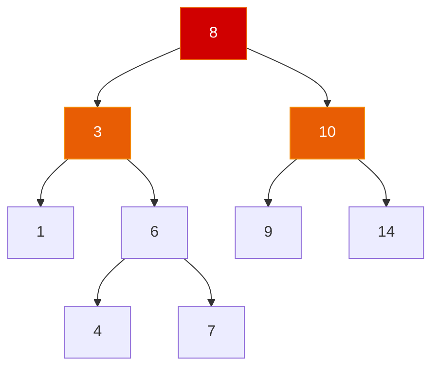

# 6.2 二叉搜索树 (BST)

> **一句话理解**：BST 在二叉树的基础上增加了一条约束——**左子树所有节点 < 根 < 右子树所有节点**。这使得查找、插入、删除都可以像二分查找一样在 O(h) 时间完成。

---

## 6.2.1 概念与性质

### 核心性质

```
对于 BST 中任意节点 node：
  - node.left  子树中所有值 < node.val
  - node.right 子树中所有值 > node.val
  - 左右子树也分别是 BST
```



```
中序遍历: [1, 3, 4, 6, 7, 8, 9, 10, 14] ← 天然有序！
```

### BST 的黄金性质

| 性质 | 说明 | 面试价值 |
|------|------|----------|
| **中序遍历有序** | 对 BST 做中序遍历 → 升序数组 | ★★★★★ 核心 |
| **查找 = 二分** | 每次排除一半节点 → O(h) | ★★★★ |
| **最小值 = 最左** | 一路向左到底 | ★★★ |
| **最大值 = 最右** | 一路向右到底 | ★★★ |
| **前驱/后继** | 中序遍历中的前一个/后一个 | ★★★ |

> 💡 **"中序遍历有序"是 BST 面试题的万能钥匙**。大量 BST 面试题（验证、第 K 小、范围查询、转排序链表）的本质都是利用这条性质。

### BST vs 有序数组 vs 哈希表

| 操作 | 有序数组 | BST (平衡) | 哈希表 |
|------|---------|------------|--------|
| 精确查找 | O(log n) | **O(log n)** | **O(1)** |
| 插入 | **O(n)**（搬移）| **O(log n)** | O(1) |
| 删除 | **O(n)** | **O(log n)** | O(1) |
| 范围查询 | O(log n + k) | **O(log n + k)** | ❌ |
| 有序遍历 | O(n) | O(n) | ❌ |
| 第 K 小/大 | O(1) | **O(log n)** * | ❌ |

> `*` 需要维护子树大小信息（Order-Statistic Tree）

**BST 的定位**：当你需要**动态插删 + 有序查询**时，BST 是唯一选择。有序数组查找快但插删慢，哈希表插删快但不支持有序操作。

---

## 6.2.2 结构图解

### 查找过程

```
查找 key=6：
        8         8 > 6 → 往左
       / \
      3   10      3 < 6 → 往右
     / \
    1   6         6 == 6 → 命中！
       / \
      4   7
```

### 插入过程

```
插入 key=5（找到应该插入的空位）：
        8
       / \
      3   10
     / \   \
    1   6   14
       / \
      4   7
       \
        5  ← 新节点（4 < 5 < 6，放在 4 的右子节点）
```

### 删除的三种情况

```
情况 1：删除叶节点（度=0）→ 直接删除
  删除 1：
        8              8
       / \    →       / \
      3   10         3   10
     / \            / \
    1   6          ×   6

情况 2：删除有一个子节点的节点（度=1）→ 子节点替代
  删除 10：
        8              8
       / \    →       / \
      3   10         3   14
     / \    \       / \
    1   6   14     1   6

情况 3：删除有两个子节点的节点（度=2）→ 用后继替代
  删除 3：
        8              8
       / \    →       / \
      3   10         4   10    ← 用 3 的中序后继(4)替代
     / \            / \
    1   6          1   6
       / \              \
      4   7              7
```

> 💡 **情况 3 是面试的考查重点**。删除度为 2 的节点时，找到它的**中序后继**（右子树的最左节点），用后继的值替换要删除的节点，然后删除后继（后继最多只有一个子节点，回到情况 1 或 2）。也可以用**中序前驱**（左子树的最右节点），效果一样。

---

## 6.2.3 C++ 实现

### 完整 BST 实现

```cpp
template <typename T>
class BST {
    struct Node {
        T val;
        Node* left = nullptr;
        Node* right = nullptr;
        Node(const T& v) : val(v) {}
    };

    Node* _root = nullptr;
    std::size_t _size = 0;

public:
    ~BST() { _destroy(_root); }

    // ========== 查找 ==========
    bool contains(const T& key) const {
        return _find(_root, key) != nullptr;
    }

    const T* find(const T& key) const {
        Node* node = _find(_root, key);
        return node ? &node->val : nullptr;
    }

    // ========== 插入 ==========
    void insert(const T& key) {
        _root = _insert(_root, key);
    }

    // ========== 删除 ==========
    void erase(const T& key) {
        _root = _erase(_root, key);
    }

    // ========== 最值 ==========
    const T& min() const {
        Node* node = _min(_root);
        return node->val;
    }

    const T& max() const {
        Node* node = _max(_root);
        return node->val;
    }

    // ========== 中序遍历（有序输出）==========
    std::vector<T> inorder() const {
        std::vector<T> result;
        _inorder(_root, result);
        return result;
    }

    std::size_t size() const { return _size; }
    bool empty() const { return _size == 0; }

private:
    // ---------- 查找（递归）----------
    Node* _find(Node* node, const T& key) const {
        if (!node) return nullptr;
        if (key < node->val) return _find(node->left, key);
        if (key > node->val) return _find(node->right, key);
        return node;  // key == node->val
    }

    // ---------- 插入（递归，返回子树新根）----------
    Node* _insert(Node* node, const T& key) {
        if (!node) {
            ++_size;
            return new Node(key);
        }

        if (key < node->val) {
            node->left = _insert(node->left, key);
        } else if (key > node->val) {
            node->right = _insert(node->right, key);
        }
        // key == node->val → 已存在，不插入（或更新）

        return node;
    }

    // ---------- 删除（递归，返回子树新根）----------
    Node* _erase(Node* node, const T& key) {
        if (!node) return nullptr;

        if (key < node->val) {
            node->left = _erase(node->left, key);
        } else if (key > node->val) {
            node->right = _erase(node->right, key);
        } else {
            // 找到了要删除的节点

            // 情况 1 & 2：最多一个子节点
            if (!node->left) {
                Node* right = node->right;
                delete node;
                --_size;
                return right;
            }
            if (!node->right) {
                Node* left = node->left;
                delete node;
                --_size;
                return left;
            }

            // 情况 3：两个子节点
            // 找中序后继（右子树最小值）
            Node* successor = _min(node->right);
            node->val = successor->val;  // 用后继值替代
            node->right = _erase(node->right, successor->val);  // 删除后继
        }
        return node;
    }

    // ---------- 最小值 = 最左节点 ----------
    Node* _min(Node* node) const {
        while (node->left) node = node->left;
        return node;
    }

    // ---------- 最大值 = 最右节点 ----------
    Node* _max(Node* node) const {
        while (node->right) node = node->right;
        return node;
    }

    // ---------- 中序遍历 ----------
    void _inorder(Node* node, std::vector<T>& result) const {
        if (!node) return;
        _inorder(node->left, result);
        result.push_back(node->val);
        _inorder(node->right, result);
    }

    // ---------- 销毁 ----------
    void _destroy(Node* node) {
        if (!node) return;
        _destroy(node->left);
        _destroy(node->right);
        delete node;
    }
};
```

### 迭代版查找（更工程化）

```cpp
// 迭代版查找——避免递归开销
template <typename T>
bool BST<T>::contains_iterative(const T& key) const {
    Node* curr = _root;
    while (curr) {
        if (key < curr->val)      curr = curr->left;
        else if (key > curr->val) curr = curr->right;
        else                      return true;  // 命中
    }
    return false;
}
// 时间 O(h), 空间 O(1)
```

> 💡 **递归 vs 迭代**：BST 的查找用**迭代**更好（O(1) 空间，没有递归栈开销）。插入和删除用**递归**更简洁（返回子树新根的模式非常优雅）。

### 复杂度分析

| 操作 | 平均（平衡） | 最坏（退化链表） |
|------|-------------|-----------------|
| 查找 | O(log n) | O(n) |
| 插入 | O(log n) | O(n) |
| 删除 | O(log n) | O(n) |
| 最值 | O(log n) | O(n) |
| 中序遍历 | O(n) | O(n) |

---

## 6.2.4 BST 的退化问题

### 有序插入 = 灾难

```
顺序插入 [1, 2, 3, 4, 5]：

  1
   \
    2
     \
      3
       \
        4
         \
          5

退化成了链表！所有操作变 O(n)。
```

这就是为什么**裸 BST 不能直接用在生产环境中**。解决方案：

| 方案 | 思路 | 代表 |
|------|------|------|
| **AVL 树** | 每次插删后检查平衡因子，通过旋转维持 \|左高-右高\| ≤ 1 | 内存数据库 |
| **红黑树** | 用颜色规则约束，保证最长路径 ≤ 2×最短路径 | **`std::map`、`std::set`** |
| **Treap** | BST + 随机优先级，概率平衡 | 竞赛 |
| **Splay 树** | 访问后旋转到根，利用局部性 | 缓存 |
| **跳表** | 不是树，但功能等价（有序 + O(log n) 增删查）| Redis |

> 💡 **面试关键表述**：「裸 BST 在最坏情况下退化为链表，复杂度从 O(log n) 退化到 O(n)。工程中，C++ STL 的 `std::map` 和 `std::set` 用**红黑树**解决这个问题，保证最坏情况也是 O(log n)。」

### `std::map` / `std::set` 的底层

```cpp
// std::map 底层是红黑树（一种自平衡 BST）
std::map<std::string, int> ordered_map;

// 所有操作保证 O(log n)——因为红黑树保证高度 ≤ 2 log₂(n+1)
ordered_map["apple"] = 5;                    // O(log n) 插入
ordered_map.find("apple");                   // O(log n) 查找
ordered_map.erase("apple");                  // O(log n) 删除
auto it = ordered_map.lower_bound("banana"); // O(log n) 范围查询

// std::set 同理
std::set<int> ordered_set;
ordered_set.insert(42);
```

**为什么选红黑树而不是 AVL 树？**

| 维度 | AVL | 红黑树 |
|------|-----|--------|
| 平衡严格度 | 严格（\|左高-右高\| ≤ 1）| 宽松（最长路 ≤ 2×最短路）|
| 查找性能 | **略优**（更矮） | 略差 |
| 插删性能 | 较慢（旋转多） | **较快**（旋转少，最多 2-3 次）|
| 适合场景 | 查找密集 | **插删频繁**（通用 map/set）|

> STL 选红黑树是因为 `map` / `set` 是通用容器，**插删和查找都要快**。红黑树在插删时的旋转次数更少（最多 3 次），而 AVL 可能需要 O(log n) 次旋转。详见 6.3 节。

---

## 6.2.5 面试高频题

### 验证二叉搜索树 (LeetCode 98)

> 给定一棵二叉树，判断其是否是一棵有效的 BST。

**常见错误**：只检查 `left < root < right`，没有考虑**整棵子树**的约束。

```cpp
// 错误写法！
bool isValidBST_WRONG(TreeNode* root) {
    if (!root) return true;
    if (root->left && root->left->val >= root->val) return false;
    if (root->right && root->right->val <= root->val) return false;
    // ❌ 没有检查左子树的所有节点 < root
    return isValidBST_WRONG(root->left) && isValidBST_WRONG(root->right);
}

// 反例：
//       5
//      / \
//     1   4    ← 4 < 5 ✓
//        / \
//       3   6  ← 3 < 4 ✓ 但 3 < 5 所以 3 应该在左子树！
// 上面的写法会误判这棵树为合法 BST
```

**正确写法：传递上下界**

```cpp
bool isValidBST(TreeNode* root) {
    return _validate(root, LONG_MIN, LONG_MAX);
}

bool _validate(TreeNode* node, long min_val, long max_val) {
    if (!node) return true;
    if (node->val <= min_val || node->val >= max_val) return false;

    return _validate(node->left, min_val, node->val)
        && _validate(node->right, node->val, max_val);
}
// 时间 O(n), 空间 O(h)
```

**另一种写法：中序遍历验证递增**

```cpp
bool isValidBST_inorder(TreeNode* root) {
    TreeNode* prev = nullptr;
    return _inorder_check(root, prev);
}

bool _inorder_check(TreeNode* node, TreeNode*& prev) {
    if (!node) return true;

    if (!_inorder_check(node->left, prev)) return false;

    // 中序遍历中，当前节点必须大于前一个节点
    if (prev && node->val <= prev->val) return false;
    prev = node;

    return _inorder_check(node->right, prev);
}
```

> 💡 **面试首选**：上下界法更直观（面试官容易跟上你的思路），中序遍历法更优雅（利用 BST 的核心性质）。两种都要会。

### BST 中第 K 小的元素 (LeetCode 230)

> 找出 BST 中第 k 小的元素。

**核心思路**：BST 的中序遍历 = 升序序列 → 中序遍历到第 k 个就停下。

```cpp
int kthSmallest(TreeNode* root, int k) {
    int result = 0;
    _inorder_k(root, k, result);
    return result;
}

void _inorder_k(TreeNode* node, int& k, int& result) {
    if (!node || k <= 0) return;

    _inorder_k(node->left, k, result);

    if (--k == 0) {
        result = node->val;
        return;
    }

    _inorder_k(node->right, k, result);
}
// 时间 O(h + k), 空间 O(h)
```

**面试追问**："如果频繁调用 kthSmallest 怎么优化？"

```
方法 1：在每个节点维护 left_count（左子树大小）
  → 类似二分查找：
     if k == left_count + 1 → 当前节点就是答案
     if k <= left_count     → 在左子树中找第 k 小
     else                   → 在右子树中找第 (k - left_count - 1) 小
  → 每次查询 O(h)

方法 2：中序遍历缓存到数组
  → kthSmallest = array[k-1]，每次查询 O(1)
  → 但插删时需要维护数组
```

### 删除 BST 中的节点 (LeetCode 450)

> 给定 BST 的根节点和一个值 key，删除 BST 中值为 key 的节点，并保持 BST 性质。

这道题就是我们在 6.2.3 实现的 `_erase` 方法：

```cpp
TreeNode* deleteNode(TreeNode* root, int key) {
    if (!root) return nullptr;

    if (key < root->val) {
        root->left = deleteNode(root->left, key);
    } else if (key > root->val) {
        root->right = deleteNode(root->right, key);
    } else {
        // 情况 1 & 2
        if (!root->left) return root->right;
        if (!root->right) return root->left;

        // 情况 3：找右子树最小值（中序后继）
        TreeNode* successor = root->right;
        while (successor->left) successor = successor->left;

        root->val = successor->val;
        root->right = deleteNode(root->right, successor->val);
    }
    return root;
}
// 时间 O(h), 空间 O(h)
```

> 💡 **面试考查要点**：能否清晰地描述三种删除情况，特别是"两个子节点"的情况。面试官可能会追问"用前驱代替后继可以吗？"→ 可以，完全等价。

### 有序数组转 BST (LeetCode 108)

> 将有序数组转换为高度平衡的 BST。

```cpp
TreeNode* sortedArrayToBST(std::vector<int>& nums) {
    return _build(nums, 0, nums.size() - 1);
}

TreeNode* _build(std::vector<int>& nums, int left, int right) {
    if (left > right) return nullptr;

    int mid = left + (right - left) / 2;  // 中间元素作为根
    TreeNode* root = new TreeNode(nums[mid]);

    root->left  = _build(nums, left, mid - 1);
    root->right = _build(nums, mid + 1, right);

    return root;
}
// 时间 O(n), 空间 O(log n)——递归栈
```

> 💡 **本质**：这道题是**二分查找的逆向**——二分查找是在有序数组中找元素，而这里是把有序数组的结构"还原"成 BST。每次取中间元素做根，左半部分做左子树，右半部分做右子树。

### BST 迭代器 (LeetCode 173)

> 实现一个 BST 迭代器，支持 `next()` 返回下一个最小元素，`hasNext()` 判断是否还有元素。

**核心思路**：用栈模拟中序遍历的"暂停/恢复"：

```cpp
class BSTIterator {
    std::stack<TreeNode*> _stk;

    // 把从 node 开始一路向左的节点全压栈
    void _push_left(TreeNode* node) {
        while (node) {
            _stk.push(node);
            node = node->left;
        }
    }

public:
    BSTIterator(TreeNode* root) {
        _push_left(root);
    }

    int next() {
        TreeNode* top = _stk.top();
        _stk.pop();

        // 弹出后，处理右子树（继续中序遍历）
        _push_left(top->right);

        return top->val;
    }

    bool hasNext() {
        return !_stk.empty();
    }
};
// next(): 均摊 O(1), 空间 O(h)
```

> 💡 **均摊 O(1)**：虽然 `next()` 中的 `_push_left` 看起来是 O(h)，但每个节点一生中最多被**压栈一次、弹栈一次**。n 次 `next()` 调用的总操作次数 = 2n，均摊 O(1)。

### BST 的最近公共祖先 (LeetCode 235)

> 找出 BST 中两个给定节点的最近公共祖先。

与 LC 236（普通二叉树 LCA）不同，BST 可以利用**有序性质**大幅简化：

```cpp
TreeNode* lowestCommonAncestor(TreeNode* root, TreeNode* p, TreeNode* q) {
    while (root) {
        if (p->val < root->val && q->val < root->val) {
            root = root->left;   // p, q 都在左子树
        } else if (p->val > root->val && q->val > root->val) {
            root = root->right;  // p, q 都在右子树
        } else {
            return root;  // p, q 分布两侧（或当前节点就是其中之一）
        }
    }
    return nullptr;
}
// 时间 O(h), 空间 O(1)
```

> 💡 **对比 LC 236**：普通二叉树 LCA 需要 O(n) 遍历全树，BST 版本只需 O(h)——因为 BST 的有序性告诉我们该往哪边走。

### BST 转累加树 (LeetCode 538 / 1038)

> 使每个节点的值 = 原值 + 所有大于它的值之和。

**核心思路**：**反向中序遍历**（右 → 根 → 左），从大到小累加：

```cpp
int _sum = 0;

TreeNode* convertBST(TreeNode* root) {
    if (!root) return nullptr;

    convertBST(root->right);    // 先处理更大的
    _sum += root->val;           // 累加
    root->val = _sum;            // 更新
    convertBST(root->left);     // 再处理更小的

    return root;
}
// 时间 O(n), 空间 O(h)
```

**图解**：

```
原树:     5             中序(反向): 8, 7, 6, 5, 3, 2
         / \
        2   6           累加过程:
       / \   \          8 → sum=8
      ×   3   8         7 → sum=15
             /          6 → sum=21
            7           5 → sum=26
                        3 → sum=29
累加树:  26             2 → sum=31
        / \
       31  21
        \   \
        29   8
            /
           15
```

### BST 转排序双向链表 (剑指 Offer 36)

> 将 BST 转换为排序的循环双向链表（原地修改，不新建节点）。

```cpp
class Solution {
    TreeNode* _head = nullptr;  // 链表头
    TreeNode* _prev = nullptr;  // 上一个处理的节点

public:
    TreeNode* treeToDoublyList(TreeNode* root) {
        if (!root) return nullptr;

        _inorder(root);

        // 首尾相连形成循环
        _head->left = _prev;
        _prev->right = _head;

        return _head;
    }

private:
    void _inorder(TreeNode* node) {
        if (!node) return;

        _inorder(node->left);

        if (_prev) {
            _prev->right = node;  // 前驱的 right → 当前
            node->left = _prev;   // 当前的 left → 前驱
        } else {
            _head = node;         // 第一个节点 = 链表头
        }
        _prev = node;

        _inorder(node->right);
    }
};
// 时间 O(n), 空间 O(h)
```

> 💡 **本质**：中序遍历过程中，用 `left` 指针当 `prev`，`right` 指针当 `next`，就地把 BST 改造成双向链表。

---

## 6.2.6 面试题速查表

| 题号 | 题目 | 核心技巧 | 难度 |
|------|------|----------|------|
| LC 98 | 验证 BST | **上下界递归** / 中序递增 | Medium |
| LC 230 | 第 K 小元素 | **中序遍历计数** | Medium |
| LC 450 | 删除 BST 节点 | 三种情况 + 中序后继 | Medium |
| LC 108 | 有序数组转 BST | 二分取中间做根 | Easy |
| LC 109 | 有序链表转 BST | 快慢指针找中点 | Medium |
| LC 173 | BST 迭代器 | **栈 + 一路向左** | Medium |
| LC 235 | BST 最近公共祖先 | 利用有序性质 O(h) | Medium |
| LC 236 | 二叉树 LCA | 后序递归（6.1 已讲） | Medium |
| LC 538 | BST 转累加树 | **反向中序** | Medium |
| LC 700 | BST 查找 | 递归 / 迭代 | Easy |
| LC 701 | BST 插入 | 递归返回子树新根 | Medium |
| LC 99 | 恢复 BST | 中序遍历找两个错误节点 | Medium |
| 剑指 36 | BST 转排序链表 | 中序遍历 + 原地改指针 | Medium |

---

## 6.2.7 本节小结

### 核心要点

| 概念 | 要点 |
|------|------|
| **BST 性质** | 左 < 根 < 右，中序遍历天然有序 |
| **增删查** | 都是 O(h)。查找=二分，插入=找空位，删除=三种情况 |
| **退化问题** | 有序插入 → 链表 → O(n)。解决方案: AVL / 红黑树 |
| **`std::map/set`** | 底层是红黑树，保证 O(log n)。支持范围查询 |
| **中序遍历** | BST 面试题的万能钥匙：验证、第 K 小、转链表、累加树 |
| **BST vs 哈希表** | 需要有序操作用 BST（map），只需精确查找用哈希（unordered_map）|

### 面试 30 秒速答

> **Q：BST 的查找时间复杂度是多少？**
>
> A：平均 **O(log n)**（平衡时），最坏 **O(n)**（退化为链表时）。C++ STL 的 `std::map` / `std::set` 用红黑树（自平衡 BST）保证最坏也是 O(log n)。

> **Q：BST 删除节点怎么做？**
>
> A：分三种情况：叶节点直接删；只有一个子节点则子节点上移替代；有两个子节点则找**中序后继**（右子树最小值）替换后删除后继。后继最多只有一个右子节点，所以删除后继回到情况 1 或 2。

> **Q：什么时候用 `map`，什么时候用 `unordered_map`？**
>
> A：需要**有序遍历**或**范围查询**（`lower_bound`、`upper_bound`）用 `map`；只需要精确查找用 `unordered_map`（O(1) 更快）。`map` 底层红黑树 O(log n)，`unordered_map` 底层哈希表 O(1)。

---

> 📖 上一节：[6.1 二叉树基础与遍历](./06_01_binary_tree_basics)
>
> 📖 下一节：[6.3 平衡树：AVL 与红黑树](./06_03_balanced_tree) —— 从 AVL 的四种旋转到红黑树的五条性质，理解"为什么 STL 选红黑树不选 AVL"。
