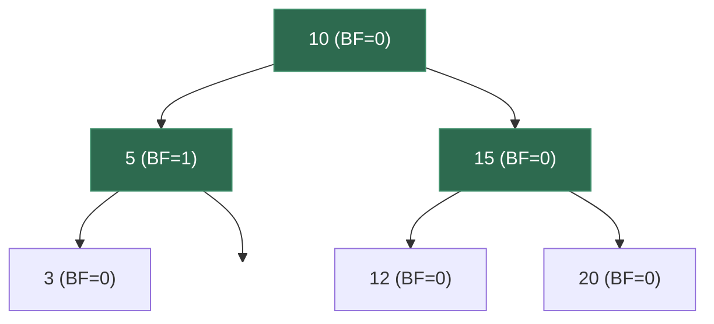
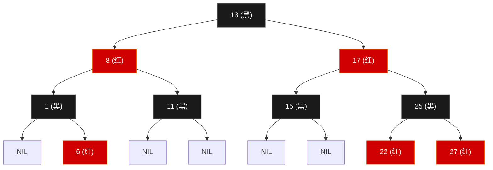

# 6.3 平衡树：AVL 与红黑树

> **一句话理解**：平衡树是"会自动修正自己"的 BST。每次插入或删除后，通过**旋转操作**让树保持矮胖（h = O(log n)），从而保证所有操作的最坏时间复杂度为 O(log n)。

---

## 6.3.1 为什么需要平衡？

在 6.2 节中我们看到，裸 BST 在有序插入时退化为链表：

```
BST 的理想与现实：

理想（随机插入）    现实（顺序插入 1,2,3,4,5）
      3                1
     / \                \
    1   4                2
     \   \                \
      2   5                3
                            \
                             4
                              \
                               5

高度 = 2（O(log n)）    高度 = 4（O(n)）
```

**平衡树的目标**：无论插入顺序如何，始终保证 **h = O(log n)**。

| 平衡策略 | 发明年份 | 平衡条件 | 高度上界 |
|----------|---------|----------|---------|
| AVL 树 | 1962 | \|左高 - 右高\| ≤ 1 | **1.44 log₂(n+2)** |
| 红黑树 | 1978 | 五条颜色规则 | **2 log₂(n+1)** |
| B 树 | 1970 | 每个节点多个 key | O(log_m n) |

---

## 6.3.2 AVL 树 —— 最严格的平衡

### 核心概念

AVL 树以其发明者 **A**delson-**V**elsky 和 **L**andis 命名。它的核心约束：

```
平衡因子 (Balance Factor) = height(左子树) - height(右子树)

对于 AVL 树中每个节点：BF ∈ {-1, 0, 1}
```



当插入或删除操作导致某个节点的 |BF| ≥ 2 时，就需要通过**旋转**来恢复平衡。

### 四种旋转

#### LL 型（左左失衡）—— 右旋

```
插入导致左子树的左侧过深 → 右旋

失衡：              右旋后：
    z (BF=2)           y
   / \                / \
  y   T4    →        x   z
 / \                / \ / \
x   T3             T1 T2 T3 T4
/ \
T1 T2

右旋步骤（以 z 为旋转轴）：
1. y 成为新的子树根
2. z 变成 y 的右子节点
3. y 的原右子树 T3 变成 z 的左子树
```

#### RR 型（右右失衡）—— 左旋

```
插入导致右子树的右侧过深 → 左旋（右旋的镜像）

失衡：              左旋后：
  z (BF=-2)            y
 / \                  / \
T1  y       →        z   x
   / \              / \ / \
  T2  x            T1 T2 T3 T4
     / \
    T3  T4
```

#### LR 型（左右失衡）—— 先左旋再右旋

```
插入导致左子树的右侧过深 → 双旋

失衡：          ①先对 y 左旋：      ②再对 z 右旋：
    z               z                   x
   / \             / \                 / \
  y   T4          x   T4             y   z
 / \     →       / \        →       / \ / \
T1  x           y   T3             T1 T2 T3 T4
   / \         / \
  T2  T3      T1  T2

即：LR = 先 L(左旋子树) + R(右旋根)
```

#### RL 型（右左失衡）—— 先右旋再左旋

```
失衡：          ①先对 y 右旋：      ②再对 z 左旋：
  z               z                   x
 / \             / \                 / \
T1  y           T1  x              z   y
   / \    →        / \      →     / \ / \
  x   T4         T2  y          T1 T2 T3 T4
 / \                 / \
T2  T3              T3  T4

即：RL = 先 R(右旋子树) + L(左旋根)
```

**判断旋转类型的口诀**：

| 条件 | 失衡类型 | 操作 |
|------|---------|------|
| BF(z) = 2 且 BF(y) ≥ 0 | **LL** | 对 z 右旋 |
| BF(z) = -2 且 BF(y) ≤ 0 | **RR** | 对 z 左旋 |
| BF(z) = 2 且 BF(y) < 0 | **LR** | 对 y 左旋 → 对 z 右旋 |
| BF(z) = -2 且 BF(y) > 0 | **RL** | 对 y 右旋 → 对 z 左旋 |

> 💡 **记忆方法**：看失衡方向——"LL 就右旋，RR 就左旋"（往反方向转）。LR 和 RL 是"先把子节点转成同向（变成 LL 或 RR），再做单旋"。

### C++ 实现

```cpp
template <typename T>
class AVLTree {
    struct Node {
        T val;
        Node* left = nullptr;
        Node* right = nullptr;
        int height = 1;  // 新节点高度为 1
        Node(const T& v) : val(v) {}
    };

    Node* _root = nullptr;

    // ===== 辅助函数 =====
    int _height(Node* n) const { return n ? n->height : 0; }

    int _bf(Node* n) const {
        return n ? _height(n->left) - _height(n->right) : 0;
    }

    void _update_height(Node* n) {
        if (n) n->height = 1 + std::max(_height(n->left), _height(n->right));
    }

    // ===== 旋转 =====

    // 右旋（处理 LL 失衡）
    Node* _rotate_right(Node* z) {
        Node* y = z->left;
        Node* T3 = y->right;

        y->right = z;
        z->left = T3;

        _update_height(z);  // z 是子节点，先更新
        _update_height(y);  // y 是新根，后更新

        return y;
    }

    // 左旋（处理 RR 失衡）
    Node* _rotate_left(Node* z) {
        Node* y = z->right;
        Node* T2 = y->left;

        y->left = z;
        z->right = T2;

        _update_height(z);
        _update_height(y);

        return y;
    }

    // 平衡（核心：根据 BF 决定旋转类型）
    Node* _balance(Node* node) {
        _update_height(node);
        int bf = _bf(node);

        // LL
        if (bf > 1 && _bf(node->left) >= 0)
            return _rotate_right(node);

        // RR
        if (bf < -1 && _bf(node->right) <= 0)
            return _rotate_left(node);

        // LR
        if (bf > 1 && _bf(node->left) < 0) {
            node->left = _rotate_left(node->left);
            return _rotate_right(node);
        }

        // RL
        if (bf < -1 && _bf(node->right) > 0) {
            node->right = _rotate_right(node->right);
            return _rotate_left(node);
        }

        return node;  // 已平衡
    }

    // ===== 插入 =====
    Node* _insert(Node* node, const T& key) {
        // 标准 BST 插入
        if (!node) return new Node(key);

        if (key < node->val)
            node->left = _insert(node->left, key);
        else if (key > node->val)
            node->right = _insert(node->right, key);
        else
            return node;  // 重复 key，忽略

        // 插入后平衡修复
        return _balance(node);
    }

    // ===== 删除 =====
    Node* _erase(Node* node, const T& key) {
        if (!node) return nullptr;

        if (key < node->val) {
            node->left = _erase(node->left, key);
        } else if (key > node->val) {
            node->right = _erase(node->right, key);
        } else {
            // 标准 BST 删除
            if (!node->left || !node->right) {
                Node* child = node->left ? node->left : node->right;
                delete node;
                return child;  // child 可能是 nullptr（叶节点）
            }

            // 两个子节点：找中序后继
            Node* successor = node->right;
            while (successor->left) successor = successor->left;
            node->val = successor->val;
            node->right = _erase(node->right, successor->val);
        }

        // 删除后平衡修复
        return _balance(node);
    }

    Node* _min(Node* node) const {
        while (node->left) node = node->left;
        return node;
    }

    void _destroy(Node* node) {
        if (!node) return;
        _destroy(node->left);
        _destroy(node->right);
        delete node;
    }

public:
    ~AVLTree() { _destroy(_root); }

    void insert(const T& key) { _root = _insert(_root, key); }
    void erase(const T& key)  { _root = _erase(_root, key); }

    bool contains(const T& key) const {
        Node* curr = _root;
        while (curr) {
            if (key < curr->val)      curr = curr->left;
            else if (key > curr->val) curr = curr->right;
            else                      return true;
        }
        return false;
    }

    int height() const { return _height(_root); }
};
```

### 插入示例图解

```
依次插入 [3, 2, 1, 4, 5, 6]：

插入 3:   3

插入 2:   3
         /
        2

插入 1:   3 (BF=2)  → LL 失衡 → 右旋
         /
        2              2
       /     →        / \
      1              1   3

插入 4:   2
         / \
        1   3
             \
              4

插入 5:   2
         / \
        1   3 (BF=-2)  → RR 失衡 → 左旋 3
             \
              4            2
               \   →      / \
                5         1   4
                             / \
                            3   5

插入 6:   2 (BF=-2)  → RR 失衡 → 左旋 2
         / \
        1   4            4
           / \   →      / \
          3   5         2   5
               \       / \   \
                6     1   3   6

最终: 完美平衡！高度 = 2（log₂6 ≈ 2.58）
```

> 💡 **AVL 的精髓**：每次插入/删除后，从修改位置**向上回溯**到根，逐层检查平衡因子。一旦发现 |BF| ≥ 2 就做旋转。由于旋转最多修复一个节点，所以插入最多**一次旋转**（单旋或双旋），删除最多 **O(log n) 次旋转**。

### AVL 树的复杂度

| 操作 | 时间 | 旋转次数 |
|------|------|---------|
| 查找 | O(log n) | 0 |
| 插入 | O(log n) | **最多 1 次**（单旋或双旋）|
| 删除 | O(log n) | **最多 O(log n) 次** |
| 空间 | O(n) | 每个节点额外存 height |

---

## 6.3.3 红黑树 —— 工程界的王者

### 为什么要学红黑树？

| 你在用的东西 | 底层就是红黑树 |
|-------------|---------------|
| `std::map` / `std::set` | C++ STL |
| `TreeMap` / `TreeSet` | Java |
| `epoll` 内核实现 | Linux Kernel |
| `CFS` 调度器 | Linux Process Scheduler |
| `HashMap` (JDK 8+) | 当桶内冲突 ≥ 8 时，链表转红黑树 |

红黑树不是面试中要你手写的（太长），但**理解其性质和自平衡原理**是中高级面试的必考点。

### 五条性质

```
1. 每个节点是 红色 或 黑色
2. 根节点是 黑色
3. 叶节点（NIL 哨兵）是 黑色
4. 红色节点的两个子节点必须是黑色（不能有连续红色）
5. 从任意节点到其每个叶子的路径上，黑色节点数相同（黑高相同）
```



### 性质的直觉理解

**性质 4（不能连续红色）+ 性质 5（黑高相同）** → 保证了最长路径 ≤ 2 × 最短路径：

```
最短路径：全黑     → 长度 = 黑高 h_b
最长路径：红黑交替 → 长度 = 2 × h_b

所以树高 h ≤ 2 × h_b = 2 × log₂(n+1)

不如 AVL 的 1.44 log₂n 严格，但仍然是 O(log n)
```

> 💡 **面试金句**：「红黑树不追求完美平衡，只保证最长路径不超过最短路径的两倍。这种"宽松的平衡"使得插入删除时的旋转次数更少——最多 2-3 次旋转，而 AVL 删除时最多需要 O(log n) 次旋转。」

### 插入修复

新节点总是**红色**（为了不破坏性质 5）。插入后可能破坏性质 4（父节点也是红色 → 连续红色）。

修复策略取决于**叔叔节点的颜色**：

```
Case 1：叔叔是红色 → 变色
  把父和叔变黑，祖父变红，然后对祖父递归检查

      G(黑)           G(红)    ← 递归向上检查
     / \      →      / \
   P(红) U(红)     P(黑) U(黑)
   /               /
  N(红)           N(红)

Case 2：叔叔是黑色，N 是内侧子节点 → 先旋转变成 Case 3
  对 P 旋转使 N 变成外侧

      G(黑)           G(黑)
     / \      →      / \
   P(红) U(黑)     N(红) U(黑)
     \             /
     N(红)       P(红)

Case 3：叔叔是黑色，N 是外侧子节点 → 旋转 + 变色
  对 G 旋转，P 和 G 交换颜色

      G(黑)           P(黑)
     / \      →      / \
   P(红) U(黑)     N(红) G(红)
   /                       \
  N(红)                    U(黑)
```

### 删除修复（概念）

删除比插入更复杂，有 4 个对称的 case。面试中一般**不要求手写**，但要能描述核心思路：

```
删除黑色节点后，路径上少了一个黑色 → 破坏性质 5
修复策略：
  - 如果兄弟是红色 → 旋转 + 变色，转化为兄弟是黑色的情况
  - 如果兄弟是黑色且两个子节点都是黑色 → 兄弟变红，向上递归
  - 如果兄弟是黑色且近侧子节点是红色 → 旋转转化为远侧红色
  - 如果兄弟是黑色且远侧子节点是红色 → 旋转 + 变色，修复完成
```

> 💡 **面试中的策略**：说"我知道红黑树删除有 4 种 case，核心思路是通过旋转和变色把缺失的黑色节点补回来，具体 case 太多就不一一展开了"。重点在于理解**为什么红黑树插删时旋转次数少于 AVL**。

### 红黑树的复杂度

| 操作 | 时间 | 旋转次数 |
|------|------|---------|
| 查找 | O(log n) | 0 |
| 插入 | O(log n) | **最多 2 次** |
| 删除 | O(log n) | **最多 3 次** |
| 空间 | O(n) | 每个节点额外存 1 bit 颜色 |

---

## 6.3.4 AVL vs 红黑树 —— 深度对比

| 维度 | AVL | 红黑树 |
|------|-----|--------|
| 平衡严格度 | **严格**（|BF| ≤ 1）| 宽松（最长路 ≤ 2×最短路）|
| 树高 | **1.44 log n**（更矮）| 2 log n |
| 查找性能 | **更快**（树更矮 → 比较次数少）| 略慢 |
| 插入旋转 | 最多 1 次 | 最多 2 次 |
| 删除旋转 | **最多 O(log n) 次** ← 致命缺陷 | **最多 3 次** ← 核心优势 |
| 每节点额外存储 | int (height) = 4 bytes | 1 bit (color) |
| 实际工程选择 | 查找密集场景 | **通用场景**（STL, Linux Kernel）|

**核心结论**：

```
如果操作以查找为主、很少插删 → AVL 更好（更矮、查找更快）
如果插删频繁、查找也多（通用场景）→ 红黑树更好（插删旋转少、总体更快）

C++ STL 选红黑树是因为 map/set 是通用容器，不知道用户会怎么用。
```

> 💡 **面试万能回答**：「AVL 更严格所以查找更快，红黑树更宽松所以插删更快。STL 选红黑树是因为通用场景下插删也很频繁，红黑树的插删最多只需 2-3 次旋转，而 AVL 删除最多需要 O(log n) 次。」

---

## 6.3.5 B 树与 B+ 树 —— 磁盘上的平衡树

AVL 和红黑树针对内存优化——每个节点存一个 key，每次比较访问一个节点。但在**磁盘（数据库）场景**中，瓶颈是**磁盘 I/O 次数**（每次读一个磁盘页 = 4KB）。

B 树的核心思想：**让每个节点存很多 key**（填满一个磁盘页），从而大幅降低树的高度（I/O 次数）。

### B 树

```
阶 m = 4 的 B 树（每个节点最多 3 个 key，4 个子节点）：

          [10 | 20 | 30]
         /    |    |    \
  [1|5|7] [12|15] [22|25] [35|40|45]

高度 = 2，可以存几十个 key
如果 m = 200（实际数据库），3 层就能存 200³ = 800 万条记录
```

| B 树性质 | 说明 |
|---------|------|
| 每个节点最多 m 个子节点 | m = 阶数（通常 100-200）|
| 每个节点最少 ⌈m/2⌉ 个子节点 | 保证节点至少半满 |
| 所有叶节点在同一层 | 完美平衡 |
| 节点内 key 有序 | 二分查找定位 |

### B+ 树 —— 数据库索引的标准

B+ 树是 B 树的变体，所有**数据都存在叶子节点**，内部节点只存索引：

```
B+ 树 (m=4):
              [10 | 20 | 30]        ← 内部节点：只存索引
             /    |    |    \
     [1→5→7] → [10→12→15] → [20→22→25] → [30→35→40]
                                          ← 叶子节点：存数据 + 链表连接
```

**B+ 树 vs B 树**：

| 特性 | B 树 | B+ 树 |
|------|------|-------|
| 数据存储 | 所有节点 | **只在叶子** |
| 叶子链表 | 无 | **有**（支持范围扫描）|
| 范围查询 | 需要中序遍历 | **叶子链表顺序读取** |
| 磁盘 I/O | 较多 | **更少**（内部节点更小→一页能装更多索引）|
| 代表 | MongoDB | **MySQL InnoDB** |

> 💡 **为什么数据库用 B+ 树而不是红黑树？**
> - 红黑树每个节点只有 1 个 key，树高 = log₂ n（n=100万时，高度≈20）
> - B+ 树每个节点有 100-200 个 key，树高 = log₂₀₀ n（n=100万时，高度≈3）
> - 每层 = 一次磁盘 I/O → 20 次 vs 3 次，差距巨大

### MySQL 索引实例

```sql
-- 创建 B+ 树索引
CREATE INDEX idx_name ON users(name);

-- 以下查询都走 B+ 树
SELECT * FROM users WHERE name = 'Alice';        -- 精确查找 O(log n)
SELECT * FROM users WHERE name > 'A' AND name < 'D';  -- 范围查询（叶子链表）
SELECT * FROM users ORDER BY name LIMIT 10;       -- 排序（叶子链表天然有序）

-- 以下查询不走 B+ 树：
SELECT * FROM users WHERE name LIKE '%ice';  -- 前缀不确定 → 全表扫描
```

---

## 6.3.6 面试高频题

### AVL 旋转实战 (手画/口述)

> 面试不会让你手写完整的 AVL 树（太长），但可能会给你一棵失衡的树，让你判断失衡类型并画出旋转后的结果。

**例题**：依次插入 [5, 3, 7, 2, 4, 6, 8, 9]，画出每一步的 AVL 树。

```
插入 5:     5
插入 3:     5
           /
          3
插入 7:     5
           / \
          3   7
插入 2:     5       (平衡)
           / \
          3   7
         /
        2
插入 4:     5       (平衡)
           / \
          3   7
         / \
        2   4
插入 6:     5       (平衡)
           / \
          3   7
         / \ /
        2  4 6
插入 8:     5       (平衡)
           / \
          3   7
         / \ / \
        2  4 6  8
插入 9:     5         7 节点 BF = -2 → RR 失衡
           / \
          3   7           5
         / \ / \   →     / \
        2  4 6  8       3   7
                 \     / \ / \
                  9   2  4 6  8
                               \
                                9

等等，这样 5 的 BF 也变了。让我重新计算...
实际上插入 9 后：
  节点 7: BF = h(6) - h(8→9) = 1 - 2 = -1  ← ok
  节点 5: BF = h(3,2,4) - h(7,6,8,9) = 2 - 3 = -1  ← ok（差 1，合法）

所以插入 [5,3,7,2,4,6,8,9] 全程不需要旋转！AVL 只在 |BF| ≥ 2 时才旋转。
```

> 💡 **面试技巧**：不要写代码，画图说思路。面试官更看重你**理解旋转的目的和类型判断**，而非记住代码细节。

### 概念对比题

> **Q：为什么 `std::map` 用红黑树不用哈希表？**

A：`std::map` 需要**有序遍历**（`begin()` 到 `end()` 是升序）和**范围查询**（`lower_bound` / `upper_bound`）。哈希表不支持这些操作。如果只需要精确查找，用 `std::unordered_map`（哈希表）更快。

> **Q：为什么 `std::map` 用红黑树不用 AVL 树？**

A：红黑树在插删时旋转次数更少（最多 3 次 vs AVL 的 O(log n) 次）。`std::map` 是通用容器，不知道用户是查找多还是插删多，所以选择**综合性能更好**的红黑树。

> **Q：为什么 MySQL 用 B+ 树不用红黑树和 AVL 树？**

A：数据库的瓶颈是磁盘 I/O，每次 I/O 读一页（4KB）。B+ 树每个节点存几百个 key，树高只有 3-4 层（100 万记录）。红黑树/AVL 每个节点只有 1 个 key，树高 20 层。每层 = 一次磁盘 I/O，20 次 vs 3 次。

> **Q：B 树和 B+ 树的区别？**

A：B 树所有节点存数据，B+ 树只有叶子存数据。B+ 树的叶子节点通过链表连接，**范围查询**时只需在叶子链表上顺序读取，不用回溯到父节点。MySQL InnoDB 用 B+ 树。

---

## 6.3.7 面试题速查表

| 题目 / 概念 | 核心要点 | 面试方式 |
|-------------|---------|---------|
| AVL 四种旋转 | LL 右旋、RR 左旋、LR 双旋、RL 双旋 | 画图 + 口述 |
| AVL 平衡因子 | BF = h(left) - h(right)，合法范围 {-1, 0, 1} | 概念 |
| 红黑树五性质 | 根黑、叶黑、红不连续、黑高相同 | 概念（必背）|
| 红黑树插入修复 | 叔红→变色、叔黑外侧→单旋、叔黑内侧→双旋 | 概念 |
| AVL vs 红黑树 | AVL 查找快、红黑树插删快 | 对比（高频）|
| map vs unordered_map | 有序用 map（红黑树）、无序用 unordered_map（哈希）| 对比（高频）|
| B+ 树 vs B 树 | B+ 树数据只在叶子、叶子有链表 | 概念 |
| 为何数据库用 B+ 树 | 减少磁盘 I/O 次数 | 系统设计 |

---

## 6.3.8 本节小结

### 核心要点

| 概念 | 要点 |
|------|------|
| **平衡的目的** | 防止 BST 退化为链表，保证 h = O(log n) |
| **AVL 树** | |BF| ≤ 1，四种旋转。查找最优但删除可能 O(log n) 次旋转 |
| **红黑树** | 五条颜色规则，插入最多 2 次旋转、删除最多 3 次旋转 |
| **STL 选型** | `map/set` 用红黑树——通用场景插删频繁，红黑树综合更优 |
| **B+ 树** | 数据库索引标准——一个节点存一整页数据，极大降低磁盘 I/O |
| **选择依据** | 内存 + 查找密集 → AVL；内存 + 通用 → 红黑树；磁盘 → B+ 树 |

### 面试 30 秒速答

> **Q：AVL 和红黑树的区别？**
>
> A：AVL 更严格（|BF| ≤ 1），查找更快（树更矮），但删除时最多 O(log n) 次旋转。红黑树更宽松（最长路 ≤ 2×最短路），插入最多 2 次旋转，删除最多 3 次。STL 的 `std::map` 选红黑树是因为通用场景下插删频繁，红黑树旋转次数更少。

> **Q：红黑树的核心性质是什么？**
>
> A：五条规则：节点非红即黑、根为黑、NIL 为黑、**红色节点不能连续**、**任意节点到叶子路径的黑色节点数相同**。后两条保证最长路径不超过最短路径的两倍，即 h ≤ 2 log₂(n+1)。

> **Q：为什么数据库用 B+ 树？**
>
> A：磁盘 I/O 是数据库的瓶颈。B+ 树每个节点存几百个 key（填满一个 4KB 磁盘页），树高只有 3-4 层。而红黑树每个节点只有 1 个 key，百万数据树高约 20。3 次 I/O vs 20 次，差距巨大。且 B+ 树叶子有链表，**范围查询**直接顺序读取。

---

> 📖 上一节：[6.2 二叉搜索树 BST](../06_02_bst)
>
> 📖 下一节：[6.4 堆与优先队列](../06_04_heap) —— 从堆的数组表示到 sift-up / sift-down，手写堆排序，以及 Top-K 问题的工程化解法。
