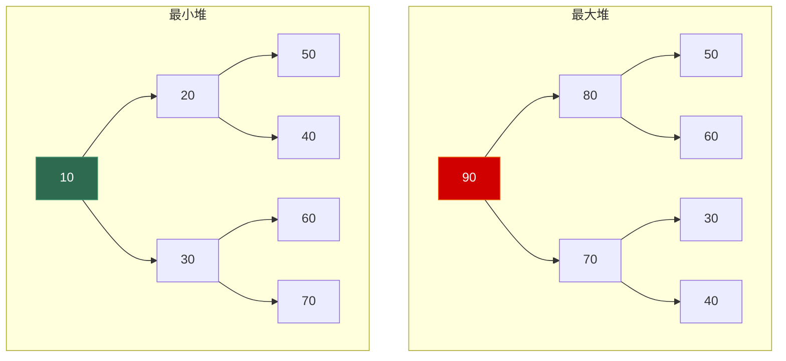

# 6.4 堆与优先队列

> **一句话理解**：堆是一棵用**数组**存储的**完全二叉树**，满足"父节点 ≥ 子节点"(最大堆) 或"父节点 ≤ 子节点"(最小堆)。它能在 O(1) 取最值、O(log n) 插入/删除，是优先队列、堆排序、Top-K 问题的底层基石。

---

## 6.4.1 概念与性质

### 完全二叉树 + 堆序性

堆 = 两条性质的组合：

```
1. 结构性质（完全二叉树）：
   除最后一层外全满，最后一层从左到右连续填充
   → 可以用数组紧凑存储，无空洞

2. 堆序性质（Heap Property）：
   最大堆：parent.val ≥ children.val
   最小堆：parent.val ≤ children.val
   → 根节点是全局最大/最小值
```



### 数组存储 —— 堆的精髓

完全二叉树可以**完美映射**到数组，不浪费任何空间：

```
最大堆：        90
               /  \
             80    70
            / \   / \
           50 60 30 40

数组 (0-indexed): [90, 80, 70, 50, 60, 30, 40]
下标:               0   1   2   3   4   5   6
```

**父子关系公式（0-indexed）**：

| 关系 | 公式 |
|------|------|
| 父节点 | `(i - 1) / 2` |
| 左子节点 | `2 * i + 1` |
| 右子节点 | `2 * i + 2` |
| 最后一个非叶节点 | `(n / 2) - 1` |

> 💡 **为什么用数组？** 完全二叉树是唯一可以用数组**零浪费**存储的树结构。数组存储带来两个巨大优势：(1) **cache 友好**——连续内存，遍历时 cache 命中率极高；(2) **零指针开销**——不需要 left/right 指针，节省 2 × 8 = 16 字节/节点。

### 堆 ≠ BST

面试中常见的混淆：

| 对比 | 堆 | BST |
|------|-----|-----|
| 约束 | 父 ≥ 子（或 ≤） | 左 < 根 < 右 |
| 能做什么 | **O(1) 取最值** | O(log n) 查找任意值 |
| 不能做什么 | 不支持精确查找 | 不能 O(1) 取最值 |
| 存储 | **数组** | 链式（指针） |
| 有序遍历 | ❌ | ✅ 中序遍历有序 |

---

## 6.4.2 核心操作

### sift-up（上浮）—— 插入时用

```
插入 85 到最大堆 [90, 80, 70, 50, 60, 30, 40]：

Step 1: 追加到末尾
  [90, 80, 70, 50, 60, 30, 40, 85]
                                 ↑ 新元素 (index=7)

Step 2: 上浮——与父节点比较，如果更大就交换
  85 vs parent=50 (index=3)  →  85 > 50 → swap!
  [90, 80, 70, 85, 60, 30, 40, 50]

  85 vs parent=80 (index=1)  →  85 > 80 → swap!
  [90, 85, 70, 80, 60, 30, 40, 50]

  85 vs parent=90 (index=0)  →  85 < 90 → 停！

最终: [90, 85, 70, 80, 60, 30, 40, 50]
```

### sift-down（下沉）—— 删除最大值时用

```
删除最大值（堆顶 90）：

Step 1: 用末尾元素替换堆顶
  [50, 85, 70, 80, 60, 30, 40]
   ↑ 50 不应该在这里

Step 2: 下沉——与较大的子节点比较，如果更小就交换
  50 vs max(left=85, right=70) = 85  →  50 < 85 → swap!
  [85, 50, 70, 80, 60, 30, 40]

  50 vs max(left=80, right=60) = 80  →  50 < 80 → swap!
  [85, 80, 70, 50, 60, 30, 40]

  50 没有子节点了 → 停！

最终: [85, 80, 70, 50, 60, 30, 40]
```

> 💡 **sift-down 的关键**：必须和**较大的**子节点交换（最大堆）。如果和较小的交换，交换后的父节点可能比另一个子节点小，仍然违反堆序。

### buildHeap —— O(n) 建堆

从无序数组建堆有两种方法：

```
方法 1：逐个插入 → n 次 sift-up → O(n log n)
方法 2：自底向上 sift-down → O(n) ✅

方法 2 的过程：
  从最后一个非叶节点开始，逐个向前做 sift-down

  为什么是 O(n)？
  - 叶节点（n/2 个）不需要下沉 → 0 次操作
  - 倒数第二层（n/4 个）最多下沉 1 次
  - 倒数第三层（n/8 个）最多下沉 2 次
  - ...
  - 根节点（1 个）最多下沉 log n 次

  总操作 = n/4·1 + n/8·2 + n/16·3 + ... = O(n)（收敛的等比级数）
```

---

## 6.4.3 C++ 实现

### 手写最大堆

```cpp
template <typename T, typename Compare = std::less<T>>
class BinaryHeap {
    std::vector<T> _data;
    Compare _cmp;  // 默认 less → 最大堆（父 > 子）

    // ===== 辅助 =====
    int _parent(int i) const { return (i - 1) / 2; }
    int _left(int i) const   { return 2 * i + 1; }
    int _right(int i) const  { return 2 * i + 2; }

    // ===== 上浮 =====
    void _sift_up(int i) {
        while (i > 0 && _cmp(_data[_parent(i)], _data[i])) {
            // 父 < 子（违反堆序）→ 交换
            std::swap(_data[_parent(i)], _data[i]);
            i = _parent(i);
        }
    }

    // ===== 下沉 =====
    void _sift_down(int i) {
        int n = _data.size();
        while (true) {
            int largest = i;
            int l = _left(i);
            int r = _right(i);

            if (l < n && _cmp(_data[largest], _data[l]))
                largest = l;
            if (r < n && _cmp(_data[largest], _data[r]))
                largest = r;

            if (largest == i) break;  // 已满足堆序

            std::swap(_data[i], _data[largest]);
            i = largest;
        }
    }

public:
    BinaryHeap() = default;

    // 从数组建堆 → O(n)
    BinaryHeap(std::vector<T> data) : _data(std::move(data)) {
        // 自底向上 sift-down
        for (int i = static_cast<int>(_data.size()) / 2 - 1; i >= 0; --i) {
            _sift_down(i);
        }
    }

    // 插入 → O(log n)
    void push(const T& val) {
        _data.push_back(val);
        _sift_up(_data.size() - 1);
    }

    // 取堆顶 → O(1)
    const T& top() const { return _data.front(); }

    // 弹出堆顶 → O(log n)
    void pop() {
        _data.front() = _data.back();
        _data.pop_back();
        if (!_data.empty()) _sift_down(0);
    }

    std::size_t size() const { return _data.size(); }
    bool empty() const { return _data.empty(); }
};
```

### `std::priority_queue` 接口回顾

在第 4 章（队列）中已详细介绍过。这里回顾关键要点：

```cpp
#include <queue>

// 最大堆（默认）
std::priority_queue<int> max_pq;
max_pq.push(3);
max_pq.push(1);
max_pq.push(4);
max_pq.top();  // 4
max_pq.pop();  // 弹出 4

// 最小堆（传 greater）
std::priority_queue<int, std::vector<int>, std::greater<int>> min_pq;
min_pq.push(3);
min_pq.push(1);
min_pq.push(4);
min_pq.top();  // 1

// 自定义比较
auto cmp = [](const auto& a, const auto& b) { return a.cost > b.cost; };
std::priority_queue<Edge, std::vector<Edge>, decltype(cmp)> pq(cmp);
```

**`std::priority_queue` 的局限**：

| 不支持的操作 | 说明 | 解决方案 |
|-------------|------|---------|
| `decrease_key` | 修改已有元素的优先级 | 索引堆 / lazy deletion |
| `erase` | 删除指定元素 | lazy deletion（标记删除）|
| 遍历 | 只能访问堆顶 | 维护额外数据结构 |
| 合并两个堆 | | 直接 merge 再 buildHeap O(n) |

### STL 堆操作族

`<algorithm>` 中有一组直接在数组上操作堆的函数：

```cpp
#include <algorithm>
#include <vector>

std::vector<int> v = {3, 1, 4, 1, 5, 9, 2, 6};

// 建堆 → O(n)
std::make_heap(v.begin(), v.end());
// v = [9, 6, 4, 1, 5, 3, 2, 1]

// 入堆 → 先 push_back，再 push_heap → O(log n)
v.push_back(8);
std::push_heap(v.begin(), v.end());
// v = [9, 8, 4, 6, 5, 3, 2, 1, 1]

// 出堆 → 先 pop_heap（把最大值换到末尾），再 pop_back → O(log n)
std::pop_heap(v.begin(), v.end());
v.pop_back();
// v = [8, 6, 4, 1, 5, 3, 2, 1]

// 堆排序 → O(n log n)
std::sort_heap(v.begin(), v.end());
// v = [1, 1, 2, 3, 4, 5, 6, 8]

// 检查是否是堆
bool is_heap = std::is_heap(v.begin(), v.end());
```

> 💡 **`priority_queue` vs `make_heap`**：`priority_queue` 是封装好的容器适配器，更安全。`make_heap` 系列函数直接操作数组，更灵活（可以访问任意元素、自定义排列）。

---

## 6.4.4 堆排序 (Heap Sort)

### 算法流程

```
Step 1: 将数组原地建成最大堆 → O(n)
Step 2: 不断"取最大值放到末尾"：
  - 交换 heap[0]（最大值）和 heap[n-1]（末尾）
  - 堆大小减 1
  - 对堆顶做 sift-down
  - 重复直到堆大小为 1
→ 总计 O(n log n)
```

### C++ 实现

```cpp
void heapSort(std::vector<int>& arr) {
    int n = arr.size();

    // Step 1: 建堆（自底向上 sift-down）
    for (int i = n / 2 - 1; i >= 0; --i) {
        _siftDown(arr, n, i);
    }

    // Step 2: 逐个取出最大值
    for (int i = n - 1; i > 0; --i) {
        std::swap(arr[0], arr[i]);  // 最大值放末尾
        _siftDown(arr, i, 0);       // 缩小堆范围，修复堆顶
    }
}

void _siftDown(std::vector<int>& arr, int heap_size, int i) {
    while (true) {
        int largest = i;
        int l = 2 * i + 1;
        int r = 2 * i + 2;

        if (l < heap_size && arr[l] > arr[largest]) largest = l;
        if (r < heap_size && arr[r] > arr[largest]) largest = r;

        if (largest == i) break;

        std::swap(arr[i], arr[largest]);
        i = largest;
    }
}
```

### 堆排序 vs 其他排序

| 排序算法 | 平均 | 最坏 | 空间 | 稳定 | 特点 |
|---------|------|------|------|------|------|
| 快速排序 | O(n log n) | O(n²) | O(log n) | ❌ | 实际最快（cache 友好）|
| 归并排序 | O(n log n) | O(n log n) | **O(n)** | ✅ | 稳定，适合链表/外部排序 |
| **堆排序** | O(n log n) | **O(n log n)** | **O(1)** | ❌ | **原地 + 最坏保证** |
| `std::sort` | O(n log n) | O(n log n) | O(log n) | ❌ | IntroSort（快排+堆排混合）|

> 💡 **堆排序的独特价值**：它是唯一同时具有 **O(n log n) 最坏保证** 和 **O(1) 额外空间** 的排序算法。实际中不如快排快（cache 不友好——sift-down 跳跃访问），但 `std::sort`（IntroSort）在快排退化时会**切换到堆排序**作为保底。

---

## 6.4.5 索引堆 (Indexed Heap)

标准堆不支持"修改某个元素的优先级"（`decrease_key`）。索引堆通过维护一个**位置映射表**解决这个问题——Dijkstra 最短路算法就需要它。

```cpp
// 索引最小堆：支持 decrease_key
class IndexedMinHeap {
    int _capacity;
    int _size = 0;

    std::vector<int> _heap;      // heap[i] = 原始数组中的下标
    std::vector<int> _pos;       // pos[id] = id 在堆中的位置（-1 = 不在堆中）
    std::vector<int> _keys;      // keys[id] = id 对应的优先级

    void _swap_heap(int i, int j) {
        _pos[_heap[i]] = j;
        _pos[_heap[j]] = i;
        std::swap(_heap[i], _heap[j]);
    }

    void _sift_up(int i) {
        while (i > 0) {
            int parent = (i - 1) / 2;
            if (_keys[_heap[i]] < _keys[_heap[parent]]) {
                _swap_heap(i, parent);
                i = parent;
            } else break;
        }
    }

    void _sift_down(int i) {
        while (2 * i + 1 < _size) {
            int child = 2 * i + 1;
            if (child + 1 < _size && _keys[_heap[child + 1]] < _keys[_heap[child]])
                ++child;
            if (_keys[_heap[i]] <= _keys[_heap[child]]) break;
            _swap_heap(i, child);
            i = child;
        }
    }

public:
    IndexedMinHeap(int capacity)
        : _capacity(capacity), _heap(capacity), _pos(capacity, -1),
          _keys(capacity, INT_MAX) {}

    bool contains(int id) const { return _pos[id] != -1; }
    bool empty() const { return _size == 0; }

    void push(int id, int key) {
        _keys[id] = key;
        _heap[_size] = id;
        _pos[id] = _size;
        _sift_up(_size++);
    }

    std::pair<int, int> top() const {
        return {_heap[0], _keys[_heap[0]]};
    }

    std::pair<int, int> pop() {
        int id = _heap[0];
        int key = _keys[id];
        _swap_heap(0, --_size);
        _pos[id] = -1;
        _sift_down(0);
        return {id, key};
    }

    // 关键操作：修改优先级 → O(log n)
    void decrease_key(int id, int new_key) {
        _keys[id] = new_key;
        _sift_up(_pos[id]);  // 优先级变小（更优先）→ 上浮
    }
};
```

**用于 Dijkstra**：

```cpp
std::vector<int> dijkstra(const Graph& g, int src) {
    int n = g.size();
    std::vector<int> dist(n, INT_MAX);
    dist[src] = 0;

    IndexedMinHeap pq(n);
    pq.push(src, 0);

    while (!pq.empty()) {
        auto [u, d] = pq.pop();
        if (d > dist[u]) continue;

        for (auto [v, w] : g[u]) {
            if (dist[u] + w < dist[v]) {
                dist[v] = dist[u] + w;
                if (pq.contains(v))
                    pq.decrease_key(v, dist[v]);  // ← 关键！
                else
                    pq.push(v, dist[v]);
            }
        }
    }
    return dist;
}
```

> 💡 **没有索引堆怎么办？** 实际竞赛和面试中，常用 **lazy deletion**（懒删除）代替：直接往 `priority_queue` 里重复推入 `{new_dist, v}`，弹出时检查是否过时。简单但空间 O(m)。

---

## 6.4.6 面试高频题

### 第 K 大元素 (LeetCode 215)

> 在未排序的数组中找到第 k 大的元素。

**方法一：最小堆（大小为 K）**

```cpp
int findKthLargest(std::vector<int>& nums, int k) {
    // 维护大小为 k 的最小堆
    // 堆顶就是第 k 大
    std::priority_queue<int, std::vector<int>, std::greater<int>> min_pq;

    for (int num : nums) {
        min_pq.push(num);
        if (static_cast<int>(min_pq.size()) > k) {
            min_pq.pop();  // 弹出最小的，保持堆大小 = k
        }
    }
    return min_pq.top();
}
// 时间 O(n log k), 空间 O(k)
```

**方法二：快速选择（QuickSelect）**

```cpp
int findKthLargest_quick(std::vector<int>& nums, int k) {
    // 第 k 大 = 第 (n-k) 小 (0-indexed)
    int target = nums.size() - k;
    return _quickSelect(nums, 0, nums.size() - 1, target);
}

int _quickSelect(std::vector<int>& nums, int lo, int hi, int target) {
    int pivot = nums[lo + rand() % (hi - lo + 1)];
    int i = lo, j = lo, k = hi;

    // 三路划分：[< pivot | == pivot | > pivot]
    while (j <= k) {
        if (nums[j] < pivot) std::swap(nums[i++], nums[j++]);
        else if (nums[j] > pivot) std::swap(nums[j], nums[k--]);
        else ++j;
    }

    if (target < i) return _quickSelect(nums, lo, i - 1, target);
    if (target > k) return _quickSelect(nums, k + 1, hi, target);
    return nums[target];
}
// 时间 O(n) 平均, O(n²) 最坏; 空间 O(1)
```

| 方法 | 时间 | 空间 | 特点 |
|------|------|------|------|
| 排序 | O(n log n) | O(1) | 最简单 |
| **最小堆** | O(n log k) | O(k) | 适合数据流 |
| **快速选择** | O(n) 平均 | O(1) | 最快但最坏 O(n²) |
| `std::nth_element` | O(n) 平均 | O(1) | STL 版快速选择 |

### 数据流的中位数 (LeetCode 295) —— 双堆经典

> 设计一个数据结构，支持 `addNum(int num)` 和 `findMedian()` 两个操作。

**🧠 思路推导（面试时怎么想到的）**：

```
Step 1: 暴力想法
  每次 addNum 插入排序数组, findMedian 取中间 → addNum O(n), findMedian O(1)
  或者: addNum O(1) 直接追加, findMedian 时排序取中间 → findMedian O(n log n)
  都太慢。

Step 2: 目标复杂度
  addNum O(log n), findMedian O(1) → 需要始终维护"有序性的部分信息"

Step 3: 关键洞察
  中位数把数据分成"较小的一半"和"较大的一半"。
  我不需要两半各自完全有序, 只需要知道:
    - 较小半的最大值 (小半里最接近中间的)
    - 较大半的最小值 (大半里最接近中间的)
  
  "最大值" → 最大堆!  "最小值" → 最小堆!

Step 4: 双堆方案
  最大堆 lo: 存较小的一半 (堆顶 = 小半的最大值)
  最小堆 hi: 存较大的一半 (堆顶 = 大半的最小值)
  
  保持: lo.size() == hi.size() 或 lo.size() == hi.size() + 1
  中位数: lo.size() > hi.size() → lo.top()
           否则 → (lo.top() + hi.top()) / 2

Step 5: 插入逻辑
  新数先入 lo → lo 的最大值转入 hi → 如果 hi 多了再转回 lo
  这 3 步保证: lo 的每个元素 ≤ hi 的每个元素, 且大小平衡
```

**核心思路**：用一个**最大堆**存较小的一半，一个**最小堆**存较大的一半。中位数从两个堆顶取。

```cpp
class MedianFinder {
    // 最大堆：存较小的一半（堆顶 = 较小半的最大值）
    std::priority_queue<int> lo;
    // 最小堆：存较大的一半（堆顶 = 较大半的最小值）
    std::priority_queue<int, std::vector<int>, std::greater<int>> hi;

public:
    void addNum(int num) {
        lo.push(num);                // 先放入较小半
        hi.push(lo.top());           // 把最大值转到较大半
        lo.pop();

        // 保持 lo.size() >= hi.size()（lo 可以多一个）
        if (lo.size() < hi.size()) {
            lo.push(hi.top());
            hi.pop();
        }
    }

    double findMedian() {
        if (lo.size() > hi.size()) {
            return lo.top();  // 奇数个 → lo 堆顶
        }
        return (lo.top() + hi.top()) / 2.0;  // 偶数个 → 两堆顶的均值
    }
};
// addNum: O(log n), findMedian: O(1)
```

**图解**（依次插入 [5, 3, 8, 1, 4]）：

```
add(5): lo=[5], hi=[]          median=5
add(3): lo=[3], hi=[5]         median=(3+5)/2=4
add(8): lo=[5,3], hi=[8]       median=5
add(1): lo=[3,1], hi=[5,8]     median=(3+5)/2=4
add(4): lo=[4,3,1], hi=[5,8]   median=4
```

> 💡 **面试金句**：「双堆维护有序性——最大堆的堆顶 ≤ 最小堆的堆顶。这样中位数就在两个堆顶之间。每次插入 O(log n)，查询中位数 O(1)。」

### 合并 K 个有序链表 (LeetCode 23)

> 合并 k 个排序链表，返回合并后的排序链表。

```cpp
ListNode* mergeKLists(std::vector<ListNode*>& lists) {
    auto cmp = [](ListNode* a, ListNode* b) { return a->val > b->val; };
    std::priority_queue<ListNode*, std::vector<ListNode*>, decltype(cmp)> pq(cmp);

    // 把每个链表的头节点放入最小堆
    for (auto* head : lists) {
        if (head) pq.push(head);
    }

    ListNode dummy(0);
    ListNode* tail = &dummy;

    while (!pq.empty()) {
        ListNode* node = pq.top();
        pq.pop();

        tail->next = node;
        tail = node;

        if (node->next) pq.push(node->next);
    }

    return dummy.next;
}
// 时间 O(N log k), N = 总节点数, k = 链表数
// 空间 O(k)
```

> 这道题在第 2 章（链表）中用分治做过。这里用堆来做——核心思想：**始终从 k 个链表的当前头节点中取最小的**。堆维护这 k 个候选节点。

### 前 K 个高频元素 (LeetCode 347)

> 给定非空整数数组，返回其中出现频率前 k 高的元素。

```cpp
std::vector<int> topKFrequent(std::vector<int>& nums, int k) {
    // 1. 统计频率
    std::unordered_map<int, int> freq;
    for (int n : nums) ++freq[n];

    // 2. 最小堆维护 top-k
    auto cmp = [](const auto& a, const auto& b) { return a.second > b.second; };
    std::priority_queue<std::pair<int,int>, std::vector<std::pair<int,int>>,
                        decltype(cmp)> pq(cmp);

    for (auto& [num, count] : freq) {
        pq.push({num, count});
        if (static_cast<int>(pq.size()) > k) pq.pop();
    }

    // 3. 提取结果
    std::vector<int> result;
    while (!pq.empty()) {
        result.push_back(pq.top().first);
        pq.pop();
    }
    return result;
}
// 时间 O(n log k), 空间 O(n)
```

### 最接近原点的 K 个点 (LeetCode 973)

> 给定平面上 n 个点，找出最接近原点的 k 个。

```cpp
std::vector<std::vector<int>> kClosest(
    std::vector<std::vector<int>>& points, int k)
{
    // 最大堆维护最近 k 个（堆顶 = 第 k 近 = k 个中最远的）
    auto dist = [](const std::vector<int>& p) {
        return p[0] * p[0] + p[1] * p[1];  // 不用开方，比较平方即可
    };

    auto cmp = [&](const std::vector<int>& a, const std::vector<int>& b) {
        return dist(a) < dist(b);  // 最大堆
    };

    std::priority_queue<std::vector<int>, std::vector<std::vector<int>>,
                        decltype(cmp)> pq(cmp);

    for (auto& p : points) {
        pq.push(p);
        if (static_cast<int>(pq.size()) > k) pq.pop();
    }

    std::vector<std::vector<int>> result;
    while (!pq.empty()) {
        result.push_back(pq.top());
        pq.pop();
    }
    return result;
}
// 时间 O(n log k), 空间 O(k)
```

> 💡 **Top-K 问题的通用模板**：用**大小为 K 的堆**。找最大 K 个用**最小堆**（淘汰最小的），找最小 K 个用**最大堆**（淘汰最大的）。理由：堆顶是"最危险的"——第 K+1 个元素来了，和堆顶比，如果更优就替换堆顶。

---

## 6.4.7 面试题速查表

| 题号 | 题目 | 核心技巧 | 难度 |
|------|------|----------|------|
| LC 215 | 第 K 大元素 | **最小堆 / 快速选择** | Medium |
| LC 295 | 数据流中位数 | **双堆**（大顶 + 小顶） | Hard |
| LC 23 | 合并 K 个有序链表 | **最小堆** k 路归并 | Hard |
| LC 347 | 前 K 个高频元素 | 哈希 + **最小堆** | Medium |
| LC 973 | 最接近原点的 K 个点 | **最大堆** 维护 K 个 | Medium |
| LC 703 | 数据流中第 K 大元素 | 最小堆 size=k | Easy |
| LC 378 | 有序矩阵中第 K 小 | 最小堆 / 二分 | Medium |
| LC 767 | 重组字符串 | 最大堆贪心 | Medium |
| LC 1046 | 最后一块石头的重量 | 最大堆模拟 | Easy |
| LC 355 | 设计推特 | 哈希 + 最小堆归并 | Medium |
| — | 堆排序 | buildHeap + 逐个 pop | 手写 |
| — | 索引堆 | decrease_key + Dijkstra | 进阶 |

---

## 6.4.8 本节小结

### 核心要点

| 概念 | 要点 |
|------|------|
| **堆** | 完全二叉树 + 堆序性，用**数组**存储 |
| **sift-up** | 插入时用——新元素追加到末尾后上浮 |
| **sift-down** | 删除堆顶时用——末尾元素放顶部后下沉 |
| **buildHeap** | 自底向上 sift-down → **O(n)** |
| **堆排序** | 原地 O(n log n)，最坏也是 O(n log n)，std::sort 的保底方案 |
| **Top-K** | 大小为 K 的堆。找最大 K 个用最小堆，找最小 K 个用最大堆 |
| **双堆** | 数据流中位数——最大堆存小半，最小堆存大半 |
| **索引堆** | 支持 decrease_key，用于 Dijkstra |

### 面试 30 秒速答

> **Q：堆的插入和删除是怎么做的？**
>
> A：插入：新元素追加到数组末尾，然后 **sift-up**（和父节点比较，更大就向上交换），O(log n)。删除堆顶：用末尾元素替换堆顶，然后 **sift-down**（和较大的子节点比较，更小就向下交换），O(log n)。

> **Q：如何从 n 个元素中找第 K 大？**
>
> A：三种方法：(1) 排序 O(n log n)；(2) **大小为 K 的最小堆** O(n log k)——遍历数组，每个元素入堆，堆大小超过 K 就 pop；(3) **快速选择** O(n) 平均。面试中优先写堆解法（稳定、好写），再提快速选择作为优化。

> **Q：堆排序为什么实际比快排慢？**
>
> A：虽然堆排序最坏也是 O(n log n)，但它的 **cache 命中率差**——sift-down 跳跃式访问数组（从 i 到 2i+1），不像快排那样顺序扫描。`std::sort` 用的 IntroSort = 快排 + 堆排切换：正常用快排（快），快排退化时切到堆排（保证最坏 O(n log n)）。

---

> 📖 上一节：[6.3 平衡树：AVL 与红黑树](./06_03_balanced_tree)
>
> 📖 下一节：[6.5 线段树 & 树状数组](./06_05_segment_tree) —— 区间查询与修改的利器，懒传播与树状数组的 lowbit 技巧。
