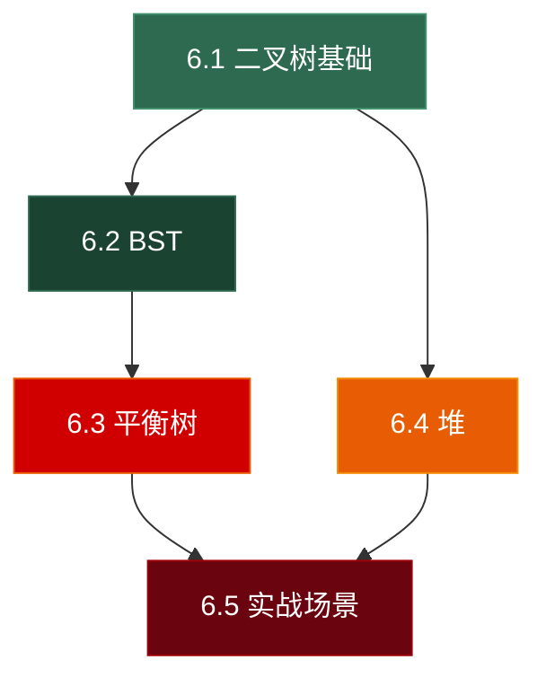

# 第六章 树 (Tree) —— 总览与导航

> **一句话理解**：树是具有**层级关系**的非线性数据结构。从文件系统到 DOM 树，从数据库索引到游戏场景图，树无处不在——它也是面试中**考查密度最高**的数据结构，没有之一。

---

## 为什么树需要一整章（五篇）？

前五章的数据结构（数组、链表、栈、队列、哈希表）都是**线性**的——元素排成一条线。但现实中大量问题天然具有**层级 / 分支**结构：

| 场景 | 树结构 |
|------|--------|
| 文件系统 | 目录树（每个文件夹是一个节点） |
| HTML / XML | DOM 树 |
| 编译器 | 抽象语法树 (AST) |
| 数据库索引 | B+ 树 |
| 游戏引擎 | 场景树（父子节点继承 Transform） |
| AI 决策 | 行为树 (Behavior Tree) |
| 排序 / 调度 | 堆（完全二叉树） |
| 区间查询 | 线段树 / 树状数组 |
| 骨骼动画 | 骨骼层级树 |

树的变体极多，每种都有独立的算法和面试考法。因此本章拆分为**五个子章节**，每篇聚焦一个专题：

---

## 章节导航

### 📗 [6.1 二叉树基础与遍历](./06_01_binary_tree_basics)

> 从树的基本术语到四种遍历方式（前序 / 中序 / 后序 / 层序），涵盖递归与迭代实现、Morris 遍历的 O(1) 空间技巧，以及高频面试题：最大深度、对称性判断、路径总和等。

**核心内容**：
- 树的术语：根、叶、深度、高度、度
- 二叉树的三种表示（链式 / 数组 / 括号表达式）
- 前序 / 中序 / 后序遍历（递归 + 迭代栈写法）
- 层序遍历 (BFS)
- Morris 遍历（O(1) 空间的中序遍历——利用线索化）
- **面试题**：LC 104 最大深度、LC 101 对称二叉树、LC 226 翻转二叉树、LC 112 路径总和、LC 236 最近公共祖先、LC 105 从前中序构建二叉树

---

### 📘 [6.2 二叉搜索树 BST](./06_02_bst)

> 从 BST 的有序性质到增删查的完整实现，深入 `std::map` / `std::set` 的红黑树底层选型原因，以及 BST 高频面试题。

**核心内容**：
- BST 性质：左 < 根 < 右，中序遍历有序
- 查找、插入、删除的递归实现
- 删除的三种情况（叶节点、单子、双子——Hibbard 删除）
- BST 退化问题（有序插入 → 链表 → O(n)）
- `std::map` / `std::set` 为什么用红黑树而不是 BST
- **面试题**：LC 98 验证 BST、LC 230 第 K 小元素、LC 235 BST 最近公共祖先、LC 108 有序数组转 BST、LC 450 删除 BST 中的节点

---

### 📙 [6.3 平衡树：AVL 与红黑树](./06_03_balanced_tree)

> 从 AVL 的四种旋转到红黑树的五条性质，理解"为什么 STL 选红黑树而非 AVL"，以及平衡树在数据库索引中的应用。

**核心内容**：
- 为什么需要平衡？—— BST 退化的解决方案
- AVL 树：平衡因子、LL / RR / LR / RL 四种旋转（配完整图解）
- AVL 的插入与删除流程
- 红黑树：五条性质、插入修复（变色 + 旋转）的完整分析
- AVL vs 红黑树：查找密集用 AVL，插删频繁用红黑树
- `std::map` 实现细节与迭代器稳定性
- 扩展：B 树 / B+ 树与数据库索引的关系

---

### 📕 [6.4 堆与优先队列](./06_04_heap)

> 从堆的数组表示到 sift-up / sift-down 的完整实现，手写堆排序，以及 Top-K问题的工程化解法。

**核心内容**：
- 完全二叉树与数组存储的映射关系
- 最大堆 / 最小堆的性质
- sift-up (插入) 与 sift-down (删除) 的实现
- `std::priority_queue` 底层回顾（与第 4 章呼应）
- `std::make_heap` / `push_heap` / `pop_heap` 的 STL 堆操作族
- 堆排序 (Heap Sort) 的完整实现与复杂度分析
- 手写支持 decrease-key 的索引堆 (Indexed Heap)
- **面试题**：LC 215 第 K 大元素（重温）、LC 295 数据流的中位数（双堆）、LC 23 合并 K 个有序链表（最小堆）、LC 973 最接近原点的 K 个点

---

### 📓 [6.5 实战场景：场景树、骨骼动画与定时器](./06_05_game_tree)

> 树结构在游戏引擎中的五大核心应用，每个场景配完整 C++ 实现。

**核心内容**：
- **场景树 (Scene Graph)**：父子节点 Transform 继承、世界坐标计算
- **骨骼动画 (Skeletal Animation)**：骨骼层级树、逆向运动学 (IK) 概念
- **行为树 (Behavior Tree)**：Selector / Sequence / Decorator 节点的 AI 决策
- **定时器管理 (Timer Wheel)**：时间轮层级结构
- **表达式求值与 AST**：脚本引擎中的抽象语法树
- 树结构在分布式系统中的映射（ZooKeeper、DNS）

---

## 阅读建议

- **面试急救**：6.1 → 6.2 → 6.4（覆盖 80% 的面试题）
- **深入理解**：6.1 → 6.2 → 6.3（理解红黑树可以在面试中脱颖而出）
- **工程导向**：6.1 → 6.5（直接看树在游戏引擎中的应用）

---

## 面试题全景预览

| 子章节 | 高频面试题 | 数量 |
|--------|-----------|------|
| 6.1 二叉树基础 | 最大深度、对称性、翻转、路径总和、LCA、构建树 | ~15 题 |
| 6.2 BST | 验证BST、第K小、删除节点、BST转排序链表 | ~10 题 |
| 6.3 平衡树 | AVL 旋转、红黑树性质（概念题为主） | ~5 题 |
| 6.4 堆 | 数据流中位数、Top-K、合并K链表、堆排序 | ~10 题 |
| 6.5 实战场景 | 场景图遍历、行为树设计（系统设计题） | ~5 题 |
| **合计** | | **~45 题** |

> 💡 树是面试中题量最大的单一数据结构。如果时间有限，优先刷 **6.1 的遍历类题目** 和 **6.4 的 Top-K 问题**——这两块覆盖了树类面试的半壁江山。

---

> 📖 上一章：[第五章 哈希表：空间换时间的极致](../05_hash_table)
>
> 📖 下一章：[第七章 图：万物皆可连](../07_graph) — 图的存储与遍历、最短路径、拓扑排序、并查集，以及游戏开发中的导航网格与技能依赖图。
