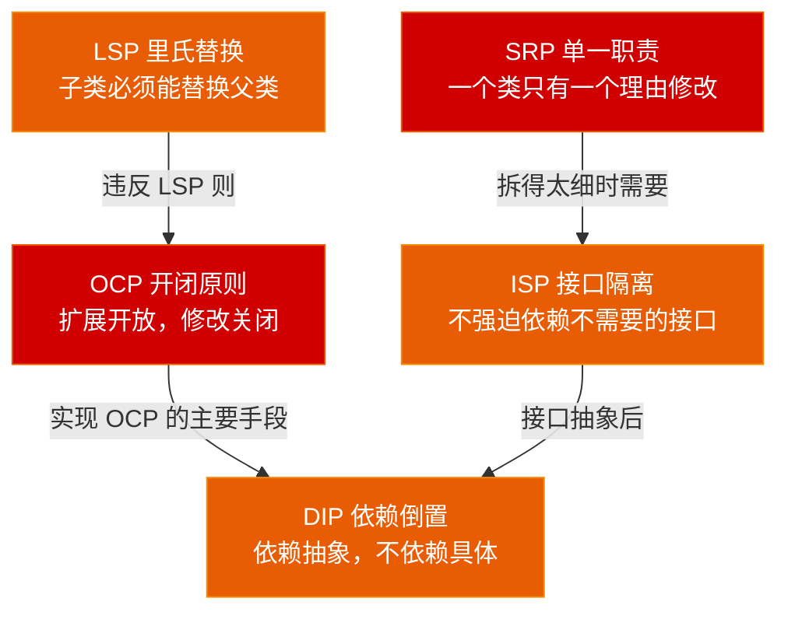
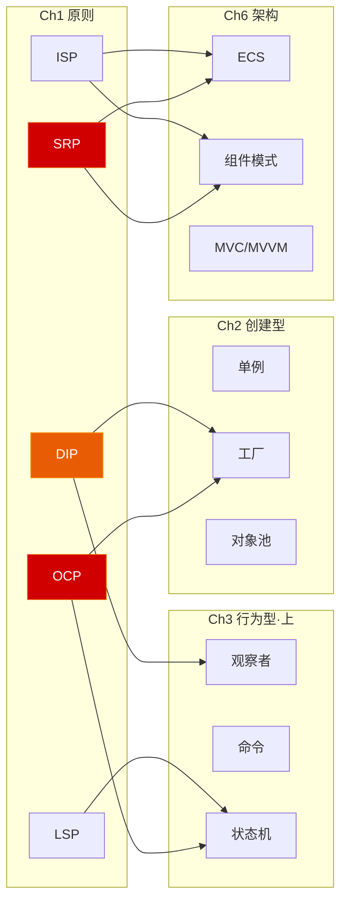

# 第一章 设计原则与 SOLID

> **一句话理解**：设计模式是"术"，SOLID 是"道"。模式告诉你"怎么解决某类问题"，原则告诉你"怎么判断一段代码是好是坏"——没有原则，模式就成了生搬硬套。

> 📋 前置知识：C++ Ch3（OOP 多态）、C++ Ch5（模板泛型）

---

## 1.1 场景问题 —— 当代码失控时

先来看一段**真实的游戏开发噩梦**。这是一个"上帝类" `GameCharacter`——你几乎一定在某个项目里见过它的影子：

```cpp
class GameCharacter {
public:
    // ========== 渲染相关 ==========
    void LoadModel(const std::string& path);
    void PlayAnimation(const std::string& name);
    void SetMaterial(Material* mat);
    Mesh* GetMesh();

    // ========== 物理/移动 ==========
    void MoveTo(const Vector3& target);
    void Jump();
    void ApplyGravity(float dt);
    bool IsGrounded();

    // ========== 战斗 ==========
    void TakeDamage(float amount, DamageType type);
    void Heal(float amount);
    void Die();
    float CalculateDamage() const;
    bool IsAlive() const;

    // ========== AI ==========
    void UpdateAI(float dt);
    void SetBehaviorTree(BehaviorTree* bt);
    Vector3 FindNearestEnemy();

    // ========== 输入处理 ==========
    void OnKeyPress(KeyCode key);
    void OnMouseClick(const Vector2& pos);

    // ========== 音效 ==========
    void PlayFootstepSound();
    void PlayHitSound();

    // ========== 属性/数值 ==========
    float GetHealth() const;
    float GetMaxHealth() const;
    int GetLevel() const;
    void SetAttribute(const std::string& name, float value);

    // ... 还有 50 个方法省略 ...

private:
    // 渲染
    Mesh* mesh;
    Material* material;
    AnimationClip* currentAnim;

    // 物理
    Vector3 position;
    Vector3 velocity;
    float gravityScale;

    // 战斗
    float health;
    float maxHealth;
    float attackPower;
    DamageType resistanceType;

    // AI
    BehaviorTree* behaviorTree;
    float detectionRange;

    // 输入
    KeyBinding* keyBindings[16];

    // 音效
    AudioClip* footstepSound;
    AudioClip* hitSound;

    // ... 还有 30 个字段 ...
};
```

**问题在哪里？**

每当你需要修改任何功能——比如策划说"加一个二段跳"——你就冲进这个 3000 行的类里，在某个角落加几行。你不确定改了什么，也不确定破坏了什么。测试说你"改好了"，但 QA 告诉你"怪物 AI 不动了"，你完全不知道为什么。

这就是 SOLID 要解决的问题。五个原则，逐一拆解。

---

## 1.2 SOLID 全景图



SOLID 不是五条孤立的教条——它们相互支撑。SRP 告诉你"何时拆分"，ISP 告诉你怎么拆；OCP 是目标，DIP 是实现手段；LSP 是继承的约束——违反它，OCP 也会跟着崩溃。

下面逐一拆解，每条原则都遵循同一结构：**失败案例 → 原则阐述 → 重构方案 → 游戏场景**。

---

## 1.3 SRP —— 单一职责原则

> **定义**：一个类应该**只有一个理由**被修改。
>
> 换个说法：一个类应该只对一个角色负责。这个"角色"可以是策划、技术美术、引擎组——而不是一个人承担所有。

### 失败案例

回到 `GameCharacter`。这个类承载了至少 6 种职责：

| 职责 | 修改的触发者 | 修改频率 |
|------|------------|---------|
| 渲染（模型/动画/材质） | 美术/TA | 高 |
| 物理（移动/重力/跳跃） | 策划调手感 | 极高 |
| 战斗（血量/伤害/死亡） | 策划调数值 | 极高 |
| AI（行为树/寻敌） | AI 程序员 | 中 |
| 输入（按键绑定） | 策划调操作 | 中 |
| 音效（脚步/受击） | 音效师 | 低 |

**每一次改动都踩进同一个类**。美术换了个模型加载方式——角色 AI 不动了。为什么？因为有人不小心把 AI 初始化放到了 `LoadModel()` 里。你根本想不到去看那里。

### 原则阐述

SRP 不是让你无脑把类拆得越细越好。关键是**修改的原因来自不同的角色**。

```cpp
// ❌ 差：一个类承担多种职责
class Player {
    void UpdateMovement();   // 策划关心
    void Render();           // 美术关心
    void SaveToDisk();       // 后台程序员关心
    void PlaySound();        // 音效师关心
};

// ✅ 好：按职责拆分为独立的类
class MovementComponent { void Update(float dt); };
class RenderComponent    { void Draw(); };
class SaveSystem         { void Save(PlayerData& data); };
class AudioComponent     { void PlaySound(SoundId id); };
```

这样当音效师要换音频库时，他只改 `AudioComponent`，不会碰到渲染代码。

### C++ 实现示例

```cpp
// ========== 重构前：一个类包含所有 ==========
class GameCharacter {
    Vector3 position;
    float health;
    Mesh* mesh;

public:
    void MoveTo(const Vector3& target) { /* ... */ }
    void TakeDamage(float dmg)          { /* ... */ }
    void Draw()                         { /* ... */ }
};

// ========== 重构后：按职责拆分 ==========

// 纯数据结构——数据本身不应该知道怎么被修改
struct CharacterData {
    Vector3 position;
    Vector3 velocity;
    float health;
    float maxHealth;
};

// 移动系统——只关心位置和速度
class MovementSystem {
public:
    void MoveTo(CharacterData& data, const Vector3& target) {
        Vector3 direction = (target - data.position).Normalized();
        data.position += direction * speed * Time::Delta();
    }

    void Jump(CharacterData& data) {
        if (IsGrounded(data)) {
            data.velocity.y = jumpForce;
        }
    }

private:
    float speed = 5.0f;
    float jumpForce = 10.0f;
    bool IsGrounded(const CharacterData& data) const;
};

// 战斗系统——只关心血量
class CombatSystem {
public:
    void TakeDamage(CharacterData& data, float amount) {
        data.health = std::max(0.0f, data.health - amount);
        if (data.health <= 0.0f) {
            OnDeath(data);
        }
    }

    // 死亡事件——观察者模式（Ch3 会深入讲）
    std::function<void(const CharacterData&)> OnDeath;
};

// 渲染组件——只关心怎么画
class RenderComponent {
    Mesh* mesh;
    Material* material;
public:
    void Draw(const CharacterData& data) {
        Graphics::DrawMesh(mesh, material, data.position);
    }
};
```

> 💡 **关键变化**：`CharacterData` 从拥有方法变成了被方法处理。这就是从 OOP 的重型对象 → ECS 风格的数据驱动的第一步。

### 🎮 游戏场景

| 场景 | 违反 SRP 的后果 | SRP 重构后 |
|------|---------------|-----------|
| 策划调跳跃手感 | 改 `GameCharacter::Jump()` 时可能误改动渲染代码 | 只改 `MovementSystem::Jump()` |
| 加网络同步 | `position` 的同步逻辑塞进 `Update()`，和 AI 混在一起 | `NetworkSyncSystem` 独立处理 |
| 换渲染管线（DX→Vulkan） | `Draw()` 改了后 AI 行为树报空指针 | `RenderComponent` 独立修改 |

---

## 1.4 OCP —— 开闭原则

> **定义**：对**扩展**开放，对**修改**关闭。
>
> 你加一个新功能时，应该**写新代码**而非**改旧代码**。因为改旧代码 = 引入回归 Bug 的风险。

### 失败案例

这是一个伤害计算系统。每次加新伤害类型都要改 `switch`：

```cpp
// ❌ 违反 OCP：加一种伤害类型就要改这段代码
float CalculateDamage(DamageType type, float baseDamage, const Enemy& target) {
    switch (type) {
    case DamageType::PHYSICAL:
        return baseDamage - target.GetArmor();
    case DamageType::MAGICAL:
        return baseDamage * (1.0f - target.GetMagicResist());
    case DamageType::FIRE:
        return baseDamage * GetFireMultiplier(target);
    case DamageType::ICE:
        return baseDamage * GetIceMultiplier(target) + SlowEffect(target);
    // 策划说"加一个'真实伤害'类型"——你又来改这里了
    default:
        return baseDamage;
    }
}
```

**真实的痛苦**：策划加了第 6 种伤害类型后，你的 `CalculateDamage` 从 30 行涨到 200 行。每个新类型都在同一个函数里堆砌——这是 Bug 的温床。

### 原则阐述

OCP 的核心思想：用**抽象 + 多态**替代条件分支。

```cpp
// ✅ OCP 版本：加新伤害类型 = 加新类，不改旧代码

// 抽象基类——定义了"伤害计算"这个契约
class IDamageCalculator {
public:
    virtual float Calculate(float baseDamage, const Enemy& target) const = 0;
    virtual ~IDamageCalculator() = default;
};

class PhysicalDamage : public IDamageCalculator {
public:
    float Calculate(float base, const Enemy& target) const override {
        return base - target.GetArmor();
    }
};

class MagicalDamage : public IDamageCalculator {
public:
    float Calculate(float base, const Enemy& target) const override {
        return base * (1.0f - target.GetMagicResist());
    }
};

class TrueDamage : public IDamageCalculator {
public:
    float Calculate(float base, const Enemy&) const override {
        return base;  // 无视一切防御——新类型，新建一个类就完了
    }
};

// 使用方——不再依赖具体类型
float ApplyDamage(const IDamageCalculator& calculator,
                  float base, const Enemy& target) {
    return calculator.Calculate(base, target);
}
```

**策划加了第 7 种伤害类型？** 新建一个继承 `IDamageCalculator` 的类，不改任何已有代码。

> ⚠️ **OCP 不是绝对的**。如果你预判"这个维度会频繁扩展"，才值得做抽象。如果伤害类型只有两种且三年没变过，那一个 `if-else` 就够了。过度设计也是病——见 1.9 节的 KISS/YAGNI。

### 策略模式预告

上面这个例子本质上就是**策略模式**（Ch4 会深入）。OCP 是目标，策略模式是实现手段之一。这张关系图贯穿全系列：

```
OCP（原则："应该怎么做"）
  ├── 实现手段1：策略模式（Ch4）
  ├── 实现手段2：模板方法（Ch4）
  ├── 实现手段3：工厂模式（Ch2）
  └── 实现手段4：装饰器模式（Ch5）
```

### 🎮 游戏场景

| 场景 | 违反 OCP | OCP 重构 |
|------|---------|---------|
| 武器系统 | 加新武器类型要改 8 个 switch | `IWeapon` 接口 + 具体武器类 |
| Buff/Debuff | 加新效果改 `ApplyBuff()` | `IBuffEffect` + 配置驱动 |
| 技能系统 | 加新技能改 `CastSkill()` | `ISkill` + 反射/工厂创建 |
| AI 决策 | 加新行为改 `DecideAction()` | `IAction` 策略 + 行为树节点 |

---

## 1.5 LSP —— 里氏替换原则

> **定义**：子类型必须能够**完全替换**其基类型。程序中的任何使用基类的地方，换成子类后行为应该仍然正确。
>
> 这是面向对象中最容易被违反的原则——因为它不是语法错误，编译器不会告诉你。

### 失败案例：矩形与正方形

这是 LSP 的经典陷阱，几乎每本设计模式书都会讲——因为它太容易犯了：

```cpp
class Rectangle {
protected:
    int width, height;
public:
    virtual void SetWidth(int w)  { width = w; }
    virtual void SetHeight(int h) { height = h; }
    int GetWidth()  const { return width; }
    int GetHeight() const { return height; }
    int Area()      const { return width * height; }
};

// "正方形是特殊的矩形"——数学上对，代码上错
class Square : public Rectangle {
public:
    void SetWidth(int w) override {
        Rectangle::SetWidth(w);
        Rectangle::SetHeight(w);  // 保持正方形约束
    }
    void SetHeight(int h) override {
        Rectangle::SetWidth(h);
        Rectangle::SetHeight(h);  // 保持正方形约束
    }
};

// ========== Bug 在此 ==========
void ResizeShape(Rectangle& r) {
    r.SetWidth(5);
    r.SetHeight(3);
    // 对于 Rectangle：area = 5 × 3 = 15  ✅
    // 对于 Square：area = 3 × 3 = 9   ❌ 调用方不知道发生了什么
    assert(r.Area() == 15);  // 传入 Square 时爆炸
}
```

**问题根源**：`Square` 对 `SetWidth`/`SetHeight` 做了**比父类更强的约束**（宽高必须相等）。调用方不知道这个约束，于是出 Bug。这就是 LSP 的核心：子类不能强化父类的前置条件，也不能弱化父类的后置条件。

### 游戏中的真实案例

```cpp
// ❌ 一个游戏中的 LSP 违反案例

class Entity {
public:
    virtual void MoveTo(const Vector3& target) {
        position = target;
    }
    virtual void TakeDamage(float amount) {
        health -= amount;
    }
protected:
    Vector3 position;
    float health;
};

// 建筑物——不能移动，没有血量
class Building : public Entity {
public:
    void MoveTo(const Vector3&) override {
        // 建筑不能移动——抛异常？
        throw std::logic_error("Building cannot move!");
    }

    void TakeDamage(float amount) override {
        // 建筑没有传统血量——空实现？
        // 调用方期望 Entity 扣血，Building 什么都不做
    }
};

// 调用方
void HandleEntityClick(Entity& e, const Vector3& clickPos) {
    e.MoveTo(clickPos);  // 点了建筑 → 崩溃
}
```

**正确的做法**：`Building` 不应该继承 `Entity`，或者 `Entity` 应该拆分为更细的接口：

```cpp
// ✅ LSP 安全的拆分
class IMovable {
public:
    virtual void MoveTo(const Vector3& target) = 0;
    virtual ~IMovable() = default;
};

class IDamageable {
public:
    virtual void TakeDamage(float amount) = 0;
    virtual ~IDamageable() = default;
};

class Character : public IMovable, public IDamageable {
    // 角色既可移动又可以被伤害
};

class Building : public IDamageable {
    // 建筑可以被摧毁，但不能移动——不继承 IMovable
};

// 现在调用方明确表达自己的需求
void HandleClick(IMovable& movable, const Vector3& pos) {
    movable.MoveTo(pos);  // 编译期保证：只有能移动的才会传进来
}
```

> 💡 **这就是 ISP（接口隔离）的动机**。当你发现 LSP 被违反时，往往意味着基类太大了。

### LSP 的检查清单

判断你是否违反了 LSP，问自己三个问题：

1. **子类是否抛了父类不会抛的异常？**（`Building::MoveTo` throw）
2. **子类是否对同一方法做了更严格的限制？**（`Square::SetWidth` 要求宽高相等）
3. **子类是否空实现了父类的重要方法？**（`Building::TakeDamage` 什么都不做）

三个问题中任何一个答"是"→ 你违反了 LSP。

### 🎮 游戏场景

| 违反 LSP | 表现 | 正确做法 |
|---------|------|---------|
| `Item` 基类，`QuestItem` 子类无法 `Drop()` | 任务物品丢弃时报错 | `IDroppable` 接口单独定义 |
| `Weapon` 基类，`Bow` 子类不能 `MeleeAttack()` | 弓近战攻击调用 undefined | 拆分为 `IMeleeWeapon` / `IRangedWeapon` |
| `Enemy` 基类，`Boss` 子类 `Flee()` 是空方法 | Boss 逃跑逻辑缺失 | Boss 的行为是"死战不退"而非空实现 |

---

## 1.6 ISP —— 接口隔离原则

> **定义**：客户端不应该被迫依赖它**不使用**的接口。
>
> 换句话说：胖接口应该拆成多个小而专注的接口。

### 失败案例

```cpp
// ❌ 一个"全能"接口——每个实体都必须实现所有方法
class IEntity {
public:
    virtual void MoveTo(const Vector3& target) = 0;
    virtual void Attack(Entity* target) = 0;
    virtual void TakeDamage(float amount) = 0;
    virtual void Heal(float amount) = 0;
    virtual void PlayAnimation(const std::string& name) = 0;
    virtual void PlaySound(SoundId id) = 0;
    virtual void SaveToFile(std::ofstream& file) = 0;
    virtual void LoadFromFile(std::ifstream& file) = 0;
    virtual ~IEntity() = default;
};

// 陷阱——实现了 6 个空方法
class Trap : public IEntity {
public:
    void MoveTo(const Vector3&) override {}        // 陷阱不能动
    void Attack(Entity*) override {}                // 陷阱不攻击
    void Heal(float) override {}                    // 陷阱不能治疗
    void PlayAnimation(const std::string&) override {} // 陷阱没动画
    void PlaySound(SoundId) override {}             // 也许有音效
    void SaveToFile(std::ofstream&) override {}     // 不需要存档
    void LoadFromFile(std::ifstream&) override {}   // 不需要读档

    // 真正的逻辑只有这一个
    void TakeDamage(float amount) override {
        durability -= amount;
        if (durability <= 0) Destroy();
    }
private:
    float durability = 100.0f;
};
```

**问题**：6 个空实现 + 1 个真实逻辑。调用方只看 `IEntity` 接口根本不知道 `Trap` 实际支持什么。更致命的是——以后 `IEntity` 加一个新方法，所有子类都得改（无论需不需要）。

### 正确做法

```cpp
// ✅ 小而专注的接口

class IMovable {
public:
    virtual void MoveTo(const Vector3& target) = 0;
    virtual ~IMovable() = default;
};

class IDamageable {
public:
    virtual void TakeDamage(float amount) = 0;
    virtual ~IDamageable() = default;
};

class IAttacker {
public:
    virtual void Attack(IDamageable* target) = 0;
    virtual ~IAttacker() = default;
};

class ISerializable {
public:
    virtual void Save(std::ofstream& file) = 0;
    virtual void Load(std::ifstream& file) = 0;
    virtual ~ISerializable() = default;
};

// 陷阱只实现自己需要的
class Trap : public IDamageable {
public:
    void TakeDamage(float amount) override { /* ... */ }
};

// Player 实现所有需要的
class Player : public IMovable, public IDamageable, public IAttacker, public ISerializable {
    // 每个接口都有真正的实现
};

// 调用方现在精确表达自己的需求
void MoveAllUnits(std::vector<IMovable*>& units, const Vector3& target) {
    for (auto* u : units) {
        u->MoveTo(target);  // 只能传可移动的，编译期就过滤了 Trap
    }
}
```

> 💡 **ISP 和 SRP 的关系**：SRP 管的是"类"，ISP 管的是"接口"。一个类可以遵循 SRP（单一职责），但它的接口可能违反 ISP（太胖了）。两者配合使用——SRP 告诉你"什么时候拆"，ISP 告诉你"怎么拆"。

### 🎮 游戏场景

```cpp
// Unity 风格的组件系统就是 ISP 的极致体现
class GameObject {
    std::vector<Component*> components;

public:
    template<typename T>
    T* GetComponent() {
        for (auto* c : components) {
            if (auto* casted = dynamic_cast<T*>(c))
                return casted;
        }
        return nullptr;
    }
};

// 每个 Component 就是一个"小接口"
class HealthComponent : public Component {
public:
    void TakeDamage(float amount);
    void Heal(float amount);
};

class MovementComponent : public Component {
public:
    void MoveTo(const Vector3& target);
    void Jump();
};

// 现在任意 GameObject 都可以按需组合
GameObject* trap = new GameObject();
trap->AddComponent<HealthComponent>();      // 有血量
// 没有 MovementComponent —— 不能动

GameObject* player = new GameObject();
player->AddComponent<HealthComponent>();    // 有血量
player->AddComponent<MovementComponent>();  // 能移动
player->AddComponent<AttackComponent>();    // 能攻击
```

这就是 ISP 在游戏引擎中的落地——**组件模式**（Ch6 会深入讲）。

---

## 1.7 DIP —— 依赖倒置原则

> **定义**：高层模块不应该依赖低层模块，两者都应该依赖**抽象**。
>
> 这是 SOLID 中最抽象的一条，但也是最强大的一条——它是 OCP 的主要实现手段。

### 失败案例

```cpp
// ❌ 高层模块（SkillSystem）直接依赖低层模块（AudioManager）
class AudioManager {
public:
    void PlaySound(const std::string& filename) {
        // 调用 FMOD 底层 API
        fmod::System::Play(filename);
    }
};

class SkillSystem {
    AudioManager* audio;  // 直接依赖具体类

public:
    void CastSkill(const Skill& skill) {
        // 技能逻辑...
        audio->PlaySound(skill.soundName);  // 硬编码依赖
    }
};

// 问题：如果要换音频引擎（FMOD → Wwise），你需要改 SkillSystem 吗？
// 答案：是——因为 SkillSystem 直接持有 AudioManager。
// 但 SkillSystem 只是"想播放一个音效"，它不应该关心用的是什么音频引擎。
```

### 正确做法

```cpp
// ✅ 依赖抽象

// 抽象——定义"播放音效"的契约
class IAudioService {
public:
    virtual void PlaySound(const std::string& name) = 0;
    virtual ~IAudioService() = default;
};

// 具体实现——FMOD 版
class FmodAudioService : public IAudioService {
public:
    void PlaySound(const std::string& name) override {
        fmod::System::Play(name.c_str());
    }
};

// 具体实现——Wwise 版（换引擎只要新写一个类）
class WwiseAudioService : public IAudioService {
public:
    void PlaySound(const std::string& name) override {
        Wwise::PostEvent(name.c_str());
    }
};

// 高层模块——只依赖抽象
class SkillSystem {
    IAudioService* audio;  // 依赖接口，不依赖具体类

public:
    SkillSystem(IAudioService* audioService)
        : audio(audioService) {}

    void CastSkill(const Skill& skill) {
        audio->PlaySound(skill.soundName);  // 不关心底层是什么引擎
    }
};
```

> 💡 **"倒置"的含义**：传统的依赖方向是 `SkillSystem → AudioManager`（高层依赖低层）。倒置之后变成了 `SkillSystem → IAudioService ← FmodAudioService`——**低层和高层都依赖抽象**。控制方向反转了。

### DIP 的三个关键规则

1. **变量不持有具体类的引用**：用 `IAudioService*` 不用 `AudioManager*`
2. **类不继承具体类**：继承自抽象接口，不继承自具体实现
3. **方法不重写父类的已实现方法**：只重写纯虚函数

> ⚠️ 注意：第 3 条在实际开发中不可能 100% 遵守（虚函数存在的意义就是被 override），但前两条是硬规则。

### 🎮 游戏场景

| 场景 | DIP 应用 |
|------|---------|
| 输入系统 | `IInputProvider` → `KeyboardInput` / `GamepadInput` / `TouchInput` |
| 存档系统 | `ISaveService` → `FileSave` / `CloudSave` / `MemorySave`（测试用） |
| 网络层 | `INetworkService` → `PhotonService` / `MirrorService` / `MockNetwork`（单机测试） |
| 平台抽象 | `IPlatformService` → `WindowsPlatform` / `AndroidPlatform` / `iOSPlatform` |

**面试中常问的 DIP 实战问题**：

> "你如何设计一个支持跨平台的存档系统？"

参考答案：定义 `ISaveService` 接口（Save/Load/Delete），PC 上用 `FileSaveService`，手机上用 `CloudSaveService`。游戏逻辑层只依赖 `ISaveService`，通过构造函数注入具体实现。这样换平台不需要改游戏逻辑。

---

## 1.8 补充原则 —— 组合优于继承、KISS、YAGNI、DRY

SOLID 不是全部。还有三条独立原则，在设计决策时同样重要。

### 组合优于继承

```cpp
// 继承方案：深层继承树
class Entity {};
class Character : public Entity {};
class Humanoid : public Character {};
class Player : public Humanoid {};
class Mage : public Player {};
class FireMage : public Mage {};
// 策划说"加一个冰火双修的法师"——你怎么继承？？同时继承 FireMage 和 IceMage？

// 组合方案：能力组件
class Entity {
    std::vector<Component*> components;
};

// 冰火双修法师：加一个 FireComponent 和一个 IceComponent 即可
auto* hybridMage = new GameObject();
hybridMage->AddComponent<FireMagicComponent>();
hybridMage->AddComponent<IceMagicComponent>();
```

> 继承是**白盒复用**（你知道父类的内部细节），组合是**黑盒复用**（你只知道组件的接口）。游戏开发中组合几乎总是更好的选择——这也是为什么 Unity/UE 都用组件模式。

**什么时候继承是 OK 的？** 当"is-a"关系真正成立且稳定时。比如 `Dog` 和 `Cat` 确实 "is-a" `Animal`，这个关系不会变。但 `Player` 不一定永远 "is-a" `Humanoid`——策划可能让它变亡灵。

### KISS —— Keep It Simple, Stupid

```cpp
// ❌ 过度设计：一个简单的 bool 被套上了策略模式
class ICondition {
public:
    virtual bool Evaluate() const = 0;
    virtual ~ICondition() = default;
};
class IsAliveCondition : public ICondition {
    Entity* entity;
public:
    bool Evaluate() const override { return entity->IsAlive(); }
};
class AndCondition : public ICondition { /* ... */ };
class OrCondition : public ICondition { /* ... */ };
// 实际使用：只是要判断角色是否活着

// ✅ 直接写
if (entity->IsAlive()) {
    // do something
}
```

**原则**：能用简单的方案解决问题，就不要引入模式。设计模式有学习成本和理解成本——每一层抽象都需要接手的同事去理解。

### YAGNI —— You Ain't Gonna Need It

```cpp
// ❌ "以后可能会用"的预留设计
class Skill {
    // 策划明确说了只有主动技能和被动技能，但你写了 6 种类型
    enum class SkillType {
        Active, Passive, Toggle, Channeling, Charge, Ultimate,
        // 后面三种"以后可能会加"
    };

    // "以后可能会加网络同步"——预留了序列化接口
    virtual void Serialize(NetworkBuffer& buf);
    virtual void Deserialize(NetworkBuffer& buf);
};

// ✅ 只实现当前需要的
class Skill {
    enum class SkillType { Active, Passive };

    // 等真的有网络需求了再加——加了你也用不了，因为还没测试过
};
```

> YAGNI 和 OCP 需要平衡。OCP 让你为"可预见的扩展"做准备，YAGNI 让你不要为"想象中的扩展"做准备。区分的关键：**这个扩展方向之前发生过吗？** 如果伤害类型每两个月就加一种 → OCP。如果"以后可能要支持手柄"但项目做了两年都没提 → YAGNI。

### DRY —— Don't Repeat Yourself

```cpp
// ❌ 重复代码
void Player::TakeDamage(float amount) {
    health -= amount;
    if (health <= 0) {
        OnDeath();
        GameManager::Instance().OnPlayerDeath();
    }
    ui->UpdateHealthBar(health / maxHealth);
}

void Enemy::TakeDamage(float amount) {
    health -= amount;
    if (health <= 0) {
        OnDeath();
        QuestSystem::Instance().OnEnemyKilled(this);
    }
    // 血条逻辑和 Player 一模一样——复制过来了
}

// ✅ 抽取公共逻辑
void DamageableComponent::TakeDamage(float amount) {
    health -= amount;
    if (health <= 0) {
        OnDeath();  // 各自注册的事件回调
    }
    OnHealthChanged(health / maxHealth);  // UI 通过事件更新
}
```

> 重复代码的代价不在写的时候——在改的时候。Bug 修了 3 个地方漏了 1 个，这就是 DRY 的价值。

---

## 1.9 实战重构 —— 从"上帝类"到 SOLID 设计

回到最初的 `GameCharacter`。现在用 SOLID 原则重构它。

### 重构前

```cpp
class GameCharacter {
    // 6 种职责、50 个方法、30 个字段
    // 每次修改都心惊胆颤
};
```

### 重构后

```cpp
// ============ 纯数据 ============
struct CharacterData {
    Vector3 position;
    Vector3 velocity;
    float health;
    float maxHealth;
    float moveSpeed;
};

// ============ 抽象接口（DIP + ISP）============
class IMovable {
public:
    virtual void MoveTo(const Vector3& target) = 0;
    virtual void Jump() = 0;
    virtual ~IMovable() = default;
};

class IDamageable {
public:
    virtual void TakeDamage(float amount) = 0;
    virtual ~IDamageable() = default;
};

// ============ 组件实现（SRP + 组合优于继承）============
class MovementComponent : public IMovable {
    CharacterData* data;
public:
    void MoveTo(const Vector3& target) override {
        Vector3 dir = (target - data->position).Normalized();
        data->position += dir * data->moveSpeed * Time::Delta();
    }
    void Jump() override {
        if (IsGrounded()) data->velocity.y = 10.0f;
    }
private:
    bool IsGrounded() const;
};

// 伤害计算——OCP：通过策略模式扩展
class IDamageCalculator {
public:
    virtual float Calculate(float base, const CharacterData& target) const = 0;
    virtual ~IDamageCalculator() = default;
};

class HealthComponent : public IDamageable {
    CharacterData* data;
    std::vector<std::unique_ptr<IDamageCalculator>> damageModifiers;  // OCP

public:
    void TakeDamage(float amount) override {
        float finalDmg = amount;
        for (auto& mod : damageModifiers) {
            finalDmg = mod->Calculate(finalDmg, *data);
        }
        data->health = std::max(0.0f, data->health - finalDmg);
        if (data->health <= 0) OnDeath();
    }

    std::function<void()> OnDeath;  // 观察者模式（Ch3 深入）
};

// 渲染（SRP）——独立的 RenderComponent
class RenderComponent {
    Mesh* mesh;
    Material* material;
public:
    void Draw(const CharacterData& data) {
        Graphics::DrawMesh(mesh, material, data.position);
    }
};

// ============ 使用方 ============
class Character {
public:
    CharacterData data;
    MovementComponent movement{&data};
    HealthComponent health{&data};
    RenderComponent render;

    Character() {
        // 依赖注入——外部可以替换组件实现（DIP）
        health.OnDeath = [this] {
            render.PlayDeathAnimation();
            AudioService::Get().PlaySound("death_sfx");
        };
    }
};
```

### 重构前后对比

| 维度 | 重构前 | 重构后 |
|------|--------|--------|
| 类的职责数 | 1 个类承担 6 种职责 | 每个组件 1 种职责 |
| 加新伤害类型 | 改 `CalculateDamage()` 的 switch | 新增一个 `IDamageCalculator` 子类 |
| 换音频引擎 | 改 `GameCharacter` 内部代码 | 换 `IAudioService` 的实现 |
| 单元测试 | 几乎无法测试（所有东西耦合在一起） | 每个组件可独立 Mock 测试 |
| 新同事上手 | 看 3000 行代码 | 看 100 行的 `MovementComponent` |

---

## 1.10 原则与后续章节的映射



每种设计模式都在实现某个或某些 SOLID 原则。后续章节讲到具体的模式时，会回头标注"这个模式主要体现了 XXX 原则"——这样你不会只见树木不见森林。

---

## 1.11 本章回顾

> **SOLID 不是要你背下来的教条，而是你做 Code Review 时可以用的检查清单。**

| 原则 | 一句检查 | 最常见的违反方式 |
|------|---------|----------------|
| **S** RP | 这个类做的事情超过一件了吗？ | "上帝类"——3000 行的 `Player` |
| **O** CP | 加功能需要改已有代码吗？ | switch-case 满天飞 |
| **L** SP | 子类能完全替换父类吗？ | 子类空实现父类方法 / 子类抛异常 |
| **I** SP | 接口强迫实现了不需要的方法吗？ | "全能接口"→空实现地狱 |
| **D** IP | 依赖的是接口还是具体类？ | 高层模块直接 `new` 低层具体类 |

**记忆技巧**：按重要性和使用频率排序——

1. **SRP** 是最基础的——先学会把类拆小
2. **DIP** 是最高杠杆的——引入抽象后，OCP 自然达成
3. **ISP** 是 SRP 在接口层面的延伸
4. **OCP** 是目标，不是手段——你通过 DIP + 策略模式来达成它
5. **LSP** 是约束——确保你的继承关系不会偷偷破坏程序

> 📖 下一章：[第二章 创建型模式](./02_creational) —— 单例、工厂、对象池。当你把类按 SRP 拆小之后，下一步问题就是"谁来创建这些对象？怎么创建？"
