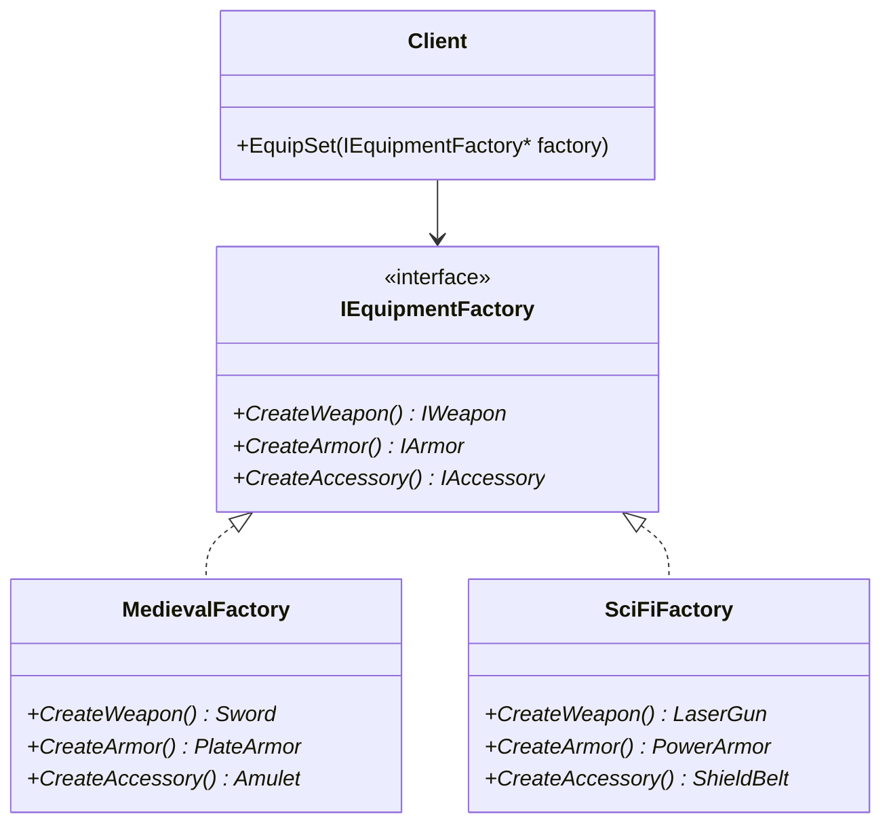
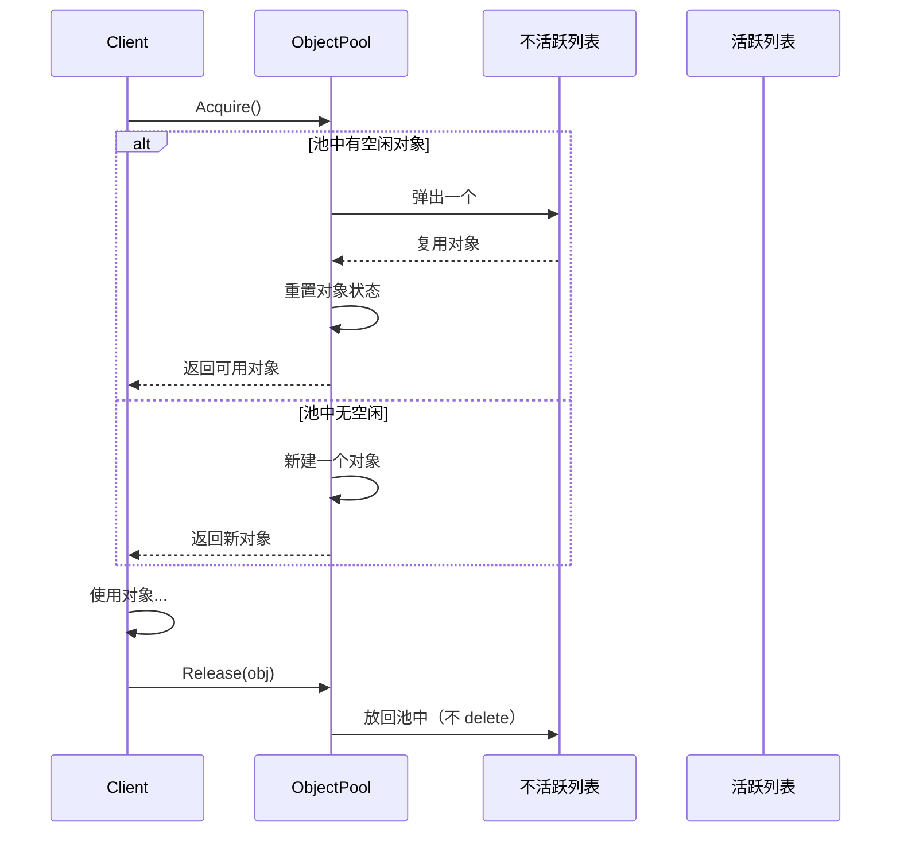

# 第二章 创建型模式：单例、工厂与对象池

> **一句话理解**：创建型模式回答三个问题——**谁创建**（单例/工厂）、**何时创建**（延迟/预创建）、**怎么创建**（复用 or 新建）。这三个问题在游戏开发中每天都要面对。

> 📋 前置知识：Ch1（SOLID 原则，特别是 DIP）、C++ Ch7（并发与线程安全）

---

## 2.1 场景问题 —— 三个创建困境

在正式开始之前，先看三个游戏开发中真实的"创建困境"：

**困境 A —— 全局唯一的管理器**

```cpp
// 游戏中有 AudioManager，全局只需要一个实例。
// 但新人同事不知道，在 Enemy::Attack() 里直接 new 了一个：
void Enemy::Attack() {
    auto* audio = new AudioManager();  // 第二个实例！音效系统爆炸
    audio->PlaySound("hit.wav");
}

// 你需要的：一种机制，保证某个类全局只有一个实例，
// 而且任何人都不能随便 new。
```

**困境 B —— 配置驱动的对象创建**

```cpp
// 策划在 Excel 里配了 20 种敌人：
// | ID | 名称 | 模型路径 | 血量 | 技能ID |
// | 1  | 哥布林 | goblin.fbx | 100 | 101 |
// | 2  | 兽人   | orc.fbx    | 300 | 201 |
// | 3  | 骷髅   | skeleton.fbx| 80 | 301 |

// 你的代码是 20 个 if-else：
if (id == 1)      return new Goblin();
else if (id == 2) return new Orc();
else if (id == 3) return new Skeleton();
// 策划加了第 21 种——你又来改这里。违反 OCP。

// 你需要的：一种机制，读取配置 → 自动创建对应类型的对象，
// 加新类型不需要改创建逻辑。
```

**困境 C —— 频繁创建销毁的性能问题**

```cpp
// 弹幕游戏中，每帧射出 50 发子弹，每发子弹：
// new Bullet() → 内存分配 → 初始化 → 使用 → 飞出屏幕 → delete
// 每秒 3000 次 new/delete，Profiler 显示：
// GC Alloc: 120KB/frame
// 内存碎片持续增长，20 分钟后掉帧

// 你需要的：一种机制，子弹用完后不 delete，放回池子，下次直接取。
```

这三个困境正好对应本章的四种模式：

| 困境 | 核心问题 | 对应模式 |
|------|---------|---------|
| A — 全局唯一实例 | 谁能创建？ | 单例 |
| B — 配置驱动创建 | 创建什么类型？ | 工厂方法 / 抽象工厂 |
| C — 频繁创建销毁 | 复用还是新建？ | 对象池 |

---

## 2.2 单例 (Singleton)

> **意图**：确保一个类**只有一个实例**，并提供**全局访问点**。
>
> **体现的 SOLID 原则**：SRP（单例只负责管理自身实例 + 自己的业务逻辑）

### 场景问题

回到困境 A。`AudioManager` 需要全局唯一，因为底层音频引擎（FMOD/Wwise）本身就是一个全局系统——两个实例会同时操作硬件，导致崩溃。

### 菜鸟版：Meyers' Singleton

```cpp
class AudioManager {
public:
    // C++11 保证：static 局部变量初始化是线程安全的
    static AudioManager& GetInstance() {
        static AudioManager instance;
        return instance;
    }

    void PlaySound(const std::string& name) {
        // ...
    }

    // 禁止拷贝和赋值
    AudioManager(const AudioManager&) = delete;
    AudioManager& operator=(const AudioManager&) = delete;

private:
    AudioManager() {
        // 初始化音频引擎
    }
    ~AudioManager() {
        // 清理音频引擎
    }
};

// 使用
AudioManager::GetInstance().PlaySound("explosion.wav");
```

> 💡 **为什么这是"菜鸟版"却够了？** C++11 起，`static` 局部变量初始化的线程安全由编译器保证（通常用类似 DCL 的方式实现）。对于 90% 的游戏场景，这就是最佳实践。

### 面试版：双重检查锁定 (DCL)

面试官可能追问"不用 C++11 怎么写"。这就是经典的 DCL：

```cpp
// ⚠️ 仅供面试展示——实际项目请用 Meyers' Singleton

class GameConfig {
public:
    static GameConfig* GetInstance() {
        // 第一次检查：大多数时候 instance 已存在，避免加锁开销
        if (instance == nullptr) {
            std::lock_guard<std::mutex> lock(mutex);
            // 第二次检查：防止在等锁期间，另一个线程已经创建了实例
            if (instance == nullptr) {
                instance = new GameConfig();
            }
        }
        return instance;
    }

private:
    static GameConfig* instance;
    static std::mutex mutex;

    GameConfig() = default;
};

GameConfig* GameConfig::instance = nullptr;
std::mutex GameConfig::mutex;
```

> ⚠️ **DCL 在 C++11 之前的坑**：编译器可能重排指令（先写 `instance` 指针，再执行构造函数），导致另一个线程拿到未完全构造的对象。C++11 的 `atomic` + `memory_order` 解决了这个问题——但直接用 Meyers' Singleton 更简单。

### 工业版：带生命周期的单例

游戏引擎中的单例有一个额外需求：**析构顺序**。引擎关闭时，`AudioManager` 必须在 `ResourceManager` 之前析构（因为音效资源需要资源管理器来释放）。

```cpp
// 带优先级的单例管理器
class SingletonManager {
public:
    template<typename T>
    static void Register(int priority) {
        auto& entry = GetEntries().emplace_back();
        entry.creator = [] { return static_cast<void*>(new T()); };
        entry.destroyer = [](void* p) { delete static_cast<T*>(p); };
        entry.priority = priority;
    }

    static void Shutdown() {
        auto& entries = GetEntries();
        // 按优先级逆序析构（高优先级后析构）
        std::sort(entries.begin(), entries.end(),
            [](auto& a, auto& b) { return a.priority > b.priority; });

        for (auto& entry : entries) {
            entry.destroyer(entry.instance);
        }
    }

private:
    struct Entry {
        void* instance = nullptr;
        std::function<void*()> creator;
        std::function<void(void*)> destroyer;
        int priority = 0;
    };
    static std::vector<Entry>& GetEntries() {
        static std::vector<Entry> entries;
        return entries;
    }
};

// 使用
// 程序启动时
SingletonManager::Register<AudioManager>(100);    // 优先级 100
SingletonManager::Register<ResourceManager>(50);   // 优先级 50，后析构

// 程序关闭时
SingletonManager::Shutdown();
// ResourceManager 先析构 → AudioManager 后析构
```

### 变体对比：单例 vs 静态类 vs 服务定位器

| | 单例 | 静态类（全 static 方法） | 服务定位器（Ch6） |
|------|------|------|------|
| 实例数量 | 1 个 | 0 个（无实例） | 1 个，但可替换实现 |
| 继承 | 支持（可继承） | 不支持 | 支持（接口继承） |
| 延迟初始化 | 支持 | 不支持（首次调用即初始化） | 支持 |
| 实现替换（Mock 测试） | 困难（需要改代码） | 不可能 | 容易（替换注册的实现） |
| 适用场景 | 简单、不会换实现的全局服务 | 纯函数工具集（Math、Logger） | 需要可替换或可测试的服务 |

> 💡 **面试中的表述**：「单例的代价是全局状态——它让测试变得困难。如果这个服务以后可能换实现，用服务定位器（Ch6）；如果确定不换且简单，用单例。」

### 🎮 游戏实战

```cpp
// 典型的游戏 Manager 单例模式
class GameManager {
public:
    static GameManager& Get() {
        static GameManager instance;
        return instance;
    }

    // 游戏流程控制
    void StartGame();
    void PauseGame();
    void ResumeGame();
    void QuitToMainMenu();

    // 全局状态查询
    bool IsPaused() const { return isPaused; }
    float GetGameTime() const { return gameTime; }

    // 场景加载——内部使用工厂模式（见下节）
    void LoadScene(const std::string& sceneName);
    Scene* GetCurrentScene() const { return currentScene; }

private:
    GameManager() = default;
    bool isPaused = false;
    float gameTime = 0.0f;
    Scene* currentScene = nullptr;
};

// 游戏中随处可用
void Enemy::Die() {
    GameManager::Get().GetCurrentScene()->SpawnPickup(position);
    // 不需要传 GameManager 指针——它是真正的"全局基础设施"
}
```

### 单例的常见陷阱

1. **滥用**：`Enemy` 不是单例，`Bullet` 不是单例——只有真正的"系统级服务"才用单例
2. **隐藏依赖**：代码里到处都是 `XxxManager::GetInstance()`，依赖关系完全不透明（解决方案：服务定位器 Ch6）
3. **多线程环境**：如果单例在子线程被访问，确保初始化是线程安全的（Meyers' Singleton 满足）
4. **析构顺序**：Unity 中 `OnApplicationQuit` 时访问已销毁的单例会崩溃

---

## 2.3 工厂方法 (Factory Method)

> **意图**：定义一个创建对象的接口，让子类决定实例化哪个类。
>
> **体现的 SOLID 原则**：OCP（加新产品不改创建代码）、DIP（依赖 `IEnemyFactory` 而非具体工厂）

### 场景问题

回到困境 B——配置表驱动创建敌人。你需要一种方式，把"创建什么类型的敌人"从代码中抽离出去。

### 菜鸟版：简单工厂

严格来说"简单工厂"不是设计模式，但它是用得最多的：

```cpp
// 简单工厂——用一个函数 + 配置表替代 switch
class EnemyFactory {
public:
    static std::unique_ptr<Enemy> Create(int enemyId) {
        auto& config = ConfigManager::Get().GetEnemyConfig(enemyId);

        auto enemy = std::make_unique<Enemy>();
        enemy->SetModel(config.modelPath);
        enemy->SetHealth(config.health);
        enemy->SetSkills(config.skillIds);
        // 所有敌人都是同一个 Enemy 类，只是数据不同

        return enemy;
    }
};

// 使用
auto goblin = EnemyFactory::Create(1);   // 哥布林
auto orc = EnemyFactory::Create(2);      // 兽人
```

当所有敌人行为相同、只是数值不同时，这就够了。

### 工业版：反射工厂

当不同敌人需要**不同的类**（`Goblin` 有独特的 AI，`Skeleton` 死后复活一次），需要真正的工厂：

```cpp
// ============ 步骤一：注册机制 ============

// 每个敌人类型注册自己的工厂函数
class EnemyRegistry {
public:
    using FactoryFunc = std::function<std::unique_ptr<Enemy>(const EnemyConfig&)>;

    static void Register(const std::string& typeName, FactoryFunc factory) {
        GetFactories()[typeName] = std::move(factory);
    }

    static std::unique_ptr<Enemy> Create(const std::string& typeName,
                                          const EnemyConfig& config) {
        auto it = GetFactories().find(typeName);
        if (it != GetFactories().end()) {
            return it->second(config);
        }
        return nullptr;
    }

private:
    static std::unordered_map<std::string, FactoryFunc>& GetFactories() {
        static std::unordered_map<std::string, FactoryFunc> factories;
        return factories;
    }
};

// ============ 步骤二：具体敌人注册自己 ============

class Goblin : public Enemy {
public:
    // 静态注册——程序启动时自动执行
    static bool registered;
};

bool Goblin::registered = []() {
    EnemyRegistry::Register("goblin", [](const EnemyConfig& cfg) {
        auto goblin = std::make_unique<Goblin>();
        goblin->Init(cfg);
        return goblin;
    });
    return true;
}();

// 其他敌人类同样注册
class Orc : public Enemy {
public:
    static bool registered;
};
bool Orc::registered = []() {
    EnemyRegistry::Register("orc", [](const EnemyConfig& cfg) {
        auto orc = std::make_unique<Orc>();
        orc->Init(cfg);
        return orc;
    });
    return true;
}();

// ============ 步骤三：配置表驱动创建 ============
// 策划的配置表：
// | ID | type    | health | model       |
// | 1  | "goblin"| 100    | goblin.fbx  |
// | 2  | "orc"   | 300    | orc.fbx     |

void SpawnEnemy(int configId) {
    auto& row = ConfigManager::Get().GetEnemyRow(configId);
    auto enemy = EnemyRegistry::Create(row.typeName, row);
    if (enemy) {
        currentScene->AddEnemy(std::move(enemy));
    }
}

// 策划加了第 21 种敌人？写一个新类，注册一下，配置表填一行。
// SpawnEnemy() 不需要改。OCP 达成。
```

> 💡 **面试中的表述**：「反射工厂的核心思想是——把类型名和构造函数之间的映射关系从硬编码改为运行时注册。这样新增类型不需要修改创建逻辑，实现了开闭原则。」

### 变体对比：简单工厂 vs 工厂方法 vs 抽象工厂

| | 简单工厂 | 工厂方法 | 抽象工厂 |
|------|---------|---------|---------|
| 创建对象数 | 一个工厂创建所有类型 | 一个工厂创建一种类型 | 一个工厂创建一族相关类型 |
| 扩展方式 | 改工厂代码（违反 OCP） | 新增子类 | 新增工厂子类 |
| 复杂度 | 最低 | 中等 | 高 |
| 适用 | 类型少且稳定 | 类型会频繁增加 | 产品族会整体切换 |

### 🎮 游戏实战

```cpp
// 完整的配置驱动敌人系统

// 1. 配置表结构
struct EnemyConfig {
    int id;
    std::string typeName;   // 对应注册的工厂 key
    std::string modelPath;
    float health;
    float attackPower;
    std::vector<int> skillIds;
    std::unordered_map<std::string, float> customParams;  // 扩展字段
};

// 2. 抽象 Enemy 基类
class Enemy {
public:
    virtual void Init(const EnemyConfig& config) {
        health = config.health;
        maxHealth = config.health;
        attackPower = config.attackPower;
        LoadModel(config.modelPath);
    }

    virtual void UpdateAI(float dt) = 0;
    virtual void OnDeath() = 0;

protected:
    float health, maxHealth, attackPower;
};

// 3. 独特行为的敌人
class Skeleton : public Enemy {
    bool hasRevived = false;
public:
    void OnDeath() override {
        if (!hasRevived) {
            hasRevived = true;
            health = maxHealth * 0.3f;  // 复活一次，30% 血
        } else {
            Destroy();
        }
    }
    void UpdateAI(float dt) override { /* 骷髅 AI */ }
};

// 4. 使用——完全配置驱动
for (auto& spawnPoint : levelConfig.enemySpawns) {
    auto enemy = EnemyRegistry::Create(spawnPoint.typeName, spawnPoint.config);
    scene->AddEnemy(std::move(enemy));
}
```

---

## 2.4 抽象工厂 (Abstract Factory)

> **意图**：提供一个创建**一族相关对象**的接口，无需指定具体类。
>
> **体现的 SOLID 原则**：OCP（换产品族不用改代码）、DIP（依赖 `IEquipmentFactory` 抽象）

### 场景问题

RPG 游戏有装备体系。每种风格（中世纪、科幻）对应一整套装备：

| 风格 | 武器 | 护甲 | 饰品 |
|------|------|------|------|
| 中世纪 | Sword | PlateArmor | Amulet |
| 科幻 | LaserGun | PowerArmor | ShieldBelt |
| 东方 | Katana | Robe | Talisman |

你需要创建"风格一致的一整套装备"——而不是混搭（日本刀 + 动力装甲）。

```cpp
// ❌ 没有抽象工厂——调用方负责保证风格一致
void EquipSet(Hero* hero, const std::string& style) {
    if (style == "medieval") {
        hero->EquipWeapon(new Sword());
        hero->EquipArmor(new PlateArmor());
        hero->EquipAccessory(new Amulet());
    } else if (style == "sci-fi") {
        hero->EquipWeapon(new LaserGun());
        hero->EquipArmor(new PowerArmor());
        hero->EquipAccessory(new ShieldBelt());
    }
    // 加新风格 → 又加一个 else-if 分支
    // 更糟：中间某个装备 new 错了风格，没人发现
}
```

### 模式结构



### C++ 实现

```cpp
// ============ 抽象产品 ============
class IWeapon {
public:
    virtual int GetAttackPower() const = 0;
    virtual std::string GetName() const = 0;
    virtual ~IWeapon() = default;
};

class IArmor {
public:
    virtual int GetDefense() const = 0;
    virtual ~IArmor() = default;
};

class IAccessory {
public:
    virtual void OnEquip(Hero* hero) = 0;
    virtual ~IAccessory() = default;
};

// ============ 抽象工厂 ============
class IEquipmentFactory {
public:
    virtual std::unique_ptr<IWeapon> CreateWeapon() = 0;
    virtual std::unique_ptr<IArmor> CreateArmor() = 0;
    virtual std::unique_ptr<IAccessory> CreateAccessory() = 0;
    virtual ~IEquipmentFactory() = default;
};

// ============ 具体工厂：中世纪 ============
class MedievalFactory : public IEquipmentFactory {
    std::unique_ptr<IWeapon> CreateWeapon() override {
        return std::make_unique<Sword>(45);
    }
    std::unique_ptr<IArmor> CreateArmor() override {
        return std::make_unique<PlateArmor>(30);
    }
    std::unique_ptr<IAccessory> CreateAccessory() override {
        return std::make_unique<Amulet>("health_regen");
    }
};

// ============ 具体工厂：科幻 ============
class SciFiFactory : public IEquipmentFactory {
    std::unique_ptr<IWeapon> CreateWeapon() override {
        return std::make_unique<LaserGun>(60);
    }
    std::unique_ptr<IArmor> CreateArmor() override {
        return std::make_unique<PowerArmor>(40);
    }
    std::unique_ptr<IAccessory> CreateAccessory() override {
        return std::make_unique<ShieldBelt>(100);
    }
};

// ============ 使用方 —— 不再关心具体工厂类型 ============
void EquipSet(Hero* hero, IEquipmentFactory* factory) {
    hero->EquipWeapon(factory->CreateWeapon());
    hero->EquipArmor(factory->CreateArmor());
    hero->EquipAccessory(factory->CreateAccessory());
}

// 切换风格 = 切换工厂
auto medieval = std::make_unique<MedievalFactory>();
auto sciFi    = std::make_unique<SciFiFactory>();

EquipSet(player, medieval.get());  // 中世纪套装
EquipSet(player, sciFi.get());     // 科幻套装——同一段代码
```

> 💡 **面试中的表述**：「抽象工厂和工厂方法的区别——工厂方法创建一个产品，抽象工厂创建一族产品。选择标准：产品之间是否有'必须配套使用'的约束。有 → 抽象工厂；没有 → 工厂方法。」

### 适用判断：抽象工厂还是多个工厂方法？

```cpp
// 工厂方法方案 —— 三个独立工厂
IWeaponFactory* weaponFactory;
IArmorFactory* armorFactory;
IAccessoryFactory* accessoryFactory;
// 风险：你可能拿到 LaserGun + PlateArmor（风格混搭）

// 抽象工厂方案 —— 一个工厂保证风格一致
IEquipmentFactory* equipmentFactory;
// 保证：同风格的 Weapon + Armor + Accessory
```

### 🎮 游戏实战

```cpp
// 棋类游戏中的"棋子工厂"是抽象工厂的经典应用
class IChessPieceFactory {
public:
    virtual std::unique_ptr<Piece> CreateKing() = 0;
    virtual std::unique_ptr<Piece> CreateQueen() = 0;
    virtual std::unique_ptr<Piece> CreateRook() = 0;
    virtual std::unique_ptr<Piece> CreateBishop() = 0;
    virtual std::unique_ptr<Piece> CreateKnight() = 0;
    virtual std::unique_ptr<Piece> CreatePawn() = 0;
    virtual ~IChessPieceFactory() = default;
};

// 国际象棋
class StandardChessFactory : public IChessPieceFactory { /* ... */ };

// 中国象棋——棋子种类不同
class ChineseChessFactory : public IChessPieceFactory { /* ... */ };

// 初始化棋局——同一段代码，换工厂换规则
void SetupBoard(Board* board, IChessPieceFactory* factory) {
    board->Place(factory->CreateKing(),  "e1");
    board->Place(factory->CreateQueen(), "d1");
    board->Place(factory->CreateRook(),  "a1");
    // ...
}
```

---

## 2.5 对象池 (Object Pool)

> **意图**：维护一个可复用对象的集合，避免频繁的创建和销毁。
>
> **体现的 SOLID 原则**：SRP（池子只负责管理对象生命周期）

### 场景问题

回到困境 C——子弹频繁 new/delete 导致内存碎片和 GC 压力。这是游戏开发中最常见的性能问题之一。

### 模式结构



### 菜鸟版：简单队列对象池

```cpp
template<typename T>
class SimpleObjectPool {
public:
    T* Acquire() {
        if (pool.empty()) {
            return new T();  // 池空了，新建
        }
        T* obj = pool.front();
        pool.pop();
        obj->Reset();  // 重置状态——这是对象池的关键
        return obj;
    }

    void Release(T* obj) {
        pool.push(obj);  // 放回队列，不 delete
    }

    ~SimpleObjectPool() {
        while (!pool.empty()) {
            delete pool.front();
            pool.pop();
        }
    }

private:
    std::queue<T*> pool;
};

// 使用
SimpleObjectPool<Bullet> bulletPool;

void FireBullet(const Vector3& pos, const Vector3& dir) {
    auto* bullet = bulletPool.Acquire();
    bullet->SetPosition(pos);
    bullet->SetDirection(dir);
    bullet->SetActive(true);
    activeBullets.push_back(bullet);
}

void UpdateBullets() {
    for (auto* bullet : activeBullets) {
        if (bullet->IsOffScreen()) {
            bulletPool.Release(bullet);
        }
    }
}
```

### 缺陷分析

上面的简单版本有几个问题：
1. **每次 `Acquire` 都可能触发 `new`**——当池子空时，性能尖刺依然存在
2. **`queue` 的节点本身就是离散分配的**——每个节点单独 `new`，内存不连续
3. **无法限制池大小**——如果逻辑 Bug 导致无限取对象，内存无限增长

### 工业版：预分配连续内存池

```cpp
template<typename T, size_t PoolSize>
class ObjectPool {
    static_assert(PoolSize > 0, "Pool size must be positive");

public:
    ObjectPool() {
        // 预分配一块连续内存
        pool.resize(PoolSize);
        // 初始化空闲链表——用索引而非指针，因为 vector 扩容时指针失效
        for (size_t i = 0; i < PoolSize; ++i) {
            freeList.push_back(i);
        }
    }

    T* Acquire() {
        if (freeList.empty()) {
            // 池已满——根据策略处理
            return nullptr;  // 策略1：返回空，调用方自己处理
            // 或者：回收最老的活跃对象——策略2
        }

        size_t index = freeList.back();
        freeList.pop_back();

        T* obj = &pool[index];
        obj->Reset();  // 调用对象的 Reset 方法
        activeMap[index] = obj;
        return obj;
    }

    void Release(T* obj) {
        // 通过指针偏移计算索引——因为 pool 是连续内存
        size_t index = obj - pool.data();
        if (index < PoolSize) {
            activeMap.erase(index);
            freeList.push_back(index);
        }
    }

    // 遍历所有活跃对象（无虚函数、连续内存、Cache-friendly）
    template<typename Func>
    void ForEachActive(Func&& func) {
        for (auto& [index, obj] : activeMap) {
            func(obj);
        }
    }

    size_t ActiveCount() const { return activeMap.size(); }
    size_t FreeCount() const { return freeList.size(); }

private:
    std::vector<T> pool;                          // 连续内存，无碎片
    std::vector<size_t> freeList;                 // 空闲索引列表
    std::unordered_map<size_t, T*> activeMap;     // 活跃对象索引
};

// 子弹类——必须提供 Reset()
class Bullet {
public:
    void Reset() {
        isActive = false;
        lifetime = 0.0f;
        position = Vector3::Zero();
        velocity = Vector3::Zero();
    }

    void Fire(const Vector3& pos, const Vector3& dir) {
        isActive = true;
        position = pos;
        velocity = dir.Normalized() * speed;
    }

    void Update(float dt) {
        if (!isActive) return;
        position += velocity * dt;
        lifetime += dt;
    }

    bool IsExpired() const { return lifetime > maxLifetime; }

private:
    Vector3 position;
    Vector3 velocity;
    float speed = 50.0f;
    float lifetime = 0.0f;
    float maxLifetime = 3.0f;
    bool isActive = false;
};

// 使用
ObjectPool<Bullet, 500> bulletPool;  // 预分配 500 发子弹

void FireBullet(const Vector3& pos, const Vector3& dir) {
    auto* bullet = bulletPool.Acquire();
    if (bullet) {
        bullet->Fire(pos, dir);
    }
}

void UpdateBullets(float dt) {
    bulletPool.ForEachActive([dt](Bullet* b) {
        b->Update(dt);
    });

    // 回收过期子弹
    std::vector<Bullet*> toRelease;
    bulletPool.ForEachActive([&](Bullet* b) {
        if (b->IsExpired()) toRelease.push_back(b);
    });
    for (auto* b : toRelease) {
        bulletPool.Release(b);
    }
}
```

### 对象池与缓存友好性

这是工业版对象池最大的性能优势——经常被忽略：

```
简单队列池（离散内存）：
  Bullet[0] @ 0x1000
  Bullet[1] @ 0x3800   ← Cache miss
  Bullet[2] @ 0x1F00   ← Cache miss
  ...

预分配数组池（连续内存）：
  Bullet[0] @ 0x4000
  Bullet[1] @ 0x4080   ← 同一 Cache Line！64 字节内
  Bullet[2] @ 0x4100   ← 下一行，预取命中
  ...

遍历 500 发子弹：
  离散内存：~500 次 Cache Miss → 500 × 200 cycle ≈ 100,000 cycle
  连续内存：~500/4 = 125 次 Cache Miss → 125 × 200 cycle ≈ 25,000 cycle
  四倍差距。
```

### 对象池的溢出策略

当池满了怎么办？三种策略：

| 策略 | 做法 | 适用场景 |
|------|------|---------|
| **返回空** | `Acquire()` 返回 `nullptr` | 粒子特效——少几个不影响体验 |
| **回收最老** | 强制 Release 最早 Acquire 的对象 | 弹壳——旧的先消失合理 |
| **动态扩容** | 池翻倍（退化到离散内存） | 玩家子弹——一个不能少 |

```cpp
// 策略2：回收最老 —— 在 Acquire() 中
T* Acquire() {
    if (freeList.empty()) {
        // 回收最老的活跃对象
        if (!activeQueue.empty()) {
            T* oldest = activeQueue.front();
            activeQueue.pop();
            Release(oldest);  // 放回池子再取
        } else {
            return nullptr;
        }
    }
    // ... 正常 Acquire 逻辑
}
```

### 🎮 游戏实战

```cpp
// 完整的游戏对象池系统

// 1. 粒子池——数量大、生命周期短、丢几个无所谓
ObjectPool<Particle, 1000> particlePool;

// 2. 弹壳池——有上限，多了回收最老的
ObjectPool<ShellCasing, 50> shellPool;

// 3. 音效源池——数量有限（音频引擎限制），必须等待
ObjectPool<AudioSource, 32> audioSourcePool;

// 4. 伤害数字——UI 对象，使用后立即回收
ObjectPool<DamageNumber, 100> damageNumberPool;

void SpawnDamageNumber(const Vector3& worldPos, float damage) {
    auto* dn = damageNumberPool.Acquire();
    if (!dn) {
        // 池满了 —— 回收最老的伤害数字
        dn = FindOldestDamageNumber();
        damageNumberPool.Release(dn);
        dn = damageNumberPool.Acquire();
    }
    dn->Show(worldPos, damage, Color::Red);
    // 动画结束后 Release（在 Update 中检查）
}
```

---

## 2.6 四种模式的对比总结

| 维度 | 单例 | 工厂方法 | 抽象工厂 | 对象池 |
|------|------|---------|---------|--------|
| 核心问题 | 实例唯一性 | 创建哪个子类 | 创建一族对象 | 复用 vs 新建 |
| 主要 SOLID | SRP | OCP + DIP | OCP + DIP | SRP |
| 复杂度 | 低 | 中 | 中高 | 中 |
| 游戏中使用频率 | 极高 | 极高 | 中 | 极高 |
| 面试出现频率 | ★★★★★ | ★★★★☆ | ★★★☆☆ | ★★★★★ |

---

## 2.7 本章回顾

```
创建对象的三条路：

1. 全局唯一 → 单例
   问自己：真的需要全局唯一吗？还是只是"目前只需要一个"？

2. 类型由配置决定 → 工厂方法（一种）或抽象工厂（一族）
   问自己：创建的产品之间有"必须配套"的关系吗？

3. 频繁创建销毁 → 对象池
   问自己：对象有可复用的"重置成本"吗？Reset() 的开销比 new 小吗？

三者不互斥——游戏中最常见的是一个对象池的 Acquire()
内部调用工厂方法来创建具体类型，而工厂本身是单例。
```

> 📖 下一章：[第三章 行为型模式（上）](./03_behavioral_1) —— 观察者、命令、状态机。这是整个设计模式系列中**最重要的一章**——这三种模式是游戏开发中出场率最高的。
