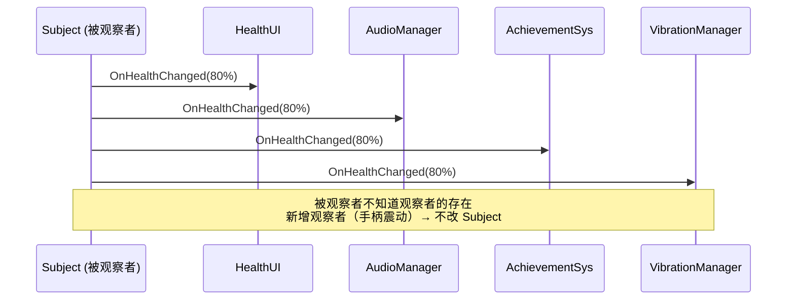
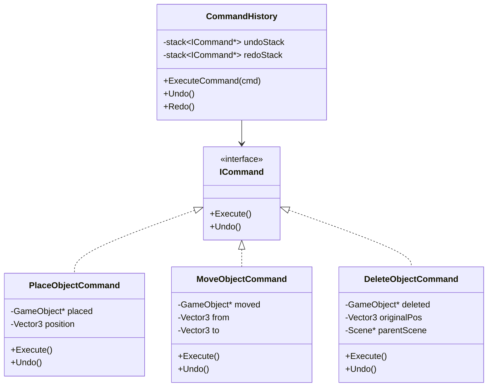
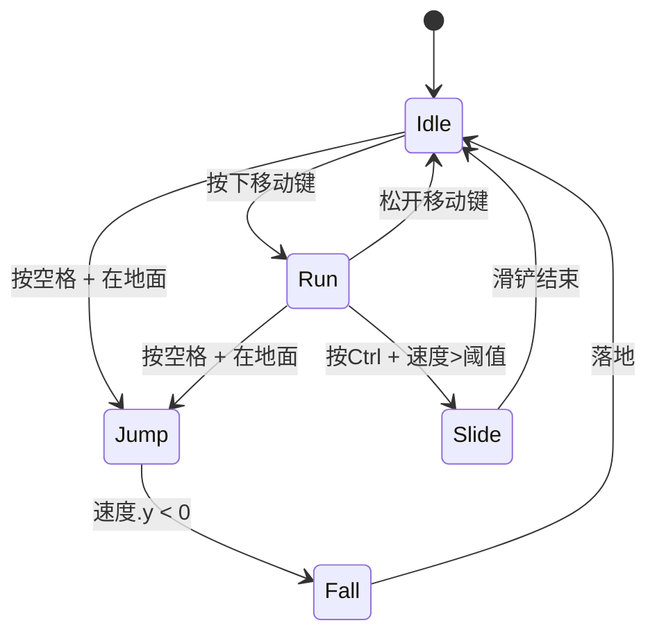

# What

# 第三章 行为型模式（上）：事件、命令与状态机

> **一句话理解**：行为型模式解决的不是"类怎么组织"，而是"对象之间怎么通信、怎么协作"——这是游戏运行时最频繁发生的事情。

> 📋 前置知识：Ch1（SOLID，特别是 DIP 和 OCP）、C++ Ch3（虚函数与多态）、C++ Ch7（并发与线程安全）

---

## 3.1 场景问题 —— 三个通信困境

**困境 A —— 一对多的连锁反应**

```cpp
// 角色受伤时，需要通知 5 个系统：
void Character::TakeDamage(float amount) {
    health -= amount;

    // 1. 更新 UI 血条
    UIManager::Get().UpdateHealthBar(health / maxHealth);

    // 2. 播放受击音效
    AudioManager::Get().PlaySound("hit.wav");

    // 3. 屏幕闪红
    ScreenEffectManager::Get().PlayDamageVignette();

    // 4. 伤害数字飘出
    DamageNumberManager::Get().Spawn(amount, position);

    // 5. 成就系统检查
    AchievementManager::Get().OnPlayerDamaged(amount);

    if (health <= 0) {
        // 死亡时还要通知 8 个系统...
    }
}
```

**问题**：`Character` 类需要知道 UI、音效、特效、成就……5 个系统的存在。每加一个新反馈（比如"受伤时手柄震动"），就要改 `TakeDamage()`。这就是 Ch1 说的**违反 OCP**。

你真正想要的是：`Character` 大喊一声"我受伤了！"，关心这件事的系统自己过来听。`Character` 不需要知道谁在听。

**困境 B —— 操作的记录与撤销**

你做了一个关卡编辑器。用户可以放置、移动、删除物体。现在产品说：加 Undo/Redo。你发现所有操作都是直接生效的——`DeleteObject(obj)` 直接把对象删了，没有记录"删了什么、在哪个位置"。Undo 无法实现。

**困境 C —— 状态判断的蔓延**

```cpp
void Character::Update(float dt) {
    if (state == STATE_IDLE) {
        // 待机逻辑...
        if (Input::GetKey(KeyCode::W)) {
            state = STATE_RUN;
            PlayAnimation("run");
        }
    }
    else if (state == STATE_RUN) {
        // 跑步逻辑...
        if (!Input::GetKey(KeyCode::W)) {
            state = STATE_IDLE;
            PlayAnimation("idle");
        }
        else if (Input::GetKeyDown(KeyCode::SPACE)) {
            state = STATE_JUMP;
            PlayAnimation("jump_start");
        }
    }
    else if (state == STATE_JUMP) {
        // 跳跃逻辑...
        if (IsGrounded() && jumpTimer > 0.3f) {
            state = STATE_IDLE;
            PlayAnimation("land");
        }
    }
    // 策划说"加一个滑铲状态"——
    // 你需要在 7 个地方加 else-if，还要检查现有每个状态的转移条件
}
```

每个状态的行为、转移条件、进入/退出逻辑全部混在 `Update()` 里。两个状态后就不可维护了。

---

这三种困境正好对应本章的三种模式：

| 困境 | 本质 | 对应模式 |
|------|------|---------|
| A — 连锁通知 | 一对多通信 | 观察者 / 事件系统 |
| B — Undo/Redo | 操作封装与回滚 | 命令模式 |
| C — 状态蔓延 | 状态相关的行为变化 | 状态机 (FSM) |

---

## 3.2 观察者与事件系统

> **意图**：定义对象间的一种**一对多**依赖关系。当一个对象状态改变时，所有依赖它的对象都得到通知并自动更新。
>
> **体现的 SOLID 原则**：OCP（被观察者不因新增观察者而修改）、DIP（被观察者依赖抽象的 `IObserver` 接口）

### 模式结构



### 菜鸟版：经典观察者

```cpp
// ============ 观察者接口 ============
class IHealthObserver {
public:
    virtual void OnHealthChanged(float current, float max) = 0;
    virtual void OnDeath() = 0;
    virtual ~IHealthObserver() = default;
};

// ============ 被观察者（Subject）============
class HealthComponent {
public:
    void AddObserver(IHealthObserver* observer) {
        observers.push_back(observer);
    }

    void RemoveObserver(IHealthObserver* observer) {
        observers.erase(
            std::remove(observers.begin(), observers.end(), observer),
            observers.end());
    }

    void TakeDamage(float amount) {
        health -= amount;
        NotifyHealthChanged();

        if (health <= 0) {
            NotifyDeath();
        }
    }

private:
    void NotifyHealthChanged() {
        for (auto* obs : observers) {
            obs->OnHealthChanged(health, maxHealth);
        }
    }

    void NotifyDeath() {
        for (auto* obs : observers) {
            obs->OnDeath();
        }
    }

    float health = 100.0f;
    float maxHealth = 100.0f;
    std::vector<IHealthObserver*> observers;
};

// ============ 具体观察者 ============
class HealthBarUI : public IHealthObserver {
public:
    void OnHealthChanged(float current, float max) override {
        slider.fillAmount = current / max;
    }
    void OnDeath() override {
        ShowDeathScreen();
    }
};

class AudioManager : public IHealthObserver {
public:
    void OnHealthChanged(float, float) override {
        PlaySound("hit.wav");
    }
    void OnDeath() override {
        PlaySound("death.wav");
    }
};
```

**经典观察者的问题**：
1. 每个"主题"需要一个专门的 Observer 接口（`IHealthObserver`、`IScoreObserver`、`IInventoryObserver`……）——接口爆炸
2. 观察者必须继承特定接口——耦合了继承体系
3. 无法延迟处理或跨线程通知

### 工业版：类型安全的事件总线

游戏开发中更常用的是**事件总线**——一个全局的事件分发中心：

```cpp
// ============ 通用事件总线 ============

// 事件基类——每种事件是一个 struct
struct GameEvent {
    virtual ~GameEvent() = default;
};

// 具体事件
struct HealthChangedEvent : public GameEvent {
    GameObject* entity;
    float currentHealth;
    float maxHealth;
};

struct EntityDeathEvent : public GameEvent {
    GameObject* entity;
    Vector3 deathPosition;
};

struct ItemPickupEvent : public GameEvent {
    int itemId;
    int count;
};

// 事件处理器——用 std::function 而非虚函数接口
using EventHandler = std::function<void(const GameEvent&)>;

class EventBus {
public:
    template<typename T>
    static void Subscribe(std::function<void(const T&)> handler) {
        // 用 type_index 区分事件类型
        auto& handlers = GetHandlers<T>();
        handlers.push_back([handler](const GameEvent& e) {
            handler(static_cast<const T&>(e));
        });
    }

    template<typename T>
    static void Emit(const T& event) {
        auto it = GetHandlerMap().find(std::type_index(typeid(T)));
        if (it != GetHandlerMap().end()) {
            for (auto& handler : it->second) {
                handler(event);
            }
        }
    }

private:
    template<typename T>
    static std::vector<EventHandler>& GetHandlers() {
        auto& map = GetHandlerMap();
        auto key = std::type_index(typeid(T));
        return map[key];
    }

    static std::unordered_map<std::type_index, std::vector<EventHandler>>&
    GetHandlerMap() {
        static std::unordered_map<std::type_index, std::vector<EventHandler>> map;
        return map;
    }
};

// ============ 使用 ============

// 发出事件——Character 不需要知道谁在听
void HealthComponent::TakeDamage(float amount) {
    health -= amount;

    // 向世界宣告"我血量变了"——不关心谁在听
    EventBus::Emit(HealthChangedEvent{
        .entity = owner,
        .currentHealth = health,
        .maxHealth = maxHealth
    });

    if (health <= 0) {
        EventBus::Emit(EntityDeathEvent{
            .entity = owner,
            .deathPosition = owner->GetPosition()
        });
    }
}

// 订阅事件——各自独立注册
void HealthBarUI::Init() {
    EventBus::Subscribe<HealthChangedEvent>([this](const HealthChangedEvent& e) {
        if (e.entity == GetOwner()) {
            slider.fillAmount = e.currentHealth / e.maxHealth;
        }
    });
}

void AchievementManager::Init() {
    EventBus::Subscribe<EntityDeathEvent>([](const EntityDeathEvent& e) {
        if (e.entity->IsPlayer()) {
            // 记录玩家死亡次数
        }
    });
}

// 策划说"受伤时手柄震动"——加一个新订阅就行，不改 Character
void VibrationManager::Init() {
    EventBus::Subscribe<HealthChangedEvent>([](const HealthChangedEvent& e) {
        if (e.entity->IsPlayer() && e.currentHealth < e.maxHealth * 0.3f) {
            Gamepad::Vibrate(0.5f, 1.0f);  // 低血量警告震动
        }
    });
}
```

### 关键陷阱与解决方案

**陷阱一：回调中注销导致迭代器失效**

```cpp
// ❌ 观察者在 OnHealthChanged 回调中把自己注销了
class OneTimeShield : public IHealthObserver {
    void OnHealthChanged(float current, float) override {
        if (current > 0) {
            owner->RemoveObserver(this);  // 删除自己！
            delete this;                   // 更严重！
        }
    }
};
// 此时 Subject 还在遍历 observers 向量——迭代器失效，崩溃。

// ✅ 解决方案1：延迟删除
class HealthComponent {
    std::vector<IHealthObserver*> observers;
    std::vector<IHealthObserver*> pendingRemoves;  // 待删除列表

public:
    void RemoveObserver(IHealthObserver* obs) {
        pendingRemoves.push_back(obs);  // 不立即删
    }

private:
    void NotifyHealthChanged() {
        for (auto* obs : observers) {
            if (std::find(pendingRemoves.begin(), pendingRemoves.end(), obs)
                == pendingRemoves.end()) {
                obs->OnHealthChanged(health, maxHealth);
            }
        }
        // 通知完再清理
        for (auto* obs : pendingRemoves) {
            observers.erase(std::remove(observers.begin(), observers.end(), obs),
                            observers.end());
        }
        pendingRemoves.clear();
    }
};
```

```cpp
// ✅ 解决方案2：索引遍历（规避迭代器失效）
void NotifyHealthChanged() {
    for (size_t i = 0; i < observers.size(); ++i) {
        observers[i]->OnHealthChanged(health, maxHealth);
        // 即使 i 位置的观察者被删了，下一个位置可能已经前移，
        // 最差情况跳过几个观察者，不会崩溃
    }
}
```

**陷阱二：循环通知**

```cpp
// A 观察 B，B 观察 A
// A.HP 变化 → 通知 B → B.OnAHPChanged → B 修改了 A.HP → 通知 A → A.OnBHPChanged → ...
```

解决方案：加一个 `isNotifying` 标志，嵌套通知时直接返回。

**陷阱三：注销/注册不配对**

```cpp
// Enemy 注册了事件，但销毁时忘了注销
// → EventBus 持有悬垂指针 → 下次 Emit 崩溃
```

解决方案：在 `~Enemy()` 中注销，或者用 RAII 的 `EventSubscription` 句柄。

### 变体对比：观察者 vs 事件总线 vs 消息队列

| | 经典观察者 | 事件总线 | 消息队列 |
|------|-----------|---------|---------|
| 耦合方式 | 观察者继承 `IObserver` | `std::function` 回调 | 消息入队 |
| 通知时机 | 立即同步 | 立即同步 | 异步（帧末/下一帧） |
| 类型安全 | 编译期（接口） | 编译期（模板） | 运行时（消息类型字段） |
| 适用场景 | 一对少、关系稳定 | 多对多、频繁增删订阅 | 跨线程、需要节流/合并 |
| 游戏使用 | UI 数据绑定 | 全局事件系统 | 网络消息处理、输入缓冲 |

> 💡 **面试中的表述**：「事件总线和经典观察者的核心区别是——事件总线用 `std::function` 替代了继承式接口，从而消除了观察者与被观察者之间的类型耦合。添加新观察者不需要修改任何已有类。」

### 🎮 游戏实战：完整事件系统

```cpp
// 游戏中一个实用的轻量事件系统

// 1. 事件定义（放在各自的头文件中）
struct OnDamageEvent {
    GameObject* target;
    GameObject* attacker;
    float rawDamage;
    float finalDamage;
    DamageType type;
};

struct OnSkillCastEvent {
    GameObject* caster;
    int skillId;
    Vector3 targetPosition;
};

struct OnItemPickupEvent {
    GameObject* picker;
    int itemId;
    int count;
};

// 2. 事件监听器 —— RAII 自动注销
class EventListener {
public:
    template<typename T>
    static std::shared_ptr<EventListener> Create(std::function<void(const T&)> callback) {
        auto listener = std::make_shared<EventListener>();
        auto& handlers = GetHandlers<T>();
        auto it = handlers.emplace(handlers.end(),
            [callback](const void* event) {
                callback(*static_cast<const T*>(event));
            });
        listener->cleanup = [&handlers, it]() {
            handlers.erase(it);
        };
        listener->handlerIter = it;
        return listener;
    }

    ~EventListener() {
        if (cleanup) cleanup();
    }

private:
    std::function<void()> cleanup;
    void* handlerIter = nullptr;

    template<typename T>
    static std::list<std::function<void(const void*)>>& GetHandlers() {
        static std::list<std::function<void(const void*)>> handlers;
        return handlers;
    }
};

// 3. 组件中使用——自动管理生命周期
class DamageNumberSpawner : public Component {
    std::shared_ptr<EventListener> damageListener;

public:
    void OnEnable() override {
        damageListener = EventListener::Create<OnDamageEvent>(
            [this](const OnDamageEvent& e) {
                SpawnDamageNumber(e.target->GetPosition(), e.finalDamage);
            });
        // 组件 Disable 时 listener 析构 → 自动注销 —— 不会忘记
    }
};
```

---

## 3.3 命令模式

> **意图**：将**请求封装为对象**，从而支持请求的参数化、排队、日志记录与撤销。
>
> **体现的 SOLID 原则**：OCP（新命令 = 新类，不改已有代码）、SRP（每个命令类只负责一种操作）

### 场景问题

回到困境 B——关卡编辑器需要 Undo/Redo。所有的修改操作都直接生效，没有记录历史。解决方案是：把每个操作封装成一个**命令对象**，这个对象知道**怎么做**，也知道**怎么撤销**。

### 模式结构



### C++ 实现

```cpp
// ============ 命令接口 ============
class ICommand {
public:
    virtual void Execute() = 0;
    virtual void Undo() = 0;
    virtual ~ICommand() = default();
};

// ============ 具体命令 ============

// 放置物体
class PlaceObjectCommand : public ICommand {
    Scene* scene;
    GameObject* placedObject;
    Vector3 position;

public:
    PlaceObjectCommand(Scene* s, GameObject* obj, const Vector3& pos)
        : scene(s), placedObject(obj), position(pos) {}

    void Execute() override {
        scene->AddObject(placedObject);
        placedObject->SetPosition(position);
    }

    void Undo() override {
        scene->RemoveObject(placedObject);  // 不放 delete，保留对象引用
    }
};

// 移动物体——需要记录移动前后的位置
class MoveObjectCommand : public ICommand {
    GameObject* object;
    Vector3 from;
    Vector3 to;

public:
    MoveObjectCommand(GameObject* obj, const Vector3& newPos)
        : object(obj), from(obj->GetPosition()), to(newPos) {}

    void Execute() override {
        object->SetPosition(to);
    }

    void Undo() override {
        object->SetPosition(from);  // 移回去
    }
};

// 删除物体——最难处理的命令
class DeleteObjectCommand : public ICommand {
    Scene* scene;
    GameObject* deletedObject;
    Vector3 originalPosition;
    bool isExecuted = false;

public:
    DeleteObjectCommand(Scene* s, GameObject* obj)
        : scene(s), deletedObject(obj), originalPosition(obj->GetPosition()) {}

    void Execute() override {
        scene->RemoveObject(deletedObject);
        deletedObject->SetActive(false);  // 不销毁，只是隐藏
        isExecuted = true;
    }

    void Undo() override {
        scene->AddObject(deletedObject);
        deletedObject->SetPosition(originalPosition);
        deletedObject->SetActive(true);
    }

    // 当 Redo 栈被清空时（用户做了新操作），才真正销毁
    void DestroyObject() {
        delete deletedObject;
        deletedObject = nullptr;
    }
};

// ============ 命令历史管理器 ============
class CommandHistory {
public:
    void ExecuteCommand(std::unique_ptr<ICommand> cmd) {
        cmd->Execute();
        undoStack.push(std::move(cmd));

        // 新命令清空 Redo 栈——这是 Undo 后做新操作的标准行为
        while (!redoStack.empty()) {
            redoStack.pop();
        }
    }

    void Undo() {
        if (undoStack.empty()) return;

        auto cmd = std::move(undoStack.top());
        undoStack.pop();
        cmd->Undo();
        redoStack.push(std::move(cmd));
    }

    void Redo() {
        if (redoStack.empty()) return;

        auto cmd = std::move(redoStack.top());
        redoStack.pop();
        cmd->Execute();
        undoStack.push(std::move(cmd));
    }

private:
    std::stack<std::unique_ptr<ICommand>> undoStack;
    std::stack<std::unique_ptr<ICommand>> redoStack;
};

// ============ 使用 ============
CommandHistory history;

// 放置物体
auto placeCmd = std::make_unique<PlaceObjectCommand>(scene, newTree, clickPos);
history.ExecuteCommand(std::move(placeCmd));

// 移动物体
auto moveCmd = std::make_unique<MoveObjectCommand>(selectedTree, newPos);
history.ExecuteCommand(std::move(moveCmd));

// Ctrl+Z
history.Undo();  // 移回原位

// Ctrl+Y
history.Redo();  // 重新移动

// Ctrl+Z
history.Undo();  // 移回原位

// Ctrl+Z
history.Undo();  // 删除树
```

### 游戏中的命令模式应用

**应用一：技能系统**

```cpp
class ISkillCommand {
public:
    virtual void Execute(GameObject* caster, const Vector3& target) = 0;
    virtual float GetCooldown() const = 0;
    virtual float GetManaCost() const = 0;
    virtual ~ISkillCommand() = default;
};

class FireballSkill : public ISkillCommand {
public:
    void Execute(GameObject* caster, const Vector3& target) override {
        // 消耗法力
        caster->GetComponent<ManaComponent>()->Consume(manaCost);
        // 生成火球
        auto* projectile = SpawnProjectile("fireball", caster->GetPosition());
        projectile->MoveTowards(target);
        // 进入冷却
        StartCooldown();
    }
private:
    float manaCost = 30.0f;
    float cooldown = 3.0f;
};

// 按键绑定就是命令注册
InputSystem::Bind(KeyCode::Q, std::make_unique<FireballSkill>());
InputSystem::Bind(KeyCode::W, std::make_unique<IceBlastSkill>());
InputSystem::Bind(KeyCode::E, std::make_unique<TeleportSkill>());
```

**应用二：操作回放（Replay）**

```cpp
// RTS/MOBA 的回放文件 = 命令序列 + 时间戳
struct CommandRecord {
    uint32_t frame;
    std::unique_ptr<ICommand> command;
};

class ReplayRecorder {
    std::vector<CommandRecord> records;

public:
    void Record(uint32_t frame, std::unique_ptr<ICommand> cmd) {
        records.push_back({frame, std::move(cmd)});
    }

    void SaveToFile(const std::string& path) {
        // 序列化：帧号 + 命令类型 + 参数
        for (auto& rec : records) {
            file << rec.frame << " ";
            rec.command->Serialize(file);
        }
    }

    void Playback(const std::string& path) {
        // 反序列化 → 在对应帧 Execute
    }
};
```

> 💡 **为什么 replay 文件通常很小**：假设一局游戏 30 分钟，每秒 2 个命令，每个命令 ~20 字节 → 30 × 60 × 2 × 20 = 72 KB。这就是为什么 RTS replay 文件这么小——它们存的是**操作**，不是画面。

**应用三：输入缓冲（格斗游戏）**

```cpp
// 搓招系统：← ↓ → + A = 波动拳
class InputBuffer {
    std::deque<InputCommand> buffer;
    static constexpr size_t MAX_BUFFER = 30;  // 30 帧的输入窗口

public:
    void Push(KeyCode key, uint32_t frame) {
        buffer.push_back({key, frame});
        // 超出窗口的丢弃
        while (!buffer.empty() && buffer.front().frame < frame - MAX_BUFFER) {
            buffer.pop_front();
        }
    }

    // 检测缓冲区内是否包含搓招序列
    bool MatchSequence(const std::vector<KeyCode>& sequence) {
        // 在 buffered commands 中查找子序列
        return KMPSearch(buffer, sequence);  // Ch9 字符串算法的应用！
    }
};
```

---

## 3.4 有限状态机 (FSM)

> **意图**：允许一个对象在其**内部状态**改变时改变其**行为**。对象看起来像是改变了类。
>
> **体现的 SOLID 原则**：OCP（新状态 = 新类）、SRP（每个状态类只管理一种状态的行为）

### 场景问题

回到困境 C——角色的 `Update()` 里塞满了 `if (state == IDLE) ... else if (state == RUN) ...`。每加一个新状态，就要在多个地方改条件判断。

状态机把每种状态封装成一个类，每个类只管自己状态下的行为和转移。

### 模式结构



### 菜鸟版：枚举 + switch

先看一眼你已经知道的写法——这是所有状态机的起点：

```cpp
enum class PlayerState { Idle, Run, Jump, Fall, Attack, Hurt, Dead };

void Player::Update(float dt) {
    switch (currentState) {
        case PlayerState::Idle:
            if (Input::GetKey(KeyCode::W)) {
                currentState = PlayerState::Run;
                animator->Play("run");
            }
            // ...
            break;
        // ... 7 个 case，互相缠绕
    }
}
```

**什么时候这就够了？** 当状态 ≤ 3 个，且转移关系简单时。超过 3 个 → 往下看。

### 工业版：面向对象状态机

```cpp
// ============ 状态基类 ============
class IPlayerState {
public:
    virtual void Enter(Player* player) = 0;
    virtual void Update(Player* player, float dt) = 0;
    virtual void Exit(Player* player) = 0;
    virtual ~IPlayerState() = default;
};

// ============ 玩家类——持有当前状态 ============
class Player {
public:
    void ChangeState(std::unique_ptr<IPlayerState> newState) {
        if (currentState) {
            currentState->Exit(this);
        }
        currentState = std::move(newState);
        if (currentState) {
            currentState->Enter(this);
        }
    }

    void Update(float dt) {
        if (currentState) {
            currentState->Update(this, dt);
        }
    }

    // 各状态需要的公共接口
    Animator* GetAnimator() { return &animator; }
    Rigidbody* GetRigidbody() { return &rigidbody; }
    bool IsGrounded() const { return isGrounded; }

private:
    std::unique_ptr<IPlayerState> currentState;
    Animator animator;
    Rigidbody rigidbody;
    bool isGrounded = true;
};

// ============ 具体状态——每个状态是一个类 ============

class IdleState : public IPlayerState {
public:
    void Enter(Player* player) override {
        player->GetAnimator()->CrossFade("idle", 0.15f);
    }

    void Update(Player* player, float) override {
        if (Input::GetKey(KeyCode::W)) {
            player->ChangeState(std::make_unique<RunState>());
            return;
        }
        if (Input::GetKeyDown(KeyCode::SPACE) && player->IsGrounded()) {
            player->ChangeState(std::make_unique<JumpState>());
            return;
        }
    }

    void Exit(Player*) override {
        // 离开待机——无特殊清理
    }
};

class RunState : public IPlayerState {
public:
    void Enter(Player* player) override {
        player->GetAnimator()->CrossFade("run", 0.1f);
    }

    void Update(Player* player, float dt) override {
        // 移动逻辑
        Vector3 inputDir = Input::GetMovementDirection();
        player->GetRigidbody()->velocity = inputDir * runSpeed;
        player->GetAnimator()->SetFloat("speed", inputDir.Magnitude());

        // 转移判断
        if (inputDir.Magnitude() < 0.1f) {
            player->ChangeState(std::make_unique<IdleState>());
            return;
        }
        if (Input::GetKeyDown(KeyCode::SPACE) && player->IsGrounded()) {
            player->ChangeState(std::make_unique<JumpState>());
            return;
        }
        if (Input::GetKeyDown(KeyCode::LEFT_CTRL) &&
            player->GetRigidbody()->velocity.Magnitude() > slideThreshold) {
            player->ChangeState(std::make_unique<SlideState>());
            return;
        }
    }

    void Exit(Player*) override {}

private:
    float runSpeed = 8.0f;
    float slideThreshold = 10.0f;
};

class JumpState : public IPlayerState {
public:
    void Enter(Player* player) override {
        player->GetAnimator()->Play("jump_start");
        player->GetRigidbody()->AddForce(Vector3::up * jumpForce, ForceMode::Impulse);
        hasLeftGround = false;
    }

    void Update(Player* player, float) override {
        if (player->GetRigidbody()->velocity.y < 0) {
            player->ChangeState(std::make_unique<FallState>());
            return;
        }
    }

    void Exit(Player*) override {}

private:
    float jumpForce = 12.0f;
    bool hasLeftGround = false;
};

class FallState : public IPlayerState {
public:
    void Enter(Player* player) override {
        player->GetAnimator()->CrossFade("fall", 0.1f);
    }

    void Update(Player* player, float) override {
        if (player->IsGrounded()) {
            player->ChangeState(std::make_unique<IdleState>());
            return;
        }
    }

    void Exit(Player*) override {}
};
```

> 💡 **关键洞察**：每个状态类只知道自己状态下的行为，以及**可以转移到哪些状态**。它不关心兄弟状态的行为。这比一个 1000 行的 `switch` 清晰得多。

### 状态转换表 —— 消除分散的转移逻辑

上面每个状态的 `Update()` 里都有转移判断，这些判断分散在各处，看"哪些情况会进入 Run 状态"时需要翻遍所有类。状态转换表把它们集中起来：

```cpp
// 集中管理的转移条件
struct StateTransition {
    PlayerState from;
    PlayerState to;
    std::function<bool(const Player*)> condition;
};

class PlayerStateMachine {
    std::vector<StateTransition> transitions;

public:
    void AddTransition(PlayerState from, PlayerState to,
                       std::function<bool(const Player*)> cond) {
        transitions.push_back({from, to, std::move(cond)});
    }

    void Update(Player* player) {
        // 检查所有从当前状态出发的转移
        for (auto& trans : transitions) {
            if (trans.from == currentState && trans.condition(player)) {
                ChangeState(player, trans.to);
                return;
            }
        }
        states[currentState]->Update(player);
    }

private:
    PlayerState currentState = PlayerState::Idle;
    std::unordered_map<PlayerState, std::unique_ptr<IPlayerState>> states;
};

// 配置转移关系——一目了然
void SetupPlayerFSM(PlayerStateMachine& fsm) {
    fsm.AddTransition(Idle, Run,  [](auto* p) { return IsMoving(p); });
    fsm.AddTransition(Idle, Jump, [](auto* p) { return IsJumpPressed(p) && p->IsGrounded(); });
    fsm.AddTransition(Run,  Idle, [](auto* p) { return !IsMoving(p); });
    fsm.AddTransition(Run,  Jump, [](auto* p) { return IsJumpPressed(p) && p->IsGrounded(); });
    fsm.AddTransition(Jump, Fall, [](auto* p) { return p->GetVelocity().y < 0; });
    fsm.AddTransition(Fall, Idle, [](auto* p) { return p->IsGrounded(); });
}
```

集中 vs 分散的权衡：表中适合**简单**的条件（"按下了跳跃键吗"），复杂条件（"滑铲需要速度 > 阈值 + 地面角度 < 30°"）仍放在具体状态类里。

### 分层状态机 (HFSM)

当角色状态膨胀时（Idle/Run/Sprint/Walk/Jump/Fall/DoubleJump/WallJump/Attack1/Attack2/……），需要分层：

```cpp
// 分层状态机：每个父状态内部有一个子状态机
//
// Player
//   ├── Grounded（父状态）
//   │     ├── Idle
//   │     ├── Walk
//   │     ├── Run
//   │     └── Sprint
//   ├── Airborne（父状态）
//   │     ├── Jump
//   │     ├── Fall
//   │     └── DoubleJump
//   └── Combat（父状态）
//         ├── LightAttack
//         ├── HeavyAttack
//         └── Block

class HierarchicalState : public IPlayerState {
protected:
    std::unique_ptr<IPlayerState> subState;  // 子状态

public:
    void SetSubState(std::unique_ptr<IPlayerState> state) {
        subState = std::move(state);
    }

    void Update(Player* player, float dt) override {
        // 父状态的通用逻辑（如：在地面时始终应用重力）
        ApplyGroundFriction(player);

        // 子状态的行为
        if (subState) {
            subState->Update(player, dt);
        }
    }
};

class GroundedState : public HierarchicalState {
public:
    void Enter(Player* player) override {
        // 落地时统一处理
        player->GetAnimator()->SetBool("isAirborne", false);
        SetSubState(std::make_unique<IdleState>());
    }

    void ApplyGroundFriction(Player* player) {
        // 所有地面子状态共用的摩擦力逻辑
    }
};
```

**HFSM 的价值**：父状态处理共有逻辑（如 `Grounded` 下所有子状态都受摩擦力），子状态只需关注自己独特的行为。避免在 Idle/Run/Sprint 三个状态里各写一遍摩擦力。

### 并发状态机

角色的"移动"和"战斗"是两套独立的状态系统：

```cpp
// 两套并行的状态机——互不干扰
class Player {
    StateMachine<MovementState> movementFSM;  // Idle / Run / Jump / Fall
    StateMachine<CombatState>   combatFSM;    // Unarmed / MeleeAttack / RangedAttack / Blocking
    StateMachine<EquipmentState> equipFSM;    // Normal / CarryingItem / UsingTool
};

// 移动和攻击互不干扰——
// 可以在 Run 的同时 MeleeAttack，也可以在 Jump 的同时 RangedAttack
// 不需要组合爆炸 (Run×MeleeAttack, Run×RangedAttack, Jump×MeleeAttack...)
```

---

## 3.5 三种模式的配合使用

这三种模式在真实项目中常常一起出现。来看一个完整例子：

```cpp
// 一个技能系统，综合使用命令模式 + 事件系统 + 状态机

// 1. 状态机管理角色状态
class Character {
    StateMachine<ActionState> actionFSM;   // Idle / Casting / Stunned / Dead
    StateMachine<MovementState> moveFSM;   // Standing / Running / Jumping
};

// 2. 技能是命令对象
class CastFireballCommand : public ISkillCommand {
public:
    void Execute(GameObject* caster, const Vector3& target) override {
        // 改变状态——用状态机
        caster->ChangeState(std::make_unique<CastingState>(0.6f));  // 0.6 秒施法

        // 施法完成后——用事件系统通知
        Timer::Schedule(0.6f, [caster, target]() {
            SpawnProjectile("fireball", caster->GetPosition(), target);

            // 向世界广播"火球术已释放"——谁关心谁知道
            EventBus::Emit(OnSkillCastEvent{
                .caster = caster,
                .skillId = SKILL_FIREBALL,
                .targetPosition = target
            });
        });
    }
};

// 3. 各系统通过事件总线响应
void AchievementSystem::Init() {
    EventBus::Subscribe<OnSkillCastEvent>([](const OnSkillCastEvent& e) {
        if (e.skillId == SKILL_FIREBALL) {
            stats.fireballCount++;  // 统计成就进度
        }
    });
}

void BuffSystem::Init() {
    EventBus::Subscribe<OnSkillCastEvent>([this](const OnSkillCastEvent& e) {
        // 检查施法者是否有 "火球术伤害 +20%" 的 Buff
        ModifySkillDamage(e.caster, e.skillId);
    });
}
```

三种模式的分工清晰：

| 模式 | 角色 |
|------|------|
| **命令** | 封装"技能"这个操作——参数、消耗、冷却 |
| **状态机** | 管理角色当前能不能动、是不是在施法 |
| **事件系统** | 让外部系统（成就、Buff、音效、特效）响应技能释放 |

---

## 3.6 变体对比

### 状态模式 vs 策略模式（预览 Ch4）

这是设计模式中最容易被问到的区分：

| | 状态模式 | 策略模式 |
|------|---------|---------|
| 谁决定切换 | **状态自身**决定何时转移到下一个状态 | **外部**决定使用哪个策略 |
| 上下文知道 | 不需要知道有哪些状态 | 需要知道有哪些策略可选 |
| 核心关系 | 状态 → 状态（转移） | 上下文 → 策略（委托） |
| 例子 | Idle → Run → Jump | PhysicalDamage → MagicalDamage |

```cpp
// 状态模式：状态自己决定转移
class IdleState {
    void Update(Player* p) {
        if (Input::GetKey(W)) p->ChangeState(new RunState());  // 状态决定
    }
};

// 策略模式：外部选择策略
void ApplyDamage(float base, const IDamageCalculator& strategy) {
    float dmg = strategy.Calculate(base, target);  // 外部传入
}
// 调用方：ApplyDamage(100, PhysicalDamage{});
// 或：  ApplyDamage(100, MagicalDamage{});
```

### FSM vs 行为树 vs GOAP（预览 Ch6）

| | FSM | 行为树 (Behavior Tree) | GOAP (目标导向) |
|------|-----|------|------|
| 决策方式 | 预定义转移条件 | 节点优先级 + 条件遍历 | 动态搜索行动计划 |
| 可维护性 | 状态少时极好，多时爆炸 | 节点多时仍可维护 | 规则多时优于行为树 |
| 调试难度 | 低 | 中 | 高 |
| 适用 | 玩家角色、简单 AI | 主流游戏 AI（Halo/DAO） | 动态环境 AI（F.E.A.R.） |
| 游戏中 | 3C、UI 流程 | NPC AI | 复杂 NPC 决策 |

---

## 3.7 本章回顾

| 模式 | 核心问题 | 一句话 | 面试频率 |
|------|---------|------|---------|
| **观察者/事件系统** | 一对多通知 | "你喊一声，关心的自己来听" | ★★★★★ |
| **命令模式** | 操作封装与回滚 | "把操作变成对象，存起来就能撤销" | ★★★★★ |
| **状态机** | 状态相关行为 | "每个状态只管自己的事" | ★★★★★ |

> 面试中最常被要求手写的设计模式题：**"设计一个 Undo/Redo 系统"**（命令模式）、**"设计一个事件系统"**（观察者/事件总线）、**"设计一个角色状态机"**（FSM）。这三题本章都给了可直接引用的方案。

> 📖 下一章：[第四章 行为型模式（下）](./04_behavioral_2) —— 策略模式、模板方法、迭代器、职责链。本章的"状态 vs 策略"对比将在下一章得到完整的展开。
