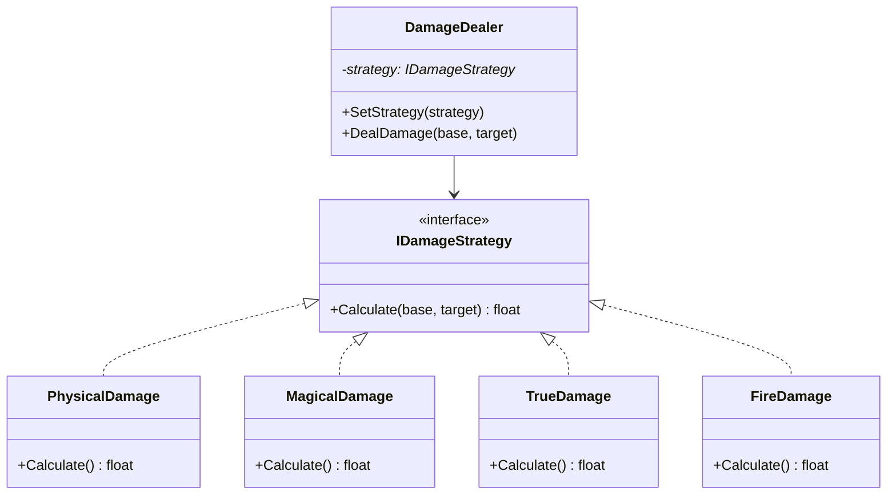
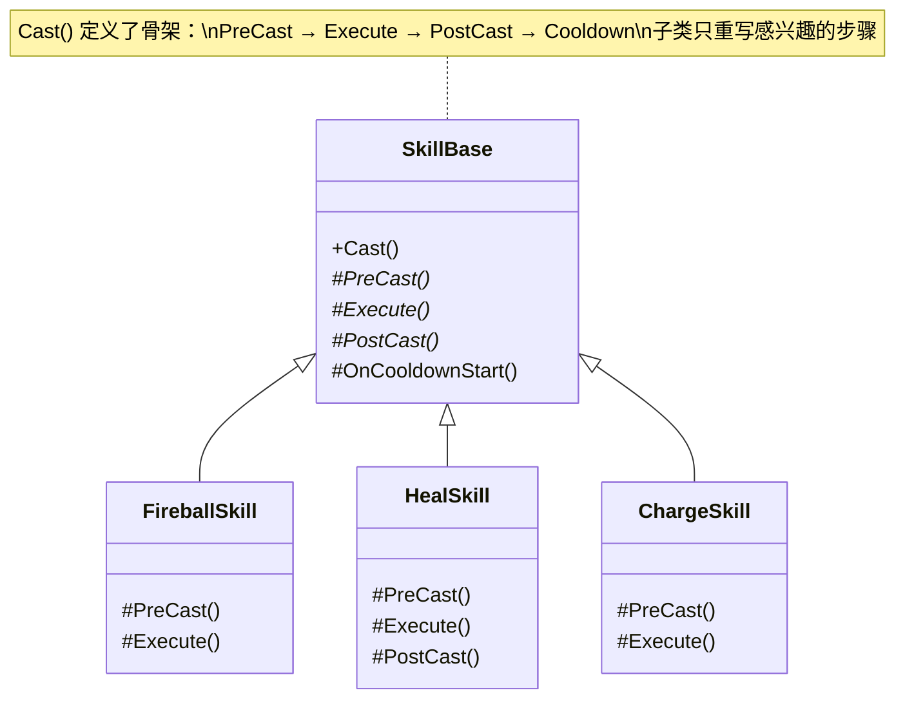
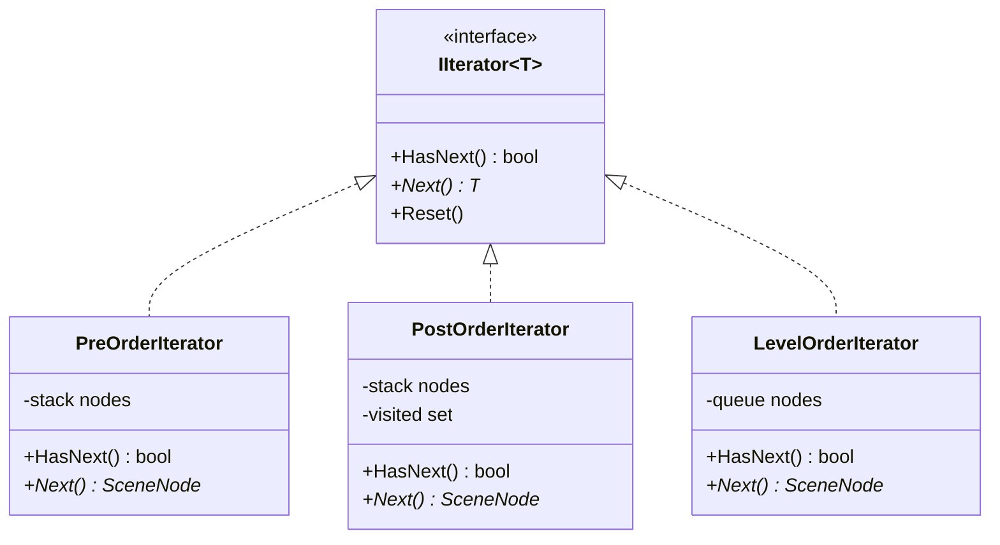
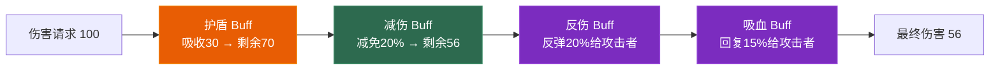

# 第四章 行为型模式（下）：策略、模板方法、迭代器与职责链

> **一句话理解**：上一章的三种模式（事件/命令/状态）是"高频日常型"——几乎每个子系统都会用到。本章四种是"特定场景型"——频率稍低，但一旦用到而没有，代码会很难看。

> 📋 前置知识：Ch1（SOLID）、Ch3（状态模式——策略 vs 状态的对比关键）、C++ Ch5（模板泛型）

---

## 4.1 场景问题 —— 四个"如果不用模式"的痛点

**痛点 A —— 伤害公式的 switch 地狱**

```cpp
// 游戏有 6 种伤害类型，每种的计算公式不同。
// 不用策略模式，你会得到：
float CalculateDamage(DamageType type, float base, const Enemy& target) {
    switch (type) {
        case PHYSICAL: return base - target.armor;
        case MAGICAL:  return base * (1 - target.magicResist);
        case TRUE:     return base;
        case FIRE:     return base * target.fireWeakness + BurnDot(target);
        case ICE:      return base * target.iceWeakness + SlowEffect(target);
        case POISON:   return base * target.poisonWeakness + StackPoison(target);
        // 加新类型 → 改 switch → 改 OCP
    }
}
```

**痛点 B —— 技能流程的复制粘贴**

```cpp
// 每个技能都有相同的流程骨架，但细节不同：
// 前摇 → 检查条件 → 释放 → 后摇 → 进入冷却

// 现在你为每个技能复制了整个流程——检查条件改了，12 个技能都要改
```

**痛点 C —— 场景图遍历的重复**

```cpp
// 你需要遍历场景树，有时候前序（先父后子），有时候后序（先子后父），
// 有时候按层（BFS）。每次遍历你都写一个 for 循环嵌套递归，
// 遍历逻辑和业务逻辑混在一起
```

**痛点 D —— Buff 系统的条件蔓延**

```cpp
// 伤害计算时，需要依次经过：护盾 → 减伤 → 反伤 → 吸血 → 基础伤害
// 每种 Buff 可能在任意环节插入。你写了 15 个 if 判断分布在不同文件里，
// 策划加了新 Buff "受到伤害时给攻击者叠加易伤"，你找不到该加在哪里
```

---

| 痛点 | 本质问题 | 对应模式 |
|------|---------|---------|
| A — 公式切换 | 算法族，需要可互换 | 策略模式 |
| B — 流程复用 | 骨架相同，细节不同 | 模板方法 |
| C — 统一遍历 | 不同遍历方式，统一接口 | 迭代器 |
| D — 链式处理 | 请求沿链传递，可随时中断 | 职责链 |

---

## 4.2 策略模式 (Strategy)

> **意图**：定义一系列算法，把它们封装起来，使它们可以**互相替换**。策略模式让算法的变化独立于使用算法的客户端。
>
> **体现的 SOLID 原则**：OCP（新算法 = 新策略类）、DIP（依赖 `IStrategy` 接口）

### 模式结构



### C++ 实现

```cpp
// ============ 策略接口 ============
class IDamageStrategy {
public:
    virtual float Calculate(float baseDamage, const Enemy& target) const = 0;
    virtual std::string GetName() const = 0;
    virtual ~IDamageStrategy() = default;
};

// ============ 具体策略 ============
class PhysicalDamage : public IDamageStrategy {
public:
    float Calculate(float base, const Enemy& target) const override {
        return std::max(1.0f, base - target.armor);
    }
    std::string GetName() const override { return "物理"; }
};

class MagicalDamage : public IDamageStrategy {
public:
    float Calculate(float base, const Enemy& target) const override {
        return base * (1.0f - target.magicResist);
    }
    std::string GetName() const override { return "魔法"; }
};

class TrueDamage : public IDamageStrategy {
public:
    float Calculate(float base, const Enemy&) const override {
        return base;  // 无视一切
    }
    std::string GetName() const override { return "真实"; }
};

// ============ 使用方（Context）============
class DamageDealer {
    std::unique_ptr<IDamageStrategy> strategy;

public:
    void SetStrategy(std::unique_ptr<IDamageStrategy> newStrategy) {
        strategy = std::move(newStrategy);
    }

    float DealDamage(float base, const Enemy& target) const {
        float dmg = strategy->Calculate(base, target);
        target.TakeDamage(dmg);
        return dmg;
    }
};

// 使用
DamageDealer dealer;
dealer.SetStrategy(std::make_unique<PhysicalDamage>());
dealer.DealDamage(100, goblin);  // 物理伤害

dealer.SetStrategy(std::make_unique<MagicalDamage>());
dealer.DealDamage(100, goblin);  // 魔法伤害——同一段代码
```

### 三种策略实现方式对比

C++ 中实现策略有三种方式，各有取舍：

```cpp
// ============ 方式一：虚函数（传统 OOP）============
// 优点：运行时多态，策略可随时切换
// 缺点：虚函数调用开销，需要继承
class IDamageStrategy {
public:
    virtual float Calculate(float base, const Enemy& target) const = 0;
};

// ============ 方式二：std::function（轻量策略）============
// 优点：不需要继承，lambda 即可——适合简单策略
// 缺点：std::function 有类型擦除开销（≈虚函数），不易调试
class DamageDealer {
    std::function<float(float, const Enemy&)> strategy;
public:
    void SetStrategy(std::function<float(float, const Enemy&)> s) {
        strategy = std::move(s);
    }
};

// 使用——一行 lambda 就是一个策略
dealer.SetStrategy([](float base, const Enemy& e) {
    return base - e.armor;  // 整个策略就是一行
});

// ============ 方式三：模板策略（编译期多态）============
// 优点：零开销——编译期确定，可能被内联
// 缺点：策略类型必须在编译期已知，无法运行时切换
template<typename DamageStrategy>
class DamageDealerT {
    DamageStrategy strategy;
public:
    float DealDamage(float base, const Enemy& target) const {
        return strategy.Calculate(base, target);
    }
};

// 使用——不同的策略类型 = 不同的类型
DamageDealerT<PhysicalDamage> physicalDealer;
DamageDealerT<MagicalDamage> magicalDealer;
```

| 方式 | 运行时切换 | 性能 | 代码量 | 适用场景 |
|------|-----------|------|--------|---------|
| 虚函数 | ✅ | 有开销 | 中 | 玩家切换武器、难度变化 |
| `std::function` | ✅ | 有开销 | 少 | 简单策略、lambda 式 |
| 模板 | ❌ | 零开销 | 多 | 确定不变的策略、性能敏感 |

### 策略选择机制

策略不仅需要定义，还需要**选择**。三种常见选择方式：

```cpp
// 方式一：配置表驱动
// Excel 表格：
// | enemy_id | damage_type |
// | 1        | "physical"  |
// | 2        | "fire"      |

std::unique_ptr<IDamageStrategy> CreateStrategy(const std::string& typeName) {
    static std::unordered_map<std::string, std::function<std::unique_ptr<IDamageStrategy>()>> factory = {
        {"physical", [] { return std::make_unique<PhysicalDamage>(); }},
        {"magical",  [] { return std::make_unique<MagicalDamage>(); }},
        {"true",     [] { return std::make_unique<TrueDamage>(); }},
        {"fire",     [] { return std::make_unique<FireDamage>(); }},
    };
    return factory[typeName]();
}

// 方式二：物品驱动
void Weapon::OnEquip(Character* owner) {
    // 武器的伤害类型决定了策略
    owner->SetDamageStrategy(CreateStrategy(this->damageType));
}

// 方式三：依赖注入
class Character {
    std::unique_ptr<IDamageStrategy> damageStrategy;
public:
    Character(std::unique_ptr<IDamageStrategy> strategy)
        : damageStrategy(std::move(strategy)) {}
};
```

### 变体对比：策略 vs 状态（Ch3 呼应）

这是 Ch3 留下的悬念，现在完整对比：

```cpp
// ============ 策略：外部决定 ============
class Character {
    IDamageStrategy* damageStrategy;  // 武器决定了伤害类型
public:
    void Attack(Enemy* target) {
        float dmg = damageStrategy->Calculate(attackPower, *target);
        // 策略由外部传入——拿什么武器用什么策略
    }
};

// ============ 状态：内部决定 ============
class Character {
    IState* currentState;  // 角色自己决定状态转移
public:
    void Update(float dt) {
        currentState->Update(this, dt);
        // 状态内部判断转移——Idle 自己决定什么时候变成 Run
    }
};
```

| | 策略 Strategy | 状态 State |
|------|-------------|-----------|
| 谁决定切换 | **外部**（调用者/配置） | **自身**（转移条件在状态内部） |
| 上下文感知 | Context 知道有哪些策略 | Context 不需要知道有哪些状态 |
| 核心关注 | 可替换的**算法** | 可变化的**行为** |
| 典型方法 | 单一功能（如 `Calculate`） | 多个方法（`Enter`/`Update`/`Exit`） |
| 游戏例子 | 伤害公式、AI 决策、移动方式 | 角色状态、游戏流程、UI 状态 |

> 💡 **一句话区分**：「策略是由**别人**选择的，状态是**自己**变化的。拿剑就用物理策略（别人选），血量归零就进入死亡状态（自己变）。」

### 🎮 游戏实战

```cpp
// AI 决策中的策略模式——不同敌人有不同的追击策略
class IChaseStrategy {
public:
    virtual Vector3 CalculateMove(const Enemy* self, const Player* target) = 0;
    virtual ~IChaseStrategy() = default;
};

// 直线追击——适合近战敌人
class DirectChase : public IChaseStrategy {
public:
    Vector3 CalculateMove(const Enemy* self, const Player* target) override {
        return (target->GetPosition() - self->GetPosition()).Normalized()
               * self->GetMoveSpeed();
    }
};

// 迂回包抄——适合远程敌人
class FlankingChase : public IChaseStrategy {
public:
    Vector3 CalculateMove(const Enemy* self, const Player* target) override {
        Vector3 toTarget = target->GetPosition() - self->GetPosition();
        Vector3 perpendicular = { -toTarget.z, 0, toTarget.x };  // 绕圈
        return (toTarget.Normalized() + perpendicular.Normalized() * 0.5f)
               .Normalized() * self->GetMoveSpeed();
    }
};

// 保持距离——适合弓箭手
class KeepDistance : public IChaseStrategy {
public:
    Vector3 CalculateMove(const Enemy* self, const Player* target) override {
        float dist = Vector3::Distance(self->GetPosition(), target->GetPosition());
        if (dist < idealRange) {
            return target->GetPosition() - self->GetPosition();  // 远离
        } else {
            return Vector3::Zero();  // 站桩输出
        }
    }
private:
    float idealRange = 15.0f;
};
```

---

## 4.3 模板方法 (Template Method)

> **意图**：定义一个操作中的**算法骨架**，将某些步骤延迟到子类。模板方法让子类在不改变算法结构的前提下重定义某些步骤。
>
> **体现的 SOLID 原则**：OCP（骨架不变，步骤可扩展）、好莱坞原则（"Don't call us, we'll call you"）

### 模式结构



### C++ 实现

```cpp
// ============ 基类——定义技能释放的骨架 ============
class SkillBase {
public:
    // 模板方法——子类不应重写这个方法
    void Cast(GameObject* caster, const Vector3& target) {
        if (!CanCast(caster)) return;       // 通用检查（冷却、法力、沉默状态）

        PreCast(caster, target);            // 步骤1：前摇（子类可选重写）
        Execute(caster, target);            // 步骤2：核心效果（子类必须重写）
        PostCast(caster, target);           // 步骤3：后摇（子类可选重写）

        StartCooldown();                    // 步骤4：进入冷却（通用）
        EventBus::Emit(OnSkillCastEvent{    // 步骤5：广播事件（通用）
            .caster = caster,
            .skillId = skillId
        });
    }

protected:
    // 钩子方法——子类选择性重写
    virtual void PreCast(GameObject* caster, const Vector3& target) {
        // 默认空实现——大多数技能不需要特殊前摇
    }

    // 核心——纯虚函数，子类必须实现
    virtual void Execute(GameObject* caster, const Vector3& target) = 0;

    // 钩子方法
    virtual void PostCast(GameObject* caster, const Vector3& target) {}

    // 通用方法——子类不重写
    bool CanCast(GameObject* caster) const {
        if (caster->HasBuff("silence")) return false;
        if (caster->GetMana() < manaCost) return false;
        if (IsOnCooldown()) return false;
        return true;
    }

private:
    float manaCost = 0.0f;
    float cooldown = 0.0f;
    int skillId = 0;

    void StartCooldown() { /* ... */ }
    bool IsOnCooldown() const { /* ... */ return false; }
};

// ============ 具体技能——只写自己关心的部分 ============

class FireballSkill : public SkillBase {
protected:
    void PreCast(GameObject* caster, const Vector3& target) override {
        // 火球术有 0.6 秒读条
        caster->PlayAnimation("cast_fireball");
        caster->LockMovement(0.6f);  // 读条期间不能移动
    }

    void Execute(GameObject* caster, const Vector3& target) override {
        auto* projectile = SpawnProjectile("fireball", caster->GetPosition());
        projectile->MoveTowards(target);
        projectile->SetDamage(80, DamageType::FIRE);
    }
};

class HealSkill : public SkillBase {
protected:
    void Execute(GameObject* caster, const Vector3& target) override {
        caster->Heal(healAmount);
        // 治疗特效
        SpawnEffect("heal_aura", caster->GetPosition(), 2.0f);
    }

    void PostCast(GameObject* caster, const Vector3& target) override {
        // 治疗后附加一个短暂的伤害减免 Buff
        caster->AddBuff(std::make_unique<DamageReductionBuff>(0.2f, 3.0f));
    }

private:
    float healAmount = 50.0f;
};

class ChargeSkill : public SkillBase {
protected:
    void PreCast(GameObject* caster, const Vector3& target) override {
        // 冲锋不需要读条——瞬间释放
    }

    void Execute(GameObject* caster, const Vector3& target) override {
        Vector3 dir = (target - caster->GetPosition()).Normalized();
        caster->GetRigidbody()->AddForce(dir * chargeForce, ForceMode::Impulse);

        // 冲锋路径上对碰到的第一个敌人造成伤害
        caster->SetCollisionCallback([caster](GameObject* hit) {
            if (hit->IsEnemy()) {
                hit->TakeDamage(60);
                caster->ClearCollisionCallback();
            }
        });
    }

private:
    float chargeForce = 25.0f;
};
```

> 💡 **模板方法 vs 策略模式的本质区别**：模板方法用**继承**（骨架在父类），策略模式用**组合**（算法在外部）。模板方法是"我不改整体流程，只改某些步骤"，策略是"我替换整个算法"。

### 游戏中的模板方法应用

**应用一：UI 生命周期**

```cpp
// 所有 UI 面板的骨架——这就是模板方法
class UIPanel {
public:
    // 模板方法——外部调用
    void Show() {
        OnBeforeShow();
        gameObject.SetActive(true);
        OnShow();
        StartCoroutine(PlayShowAnimation());
        OnAfterShow();
    }

    void Hide() {
        OnBeforeHide();
        StartCoroutine(PlayHideAnimation());
        OnHide();
        gameObject.SetActive(false);
        OnAfterHide();
    }

protected:
    // 钩子——子类选择性重写
    virtual void OnBeforeShow() {}   // 数据准备
    virtual void OnShow() {}         // 刷新显示
    virtual void OnAfterShow() {}    // 注册事件
    virtual void OnBeforeHide() {}   // 注销事件
    virtual void OnHide() {}         // 清理
    virtual void OnAfterHide() {}    // 资源释放
};

// 具体面板——只重写需要的
class InventoryPanel : public UIPanel {
protected:
    void OnBeforeShow() override {
        // 从背包系统拉取最新数据
        items = InventorySystem::Get().GetAllItems();
    }
    void OnShow() override {
        // 渲染物品列表
        foreach (auto& item : items) {
            Instantiate(itemPrefab, contentTransform).SetData(item);
        }
    }
    void OnHide() override {
        // 清理 Instantiate 出的物品图标
        foreach (Transform child in contentTransform) {
            Destroy(child.gameObject);
        }
    }
};
```

**应用二：游戏回合流程**

```cpp
class TurnBasedBattle {
public:
    // 模板方法——整个回合的骨架
    void ExecuteTurn() {
        OnTurnStart();          // 回合开始效果（持续伤害、Buff 倒计时）
        SelectAction();         // 选择行动
        PlayActionAnimation();  // 播放动画
        ApplyEffects();         // 计算伤害/治疗
        CheckDeath();           // 检查死亡
        OnTurnEnd();            // 回合结束清理
        SwitchTurn();           // 切换到下一个单位
    }

protected:
    virtual void SelectAction() = 0;          // 玩家 vs AI
    virtual void PlayActionAnimation() = 0;   // 不同技能的动画不同
    virtual void ApplyEffects() = 0;
};
```

---

## 4.4 迭代器 (Iterator)

> **意图**：提供一种方法**顺序访问**一个聚合对象的各个元素，而不暴露其内部表示。
>
> **体现的 SOLID 原则**：SRP（遍历逻辑与业务逻辑分离）、OCP（新遍历方式 = 新迭代器，不改容器）

### 场景问题

场景树是树形结构。不同情况下需要不同的遍历顺序：

- **渲染**：前序（父 → 子），因为子节点的世界变换依赖于父节点
- **包围盒计算**：后序（子 → 父），因为父节点的包围盒包含所有子节点
- **拾取检测**：层序（BFS），因为远处的物体被近处遮挡

如果每次遍历都手写递归，遍历逻辑和业务逻辑会混在一起。

### 模式结构



### C++ 实现

```cpp
// ============ 迭代器接口 ============
template<typename T>
class IIterator {
public:
    virtual bool HasNext() const = 0;
    virtual T* Next() = 0;
    virtual void Reset() = 0;
    virtual ~IIterator() = default;
};

// ============ 前序遍历迭代器 ============
class PreOrderIterator : public IIterator<SceneNode> {
    std::stack<SceneNode*> stack;

public:
    PreOrderIterator(SceneNode* root) {
        if (root) stack.push(root);
    }

    bool HasNext() const override { return !stack.empty(); }

    SceneNode* Next() override {
        if (stack.empty()) return nullptr;

        SceneNode* current = stack.top();
        stack.pop();

        // 子节点从右到左入栈（因为栈是 LIFO，我们想先访问左边的子节点）
        auto& children = current->GetChildren();
        for (int i = children.size() - 1; i >= 0; --i) {
            stack.push(children[i]);
        }
        return current;
    }

    void Reset() override {
        stack = std::stack<SceneNode*>();
        // re-initialize
    }
};

// ============ 层序遍历迭代器（BFS）============
class LevelOrderIterator : public IIterator<SceneNode> {
    std::queue<SceneNode*> queue;

public:
    LevelOrderIterator(SceneNode* root) {
        if (root) queue.push(root);
    }

    bool HasNext() const override { return !queue.empty(); }

    SceneNode* Next() override {
        if (queue.empty()) return nullptr;

        SceneNode* current = queue.front();
        queue.pop();

        for (auto* child : current->GetChildren()) {
            queue.push(child);
        }
        return current;
    }

    void Reset() override {
        queue = std::queue<SceneNode*>();
    }
};

// ============ 使用：遍历逻辑与业务逻辑分离 ============

// ❌ 没有迭代器——遍历和业务混在一起
void RenderScenePreOrder(SceneNode* node) {
    node->GetRenderer()->Draw();       // 业务逻辑
    for (auto* child : node->GetChildren()) {
        RenderScenePreOrder(child);     // 遍历逻辑
    }
}

void CalculateBoundsPostOrder(SceneNode* node) {
    for (auto* child : node->GetChildren()) {
        CalculateBoundsPostOrder(child);
    }
    node->UpdateBoundsFromChildren();  // 业务逻辑——完全不同的函数，遍历逻辑重复了
}

// ✅ 有迭代器——遍历与业务分离
template<typename Func>
void TraverseScene(SceneNode* root, std::unique_ptr<IIterator<SceneNode>> iterator,
                   Func&& visitor) {
    while (iterator->HasNext()) {
        SceneNode* node = iterator->Next();
        visitor(node);  // 业务逻辑——调用方决定
    }
}

// 渲染——前序遍历，业务逻辑是 Draw
TraverseScene(root, std::make_unique<PreOrderIterator>(root),
    [](SceneNode* node) { node->GetRenderer()->Draw(); });

// 包围盒——后序遍历，业务逻辑是 UpdateBounds
TraverseScene(root, std::make_unique<PostOrderIterator>(root),
    [](SceneNode* node) { node->UpdateBoundsFromChildren(); });

// 点击检测——层序遍历（BFS），业务逻辑是 RaycastCheck
TraverseScene(root, std::make_unique<LevelOrderIterator>(root),
    [](SceneNode* node) { RaycastCheck(node); });
```

### C++ 风格：STL 兼容迭代器

如果想让你的容器支持 range-for：

```cpp
class SceneGraph {
public:
    class Iterator {
        SceneNode* current;
    public:
        Iterator(SceneNode* node) : current(node) {}

        SceneNode& operator*()  { return *current; }
        SceneNode* operator->() { return current; }

        Iterator& operator++() {
            // DFS 的下一个节点...
            AdvanceDFS();
            return *this;
        }

        bool operator!=(const Iterator& other) const {
            return current != other.current;
        }
    };

    Iterator begin() { return Iterator(root); }
    Iterator end()   { return Iterator(nullptr); }
};

// 现在可以用 range-for 了
for (auto& node : sceneGraph) {
    node.GetRenderer()->Draw();
}
```

> ⚠️ **迭代器在游戏开发中的真实地位**：你很少需要自己写迭代器（Unity 的 `transform.GetChild(index)` 和 `foreach` 已经够用）。但**理解迭代器**对于阅读引擎源码和面试很重要。Ch6 的 ECS 中，`ForEach` 本质上就是一种迭代器模式。

---

## 4.5 职责链 (Chain of Responsibility)

> **意图**：将请求的发送者和接收者解耦，让多个对象都有机会处理这个请求。将这些对象连成一条**链**，请求沿链传递直到被处理。
>
> **体现的 SOLID 原则**：OCP（新处理器 = 新节点）、SRP（每个节点只负责一种处理逻辑）

### 场景问题

回到痛点 D——Buff 系统。伤害计算的完整链路：

```
原始伤害 100
  → 护盾吸收 30（剩余 70）
    → 减伤 20%（剩余 56）
      → 反伤：对攻击者造成 20% 伤害
        → 吸血：攻击者回复 15% 伤害
          → 最终伤害 = 56
```

关键是：每种 Buff 可能在链上的**任意位置**插入，处理顺序有严格要求。职责链让每个 Buff 成为一个独立的链节点，伤害请求从链头传到链尾。

### 模式结构



### C++ 实现

```cpp
// ============ 伤害计算上下文——沿链传递的数据包 ============
struct DamageContext {
    GameObject* target;       // 受击者
    GameObject* attacker;     // 攻击者
    float incomingDamage;     // 输入的伤害（链上逐级修改）
    float finalDamage;        // 最终伤害（链尾写入）
    bool isBlocked = false;   // 是否被完全格挡
};

// ============ Buff 基类——链上的节点 ============
class IBuffHandler {
public:
    virtual void HandleDamage(DamageContext& ctx) = 0;
    virtual ~IBuffHandler() = default();

    void SetNext(std::unique_ptr<IBuffHandler> nextHandler) {
        next = std::move(nextHandler);
    }

protected:
    void CallNext(DamageContext& ctx) {
        if (next) {
            next->HandleDamage(ctx);
        } else {
            // 链尾——写入最终伤害
            ctx.finalDamage = ctx.incomingDamage;
        }
    }

private:
    std::unique_ptr<IBuffHandler> next;
};

// ============ 具体 Buff 处理器 ============

// 护盾——吸收固定数值的伤害
class ShieldBuff : public IBuffHandler {
public:
    ShieldBuff(float amount) : shieldAmount(amount) {}

    void HandleDamage(DamageContext& ctx) override {
        if (shieldAmount > 0) {
            float absorbed = std::min(shieldAmount, ctx.incomingDamage);
            ctx.incomingDamage -= absorbed;
            shieldAmount -= absorbed;
            EventBus::Emit(ShieldAbsorbEvent{
                .target = ctx.target,
                .absorbed = absorbed,
                .remainingShield = shieldAmount
            });
        }
        CallNext(ctx);  // 传给下一个 Buff
    }

private:
    float shieldAmount;
};

// 减伤——百分比减免
class DamageReductionBuff : public IBuffHandler {
public:
    DamageReductionBuff(float pct) : reductionPercent(pct) {}

    void HandleDamage(DamageContext& ctx) override {
        ctx.incomingDamage *= (1.0f - reductionPercent);
        CallNext(ctx);
    }

private:
    float reductionPercent;
};

// 反伤——对攻击者造成伤害（不修改 ctx.incomingDamage）
class ThornsBuff : public IBuffHandler {
public:
    ThornsBuff(float pct) : reflectPercent(pct) {}

    void HandleDamage(DamageContext& ctx) override {
        float reflectDmg = ctx.incomingDamage * reflectPercent;
        if (ctx.attacker) {
            ctx.attacker->TakeDamage(reflectDmg);  // 不影响链上的伤害
        }
        CallNext(ctx);
    }

private:
    float reflectPercent;
};

// 吸血——攻击者回复生命
class LifeStealBuff : public IBuffHandler {
public:
    LifeStealBuff(float pct) : stealPercent(pct) {}

    void HandleDamage(DamageContext& ctx) override {
        // 吸血必须在链尾（最终伤害确定后）
        CallNext(ctx);  // 先把伤害传递完
        float healAmount = ctx.finalDamage * stealPercent;
        if (ctx.attacker) {
            ctx.attacker->Heal(healAmount);
        }
    }

private:
    float stealPercent;
};

// 无敌——直接中断链
class InvincibleBuff : public IBuffHandler {
public:
    void HandleDamage(DamageContext& ctx) override {
        ctx.isBlocked = true;
        ctx.finalDamage = 0;
        // 不调用 CallNext——链在此中断
    }
};

// ============ Buff 管理器——组装职责链 ============
class BuffManager {
public:
    float CalculateDamage(GameObject* target, GameObject* attacker, float rawDamage) {
        // 1. 收集所有影响伤害计算的 Buff
        auto chain = BuildDamageChain(target);

        // 2. 创建上下文
        DamageContext ctx;
        ctx.target = target;
        ctx.attacker = attacker;
        ctx.incomingDamage = rawDamage;

        // 3. 沿链传递
        if (chain) {
            chain->HandleDamage(ctx);
        } else {
            ctx.finalDamage = ctx.incomingDamage;
        }

        return ctx.finalDamage;
    }

private:
    // 按优先级组装链：护盾 → 减伤 → 反伤 → 吸血 → 基础伤害
    std::unique_ptr<IBuffHandler> BuildDamageChain(GameObject* target) {
        auto chain = std::make_unique<BaseDamageHandler>();  // 链尾

        // 从后往前组装（因为 SetNext 是单向的）
        if (target->HasBuff("lifesteal")) {
            chain = WrapWith(std::make_unique<LifeStealBuff>(0.15f), std::move(chain));
        }
        if (target->HasBuff("thorns")) {
            chain = WrapWith(std::make_unique<ThornsBuff>(0.20f), std::move(chain));
        }
        if (target->HasBuff("damage_reduction")) {
            chain = WrapWith(std::make_unique<DamageReductionBuff>(0.30f), std::move(chain));
        }
        if (target->HasBuff("shield")) {
            auto shield = std::make_unique<ShieldBuff>(target->GetRemainingShield());
            chain = WrapWith(std::move(shield), std::move(chain));
        }
        if (target->HasBuff("invincible")) {
            chain = WrapWith(std::make_unique<InvincibleBuff>(), std::move(chain));
        }

        return chain;
    }

    std::unique_ptr<IBuffHandler> WrapWith(
        std::unique_ptr<IBuffHandler> wrapper,
        std::unique_ptr<IBuffHandler> next) {
        wrapper->SetNext(std::move(next));
        return wrapper;
    }
};
```

### 游戏中的另一个应用：输入处理链

```cpp
// 输入事件的处理有优先级：
// UI 拦截 → 快捷键 → 角色操控 → 全局热键

class IInputHandler {
public:
    virtual bool HandleInput(const InputEvent& event) = 0;
    // 返回 true = 已处理，不往下传
    // 返回 false = 不处理，传给下一个

    void SetNext(std::unique_ptr<IInputHandler> nextHandler) {
        next = std::move(nextHandler);
    }

protected:
    bool CallNext(const InputEvent& event) {
        if (next) return next->HandleInput(event);
        return false;  // 链尾，无人处理
    }

private:
    std::unique_ptr<IInputHandler> next;
};

class UIInputHandler : public IInputHandler {
public:
    bool HandleInput(const InputEvent& event) override {
        if (UIManager::Get().IsPointerOverUI(event.mousePosition)) {
            UIManager::Get().ProcessEvent(event);
            return true;  // 点了 UI，不传给游戏
        }
        return CallNext(event);
    }
};

class ShortcutHandler : public IInputHandler {
public:
    bool HandleInput(const InputEvent& event) override {
        if (event.key == KeyCode::I && event.ctrl) {
            UIManager::Get().ToggleInventory();
            return true;
        }
        return CallNext(event);
    }
};

class GameplayInputHandler : public IInputHandler {
public:
    bool HandleInput(const InputEvent& event) override {
        // 正常的游戏操控
        return CallNext(event);
    }
};

// 组装链：UI → 快捷键 → 游戏操控
void SetupInputChain() {
    auto uiHandler   = std::make_unique<UIInputHandler>();
    auto shortcut    = std::make_unique<ShortcutHandler>();
    auto gameplay    = std::make_unique<GameplayInputHandler>();

    shortcut->SetNext(std::move(gameplay));
    uiHandler->SetNext(std::move(shortcut));

    inputChain = std::move(uiHandler);
}

// 处理输入
void OnInput(const InputEvent& event) {
    inputChain->HandleInput(event);
}
```

### 变体对比：职责链 vs 装饰器（Ch5 预览）

这两种模式结构非常相似——都是一个对象包装另一个对象。区别在于：

| | 职责链 | 装饰器 |
|------|--------|------|
| 能否中断传递 | **可以**（返回 true/false） | **不能**（必须传递到底） |
| 每个节点的职责 | 独立（可能处理，可能不处理） | 增强（在原有行为基础上加功能） |
| 典型例子 | Buff 链、输入处理、审批流程 | 武器附魔、I/O 流包装 |

```cpp
// 职责链：可以中断
class InvincibleBuff {
    void Handle(DamageContext& ctx) override {
        ctx.finalDamage = 0;
        // 不调用 CallNext——中断
    }
};

// 装饰器：不能中断
class FireEnchantment : public IWeapon {
    IWeapon* innerWeapon;
    void Attack(Enemy* target) override {
        innerWeapon->Attack(target);        // 必须先执行基础攻击
        target->ApplyBurn(5.0f);            // 再附加火焰效果
        // 基础攻击一定会发生——不能跳过
    }
};
```

---

## 4.6 本章回顾

| 模式 | 核心问题 | 一句判断 | 面试频率 |
|------|---------|---------|---------|
| **策略** | 算法可互换 | "是不是有不同的算法需要切换？" | ★★★★☆ |
| **模板方法** | 流程骨架复用 | "是不是有相同的步骤顺序，但细节不同？" | ★★★☆☆ |
| **迭代器** | 统一遍历 | "是不是有多种遍历方式？" | ★★☆☆☆ |
| **职责链** | 链式处理 | "是不是请求需要经过多层处理，每层可能拦截？" | ★★★★☆ |

**四种模式在游戏中的分布**：

```
策略：伤害公式、AI 决策、移动方式、排序算法
模板方法：技能释放、UI 生命周期、回合流程、资源加载流程
迭代器：场景图遍历、背包遍历、技能队列遍历
职责链：Buff 系统、输入处理、校验链、成就条件链
```

**学习建议**：策略和职责链是面试最常问的（系统设计题），模板方法在阅读引擎源码时最有用（到处都是），迭代器主要理解思想（C++ 的 STL 已经实现了）。

> 📖 下一章：[第五章 结构型模式](./05_structural) —— 组合模式（场景树/UI 树）、享元模式（粒子系统）、代理/装饰器/适配器。

---

## 4.7 两章行为型模式联合总结

行为型模式是 GoF 中数量最多的一类（11 种）。你学了的 7 种覆盖了游戏开发中 95% 的场景：

| 模式 | 核心比喻 | 章节 |
|------|---------|------|
| 观察者 | "我喊一声，关心的自己来听" | Ch3 |
| 命令 | "把操作变成对象，就能存、撤销、回放" | Ch3 |
| 状态机 | "每个状态只管自己的事" | Ch3 |
| 策略 | "换个算法，像换个零件一样简单" | Ch4 |
| 模板方法 | "骨架我定，细节你填" | Ch4 |
| 迭代器 | "不管里面怎么存，外面用一样的方式遍历" | Ch4 |
| 职责链 | "传下去，直到有人处理为止" | Ch4 |
