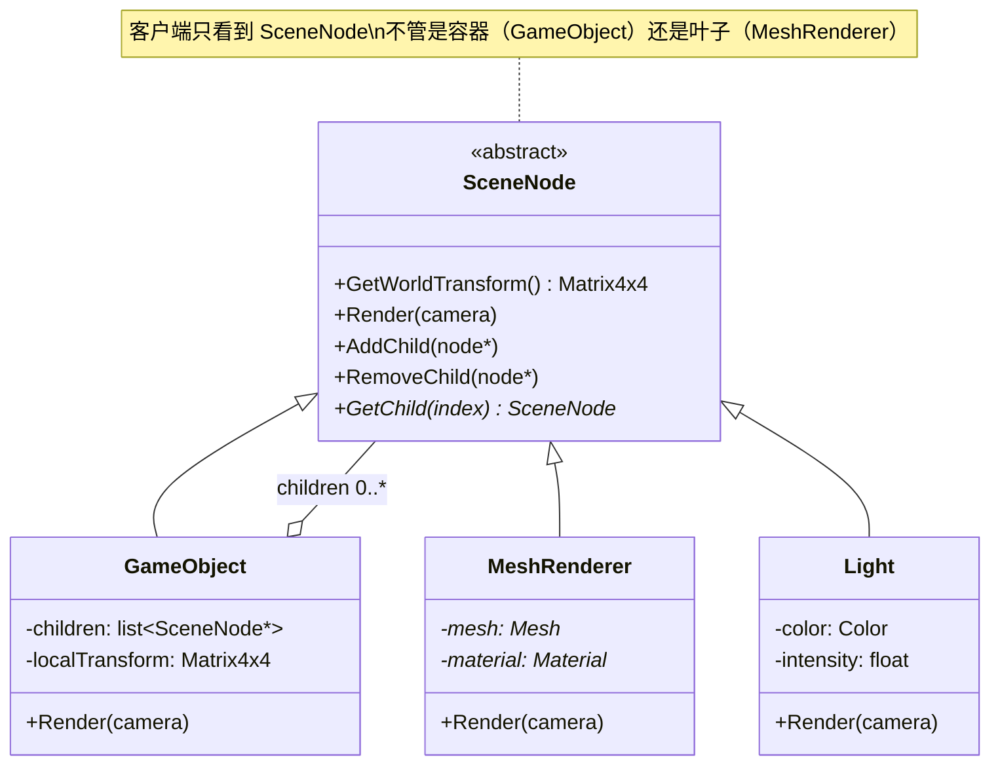
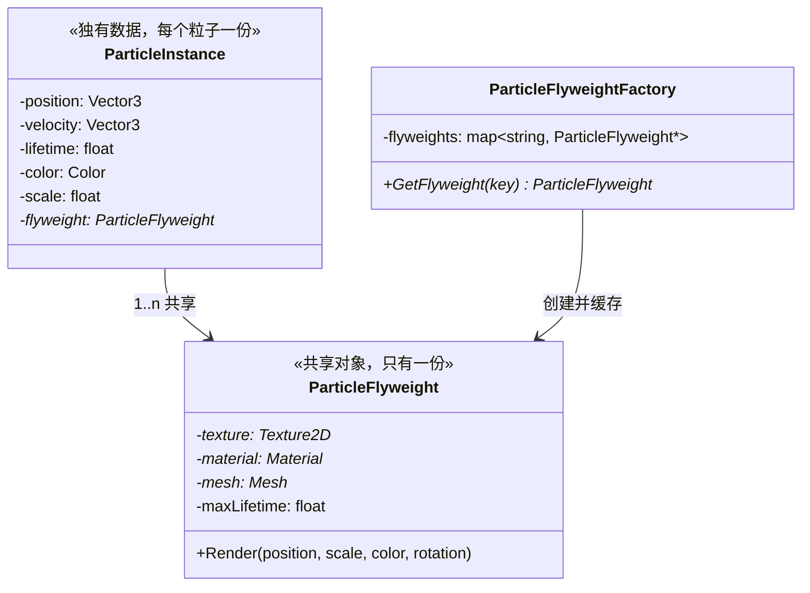
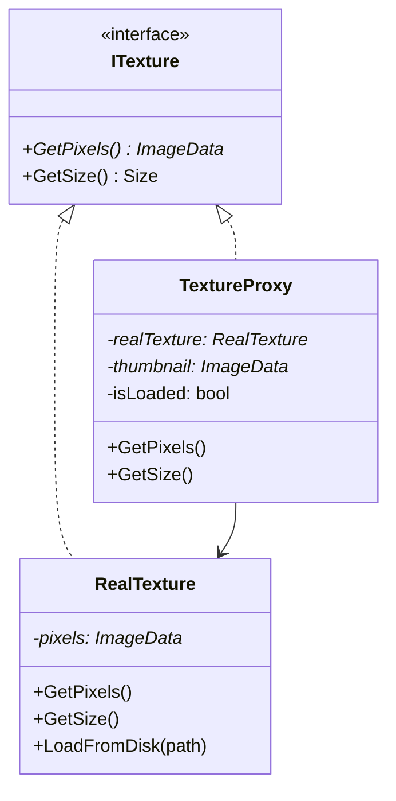

# 第五章 结构型模式：组合、享元、代理、装饰器与适配器

> **一句话理解**：结构型模式回答"类和对象如何组合成更大的结构"。创建型解决"怎么造"，行为型解决"怎么动"，结构型解决"怎么搭"。

> 📋 前置知识：Ch1（SOLID）、Ch3（观察者模式——组合模式中父节点对子节点的通知）、Ch4（职责链——与装饰器的区别）

---

## 5.1 场景问题 —— 三个结构困境

**困境 A —— 树形结构的统一处理**

场景树是一个典型的树形结构——`Scene` 包含 `GameObject`，`GameObject` 又可以包含子 `GameObject`。渲染时需要递归遍历整棵树。问题在于：你是分别处理 `Scene`（容器）和 `MeshRenderer`（叶子），还是把它们当作**同一种东西**统一处理？

**困境 B —— 大量相似对象的内存爆炸**

一场战斗中有 5000 个粒子，每个粒子都有颜色、大小、纹理、材质。如果每个粒子存一份完整数据，5000 × 200 字节 = 1MB——仅仅粒子就占这么多。更糟的是纹理和材质在所有粒子间是**完全相同**的。

**困境 C —— 功能增强的层层叠加**

一把基础长剑：伤害 50。附魔火焰：+10 火焰伤害 + 燃烧效果。再附魔吸血：+15% 吸血。再附魔闪电：+ 连锁闪电。这些增强可以**任意组合叠加**——你不可能为每种组合写一个子类（`FireLifestealSword`、`FireLightningLifestealSword`……组合爆炸）。

---

## 5.2 组合模式 (Composite)

> **意图**：将对象组织成**树形结构**，使客户端对**单个对象**和**组合对象**一视同仁。
>
> **体现的 SOLID 原则**：OCP（新增节点类型不改客户端代码）、LSP（容器和叶子可互相替换）

### 模式结构



### C++ 实现

```cpp
// ============ 抽象基类——统一容器和叶子 ============
class SceneNode {
public:
    virtual ~SceneNode() = default;

    // 核心操作——容器和叶子都支持
    virtual void Render(Camera* camera) = 0;
    virtual Matrix4x4 GetWorldTransform() const = 0;

    // 子节点操作——默认空实现（叶子不需要）
    virtual void AddChild(std::unique_ptr<SceneNode> child) {}
    virtual SceneNode* GetChild(int index) { return nullptr; }
    virtual int GetChildCount() const { return 0; }

    // 公共属性
    void SetName(const std::string& n) { name = n; }
    const std::string& GetName() const { return name; }

protected:
    std::string name;
};

// ============ 容器节点——GameObject ============
class GameObject : public SceneNode {
public:
    void Render(Camera* camera) override {
        if (!isActive) return;

        // 容器本身不渲染——委托给子节点
        for (auto& child : children) {
            child->Render(camera);
        }
    }

    Matrix4x4 GetWorldTransform() const override {
        Matrix4x4 world = localTransform;
        if (parent) {
            world = parent->GetWorldTransform() * localTransform;
        }
        return world;
    }

    // 容器特有的子节点管理
    void AddChild(std::unique_ptr<SceneNode> child) override {
        children.push_back(std::move(child));
    }

    SceneNode* GetChild(int index) override {
        return index < children.size() ? children[index].get() : nullptr;
    }

    int GetChildCount() const override { return children.size(); }

    void SetActive(bool active) { isActive = active; }

private:
    std::vector<std::unique_ptr<SceneNode>> children;
    Matrix4x4 localTransform = Matrix4x4::Identity();
    GameObject* parent = nullptr;
    bool isActive = true;
};

// ============ 叶子节点——MeshRenderer ============
class MeshRenderer : public SceneNode {
public:
    MeshRenderer(Mesh* mesh, Material* mat) : mesh(mesh), material(mat) {}

    void Render(Camera* camera) override {
        if (!isVisible) return;

        Matrix4x4 world = GetWorldTransform();
        Graphics::DrawMesh(mesh, material, world, camera);
    }

    Matrix4x4 GetWorldTransform() const override {
        return owner ? owner->GetWorldTransform() : Matrix4x4::Identity();
    }

private:
    Mesh* mesh;
    Material* material;
    GameObject* owner = nullptr;
    bool isVisible = true;
};

// ============ 叶子节点——Light ============
class Light : public SceneNode {
public:
    void Render(Camera* camera) override {
        Graphics::SubmitLight(this, camera);
    }

    Matrix4x4 GetWorldTransform() const override {
        return owner->GetWorldTransform();
    }

private:
    Color color = Color::White;
    float intensity = 1.0f;
    LightType type = LightType::Point;
    GameObject* owner = nullptr;
};

// ============ 使用——客户端不需要区分容器和叶子 ============
void RenderScene(SceneNode* root, Camera* camera) {
    root->Render(camera);  // 递归渲染整棵树——一句代码
}

// Unity 风格的场景组装
auto scene = std::make_unique<GameObject>();
scene->SetName("MainScene");

auto player = std::make_unique<GameObject>();
player->SetName("Player");
player->AddChild(std::make_unique<MeshRenderer>(playerMesh, playerMat));

auto weapon = std::make_unique<GameObject>();
weapon->SetName("Sword");
weapon->AddChild(std::make_unique<MeshRenderer>(swordMesh, swordMat));
weapon->AddChild(std::make_unique<Light>());  // 发光的剑

player->AddChild(std::move(weapon));
scene->AddChild(std::move(player));

// 渲染整棵树——递归处理所有节点，不管类型
RenderScene(scene.get(), mainCamera);
```

### 透明组合 vs 安全组合

上面的实现把子节点操作放在基类里（默认空实现）——这叫**透明组合**。另一种是只在容器类里放子节点操作——叫**安全组合**：

```cpp
// 透明组合：基类包含所有操作
class SceneNode {
    virtual void AddChild(...) {}  // 叶子空实现
};
// 客户端可以写 node.AddChild(...) 而不用知道具体类型
// 代价：叶子对象上调用 AddChild 不会报错，只是无效

// 安全组合：子节点操作只在容器类
class SceneNode {
    // 不包含 AddChild
};
class GameObject : public SceneNode {
    void AddChild(...) { /* 真正的实现 */ }
};
// 客户端需要先 dynamic_cast<GameObject> 才能 AddChild
// 更安全，但失去了"一视同仁"的便利性
```

> 💡 **游戏引擎的选择**：Unity 和 UE 都采用了**安全组合**——`Transform` 才有子节点管理，`MeshRenderer` 没有。但理解透明组合的思想对于阅读引擎源码很有帮助。

### 🎮 游戏实战：UI 树

```cpp
// UI 系统是组合模式的另一个经典应用
class UIElement {
public:
    virtual void Render(Canvas* canvas) = 0;
    virtual bool HitTest(const Vector2& point) = 0;

    // 布局
    void SetRect(const Rect& r) { rect = r; }
    Rect GetRect() const { return rect; }

protected:
    Rect rect;
};

class UIPanel : public UIElement {
    std::vector<std::unique_ptr<UIElement>> children;

public:
    void Render(Canvas* canvas) override {
        // 先渲染自己（背景）
        canvas->DrawRect(rect, backgroundColor);

        // 再渲染子元素（前景）
        for (auto& child : children) {
            child->Render(canvas);
        }
    }

    bool HitTest(const Vector2& point) override {
        if (!rect.Contains(point)) return false;

        // 检查子元素（子元素在父元素之上）
        for (auto& child : children) {
            if (child->HitTest(point)) return true;
        }
        return true;  // 点中了面板本身
    }
};

class UIButton : public UIElement {
    std::string text;
    std::function<void()> onClick;
    bool isHovered = false;

public:
    void Render(Canvas* canvas) override {
        Color bg = isHovered ? hoverColor : normalColor;
        canvas->DrawRect(rect, bg);
        canvas->DrawText(text, rect.Center());
    }

    bool HitTest(const Vector2& point) override {
        return rect.Contains(point);
    }
};
```

---

## 5.3 享元模式 (Flyweight)

> **意图**：运用**共享**技术有效支持大量细粒度对象。
>
> **体现的 SOLID 原则**：SRP（共享数据与独有数据分离）

### 场景问题

粒子系统中，10000 个粒子各自飞散。但它们共享的是同一套纹理和材质——如果每个粒子存一份纹理引用，就是 10000 份完全相同的指针。享元模式把共享数据（内部状态）和独有数据（外部状态）分开存储。

### 模式结构



### C++ 实现

```cpp
// ============ 享元——共享的纹理/材质数据 ============
class ParticleFlyweight {
public:
    ParticleFlyweight(Texture2D* tex, Material* mat, Mesh* m, float lifetime)
        : texture(tex), material(mat), mesh(m), maxLifetime(lifetime) {}

    void Render(const Vector3& pos, float scale, const Color& color, float rotation) const {
        // 使用共享的纹理和材质，配合独有数据（位置/大小/颜色/旋转）
        Graphics::DrawMeshInstanced(mesh, material, pos, scale, rotation, color);
    }

private:
    Texture2D* texture;    // 所有同类型粒子共享
    Material* material;    // 所有同类型粒子共享
    Mesh* mesh;            // 所有同类型粒子共享（通常是 Billboard Quad）
    float maxLifetime;     // 所有同类型粒子共享
};

// ============ 粒子实例——只有运行时状态 ============
class ParticleInstance {
public:
    ParticleInstance(const ParticleFlyweight* fw)
        : flyweight(fw) {}

    void Update(float dt) {
        lifetime += dt;
        position += velocity * dt;
        velocity.y += gravity * dt;
        alpha = 1.0f - (lifetime / flyweight->GetMaxLifetime());  // 淡出
    }

    void Render() const {
        if (lifetime < flyweight->GetMaxLifetime()) {
            Color faded = baseColor;
            faded.a *= alpha;
            flyweight->Render(position, scale, faded, rotation);
        }
    }

    bool IsAlive() const {
        return lifetime < flyweight->GetMaxLifetime();
    }

    // 初始化——对象池复用后重新设置
    void Spawn(const Vector3& pos, const Vector3& vel, const Color& col) {
        position = pos;
        velocity = vel;
        baseColor = col;
        lifetime = 0.0f;
        alpha = 1.0f;
    }

private:
    const ParticleFlyweight* flyweight;  // 指向共享数据
    // 以下都是独有数据——每个粒子不同
    Vector3 position;
    Vector3 velocity;
    Color baseColor;
    float lifetime = 0.0f;
    float alpha = 1.0f;
    float scale = 1.0f;
    float rotation = 0.0f;
    float gravity = -9.8f;
};

// ============ 享元工厂——管理共享对象 ============
class ParticleFlyweightFactory {
public:
    const ParticleFlyweight* GetFlyweight(const std::string& type) {
        auto it = flyweights.find(type);
        if (it != flyweights.end()) {
            return it->second.get();
        }

        // 创建新的享元
        auto flyweight = CreateFlyweight(type);
        auto* ptr = flyweight.get();
        flyweights[type] = std::move(flyweight);
        return ptr;
    }

private:
    std::unique_ptr<ParticleFlyweight> CreateFlyweight(const std::string& type) {
        if (type == "smoke") {
            return std::make_unique<ParticleFlyweight>(
                smokeTex, smokeMat, quadMesh, 2.0f);
        } else if (type == "fire") {
            return std::make_unique<ParticleFlyweight>(
                fireTex, fireMat, quadMesh, 1.0f);
        } else if (type == "spark") {
            return std::make_unique<ParticleFlyweight>(
                sparkTex, sparkMat, quadMesh, 0.5f);
        }
        return nullptr;
    }

    std::unordered_map<std::string, std::unique_ptr<ParticleFlyweight>> flyweights;
    // 纹理/材质资源...
};

// ============ 粒子系统——综合使用享元 + 对象池 ============
class ParticleSystem {
    ParticleFlyweightFactory flyweightFactory;
    std::vector<ParticleInstance> particles;
    static constexpr size_t MAX_PARTICLES = 5000;

public:
    void Emit(const std::string& type, const Vector3& pos, int count) {
        auto* flyweight = flyweightFactory.GetFlyweight(type);

        for (int i = 0; i < count; ++i) {
            if (particles.size() >= MAX_PARTICLES) break;

            Vector3 vel = RandomOnSphere() * Random::Range(1.0f, 5.0f);
            Color col = Color::RandomHue();

            particles.emplace_back(flyweight);
            particles.back().Spawn(pos, vel, col);
        }
    }

    void Update(float dt) {
        for (auto& p : particles) p.Update(dt);

        // 移除死亡粒子
        particles.erase(
            std::remove_if(particles.begin(), particles.end(),
                [](auto& p) { return !p.IsAlive(); }),
            particles.end());
    }

    void Render() const {
        for (auto& p : particles) p.Render();
    }
};
```

### 内存对比

```
5000 个火焰粒子，不使用享元：
  每个粒子：position(12B) + velocity(12B) + color(4B) + texture*(8B) + material*(8B) + mesh*(8B) + lifetime(4B) = 56B
  总计：5000 × 56B = 280KB

5000 个火焰粒子，使用享元：
  享元（一份）：texture(8B) + material(8B) + mesh(8B) + maxLifetime(4B) = 28B
  每个粒子实例：position(12B) + velocity(12B) + color(4B) + flyweight*(8B) + lifetime(4B) = 40B
  总计：28B + 5000 × 40B = 200KB

节省：80KB（28%）。如果有 5 种粒子类型混合，节省更多。
```

### 享元 vs 对象池

这两种模式经常被混淆：

| | 享元 | 对象池 |
|------|------|------|
| 核心问题 | **共享数据**，避免重复存储 | **复用对象**，避免重复创建 |
| 共享的内容 | 不可变数据（纹理/材质/字体） | 对象本身（重置后复用） |
| 对象数量 | 多个不同实例共享同一份数据 | 同一个实例先后被不同地方使用 |
| 典型例子 | 粒子纹理、瓦片地图、字体字形 | 子弹、音效源、网络包 |

**它们可以组合使用**：上面的 `ParticleSystem` 就是享元 + 对象池的组合——纹理用享元共享，粒子实例用对象池复用（`particles` 的扩容和复用）。

### 🎮 游戏实战：瓦片地图

```cpp
// 瓦片地图是享元模式的经典应用
// 1000×1000 的地图，只有 ~20 种瓦片类型

class TileFlyweight {
public:
    TileFlyweight(Texture2D* atlas, const Rect& uvRect, bool isWalkable,
                  float moveCost)
        : atlasTexture(atlas), uv(uvRect), walkable(isWalkable),
          movementCost(moveCost) {}

    void Render(const Vector2& worldPos) const {
        Graphics::DrawQuad(atlasTexture, uv, worldPos, TILE_SIZE);
    }

    bool IsWalkable() const { return walkable; }
    float GetMovementCost() const { return movementCost; }

private:
    Texture2D* atlasTexture;  // 所有瓦片共享同一张图集
    Rect uv;                  // 在图集中的位置
    bool walkable;
    float movementCost;
};

// 地图存储的是享元指针的二维数组
class TileMap {
    std::vector<std::vector<const TileFlyweight*>> tiles;

public:
    void Render() const {
        for (int y = 0; y < height; ++y) {
            for (int x = 0; x < width; ++x) {
                tiles[y][x]->Render(Vector2(x * TILE_SIZE, y * TILE_SIZE));
            }
        }
    }
};

// 1000×1000 的地图，内存占用：
// 不用享元：每个 tile 存完整纹理引用 + 属性 ≈ 64B × 1,000,000 = 64MB
// 用享元：享元（20 个 × 64B = 1.3KB）+ tile 指针（8B × 1,000,000 = 8MB）= 8MB
// 节省：87.5%
```

---

## 5.4 代理模式 (Proxy)

> **意图**：为另一个对象提供一种**替身**以控制对这个对象的访问。
>
> **体现的 SOLID 原则**：OCP（代理与被代理对象有相同接口，可替换）、SRP（权限/加载/日志与业务逻辑分离）

### 模式结构



### 三种代理类型

```cpp
// ============ 虚拟代理：延迟加载 ============
// 问题：加载一张 4096×4096 的纹理需要 200ms，但玩家可能永远不会看到它
// 解决：先用低分辨率占位图，真正需要时才加载

class TextureProxy : public ITexture {
    std::unique_ptr<RealTexture> realTexture;
    std::unique_ptr<ImageData> placeholder;
    std::string filePath;
    bool isLoaded = false;

public:
    TextureProxy(const std::string& path) : filePath(path) {
        placeholder = GeneratePlaceholder(32, 32);  // 32×32 占位图
    }

    ImageData* GetPixels() override {
        EnsureLoaded();
        return realTexture->GetPixels();
    }

    Size GetSize() override {
        if (isLoaded) return realTexture->GetSize();
        return placeholder->GetSize();  // 返回占位图尺寸
    }

private:
    void EnsureLoaded() {
        if (!isLoaded) {
            realTexture = std::make_unique<RealTexture>();
            realTexture->LoadFromDisk(filePath);  // 真正加载
            isLoaded = true;
        }
    }
};

// ============ 保护代理：权限控制 ============
class ProtectedConsoleCommand : public IConsoleCommand {
    IConsoleCommand* realCommand;
    UserPermission requiredPermission;

public:
    void Execute(const std::string& args) override {
        if (CurrentUser::HasPermission(requiredPermission)) {
            realCommand->Execute(args);
        } else {
            Log::Warning("Permission denied for command");
        }
    }
};

// ============ 日志代理：性能分析 ============
class ProfilingProxy : public IComponent {
    IComponent* realComponent;
    std::string componentName;

public:
    void Update(float dt) override {
        auto start = Clock::now();
        realComponent->Update(dt);
        auto elapsed = Clock::now() - start;

        if (elapsed > 1ms) {
            Log::Warning(componentName + "::Update took " +
                         std::to_string(elapsed.count()) + "us");
        }
    }
};
```

### 🎮 代理模式的游戏应用全景

| 代理类型 | 游戏场景 | 本质 |
|---------|---------|------|
| **虚拟代理** | 纹理延迟加载、场景异步加载 | 推迟创建开销大的对象 |
| **保护代理** | 调试指令权限、编辑器模式限制 | 控制访问权限 |
| **日志代理** | 性能 Profiling、操作审计 | 在不改原对象的前提下加日志 |
| **远程代理** | 网络同步中的 RPC 代理 | 本地对象代表远程对象 |
| **缓存代理** | 寻路结果缓存、AI 决策缓存 | 缓存昂贵操作的结果 |

> 💡 **智能指针就是代理**：`unique_ptr` 代理了所有权，`shared_ptr` 代理了引用计数和生命周期。你在用的很多东西本质就是代理模式。

---

## 5.5 装饰器模式 (Decorator)

> **意图**：**动态地**给一个对象添加额外的职责。装饰器提供了比继承更灵活的扩展方式。
>
> **体现的 SOLID 原则**：OCP（新功能 = 新装饰器，不改原对象）、SRP（每个装饰器只加一种功能）

### 场景问题

回到困境 C——武器附魔的组合爆炸。长剑 + 火焰 + 吸血 + 闪电，任意组合。用继承会产生指数级的子类数量。装饰器让你**层层包装**：

```
new LightningEnchantment(
    new LifeStealEnchantment(
        new FireEnchantment(
            new LongSword()
        )
    )
).Attack(target);
// 执行顺序：Lightning → LifeSteal → Fire → LongSword.Attack()
```

### C++ 实现

```cpp
// ============ 抽象武器 ============
class IWeapon {
public:
    virtual void Attack(Enemy* target) = 0;
    virtual float GetDamage() const = 0;
    virtual std::string GetDescription() const = 0;
    virtual ~IWeapon() = default;
};

// ============ 具体武器——被装饰的对象 ============
class LongSword : public IWeapon {
public:
    void Attack(Enemy* target) override {
        target->TakeDamage(baseDamage);
        PlaySwingSound();
    }

    float GetDamage() const override { return baseDamage; }
    std::string GetDescription() const override { return "长剑"; }

private:
    float baseDamage = 50.0f;
};

// ============ 装饰器基类——包装另一个 IWeapon ============
class WeaponEnchantment : public IWeapon {
protected:
    std::unique_ptr<IWeapon> innerWeapon;  // 被装饰的武器

public:
    WeaponEnchantment(std::unique_ptr<IWeapon> weapon)
        : innerWeapon(std::move(weapon)) {}

    // 默认转发——子类选择性重写
    void Attack(Enemy* target) override {
        innerWeapon->Attack(target);
    }

    float GetDamage() const override {
        return innerWeapon->GetDamage();
    }

    std::string GetDescription() const override {
        return innerWeapon->GetDescription();
    }
};

// ============ 具体装饰器 ============

class FireEnchantment : public WeaponEnchantment {
public:
    using WeaponEnchantment::WeaponEnchantment;

    void Attack(Enemy* target) override {
        innerWeapon->Attack(target);
        // 附加火焰效果
        target->TakeDamage(bonusDamage, DamageType::FIRE);
        target->ApplyBurn(burnDamagePerSec, burnDuration);
        SpawnEffect("fire_hit", target->GetPosition());
    }

    float GetDamage() const override {
        return innerWeapon->GetDamage() + bonusDamage;
    }

    std::string GetDescription() const override {
        return innerWeapon->GetDescription() + " + 火焰附魔";
    }

private:
    float bonusDamage = 10.0f;
    float burnDamagePerSec = 5.0f;
    float burnDuration = 3.0f;
};

class LifeStealEnchantment : public WeaponEnchantment {
public:
    using WeaponEnchantment::WeaponEnchantment;

    void Attack(Enemy* target) override {
        innerWeapon->Attack(target);

        float dmg = innerWeapon->GetDamage();  // 基于最终伤害吸血
        if (target->IsAlive()) {
            owner->Heal(dmg * stealPercent);
            SpawnEffect("lifesteal", owner->GetPosition());
        }
    }

    void SetOwner(Character* o) { owner = o; }

private:
    Character* owner = nullptr;
    float stealPercent = 0.15f;
};

class LightningEnchantment : public WeaponEnchantment {
public:
    using WeaponEnchantment::WeaponEnchantment;

    void Attack(Enemy* target) override {
        innerWeapon->Attack(target);

        // 连锁闪电——击中最近的 3 个敌人
        auto nearby = FindNearbyEnemies(target->GetPosition(), chainRange, chainCount);
        for (auto* enemy : nearby) {
            enemy->TakeDamage(chainDamage, DamageType::LIGHTNING);
        }
    }

private:
    float chainDamage = 20.0f;
    float chainRange = 5.0f;
    int chainCount = 3;
};

// ============ 使用——装饰器的任意组合 ============

// 普通长剑
auto sword = std::make_unique<LongSword>();
sword->Attack(target);  // 物理伤害 50

// 火焰长剑
auto fireSword = std::make_unique<FireEnchantment>(std::move(sword));
fireSword->Attack(target);  // 物理 50 + 火焰 10 + 燃烧

// 火焰吸血长剑
auto lifestealFireSword = std::make_unique<LifeStealEnchantment>(
    std::make_unique<FireEnchantment>(
        std::make_unique<LongSword>()
    )
);
lifestealFireSword->SetOwner(player);
lifestealFireSword->Attack(target);
// 物理 50 + 火焰 10 + 燃烧 + 吸血 15%

// 火焰吸血连锁闪电长剑——任意组合，不用新写类
auto godSword = std::make_unique<LightningEnchantment>(
    std::make_unique<LifeStealEnchantment>(
        std::make_unique<FireEnchantment>(
            std::make_unique<LongSword>()
        )
    )
);
std::cout << godSword->GetDescription();
// 输出：长剑 + 火焰附魔 + 吸血附魔 + 闪电附魔
```

### 变体对比：装饰器 vs 职责链（Ch4 呼应）

这是 Ch4 留下的悬念：

```cpp
// ============ 装饰器：每层都必须执行到底 ============
class FireEnchantment {
    void Attack(Enemy* target) override {
        innerWeapon->Attack(target);  // 基础攻击一定会发生
        target->ApplyBurn(5.0f);      // 再附加火焰
        // innerWeapon->Attack 一定会被调用——装饰器不能跳过
    }
};

// ============ 职责链：每层可以选择不传递 ============
class InvincibleBuff {
    void HandleDamage(DamageContext& ctx) override {
        ctx.finalDamage = 0;
        // 不调用 CallNext(ctx)——链在此中断，后续 Buff 不会执行
    }
};
```

| | 装饰器 | 职责链 |
|------|--------|------|
| 是否执行自身 | **是**（增强/附加） | **可能不**（不处理就传递） |
| 是否传递到下一层 | **必须传递** | **可选择中断** |
| 核心意图 | 给对象**加功能** | 给多个对象**处理机会** |
| 游戏例子 | 武器附魔、技能强化 | Buff 系统、输入处理链 |

> 💡 **一种面试表述**：「装饰器是'增强型包装'，每一层都做事且传递；职责链是'接力型传递'，找到处理者为止。判断标准：任意一层能不能中断传递？能 → 职责链；不能 → 装饰器。」

---

## 5.6 适配器模式 (Adapter)

> **意图**：将一个类的接口转换成客户希望的**另一个接口**。适配器让原本接口不兼容的类可以合作。
>
> **体现的 SOLID 原则**：OCP（引入适配器不改已有代码）、DIP（客户端依赖抽象接口）

### 场景问题

你的游戏要接入第三方音频库（FMOD → Wwise）。Wwise 的 API 是 `PostEvent(eventId)`，但你的整个游戏代码都在调 `IAudioService::PlaySound(name)`。你不可能把全项目几百处的 `PlaySound` 改成 `PostEvent`。

### C++ 实现

```cpp
// ============ 游戏中已有的接口——不能改 ============
class IAudioService {
public:
    virtual void PlaySound(const std::string& name) = 0;
    virtual void StopSound(const std::string& name) = 0;
    virtual void SetVolume(float volume) = 0;
    virtual ~IAudioService() = default;
};

// ============ Wwise 的原生 API——不能改（第三方库）============
class WwiseAPI {
public:
    void PostEvent(uint32_t eventId) {
        // Wwise 底层调用
    }

    void StopEvent(uint32_t eventId) {
        // Wwise 底层调用
    }

    void SetMasterVolume(float vol) {
        // Wwise 底层调用
    }
};

// ============ 适配器——连接两边 ============
class WwiseAudioAdapter : public IAudioService {
    WwiseAPI* wwise;  // 被适配者
    std::unordered_map<std::string, uint32_t> nameToEventId;

public:
    WwiseAudioAdapter() {
        wwise = new WwiseAPI();
        // 初始化名称到 ID 的映射
        nameToEventId["explosion"] = 1001;
        nameToEventId["footstep"]  = 1002;
        nameToEventId["hit"]       = 1003;
    }

    void PlaySound(const std::string& name) override {
        auto it = nameToEventId.find(name);
        if (it != nameToEventId.end()) {
            wwise->PostEvent(it->second);  // 适配：string → eventId
        }
    }

    void StopSound(const std::string& name) override {
        auto it = nameToEventId.find(name);
        if (it != nameToEventId.end()) {
            wwise->StopEvent(it->second);
        }
    }

    void SetVolume(float volume) override {
        wwise->SetMasterVolume(volume);
    }
};

// ============ 游戏代码——一行不改 ============
class Game {
    IAudioService* audio;

public:
    Game(IAudioService* audioService) : audio(audioService) {}

    void OnExplosion() {
        audio->PlaySound("explosion");  // 不需要知道底层是 FMOD 还是 Wwise
    }
};

// 切换音频引擎——只改这一行，游戏代码不动
Game game(std::make_unique<WwiseAudioAdapter>());  // 原来是 FmodAudioService
```

### 🎮 游戏开发中的适配器

| 场景 | 被适配者 | 适配目标 |
|------|---------|---------|
| 音频引擎 | FMOD / Wwise / SoLoud | `IAudioService` |
| 物理引擎 | PhysX / Bullet / Box2D | `IPhysicsService` |
| 网络库 | Photon / Mirror / SteamNetworking | `INetworkService` |
| 平台 SDK | Steam / Epic / 主机 SDK | `IPlatformService` |
| 输入设备 | XInput / DualSense / Switch Pro | `IInputProvider` |

这就是 DIP（Ch1）的价值：先定义 `IAudioService` 抽象接口，再写适配器。引擎换了重写适配器就好，游戏逻辑不动。

### 适配器 vs 代理 vs 装饰器

三个模式的结构非常相似——都是包装一个对象。区分它们看**意图**：

| | 适配器 | 代理 | 装饰器 |
|------|------|------|------|
| 意图 | **改接口** | **控制访问** | **增强功能** |
| 接口是否变 | **会变**（A→B） | 不变 | 不变（并扩展） |
| 典型问题 | "两个不兼容的接口怎么合作" | "怎么延迟/控制对这个对象的访问" | "怎么在不改原类的前提下加功能" |

```cpp
// 接口变了 → 适配器
void PlaySound(string name) → wwise->PostEvent(int id)
//             ↑ 接口不同 ↑

// 接口不变，控制访问 → 代理
texture->GetPixels() → (如果没加载就先加载，然后) texture->GetPixels()

// 接口不变，增强功能 → 装饰器
weapon->Attack(target) → weapon->Attack(target) + target->ApplyBurn(5.0f)
```

---

## 5.7 本章回顾

| 模式 | 核心问题 | 一句判断 | 面试频率 |
|------|---------|---------|---------|
| **组合** | 树形结构统一处理 | "是不是'部分-整体'的层级关系？" | ★★★★☆ |
| **享元** | 大量对象的共享数据 | "大量对象的相同数据能抽出来共享吗？" | ★★★★☆ |
| **代理** | 控制对象访问 | "需要在访问对象时做额外的事情吗？" | ★★★☆☆ |
| **装饰器** | 动态附加职责 | "需要给对象加功能，但不想改原类？" | ★★★☆☆ |
| **适配器** | 接口转换 | "两个不兼容的接口怎么一起用？" | ★★★☆☆ |

**结构型模式在游戏中的分布**：

```
组合：场景树、UI 树、预制体层级 —— Unity/UE 的基石
享元：粒子系统、瓦片地图、字体渲染、草/树实例化
代理：纹理延迟加载、网络 RPC、性能 Profiling、智能指针
装饰器：武器附魔、技能强化、Buff 叠加
适配器：第三方 SDK 接入、跨平台抽象、引擎迁移
```

> 📖 下一章：[第六章 游戏架构模式](./06_game_architecture) —— ECS、组件模式、MVC/MVVM、服务定位器。前五章都是"单点模式"，下一章上升到**整个游戏的架构层面**。
