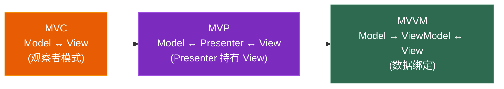

# 第六章 游戏架构模式：ECS、组件模式、MVVM 与服务定位器

> **一句话理解**：前五章讲的是"一个类、一个模块怎么设计"。本章上升到**整个游戏怎么组织**——架构模式决定了你的代码库是越写越轻松，还是越写越沉重。

> 📋 前置知识：Ch1（SOLID，特别是 SRP 和 DIP）、Ch2（工厂模式、对象池）、Ch3（观察者/事件系统）、Ch5（组合模式）

---

## 6.1 场景问题 —— 一个 3000 行的 Player 类

在开始架构讨论之前，先看一个真实的"架构灾难"——你几乎一定见过它：

```cpp
class Player : public MonoBehaviour {
    // ========== 移动 ==========
    float moveSpeed = 5.0f;
    float jumpForce = 10.0f;
    bool isGrounded;
    Vector3 velocity;
    void HandleMovement() { /* ... */ }
    void HandleJump() { /* ... */ }
    void ApplyGravity() { /* ... */ }

    // ========== 战斗 ==========
    float health = 100;
    float maxHealth = 100;
    float attackPower = 50;
    float critChance = 0.2f;
    List<Skill> skills;
    void Attack() { /* ... */ }
    void UseSkill(int index) { /* ... */ }
    void TakeDamage(float dmg) { /* ... */ }
    void Die() { /* ... */ }

    // ========== 动画 ==========
    Animator animator;
    void UpdateAnimation() { /* ... */ }
    void PlayAttackAnim() { /* ... */ }

    // ========== 输入 ==========
    void HandleInput() { /* ... */ }

    // ========== UI 引用（不该在这里！）==========
    Slider healthSlider;
    Text ammoText;
    GameObject inventoryPanel;
    void UpdateUI() { /* ... */ }

    // ========== 音效 ==========
    AudioSource audioSource;
    AudioClip footstepClip;
    AudioClip hurtClip;
    void PlayFootstep() { /* ... */ }

    // ========== 网络（后来加的）==========
    void SyncPosition() { /* ... */ }
    void OnNetworkDataReceived(byte[] data) { /* ... */ }

    // ... 这个类有 3000 行，而且还在涨
};
```

**为什么这是架构问题？** 不是代码写得差——是**架构允许了代码变差**。单体 `Player` 类的存在意味着任何新功能都可以往里塞，而不会遇到任何结构上的阻力。好的架构应该让**正确的做法变得容易，错误的做法变得困难**。

本章的四种架构模式分别从不同角度解决这个问题：

| 架构模式 | 解决的核心问题 | 游戏中的应用 |
|---------|-------------|------------|
| **组件模式** | 一个实体有太多职责 | Unity GameObject、UE Actor |
| **ECS** | 组件模式 + 性能极致化 | Unity DOTS、Overwatch 的 ECS |
| **MVVM** | UI 与数据的双向同步 | 大型 UI 系统、数据绑定 |
| **服务定位器** | 全局服务的发现与管理 | 音频、输入、场景、网络服务 |

---

## 6.2 组件模式 (Component Pattern)

> **意图**：一个实体由多个**组件**组合而成，每个组件只负责一种行为。实体的行为是其组件行为的**总和**。
>
> **体现的 SOLID 原则**：SRP（每个 Component 单一职责）、ISP（组件接口小而专注）、组合优于继承

### 继承地狱 → 组件天堂

```cpp
// ============ 继承地狱 —— "钻石型继承"的实际后果 ============

// 策划："我们的游戏需要这些角色——"
// "近战战士、远程弓箭手、法师、会冲锋的兽人、会隐身的盗贼、
//  会飞的龙、会潜水的鱼人、机械巨人（不能治疗）……"

// 用继承你怎么组织？
// Entity → Character → Humanoid → Melee → Warrior
// Entity → Character → Humanoid → Ranged → Archer
// Entity → Character → Beast → Flying → Dragon
// Entity → Character → Beast → Aquatic → Merman
// Entity → Mechanical → Golem           ← 机械不吃治疗，从哪个分支开始？

// 策划："加一个'半机械龙'——Boss，能飞、能喷火、能召唤小机器人、不吃治疗"
// 你：从 Dragon 继承？从 Golem 继承？多重继承？
```

```cpp
// ============ 组件天堂 —— 组合你想要的能力 ============

class Entity {
    std::vector<std::unique_ptr<Component>> components;

public:
    template<typename T>
    T* AddComponent() {
        auto comp = std::make_unique<T>();
        comp->SetOwner(this);
        T* ptr = comp.get();
        components.push_back(std::move(comp));
        return ptr;
    }

    template<typename T>
    T* GetComponent() {
        for (auto& c : components) {
            if (auto* casted = dynamic_cast<T*>(c.get())) {
                return casted;
            }
        }
        return nullptr;
    }
};

// 各种组件——每个都是一个独立的、可复用的模块
class HealthComponent : public Component {
public:
    void TakeDamage(float amount) { /* ... */ }
    void Heal(float amount) { /* ... */ }
    bool IsAlive() const { return health > 0; }
private:
    float health = 100, maxHealth = 100;
};

class MovementComponent : public Component {
public:
    void MoveTo(const Vector3& target) { /* ... */ }
    void Jump() { /* ... */ }
    bool IsGrounded() const { /* ... */ }
private:
    float moveSpeed = 5.0f;
};

class FlightComponent : public Component {
public:
    void FlyTo(const Vector3& target) { /* ... */ }
    void SetAltitude(float height) { /* ... */ }
};

class MeleeAttackComponent : public Component {
public:
    void Attack(Entity* target) { /* ... */ }
};

class FireBreathComponent : public Component {
public:
    void BreatheFire(const Vector3& direction) { /* ... */ }
};

class SummonComponent : public Component {
public:
    void SummonMinion(const std::string& type) { /* ... */ }
};

// ============ 组装角色 ============

// 半机械龙——组合即可，不需要多重继承
Entity* mechaDragon = new Entity();
mechaDragon->AddComponent<HealthComponent>();       // 有血量
mechaDragon->AddComponent<MovementComponent>();     // 能走路
mechaDragon->AddComponent<FlightComponent>();       // 能飞！
mechaDragon->AddComponent<FireBreathComponent>();   // 能喷火！
mechaDragon->AddComponent<SummonComponent>();       // 能召唤！
// 故意不加 HealableComponent——机械龙不吃治疗

// 兽人战士
Entity* orcWarrior = new Entity();
orcWarrior->AddComponent<HealthComponent>();
orcWarrior->AddComponent<MovementComponent>();
orcWarrior->AddComponent<MeleeAttackComponent>();

// 鱼人
Entity* merman = new Entity();
merman->AddComponent<HealthComponent>();
merman->AddComponent<SwimComponent>();            // 游泳组件
merman->AddComponent<MeleeAttackComponent>();

// 加新能力？写一个新 Component 就行，不改任何已有代码。OCP 完美达成。
```

### 组件之间的通信

组件模式的核心挑战：**组件之间怎么通信而不耦合？**

```cpp
// ❌ 紧耦合——组件直接依赖另一个组件
class HealthComponent : public Component {
    HealthBarUI* healthBar;  // 直接引用 UI 组件——耦合了！
public:
    void TakeDamage(float amount) {
        health -= amount;
        healthBar->UpdateDisplay(health / maxHealth);  // 不该在这里
    }
};

// ✅ 松耦合——通过事件系统通信（Ch3 的事件总线）
class HealthComponent : public Component {
public:
    void TakeDamage(float amount) {
        health -= amount;
        // 向世界宣告——不关心谁在听
        EventBus::Emit(HealthChangedEvent{
            .entity = owner,
            .currentHealth = health,
            .maxHealth = maxHealth
        });

        if (health <= 0) {
            EventBus::Emit(EntityDeathEvent{ .entity = owner });
        }
    }
};

// HealthBarUI 订阅事件——完全独立
class HealthBarUI : public Component {
    void OnEnable() override {
        listener = EventBus::Subscribe<HealthChangedEvent>(
            [this](const HealthChangedEvent& e) {
                if (e.entity == owner) {
                    UpdateDisplay(e.currentHealth / e.maxHealth);
                }
            });
    }
};
```

**三种组件通信方式的选择**：

| 方式 | 适用场景 | 耦合度 |
|------|---------|--------|
| `GetComponent<T>()` | 同实体上的紧密协作组件（Movement 需要 Rigidbody） | 中 |
| 事件总线 | 跨实体通信、一对多通知 | 低 |
| 服务定位器 | 全局服务（音频、输入、场景管理） | 低 |

### 组件模式 vs 经典 OOP 继承

| | 经典继承 | 组件模式 |
|------|---------|---------|
| 代码复用 | 继承父类 | 组合组件 |
| 加新能力 | 修改继承树或新增子类 | 新建一个 Component 类 |
| 运行时组合 | 不支持（继承关系编译期固定） | **支持**（可以动态添加/移除组件） |
| 调试 | 顺着继承链找，可能很深 | 每个 Component 独立，清晰 |
| 性能 | 虚函数调用 | `GetComponent<T>()` + 虚函数调用 |

> 💡 **Unity 的 GameObject 就是组件模式的实现**：`GameObject` 是容器，`MonoBehaviour` 是组件基类，`GetComponent<T>()` 是组件查找。

---

## 6.3 ECS —— Entity-Component-System

> **意图**：将组件模式推至极致——**Entity 只是 ID，Component 只是纯数据，System 包含所有逻辑**。数据与行为彻底分离。
>
> **体现的 SOLID 原则**：SRP 的极致（数据没有行为，行为没有状态）、缓存友好性的架构级实现

### 组件模式 vs ECS

组件模式已经很好了，但 ECS 更进一步：

```
组件模式（Unity 风格）：
  Entity → 持有 Components
  Component → 持有数据 + 行为
  例如：HealthComponent 有 health 数据 + TakeDamage() 方法

ECS（Unity DOTS 风格）：
  Entity → 只是一个 int ID
  Component → 只有数据（struct，无方法）
  System → 只有行为（处理所有拥有特定组件组合的 Entity）
  例如：HealthComponent 只是 { float health; float maxHealth; }
       DamageSystem 遍历所有有 HealthComponent 的 Entity，修改其 health
```

这个分离带来了巨大的性能优势——但先看代码。

### 手写迷你 ECS

```cpp
// ============ 第一步：Entity 只是一个 ID ============
using Entity = uint32_t;
constexpr Entity INVALID_ENTITY = 0;

// ============ 第二步：Component 只是纯数据 ============
struct PositionComponent {
    float x, y, z;
};

struct VelocityComponent {
    float vx, vy, vz;
};

struct HealthComponent {
    float current;
    float max;
};

struct RenderComponent {
    Mesh* mesh;
    Material* material;
};

// ============ 第三步：System 拥有全部行为 ============

// MovementSystem：任何同时有 Position + Velocity 的 Entity 都会自动移动
class MovementSystem {
public:
    void Update(float dt) {
        // 遍历所有拥有 Position AND Velocity 的 Entity
        for (auto entity : world->View<PositionComponent, VelocityComponent>()) {
            auto& pos = world->Get<PositionComponent>(entity);
            auto& vel = world->Get<VelocityComponent>(entity);

            pos.x += vel.vx * dt;
            pos.y += vel.vy * dt;
            pos.z += vel.vz * dt;
        }
    }
};

// DamageSystem：处理伤害请求
class DamageSystem {
public:
    void ProcessDamage(Entity target, float amount) {
        if (world->Has<HealthComponent>(target)) {
            auto& health = world->Get<HealthComponent>(target);
            health.current -= amount;

            if (health.current <= 0) {
                health.current = 0;
                OnEntityDeath(target);
            }
        }
    }
};

// RenderSystem：渲染所有可见 Entity
class RenderSystem {
public:
    void Render(Camera* camera) {
        for (auto entity : world->View<PositionComponent, RenderComponent>()) {
            auto& pos = world->Get<PositionComponent>(entity);
            auto& render = world->Get<RenderComponent>(entity);

            Graphics::DrawMesh(render.mesh, render.material,
                               Vector3(pos.x, pos.y, pos.z), camera);
        }
    }
};
```

### ECS 的核心：内存布局

ECS 性能优势的本质不在代码结构，在**内存布局**。这是面试中最容易被问到的问题。

```
OOP 组件模式（离散内存）：
  内存布局（简化）：
  [Entity0 Header][Pos0][Vel0][Health0]  ← 分散在堆上，每次 new 分配
  [Entity1 Header][Pos1][Vel1][Health1]    遍历时在内存中跳来跳去
  [Entity2 Header][Pos2][Vel2][Health2]    Cache Miss 频繁

ECS（连续内存 - SoA）：
  内存布局（简化）：
  Position 数组: [Pos0][Pos1][Pos2]...[Pos999]  ← 连续！64 bytes per cache line
  Velocity 数组: [Vel0][Vel1][Vel2]...[Vel999]  ← 连续！
  Health 数组:   [HP0] [HP1] [HP2] ...[HP999]    ← 连续！

  MovementSystem 遍历时：
  - 读 Position 数组 → 每次 Cache Miss 加载 4-8 个 Position（64 bytes cache line）
  - 读 Velocity 数组 → 每次 Cache Miss 加载 4-8 个 Velocity
  - 相比 OOP 模式每次只能加载 1 个 Entity 的混合数据，效率高 4-8 倍
```

```cpp
// 简化的 ECS 世界——展示内存布局
class ECSWorld {
    // 每个 Component 类型一个数组（连续存储）
    std::vector<PositionComponent> positions;   // 索引 = entityId
    std::vector<VelocityComponent> velocities;
    std::vector<HealthComponent> healths;
    std::vector<RenderComponent> renders;

    // Entity 拥有的 Component 集合（位掩码）
    std::vector<uint64_t> componentMasks;

    // 空闲 Entity 列表（复用已删除的 entityId）
    std::vector<Entity> freeEntities;

public:
    Entity CreateEntity() {
        if (!freeEntities.empty()) {
            Entity e = freeEntities.back();
            freeEntities.pop_back();
            return e;
        }

        // 扩展所有 Component 数组
        Entity id = positions.size();
        positions.emplace_back();
        velocities.emplace_back();
        healths.emplace_back();
        renders.emplace_back();
        componentMasks.push_back(0);
        return id;
    }

    template<typename T>
    void AddComponent(Entity e, T component) {
        GetArray<T>()[e] = component;
        componentMasks[e] |= GetComponentMask<T>();
    }

    template<typename T>
    T& Get(Entity e) {
        return GetArray<T>()[e];
    }

    // View：返回所有同时拥有指定 Component 的 Entity
    template<typename... Ts>
    std::vector<Entity> View() {
        uint64_t requiredMask = (GetComponentMask<Ts>() | ...);

        std::vector<Entity> result;
        for (Entity e = 0; e < componentMasks.size(); ++e) {
            if ((componentMasks[e] & requiredMask) == requiredMask) {
                result.push_back(e);
            }
        }
        return result;
    }

private:
    template<typename T>
    std::vector<T>& GetArray();

    template<typename T>
    uint64_t GetComponentMask();
};

// 使用
ECSWorld world;

auto player = world.CreateEntity();
world.AddComponent<PositionComponent>(player, {0, 0, 0});
world.AddComponent<VelocityComponent>(player, {0, 0, 0});
world.AddComponent<HealthComponent>(player, {100, 100});
world.AddComponent<RenderComponent>(player, {playerMesh, playerMat});

auto goblin = world.CreateEntity();
world.AddComponent<PositionComponent>(goblin, {5, 0, 0});
world.AddComponent<HealthComponent>(goblin, {50, 50});
world.AddComponent<RenderComponent>(goblin, {goblinMesh, goblinMat});
// goblin 没有 VelocityComponent——它不移动

// MovementSystem 自动处理所有移动实体
MovementSystem movementSys(&world);
movementSys.Update(dt);  // 遍历 player（有 Vel），跳过 goblin（无 Vel）
```

### ECS 的核心优势总结

| 优势 | 解释 | 性能影响 |
|------|------|---------|
| **缓存友好** | 同类型 Component 连续存储 | 遍历速度提升 4-8x |
| **无虚函数** | System 直接操作 struct，不通过接口 | 0 次间接调用 |
| **批量处理** | System 一次处理所有符合条件的 Entity | 编译器可向量化（SIMD） |
| **可并行** | System 之间的依赖关系清晰，可 Job 化 | 多线程友好 |

### 什么时候用 ECS？

```
ECS 适合：
  ✅ 大量相似实体（弹幕、RTS 单位、粒子、AI 代理）
  ✅ 实体类型多变（组件组合变化频繁）
  ✅ 性能敏感（需要充分利用缓存和多核）

ECS 不适合：
  ❌ 实体数量少（< 100）
  ❌ 实体类型固定（只有 Player/Enemy/Bullet 三种）
  ❌ 逻辑复杂且高度耦合（适合传统 OOP）
  ❌ 小团队快速原型（ECS 的学习和调试成本高）
```

> 💡 **面试中的表述**：「ECS 不是 OOP 的替代品。游戏的不同子系统可以用不同范式——UI 用 OOP，粒子用 ECS，技能用命令模式。好的架构师知道什么时候用什么。」

---

## 6.4 MVC / MVP / MVVM —— UI 架构

> **意图**：将 UI 的逻辑与显示分离，使两者可以独立变化和测试。
>
> **体现的 SOLID 原则**：SRP（数据/逻辑/显示三者分离）、DIP（View 依赖抽象的 ViewModel）

### 三种架构的关系



三者是演化关系，不是竞争关系。MVVM 是现代游戏 UI 框架的主流选择，因为数据绑定解决了最大的痛点——**UI 与数据的同步不再依赖手动刷新**。

### 场景问题：背包 UI 的三种写法

先看不用架构的写法，再看 MVVM：

```cpp
// ❌ 无架构——数据和 UI 搅在一起
class InventoryPanel : public MonoBehaviour {
    public Text goldText;
    public Transform contentParent;
    public GameObject itemPrefab;

    void Update() {
        // 每帧轮询刷新——浪费性能
        goldText.text = PlayerData.Gold.ToString();
        // 物品变化了？不知道，全量刷新吧
        RefreshAllItems();
    }

    void RefreshAllItems() {
        foreach (Transform child in contentParent) {
            Destroy(child.gameObject);  // 全删
        }
        foreach (var item in PlayerData.Inventory) {
            var go = Instantiate(itemPrefab, contentParent);
            go.GetComponent<ItemSlot>().SetData(item);  // 全重建
        }
        // 每帧都在全量删除重建——性能灾难
    }
};
```

**问题**：每次金币变化都全量重建 UI。10 个物品还好，200 个物品时每帧卡顿 15ms。

### MVVM 完整实现

```cpp
// ============ Model —— 纯数据，不知道 UI 的存在 ============
class InventoryModel {
public:
    int GetGold() const { return gold; }
    const std::vector<Item>& GetItems() const { return items; }

    void AddGold(int amount) {
        gold += amount;
        OnGoldChanged(gold);  // 通知变化
    }

    void AddItem(const Item& item) {
        items.push_back(item);
        OnItemAdded(items.size() - 1, item);  // 通知新增——而不是全量刷新
    }

    void RemoveItem(int index) {
        Item removed = items[index];
        items.erase(items.begin() + index);
        OnItemRemoved(index, removed);  // 通知移除
    }

    // 变化通知——观察者模式（Ch3）
    std::function<void(int)> OnGoldChanged;
    std::function<void(int, const Item&)> OnItemAdded;
    std::function<void(int, const Item&)> OnItemRemoved;

private:
    int gold = 0;
    std::vector<Item> items;
};

// ============ ViewModel —— Model 和 View 之间的适配层 ============
class InventoryViewModel {
    InventoryModel* model;

public:
    // 暴露给 View 的数据——经过格式化和排序
    std::string GetGoldDisplay() const {
        return std::to_string(model->GetGold()) + " G";
    }

    int GetItemCount() const {
        return model->GetItems().size();
    }

    // 获取单个物品的显示数据
    ItemDisplayData GetItemDisplay(int index) const {
        auto& item = model->GetItems()[index];
        return ItemDisplayData{
            .name = item.name,
            .icon = item.icon,
            .rarityColor = GetRarityColor(item.rarity),
            .count = item.count,
            .isEquipped = item.isEquipped
        };
    }

    // 排序/筛选逻辑——放在 ViewModel 而非 View
    void SortByRarity() { /* 对 model->GetItems() 的索引排序 */ }
    void FilterByType(ItemType type) { /* 筛选 */ }
};

// ============ View —— 只负责显示，不知道数据怎么来的 ============
class InventoryView : public MonoBehaviour {
    InventoryViewModel* viewModel;
    Text goldText;
    Transform contentParent;
    GameObject itemPrefab;
    std::vector<ItemSlot*> itemSlots;

public:
    void Bind(InventoryViewModel* vm) {
        viewModel = vm;
        // 订阅变化——只更新变化的部分
        vm->GetModel()->OnGoldChanged = [this](int gold) {
            goldText.text = viewModel->GetGoldDisplay();  // 只更新金币文字
        };
        vm->GetModel()->OnItemAdded = [this](int index, const Item& item) {
            AddItemSlot(index, item);  // 只新增一个 item UI——不重建全部
        };
        vm->GetModel()->OnItemRemoved = [this](int index, const Item&) {
            RemoveItemSlot(index);  // 只移除一个
        };
    }

    void AddItemSlot(int index, const Item& item) {
        auto go = Instantiate(itemPrefab, contentParent);
        auto slot = go.GetComponent<ItemSlot>();
        slot.SetData(viewModel->GetItemDisplay(index));
        itemSlots.insert(itemSlots.begin() + index, slot);
    }

    void RemoveItemSlot(int index) {
        Destroy(itemSlots[index].gameObject);
        itemSlots.erase(itemSlots.begin() + index);
    }
};
```

**MVVM 的核心价值**：Model 变化时，View 只更新**变化的部分**。加一个物品 → 只创建一个 ItemSlot；金币变化 → 只更新金币文字。不再轮询，不再全量重建。

### 三种架构的选型建议

| 架构 | Model 知道 View 吗 | View 怎么更新 | 适用场景 |
|------|-------------------|-------------|---------|
| MVC | 知道（观察者通知） | Model 发事件 → View 订阅 | 小项目、原型 |
| MVP | 不知道 | Presenter 手动调 View 方法 | 中等项目、需要单元测试 |
| MVVM | 不知道 | 数据绑定自动同步 | 大型项目、复杂 UI |

> 💡 **游戏 UI 的实用建议**：小项目（Game Jam）直接用 MonoBehaviour 绑定（不需要架构）。中等项目用 MVP（Presenter 够用且简单）。大项目用 MVVM（数据绑定节省大量同步代码）。**不是越"高级"越好**。

---

## 6.5 服务定位器 (Service Locator)

> **意图**：提供一个全局注册表，让任何代码都能找到需要的服务。
>
> **体现的 SOLID 原则**：DIP（通过服务定位器获取接口，而非直接依赖具体类）

### 场景问题

游戏中到处需要访问各种"系统级服务"——音频、输入、存档、网络、场景管理。这些服务满足三个特征：

1. **全局唯一**（或在一个上下文中唯一）
2. **被很多地方需要**
3. **可能需要替换实现**（测试用 Mock、换平台）

如果每次都用单例，每个 Manager 写一个 `GetInstance()`——你会得到 12 个不同的全局访问方式。服务定位器把它们统一起来。

### C++ 实现

```cpp
// ============ 服务接口 ============
class IAudioService {
public:
    virtual void PlaySound(const std::string& name) = 0;
    virtual void SetVolume(float vol) = 0;
    virtual ~IAudioService() = default;
};

class IInputService {
public:
    virtual bool GetKey(KeyCode key) const = 0;
    virtual Vector2 GetMousePosition() const = 0;
    virtual ~IInputService() = default;
};

class ISceneService {
public:
    virtual void LoadScene(const std::string& name) = 0;
    virtual Scene* GetCurrentScene() = 0;
    virtual ~ISceneService() = default;
};

// ============ 服务定位器 ============
class ServiceLocator {
public:
    // 注册服务
    template<typename T>
    static void Register(std::unique_ptr<T> service) {
        auto& registry = GetRegistry();
        auto key = std::type_index(typeid(T));
        registry[key] = std::move(service);
    }

    // 获取服务
    template<typename T>
    static T* Get() {
        auto& registry = GetRegistry();
        auto key = std::type_index(typeid(T));
        auto it = registry.find(key);
        if (it != registry.end()) {
            return static_cast<T*>(it->second.get());
        }
        return nullptr;  // 或返回一个 Null 对象（见下文）
    }

    // 清理（在程序退出时调用）
    static void Shutdown() {
        GetRegistry().clear();
    }

private:
    using ServiceMap = std::unordered_map<std::type_index,
                                           std::unique_ptr<void, void(*)(void*)>>;
    static ServiceMap& GetRegistry() {
        static ServiceMap registry;
        return registry;
    }
};

// ============ 使用 ============

// 程序初始化
void Game::Init() {
    ServiceLocator::Register<IAudioService>(
        std::make_unique<FmodAudioService>());
    ServiceLocator::Register<IInputService>(
        std::make_unique<KeyboardMouseInput>());
    ServiceLocator::Register<ISceneService>(
        std::make_unique<SceneManager>());
}

// 任何地方——一行获取服务
void Enemy::PlayHitSound() {
    ServiceLocator::Get<IAudioService>()->PlaySound("enemy_hit");
    // 不需要知道是 FMOD 还是 Wwise
}

// 测试时——替换为 Mock
void Test::Init() {
    ServiceLocator::Register<IAudioService>(
        std::make_unique<MockAudioService>());  // 测试用空实现
}

// 程序退出
void Game::Shutdown() {
    ServiceLocator::Shutdown();  // 统一释放所有服务
}
```

### Null 对象模式 —— 防御式编程

```cpp
// 如果服务未注册，Get<T>() 返回一个 Null 对象而非 nullptr
// 调用方不需要判空

class NullAudioService : public IAudioService {
public:
    void PlaySound(const std::string&) override {}  // 什么都不做
    void SetVolume(float) override {}

    static NullAudioService& Instance() {
        static NullAudioService instance;
        return instance;
    }
};

template<typename T>
static T* Get() {
    auto it = GetRegistry().find(std::type_index(typeid(T)));
    if (it != GetRegistry().end()) {
        return static_cast<T*>(it->second.get());
    }

    // 返回 Null 对象而非 nullptr
    if constexpr (std::is_same_v<T, IAudioService>) {
        return &NullAudioService::Instance();
    }
    return nullptr;
}

// 使用——不需要判空
ServiceLocator::Get<IAudioService>()->PlaySound("explosion");
// 如果忘记注册 AudioService，不崩溃，只是没声音
```

### 服务定位器 vs 依赖注入

这是面试中的热门对比：

```cpp
// ============ 服务定位器 ============
class Enemy {
public:
    void Die() {
        // 被动查找——自己去找服务
        auto* audio = ServiceLocator::Get<IAudioService>();
        audio->PlaySound("enemy_death");
    }
};

// ============ 依赖注入 ============
class Enemy {
    IAudioService* audio;  // 由外部注入
public:
    Enemy(IAudioService* audioService) : audio(audioService) {}

    void Die() {
        audio->PlaySound("enemy_death");  // 使用注入的服务
    }
};
```

| | 服务定位器 | 依赖注入 |
|------|-----------|---------|
| 依赖可见性 | **隐藏**（看代码不知道依赖什么服务） | **显式**（构造函数参数一目了然） |
| 使用便利性 | 极高——随处可用 | 中等——需要层层传递 |
| 单元测试 | 需要 Mock 全局状态 | 天然可测——直接注入 Mock |
| 构造参数数量 | 不看服务 | 可能爆炸（`Enemy(audio, input, physics, network...)`） |
| 游戏开发首选 | ✅（便利性优先） | 部分使用（核心系统） |

> 💡 **面试中的表述**：「游戏开发中服务定位器比依赖注入更实用，因为游戏对象的构造参数太多。但核心系统（如技能引擎、AI 决策）应该用依赖注入以提高可测试性。两者不是非此即彼——可以混合使用。」

---

## 6.6 实战重构 —— 从"上帝类"到清晰架构

用本章的四种架构模式 + 前五章的模式，完整重构最初那个 3000 行的 `Player` 类。

### 重构前

```cpp
class Player : public MonoBehaviour {
    // 移动、战斗、动画、输入、UI、音效、网络——全在一个类里
    // 3000 行，无法测试，无法复用，无法维护
};
```

### 重构后

```cpp
// ============ 组件层 —— 每种职责一个组件 ============

// 移动——纯逻辑，不依赖 UI 或音效
class MovementComponent : public Component {
    Rigidbody* rb;
    float moveSpeed = 5.0f;
    float jumpForce = 10.0f;

public:
    void Move(Vector3 direction) {
        rb->velocity = direction * moveSpeed;
        EventBus::Emit(PlayerMovedEvent{ .position = owner->GetPosition() });
    }

    void Jump() {
        if (IsGrounded()) {
            rb->AddForce(Vector3::up * jumpForce, ForceMode::Impulse);
            EventBus::Emit(PlayerJumpedEvent{});
        }
    }
};

// 战斗——不依赖移动或动画
class CombatComponent : public Component {
    float health = 100;
    float maxHealth = 100;
    float attackPower = 50;

public:
    void TakeDamage(float amount) {
        health -= amount;
        EventBus::Emit(HealthChangedEvent{
            .entity = owner,
            .current = health,
            .max = maxHealth
        });

        if (health <= 0) {
            EventBus::Emit(EntityDeathEvent{ .entity = owner });
        }
    }
};

// ============ 服务层 —— 全局系统 ============
// 音频服务（服务定位器）
// 输入服务（服务定位器）
// 场景服务（服务定位器）

// ============ 事件驱动的跨系统通信 ============
// UI 系统订阅 CombatComponent 的事件
EventBus::Subscribe<HealthChangedEvent>([](const HealthChangedEvent& e) {
    if (e.entity->IsPlayer()) {
        UIManager::Get().UpdateHealthBar(e.current / e.max);
    }
});

// 音效系统订阅——独立模块，可以整体替换
EventBus::Subscribe<PlayerJumpedEvent>([](const PlayerJumpedEvent&) {
    ServiceLocator::Get<IAudioService>()->PlaySound("jump");
});

EventBus::Subscribe<EntityDeathEvent>([](const EntityDeathEvent& e) {
    if (e.entity->IsPlayer()) {
        ServiceLocator::Get<IAudioService>()->PlaySound("player_death");
        ServiceLocator::Get<ISceneService>()->LoadScene("GameOver");
    }
});

// ============ 组装 ============
auto* player = new Entity();
player->AddComponent<MovementComponent>();
player->AddComponent<CombatComponent>();
player->AddComponent<AnimationComponent>();
player->AddComponent<NetworkSyncComponent>();

// Player 类消失了——它被拆成了多个独立的组件，通过事件系统协作。
// 加新功能？加新 Component 或订阅新事件。不改已有代码。
```

### 重构前后对比

| 维度 | 重构前 | 重构后 |
|------|--------|--------|
| `Player` 类的行数 | 3000+ | 0（消失了） |
| 加"二段跳" | 在 Player 类里找地方塞 | 改 `MovementComponent`，只影响移动 |
| 换音频引擎 | 改 Player 类 + 所有直接调用处 | 换 `IAudioService` 实现，一个地方 |
| 单元测试 | 无法测试（依赖 Unity API） | 每个 Component 独立测试 |
| 加新角色类型 | 从 Player 继承或复制代码 | 组装不同的 Component 组合 |
| 网络同步 | 代码散落在 Player 各处 | 独立的 `NetworkSyncComponent` |

---

## 6.7 全部六章的串联 —— 一个完整技能系统的视角

让我们用设计模式系列的全局视角，看一个技能系统是如何被各种模式支撑起来的：

```
┌─────────────────────────────────────────────────────────┐
│                    技能系统架构                           │
├─────────────────────────────────────────────────────────┤
│                                                          │
│  ┌─────────────────────┐    ┌─────────────────────┐     │
│  │    SkillFactory      │    │   SkillCommand      │     │
│  │   (工厂方法 Ch2)     │───▶│  (命令模式 Ch3)      │     │
│  │   配置表 → 反射创建   │    │  Execute / Undo     │     │
│  └─────────────────────┘    └──────────┬──────────┘     │
│                                        │                 │
│                     ┌──────────────────┼──────┐         │
│                     │                  │      │         │
│                     ▼                  ▼      ▼         │
│  ┌──────────┐  ┌──────────┐  ┌──────────────┐          │
│  │ 状态机    │  │ 事件总线  │  │  职责链       │          │
│  │ (Ch3)    │  │ (Ch3)    │  │  (Ch4)       │          │
│  │ 角色状态  │  │ 全局广播  │  │  Buff 处理    │          │
│  │ Idle→Cast│  │ 成就/特效 │  │  伤害计算链   │          │
│  └──────────┘  └──────────┘  └──────────────┘          │
│                                                          │
│  ┌──────────────────────────────────────────┐           │
│  │          架构层 (Ch6)                      │           │
│  │  组件模式: 技能是 Component                │           │
│  │  服务定位器: Audio/Input/Scene 服务         │           │
│  │  MVVM: 技能面板 UI 的数据绑定               │           │
│  └──────────────────────────────────────────┘           │
│                                                          │
│  底层原则 (Ch1): SRP 拆分 → DIP 依赖抽象 → OCP 不修改    │
│  对象创建 (Ch2): 工厂 + 对象池                            │
│  结构组织 (Ch5): 技能树 = 组合模式、BUFF = 装饰器         │
│                                                          │
└─────────────────────────────────────────────────────────┘
```

### 每个模式在这个系统中的职责

| 模式 | 在技能系统中的角色 | 章节 |
|------|------------------|------|
| **SOLID** | 设计决策的依据——拆不拆、怎么拆 | Ch1 |
| **工厂方法** | 配置表 → 技能对象（`SkillFactory::Create(103)`） | Ch2 |
| **对象池** | 弹道、特效、伤害数字的复用 | Ch2 |
| **命令模式** | 技能本身是 Command 对象（Execute/Undo/序列化） | Ch3 |
| **观察者/事件** | 技能释放广播（成就、音效、特效各听各的） | Ch3 |
| **状态机** | 角色状态管理（不能边施法边移动） | Ch3 |
| **策略模式** | 伤害公式可替换（物理/魔法/真实） | Ch4 |
| **模板方法** | 技能释放骨架（PreCast → Execute → PostCast） | Ch4 |
| **职责链** | Buff 系统（伤害沿链传递：护盾→减伤→反伤→吸血） | Ch4 |
| **组合模式** | 技能树是树形结构（技能 → 子技能 → 被动） | Ch5 |
| **装饰器** | 技能强化（基础火球 → 大火球 → 分裂大火球） | Ch5 |
| **组件模式** | 角色由组件拼装（非继承），技能是 SkillComponent | Ch6 |
| **MVVM** | 技能面板 UI——技能冷却/法力消耗的实时更新 | Ch6 |
| **服务定位器** | Audio/Input/Scene 等全局服务 | Ch6 |

---

## 6.8 设计模式系列 —— 终章回顾

六章，17 种模式/原则，一条主线：

```
Ch1 原则   →  告诉我"什么时候该拆、怎么判断好坏"
Ch2 创建型 →  对象怎么造（单例/工厂/对象池）
Ch3 行为型 →  对象怎么通信（事件/命令/状态机）
Ch4 行为型 →  对象怎么协作（策略/模板方法/职责链）
Ch5 结构型 →  对象怎么搭（组合/享元/代理/装饰器/适配器）
Ch6 架构   →  整个游戏怎么组织（组件/ECS/MVVM/服务定位器）
```

**面试中最常被问到的设计题（按频率排序）**：

| 题目 | 核心模式 | 章节 |
|------|---------|------|
| "设计一个 Undo/Redo 系统" | 命令模式 | Ch3 |
| "设计一个事件系统" | 观察者/事件总线 | Ch3 |
| "设计一个角色状态机" | 状态模式 | Ch3 |
| "ECS 和 OOP 的区别？什么时候用？" | ECS + 组件模式 | Ch6 |
| "设计一个 Buff 系统" | 职责链 | Ch4 |
| "设计一个技能系统" | 命令 + 模板方法 + 策略 | Ch3+4 |
| "单例的线程安全实现" | 单例 | Ch2 |
| "设计一个 UI 框架" | MVVM | Ch6 |
| "对象池怎么设计？和享元什么区别？" | 对象池 + 享元 | Ch2+5 |
| "SOLID 原则，各举一个游戏中的例子" | SOLID | Ch1 |

> 💡 **最后的建议**：设计模式不是学了就要用。每一层抽象都有代价——理解成本、调试难度、性能开销。最好的设计是**刚好够用的设计**。当你发现自己在"为用模式而用模式"时，回头读 Ch1 的 KISS 和 YAGNI。

---

> 📖 本系列全部文章均采用 CC BY-NC-SA 4.0 协议发布。
