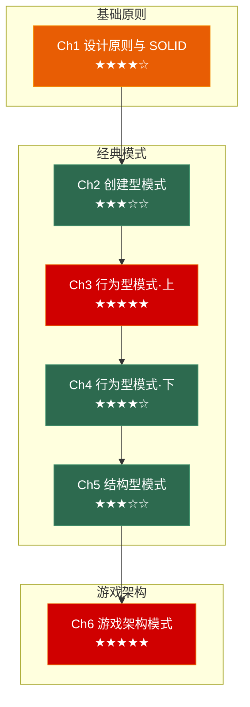

# 设计模式：从 SOLID 到游戏架构

> 面向**游戏客户端开发岗**的设计模式笔记系列。每章覆盖：**场景问题 → 模式结构(Mermaid) → 代码实现 → 变体对比 → 🎮 游戏实战**。
>
> 与 C++/OS/网络系列不同——设计模式面试不是背诵定义，而是**从场景推导方案**。每章以一个真实的游戏开发痛点开头，让你先感受"不用模式会怎样"，再引入模式。

---

## 系列全景



---

## 章节导航

| 章节 | 主题 | 面试权重 |
|------|------|---------|
| [**Ch1**](./01_solid/) | 设计原则与 SOLID | ★★★★☆ |
| [**Ch2**](./02_creational/) | 创建型模式 | ★★★☆☆ |
| [**Ch3**](./03_behavioral_1/) | 行为型模式·上（事件、命令、状态） | ★★★★★ |
| [**Ch4**](./04_behavioral_2/) | 行为型模式·下（策略、模板方法、职责链） | ★★★★☆ |
| [**Ch5**](./05_structural/) | 结构型模式 | ★★★☆☆ |
| [**Ch6**](./06_game_architecture/) | 游戏架构模式 | ★★★★★ |

---

### 📗 基础原则 (Ch 1)

---

#### 第一章 设计原则与 SOLID

> 模式是"术"，原则是"道"。本章回答：一段代码什么时候该重构？好的设计到底好在哪里？

**场景问题**：
- 策划说"再加一种敌人类型"——你发现要改 12 个文件
- 一个函数的参数从 3 个涨到 11 个，每次改动都怕破坏已有功能
- 基类的方法在子类里抛 `not implemented`，调用方需要 `dynamic_cast` 判断类型

**核心内容**：

| 原则 | 一句话 | 游戏场景 |
|------|--------|---------|
| SRP 单一职责 | 一个类只有一个理由修改 | `PlayerController` 不要既处理输入又管理血量 |
| OCP 开闭原则 | 扩展开放，修改关闭 | 加新武器类型不应该改 `DamageCalculator` |
| LSP 里氏替换 | 子类必须能完全替换父类 | "正方形是矩形"的陷阱：`SetWidth`/`SetHeight` |
| ISP 接口隔离 | 不要强迫使用方依赖它不需要的接口 | `IMovable` / `IAttackable` 拆开比一个大 `IEntity` 好 |
| DIP 依赖倒置 | 高层不依赖低层，都依赖抽象 | `SkillSystem` 依赖 `ISkill` 而非具体技能类 |

**补充原则**：
- **组合优于继承**：为什么 Unity 用 Component 而不是深层继承树
- **KISS / YAGNI / DRY**：避免过度设计——不是每个 `if` 都要抽象成策略模式

**本章特别说明**：
- 用 C++ 实现，但原则本身跨语言
- 每个原则都配失败案例（不用原则写出来什么样）和重构后版本
- 本章是后续 5 章的基础——每种模式本质上都是在实现某个 SOLID 原则

---

### 📘 经典模式 (Ch 2–5)

---

#### 第二章 创建型模式

> 回答一个问题：对象应该由谁创建、何时创建、怎么创建？

**场景问题**：
- 游戏中只有一个 `AudioManager`，但新人同事在 `Enemy` 里直接 `new AudioManager()` 搞出了第二个实例，音效混乱
- Boss 有 8 种技能，每种技能的创建逻辑散落在不同文件里，策划改一个参数你要翻半个工程
- 子弹频繁 `new`/`delete` 导致内存碎片，Profiler 里 GC Alloc 每帧 2KB

**核心内容**：

| 模式 | 一句话 | 游戏场景 | 面试频率 |
|------|--------|---------|---------|
| **单例 (Singleton)** | 全局唯一实例 | `GameManager`、`AudioManager`、`ResourceManager` | ★★★★★ |
| **工厂方法 (Factory Method)** | 子类决定创建什么 | `EnemyFactory::CreateOrc()` / `CreateElf()` | ★★★★☆ |
| **抽象工厂 (Abstract Factory)** | 创建一族相关对象 | 中世纪武器工厂 vs 科幻武器工厂 | ★★★☆☆ |
| **对象池 (Object Pool)** | 复用而非新建 | 子弹、粒子特效、音效源 | ★★★★★ |

**深度内容**：
- 单例的双重检查锁定（DCL）实现与 C++11 `static` 局部变量方案
- 对象池的三种实现：简单队列 / 懒加载池 / 预热池
- 工厂模式 vs 泛型工厂（C++ 模板的替代方案）
- 对象池与缓存友好性：预分配连续内存 vs 离散分配

**变体对比**：
- 单例 vs 静态类 vs 服务定位器——什么时候单例是合适的
- 工厂方法 vs 抽象工厂——"一种产品"还是"一族产品"

**🎮 游戏实战**：
- 对象池完整实现：子弹管理器（内存预分配 + 复用 + 溢出策略）
- 工厂方法 + 配置表驱动：读取策划 CSV → 反射创建对应 Enemy 子类
- 单例的安全退出：`OnApplicationQuit` 中的析构顺序问题

---

#### 第三章 行为型模式（上）—— 事件、命令、状态

> 这是整个设计模式系列中**最重要的一章**。观察者、命令、状态机是游戏开发中出场率最高的三种模式。

**场景问题**：
- 角色受伤时：扣血 → 弹伤害数字 → 播放音效 → 更新血条 UI → 屏幕闪红。你把这五件事写在 `TakeDamage()` 里，后来策划加了"受伤时触发护盾特效"，你又在 `TakeDamage()` 里加了一行。现在这个函数 200 行，没人敢动
- 你做了一个关卡编辑器，玩家可以放置/移动/删除物体。产品说"加上 Undo/Redo"。你发现根本没有记录操作历史——所有修改都是直接生效的
- 角色的 `Update()` 里塞满了 `if (state == IDLE) ... else if (state == RUN) ... else if (state == JUMP) ...`。新加一个"被击退"状态，你在 7 个地方改了条件判断

**核心内容**：

| 模式 | 一句话 | 游戏场景 | 面试频率 |
|------|--------|---------|---------|
| **观察者 (Observer)** | 一对多的通知机制 | 事件系统、成就系统、UI 更新 | ★★★★★ |
| **命令 (Command)** | 将请求封装为对象 | 技能释放、操作回放、Undo/Redo | ★★★★★ |
| **状态 (State / FSM)** | 行为随内部状态改变 | 角色状态机、AI 行为、游戏流程 | ★★★★★ |

**深度内容**：

**观察者 / 事件系统**：
- 推模型 vs 拉模型：观察者持有 `Subject*` 自己拉数据
- C++ 实现：`std::function` + `std::vector` 的简单事件总线
- 事件队列 vs 立即通知：为什么 Unity 有 `SendMessage` 和 `BroadcastMessage` 但仍然推荐事件系统
- **关键陷阱**：观察者在回调中 `delete this` 导致迭代器失效、循环通知、注册/注销配对

**命令模式**：
- 命令对象 = 执行方法 + 撤销方法 + 序列化
- Undo/Redo 栈结构：`stack<Command> undoStack` + `stack<Command> redoStack`
- **命令缓冲**：格斗游戏中的输入缓冲（搓招）本质是命令队列
- **操作回放**：RTS 的 replay 文件 = 命令序列的时间戳记录

**状态机 (FSM)**：
- 朴素枚举 FSM → 面向对象 FSM → 有限状态机框架
- **状态转换表**：用二维数组消除条件分支
- **分层状态机 (HFSM)**：Player → OnGround → Idle/Run，解决状态爆炸
- **并发状态机**：角色的"移动状态"和"战斗状态"是两个独立的状态机

**变体对比**：
- 观察者 vs 事件总线 vs 消息队列——三者什么时候用哪个
- 状态模式 vs 策略模式——长得几乎一样，但用途完全不同（行为随状态变 vs 算法可替换）
- FSM vs 行为树 vs GOAP——三种 AI 范式的适用场景（行为树在 Ch6 深入）

**🎮 游戏实战**：
- 完整事件系统实现（`EventBus<T>` + 宏注册/注销 + 延迟事件）
- 技能命令系统（`CastSkillCommand` → `execute()` / `undo()` / `serialize()`）
- 角色状态机——至少 6 个状态（Idle/Run/Jump/Fall/Attack/Hurt）的完整切换逻辑

---

#### 第四章 行为型模式（下）—— 策略、模板方法、迭代器、职责链

> 上一章的三种模式是"高频日常型"，本章四种是"特定场景型"——频率稍低，但用到时如果没有，代码会很难看。

**场景问题**：
- 游戏有 20 个角色，每个角色的伤害计算公式不同（有的暴击翻倍，有的无视护甲，有的附带吸血）。你用 `switch(heroType)` 写了一个 500 行的 `CalculateDamage()` 函数
- Buff 系统的逻辑分散在 `OnBeforeAttack`、`OnAfterAttack`、`OnTurnStart`、`OnTurnEnd`……一共有 15 个钩子，每种 Buff 可能影响其中 3-7 个。策划每加一种新 Buff，你就要在 15 个地方加 `if` 判断
- 场景图的遍历方式有前序、后序、按层三种，你需要让外部代码不用改就支持新遍历方式

**核心内容**：

| 模式 | 一句话 | 游戏场景 | 面试频率 |
|------|--------|---------|---------|
| **策略 (Strategy)** | 算法族，可互换 | 伤害公式、AI 决策、移动方式 | ★★★★☆ |
| **模板方法 (Template Method)** | 骨架在父类，细节在子类 | 技能释放流程、UI 生命周期 | ★★★☆☆ |
| **迭代器 (Iterator)** | 统一遍历方式 | 场景图遍历、背包遍历 | ★★☆☆☆ |
| **职责链 (Chain of Responsibility)** | 请求沿链传递 | Buff 系统、输入处理链、校验链 | ★★★★☆ |

**深度内容**：

**策略模式**：
- 策略接口 + 具体策略 + 上下文
- C++ 实现：虚函数策略 vs `std::function` 策略 vs 模板策略
- **策略选择机制**：配置表驱动 vs 工厂创建 vs 依赖注入

**模板方法模式**：
- 好莱坞原则："Don't call us, we'll call you"
- `SkillBase::Execute()` 定义流程：`PreCast() → Cast() → PostCast()`，子类重写各步骤
- 游戏 UI 生命周期：`OnCreate() → OnShow() → OnUpdate() → OnHide() → OnDestroy()`

**职责链模式**：
- 链表式职责链 vs 数组式职责链
- **Buff 系统的职责链实现**：每个 Buff 是链上节点，伤害计算请求从链头传到链尾
- **输入处理链**：UI 拦截 → 快捷键 → 角色操控，优先级从高到低
- 与装饰器模式的区别：职责链可以中断，装饰器必须传递

**变体对比**：
- 策略 vs 状态——策略由外部选择，状态由内部决定
- 模板方法 vs 策略——模板方法用继承（编译时），策略用组合（运行时）
- 职责链 vs 装饰器——职责链可随时终止，装饰器必须执行到底

**🎮 游戏实战**：
- 伤害计算策略系统：`PhysicalDamageStrategy` / `MagicDamageStrategy` / `TrueDamageStrategy`，由角色配置驱动
- Buff 职责链：`DamageCalcPipeline` — 护盾 Buff → 减伤 Buff → 反伤 Buff → 吸血 Buff → 基础伤害
- UI 生命周期模板：所有 UI 面板继承 `UIPanel`，只需重写感兴趣的生命周期方法

---

#### 第五章 结构型模式

> 回答一个问题：类和对象如何组合成更大的结构？

**场景问题**：
- UI 界面是一个树形结构——Panel 套 Panel 套 Button。你需要统一处理渲染、点击检测、显隐切换。但 Panel 和 Button 是不同的类，你不想写两份代码
- 一场战斗场景中有 5000 个粒子，每个粒子都有颜色、大小、位置。如果每个粒子存一份完整数据，内存直接爆炸
- 你的地形系统需要根据平台（PC / 主机 / 手机）加载不同精度的纹理，但游戏逻辑代码不应该关心平台差异

**核心内容**：

| 模式 | 一句话 | 游戏场景 | 面试频率 |
|------|--------|---------|---------|
| **组合 (Composite)** | 树形结构，统一处理 | 场景树、UI 树、组织结构 | ★★★★☆ |
| **享元 (Flyweight)** | 共享不可变数据 | 粒子系统、瓦片地图、字体渲染 | ★★★★☆ |
| **代理 (Proxy)** | 控制访问 | 延迟加载（大纹理）、远程调用 | ★★★☆☆ |
| **装饰器 (Decorator)** | 动态附加责任 | 武器附魔叠加、技能强化 | ★★★☆☆ |
| **适配器 (Adapter)** | 转换接口 | 第三方 SDK 接入、引擎迁移 | ★★★☆☆ |

**深度内容**：

**组合模式**：
- 透明组合 vs 安全组合——方法定义在 Component 还是 Composite
- Unity 的 Transform 层级就是组合模式：`transform.GetChild()` / `transform.parent`
- **渲染遍历**：前序（父→子，适合变换矩阵传递）、后序（子→父，适合包围盒计算）

**享元模式**：
- 内部状态（共享）vs 外部状态（不共享）
- 粒子系统：10000 个粒子共享同一份纹理和材质，只有位置/速度/生命各自存储
- 与对象池的区别：对象池复用整个对象，享元共享部分数据

**代理模式**：
- **虚拟代理**：大纹理先显示占位图，异步加载完成后替换
- **保护代理**：Cheat 指令只在 Debug 版本可用
- 智能指针就是代理：`unique_ptr` 控制所有权，`shared_ptr` 控制生命周期

**变体对比**：
- 组合 vs 装饰器——组合处理"部分-整体"关系，装饰器给单个对象加功能
- 代理 vs 装饰器——代理控制访问，装饰器增强功能
- 适配器 vs 代理——适配器改接口，代理不改接口

**🎮 游戏实战**：
- UI 树渲染系统：`UIElement → UIPanel / UIButton / UIText`，`Render()` 从根递归到叶
- 粒子享元工厂：`ParticleFlyweightFactory` 管理共享纹理/材质，`ParticleInstance` 只存运行时状态
- 资源加载代理：`TextureProxy` 先返回低分辨率占位图，后台加载完成后无缝替换

---

### 📙 游戏架构 (Ch 6)

---

#### 第六章 游戏架构模式

> 前五章讲的都是"单点模式"——解决一个类、一个模块的设计问题。本章上升到**整个游戏的架构层面**。这也是面试中系统设计题的核心。

**场景问题**：
- 你的 `Character` 类有 3000 行，包含了渲染、物理、AI、输入、动画、音效……新来的策划说"加个二段跳"，你找不到该改哪里
- 回合制战斗的流程是"选目标 → 选技能 → 播动画 → 计算伤害 → 扣血 → 检查死亡 → 播特效 → 切换回合"。你用协程串起来能跑，但策划说"加一个技能释放前的预判阶段"，你发现要改整个流程控制
- `InventoryUI` 直接持有 `InventoryData` 的指针，`InventoryData` 变化时 UI 不更新。你把刷新逻辑写在 `Update()` 里每帧轮询，Profiler 显示每帧耗时 3ms

**核心内容**：

| 模式 / 架构 | 一句话 | 游戏场景 | 面试频率 |
|-------------|--------|---------|---------|
| **ECS (Entity-Component-System)** | 数据与行为彻底分离 | Unity DOTS、高性能游戏架构 | ★★★★★ |
| **组件模式 (Component Pattern)** | 一个实体 = 一组组件 | Unity GameObject、UE Actor | ★★★★★ |
| **MVC / MVP / MVVM** | UI 与数据分离 | UI 框架设计、数据绑定 | ★★★★☆ |
| **服务定位器 (Service Locator)** | 全局服务注册与查找 | `ServiceLocator.Get<IAudioService>()` | ★★★★☆ |

**深度内容**：

**组件模式**：
- 为什么现代引擎都用组件模式而非深层继承树："`Character → Humanoid → Player → Mage → FireMage`"的继承噩梦
- **Unity 组件系统剖析**：`GameObject` 是容器，`Component` 是行为片段，`MonoBehaviour` 是组件基类
- 组件通信：`GetComponent<T>()` vs 事件系统 vs 服务定位器，各自的适用场景

**ECS 架构**：
- ECS 的三个核心概念：Entity（ID）、Component（纯数据）、System（纯逻辑）
- 为什么 ECS 快：Cache-friendly 的内存布局（SoA）、无虚函数调用、批量处理
- **Unity DOTS** 介绍：`EntityManager` / `ComponentData` / `JobComponentSystem`
- 与组件模式对比：`GameObject` 系（灵活但慢） vs ECS（快但约束多）
- 什么时候用 ECS：大量相似实体（弹幕、RTS 单位、粒子）

**MVC / MVP / MVVM**：
- MVC：Model 发事件 → View 订阅更新——观察者模式的架构级应用
- MVP：Presenter 持有 View 引用，Model 不直接和 View 通信
- MVVM：ViewModel 是 Model 和 View 的适配层，数据绑定是关键
- **游戏 UI 选型**：大项目用 MVVM（数据绑定不依赖轮询），小项目用 MVP（够用且简单）

**服务定位器**：
- 全局注册表：`ServiceLocator.Register<IAudioService>(new AudioService())`
- vs 依赖注入：服务定位器是被动查找，依赖注入是主动注入
- 游戏中的常见服务：`IAudioService` / `IInputService` / `ISceneService` / `INetworkService`
- 与单例模式的关系：服务定位器是单例的"升级版"——全局访问 + 可替换实现

**变体对比**：
- 组件模式 vs ECS——同样的"组合优于继承"思想，不同的实现代价和性能
- MVC vs MVP vs MVVM——从观察者模式一路演化过来
- 服务定位器 vs 依赖注入——游戏开发中服务定位器更实用（减少构造参数爆炸）
- ECS vs OOP——不是替代关系，游戏的不同子系统可以用不同范式

**🎮 游戏实战**：
- Unity 组件式角色搭建：`GameObject` + `HealthComponent` + `MovementComponent` + `AttackComponent`，各组件通过事件通信
- 精简 ECS Demo：基于 `std::vector` + 组件数组的手写 ECS，展示内存布局差异
- UI 框架设计：基于 MVVM 的背包系统——`InventoryModel` → `InventoryViewModel` → `InventoryView`，数据单向流动
- 服务定位器 + 单例的比较重构：同一个功能用两种方式实现，展示服务定位器在单元测试中的优势

---

## 系列特色

| 特色 | 说明 |
|------|------|
| **场景驱动** | 每章从一个真实的游戏开发痛点开始，先感受"不用的代价" |
| **C++ + Unity C# 双语言** | 设计模式本身用 C++（与现有笔记一致），游戏架构章引入 C#/Unity 对照 |
| **Mermaid 图解** | 类图、时序图、状态转换图——可视化模式结构 |
| **变体对比** | 每组相似模式都有对比表（策略 vs 状态、代理 vs 装饰器、组件 vs ECS） |
| **🎮 游戏实战** | 每章至少 2 个完整的游戏场景代码示例 |
| **SOLID 呼应** | 每种模式都标注它体现了哪些 SOLID 原则 |


## 面试题统计

| 章节 | 典型面试问法 | 频率 |
|------|------------|------|
| Ch1 SOLID | "这段代码违反了哪些设计原则？怎么重构？" | ★★★★☆ |
| Ch2 创建型 | "手写一个线程安全的单例" / "对象池怎么设计" | ★★★★★ |
| Ch3 行为型·上 | "设计一个事件系统" / "Undo/Redo 怎么实现" / "角色状态机怎么设计" | ★★★★★ |
| Ch4 行为型·下 | "伤害公式怎么设计，让策划可以自由配置" | ★★★★☆ |
| Ch5 结构型 | "UI 树怎么设计" / "粒子系统怎么优化内存" | ★★★☆☆ |
| Ch6 游戏架构 | "设计一个技能系统" / "ECS 和 OOP 的区别" / "UI 框架怎么搭" | ★★★★★ |

> 设计模式面试题的特点：很少有"背诵题"，绝大多数是"设计题"——给你一个场景，让你推导方案。所以本系列的重点不是记住模式定义，而是**看到场景能联想到适用模式**。


## 推荐阅读路线

```
Ch1 SOLID（必读，建立设计直觉）
  → Ch3 行为型·上（★★★★★ 最高频：观察者/命令/状态）
    → Ch6 游戏架构（★★★★★ 系统设计题核心）
      → Ch2 创建型（单例/对象池，短且实用）
        → Ch4 行为型·下（策略/职责链，补充高频模式）
          → Ch5 结构型（组合/享元，特定场景使用）
```

> 如果只有 3 天时间：Ch1 → Ch3 → Ch6。这三章覆盖了 70% 以上的游戏设计模式面试题。


## 与已学系列的衔接

| 前置知识（已学系列） | 在设计模式中的应用 |
|---------------------|-------------------|
| C++ Ch3 OOP 多态 | 策略模式、模板方法的虚函数实现基础 |
| C++ Ch5 模板泛型 | 泛型工厂、编译期策略选择 |
| C++ Ch7 并发线程 | 单例的线程安全实现（DCL、`call_once`） |
| C++ Ch4 移动语义 | 对象池中对象的转移与生命周期 |
| 数据结构 Ch6 树 | 组合模式的树形结构、UI 树遍历 |
| 数据结构 Ch9 并查集 | 状态机的状态转换图可以视为有向图 |
| OS Ch2 同步互斥 | 事件系统的线程安全、观察者回调中的死锁风险 |

---

> 📖 本系列全部文章均采用 CC BY-NC-SA 4.0 协议发布。
