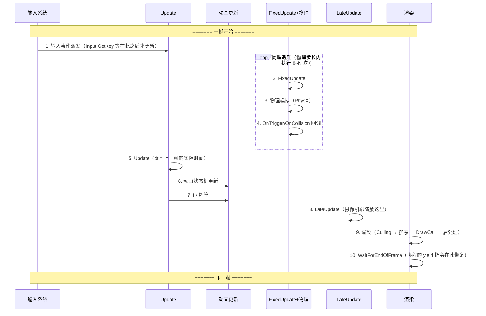
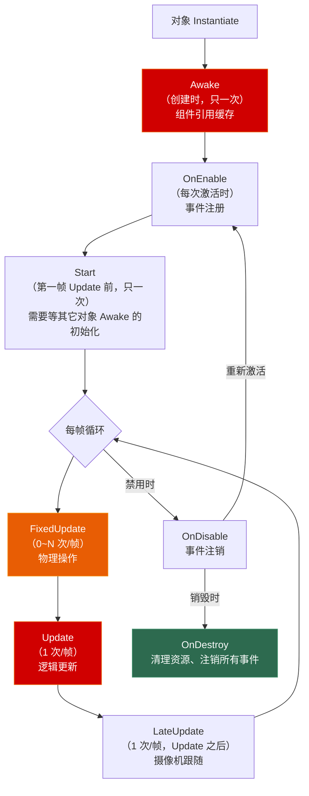

# 第一章 游戏循环与时间管理

> **一句话理解**：游戏循环是引擎的心跳。你写的每一行 `Update` 逻辑，都在这个循环的某个固定节拍上执行。如果节拍搞错了——物理放在 `Update` 里、输入读在 `FixedUpdate` 里——Bug 就像定时炸弹。

> 📋 前置知识：OS Ch1（进程与线程——渲染线程与逻辑线程的关系）

---

## 1.1 概念直觉 —— Why & What

### 普通应用 vs 游戏

```cpp
// ============ 普通 GUI 应用 ============
// 事件驱动——用户不操作，程序就闲着
int main() {
    Window window;
    while (window.IsOpen()) {
        auto event = window.WaitForEvent();  // 阻塞等待
        if (event.type == EVENT_MOUSE_CLICK) {
            HandleClick(event.mousePos);
        }
        // 用户不操作，CPU 占用 ≈ 0%
    }
}

// ============ 游戏 ============
// 持续运行——即使玩家什么都不做，世界也在动
int main() {
    GameWorld world;
    while (world.IsRunning()) {
        ProcessInput();       // 1. 收集输入
        UpdateWorld(dt);      // 2. 更新世界（物理/AI/动画/逻辑）
        RenderFrame();        // 3. 渲染画面
        // 每秒钟跑 60 次，风雨无阻
    }
}
```

**为什么游戏需要循环？** 因为游戏世界是**连续的模拟**。即使玩家手离开键盘，敌人还在走、粒子还在飘、天空还在转。游戏循环以固定（或尽量固定）的频率推进这个模拟。

### 核心矛盾

游戏循环有一个根本性的矛盾：

```
理想：每帧间隔 = 16.67ms（60 FPS），稳定不变
现实：帧间隔从 5ms 到 50ms 不等，取决于场景复杂度

矛盾：如果逻辑依赖固定步长（物理模拟要求 dt 恒定），
      但渲染帧率是变化的——怎么调和？
```

这个矛盾催生了三种游戏循环模型。

---

## 1.2 三种游戏循环模型

### 模型一：可变步长（Variable Timestep）

```cpp
// 最简单的游戏循环——来多快跑多快
void GameLoop() {
    while (running) {
        float dt = GetDeltaTime();  // 距上一帧的实际时间
        ProcessInput();
        Update(dt);   // 逻辑更新——dt 是变量
        Render();
    }
}
```

```
帧 1: dt = 16ms  → Update(16ms)  → 角色移动 16ms × 速度
帧 2: dt = 25ms  → Update(25ms)  → 角色移动 25ms × 速度
帧 3: dt = 10ms  → Update(10ms)  → 角色移动 10ms × 速度
```

**优点**：简单，渲染越快逻辑越快（高配电脑跑得更流畅）。

**致命缺点**：
1. **不确定性**：同样的操作在不同帧率下结果不同。碰撞检测、物理模拟在 dt 变化时行为不一致。这就是为什么帧率同步的格斗游戏不能用这个模型
2. **物理不稳定**：可变 dt 会让数值积分产生不同的误差。`dt = 16ms` 时角色的跳跃高度可能和 `dt = 25ms` 时不一样

### 模型二：固定步长（Fixed Timestep）

```cpp
// 逻辑以固定间隔更新，与渲染分离
const float FIXED_DT = 1.0f / 60.0f;  // 16.67ms

void GameLoop() {
    float accumulator = 0.0f;

    while (running) {
        float frameDt = GetDeltaTime();
        accumulator += frameDt;

        // 追赶：如果渲染慢了，物理可能一帧跑多次
        while (accumulator >= FIXED_DT) {
            ProcessInput();
            Update(FIXED_DT);   // 逻辑始终用固定 dt
            accumulator -= FIXED_DT;
        }

        Render();
    }
}
```

```
帧 1: frameDt = 16ms  → accumulator = 16ms  → Update 跑 1 次（16ms ≈ FIXED_DT）
帧 2: frameDt = 30ms  → accumulator = 30ms  → Update 跑 1 次，accumulator 剩 13ms
帧 3: frameDt = 20ms  → accumulator = 33ms  → Update 跑 2 次，accumulator 剩 0ms
```

**优点**：逻辑确定——同样的输入在任何帧率下结果完全一致（这就是帧同步的原理）。

**缺点**：
1. 渲染帧率掉到 30 时，一帧要跑 2 次 `Update`——如果 `Update` 本身很重，会螺旋减速
2. 需要累积器 + 追赶机制，复杂度高

### 模型三：半固定步长（Semi-Fixed Timestep）—— Unity 的方案

Unity 采用的是混合策略：**渲染用可变步长，物理用固定步长**。这就是你看到的 `Update`（可变）和 `FixedUpdate`（固定）的分工。

```cpp
// Unity 内部简化版
void UnityMainLoop() {
    while (running) {
        float dt = CalculateDeltaTime();

        // 第一层：可变步长——逻辑更新
        CallUpdate(dt);           // 你写的 Update()
        CallLateUpdate(dt);

        // 第二层：固定步长——物理追赶（如果需要）
        physicsTimer += dt;
        while (physicsTimer >= fixedDeltaTime) {
            CallFixedUpdate();    // 你写的 FixedUpdate()
            Physics.Simulate(fixedDeltaTime);
            physicsTimer -= fixedDeltaTime;
        }

        // 渲染
        RenderFrame();
    }
}
```

这就是为什么 `FixedUpdate` 可能在 `Update` 之后被调用多次——当渲染帧率低于物理步长时。

---

## 1.3 Unity 主循环的完整帧分解



**关键时序要点**：

| 阶段 | 时机 | 适合放的逻辑 | 禁止放的逻辑 |
|------|------|-------------|-------------|
| `Awake` | 对象创建时，只调一次 | 组件引用缓存（`GetComponent`） | 依赖其它对象 Awake 的逻辑 |
| `Start` | 第一帧 Update 之前 | 初始化需要等其它对象 Awake 完的逻辑 | — |
| `FixedUpdate` | 物理步长内 0~N 次 | 物理操作（`AddForce`、`MovePosition`） | `Input.GetKeyDown`（会丢失） |
| `Update` | 每帧 1 次 | 大部分游戏逻辑 | 物理操作（用 FixedUpdate） |
| `LateUpdate` | Update 全部结束后 | 摄像机跟随、第三人称臂 | 会影响 Update 中行为的逻辑 |
| `OnDestroy` | 对象销毁时 | 清理资源、注销事件 | — |

---

## 1.4 deltaTime 的精确语义

`deltaTime` 可能是 Unity 中最被低估的概念。它不是"一帧的时间"那么简单。

### 四个时间 API 的区别

```csharp
// ============ 四个时间 API，四个不同含义 ============

// 1. Time.deltaTime —— 上一帧的实际耗时（秒）
//    受 timeScale 影响。timeScale = 0 时，deltaTime = 0
void Update() {
    // 移动：每秒移动 5 个单位，不受帧率影响
    transform.Translate(Vector3.forward * speed * Time.deltaTime);
    // 60 FPS: dt ≈ 0.0167 → 每帧移动 0.083
    // 30 FPS: dt ≈ 0.0333 → 每帧移动 0.167
    // 结果：每秒都移动 5 个单位——与帧率无关
}

// 2. Time.fixedDeltaTime —— 物理步长（默认 0.02 = 50 Hz）
//    不受 timeScale 影响吗？受！timeScale = 0 → FixedUpdate 不执行。
//    但 fixedDeltaTime 本身的值不变。
void FixedUpdate() {
    // 物理操作使用 Time.fixedDeltaTime，不使用 Time.deltaTime
    rb.AddForce(Vector3.up * force, ForceMode.Force);
    // ForceMode.Force 内部已经乘以 fixedDeltaTime
}

// 3. Time.unscaledDeltaTime —— 不受 timeScale 影响的真实时间
//    用于暂停界面、加载进度条、粒子效果等——停不下来的东西
void Update() {
    // 即使 timeScale = 0（游戏暂停），这个 UI 动画依然动
    loadingSpinner.Rotate(0, 0, rotateSpeed * Time.unscaledDeltaTime);
}

// 4. Time.timeScale —— 时间缩放
//    1.0 = 正常速度, 0.5 = 慢动作, 0 = 完全暂停, 2.0 = 快进
void OnGamePaused() {
    Time.timeScale = 0f;
    // Update 中所有依赖 Time.deltaTime 的逻辑全停
    // FixedUpdate 也全停
}
```

### timeScale = 0 时谁还在跑

```csharp
// timeScale = 0 时：
// ❌ Update —— 不跑了（因为 deltaTime = 0，虽然回调本身还在被调用）
// ❌ FixedUpdate —— 不跑了（物理也不模拟了）
// ✅ 协程 WaitForSecondsRealtime —— 还在跑
// ✅ Update + Time.unscaledDeltaTime —— 逻辑还在执行，只是你用的 dt 不同
// ✅ OnGUI —— 仍然每帧调用

// 典型用法：暂停菜单的动画
void Update() {
    if (isPaused) {
        // 用 unscaledDeltaTime —— 即使 timeScale = 0，暂停菜单的呼吸灯还在动
        pausePanel.transform.localScale = Vector3.Lerp(
            pausePanel.transform.localScale,
            targetScale,
            Time.unscaledDeltaTime * 3f
        );
    }
}
```

### deltaTime 不加会怎样

这是面试最常见的基础题：

```csharp
// ❌ 没有 deltaTime —— 移动速度依赖帧率
void Update() {
    transform.Translate(Vector3.forward * 5f * Time.deltaTime);  // ✅ 正确
    // 60 FPS: 每秒移动 5 单位
    // 30 FPS: 每秒移动 5 单位（每次移动更多但频率低）
}

void Update() {
    transform.Translate(Vector3.forward * 5f);  // ❌ 缺少 deltaTime
    // 60 FPS: 每秒移动 5 × 60 = 300 单位
    // 30 FPS: 每秒移动 5 × 30 = 150 单位
    // 换个电脑跑，游戏难度都变了！
}
```

---

## 1.5 MonoBehaviour 生命周期全景



### 决策速查：逻辑放哪里

```csharp
public class Player : MonoBehaviour {
    // ===== Awake：引用缓存 =====
    private Rigidbody rb;
    private Animator animator;
    private HealthBarUI healthBar;

    void Awake() {
        // 获取自身组件——Awake 是最佳位置
        rb = GetComponent<Rigidbody>();
        animator = GetComponent<Animator>();

        // ⚠️ 不要在这里找其他对象——
        //    其他对象的 Awake 可能还没跑完，引用可能是 null
        // healthBar = FindObjectOfType<HealthBarUI>();  ← 危险
    }

    // ===== Start：依赖其他对象的初始化 =====
    void Start() {
        // Start 在所有 Awake 之后执行——此时可以安全地找其他对象
        healthBar = FindObjectOfType<HealthBarUI>();
    }

    // ===== OnEnable / OnDisable：事件注册/注销 =====
    void OnEnable() {
        EventBus.Subscribe<OnDamageEvent>(OnDamageReceived);
    }

    void OnDisable() {
        EventBus.Unsubscribe<OnDamageEvent>(OnDamageReceived);
        // 如果不注销，禁用后事件回调仍然触发 → 空引用异常
    }

    // ===== Update：输入 + 逻辑 =====
    void Update() {
        // 输入检测——只能在 Update 中检测（原因见 1.7 节）
        float horizontal = Input.GetAxis("Horizontal");
        float vertical = Input.GetAxis("Vertical");

        // 移动计算
        Vector3 movement = new Vector3(horizontal, 0, vertical) * moveSpeed;
        Vector3 newPosition = rb.position + movement * Time.deltaTime;

        // 用 MovePosition 而非直接设置 position——正确地与物理交互
        rb.MovePosition(newPosition);

        // 动画参数
        animator.SetFloat("Speed", movement.magnitude);
    }

    // ===== FixedUpdate：物理 =====
    void FixedUpdate() {
        // 持续的物理力
        if (isJumping && isGrounded) {
            rb.AddForce(Vector3.up * jumpForce, ForceMode.Impulse);
            isJumping = false;
        }
    }

    // ===== LateUpdate：摄像机 =====
    void LateUpdate() {
        // 保证角色已经在 Update 中移动完，摄像机再跟上
        Camera.main.transform.position = transform.position + cameraOffset;
        Camera.main.transform.LookAt(transform);
    }
}
```

---

## 1.6 帧率波动的三个典型问题

### 问题一：隧道效应

```csharp
// 快速移动的子弹穿过墙壁——因为两帧之间子弹位移超过了墙的厚度
// 
// 帧 N:   子弹 ●────────墙────────● 帧 N+1
//         穿过去了！检测不到碰撞

// Unity 的解决方案：在 Rigidbody 上设置 Collision Detection
// Discrete:     每帧检测一次位置（默认，快速物体会穿透）
// Continuous:   使用当前帧和前一帧的位置做扫掠检测（运动物体用这个）
// Continuous Dynamic: 对高速物体和被碰撞物体都做扫掠
// Continuously Speculative: 基于速度预测碰撞（新版 PhysX）

void Awake() {
    Rigidbody rb = GetComponent<Rigidbody>();
    rb.collisionDetectionMode = CollisionDetectionMode.ContinuousDynamic;
}
```

### 问题二：FixedUpdate 的螺旋减速

```csharp
// 场景：FixedUpdate 中做了重计算，导致单次 FixedUpdate 耗时 > fixedDeltaTime

// fixedDeltaTime = 0.02s（50 Hz）
// Update 耗时 = 0.03s（33 FPS——已经慢了）
// FixedUpdate 耗时 = 0.025s（本身就很重）

// 循环：
// 帧 1: physicsTimer += 0.03 → 0.03 > 0.02，跑 1 次 FixedUpdate，花了 0.025s
//       → accumulator = 0.01 → 又 0.01 > 0.02？否 → 渲染
//       但 FixedUpdate 花了 0.025s 而 dt 只扣了 0.02s！
//       实际消耗时间远超物理积累时间 → physicsTimer 追不上 → 螺旋减速

// 解决方案：
// 1. FixedUpdate 中不能放重计算
// 2. Unity 默认设置了 Maximum Allowed Timestep = 0.333s
//    如果 FixedUpdate 积累超过这个值，直接丢弃多余步长
// 3. 在 Time 设置中调整 Maximum Allowed Timestep
```

### 问题三：死亡螺旋

```
帧率下降 → FixedUpdate 跑更多次 → 总耗时更长 → 帧率继续下降 → FixedUpdate 跑更多次 → ……

这是帧率掉到个位数的常见原因。
Unity 的 Maximum Allowed Timestep（默认 0.333s）防止了完全卡死，
但会丢失物理更新——表现为物体变慢或瞬移。
```

---

## 1.7 🎮 完整示例

### 示例一：帧率无关的跳跃

```csharp
// 一个在任何帧率下跳跃高度完全一致的实现
public class FrameRateIndependentJump : MonoBehaviour {
    [SerializeField] private float jumpHeight = 2f;  // 目标跳跃高度（米）
    private Rigidbody rb;
    private bool jumpRequested;

    void Awake() {
        rb = GetComponent<Rigidbody>();
        // 用 Continuous 防止高速移动穿透地面
        rb.collisionDetectionMode = CollisionDetectionMode.Continuous;
    }

    void Update() {
        // 输入检测放 Update——不会丢
        if (Input.GetButtonDown("Jump") && IsGrounded()) {
            jumpRequested = true;
        }
    }

    void FixedUpdate() {
        if (jumpRequested) {
            // 物理公式：v² = 2gh  → v = sqrt(2gh)
            float jumpVelocity = Mathf.Sqrt(2f * Mathf.Abs(Physics.gravity.y) * jumpHeight);
            rb.velocity = new Vector3(rb.velocity.x, jumpVelocity, rb.velocity.z);
            jumpRequested = false;
        }
    }

    private bool IsGrounded() {
        float rayLength = 0.2f;
        return Physics.Raycast(transform.position, Vector3.down, rayLength);
    }
}
```

**为什么这个实现是正确的？**

1. **输入在 Update** —— `GetButtonDown` 只在按键**当帧**返回 true，放在 `FixedUpdate` 会丢失（如果 FixedUpdate 这帧不跑）
2. **物理在 FixedUpdate** —— 直接设置 `velocity` 是物理操作，需要固定步长保证一致性
3. **用物理公式而非经验值** —— `sqrt(2gh)` 保证了跳跃高度就是 `jumpHeight`，跟设备帧率无关

### 示例二：确定性回放系统

```csharp
// 帧同步的核心理念：相同的输入 + 相同的固定步长 = 相同的结果
public class DeterministicReplay {
    private const float FIXED_DT = 1f / 60f;
    private float accumulator;
    private int currentFrame;

    // 记录每帧的输入（回放文件的内容就是这些）
    private List<InputSnapshot> recordedInputs = new List<InputSnapshot>();
    private List<InputSnapshot> replayInputs;

    // 记录所有实体的状态用于校验一致性
    private List<EntitySnapshot> entityStates = new List<EntitySnapshot>();

    public void RecordFrame(float deltaTime) {
        accumulator += deltaTime;

        while (accumulator >= FIXED_DT) {
            // 记录这一帧的输入
            var input = CaptureInput();
            recordedInputs.Add(input);

            // 用固定步长推进游戏状态
            StepSimulation(input, FIXED_DT);

            accumulator -= FIXED_DT;
            currentFrame++;
        }
    }

    public void Playback(int targetFrame) {
        // 从第 0 帧重新模拟到 targetFrame
        ResetSimulation();
        for (int i = 0; i <= targetFrame && i < replayInputs.Count; i++) {
            StepSimulation(replayInputs[i], FIXED_DT);
        }
    }

    private void StepSimulation(InputSnapshot input, float dt) {
        // 1. 应用输入
        ApplyInput(input);

        // 2. 更新所有 System（用固定顺序）
        MovementSystem.Update(dt);
        CombatSystem.Update(dt);
        AbilitySystem.Update(dt);

        // 3. 物理模拟
        Physics.Simulate(dt);

        // 4. 记录状态快照（用于校验一致性）
        entityStates.Add(TakeSnapshot());

        // ⚠️ 关键：不能使用任何非确定性数据
        // ❌ Time.time（运行时不固定）
        // ❌ Random.Range（除非用确定的随机种子）
        // ❌ Physics.Raycast（不同设备可能浮点精度不同）
        // ✅ 固定种子随机数
        // ✅ 确定性浮点运算（或使用定点数）
    }
}

struct InputSnapshot {
    public int frame;
    public float horizontal;
    public float vertical;
    public bool jump;
    public bool attack;
    // ... 所有输入
}
```

---

## 1.8 常见坑

### 坑一：FixedUpdate 中读 Input

```csharp
// ❌ GetButtonDown 只在按键"当帧"返回 true
void FixedUpdate() {
    if (Input.GetButtonDown("Jump")) {  // 如果这帧 FixedUpdate 不跑 → 丢失！
        Jump();
    }
}

// ✅ 输入检测放 Update，标记位给 FixedUpdate
private bool jumpQueued;

void Update() {
    if (Input.GetButtonDown("Jump")) jumpQueued = true;
}

void FixedUpdate() {
    if (jumpQueued) {
        Jump();
        jumpQueued = false;
    }
}
```

### 坑二：协程中没 yield

```csharp
// ❌ 死循环——卡死主线程
IEnumerator BadCoroutine() {
    while (health > 0) {
        // 没有任何 yield！
        TakeDamage(Time.deltaTime * 10);
    }
}

// ✅ 每帧执行一次
IEnumerator GoodCoroutine() {
    while (health > 0) {
        TakeDamage(Time.deltaTime * 10);
        yield return null;  // 等下一帧
    }
}
```

### 坑三：协程中 WaitForSeconds 受 timeScale 影响

```csharp
// WaitForSeconds 在 timeScale = 0 时永远不完成
IEnumerator ShowDelayedUI() {
    yield return new WaitForSeconds(2f);
    // 如果在这 2 秒内设置了 timeScale = 0（暂停），
    // 这行永远不会执行
    uiPanel.SetActive(true);
}

// ✅ 用 WaitForSecondsRealtime
IEnumerator ShowDelayedUIRealtime() {
    yield return new WaitForSecondsRealtime(2f);
    // 即使 timeScale = 0，2 秒后也会执行
    uiPanel.SetActive(true);
}
```

### 坑四：Update 中 Instantiate

```csharp
// ❌ 每帧 Instantiate——GC Alloc 灾难
void Update() {
    if (Input.GetKey(KeyCode.Space)) {
        Instantiate(bulletPrefab, transform.position, Quaternion.identity);
        // 按住空格：每秒 60 次 new + 60 次 GC 压力
    }
}

// ✅ 用对象池（设计模式 Ch2）+ 限频
[SerializeField] private BulletPool bulletPool;
[SerializeField] private float fireRate = 0.1f;
private float nextFireTime;

void Update() {
    if (Input.GetKey(KeyCode.Space) && Time.time >= nextFireTime) {
        bulletPool.Acquire(transform.position, transform.forward);
        nextFireTime = Time.time + fireRate;
    }
}
```

### 坑五：GetComponent 在 Update 中

```csharp
// ❌ 每帧 GetComponent——每个调用约 0.0001ms，积少成多
void Update() {
    var animator = GetComponent<Animator>();     // 每帧找一遍
    var rb = GetComponent<Rigidbody>();           // 每帧找一遍
    animator.SetFloat("Speed", rb.velocity.magnitude);
}

// ✅ Awake 时缓存，Update 直接使用
private Animator animator;
private Rigidbody rb;

void Awake() {
    animator = GetComponent<Animator>();
    rb = GetComponent<Rigidbody>();
}

void Update() {
    animator.SetFloat("Speed", rb.velocity.magnitude);  // 零额外开销
}
```

---

## 1.9 本章回顾

| 概念 | 一句话 | 面试怎么答 |
|------|--------|-----------|
| **游戏循环三模型** | 可变/固定/半固定 | Unity 用了半固定——物理固定步长保证确定性，渲染可变步长保持流畅 |
| **Update vs FixedUpdate** | 逻辑 vs 物理 | Update 放输入和逻辑（每帧一次），FixedUpdate 放物理（固定步长，可能多次） |
| **deltaTime** | 让运动与帧率解耦 | 不加 deltaTime → 高配电脑跑得快，低配跑得慢 |
| **timeScale** | 全局变速器 | timeScale = 0 暂停一切依赖 deltaTime 的逻辑，但 unscaledDeltaTime 不受影响 |
| **隧道效应** | 高速穿越 | 没检测到碰撞因为一帧位移 > 物体厚度 → Continuous 检测模式 |
| **死亡螺旋** | 帧率越慢越卡 | FixedUpdate 吃掉 CPU 时间 → 帧率更低 → Unity 的 Max Timestep 兜底 |

> 📖 下一章：[第二章 场景管理与空间划分](./02_scene_management) —— 四叉树/八叉树、场景流式加载、LOD。当你理解了引擎的心跳（游戏循环），下一步就是理解**世界的组织方式**。
