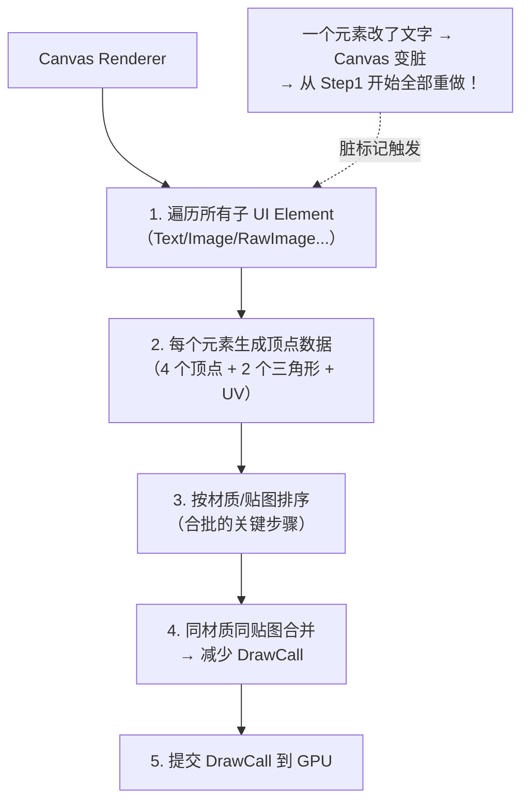
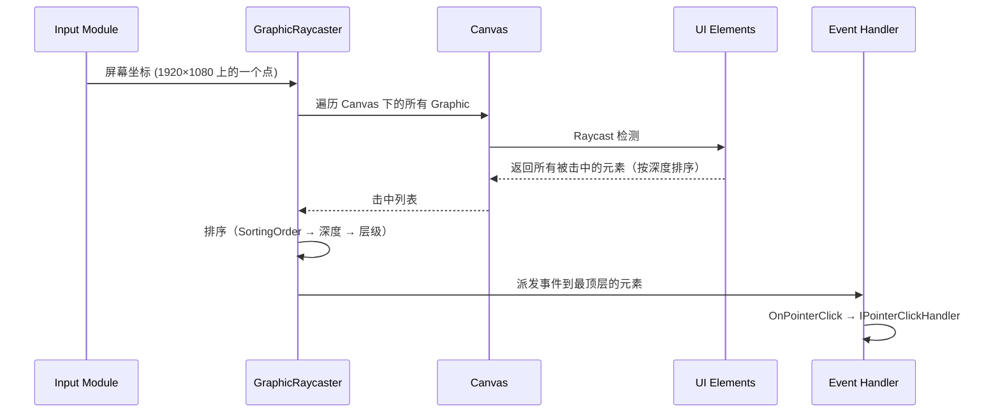

# 第三章 UI 系统设计：从 Canvas 到 DrawCall

> **一句话理解**：UI 的性能瓶颈不在 GPU 渲染本身——UI 面数很低。瓶颈在 CPU 端：Canvas 的**网格重建**和**DrawCall 数量**。理解 Canvas 的合批机制，你就理解了 UI 性能的 90%。

> 📋 前置知识：设计模式 Ch5（组合模式——UI 树的结构基础）、设计模式 Ch6（MVVM——UI 架构）、Ch2 场景管理（UI 和场景共用组合模式）

---

## 3.1 概念直觉 —— UI 为什么慢

### 直觉悖论

UI 都是简单的矩形——一个按钮最多 4 个顶点，一个 Text 最多几百个顶点。相比 3D 模型动辄几千面，UI 的面数可以忽略不计。那为什么 Profiler 里 UI 经常是性能杀手？

```
3D 渲染流程（简化）：
物体 → Mesh（固定，不变）→ DrawCall → GPU 渲染

UI 渲染流程（简化）：
Canvas → 遍历所有子 UI 元素 → 生成 Mesh → 合批 → DrawCall → GPU 渲染
          ↑                              ↑
          每次有 UI 元素变化              ↑
          整棵 Canvas 树重建 Mesh         合批条件苛刻
```

**两个根本原因**：

1. **Canvas 的脏标记机制**：一个 UI 元素的值变了（改了文字、换了图片颜色）→ Canvas 标记为脏 → 下次渲染时**重建整个 Canvas 的 Mesh**。不是重建一个元素，是重建整棵树。

2. **DrawCall 合批条件苛刻**：UI 的合批要求元素使用**同一个材质、同一张贴图**，且渲染顺序连续。任何一个条件不满足 → 多一个 DrawCall。而 3D 渲染有 SRP Batcher 等更灵活的合批机制。

---

## 3.2 Canvas 的渲染流程

### 从 UI 元素到 DrawCall



### Canvas Renderer 的内部机制

```csharp
// Unity 底层（简化版）——Canvas 如何生成 Mesh

public class CanvasRenderer {
    // 每个 Graphic（Image/Text 等走 Unity UI 的元素）都有一个 CanvasRenderer
    // CanvasRenderer 负责把这个 Graphic 转成 Mesh

    // 1. Graphic 提供顶点数据
    //    - 位置（RectTransform 的四个角）
    //    - UV（从图集中取样）
    //    - 颜色（顶点色，用于颜色过渡）
    //    - 切线（法线等 UI 不需要的字段）

    // 2. Canvas 收集所有 CanvasRenderer 的 Mesh
    //    按材质 + 贴图排序
    //    连续的、同材质同贴图的 Mesh → 合并为一个 DrawCall

    // 3. 合并的条件（全部满足才能合批）：
    //    - 同一张贴图（或图集——同张图集的元素视为同一张贴图）
    //    - 同一个 Material 实例
    //    - 渲染顺序连续（中间不能夹杂其他材质）
    //    - 不涉及 Mask 裁切（Mask 会改变 Stencil Buffer，打断合批）

    public void SetMesh(Mesh mesh) { /* ... */ }
    public void SetMaterial(Material material, Texture texture) { /* ... */ }

    // 当 Graphic 的以下属性变化时，CanvasRenderer 标记为脏：
    // - 顶点位置（RectTransform 变化）
    // - 颜色（color 属性变化）
    // - UV（更换贴图或图集位置）
    // - 材质（更换材质）

    // 标记为脏后，下次渲染时重新生成 Mesh → 触发合批重建
}
```

### 什么操作会触发 Canvas 重建

```csharp
// ============ 触发完整 Canvas 重建的操作 ============

// ❌ 改颜色——触发顶点色重算 + 重建
GetComponent<Image>().color = new Color(1, 1, 1, 0.5f);

// ❌ 修改 RectTransform——触发位置重算 + 重建
GetComponent<RectTransform>().sizeDelta = new Vector2(100, 50);

// ❌ 改文字——触发 Text 的 Font Texture 重生成 + 重建
GetComponent<Text>().text = "新文字";

// ❌ 改图片——触发贴图切换，如果新图不在同一图集 → 打断合批
GetComponent<Image>().sprite = newSprite;

// ❌ SetActive(true/false)——触发新增/移除 CanvasRenderer
gameObject.SetActive(false);

// ============ 不触发重建的操作 ============

// ✅ 修改 Transform.position（非 RectTransform）
//    UI 元素的渲染位置由 RectTransform 决定，Transform.position 被忽略

// ✅ 修改材质属性（如 shader 的 float 参数）
//    只要不换 Material 实例，不触发重建
```

> ⚠️ **关键认知**：`Image.color` 的修改代价比你想的大。它不是简单的"改一个属性"——是标记 Canvas 为脏，下次渲染时这个 Image 的顶点数据需要重新生成（顶点色变了）。

---

## 3.3 DrawCall 合批策略

### 图集——合批的基础

```
没有图集：
  Image_A 用贴图 A → DrawCall 1
  Image_B 用贴图 B → DrawCall 2（贴图不同，合批失败）
  Image_C 用贴图 A → DrawCall 3（虽然贴图同 A，但被 B 打断了！）

有图集（所有 UI 元素用同一张图集）：
  Image_A 用图集（UV: 0.1~0.2）
  Image_B 用图集（UV: 0.3~0.4）  ← 同一张贴图！
  Image_C 用图集（UV: 0.5~0.6）  ← 同一张贴图！
  → 3 个元素合并为 1 个 DrawCall
```

**图集的工作原理**：

```
图集是一张"大拼图"：
┌───────────┬───────┬──────┐
│ Button_BG │ Icon1 │Icon2 │
├───────────┼───────┼──────┤
│ Panel_BG  │ Icon3 │Icon4 │
├───────────┴───────┴──────┤
│          Title_BG        │
└──────────────────────────┘

每个 UI 元素的 UV 映射到图集的不同区域
→ 所有元素"使用"的是同一张贴图 → 可以合批
```

**Unity 的 Sprite Atlas**：

```csharp
// 使用 Sprite Atlas（Unity 的图集解决方案）
// 1. Create > 2D > Sprite Atlas
// 2. 把需要的 Sprite 拖入 Objects for Packing
// 3. 运行时自动用图集——不需要改代码

// 手动加载图集
SpriteAtlas atlas = Resources.Load<SpriteAtlas>("UIAtlas");
Sprite sprite = atlas.GetSprite("button_normal");
image.sprite = sprite;
// 这个 sprite 的贴图指向图集 → 和其他用同一个图集的元素可以合批
```

### Canvas 拆分策略

这是 UI 性能优化中最重要的一条：

```csharp
// ============ 单一 Canvas 方案：简单但脆 ============
// 所有 UI 在同一个 Canvas 下
// 优点：合批最好（如果所有元素用同一个图集）
// 缺点：任何元素变化 → 整个 Canvas 重建

// ============ 拆分 Canvas 方案：性能优先 ============
//
// Canvas_Static (静态元素——几乎不变)
//  ├── 背景图
//  ├── 边框装饰
//  └── 静态标题
//
// Canvas_Dynamic (动态元素——频繁变化)
//  ├── 血条（每帧可能变化）
//  ├── 计时器（每秒更新）
//  └── 伤害数字（频繁创建/销毁）
//
// Canvas_ScrollView (滚动区域——独立 Canvas)
//  └── ScrollRect 的内容

// 拆分原则：
// 1. 静态和动态分离——静态 Canvas 几乎永远不重建
// 2. 频繁变化的放独立 Canvas——变化只影响自己的 Canvas
// 3. ScrollRect 独立 Canvas——滚动时只有它在变
```

```csharp
// 实践示例：战斗 HUD
// 
// Canvas_HUD_Background (Static)
//   - 技能栏底框、小地图边框 —— 永远不变
//
// Canvas_HUD_Info (偶尔变)
//   - 玩家名字、等级 —— 升级时才变
//
// Canvas_HUD_Bars (每帧变)
//   - 血条、蓝条、耐力条 —— Update 中更新
//   - 冷却计时文本 —— 每帧更新
//
// Canvas_HUD_DamageNumbers (频繁创建/销毁)
//   - 伤害数字 —— 独立 Canvas，动画结束直接回收
//
// 效果：每帧只有 Canvas_HUD_Bars 和 Canvas_HUD_DamageNumbers 需要重建
//       其他 Canvas 保持睡眠——零重建开销
```

---

## 3.4 事件系统

### 从点击到响应



### GraphicRaycaster 的内部逻辑

```csharp
// Unity 底层（简化版）——射线检测如何工作

public class GraphicRaycaster {
    public List<RaycastResult> Raycast(PointerEventData eventData) {
        List<RaycastResult> results = new List<RaycastResult>();

        // 1. 获取所有 Graphic 组件（Text, Image, RawImage...）
        var graphics = GraphicRegistry.GetGraphicsForCanvas(canvas);

        // 2. 将屏幕坐标转换到 Canvas 的本地坐标
        //    Screen Point → Canvas Local Point（需要处理不同 RenderMode）

        // 3. 对每个 Graphic 做矩形包含检测
        foreach (var graphic in graphics) {
            // 只检测 Raycast Target 为 true 的元素
            if (!graphic.raycastTarget) continue;

            // 深度优先遍历——从顶层往底层检测
            // 检查点是否在 RectTransform 的矩形内
            if (RectTransformUtility.RectangleContainsScreenPoint(
                graphic.rectTransform,
                eventData.position,
                eventCamera)) {

                results.Add(new RaycastResult {
                    gameObject = graphic.gameObject,
                    depth = graphic.depth  // 用于决定谁在最上面
                });
            }
        }

        // 4. 按深度排序——depth 大的在上面
        results.Sort((a, b) => b.depth.CompareTo(a.depth));

        return results;
    }
}
```

### 事件穿透与拦截

```csharp
// 场景：背包面板前面还有一个确认对话框
// 点击"确认"按钮 → 只有按钮响应 → 不会穿透到背包

// 原理：事件系统按 depth 排序，只派发给最顶层命中元素
// 但——如果顶层元素不处理，默认不会向下传递

// 自定义穿透行为：
public class PassThroughPanel : MonoBehaviour, IPointerClickHandler {
    public void OnPointerClick(PointerEventData eventData) {
        // 自己处理完逻辑后，手动传给下一层
        ExecuteEvents.Execute(
            GetNextSiblingGameObject(),
            eventData,
            ExecuteEvents.pointerClickHandler
        );
    }
}
```

---

## 3.5 文本渲染：TextMeshPro 的优势

### 为什么 TMP 优于 Text

```
Unity 原生 Text（位图字体）：
  每个字符 → 一个 Quad → 一个 DrawCall（如果字符不在图集中）
  放缩 → 模糊（因为是位图）
  不同字号 → 需要不同的字体贴图

TextMeshPro（SDF 字体）：
  字体被烘焙为"有符号距离场"纹理（SDF Texture）
  每个字符 → Shader 根据 SDF 值决定渲染形状
  优点：任意放缩不失真、同一个 SDF 贴图支持所有字号、支持渐变/描边/阴影
  缺点：生成 SDF 贴图需要预处理
```

```
SDF 原理（简化）：
  字体轮廓 → 计算每个像素到轮廓的最近距离 → 存为 SDF 贴图
  Shader 渲染时：距离 ≤ 0 → 字体内（渲染），距离 > 0 → 字体外（透明）
  Shader 的 smoothstep 使边缘抗锯齿效果极好
```

```csharp
// TMP 的使用
using TMPro;

public class TMPExample : MonoBehaviour {
    [SerializeField] private TextMeshProUGUI tmpText;

    void Start() {
        // TMP 的文本设置——和原生 Text 类似但功能更多
        tmpText.text = "Hello <color=red>World</color>";  // 富文本
        tmpText.fontSize = 24;      // 不会模糊——SDF 的魔法
        tmpText.fontStyle = FontStyles.Bold | FontStyles.Italic;

        // TMP 的性能优势
        // - 同一字体的所有 TMP 文本共享同一个 Material + 贴图（SDF Atlas）
        // - 不同字号的文本仍然可以合批——因为是同一张贴图
        // - 原生 Text：不同字号 = 不同贴图 = 无法合批
    }
}
```

### TMP 的常见性能问题

```csharp
// ❌ 每帧修改 TMP 文本——触发 Canvas 重建
void Update() {
    tmpText.text = $"HP: {currentHealth}/{maxHealth}";  // 每帧重建
}

// ✅ 只在值实际变化时才更新
private int lastDisplayedHealth = -1;

void Update() {
    int displayHealth = Mathf.CeilToInt(currentHealth);
    if (displayHealth != lastDisplayedHealth) {
        tmpText.SetText("HP: {0}/{1}", displayHealth, maxHealth);
        lastDisplayedHealth = displayHealth;
    }
}

// ✅ 或者——用多个 Text 拆分静态和动态部分
// "HP: " ← 静态 Text（不重建）
// "100"   ← 动态 Text（只在值变化时重建）
```

---

## 3.6 Mask 与 RectMask2D

```csharp
// ============ Mask 组件 ============
// 底层实现：用 Stencil Buffer（模板缓冲区）
// 
// 流程：
// 1. 绘制 Mask 图形到 Stencil Buffer（写入标记）
// 2. 绘制子元素时检查 Stencil Buffer（只有标记区域才绘制）
// 3. 所有子元素绘制完后清除 Stencil Buffer
//
// 代价：
// - 多 1 个 DrawCall（Mask 图形本身）
// - 每个子元素多 1 个 DrawCall（Stencil 检查导致的合批中断）
// - 多层 Mask 嵌套 → DrawCall 指数增长

// ============ RectMask2D 组件 ============
// 底层实现：顶点裁剪（裁掉矩形外的顶点，重新生成边界顶点）
//
// 代价：
// - 修改顶点数据——但仍可以和相邻元素合批（因为材质/贴图不变）
// - 只支持矩形裁剪（Mask 支持任意形状）
// - 性能远优于 Mask

// 选择指南：
// 矩形裁剪（ScrollView、列表）→ RectMask2D
// 异形裁剪（圆形头像、不规则窗口）→ Mask
// 能用 RectMask2D 就别用 Mask
```

---

## 3.7 🎮 完整示例：高性能滚动列表

```csharp
// 背包列表——200 个物品，只渲染可见的 ~15 个
// 这是 UI 性能优化的经典案例

public class InfiniteScrollView : MonoBehaviour {
    [SerializeField] private ScrollRect scrollRect;
    [SerializeField] private RectTransform content;
    [SerializeField] private GameObject itemPrefab;

    // 对象池
    private Queue<ItemSlot> pool = new Queue<ItemSlot>();
    private List<ItemSlot> activeSlots = new List<ItemSlot>();

    // 数据
    private List<ItemData> allItems;  // 200 个物品
    private float itemHeight = 100f;
    private int visibleCount;         // 大约 15 个
    private int firstVisibleIndex;

    void Start() {
        // 计算可见区域内能容纳多少个 item
        visibleCount = Mathf.CeilToInt(scrollRect.viewport.rect.height / itemHeight) + 2;

        // 预创建可见数量 + 2（上下各多一个做缓冲）的对象池
        for (int i = 0; i < visibleCount + 2; i++) {
            var go = Instantiate(itemPrefab, content);
            var slot = go.GetComponent<ItemSlot>();
            go.SetActive(false);
            pool.Enqueue(slot);
        }

        scrollRect.onValueChanged.AddListener(OnScroll);
    }

    void OnScroll(Vector2 normalizedPos) {
        // 根据滚动位置计算第一个可见 item 的索引
        float contentY = content.anchoredPosition.y;
        int newFirstIndex = Mathf.Max(0, Mathf.FloorToInt(contentY / itemHeight));

        if (newFirstIndex != firstVisibleIndex) {
            UpdateVisibleItems(newFirstIndex);
        }
    }

    void UpdateVisibleItems(int newFirst) {
        // 回收不再可见的 items
        var toRecycle = new List<ItemSlot>();

        foreach (var slot in activeSlots) {
            int index = slot.DataIndex;
            if (index < newFirst || index >= newFirst + visibleCount) {
                toRecycle.Add(slot);
            }
        }

        foreach (var slot in toRecycle) {
            slot.gameObject.SetActive(false);
            pool.Enqueue(slot);
            activeSlots.Remove(slot);
        }

        // 显示新的可见 items
        firstVisibleIndex = newFirst;

        for (int i = newFirst; i < newFirst + visibleCount && i < allItems.Count; i++) {
            // 检查这个 index 是否已经在显示
            bool alreadyShowing = false;
            foreach (var slot in activeSlots) {
                if (slot.DataIndex == i) {
                    alreadyShowing = true;
                    break;
                }
            }
            if (alreadyShowing) continue;

            // 从池中取一个 item
            if (pool.Count == 0) {
                // 池子空了——理论上不应该发生（创建时预留了足够数量）
                var go = Instantiate(itemPrefab, content);
                var newSlot = go.GetComponent<ItemSlot>();
                pool.Enqueue(newSlot);
            }

            var itemSlot = pool.Dequeue();
            itemSlot.gameObject.SetActive(true);
            itemSlot.SetData(allItems[i], i);

            // 设置位置（相对于 content 顶部）
            var rt = itemSlot.GetComponent<RectTransform>();
            rt.anchoredPosition = new Vector2(0, -i * itemHeight);

            activeSlots.Add(itemSlot);
        }

        // 调整 content 的总高度（让 Scrollbar 正确反映内容高度）
        var contentRect = content.sizeDelta;
        contentRect.y = allItems.Count * itemHeight;
        content.sizeDelta = contentRect;
    }
}

// 单个 Item 槽位
public class ItemSlot : MonoBehaviour {
    [SerializeField] private Image icon;
    [SerializeField] private TextMeshProUGUI nameText;
    [SerializeField] private TextMeshProUGUI countText;

    public int DataIndex { get; private set; }

    public void SetData(ItemData item, int index) {
        DataIndex = index;
        icon.sprite = item.icon;
        nameText.text = item.name;
        countText.text = item.count > 1 ? item.count.ToString() : "";
    }
}
```

**优化效果对比**：

```
方案 A：为 200 个物品各创建一个 GameObject
  - 200 × ~500 字节/GameObject = 100KB 内存
  - 200 个 CanvasRenderer → Canvas 重建时遍历 200 个元素
  - Canvas 重建耗时：~3ms（200 个 Graphic）

方案 B：只创建可见的 ~15 个 + 对象池复用
  - 15 × ~500 字节 = 7.5KB 内存
  - 15 个 CanvasRenderer
  - Canvas 重建耗时：~0.2ms

节省：内存 92%，重建时间 93%
```

---

## 3.8 MVVM 数据绑定

### 为什么 UI 需要 MVVM

设计模式 Ch6 讲过 MVVM 的理论。现在给一个 Unity 中的工业实现：

```csharp
// ============ BindableProperty：可绑定属性 ============
public class BindableProperty<T> {
    private T value;

    public T Value {
        get => value;
        set {
            if (!EqualityComparer<T>.Default.Equals(this.value, value)) {
                this.value = value;
                OnValueChanged?.Invoke(value);
            }
        }
    }

    public event Action<T> OnValueChanged;

    public BindableProperty(T initialValue = default) {
        value = initialValue;
    }

    // 单向绑定——View 响应 Model 的变化
    public void BindTo(UnityEngine.UI.Text text, Func<T, string> formatter = null) {
        OnValueChanged += (val) => {
            text.text = formatter != null ? formatter(val) : val.ToString();
        };
        // 立即刷新一次
        text.text = formatter != null ? formatter(value) : value?.ToString();
    }

    // 绑定到 TMP Text
    public void BindTo(TMP_Text tmpText, Func<T, string> formatter = null) {
        OnValueChanged += (val) => {
            tmpText.SetText(formatter != null ? formatter(val) : val.ToString());
        };
        tmpText.SetText(formatter != null ? formatter(value) : value?.ToString());
    }

    // 绑定到 Slider
    public void BindTo(Slider slider) where T : IConvertible {
        OnValueChanged += (val) => {
            slider.value = Convert.ToSingle(val);
        };
        slider.value = Convert.ToSingle(value);
    }
}

// ============ ViewModel：Model 和 View 的中介 ============
public class PlayerViewModel {
    // Model 数据
    private PlayerModel model;

    // 暴露给 View 的绑定属性
    public BindableProperty<int> Health { get; } = new BindableProperty<int>(100);
    public BindableProperty<int> MaxHealth { get; } = new BindableProperty<int>(100);
    public BindableProperty<int> Gold { get; } = new BindableProperty<int>(0);
    public BindableProperty<string> PlayerName { get; } = new BindableProperty<string>("");

    // 计算属性——不直接对应 Model 的字段
    public BindableProperty<string> HealthDisplay { get; } = new BindableProperty<string>("100/100");
    public BindableProperty<float> HealthPercent { get; } = new BindableProperty<float>(1.0f);

    public PlayerViewModel(PlayerModel model) {
        this.model = model;

        // 监听 Model 变化 → 更新 ViewModel
        model.OnHealthChanged += (current, max) => {
            Health.Value = current;
            MaxHealth.Value = max;
            HealthDisplay.Value = $"{current}/{max}";
            HealthPercent.Value = (float)current / max;
        };

        model.OnGoldChanged += (gold) => {
            Gold.Value = gold;
        };
    }

    // 主动操作——View 调用，ViewModel 处理逻辑
    public void BuyItem(ItemData item) {
        if (model.Gold >= item.price) {
            model.SpendGold(item.price);
            model.AddItem(item);
        }
    }
}

// ============ View：只负责绑定和显示 ============
public class PlayerHUDView : MonoBehaviour {
    [SerializeField] private TMP_Text healthText;
    [SerializeField] private Slider healthSlider;
    [SerializeField] private TMP_Text goldText;
    [SerializeField] private TMP_Text playerNameText;

    private PlayerViewModel viewModel;

    public void Bind(PlayerViewModel vm) {
        viewModel = vm;

        // 单向绑定——ViewModel 变化 → UI 自动更新
        vm.HealthDisplay.BindTo(healthText);
        vm.HealthPercent.BindTo(healthSlider);
        vm.Gold.BindTo(goldText, val => $"金币: {val}");
        vm.PlayerName.BindTo(playerNameText);

        // 不需要 Update() 轮询——完全事件驱动
    }
}

// ============ 使用 ============
void Start() {
    var model = new PlayerModel();
    var viewModel = new PlayerViewModel(model);

    var hudView = FindObjectOfType<PlayerHUDView>();
    hudView.Bind(viewModel);

    // Model 变化 → ViewModel 自动更新 → View 自动刷新
    model.TakeDamage(30);
    // healthText 显示 "70/100"  ← 自动
    // healthSlider 移到 0.7    ← 自动
    // 不需要任何 Update() 代码
}
```

---

## 3.9 常见坑

### 坑一：所有 UI 放一个 Canvas

```csharp
// ❌ 最常犯的错误——改一个文字，全屏重建
// Canvas 默认把所有子元素合批到一个 Mesh
// 解决方案见 3.3 节 Canvas 拆分策略
```

### 坑二：LayoutGroup 的隐性重建

```csharp
// ❌ 在 LayoutGroup 的子元素上频繁 SetActive
// 每次 SetActive → LayoutGroup 标记为脏 → 重新计算所有子元素位置
void Update() {
    errorMessage.SetActive(hasError);  // 每帧触发布局重建！
}

// ✅ 用 CanvasGroup 控制可见性——不影响布局
[SerializeField] private CanvasGroup errorGroup;

void Start() {
    errorGroup = errorMessage.AddComponent<CanvasGroup>();
}

void Update() {
    errorGroup.alpha = hasError ? 1 : 0;
    errorGroup.interactable = hasError;
    errorGroup.blocksRaycasts = hasError;
    // 不触发 LayoutGroup 重建！
}
```

### 坑三：GraphicRaycaster 在不需要时没关

```csharp
// 非交互 UI（纯装饰）的 raycaster 应该关掉
void Start() {
    // 背景图不需要接收点击——关掉 raycaster
    GetComponent<Image>().raycastTarget = false;
    // 每个不需要交互的 Image/Text 都关 —— 事件系统遍历时跳过它们
}
```

### 坑四：Image.fillAmount 的相对开销

```csharp
// Image.fillAmount 会触发顶点重建——因为 UV 变了
// 每帧更新血条时用 fillAmount → 每帧触发重建

// 对于频率极高的更新（如 Boss 血条），考虑用 Shader 方案：
// 用 Shader Property 控制填充比例 → 不触发顶点重建
```

### 坑五：Canvas 的 Pixel Perfect

```csharp
// ❌ Pixel Perfect 开启后，每个元素的位置都要对齐像素
// 任何位置变化都触发重新对齐 → 额外开销
// 除非是像素风游戏，否则关掉

// Canvas 的 Pixel Perfect：关
```

---

## 3.10 本章回顾

| 概念 | 一句话 | 精度级别 |
|------|--------|---------|
| **Canvas 重建** | 一个元素变 → 整棵树重建 | 性能杀手 |
| **合批条件** | 同材质 + 同贴图 + 连续 | 图集是关键 |
| **Canvas 拆分** | 静态/动态/ScrollRect 分开 | 最重要的一条优化 |
| **Raycaster** | depth 排序 + 矩形检测 | 非交互元素关 raycaster |
| **TextMeshPro** | SDF 渲染——不失真 + 合批友好 | 替换所有原生 Text |
| **RectMask2D** | 顶点裁剪——比 Mask 快 | 优先于 Mask |
| **ScrollRect 优化** | 只渲染可见行 + 对象池 | 列表性能的银弹 |
| **MVVM 绑定** | 数据变 → UI 自动更新 | 消灭轮询和手动刷新 |

> 📖 下一章：[第四章 游戏 AI 基础](./04_game_ai) —— FSM 到行为树到 GOAP，A* 寻路与 NavMesh。UI 系统讲的是**人机交互的界面**，AI 则是**机器与世界的交互**。
