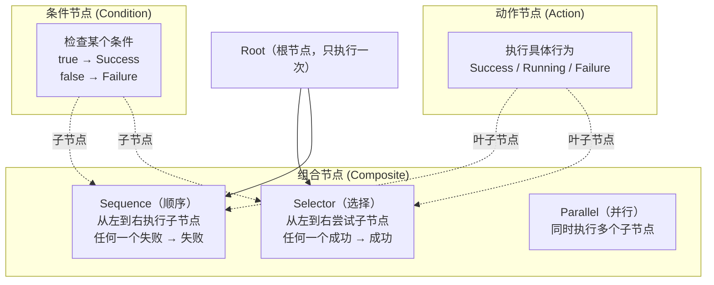
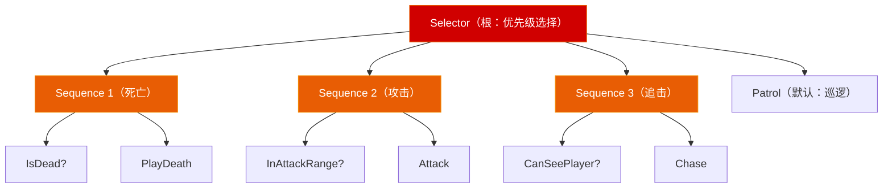

# 第四章 游戏 AI 基础：从 FSM 到行为树到 NavMesh

> **一句话理解**：游戏 AI 不是机器学习，是**决策架构 + 空间感知**。决策架构回答"做什么"，空间感知回答"怎么去"。绝大部分游戏 AI 的行为可以用 FSM、行为树、GOAP 三者之一描述，而移动靠 A* 寻路 + NavMesh。

> 📋 前置知识：设计模式 Ch3（状态机——AI 决策的起点）、设计模式 Ch5（组合模式——行为树的树形结构）、算法 Ch6（A* 寻路——空间感知的基础）

---

## 4.1 概念直觉 —— FSM 的天花板

### 简单的敌人 AI

先看一个简单敌人用 FSM（设计模式 Ch3）的实现：

```csharp
// 三种状态：巡逻 → 追击 → 攻击
public enum EnemyState { Patrol, Chase, Attack, Dead }

public class SimpleEnemyFSM : MonoBehaviour {
    private EnemyState state = EnemyState.Patrol;

    void Update() {
        switch (state) {
        case EnemyState.Patrol:
            PatrolUpdate();
            if (CanSeePlayer()) state = EnemyState.Chase;
            break;
        case EnemyState.Chase:
            ChaseUpdate();
            if (InAttackRange()) state = EnemyState.Attack;
            else if (!CanSeePlayer()) state = EnemyState.Patrol;
            break;
        case EnemyState.Attack:
            AttackUpdate();
            if (!InAttackRange()) state = EnemyState.Chase;
            break;
        case EnemyState.Dead:
            break;
        }
    }
}
```

**3 个状态，能跑。那加需求呢？**

```
策划："加个'警戒'状态——听到脚步声但没看到玩家时，走向声音来源"
      → 加枚举 + 加 case + 加转移条件

策划："Boss 血量低于 30% 进入激怒状态——攻击频率翻倍，追加新技能"
      → 又加枚举 + case + 转移条件

策划："敌人之间需要互相支援——队友受伤时放下当前目标去帮忙"
      → 状态转移图开始像蜘蛛网，每次加状态都要检查 5+ 个转移条件
```

这就是 FSM 的天花板——**状态少时极好，状态爆炸时极糟**。不是说 FSM 不好，而是当条件判断变得复杂、行为之间有优先级关系时，FSM 的扁平枚举结构会失控。

---

## 4.2 行为树 (Behavior Tree)

### 核心思想

行为树用**树形结构**替代 FSM 的**扁平枚举**。每个节点代表一个决策或动作，**从根节点每帧向下遍历**，根据条件选择执行路径。

```
行为树的哲学：
  "不是"我从巡逻切换到追击"（状态转移思维）
  而是"我每帧都在想——现在最应该做什么？"（优先级思维）

对比：
  FSM： 当前状态 → 转移条件 → 新状态（关心流程）
  行为树：从根开始 → 检查优先级 → 执行最高优先级动作（关心优先级）
```

### 四种节点



### 手写行为树框架

```csharp
// ============ 核心枚举与基类 ============
public enum NodeState {
    Success,   // 成功完成
    Failure,   // 执行失败
    Running    // 还在执行中（持续型动作）
}

public abstract class BTNode {
    public abstract NodeState Evaluate();
}

// ============ Selector（选择节点）——"或"逻辑 ============
// 从左到右尝试子节点，任意一个成功 → 成功
// 用途：表示优先级——"先尝试这个，不行再那个"
public class Selector : BTNode {
    private List<BTNode> children = new List<BTNode>();

    public Selector(params BTNode[] children) {
        this.children.AddRange(children);
    }

    public override NodeState Evaluate() {
        foreach (var child in children) {
            switch (child.Evaluate()) {
                case NodeState.Running:
                    return NodeState.Running;  // 还在执行，保留当前选择
                case NodeState.Success:
                    return NodeState.Success;  // 完成，不再尝试后续
                case NodeState.Failure:
                    continue;                  // 失败，尝试下一个
            }
        }
        return NodeState.Failure;  // 全失败了
    }
}

// ============ Sequence（顺序节点）——"与"逻辑 ============
// 从左到右逐个执行子节点，任何一个失败 → 失败
// 用途：表示步骤——"先检查条件，再执行动作"
public class Sequence : BTNode {
    private List<BTNode> children = new List<BTNode>();

    public Sequence(params BTNode[] children) {
        this.children.AddRange(children);
    }

    public override NodeState Evaluate() {
        foreach (var child in children) {
            switch (child.Evaluate()) {
                case NodeState.Running:
                    return NodeState.Running;  // 还在执行，保留进度
                case NodeState.Failure:
                    return NodeState.Failure;  // 某一步失败，整个序列失败
                case NodeState.Success:
                    continue;                  // 成功，继续下一步
            }
        }
        return NodeState.Success;
    }
}

// ============ 条件节点：检查是否能看到玩家 ============
public class CanSeePlayerCondition : BTNode {
    private Transform enemy;
    private float viewRange;
    private float viewAngle;

    public CanSeePlayerCondition(Transform enemy, float range, float angle) {
        this.enemy = enemy;
        this.viewRange = range;
        this.viewAngle = angle;
    }

    public override NodeState Evaluate() {
        Vector3 toPlayer = Player.Instance.transform.position - enemy.position;
        float distance = toPlayer.magnitude;

        // 距离检查
        if (distance > viewRange) return NodeState.Failure;

        // 角度检查（FOV）
        float angle = Vector3.Angle(enemy.forward, toPlayer);
        if (angle > viewAngle / 2f) return NodeState.Failure;

        // 射线检查——有没有墙挡住
        if (Physics.Raycast(enemy.position, toPlayer.normalized, distance, obstacleMask)) {
            return NodeState.Failure;
        }

        return NodeState.Success;
    }
}

// ============ 条件节点：检查是否在攻击范围内 ============
public class InAttackRangeCondition : BTNode {
    private Transform enemy;
    private float attackRange;

    public override NodeState Evaluate() {
        float dist = Vector3.Distance(enemy.position, Player.Instance.transform.position);
        return dist <= attackRange ? NodeState.Success : NodeState.Failure;
    }
}

// ============ 动作节点：追击玩家 ============
public class ChaseAction : BTNode {
    private NavMeshAgent agent;
    private Transform enemy;

    public override NodeState Evaluate() {
        agent.SetDestination(Player.Instance.transform.position);

        if (agent.pathPending) return NodeState.Running;
        if (agent.remainingDistance > agent.stoppingDistance) return NodeState.Running;

        return NodeState.Success;
    }
}

// ============ 动作节点：攻击 ============
public class AttackAction : BTNode {
    private EnemyCombat combat;
    private float attackCooldown;
    private float lastAttackTime;

    public override NodeState Evaluate() {
        if (Time.time - lastAttackTime < attackCooldown) {
            return NodeState.Running;  // 冷却中，不算完成
        }

        combat.PerformAttack();
        lastAttackTime = Time.time;
        return NodeState.Success;
    }
}

// ============ 动作节点：巡逻 ============
public class PatrolAction : BTNode {
    private NavMeshAgent agent;
    private Transform[] waypoints;
    private int currentWaypoint;

    public override NodeState Evaluate() {
        if (waypoints.Length == 0) return NodeState.Failure;

        agent.SetDestination(waypoints[currentWaypoint].position);

        if (agent.remainingDistance < 0.5f) {
            currentWaypoint = (currentWaypoint + 1) % waypoints.Length;
        }

        return NodeState.Running;  // 巡逻永远不会"完成"——持续进行
    }
}

// ============ 组装行为树 ============
public class EnemyBT : MonoBehaviour {
    private BTNode root;

    void Start() {
        // 行为树结构（Mermaid 图见下节）
        root = new Selector(
            // 优先级 1：死亡（不执行任何行为）
            new Sequence(
                new IsDeadCondition(),
                new PlayDeathAction()
            ),
            // 优先级 2：处于攻击范围内 → 攻击
            new Sequence(
                new InAttackRangeCondition(transform, 2f),
                new AttackAction()
            ),
            // 优先级 3：能看到玩家 → 追击
            new Sequence(
                new CanSeePlayerCondition(transform, 15f, 120f),
                new ChaseAction()
            ),
            // 优先级 4：听到声音 → 前往调查
            new Sequence(
                new HeardSoundCondition(),
                new InvestigateAction()
            ),
            // 优先级 5：默认行为 → 巡逻
            new PatrolAction()
        );
    }

    void Update() {
        root.Evaluate();  // 每帧从根节点开始遍历
    }
}
```

### 行为树的结构图



**关键理解**：每帧从 Selector 根节点开始，Selector 按优先级——先检查死亡条件（最高优先级），再检查攻击，再检查追击，最后巡逻（默认，兜底）。这与 FSM 的"从一个状态转移到另一个状态"思维完全不同。

### 行为树 vs FSM

| | FSM | 行为树 |
|------|-----|------|
| 结构 | 扁平枚举 + switch | 树形结构 |
| 加新行为 | 加状态 + 在多个转移中加条件 | 新建分支，插到对应优先级位置 |
| 优先级表达 | 隐式（写在转移条件中） | **显式**（Selector 从左到右 = 从高到低优先级） |
| 复用 | 差——每个状态是独立类 | 好——条件/动作节点可复用 |
| 可视化 | 状态转移图 | 树形图（更直观） |
| 适合 | 固定流程（3C、UI 流程） | 复杂决策（AI、Boss 多阶段） |
| 调试 | 观察当前状态 | 跟踪整条决策路径 |

---

## 4.3 GOAP —— 目标导向行动规划

### 什么时候行为树也不够了

```
行为树适用：优先级关系明确的决策
  "先检查能否攻击 → 再检查能否追击 → 最后巡逻"

行为树不适用：需要动态规划动作顺序
  "怎么把一个角色从当前位置导航到目标位置，
   中间需要拿钥匙、开锁、搬开障碍物、吸引守卫注意、翻窗户……"
  → 动作的排列不是预定义的，而是需要AI自己规划的
```

**GOAP 的核心**：不给 AI 写"先做什么后做什么"，而是：

1. 定义**动作**（每个动作有前提条件和效果）
2. 给出一个**目标**
3. AI 自己搜索出一条动作序列，从当前状态达到目标

```csharp
// GOAP 数据结构（简化示意）
public class GOAPAction {
    public string name;                        // "拿钥匙"
    public Dictionary<string, bool> preconditions;  // { "hasKey": false, "nearKey": true }
    public Dictionary<string, bool> effects;         // { "hasKey": true, "nearKey": false }
    public float cost;                         // 动作的开销（时间/风险）
}

public class GOAPPlanner {
    public List<GOAPAction> Plan(
        Dictionary<string, bool> currentState,
        Dictionary<string, bool> goal,
        List<GOAPAction> availableActions
    ) {
        // 用 A* 在"状态空间"中搜索——
        // 每个节点 = 一个世界状态
        // 每条边 = 一个动作
        // 启发函数 = 当前状态与目标状态的差异数

        // 返回：从 currentState 到达 goal 的最短动作序列
        // 例如：[走到钥匙旁 → 捡起钥匙 → 走到门前 → 开门 → 进入]
    }
}
```

**FSM/行为树/GOAP 的选型指南**：

| | FSM | 行为树 | GOAP |
|------|-----|------|------|
| 行为数量 | < 10 | 10 - 50 | 50+ |
| 行为之间的关系 | 简单转移 | 优先级明确 | 需要动态规划顺序 |
| 调试难度 | 低 | 中 | 高（AI 自己选的动作，不好追踪） |
| 游戏实例 | 平台角色 AI | Halo、DAO、大部分 3A | F.E.A.R.、Shadow of Mordor |

---

## 4.4 导航与寻路

### A* 算法——工程版

算法 Ch6 已经讲透了 A* 原理。这里给一个可直接在 Unity 中用的非 Unity NavMesh 版本：

```csharp
public class AStarPathfinding {
    private Grid2D grid;

    public List<Vector2Int> FindPath(Vector2Int start, Vector2Int goal) {
        // Open Set —— 用优先队列（二叉堆）
        var openSet = new PriorityQueue<Vector2Int>();
        var cameFrom = new Dictionary<Vector2Int, Vector2Int>();
        var gScore = new Dictionary<Vector2Int, float>();
        var fScore = new Dictionary<Vector2Int, float>();

        openSet.Enqueue(start, 0);
        gScore[start] = 0;
        fScore[start] = Heuristic(start, goal);

        while (openSet.Count > 0) {
            var current = openSet.Dequeue();

            if (current == goal) {
                return ReconstructPath(cameFrom, current);
            }

            foreach (var neighbor in grid.GetNeighbors(current)) {
                if (!grid.IsWalkable(neighbor)) continue;

                float tentativeG = gScore[current] + grid.GetCost(current, neighbor);

                if (!gScore.ContainsKey(neighbor) || tentativeG < gScore[neighbor]) {
                    cameFrom[neighbor] = current;
                    gScore[neighbor] = tentativeG;
                    fScore[neighbor] = tentativeG + Heuristic(neighbor, goal);

                    if (!openSet.Contains(neighbor)) {
                        openSet.Enqueue(neighbor, fScore[neighbor]);
                    }
                }
            }
        }

        return null;  // 无路径
    }

    private float Heuristic(Vector2Int a, Vector2Int b) {
        // 八方向移动用对角线距离，四方向用曼哈顿
        int dx = Mathf.Abs(a.x - b.x);
        int dy = Mathf.Abs(a.y - b.y);
        return dx + dy + (Mathf.Sqrt2 - 2) * Mathf.Min(dx, dy);
    }
}
```

### Unity 的 NavMesh 系统

```csharp
// Unity 的 NavMesh 分三层：
//
// NavMesh Surface（数据层）：
//   定义"哪些区域可以走"——从场景几何烘焙而来
//   - Agent Radius：Agent 的半径（决定多窄的通道能走）
//   - Agent Height：Agent 的身高（决定多矮的洞能钻）
//   - Max Slope：最大爬坡角度
//   - Step Height：能跨过的最大台阶高度
//
// NavMesh Agent（行为层）：
//   SetDestination(target) → 自动走最短路径
//   - Speed / Angular Speed / Acceleration / Stopping Distance
//   - Obstacle Avoidance（多 Agent 互相避开）
//   - Auto Repath（路径被阻断后自动重新寻路）
//
// NavMesh Obstacle（动态障碍物层）：
//   动态物体（移动的箱子、可破坏的门）可以标记为 Obstacle
//   - Carve：切掉 NavMesh 上的区域——Agent 会绕开

public class NavMeshEnemy : MonoBehaviour {
    private NavMeshAgent agent;
    private Transform player;

    void Start() {
        agent = GetComponent<NavMeshAgent>();
        player = Player.Instance.transform;
    }

    void Update() {
        // 不要每帧 SetDestination！只在目标变化时设置
        if (ShouldUpdatePath()) {
            agent.SetDestination(player.position);
        }
    }

    private Vector3 lastTargetPos;
    private float repathThreshold = 1.0f;

    bool ShouldUpdatePath() {
        // 目标移动超过 1 米才重新寻路
        if (Vector3.Distance(player.position, lastTargetPos) > repathThreshold) {
            lastTargetPos = player.position;
            return true;
        }
        return false;
    }
}
```

### NavMesh 的性能要点

```csharp
// 1. 逐帧 SetDestination —— 最常见的性能浪费
//    SetDestination 触发新的寻路请求（CPU 密集）
//    解决方案：目标不动不复算，目标移动超过阈值才重算

// 2. 大量 Agent 同时寻路 —— 帧率尖刺
//    解决方案：帧分摊——每帧只让 N 个 Agent 寻路
public class NavMeshScheduler : MonoBehaviour {
    private Queue<NavMeshAgent> pendingAgents = new Queue<NavMeshAgent>();
    private int maxPathsPerFrame = 5;  // 每帧最多计算 5 条路径

    void Update() {
        int count = 0;
        while (count < maxPathsPerFrame && pendingAgents.Count > 0) {
            var agent = pendingAgents.Dequeue();
            agent.SetDestination(agent.destination);  // 执行之前排队的寻路请求
            count++;
        }
    }

    public void RequestPath(NavMeshAgent agent, Vector3 destination) {
        agent.destination = destination;  // 存储目标
        pendingAgents.Enqueue(agent);      // 排队等待计算
    }
}

// 3. NavMeshObstacle.Carve —— 动态切 NavMesh 开销大
//    Carve 操作会重建周围的 NavMesh 数据
//    解决方案：只有大型障碍物才开 Carve，小物体用 Agent 之间的 Avoidance
```

---

## 4.5 🎮 完整示例：巡逻/追击/攻击 AI

```csharp
// 一个可直接挂载到 Enemy 上的完整 AI——使用行为树 + NavMesh
[RequireComponent(typeof(NavMeshAgent))]
public class EnemyAI : MonoBehaviour {
    [Header("感知")]
    [SerializeField] private float viewRange = 15f;
    [SerializeField] private float viewAngle = 120f;
    [SerializeField] private float attackRange = 2f;
    [SerializeField] private LayerMask obstacleMask;

    [Header("巡逻")]
    [SerializeField] private Transform[] waypoints;
    [SerializeField] private float waitAtWaypoint = 1f;

    [Header("战斗")]
    [SerializeField] private float attackDamage = 10f;
    [SerializeField] private float attackCooldown = 1.5f;

    // 内部状态（注意：这不是 FSM 的状态——这是"当前在做什么"，不是"决策逻辑"）
    private NavMeshAgent agent;
    private Animator animator;
    private float lastAttackTime;
    private int currentWaypointIndex;
    private float waitTimer;
    private Player player;

    void Start() {
        agent = GetComponent<NavMeshAgent>();
        animator = GetComponent<Animator>();
        player = Player.Instance;
    }

    void Update() {
        // ===== 相当于行为树的 Selector 根节点 =====

        // 优先级 1：死亡
        if (GetComponent<HealthComponent>().IsDead) {
            return;  // 什么都不做
        }

        // 优先级 2：在攻击范围内 → 攻击
        float distToPlayer = Vector3.Distance(transform.position, player.transform.position);
        if (distToPlayer <= attackRange && CanSeePlayer()) {
            Attack();
            return;
        }

        // 优先级 3：能看到玩家 → 追击
        if (CanSeePlayer()) {
            Chase();
            return;
        }

        // 优先级 4：默认 → 巡逻
        Patrol();
    }

    bool CanSeePlayer() {
        Vector3 toPlayer = player.transform.position - transform.position;
        float distance = toPlayer.magnitude;

        if (distance > viewRange) return false;

        float angle = Vector3.Angle(transform.forward, toPlayer.normalized);
        if (angle > viewAngle / 2f) return false;

        // 射线检测——确保没被墙挡住
        if (Physics.Raycast(transform.position + Vector3.up,
            toPlayer.normalized, distance, obstacleMask)) {
            return false;
        }

        return true;
    }

    void Attack() {
        agent.isStopped = true; // 停止移动

        Vector3 dirToPlayer = (player.transform.position - transform.position).normalized;
        dirToPlayer.y = 0;
        transform.forward = dirToPlayer; // 朝向玩家

        animator.SetBool("IsMoving", false);

        if (Time.time - lastAttackTime >= attackCooldown) {
            animator.SetTrigger("Attack");
            player.TakeDamage(attackDamage);
            lastAttackTime = Time.time;
        }
    }

    void Chase() {
        agent.isStopped = false;
        animator.SetBool("IsMoving", true);

        // 目标移动超过 1 米才重新寻路
        if (Vector3.Distance(agent.destination, player.transform.position) > 1f) {
            agent.SetDestination(player.transform.position);
        }
    }

    void Patrol() {
        agent.isStopped = false;
        animator.SetBool("IsMoving", true);

        if (waypoints.Length == 0) return;

        if (agent.remainingDistance < 0.5f && !agent.pathPending) {
            // 到达路点——等待
            waitTimer += Time.deltaTime;
            if (waitTimer >= waitAtWaypoint) {
                currentWaypointIndex = (currentWaypointIndex + 1) % waypoints.Length;
                agent.SetDestination(waypoints[currentWaypointIndex].position);
                waitTimer = 0f;
            }
        }
    }

    // 在 Scene 视图可视化
    void OnDrawGizmosSelected() {
        // 视野范围
        Gizmos.color = Color.yellow;
        Gizmos.DrawWireSphere(transform.position, viewRange);

        // 视野角度（简化：两条线）
        Vector3 leftBoundary = Quaternion.Euler(0, -viewAngle / 2f, 0) * transform.forward;
        Vector3 rightBoundary = Quaternion.Euler(0, viewAngle / 2f, 0) * transform.forward;
        Gizmos.DrawRay(transform.position, leftBoundary * viewRange);
        Gizmos.DrawRay(transform.position, rightBoundary * viewRange);

        // 攻击范围
        Gizmos.color = Color.red;
        Gizmos.DrawWireSphere(transform.position, attackRange);
    }
}
```

### AI 模块化重构

上面的代码把所有逻辑放在一个类里，适合原型。正式项目应该解耦：

```csharp
// 模块化方案
public class ModularEnemyAI : MonoBehaviour {
    // 各子系统独立，通过事件通信
    [SerializeField] private PerceptionSystem perception;   // 感知：我看到什么
    [SerializeField] private DecisionSystem decision;         // 决策：我应该做什么
    [SerializeField] private MovementSystem movement;         // 移动：怎么去
    [SerializeField] private CombatSystem combat;             // 战斗：怎么打

    void Update() {
        var worldState = perception.Evaluate();     // 感知输出：{ sawPlayer, heardSound, ... }
        var action = decision.Decide(worldState);   // 决策输出：Attack / Chase / Patrol
        ExecuteAction(action);                      // 执行：调对应的子系统
    }
}

// 感知系统——单一职责
public class PerceptionSystem {
    public WorldState Evaluate() {
        return new WorldState {
            canSeePlayer = CheckVisibility(),
            canHearPlayer = CheckHearing(),
            distanceToPlayer = Vector3.Distance(transform.position, player.position),
            isUnderAttack = health.LastDamageTime < Time.time - 3f
        };
    }
}
```

---

## 4.6 群集行为

```csharp
// 群集行为的三个基本规则：
// 1. 分离 (Separation)：不撞到身边同伴
// 2. 对齐 (Alignment)：方向和速度与同伴保持一致
// 3. 聚集 (Cohesion)：向群体中心靠拢

public class Boid : MonoBehaviour {
    [SerializeField] private float separationWeight = 1.5f;
    [SerializeField] private float alignmentWeight = 1.0f;
    [SerializeField] private float cohesionWeight = 1.0f;
    [SerializeField] private float neighborRadius = 5f;

    private Vector3 velocity;
    private float speed = 5f;

    void Update() {
        var neighbors = Physics.OverlapSphere(transform.position, neighborRadius, boidLayer);

        Vector3 separation = Vector3.zero;
        Vector3 alignment = Vector3.zero;
        Vector3 cohesion = Vector3.zero;
        int count = 0;

        foreach (var neighbor in neighbors) {
            if (neighbor.gameObject == gameObject) continue;

            var other = neighbor.GetComponent<Boid>();

            // 分离——离得越近，排斥力越大
            Vector3 away = transform.position - neighbor.transform.position;
            float dist = away.magnitude;
            if (dist > 0.001f) {
                separation += away.normalized / dist;  // 距离越近权重越大
            }

            alignment += other.velocity;
            cohesion += neighbor.transform.position;
            count++;
        }

        if (count > 0) {
            // 归一化并加权
            separation = separation.normalized * separationWeight;
            alignment = (alignment / count).normalized * alignmentWeight;
            cohesion = ((cohesion / count - transform.position).normalized) * cohesionWeight;
        }

        // 合成速度
        velocity += (separation + alignment + cohesion) * Time.deltaTime;
        velocity = Vector3.ClampMagnitude(velocity, speed);

        transform.position += velocity * Time.deltaTime;
        transform.forward = velocity.normalized;
    }
}
```

---

## 4.7 常见坑

### 坑一：NavMeshAgent.SetDestination 每帧调用

```csharp
// ❌ 每帧寻路——即使目标没动
void Update() {
    agent.SetDestination(player.position);  // 60 次寻路请求/秒！
}

// ✅ 只在目标移动超过阈值时重算
void Update() {
    float dist = Vector3.Distance(player.position, lastTargetPos);
    if (dist > repathThreshold) {
        agent.SetDestination(player.position);
        lastTargetPos = player.position;
    }
}
```

### 坑二：用 remainingDistance 判断到达

```csharp
// ❌ pathPending 时 remainingDistance 可能为 0
if (agent.remainingDistance < 0.5f) { /* 到达 */ }

// ✅ 先确认路径计算完毕
if (!agent.pathPending && agent.remainingDistance < 0.5f) { /* 到达 */ }
```

### 坑三：AI 同一帧全在寻路

```csharp
// ❌ 100 个敌人同时 SetDestination → 帧率尖刺
foreach (var enemy in enemies) {
    enemy.SetDestination(player.position);  // 同一帧 100 次寻路
}

// ✅ 帧分摊（见 4.4 节的 NavMeshScheduler）
```

### 坑四：NavMesh 数据在运行时修改

```csharp
// ❌ 认为修改场景物体会自动更新 NavMesh
// NavMesh 是离线烘焙的静态数据——除非用 NavMesh Components 的运行时烘焙

// ✅ 动态障碍物用 NavMeshObstacle 组件
GetComponent<NavMeshObstacle>().enabled = true;  // 开启障碍
```

### 坑五：行为树条件做重计算

```csharp
// ❌ CanSeePlayer 做射线检测——每帧每个敌人一条射线
// 50 个敌人 × 60 FPS = 3000 次射线/秒——积少成多

// ✅ 条件节点用"频率控制"——高代价条件每 0.2 秒检查一次
public class ThrottledCondition : BTNode {
    private float checkInterval = 0.2f;
    private float lastCheckTime;
    private NodeState cachedResult;

    public override NodeState Evaluate() {
        if (Time.time - lastCheckTime > checkInterval) {
            cachedResult = DoExpensiveCheck();  // 射线检测等重操作
            lastCheckTime = Time.time;
        }
        return cachedResult;
    }
}
```

---

## 4.8 本章回顾

| 概念 | 一句话 | 选型指南 |
|------|--------|---------|
| **FSM** | 状态决定行为，转移条件明确 | 行为 < 10 个，流程固定 |
| **行为树** | 每帧从根遍历，按优先级选择 | 行为 10-50 个，优先级关系明确 |
| **GOAP** | AI 自己规划动作序列 | 行为 50+，需要动态组合 |
| **A\*** | 在网格上找最短路径 | 2D 或体素 3D |
| **NavMesh** | 从场景几何烘焙可行走表面 | 3D 场景——Unity 首选方案 |
| **帧分摊** | 大量 Agent 寻路分到多帧 | Agent > 20 时必须考虑 |
| **群集行为** | 分离 + 对齐 + 聚集 | 鸟群、鱼群、僵尸群 |

> 📖 下一章：[第五章 性能优化总论](./05_performance_optimization) —— CPU Profiling、GPU Profiling、DrawCall 优化、内存管理、GC 消除。AI 讲的是智能，性能优化的目标是**让所有这些智能能在 16ms 内运行完**。
