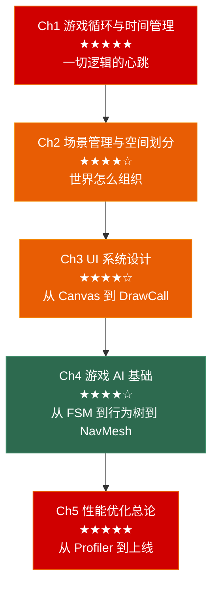

# 游戏引擎与客户端基础：从游戏循环到性能优化

> 面向**游戏客户端开发岗**的引擎基础笔记系列。每章覆盖：**原理图解 → Unity 实现 → 性能分析 → 🎮 完整示例 → 常见坑**。
>
> 本系列定位：不是 Unity 入门教程，而是**引擎原理 + 面试考点 + 工业实践**的桥梁。假设你已会写 `MonoBehaviour`，目标是让你理解背后的运作机制和性能取舍。

---

## 系列全景



---

## 与已学系列的衔接

| 前置知识 | 在引擎系列中的应用 |
|---------|-------------------|
| 设计模式 Ch3（状态机） | Ch4 的 FSM → 行为树演化 |
| 设计模式 Ch3（观察者） | Ch3 UI 事件系统、Ch4 AI 感知系统 |
| 设计模式 Ch5（组合模式） | Ch2 场景树、Ch3 UI 树 |
| 设计模式 Ch5（享元模式） | Ch3 图集合批、Ch5 DrawCall 优化 |
| 设计模式 Ch2（对象池） | Ch5 内存优化——对象池在 Unity 中的实现 |
| 算法 Ch1（排序与缓存） | Ch5 CPU 缓存与内存访问模式 |
| 算法 Ch6（A* 寻路） | Ch4 NavMesh 与 A* 的工程实现 |
| OS Ch4（CPU 缓存） | Ch5 缓存友好的数据结构设计 |
| OS Ch2（同步互斥） | Ch1 渲染线程与逻辑线程同步 |
| C++ Ch7（并发） | Ch5 Job System 与多线程渲染 |

---

## 章节导航

| 章节 | 主题 | 面试权重 |
|------|------|---------|
| [**Ch1**](./01_game_loop/) | 游戏循环与时间管理 | ★★★★★ |
| [**Ch2**](./02_scene_management/) | 场景管理与空间划分 | ★★★★☆ |
| [**Ch3**](./03_ui_system/) | UI 系统设计 | ★★★★☆ |
| [**Ch4**](./04_game_ai/) | 游戏 AI 基础 | ★★★★☆ |
| [**Ch5**](./05_performance_optimization/) | 性能优化总论 | ★★★★★ |

---

### 📗 第一章 游戏循环与时间管理

> 游戏引擎的心脏。如果游戏循环写错了，整个游戏的行为都不对。

**核心问题**：
- 游戏为什么需要循环？和普通应用的 `while(true)` 有什么不同？
- `Update` / `FixedUpdate` / `LateUpdate` 分别在什么时候执行？为什么物理要放 `FixedUpdate`？
- `deltaTime` 的本质是什么？`Time.timeScale = 0` 时谁还在跑？

**原理图解**：
- 游戏循环的三种模型（固定步长 / 可变步长 / 半固定步长）的 Mermaid 时序图
- Unity 主循环的完整帧分解（输入 → Update → 动画 → 物理 → 渲染）
- 渲染线程与逻辑线程的并行流水线

**Unity 实现**：
- `MonoBehaviour` 生命周期全景：`Awake → OnEnable → Start → Update → LateUpdate → OnDisable → OnDestroy`
- `FixedUpdate` 的内部实现——物理步长与最大迭代次数
- `Time.deltaTime` / `Time.fixedDeltaTime` / `Time.unscaledDeltaTime` / `Time.timeScale` 的精确语义
- `WaitForEndOfFrame` / `WaitForFixedUpdate` / `WaitForSeconds` 的协程时序

**性能分析**：
- `Update` 中大量 `GameObject.Find` 为什么每帧 2ms？
- `FixedUpdate` 中直接读 `Input.GetKey` 为什么是错的？
- 帧率从 60 掉到 30 时，`Update` 逻辑为什么可能出 Bug？

**🎮 完整示例**：
- 实现一个不受帧率影响的跳跃（用 `deltaTime` 正确积分速度与位移）
- 实现一个确定性 replay 系统（固定步长 + 帧号驱动）

**常见坑**：
1. `Update` 中直接操作物理（应该用 `FixedUpdate`）
2. `FixedUpdate` 中读 `Input`（可能丢输入）
3. 协程中 `while(true)` 没有 yield——卡死主循环
4. `Time.deltaTime` 过大导致隧道效应（快速物体穿墙）

**与面试的关系**：
- "Unity 的 Update 和 FixedUpdate 有什么区别？什么时候用哪个？"
- "如何实现一个确定性帧同步？"
- "deltaTime 的作用是什么？不加 deltaTime 会发生什么？"

---

### 📘 第二章 场景管理与空间划分

> 一个开放世界有 10000 个物体——不可能每帧遍历全部。场景管理的本质是：**只处理当前需要处理的**。

**核心问题**：
- 场景树和渲染树是什么关系？为什么 Unity 的 `Transform` 层级会影响渲染顺序？
- 四叉树、八叉树、BSP、空间哈希各自适合什么场景？
- LOD 是怎么工作的？切换距离怎么定？

**原理图解**：
- 场景树（Scene Graph）的层级结构与变换矩阵传递
- 四叉树/八叉树的空间递归划分示意图
- BSP 的原理——为什么 Doom 用它做可见性判断
- 空间哈希——用网格代替树的平面方案

**Unity 实现**：
- `Transform` 层级：世界变换 = 父变换 × 局部变换（矩阵乘法链）
- `SceneManager.LoadScene` 的同步/异步加载
- `Additive` 场景加载——大世界的流式加载方案
- Unity 的 `FrustumCulling` 是怎么工作的（视锥体六个面的检测）
- `OcclusionCulling` 的烘焙原理——静态遮挡数据

**性能分析**：
- 深层 Transform 层级对性能的影响（每层一次矩阵乘法，100 层 = 100 次乘法）
- 频繁 `SetParent` 的代价（Transform 变化标记 + 子节点递归通知）
- `ContentSizeFitter` + `LayoutGroup` 每帧重计算的开销

**🎮 完整示例**：
- 手写一个四叉树——用于 2D 游戏的碰撞检测粗筛
- 用 `Additive` 场景实现一个无缝大世界的分段加载

**常见坑**：
1. 场景物体太多时 `FindObjectsOfType` 遍历全场景（O(n) 每帧）
2. `Instantiate` 在运行时大量调用（应该用对象池，设计模式 Ch2）
3. 场景树太深——一个 UI Prefab 里套了 20 层空节点
4. LOD 切换距离没根据屏幕分辨率调整（手机上 LOD0 永远用不到）

**与面试的关系**：
- "大世界怎么做流式加载？"
- "怎么判断一个物体是否需要渲染？"
- "四叉树和八叉树的区别？什么时候用哪个？"

---

### 📙 第三章 UI 系统设计

> UI 在 Profiler 里经常是性能杀手——不是因为 UI 逻辑本身重，而是因为它容易在不知不觉中变重。

**核心问题**：
- Canvas 的重建机制：一个 Text 改一个字为什么整张 Canvas 重建？
- DrawCall 怎么合批？为什么一个图集能减少 DrawCall？
- UI 事件系统（Raycaster）怎么判断"点到了哪个按钮"？

**原理图解**：
- Canvas 的渲染流程：CanvasRenderer → Mesh 生成 → 合批 → DrawCall
- DrawCall 合批的条件（同材质、同贴图、无遮挡）
- 事件系统的射线检测流程（GraphicRaycaster → RectTransform 矩形检测）
- 从 MVC 到 MVVM 的 UI 架构演化（衔接设计模式 Ch6）

**Unity 实现**：
- `Canvas` 的三种渲染模式（Overlay / Camera / World Space）及其性能差异
- `RectTransform` 的锚点（Anchor）系统——从屏幕自适应到布局计算
- `LayoutGroup` 的布局重建触发条件
- `ContentSizeFitter` + `VerticalLayoutGroup` 的自动高度计算
- `Button` / `Toggle` / `Slider` / `ScrollRect` 的交互原理
- `GraphicRaycaster` 的事件穿透处理

**性能分析**：
- Canvas 的 `Batch` 条件：一个图集 = 一个 DrawCall
- **Canvas 拆分策略**：为什么要拆多个 Canvas？（一个元素变了只重建所在 Canvas）
- 同一个 Canvas 下：静态元素放一起，动态元素单独 Canvas
- `TextMeshPro` vs `Text`——为什么 TMP 用 SDF 渲染比位图字体快
- `Mask` 和 `RectMask2D` 的性能差异（Mask 多一个 DrawCall，RectMask2D 只裁剪顶点）
- `Image.fillAmount` vs `Image.color`——修改哪个会导致重建？

**🎮 完整示例**：
- 背包系统：200 个物品的滚动列表——用 `ScrollRect` + 对象池（只渲染可见的 ~15 个）
- 伤害数字：用独立 Canvas + 动画（不与主 UI Canvas 合批，避免每帧全量重建）
- MVVM 数据绑定：实现一个 `BindableProperty<T>`（衔接设计模式 Ch6）

**常见坑**：
1. 所有 UI 放一个 Canvas——改一个文字全屏重建
2. `LayoutGroup` 里每帧 `SetActive` 子元素——触发布局重建
3. UI 的 `Update` 中每帧读 `GetComponent<Text>()`——缓存引用
4. Canvas 的 `Pixel Perfect` 开启后每帧重算
5. 多层 `Mask` 嵌套——每个 Mask 多一个 DrawCall
6. 图集里放了一个 2048×2048 的纹理——图集过大占用带宽

**与面试的关系**：
- "UI 怎么合批？什么条件会打断合批？"
- "为什么 UI 要拆多个 Canvas？"
- "ScrollRect 怎么优化——列表有几万个 Item？"

---

### 📕 第四章 游戏 AI 基础

> AI 不是机器学习——游戏 AI 的核心是**决策架构**和**空间感知**。

**核心问题**：
- FSM、行为树、GOAP 三种 AI 架构分别适合什么类型的游戏？
- A* 在工程上怎么落地的？NavMesh 是怎么生成的？
- AI 之间怎么协作？（分队战术、群集行为）

**原理图解**：
- FSM → 分层 FSM → 行为树 → GOAP 的演化路线图
- 行为树的四种节点（Sequence / Selector / Condition / Action）的执行流
- A* 算法的可视化——开放列表、闭合列表、启发函数
- NavMesh 的生成过程——体素化 → 区域划分 → 轮廓提取 → 多边形网格

**Unity 实现**：
- Unity NavMesh 系统：`NavMeshAgent` / `NavMeshObstacle` / `OffMeshLink`
- `NavMeshAgent.SetDestination` 的内部流程（寻路 → 路径平滑 → 移动）
- `NavMeshSurface` 的烘焙参数（Agent Radius / Step Height / Max Slope）
- 行为树的 Unity 实现：手写一个精简的行为树框架（Node / Sequence / Selector / Condition / Action）
- `Animator` 与 AI 的配合——用动画状态机驱动 AI 行为

**性能分析**：
- A* 的 Open Set 用什么数据结构？二叉堆 vs 配对堆
- 多个 AI Agent 同时寻路的优化——路径缓存、帧分摊
- NavMesh 的动态障碍物代价——`NavMeshObstacle` 的 Carve 操作开销
- 行为树每帧从根遍历的性能考量

**🎮 完整示例**：
- 手写行为树框架 + 一个巡逻/追击/攻击的敌人 AI
- A* 算法的 Unity 实现——在方格地图上寻路（与算法 Ch6 呼应，给出工程版）
- NavMesh + 行为树的 Boss AI——三阶段行为切换

**常见坑**：
1. `NavMeshAgent.SetDestination` 在 `Update` 中每帧调用（只有目标移动时才需要重新设置）
2. `NavMeshAgent.remainingDistance` 在 `Update` 中判断到达（应该用 `pathPending` 和 `hasPath`）
3. 行为树条件节点做复杂计算——每帧 Tick 都会执行
4. NavMesh 数据在运行时修改（烘焙数据是静态的，动态障碍用 `NavMeshObstacle`）
5. AI Agent 数量多时所有 AI 同一帧做寻路——分摊到多帧

**与面试的关系**：
- "设计一个敌人的 AI——从巡逻到追击到攻击的状态转移"
- "行为树和状态机有什么区别？什么时候用哪个？"
- "NavMesh 的原理是什么？怎么处理动态障碍物？"

---

### 📓 第五章 性能优化总论

> 优化不是"让游戏更快"，而是**让瓶颈消失**。优化的第一原则：**先 Profile，再优化**。

**核心问题**：
- CPU 瓶颈在哪？GPU 瓶颈在哪？内存瓶颈在哪？
- DrawCall 为什么是性能杀手？怎么减少？
- 对象池、LOD、剔除、合批、Instancing——各自解决什么问题？

**原理图解**：
- 一帧的 CPU/GPU 时间线——渲染线程与逻辑线程的并行与等待
- DrawCall 的代价拆解：CPU 提交 → GPU 状态切换 → GPU 绘制
- 内存的三种分配方式（Stack / Heap / Native）及其性能特征
- 缓存未命中的代价——L1/L2/L3/Main Memory 的延迟金字塔

**Unity 实现**：
- **Unity Profiler** 的使用：CPU Usage / GPU Usage / Memory / Rendering 各模块怎么看
- **Frame Debugger**：逐 DrawCall 回放——看合批条件、看哪个物体打断了合批
- **Memory Profiler**：托管堆 vs 原生内存，找到泄漏
- **Static Batching** vs **Dynamic Batching** vs **GPU Instancing** vs **SRP Batcher**
- **LOD Group** 的配置与自动切换距离
- **Occlusion Culling** 的烘焙与运行时查询
- **Addressables** 资源管理与异步加载
- **Object Pool** 在 Unity 中的实现（衔接设计模式 Ch2）

**优化策略分类**：

| 类别 | 优化手段 | 解决的问题 | 预期收益 |
|------|---------|-----------|---------|
| CPU | 对象池、缓存引用、减少 `Update` | GC Alloc、虚函数开销 | 1-3ms |
| GPU | 合批、Instancing、减少 Overdraw | DrawCall 数量、填充率 | 2-5ms |
| 内存 | 纹理压缩、音频压缩、资源卸载 | 内存占用、碎片 | 50-200MB |
| 带宽 | LOD、MipMap、剔除 | GPU 数据传输 | 10-30% |

**🎮 完整示例**：
- Profiler 实战：从一个"不知道为什么卡"的 Demo 开始，逐帧定位瓶颈 → 修复合批 → 修复 GC Alloc → 修复 Overdraw
- DrawCall 优化实战：20 个不同材质的方块 → 合并图集 → Static Batching → 从 20 DrawCall 降到 1
- 对象池 + 预实例化：弹幕游戏从每帧 200 次 `Instantiate` → 0 次分配

**常见坑**：
1. 不 Profile 就优化——优化了不慢的东西
2. `GameObject.Find` / `FindObjectOfType` 在 `Update` 中调用
3. `String` 拼接和 `ToString` 在每帧执行
4. `GetComponent<T>()` 在 `Update` 中调用——应该 `Awake` 时缓存
5. Resources 文件夹过大——所有资源不管用不用都打进包
6. Canvas 的 `GraphicRaycaster` 在不需要时没关
7. Inspector 中的属性在每帧序列化/反序列化（`OnValidate`）

**优化清单（上线前必查）**：

```
□ Profiler 无 > 1ms 的单帧尖刺
□ GC Alloc 每帧 < 1KB
□ DrawCall 总数 < 200（移动端 < 100）
□ 所有 Instantiate 替换为对象池
□ 纹理全部压缩（ASTC/ETC2）
□ 所有 Update 中的 GetComponent / Find 已缓存
□ 静态物体已标记 Static Batching
□ UI Canvas 已按更新频率拆分
□ LOD Group 已配置
□ Occlusion Culling 已烘焙
```

**与面试的关系**：
- "游戏卡顿了，你怎么排查？"
- "DrawCall 是什么？怎么减少？"
- "Static Batching 和 GPU Instancing 的区别？"
- "GC 是怎么产生的？怎么减少 GC Alloc？"

---

## 系列特色

| 特色 | 说明 |
|------|------|
| **原理先行** | 每个主题先讲引擎底层原理（不只是"Unity 怎么用"） |
| **性能视角** | 每个设计决策都附带性能分析——这是面试和工作的核心差异 |
| **完整示例** | 每章至少 1 个从零到一的完整实现 |
| **常见坑** | 每章末尾的"踩坑列表"——来自真实项目经验 |
| **面试挂钩** | 每章标注了对应的面试高频问题 |
| **系列串联** | 跨章节引用设计模式/算法/OS/C++ 的前置知识 |

---

## 推荐阅读路线

```
Ch1 游戏循环（必读，理解引擎的心跳）
  → Ch5 性能优化（★★★★★ 先建立性能直觉，后续章节才能理解为什么这样设计）
    → Ch2 场景管理（空间划分的本质是为了性能）
      → Ch3 UI 系统（UI 的性能陷阱最多）
        → Ch4 AI 基础（相对独立，可最后读）
```

> Ch5 放第二位的理由是：**先理解"什么慢、为什么慢"，再学其他模块时才能理解设计取舍**。

---

> 📖 本系列全部文章均采用 CC BY-NC-SA 4.0 协议发布。
