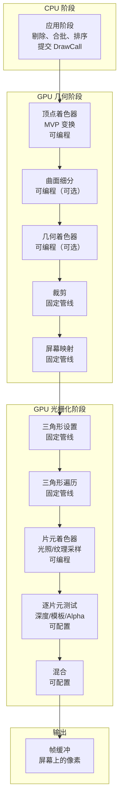
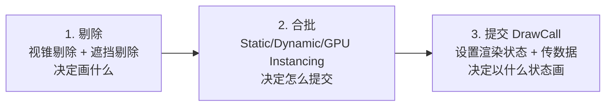

# 第一章 渲染管线与 MVP 变换

> **一句话理解**：渲染管线就是把"3D 场景 + 摄像机"变成"屏幕上 200 万个像素点"的流水线。MVP 变换是这条流水线上最核心的三次矩阵乘法——理解它们，你就理解了 3D 渲染的一半。

> 📋 前置知识：引擎 Ch1（渲染在一帧中的位置）、C++ Ch3（虚函数——理解图形 API 的抽象设计）

---

## 1.1 概念直觉 —— Why & What

### 一次 DrawCall 的旅程

当你调用 `Graphics.DrawMesh()` 或 Unity 为你提交一个 DrawCall 时，发生了什么？

```
GameObject（场景中的一个敌人模型）
  → CPU 判断"这个敌人看得见吗？"（视锥剔除、遮挡剔除）
    → CPU 设置渲染状态，提交 DrawCall
      → GPU 对模型的 5000 个顶点逐个运行你写的 Vertex Shader
        → GPU 把三角形"拍扁"到屏幕上（MVP 变换）
          → GPU 判断每个三角形的哪些像素被覆盖（光栅化）
            → GPU 对每个被覆盖的像素运行你写的 Fragment Shader
              → GPU 判断这个像素应该画还是丢弃（深度/模板测试）
                → 最终颜色写入屏幕缓冲区

这就是渲染管线。每一步都是一个阶段，有些你可以控制（Shader），有些是固定的。
```

### 渲染管线全景



**关键认知**：渲染管线分两大类阶段——

| 阶段类型 | 你能做什么 | 你不能做什么 |
|---------|-----------|------------|
| **可编程**（Vertex/Fragment Shader） | 写 Shader 代码控制行为 | 改管线顺序 |
| **固定管线**（裁剪/光栅化/深度测试） | 调整参数（开启/关闭、比较函数） | 改底层算法 |
| **可配置**（混合模式/深度测试） | 选择混合因子、比较函数 | — |

---

## 1.2 应用阶段 —— CPU 的工作

这是渲染管线唯一运行在 CPU 上的阶段。每帧一次，为 GPU 准备数据。

### 三个阶段



**剔除**：

```
场景有 10000 个物体，摄像机只看得到 ~200 个。
CPU 需要判断每个物体是否在视野内（视锥剔除），
是否被挡住了（遮挡剔除），
太远了是否可以不画（距离剔除）。

目的：减少 DrawCall 数量。
```

**合批**：

```
如果不合批：200 个物体 × 各自材质 = 200 次 DrawCall
合批后：同材质物体合并 → 50 次 DrawCall

每次 DrawCall = CPU 向 GPU 发送一次"请用这个状态画这堆顶点"的请求
DrawCall 数量的影响在 Ch6 深入讨论
```

**提交 DrawCall**：

```cpp
// 伪代码——CPU 提交 DrawCall 做了什么
void SubmitDrawCall(Mesh* mesh, Material* material, Matrix4x4 worldMatrix) {
    // 1. 设置渲染状态（Shader、混合模式、深度测试模式……）
    Graphics::SetShader(material->shader);
    Graphics::SetBlendMode(material->blendMode);
    Graphics::SetDepthTest(material->depthTest);

    // 2. 传数据（顶点缓冲、索引缓冲、常量缓冲）
    Graphics::SetVertexBuffer(mesh->vertices);
    Graphics::SetIndexBuffer(mesh->indices);
    Graphics::SetConstantBuffer("WorldMatrix", worldMatrix);
    Graphics::SetConstantBuffer("MainTexture", material->texture);

    // 3. 真正提交——GPU 开始工作
    Graphics::DrawIndexed(mesh->indexCount);

    // 这个函数调用本身很快，但状态切换和数据传输有隐形成本
    // ——这就是为什么 DrawCall 多会慢
}
```

---

## 1.3 几何阶段 —— 从顶点到屏幕坐标

### 顶点着色器 —— 入口点

每个顶点运行一次。核心任务：**MVP 变换**。

```hlsl
// 最精简的顶点着色器——只做 MVP 变换
struct VertexInput {
    float3 position : POSITION;   // 模型空间坐标
    float3 normal   : NORMAL;
    float2 uv       : TEXCOORD0;
};

struct VertexOutput {
    float4 position : SV_POSITION;  // 裁剪空间坐标（必须输出）
    float3 worldPos : TEXCOORD0;   // 传给片元着色器
    float3 normal   : TEXCOORD1;
    float2 uv       : TEXCOORD2;
};

VertexOutput MainVS(VertexInput input) {
    VertexOutput output;

    // 模型空间 → 世界空间
    float4 worldPos = mul(UNITY_MATRIX_M, float4(input.position, 1.0));
    // 世界空间 → 观察空间
    float4 viewPos = mul(UNITY_MATRIX_V, worldPos);
    // 观察空间 → 裁剪空间
    float4 clipPos = mul(UNITY_MATRIX_P, viewPos);

    output.position = clipPos;           // GPU 后续会自动做透视除法 + 视口变换
    output.worldPos = worldPos.xyz;      // 片元着色器需要世界坐标做光照
    output.normal = mul((float3x3)UNITY_MATRIX_M, input.normal);
    output.uv = input.uv;

    return output;
}

// 或者直接用 Unity 的合并矩阵：
// output.position = UnityObjectToClipPos(input.position);
// 内部 = mul(UNITY_MATRIX_VP, mul(UNITY_MATRIX_M, float4(input.position, 1.0)))
```

### 可选的几何处理

顶点着色器之后，有三个可选阶段：

```
曲面细分 (Tessellation)：
  将三角形细分为更多小三角形——用于地形细节、水面波纹
  "一个远处的三角形变成 1 个像素 → 近处同一个三角形变成 100 个像素"
  动态细分：远处粗、近处细——比固定 LOD 更平滑

几何着色器 (Geometry Shader)：
  输入一个图元（点/线/三角形），输出 0 到多个图元
  用途：生成草叶、毛发、粒子扩展为 Billboard Quad
  注意：移动端性能差，移动管线通常不用

裁剪 (Clipping)：
  去掉视锥体外的顶点——固定管线，自动完成
  部分在视锥体内的三角形会被切出新的顶点
```

### 屏幕映射

```
裁剪后的顶点从裁剪空间转换到屏幕坐标：

裁剪空间 (x∈[-w,w], y∈[-w,w], z∈[-w,w])
  ↓ 透视除法（除以 w）
NDC (x∈[-1,1], y∈[-1,1], z∈[0,1] 或 [-1,1] 取决于 API)
  ↓ 视口变换
屏幕坐标 (x∈[0,width], y∈[0,height])

关键：透视除法是硬件自动完成的——你只需要输出裁剪坐标，GPU 做剩下的事。
这也是为什么 vertex shader 输出的 position 是 float4——w 分量用于透视除法。
```

---

## 1.4 光栅化阶段 —— 从三角形到像素

### 三角形设置 + 遍历

```
三角形设置：
  三个顶点 → 三条边 → 计算边的微分（用于后续的逐像素插值）

三角形遍历：
  扫描三角形覆盖了哪些像素 → 生成"片元"(Fragment)

片元 = "可能成为像素的候选者"
  每个片元携带着从顶点插值来的数据（颜色、UV、法线、世界坐标等）
  一个片元不一定最终成为像素——可能在后续测试中被丢弃
```

### 片元着色器

每个片元运行一次。核心任务：**计算颜色**。

```hlsl
// 最精简的片元着色器——纹理采样
float4 MainFS(VertexOutput input) : SV_TARGET {
    // 1. 采样纹理
    float4 texColor = SAMPLE_TEXTURE2D(_MainTex, sampler_MainTex, input.uv);

    // 2. 简单的漫反射光照
    float3 normal = normalize(input.normal);
    float3 lightDir = normalize(_WorldSpaceLightPos0.xyz);
    float NdotL = max(0, dot(normal, lightDir));
    float3 diffuse = texColor.rgb * _LightColor0.rgb * NdotL;

    // 3. 环境光
    float3 ambient = texColor.rgb * 0.1;

    return float4(diffuse + ambient, texColor.a);
}
```

> 💡 **面试要点**：「片元着色器是渲染管线的性能瓶颈。它运行在 GPU 的最深层流水线上，每个像素都要跑。这也是为什么延迟渲染（Ch6）把光照计算推迟到屏幕空间——只对最终可见的片元做光照。」

### 逐片元测试

```
片元到像素的最后一道关卡——按顺序执行：

1. 像素所有权测试 (Pixel Ownership Test)
   "这个像素是不是被另一个窗口挡住了？" → 系统级，和渲染无关

2. 裁剪测试 (Scissor Test)
   "这个像素在裁剪矩形内吗？" → UI 的 ScrollRect 遮罩底层实现

3. 模板测试 (Stencil Test)
   "模板缓冲区的这个位置是 0 还是 1？" → UI Mask 组件、镜面反射区域标记

4. 深度测试 (Depth Test)
   "这个片元的深度比之前画的更近吗？" → 决定前后遮挡关系

   配置：ZWrite On/Off, ZTest Less/Greater/Always/Equal
   不透明物体：ZWrite On, ZTest Less（近的覆盖远的）
   天空盒：ZWrite Off, ZTest Always（画在最远，不写深度）

5. Alpha 测试
   "这个片元的透明度足够高吗？" → 低于阈值直接丢弃（clip 操作）

6. 混合 (Blending)
   "新颜色和屏幕上已有的颜色怎么叠加？"
   
   常见混合模式：
   - Alpha Blend:  result = src * srcAlpha + dst * (1 - srcAlpha)  ← 半透明
   - Additive:    result = src + dst                                ← 粒子/光效
   - Multiply:    result = src * dst                                ← 暗角效果
```

### Early-Z

现代 GPU 的一个关键优化：

```
传统流程：
  顶点着色器 → 光栅化 → 片元着色器（计算颜色）→ 深度测试 → 发现被挡住了 → 丢弃
  注：片元着色器的计算白费了！

Early-Z 优化：
  顶点着色器 → 光栅化 → 深度测试（在片元着色器之前！）→ 被挡住了 → 直接丢弃
  注：省掉了片元着色器的开销！

Early-Z 前提：片元着色器不能修改深度值（不能有 clip()、不能手动写 SV_DEPTH）
最大化 Early-Z：不透明物体从前到后渲染（近的物体先画写深度 → 远的物体 Early-Z 丢弃）
```

---

## 1.5 MVP 变换详解

这是图形学面试中最重要的数学理解。MVP 三个矩阵各解决一个问题：

```
为什么要三个矩阵而不是一个？

Model  Matrix: 模型空间 → 世界空间    "这个物体在哪里？朝向哪？多大？"
View   Matrix: 世界空间 → 观察空间    "从摄像机看过去，物体在什么位置？"
Proj   Matrix: 观察空间 → 裁剪空间    "透视效果：远处的物体如何变小？"

分开三个矩阵的理由：
  - Model 每个物体不同（物体A在左边，物体B在右边）
  - View 每帧可能变（摄像机移动了）
  - Proj 基本不变（除非切换透视/正交）
  
  如果合成一个大矩阵 = 物体移动一下就要重新算所有物体的大矩阵 → 不划算
```

### Model Matrix —— 模型到世界

```cpp
// Model Matrix = Translate × Rotate × Scale（TRS 顺序）
// 作用：把模型空间坐标 → 世界空间坐标

// 模型空间：假设模型以自己的中心为原点
// 世界空间：统一的世界坐标系

// 例：模型空间中，角色的鼻子在 (0, 0.8, 1.0)
//     角色在世界中的位置是 (10, 0, 5)，朝向正东，缩放 1.5 倍
//     → 鼻子的世界坐标 = Model × (0, 0.8, 1.0, 1)
//     ≈ (11.5, 1.2, 5, 1)

Matrix4x4 ModelMatrix(Vector3 pos, Quaternion rot, Vector3 scale) {
    Matrix4x4 S = Matrix4x4::Scale(scale);    // 先缩放
    Matrix4x4 R = Matrix4x4::Rotate(rot);    // 再旋转
    Matrix4x4 T = Matrix4x4::Translate(pos); // 最后平移

    return T * R * S;  // 矩阵乘法从右到左：先S后R后T
    // 为什么这个顺序？因为缩放和旋转是绕模型中心做的，
    // 如果先平移再旋转——模型会绕着世界原点公转，不是自转
}
```

### View Matrix —— 世界到观察

```cpp
// View Matrix 用摄像机的位置和朝向构建
// 本质：把整个世界"搬到"摄像机为原点的坐标系

// 摄像机在世界中的位置 = eye (10, 5, -10)
// 摄像机看向的点       = target (0, 0, 0)
// 摄像机的上方向       = up (0, 1, 0)

Matrix4x4 ViewMatrix(Vector3 eye, Vector3 target, Vector3 up) {
    // 摄像机的前方向（看向 target）
    Vector3 forward = (target - eye).Normalized();

    // 摄像机的右方向
    Vector3 right = Cross(forward, up).Normalized();

    // 摄像机的上方向（重新计算——保证正交）
    Vector3 upRecalc = Cross(right, forward);

    // 观察矩阵 = 旋转（世界轴 → 摄像机轴）× 平移（世界原点 → 摄像机位置）
    Matrix4x4 rot = Matrix4x4(
        right.x,    upRecalc.x,    -forward.x,    0,
        right.y,    upRecalc.y,    -forward.y,    0,
        right.z,    upRecalc.z,    -forward.z,    0,
        0,          0,             0,             1
    );

    Matrix4x4 trans = Matrix4x4(
        1, 0, 0, -eye.x,
        0, 1, 0, -eye.y,
        0, 0, 1, -eye.z,
        0, 0, 0, 1
    );

    return rot * trans;  // 先平移再旋转（先移到原点，再转方向）

    // Unity: UNITY_MATRIX_V = ViewMatrix(cameraPos, cameraTarget, cameraUp)
}
```

### Projection Matrix —— 观察到裁剪

```cpp
// 透视投影：模拟人眼——近大远小
// 正交投影：没有透视——UI/小地图/工程软件

// ============ 透视投影 ============
Matrix4x4 PerspectiveProj(float fovY, float aspect, float near, float far) {
    // fovY: 垂直方向视野角度（弧度）
    // aspect: 宽 / 高
    // near/far: 近远裁剪面

    float tanHalfFov = tan(fovY / 2.0f);

    Matrix4x4 m;
    m[0, 0] = 1.0f / (aspect * tanHalfFov);  // x 缩放
    m[1, 1] = 1.0f / tanHalfFov;             // y 缩放
    m[2, 2] = -(far + near) / (far - near);  // z 缩放 + 取反（右手系→左手系）
    m[2, 3] = -1.0f;                          // 透视除法：w = -z（观察空间的 z）
    m[3, 2] = -(2.0f * far * near) / (far - near);  // z 偏移
    m[3, 3] = 0.0f;

    return m;
}

// 关键理解：
// m[2, 3] = -1  → 输出的 w 分量 = -viewZ（观察空间的深度）
// 透视除法时：clipPos.xyz / clipPos.w = clipPos.xyz / (-viewZ)
// 所以远处的物体（viewZ 的绝对值大）→ 除以一个大数 → 屏幕坐标变小 → 近大远小

// ============ 正交投影 ============
Matrix4x4 OrthoProj(float left, float right, float bottom, float top,
                     float near, float far) {
    Matrix4x4 m;
    m[0, 0] = 2.0f / (right - left);           // x 映射到 [-1, 1]
    m[1, 1] = 2.0f / (top - bottom);           // y 映射到 [-1, 1]
    m[2, 2] = -2.0f / (far - near);            // z 映射到 [-1, 1]
    m[0, 3] = -(right + left) / (right - left);
    m[1, 3] = -(top + bottom) / (top - bottom);
    m[2, 3] = -(far + near) / (far - near);
    m[3, 3] = 1.0f;

    return m;
}
// 正交投影的 w 分量恒为 1——透视除法不起作用——没有近大远小
```

### 透视除法和 NDC

```
MVP 变换的完整链条：

Model Space (局部坐标，如模型文件中定义的顶点)
    ↓ × Model Matrix
World Space (世界统一坐标)
    ↓ × View Matrix
View Space (摄像机为原点，Z轴指向观察方向)
    ↓ × Projection Matrix
Clip Space (裁剪空间，x,y,z ∈ [-w, w])
    ↓ 透视除法 (÷ w)  ← 硬件自动完成
NDC (Normalized Device Coordinates, x,y,z ∈ [-1, 1])
    ↓ 视口变换 (× 屏幕宽高 + 偏移)
Screen Space (屏幕像素坐标)

面试关键：
  1. 透视除法是不可编程的——硬件自动完成
  2. Shader 的输出是 Clip Space 坐标（SV_POSITION 语义）
  3. NDC 中，z ∈ [0, 1]（D3D/Vulkan/Metal）或 [-1, 1]（OpenGL）
  4. 视口变换也是固定管线——你设置 viewport，GPU 自动映射
```

---

## 1.6 🎮 游戏实战：三个坐标转换应用

### 世界坐标 → 屏幕坐标（头顶血条）

```csharp
// 把 3D 世界位置映射到 2D UI 位置——最常见的使用场景
public class WorldToScreenUI : MonoBehaviour {
    [SerializeField] private RectTransform healthBarUI;
    [SerializeField] private Transform worldTarget;  // 角色的头顶位置

    void LateUpdate() {
        // Unity 已经帮你做了 MVP + 视口变换——直接拿到屏幕坐标
        Vector3 screenPos = Camera.main.WorldToScreenPoint(worldTarget.position);

        // screenPos.z > 0 表示在摄像机前方（屏幕坐标有效）
        if (screenPos.z > 0) {
            healthBarUI.position = screenPos;
            healthBarUI.gameObject.SetActive(true);
        } else {
            healthBarUI.gameObject.SetActive(false);  // 在摄像机后方——隐藏
        }
    }
}

// Unity 内部实现（简化）：
// Vector3 WorldToScreenPoint(Vector3 worldPos) {
//     Matrix4x4 vp = projectionMatrix * worldToCameraMatrix;
//     Vector4 clipPos = vp * new Vector4(worldPos.x, worldPos.y, worldPos.z, 1);
//
//     // 透视除法
//     float invW = 1.0f / clipPos.w;
//     Vector3 ndc = new Vector3(clipPos.x * invW, clipPos.y * invW, clipPos.z * invW);
//
//     // 视口变换
//     return new Vector3(
//         (ndc.x + 1) * 0.5f * Screen.width,
//         (ndc.y + 1) * 0.5f * Screen.height,
//         ndc.z  // 0~1，近平面到远平面
//     );
// }
```

### 从屏幕点击反推世界射线（鼠标选物体）

```csharp
// 点击屏幕 → 推出一条从摄像机射出的世界空间射线
// 面试常问："怎么实现鼠标点击选中 3D 物体？"

Ray ScreenPointToRay(Vector2 screenPoint) {
    // 1. 屏幕坐标 → NDC
    Vector3 ndc = new Vector3(
        screenPoint.x / Screen.width * 2.0f - 1.0f,
        screenPoint.y / Screen.height * 2.0f - 1.0f,
        0.0f  // 近平面
    );

    // 2. NDC → 裁剪空间（逆视口变换 + 逆投影变换）
    //    近平面上的点：clipNear = inverse(ProjectionMatrix) * (ndc, -1, 1)
    //    远平面上的点：clipFar  = inverse(ProjectionMatrix) * (ndc,  1, 1)

    // 3. 裁剪空间 → 世界空间（逆观察变换）
    //    worldNear = inverse(ViewMatrix) * (clipNear / clipNear.w)
    //    worldFar  = inverse(ViewMatrix) * (clipFar  / clipFar.w)

    // 4. 射线 = worldNear → worldFar
    // return Ray(worldNear, (worldFar - worldNear).Normalized);

    // Unity 已封装：Camera.main.ScreenPointToRay(screenPoint)
}
```

---

## 1.7 常见面试题

### Q1："描述渲染管线的各个阶段"

```
面试口述模板：

"渲染管线分为三大阶段。

第一是应用阶段，跑在 CPU 上，负责剔除、合批、排序，最后提交 DrawCall。

第二是几何阶段，跑在 GPU 上——
顶点着色器做 MVP 变换，每个顶点运行一次；
可选地经过曲面细分和几何着色器；
最后硬件裁剪掉视野外的三角形，映射到屏幕坐标。

第三是光栅化阶段——
三角形被转化为片元，片元着色器对每个片元计算颜色；
然后经过深度测试、模板测试、Alpha 测试和混合；
最终写入帧缓冲，显示在屏幕上。

关键点：只有顶点着色器和片元着色器是可编程的（现代管线也包括可选的曲面细分和几何着色器），
其余阶段是固定管线。片元着色器通常是性能瓶颈，因为每个像素都要跑。"
```

### Q2："MVP 三个矩阵的作用？为什么不能合并为一个？"

```
"Model Matrix 把模型从模型空间变换到世界空间——每个物体不同。
View Matrix 把世界空间变换到观察空间——摄像机决定，每帧可能变。
Projection Matrix 把观察空间变换到裁剪空间——投影方式决定，基本不变。

三个分开的理由：如果合为一个，任何一个变化（比如物体移动）
都要重新计算整个合成矩阵——三个矩阵的更新频率不同。
Model 最频繁（每个物体每帧都可能变），View 其次（摄像机动），Proj 最少变。
分开维护更高效。

计算顺序必须是 M→V→P——先摆好物体（模型→世界），
再从摄像机角度看（世界→观察），最后投影（观察→裁剪）。"
```

### Q3："顶点着色器和片元着色器的区别？为什么不能合为一个？"

```
"顶点着色器每顶点运行一次（一个模型 5000 面 ≈ 15000 次），
片元着色器每像素运行一次（屏幕 1920×1080 ≈ 200 万次）。

数量级差两个数量级。

分开的理由：在两者之间，GPU 做了光栅化——确定哪些像素被三角形覆盖。
如果把光照计算也放在顶点着色器——只计算顶点位置的光照，
然后插值到三角形内部的像素——效果会很差（高光位置完全错误）。
片元着色器对每个像素独立计算光照，才能得到正确的高光和法线贴图效果。"
```

---

## 1.8 本章回顾

| 概念 | 一句话 |
|------|--------|
| **应用阶段** | CPU 做剔除、合批、提交 DrawCall——决定"画什么" |
| **顶点着色器** | 每个顶点运行一次——主要做 MVP 变换 |
| **光栅化** | 三角形 → 片元——GPU 固定管线 |
| **片元着色器** | 每个片元运行一次——计算颜色、采样纹理、光照 |
| **深度测试** | 决定前后遮挡——ZWrite/ZTest 可配置 |
| **混合** | 新旧颜色怎么叠加——半透明/叠加/正片叠底 |
| **Model 矩阵** | 模型空间 → 世界空间——物体在哪 |
| **View 矩阵** | 世界空间 → 观察空间——摄像机怎么看 |
| **Projection 矩阵** | 观察空间 → 裁剪空间——透视/正交 |
| **透视除法** | 硬件自动 ÷ w——实现近大远小 |

> 📖 下一章：[第二章 纹理与采样](./02_texture_and_sampling) —— MipMap、各向异性过滤、纹理压缩格式。渲染管线告诉你三角形怎么变成像素，纹理告诉你怎么给每个像素"上色"。
