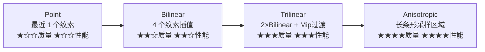

# 第二章 纹理与采样

> **一句话理解**：纹理不只是"贴图"——每一次纹理采样都是 GPU 向显存发起的一次读取请求。当屏幕上一个像素对应纹理上几个到几百个纹素时，如何高效、正确地采样，决定了画面质量和性能。

> 📋 前置知识：Ch1（渲染管线——纹理采样在片元着色器中执行）、引擎 Ch5（纹理压缩的内存优化视角）

---

## 2.1 概念直觉 —— 纹理采样的本质

### 一个像素 vs 一块纹理

```
屏幕上的 1 个像素 ⇔ 纹理上的 N 个纹素（Texel）

放大（Magnification）：
  物体离摄像机很近 → 1 个屏幕像素覆盖纹理上 < 1 个纹素
  → 需要把周围几个纹素混合得到颜色（过滤 = 插值）

缩小（Minification）：
  物体离摄像机很远 → 1 个屏幕像素覆盖纹理上几十上百个纹素
  → 不能只取最近的 1 个纹素——会闪烁（因为相邻两帧取的纹素可能完全不同）
  → 需要把这一大块纹理区域预先"浓缩"成一个值（MipMap）
```

**纹理采样的性能本质**：

```
GPU 的片元着色器运行在流水线最深层——
当它发出"采样纹理"的请求时：
  1. 先查 L1 Cache（片上，最快）
  2. 没命中 → 查 L2 Cache（片外，较慢）
  3. 没命中 → 访问显存（最慢，200-500 cycle）

一次 Cache Miss 的纹理采样 ≈ 200-500 个时钟周期
而一次 ALU 操作（加法/乘法）≈ 1-4 个时钟周期

这就是为什么纹理访问模式对性能影响巨大——
频繁 Cache Miss 的纹理采样可以吃掉片元着色器 80% 的时间。
```

---

## 2.2 MipMap —— 缩小问题的银弹

### 原理

```
为什么不直接取最近纹素？

场景：一个倾斜的地板，远处覆盖 200×200 个纹素到 1 个屏幕像素
  帧 N:   屏幕像素对应纹理区域 [120-140, 80-100]
           取最近纹素 → (130, 90) → 偏棕色（地面）
  帧 N+1: 屏幕像素对应纹理区域 [140-160, 80-100]（移动了一点）
           取最近纹素 → (150, 90) → 偏绿色（草）
  
  现象：屏幕上的同一个像素位置，两帧之间颜色剧烈跳动——这就是"摩尔纹/闪烁"

MipMap 的解决方案：
  预设 → 生成纹理的各级缩小版（Mip L0 = 原始，Mip L1 = 1/2，Mip L2 = 1/4 ...）
  采样时 → 根据屏幕占比选择合适的 Mip 级别
  结果 → 取的是整块区域的"平均色"，无论怎么移动都平滑
```

### MipMap 的金字塔

```
原始纹理 512×512：
  Mip 0:  512×512     ← 物体近时使用
  Mip 1:  256×256     ← 自动生成（每 2×2 像素平均为 1 个）
  Mip 2:  128×128
  Mip 3:  64×64
  Mip 4:  32×32
  Mip 5:  16×16
  Mip 6:  8×8
  Mip 7:  4×4
  Mip 8:  2×2
  Mip 9:  1×1         ← 物体极远时使用（整个纹理平均为 1 个颜色）

总内存增量：原始纹理 × (1 + 1/4 + 1/16 + 1/64 + ...) ≈ 原始 × 1.33
额外 1/3 内存换来：消除闪烁 + 提升缓存命中率（远物体采低层 Mip，数据量小）
```

### GPU 如何选择 Mip 级别

```hlsl
// GPU 内部逻辑（简化）

// 片元着色器运行时，GPU 不仅计算当前像素的 UV，
// 还计算相邻像素的 UV——看 UV 的变化率

float2 uv_dx = ddx(uv);  // UV 沿屏幕 X 方向的变化率
float2 uv_dy = ddy(uv);  // UV 沿屏幕 Y 方向的变化率

// 取变化率的最大值（覆盖纹理区域的最大边长）
float maxDelta = max(length(uv_dx), length(uv_dy));

// 确定 Mip 级别: log2(maxDelta * textureSize)
float mipLevel = log2(maxDelta * float2(TEXTURE_WIDTH, TEXTURE_HEIGHT).x);

// 例：纹理 512，maxDelta = 0.01 → mipLevel ≈ log2(5.12) ≈ 2.4
// → 在 Mip 2 和 Mip 3 之间采样（三线性过滤时）
```

---

## 2.3 过滤模式对比

### 逐点采样 (Point Sampling)

```
取最近的一个纹素——没有任何插值

放大时：马赛克（一个纹素覆盖多个屏幕像素，每个像素都取同一个纹素值）
缩小时：闪烁（一个屏幕像素取多个纹素中的一个——每帧可能不同）

用途：像素风游戏（故意要马赛克效果）、深度图（需要精确值不能插值）
```

### 双线性过滤 (Bilinear)

```
取周围 2×2 = 4 个纹素，先在 U 方向插值，再在 V 方向插值

效果：
  放大时：平滑过渡（4 个相邻纹素的加权平均）
  缩小时：仍然闪烁——因为只取了最靠近的 Mip 0 的 4 个纹素，
         没有用 MipMap——不能代表整块区域

GPU 开销：4 次纹理读取 + 3 次线性插值
```

### 三线性过滤 (Trilinear)

```
在两个相邻的 Mip 级别上各做一次双线性，然后混合两个结果

流程：
  1. GPU 算出 mipLevel = 2.4
  2. 在 Mip 2 上做双线性 → color_low
  3. 在 Mip 3 上做双线性 → color_high
  4. 混合：result = lerp(color_low, color_high, 0.4)

效果：
  消除了 MipMap 切换时的"接缝"（Mip 2 和 Mip 3 之间的边界突然消失）

GPU 开销：8 次纹理读取 + 7 次插值（2×双线性 + 1 最终混合）
```

### 各向异性过滤 (Anisotropic)

```
前面三种过滤都假设"屏幕像素在纹理上覆盖的是正方形"——
但现实中往往是长条形（倾斜表面、透视变形）

例：地面上的一条长纹理，从近到远覆盖了 2×100 个纹素
    但双线性/三线性只取 2×2 区域 → 完全不对

各向异性过滤：
  沿长轴方向多取纹素，沿短轴方向少取
  2× 各向异性：取 2×4 区域
  4× 各向异性：取 2×8 区域
  8× 各向异性：取 2×16 区域
  ...

效果：
  倾斜纹理远景不发糊——细节保持清晰
  代价：采样次数增加，但比不用的效果提升巨大

性能：
  2× 几乎无开销（现代 GPU 硬件支持）
  4× 开销很小
  8× 有可感知的开销
  16× 仅在需要极限质量时使用
```

### 四种过滤对比



| 过滤模式 | 采样数 | 适用场景 | MipMap 依赖 | 质量 |
|---------|--------|---------|-----------|------|
| Point | 1 | 像素风、深度图 | 否 | 马赛克/闪烁 |
| Bilinear | 4 | 简单 UI | 否（缩小时差） | 放大好，缩小差 |
| Trilinear | 8 | 3D 场景默认 | 是 | 好，斜表面模糊 |
| Aniso 4× | ~16 | 地形/地面 | 是 | 好，斜表面清晰 |
| Aniso 8× | ~32 | 赛车游戏路面 | 是 | 很好 |

> 💡 **移动端的建议**：三线性 + 2× 各向异性是移动端 3D 场景的甜点——质量够，性能损耗可接受。16× 是给高端 PC 用的。

---

## 2.4 纹理压缩

### 为什么需要压缩

```
未压缩纹理（RGBA32）：
  1024×1024 = 1,048,576 像素 × 4 bytes = 4MB
  2048×2048 = 16MB
  4096×4096 = 64MB

一个场景 200 张贴图（角色 ×5 + 场景 ×10 + UI ×50 + 粒子 ×20 ...）
  → 200 × 平均 8MB = 1.6GB——显存爆炸

压缩后（以 ASTC 4×4 为例）：
  1024×1024 = 1,048,576 ÷ 16 = 65,536 个 4×4 块
  每个块 128 bits = 16 bytes → 65,536 × 16 = 1MB
  节省 75%
```

### 块压缩的原理

```
不同于 JPEG/PNG 的整图压缩——
GPU 需要随机访问（只读取屏幕上可见的那部分纹理），
所以纹理压缩必须是"块压缩"：纹理被分为固定大小的块（4×4 像素），
每个块独立压缩——GPU 可以只解压需要的那几个块。

PC 主流格式（BCn/DXT）：
  BC1 (DXT1): 4×4 块 = 64 bits —— 8:1 压缩比，仅 RGB，1 bit alpha
  BC3 (DXT5): 4×4 块 = 128 bits —— 4:1 压缩比，RGBA
  BC5:        4×4 块 = 128 bits —— 双通道，法线贴图专用
  BC7:        4×4 块 = 128 bits —— 高质量 RGBA，BC3 的升级版

移动端主流格式：
  ETC2: 4×4 块 = 64/128 bits —— OpenGL ES 3.0+ 强制支持，Android 通用
  ASTC: 块大小可变（4×4 到 12×12）—— 最灵活，质量最高，iOS/新 Android 支持
  PVRTC: 4×4 或 4 bpp —— 旧 iOS 设备（iPhone 5 年代），现在已淘汰
```

### 压缩格式选型

| 平台 | 推荐格式 | 压缩比 | 质量 |
|------|---------|--------|------|
| PC / 主机 | BC7 (RGBA) / BC5 (法线) / BC1 (无 Alpha) | 4:1 ~ 8:1 | 最佳 |
| Android | ASTC 6×6 或 4×4 | ~4:1 | 最佳（新设备） |
| Android 兼容 | ETC2 (RGBA) | 4:1 | 中等（旧设备兜底） |
| iOS | ASTC 4×4 | 4:1 | 最佳 |

```
Unity 中的设置：
  Texture Import Settings → Format
    → Automatic (根据平台自动选)
    → 或手动指定：PC = BC7, Android = ASTC 6×6, iOS = ASTC 4×4

关键：不要在移动端用 DXT/BC 格式——移动 GPU 不支持，会回退到 RGBA32！
```

---

## 2.5 纹理尺寸的考量

### 为什么用 2 的幂

```
历史原因：
  早期 GPU 只支持 2 的幂纹理（64/128/256/512/1024...）
  现代 GPU 支持任意尺寸（NPOT = Non-Power-Of-Two）

但仍推荐 2 的幂：
  1. MipMap 生成——任意尺寸的 MipMap 最后一层可能是 3×3 或 1×2，行为不确定
  2. 一些压缩格式要求宽高是 4 的倍数（块压缩的最小单位）
  3. GPU 内存对齐——2 的幂纹理在显存中对齐更友好
  4. 图集打包——2 的幂更容易在 Sprite Atlas 中排列
```

### 不是越大越好

```
一个常见的误解："纹理 4K 总比 2K 清楚"

事实：
  屏幕上物体离摄像机 50 米，占据屏幕 100×100 像素
  2K 贴图 → 选 Mip 4 → 128×128 → 够用
  4K 贴图 → 选 Mip 5 → 128×128 → 用的是一样的 Mip 级别，画面一模一样！
  
  但 4K 比 2K 多占用了 4 倍显存，加载时间也更长。
  
规则：纹理分辨率应该匹配物体在游戏中的最大屏幕占比。
      角色（屏幕占比大）→ 2K 或 4K
      远景建筑 → 512 或 1K
      小道具 → 256 或 512
      UI Sprite → 匹配实际显示的像素尺寸
```

---

## 2.6 🎮 游戏实战

### MipMap Bias 调优

```csharp
// MipMap Bias：手动偏移 Mip 级别的选择
// 负值 = 更锐利（用更高级别的 Mip，更多细节，但可能闪烁）
// 正值 = 更模糊（用更低级别的 Mip，消除闪烁，但牺牲细节）

// 场景：赛车游戏中，路面纹理在远处容易闪烁
public class RoadTextureOptimization : MonoBehaviour {
    [SerializeField] private Material roadMaterial;
    [SerializeField] private float mipBias = 0.5f;  // 稍微模糊，消除闪烁

    void Start() {
        // 在纹理导入设置中设置 Mip Bias
        // 或在 Shader 中使用 tex2Dbias()
        roadMaterial.SetFloat("_MipBias", mipBias);
    }
}

// Shader 中：
// float4 texColor = SAMPLE_TEXTURE2D_BIAS(_MainTex, sampler_MainTex, uv, _MipBias);
```

### 纹理 Streaming（大世界必备）

```csharp
// 大世界有上千张贴图，不可能全部加载到显存
// Unity 的 Texture Streaming 根据物体离摄像机的距离动态加载/卸载纹理

// 设置：
// Quality Settings → Texture Streaming → 开启
// 纹理导入设置中勾选 Streaming Mipmaps

// 原理：GPU 只加载当前需要的 Mip 级别
// 物体远 → 只用低 Mip → 只加载低分辨率的 Mip 层 → 省显存
// 物体近 → 加载高 Mip → 清晰

// 自定义控制：
public class TextureStreamingController : MonoBehaviour {
    void Update() {
        // 手动设置某个纹理的 Streaming 优先级
        // 重要的纹理（如主角贴图）优先加载
        foreach (var tex in importantTextures) {
            tex.streamingMipmapsPriority = 0;  // 最高优先级
        }
    }
}
```

### 移动端纹理优化清单

```csharp
// 移动端纹理的常见问题和修复

// ❌ 问题 1：RGBA32 格式
//    移动端必须压缩 —— ASTC 或 ETC2
//    检查：Texture Import → Format → 不应是 RGBA 32 bit

// ❌ 问题 2：纹理过大
//    角色主纹理 2048 够用，不要 4096
//    UI 图标 256 够用，不要 1024
//    检查：Project 窗口按 Texture Size 排序 → 找异常大的

// ❌ 问题 3：Read/Write Enabled
//    这个选项会让纹理在 CPU 内存中保留一份副本——双倍内存！
//    只有需要运行时修改的纹理才开启（如可破坏墙壁的贴花）

// ❌ 问题 4：Generate Mip Maps 忘开
//    3D 场景纹理必须开 MipMap——否则缩小时闪烁 + 缓存命中率极低

// ✅ 优化检查脚本
#if UNITY_EDITOR
void ValidateTextures() {
    var textures = AssetDatabase.FindAssets("t:Texture");
    foreach (var guid in textures) {
        var path = AssetDatabase.GUIDToAssetPath(guid);
        var importer = AssetImporter.GetAtPath(path) as TextureImporter;
        if (importer == null) continue;

        // 检查移动平台格式
        var androidSettings = importer.GetPlatformTextureSettings("Android");
        if (androidSettings.format == TextureImporterFormat.RGBA32) {
            Debug.LogWarning($"Texture {path} uses RGBA32 on Android");
        }

        // 检查尺寸
        var maxSize = importer.maxTextureSize;
        var texture = AssetDatabase.LoadAssetAtPath<Texture2D>(path);
        if (texture.width > 2048 && !path.Contains("Skybox")) {
            Debug.LogWarning($"Texture {path} is {texture.width}px - consider reducing");
        }
    }
}
#endif
```

---

## 2.7 常见面试题

### Q1："MipMap 是什么？为什么要用？"

```
"MipMap 是纹理的预缩放金字塔——从原始尺寸逐级缩小到 1×1。
每级是上一级的 1/2 宽高，额外占用约 1/3 内存。

两个核心作用：
第一，消除缩小时的闪烁——
远处物体一个屏幕像素覆盖几十个纹素时，如果只取最近一个纹素，
相邻两帧取的纹素可能完全不同，造成闪烁。
MipMap 取了整块区域的平均色——稳定。

第二，提升缓存命中率——
远处物体需要的是低分辨率版本，数据量小、缓存友好。
没有 MipMap 的话，每次采样都要访问原始大纹理——Cache Miss 率极高。"
```

### Q2："双线性、三线性、各向异性过滤的区别？"

```
"双线性：在单个 Mip 级别上取 4 个相邻纹素做两次线性插值。
        放大效果好，缩小仍然闪烁——因为没有用 MipMap。

三线性：在两个相邻 Mip 级别上各做一次双线性，然后混合两个结果。
       解决了 Mip 级别切换时的边界接缝，是 3D 场景的基准质量。

各向异性：前三者假设屏幕像素在纹理上对应正方形区域，
         但倾斜表面覆盖的是长条形——各向异性沿长轴多采样。
         
本质区别是采样核的形状：双线性/三线性是正方形，各向异性是长方形。"
```

### Q3："移动端用什么纹理压缩格式？"

```
"首推 ASTC（Adaptive Scalable Texture Compression）。
它是 iOS 全系和较新 Android 设备支持的最佳格式，
块大小可变（4×4 到 12×12），压缩比和质量都优于 ETC2。

如果必须兼容旧 Android 设备，用 ETC2 做兜底。
绝对不要在移动端用 DXT/BC——这是 PC 的格式，移动 GPU 不支持，
会退回到未压缩的 RGBA32，内存爆炸。

Unity 中通过 Texture Import 的 Platform Override 分别设置——
Android 选 ASTC，iOS 也选 ASTC，PC 选 BC7。"
```

---

## 2.8 本章回顾

| 概念 | 一句话 |
|------|--------|
| **纹理采样** | 屏幕像素 ⇔ 纹理区域——放大用插值，缩小用 MipMap |
| **MipMap** | 预缩放金字塔——消除闪烁 + 提升缓存命中率 |
| **双线性** | 单层 4 纹素插值——放大够用，缩小不够 |
| **三线性** | 2×双线性 + Mip 间混合——3D 场景基准 |
| **各向异性** | 长条形采样区域——倾斜纹理保持清晰 |
| **块压缩** | GPU 按 4×4 块解压——随机访问 + 高压缩比 |
| **ASTC** | 移动端最佳格式——块大小可变，质量最高 |
| **BC7** | PC 最佳格式——4:1 压缩比，高质量 RGBA |

> 📖 下一章：[第三章 光照模型](./03_lighting_models) —— Phong/Blinn-Phong/PBR。纹理给了每个像素颜色，光照决定了这个颜色在光源下看起来是什么样的。
